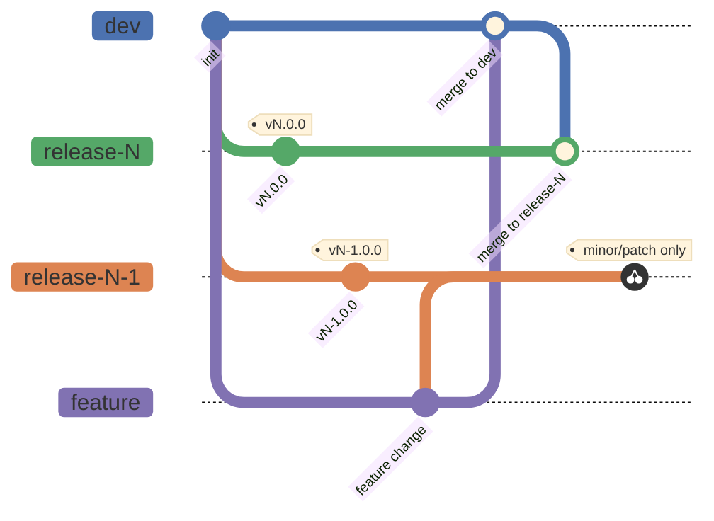

# OKx: release management, algemene regels

## Inhoudsopgave

1. [Inleiding](#1-inleiding)
2. [Wat is een release?](#2-wat-is-een-release)
3. [Versienummering](#3-versienummering)
4. [Compatibiliteit tussen afhankelijke artifacts](#4-compatibiliteit-tussen-afhankelijke-artifacts)
5. [Communicatie naar belanghebbenden](#5-communicatie-naar-belanghebbenden)
6. [Releaseproces](#6-releaseproces)
   - [6.1 Branchstrategie](#61-branchstrategie)

---

## 1. Inleiding

**Aanleiding.** OKx levert meerdere artifacts die elk hun eigen ritme en eigen afnemers hebben. Zonder gedeelde regels bepaalt elk team zelf wanneer iets een release is, wat een versienummer betekent en wat afnemers mogen verwachten. Dan zegt dezelfde versiesprong bij het ene artifact iets anders dan bij het andere, en kan een afnemer er niets aan aflezen.

**Doel.** Dit document legt de release management- en versioneringsregels vast die voor **alle** OKx-artifacts gelden: wat een release is, hoe versienummers worden bepaald, hoe afhankelijke artifacts zich tot elkaar verhouden, en hoe releases worden gecommuniceerd.

**Scope.** Alleen wat voor elk artifact hetzelfde is. Wat per artifact verschilt (eigenaarschap en RACI, wat "breaking" concreet betekent, compatibiliteit met andere artifacts) legt elk artifact zelf vast met het [release management template](Release-management-template.md). Support en deprecatie, de development lifecycle en het inhoudelijke voortbrengingsproces vallen buiten dit document; al het overige eveneens.

---

## 2. Wat is een release?

Een release is het beschikbaar stellen van een artifact of een verzameling van artifacts die als pakket worden aangeboden aan afnemers, met afstemming en toezegging van ondersteuning en stabiliteit voor de inhoud van dat pakket. Dit proces kan iteratief herhaald worden om het pakket te verbeteren; om dit overzichtelijk en beheersbaar te maken worden er versienummers toegepast op het pakket bij elke release.

---

## 3. Versienummering

Elk OKx-artifact gebruikt **Semantic Versioning** (SemVer): een release-label heeft de vorm `MAJOR.MINOR.PATCH` (bijv. `v1.4.2`). De algemene regels staan op [semver.org](https://semver.org/lang/nl/); hieronder de OKx-brede toepassing.

- **MAJOR: breaking.** Een niet-backward-compatibele wijziging: bestaande implementaties of clients die de wijziging niet volgen, worden geadviseerd te migreren naar de nieuwe MAJOR.
- **MINOR: nieuwe, niet-breaking functionaliteit.** Nieuw concept, nieuw optioneel veld, nieuwe enum-waarde, nieuw scenario, nieuw optioneel koppelvlak, zonder bestaande afnemers te breken.
- **PATCH: correctie zonder semantische wijziging.** Tekstcorrecties, verduidelijkingen, voorbeeldfixes en bugfixes die het contract en de betekenis niet veranderen.
- **Eén release, één bumptype.** De zwaarste wijziging in een release bepaalt de bump (één breaking change maakt de hele release major).
---

## 4. Compatibiliteit tussen afhankelijke artifacts

Wanneer artifact B gebouwd wordt op basis van, of afhankelijk is van, artifact A, wordt expliciet vastgelegd hoe hun versienummers zich tot elkaar verhouden. Een bruikbaar patroon: **B deelt de MAJOR-versie van A** als compatibiliteitssignaal; MINOR en PATCH blijven onafhankelijk per artifact.

---

## 5. Communicatie naar belanghebbenden

Elke release (major, minor of patch) wordt via dezelfde **standaardroute** gecommuniceerd: een vaste, herkenbare plek per artifact (bijv. GitHub Releases), met release notes in een vast format (versie, datum, wijzigingen, impact, eventuele actie voor afnemers).

De contributor vult aan de hand van een template de change notes van een feature in bij het maken van een merge request, deze wordt meegenomen als change notes tijdens een release, bij een release met meerdere changes worden de release notes van alle changes samengevoegd. 

**Eigenaar van de communicatie: Product Manager**, tenzij het toepassingsdocument van een pakket iets anders vastlegt. stemt inhoud en timing af met het eigenaar-team ([template §3](Release-management-template.md#3-eigenaarschap)) en zorgt ervoor dat release notes daadwerkelijk verschijnen en bij belanghebbenden landen.

---

## 6. Releaseproces

Dit hoofdstuk legt vast hoe het process van feature tot release pakket is uitgelijnd.

**Rollen**
| Rol | Beschrijving |
|---|---|
| **Contributor** | Persoon die functionele bijdrages levert aan het project, via change requests op een feature branch. |
| **Maintainer** | Persoon die de repository beheert: reviewt en keurt change requests goed en bepaalt wat er op de release branches landt. |
| **Tester / project manager** | Persoon die releases beheert en artifacts toetst aan de kwaliteitsrichtlijnen (Quality Assurance). |

**Procesbeschrijving**
1. Contributor dient een change request in op een feature branch; Maintainer reviewt en keurt goed, waarna de feature branch naar de dev branch merget.
2. De dev branch merget door naar release branch N; niet-breaking wijzigingen worden ook op release branch N-1 toegepast, zodat beide release-lijnen actueel blijven.
3. Voor de wijzigingen wordt de bump bepaald (zwaarste wijziging wint, [§3](#3-versienummering)); voor afhankelijke artifacts wordt ook de compatibiliteit gecheckt ([§4](#4-compatibiliteit-tussen-afhankelijke-artifacts)).
4. De Tester toetst de baseline op release branch N (en, waar van toepassing, N-1) via Quality Assurance aan de kwaliteitsrichtlijnen ([§2](#2-wat-is-een-release)).
5. Na goedkeuring krijgt de baseline het versielabel (`vMAJOR.MINOR.PATCH`) en landt ze als releasepakket (N of N-1) in de release store.
6. Release notes worden gepubliceerd via de standaardroute ([§5](#5-communicatie-naar-belanghebbenden)); PM is eigenaar.

### 6.1 Branchstrategie

De branches in het diagram volgen het GitFlow-patroon: een feature branch is een kloon van de dev branch met de wijzigingen van één change request, de dev branch houdt de meest recente gecureerde versie van de bron, en een release branch draagt de versie waaruit een releasepakket ontstaat.

OKx wijkt op één punt af: er staan twee release branches naast elkaar. Release branch N draagt de actuele major-versie en ontvangt alle wijzigingen uit de dev branch; release branch N-1 draagt de vorige major-versie en ontvangt daaruit alleen minor- en patch-wijzigingen ([§3](#3-versienummering)). Zo blijft de vorige major-versie onderhouden zonder dat er breaking changes in landen.

Elke wijziging loopt via de dev branch. Contributors hebben leestoegang tot de release branches en releasepakketten maar wijzigen die niet direct; de Maintainer beheert wat er op de release branches landt.

---
