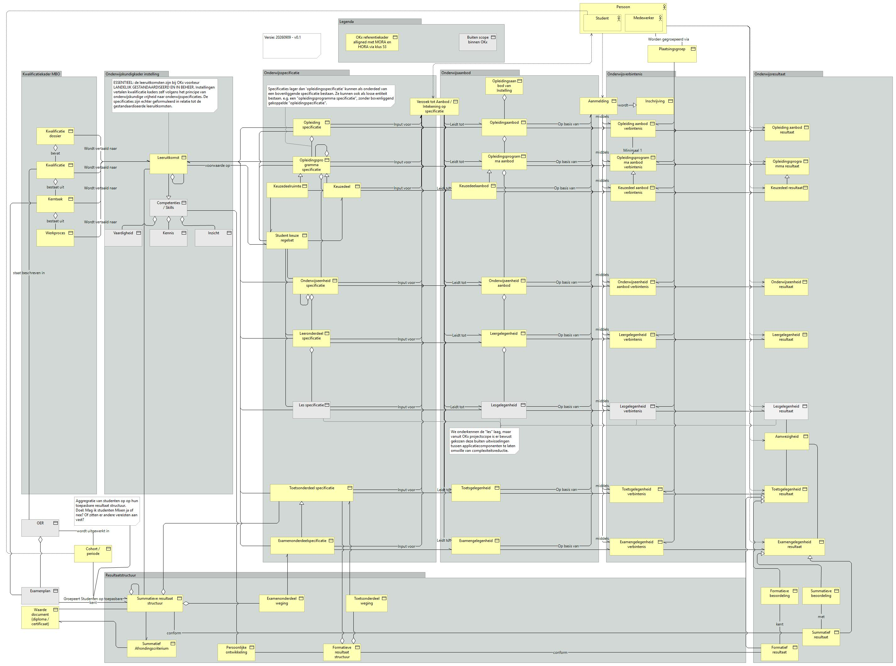
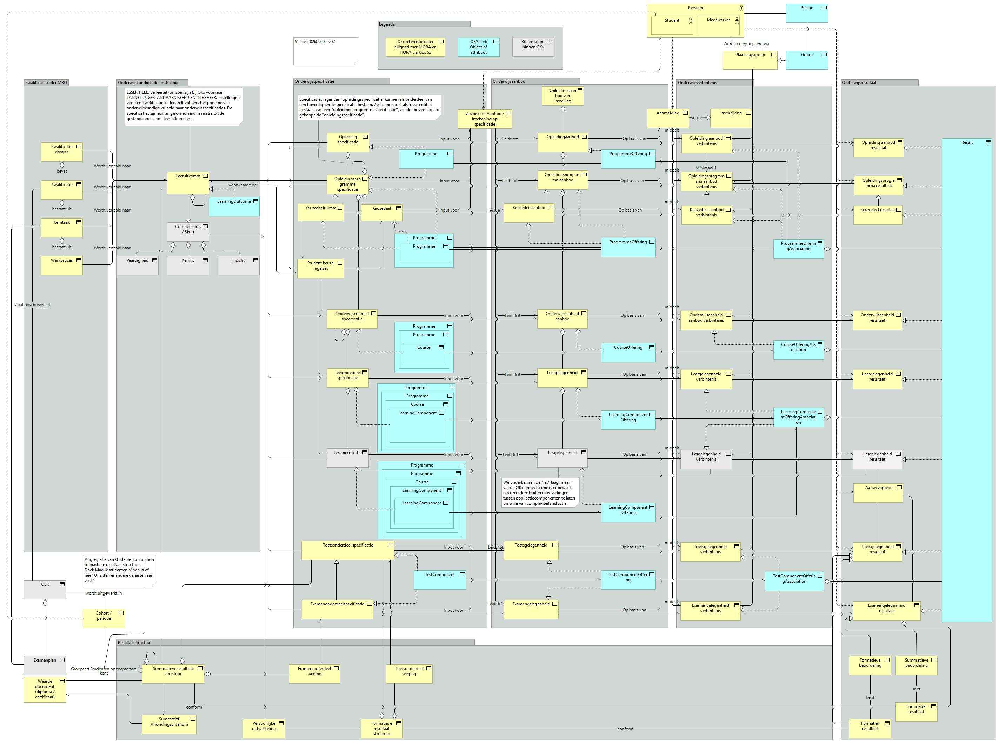
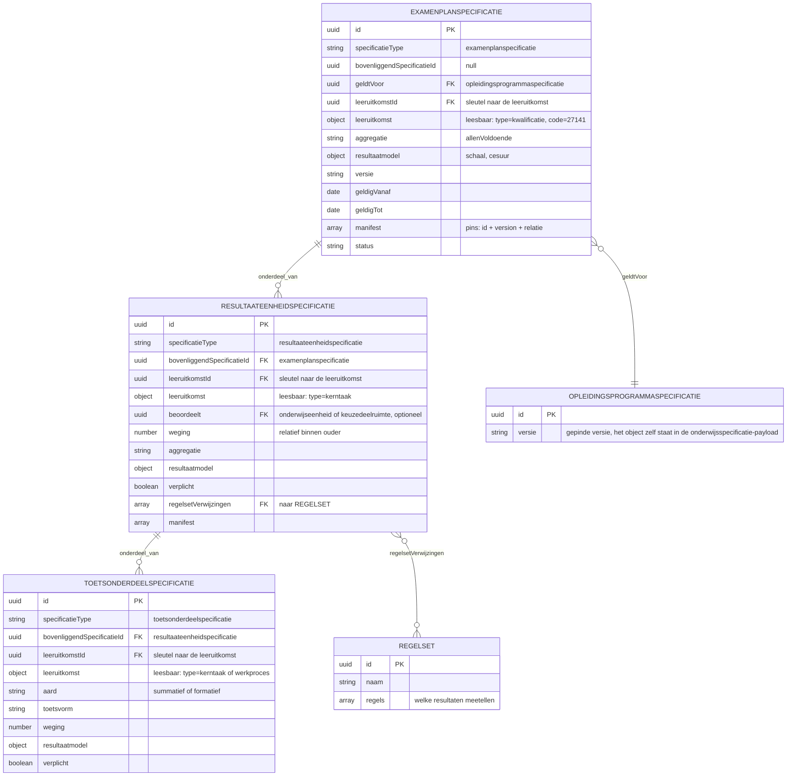
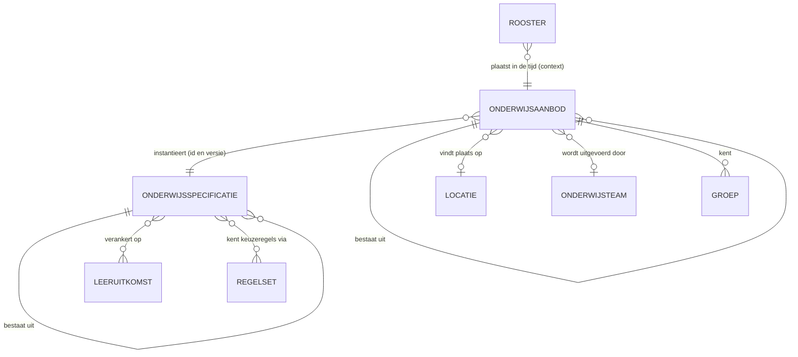
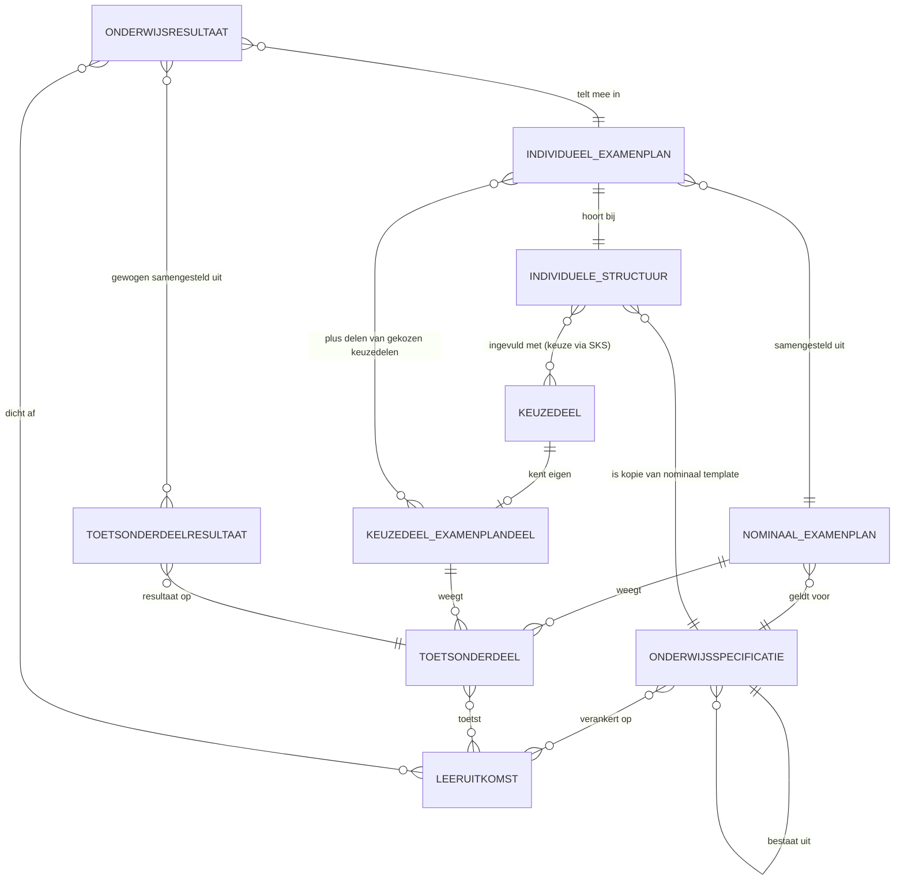
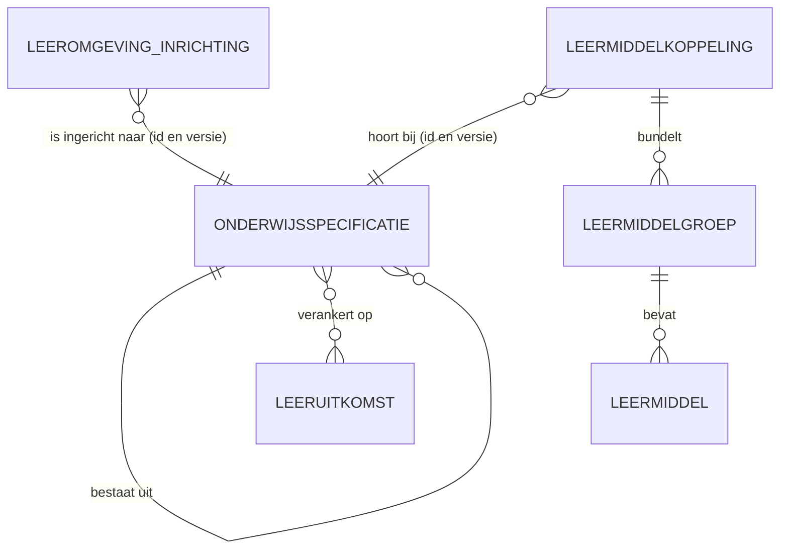

<!-- Gegenereerd door scripts/build-release.py uit release.json. Niet met de hand wijzigen: pas de bronnen aan en bouw opnieuw. -->

# Informatie- en gegevensmodellen

Wat onderwijsgegevens betekenen en in welke vorm ze over een koppeling gaan: de begrippen, het conceptueel informatiemodel, het logisch gegevensmodel, de JSON Schema's en de regels daarbij.

Versie 0.1.0


<!-- pagina-einde -->

## 1 Inleiding

Dit document legt vast wat onderwijsgegevens betekenen en in welke vorm ze over een koppeling gaan: de begrippen en hun definities, de objecttypen en hun samenhang, de entiteiten met hun velden, de JSON Schema's waartegen een implementatie kan valideren, de regels die zo'n schema niet kan uitdrukken, en per koppeling welk deel ervan meegaat.

**Aanleiding.** De modellen zijn eerder als bijlage bij de koppelvlakspecificatie uitgebracht. Ze hebben een eigen ritme: een veld erbij of een strakkere validatie raakt wel elke implementatie die tegen het schema valideert, maar niet de berichtstroom of het endpoint eromheen. Omgekeerd verandert een nieuwe koppelingspecificatie vaak niets aan de vorm van de gegevens. Als bijlage deelden beide noodgedwongen één versienummer, en zei een versiesprong van het ene niets over het andere.

**Context.** OKx modelleert in vier lagen, van betekenis naar techniek. De begrippen leggen vast wat een term betekent; het conceptueel informatiemodel ordent die begrippen en hun samenhang; het logisch gegevensmodel zet dat om in entiteiten, velden en relaties, onafhankelijk van de techniek; het technisch gegevensmodel legt vast hoe dat over de lijn gaat. Dit document draagt alle vier de lagen en verbindt ze: elk objecttype in het informatiemodel staat in de begrippen, met een definitie waar die is vastgesteld en anders als open post; elke entiteit in het logisch model is via de brug in het informatiemodel terug te voeren op een objecttype, of staat daar als nog niet gebrugd; elke entiteit is terug te vinden als schema, en elk schema voor een object is terug te voeren op een entiteit (de schema's voor berichten, zoals een abonnement of een verwerkingsstatus, horen bij de koppeling). Laag 1 en 2 worden in de [meta-repository](https://github.com/Npuls-OKx/meta) gemodelleerd en gereviewd en komen hier als release-variant terecht.

| Laag | Wat de laag vastlegt | Waar |
|---|---|---|
| 1. Begrippen | Wat een term betekent | Dit document |
| 2. Conceptueel informatiemodel | Welke begrippen er zijn en hoe ze samenhangen | Dit document |
| 3. Logisch gegevensmodel | Entiteiten, velden en relaties, techniekonafhankelijk | Dit document |
| 4. Technisch gegevensmodel | De JSON Schema's waartegen een implementatie valideert | Dit document |

De [koppelvlakspecificatie](../Koppelvlakspecificaties/inleiding.md) beschrijft welke applicatiediensten een systeem implementeert en welk berichtverkeer daaroverheen gaat; zij verwijst naar dit pakket op een vastgelegde versie voor de vorm van wat er in die berichten zit. Deze modellen zijn **alfa en indicatief** ([U1](../Koppelvlakspecificaties/uitgangspunten.md#u1-indicatief-en-onderbouwend-niet-voorschrijvend)) en volgen de payloadvorm uit [U7](../Koppelvlakspecificaties/uitgangspunten.md#u7-payload-plat-met-verwijzingen-en-de-sleutelconventie): plat, met verwijzingen tussen objecten in plaats van nesting, zodat een consument alleen ophaalt wat hij nodig heeft.

**Doel.** Een bouwer moet hieruit kunnen afleiden wat een term betekent, welke objecten er zijn, hoe ze samenhangen, welke velden ze dragen, en wat er geldt bovenop wat het schema afdwingt. Geslaagd is het document wanneer twee partijen die er onafhankelijk tegenaan bouwen berichten uitwisselen die elkaar begrijpen.

**Scope.** De begrippen met hun definitie en de relatie met MORA en het Kernmodel Onderwijsinformatie, het conceptueel informatiemodel met de ontwerpkeuzes en de mapping op OEAPI v6, het logisch gegevensmodel met de regels daarbij, het technisch gegevensmodel met de voorbeeldpayloads en de mapping van Engelse veldnamen naar hun Nederlandse oorsprong, en de gebruiksprofielen per koppeling. Welke velden een koppeling gebruikt en waarom staat in de payload-specificatie van die koppeling, in de koppelvlakspecificatie; die is daarin leidend. HORA als derde referentiekader is nog niet onderzocht en staat als zodanig gemarkeerd. De interne structuur van een regelset, de endpoints waarover een payload gaat en de technische ontsluiting in OpenAPI vallen erbuiten, en al het overige eveneens.


<!-- pagina-einde -->

## Inhoudsopgave

- [1 Inleiding](#1-inleiding)
- [2 Begrippenlijst OKx](#2-begrippenlijst-okx)
  - [2.1 Context](#21-context)
  - [2.2 Inleiding](#22-inleiding)
  - [2.3 Doel](#23-doel)
  - [2.4 Scope](#24-scope)
  - [2.5 Dekking](#25-dekking)
  - [2.6 Begrippenfamilies](#26-begrippenfamilies)
  - [2.7 Objecttypen met een definitie](#27-objecttypen-met-een-definitie)
  - [2.8 Objecttypen zonder definitie](#28-objecttypen-zonder-definitie)
  - [2.9 Mapping naar de referentiekaders](#29-mapping-naar-de-referentiekaders)
  - [2.10 Objecten uit de kaders zonder OKx-objecttype](#210-objecten-uit-de-kaders-zonder-okx-objecttype)
  - [2.11 Verwante documenten](#211-verwante-documenten)
- [3 Conceptueel informatiemodel](#3-conceptueel-informatiemodel)
  - [3.1 Context](#31-context)
  - [3.2 Inleiding](#32-inleiding)
  - [3.3 Doel](#33-doel)
  - [3.4 Scope](#34-scope)
  - [3.5 Lezers en detailniveau](#35-lezers-en-detailniveau)
  - [3.6 Begrippenfamilies](#36-begrippenfamilies)
  - [3.7 Notatie](#37-notatie)
  - [3.8 Ontwerpkeuzes](#38-ontwerpkeuzes)
  - [3.9 Naar het logisch gegevensmodel](#39-naar-het-logisch-gegevensmodel)
  - [3.10 Verwante documenten](#310-verwante-documenten)
  - [3.11 Informatiemodel OKx naast OEAPI v6](#311-informatiemodel-okx-naast-oeapi-v6)
    - [3.11.1 Context](#3111-context)
    - [3.11.2 Inleiding](#3112-inleiding)
    - [3.11.3 Doel](#3113-doel)
    - [3.11.4 Scope](#3114-scope)
    - [3.11.5 Notatie](#3115-notatie)
    - [3.11.6 Dekking door OEAPI v6](#3116-dekking-door-oeapi-v6)
    - [3.11.7 Verwante documenten](#3117-verwante-documenten)
- [4 Logisch gegevensmodel](#4-logisch-gegevensmodel)
  - [4.1 Onderwijsspecificatie](#41-onderwijsspecificatie)
  - [4.2 Onderwijsaanbod](#42-onderwijsaanbod)
  - [4.3 Resultaatstructuur en examenplan](#43-resultaatstructuur-en-examenplan)
  - [4.4 Onderwijscatalogus naar planning en roostering](#44-onderwijscatalogus-naar-planning-en-roostering)
  - [4.5 Onderwijscatalogus naar studentinformatiesysteem](#45-onderwijscatalogus-naar-studentinformatiesysteem)
  - [4.6 Onderwijscatalogus naar leermanagementsysteem](#46-onderwijscatalogus-naar-leermanagementsysteem)
  - [4.7 Regels bij de schema's](#47-regels-bij-de-schemas)
- [5 Technisch gegevensmodel](#5-technisch-gegevensmodel)
  - [5.1 address.json](#51-addressjson)
  - [5.2 bottleneck.json](#52-bottleneckjson)
  - [5.3 code.json](#53-codejson)
  - [5.4 education-offering.json](#54-education-offeringjson)
  - [5.5 education-specification-delta.json](#55-education-specification-deltajson)
  - [5.6 education-specification.json](#56-education-specificationjson)
  - [5.7 geolocation.json](#57-geolocationjson)
  - [5.8 group.json](#58-groupjson)
  - [5.9 learning-outcome-designation.json](#59-learning-outcome-designationjson)
  - [5.10 learning-outcome.json](#510-learning-outcomejson)
  - [5.11 location.json](#511-locationjson)
  - [5.12 manifest-item.json](#512-manifest-itemjson)
  - [5.13 organisation-unit.json](#513-organisation-unitjson)
  - [5.14 period.json](#514-periodjson)
  - [5.15 processing-status.json](#515-processing-statusjson)
  - [5.16 result-model.json](#516-result-modeljson)
  - [5.17 result-structure.json](#517-result-structurejson)
  - [5.18 rule-set.json](#518-rule-setjson)
  - [5.19 source.json](#519-sourcejson)
  - [5.20 specification-changed.json](#520-specification-changedjson)
  - [5.21 specification-reference.json](#521-specification-referencejson)
  - [5.22 specification-status-changed.json](#522-specification-status-changedjson)
  - [5.23 subscription.json](#523-subscriptionjson)
  - [5.24 volume.json](#524-volumejson)
  - [5.25 Voorbeeldpayloads](#525-voorbeeldpayloads)
    - [5.25.1 Voorbeeld onderwijsspecificatie](#5251-voorbeeld-onderwijsspecificatie)
    - [5.25.2 Voorbeeld onderwijsaanbod](#5252-voorbeeld-onderwijsaanbod)
    - [5.25.3 Voorbeeld resultaatstructuur en examenplan](#5253-voorbeeld-resultaatstructuur-en-examenplan)
  - [5.26 Mapping veldnamen](#526-mapping-veldnamen)
    - [5.26.1 Abonnement — Subscription](#5261-abonnement--subscription)
    - [5.26.2 Adres — Address](#5262-adres--address)
    - [5.26.3 Bron — Source](#5263-bron--source)
    - [5.26.4 Code — Code](#5264-code--code)
    - [5.26.5 Geolocatie — Geolocation](#5265-geolocatie--geolocation)
    - [5.26.6 Groep — Group](#5266-groep--group)
    - [5.26.7 Knelpunt — Bottleneck](#5267-knelpunt--bottleneck)
    - [5.26.8 Leeruitkomst-aanduiding — Learning outcome designation](#5268-leeruitkomst-aanduiding--learning-outcome-designation)
    - [5.26.9 Leeruitkomst — Learning outcome](#5269-leeruitkomst--learning-outcome)
    - [5.26.10 Locatie — Location](#52610-locatie--location)
    - [5.26.11 Manifest-item — Manifest item](#52611-manifest-item--manifest-item)
    - [5.26.12 Omvang — Volume](#52612-omvang--volume)
    - [5.26.13 Onderwijsaanbod — Education offering](#52613-onderwijsaanbod--education-offering)
    - [5.26.14 Onderwijsspecificatie-delta — Education specification delta](#52614-onderwijsspecificatie-delta--education-specification-delta)
    - [5.26.15 Onderwijsspecificatie — Education specification](#52615-onderwijsspecificatie--education-specification)
    - [5.26.16 OrganisatieEenheid — Organisation unit](#52616-organisatieeenheid--organisation-unit)
    - [5.26.17 Periode — Period](#52617-periode--period)
    - [5.26.18 Regelset — Rule set](#52618-regelset--rule-set)
    - [5.26.19 Resultaatmodel — Result model](#52619-resultaatmodel--result-model)
    - [5.26.20 Resultaatstructuur en examenplan — Result structure and exam plan](#52620-resultaatstructuur-en-examenplan--result-structure-and-exam-plan)
    - [5.26.21 Specificatie-gewijzigd — Specification changed](#52621-specificatie-gewijzigd--specification-changed)
    - [5.26.22 Specificatie-referentie — Specification reference](#52622-specificatie-referentie--specification-reference)
    - [5.26.23 Specificatie-status-gewijzigd — Specification status changed](#52623-specificatie-status-gewijzigd--specification-status-changed)
    - [5.26.24 Verwerkingsstatus — Processing status](#52624-verwerkingsstatus--processing-status)
- [6 Gebruiksprofielen](#6-gebruiksprofielen)
  - [6.1 Onderwijscatalogus naar planning en roostering](#61-onderwijscatalogus-naar-planning-en-roostering)
  - [6.2 Onderwijscatalogus naar studentinformatiesysteem](#62-onderwijscatalogus-naar-studentinformatiesysteem)
  - [6.3 Onderwijscatalogus naar leermanagementsysteem](#63-onderwijscatalogus-naar-leermanagementsysteem)

<!-- pagina-einde -->

## 2 Begrippenlijst OKx

### 2.1 Context

De koppelvlakken van OKx wisselen informatie uit tussen instellingen en tussen systemen. Dat werkt alleen als een term aan beide kanten hetzelfde betekent.

### 2.2 Inleiding

Deze lijst geeft per begrip de schrijfwijze, een definitie en de vindplaats van die definitie, en legt elk begrip naast de referentiearchitecturen: de mbo-referentiearchitectuur (MORA), het Kernmodel Onderwijsinformatie (KOI) binnen de Referentiearchitectuur Onderwijs (ROSA), en de referentiearchitectuur van het hoger onderwijs (HORA). Een begrip zonder vindplaats staat er als open post in.

### 2.3 Doel

Vaststellen wat OKx onder een term verstaat, zodat een lezer van een specificatie niet hoeft te raden. De lijst is de toetssteen voor naamgeving in het informatiemodel, de koppelvlakspecificaties en de reviews.

### 2.4 Scope

De objecttypen en begrippen van het informatiemodel OKx, elk eerst gelegd naast MORA en het Kernmodel Onderwijsinformatie binnen ROSA. HORA is nog niet onderzocht. Termen uit de rest van de documentatie vallen buiten deze versie.

Gezocht in de volledige lijst van het MORA-informatiemodel (81 informatieobjecten, https://mora.mbodigitaal.nl/index.php/Informatiemodel) en in het volledige overzicht van het Kernmodel Onderwijsinformatie (https://rosa.wikixl.nl/index.php/Kernmodel_Onderwijsinformatie), opgehaald op 9 september 2026 en opnieuw op 14 september 2026. Een begrip dat in beide lijsten ontbreekt staat als 'geen tegenhanger gevonden'.

### 2.5 Dekking

De kaders zijn geraadpleegd op 14 september 2026.

| | |
|---|---|
| Begrippen en objecttypen | 69 |
| Met een definitie uit een referentiekader | 18 |
| Met een definitie uit een OKx-document | 18 |
| Zonder definitie | 33 |

### 2.6 Begrippenfamilies

De begrippenfamilies delen de keten in; het zijn de kolommen op de plaat van het [informatiemodel](#36-begrippenfamilies). De objecttypen eronder zijn het conceptuele informatiemodel.

| Begrip | Definitie | Herkomst | Bron |
|---|---|---|---|
| `Kwalificatiekader mbo` | Het geheel van landelijk vastgestelde eisen waaraan een opleiding moet voldoen. Vastgesteld en beheerd buiten OKx | nieuw voor OKx | [informatiemodel.md](#36-begrippenfamilies) |
| `Onderwijskundig kader instelling` | De invulling door de instelling van de beoogde leeruitkomsten uit het kwalificatiekader | nieuw voor OKx | [informatiemodel.md](#36-begrippenfamilies) |
| `Onderwijsspecificatie` | Het herbruikbare ontwerp van een onderwijsonderdeel, los van wanneer het draait en wie eraan meedoet | verbijzondering van `onderwijsaanbod (koi)` (ROSA-KOI) | [informatiemodel.md](#36-begrippenfamilies) |
| `Onderwijsaanbod` | Een specificatie die is ingepland: een periode, een capaciteit en waar van toepassing concrete plek, docent en tijd | verbijzondering van `onderwijsaanbod (koi)` (ROSA-KOI) | [informatiemodel.md](#36-begrippenfamilies) |
| `Onderwijsverbintenis` | Een afspraak voor het gaan volgen, volgen en hebben gevolgd van onderwijs. | overgenomen uit ROSA-KOI | [onderwijsdeelname (koi)](https://rosa.wikixl.nl/index.php/Id-ec977035c9be4b01bb1c14a5950a1799) |
| `Onderwijsresultaat` | Vastgelegde en geformaliseerde beoordeling op basis van een of meer leerresultaten. | overgenomen uit ROSA-KOI | [onderwijsresultaat (koi)](https://rosa.wikixl.nl/index.php/Id-e5d21e5384c0482ba4a501571e69927a) |
| `Resultaatstructuur` | De samenstelling en weging waarmee losse resultaten optellen tot een uitspraak over de beoogde leeruitkomsten, en daarmee over een kwalificatie of certificaat | nieuw voor OKx | [informatiemodel.md](#36-begrippenfamilies) |

### 2.7 Objecttypen met een definitie

Bij een verbijzondering gaat OKx verder dan het kader; de reden staat in de laatste kolom. Een noot geeft aan waar een citaat een oudere naam of schrijfwijze gebruikt.

| Objecttype | Begrip | Definitie | Herkomst | Bron | Reden of noot |
|---|---|---|---|---|---|
| `Examenplan` | Buiten de kolommen | Het examenplan geeft per kwalificatie een overzicht van de examenonderdelen en examens die een mbo-school inzet voor de examinering (kwalificerende beoordeling). Het examenplan geeft inzicht in de onderdelen die een student met een voldoende moet afsluiten om in aanmerking te komen voor een diploma. In het examenplan staat binnen welke omgeving (mbo-school of beroepspraktijk) de examens plaatsvinden. Hierbij houdt de school rekening met de praktische haalbaarheid van de examinering binnen de praktijksituatie en de afspraken in het sectoraal examenprofiel. In een examenplan staan de examenonderdelen en examens voor de beroepsgerichte eisen en de generieke taal- en rekeneisen. Ook de wijze waarop een school deze onderdelen examineert, staat in het examenplan. | overgenomen uit MORA | [Examenplan](https://mora.mbodigitaal.nl/index.php/Id-913bf380-1288-8a49-0bca-906d8b112e8f) |  |
| `Medewerker` | Buiten de kolommen | Een natuurlijk persoon die op grond van een overeenkomst werkzaam is voor een onderwijsorganisatie. | overgenomen uit ROSA-KOI | [onderwijsmedewerker (koi)](https://rosa.wikixl.nl/index.php/Id-5ea4d7d18cbc4f8eb3aea997a4d9b35d) |  |
| `Student` | Buiten de kolommen | Een persoon die aan onderwijsactiviteiten deelneemt of dat wil gaan doen. Dit omvat ingeschreven studenten, potentiële studenten en alumni | overgenomen uit MORA | [Student](https://mora.mbodigitaal.nl/index.php/Id-c7c163ee-2fa5-5b58-bc08-f401d0350c3a) |  |
| `Verzoek tot Aanbod / Intekening op specificatie` | Buiten de kolommen | Het `Verzoek tot Aanbod / Intekening op specificatie` is een verzoek om aanbod te maken voor een specificatie. Het heeft specificaties als input en leidt tot aanbod; of intekenen op bestaand aanbod hetzelfde is, is nog niet vastgesteld. | verbijzondering van `Leervraag` (MORA) | [informatiemodel.md](#38-ontwerpkeuzes) | MORA kent de leervraag als de vraag van de student wat hij wil leren. OKx verbijzondert die tot een uitwisselbaar verzoek dat leidt tot aanbod. De aanmelding (het verzoek om toegelaten te worden tot een opleiding) blijft, net als de inschrijving, bij het studentinformatiesysteem. |
| `Waarde document (diploma / certificaat)` | Buiten de kolommen | Het bewijsstuk van een eindoordeel over het voltooien van een opleiding, keuzedeel, deelkwalificatie of module door een onderwijsaanbieder. | overgenomen uit MORA | [Waarde document (diploma / certificaat)](https://mora.mbodigitaal.nl/index.php/Id-8647eba0-e31d-5bcf-c12a-4d477069943c) |  |
| `Kerntaak` | Kwalificatiekader mbo | Een kerntaak is een substantieel deel van de beroepsuitoefening naar belang omvang (tijdsbeslag of frequentie) of beide. Een kerntaak bestaat uit een geheel van inhoudelijk met elkaar samenhangende werkprocessen kenmerkend voor de beroepsuitoefening. Een kwalificatiedossier heeft een beperkt aantal kerntaken. Alle kerntaken samen beschrijven de essentie van de beroepsuitoefening van de betreffende beroepengroep. | overgenomen uit MORA | [Kerntaak](https://mora.mbodigitaal.nl/index.php/Id-99ef9489-49b3-4a3b-7a89-08ae36a3255e) |  |
| `Kwalificatie` | Kwalificatiekader mbo | De kwalificatie is de combinatie van het basis- en profieldeel uit het kwalificatiedossier. De kwalificatie omvat wat de beginnend beroepsbeoefenaar moet kennen en kunnen als hij gediplomeerd is en start op de arbeidsmarkt | overgenomen uit MORA | [Kwalificatie](https://mora.mbodigitaal.nl/index.php/Id-f54b73a9-9562-2b28-deca-724e992bbcdb) |  |
| `Kwalificatie dossier` | Kwalificatiekader mbo | Het kwalificatiedossier beschrijft de eisen waaraan een student moet voldoen om zijn diploma te behalen. Elk dossier bevat een of meer kwalificaties en iedere kwalificatie leidt tot een diploma. Alle kwalificatiedossiers samen, aangevuld met de keuzedelen, vormen de kwalificatiestructuur. Een kwalificatiedossier bestaat uit een basisdeel en een of meer profieldelen. Het basisdeel bevat de generieke onderdelen Nederlandse taal, rekenen, loopbaan en burgerschap en Engels (uitsluitend voor niveau 4). Verder bevat het gemeenschappelijke elementen, die gelden voor alle kwalificaties in het dossier: kerntaken, werkprocessen, vakkennis, vaardigheden en houdingsaspecten. Het profieldeel beschrijft de specifieke onderdelen. Keuzedelen zijn een plus op de kwalificatie en maken de opleiding compleet. | overgenomen uit MORA | [Kwalificatie dossier](https://mora.mbodigitaal.nl/index.php/Id-3389d485-20a7-6e53-21df-d09eb49d4762) |  |
| `Werkproces` | Kwalificatiekader mbo | Een werkproces is een afgebakend geheel van beroepshandelingen binnen een kerntaak. Het werkproces kent een begin en een eind heeft een resultaat en wordt als kenmerkend herkend in de beroepspraktijk. Een werkproces bestaat dus nooit uit één handeling of gedraging. Meerdere werkprocessen kunnen gelijktijdig lopen. Dat ze een begin en eind hebben wil niet per se zeggen dat ze na elkaar komen maar dat ze duidelijk te onderscheiden zijn van andere werkprocessen. | overgenomen uit MORA | [Werkproces](https://mora.mbodigitaal.nl/index.php/Id-9cf4d404-b06c-473f-57d9-3945af33cfa8) |  |
| `Examengelegenheid` | Onderwijsaanbod | Het georganiseerde aanbod van een examenmoment: planning, locatie, surveillant-capaciteit en kandidaten, gekoppeld aan precies één `Examenspecificatie`. | afgeleid uit het vlakkenmodel, afgestemd op klus 53 | [leerroute-1-regulier.md](../Referentiemateriaal/kaderscenario's/leerroute-1-regulier.md#betrokken-informatie-bij-proces) | Het citaat noemt `Examenspecificatie`; in het informatiemodel heet dat objecttype `Examenonderdeelspecificatie`. |
| `Opleidingaanbod` | Onderwijsaanbod | Een opleidingseenheid die door een onderwijsaanbieder aangeboden wordt in een bepaalde vorm, al dan niet op een bepaalde onderwijslocatie, waarop een onderwijsvolger zich kan inschrijven | overgenomen uit MORA | [Aangeboden opleiding](https://mora.mbodigitaal.nl/index.php/Id-e723f9e6-adfc-40a1-0527-ee1b75b380dc) |  |
| `Opleidingsaanbod van Instelling` | Onderwijsaanbod | Het geheel van opleiding dat door de instelling wordt aangeboden | overgenomen uit MORA | [Opleidingen overzicht](https://mora.mbodigitaal.nl/index.php/Id-9a23241c-a60e-6623-e13a-d945a761ab17) |  |
| `Toetsgelegenheid` | Onderwijsaanbod | Het georganiseerde aanbod van een toetsmoment: wanneer, waar en onder welke condities een toetsonderdeel wordt afgenomen, gekoppeld aan precies één `Toetsonderdeel-specificatie`. | afgeleid uit het vlakkenmodel, afgestemd op klus 53 | [leerroute-1-regulier.md](../Referentiemateriaal/kaderscenario's/leerroute-1-regulier.md#betrokken-informatie-bij-proces) | Het citaat schrijft `Toetsonderdeel-specificatie` met koppelteken, de oudere schrijfwijze van `Toetsonderdeel specificatie`. |
| `Leeruitkomst` | Onderwijskundig kader instelling | Een leeruitkomst is de invulling door de instelling van wat het kwalificatiekader beoogt: wat een student moet kennen en kunnen, zo geformuleerd dat specificaties ernaar kunnen verwijzen en dat behaalde toets- en examenresultaten er het bewijs voor leveren. | afgeleid uit het vlakkenmodel, afgestemd op klus 53 | [informatiemodel.md](#38-ontwerpkeuzes) |  |
| `Formatief resultaat` | Onderwijsresultaat | Een waardering die de student informatie geeft over de kwaliteit en voortgang van zijn of haar leren, maar niet meetelt voor de uiteindelijke kwalificering. Formatieve resultaten worden vastgelegd conform de formatieve resultaatstructuur. Formatieve resultaten worden ook wel toetsresultaten genoemd | overgenomen uit MORA | [Formatief resultaat](https://mora.mbodigitaal.nl/index.php/Id-2bd2c72b-08d2-169d-9ed1-f4868ad34f5c) |  |
| `Formatieve beoordeling` | Onderwijsresultaat | Een beoordeling, veelal van een toets, die niet meetelt voor de uiteindelijke kwalificering, maar de lerende informatie geeft over de kwaliteit van zijn of haar leren | overgenomen uit MORA | [Formatieve beoordeling](https://mora.mbodigitaal.nl/index.php/Id-26fa321c-d407-817f-68c5-5509997d821b) |  |
| `Summatief resultaat` | Onderwijsresultaat | Een formele, door de instelling geregistreerde waardering voor summatief gemaakt werk (zoals een examen of BPV-beoordeling) die meetelt voor de uiteindelijke kwalificering. Summatieve resultaten worden vastgelegd conform de summatieve resultaatstructuur. Summatieve resultaten worden ook wel examenresultaten genoemd | overgenomen uit MORA | [Summatief resultaat](https://mora.mbodigitaal.nl/index.php/Id-beaf106a-f329-b3ed-e513-6814b1fd65fa) |  |
| `Summatieve beoordeling` | Onderwijsresultaat | De beoordeling van summatief gemaakt werk, zoals de beoordeling van een examen of een BPV-beoordeling | overgenomen uit MORA | [Summatieve beoordeling](https://mora.mbodigitaal.nl/index.php/Id-0a14e5af-bf2e-2584-3320-095341367128) |  |
| `Examenonderdeelspecificatie` | Onderwijsspecificatie | De specificatie van een summatief examen (opstelling, instrumenten, beoordelingskader) zoals vastgesteld door de examencommissie, gekoppeld aan te behalen leeruitkomsten of werkprocessen. | verbijzondering van `Examen` (MORA) | [leerroute-1-regulier.md](../Referentiemateriaal/kaderscenario's/leerroute-1-regulier.md#betrokken-informatie-bij-proces) | MORA beschrijft het examen als onderzoek naar kennis, inzicht, houding en vaardigheden. OKx specificeert het examenonderdeel apart van de examengelegenheid waarop het wordt afgenomen. De bron schrijft `Examenspecificatie`; op de plaat heet het objecttype `Examenonderdeelspecificatie` (ontwerpkeuze 9: een examenonderdeel is een specialisatie van een toetsonderdeel). |
| `Keuzedeelruimte` | Onderwijsspecificatie | Een keuzedeelruimte is een oningevuld keuzedeel: onderwijskundig vrijgemaakte ruimte van een bepaalde omvang waarin een student een keuzedeel kiest. | nieuw voor OKx | [informatiemodel.md](#38-ontwerpkeuzes) |  |
| `Leeronderdeel specificatie` | Onderwijsspecificatie | De specificatie van het deel van de onderwijseenheid (onder meer bestaande uit lesstof en opdrachten) waarin de student competenties kan verwerven. | afgeleid uit klus 53 (alignment MORA en HORA) | [leerroute-1-regulier.md](../Referentiemateriaal/kaderscenario's/leerroute-1-regulier.md#betrokken-informatie-bij-proces) | MORA beschrijft de leertaak als lesstof en opdrachten. OKx maakt daar een herbruikbare specificatie van, binnen de onderwijseenheid. |
| `Les specificatie` | Onderwijsspecificatie | De specificatie van het kleinste geplande leermoment binnen een leeronderdeel: welke lesinhoud, leeractiviteit of toetsactiviteit in dat moment wordt aangeboden. | afgeleid uit het vlakkenmodel, afgestemd op klus 53 | [leerroute-1-regulier.md](../Referentiemateriaal/kaderscenario's/leerroute-1-regulier.md#betrokken-informatie-bij-proces) |  |
| `Onderwijseenheid specificatie` | Onderwijsspecificatie | De specificatie van de fundamentele eenheid waarin onderwijs wordt ontworpen en aangeboden, in de vorm van een samenhangend stelsel van één of meer (beoogde) leeruitkomsten, leeronderdelen en/of toetsonderdelen. (NB: Leeruitkomsten omvat o.a. kennis, inzicht en vaardigheden.) | afgeleid uit klus 53 (alignment MORA en HORA) | [leerroute-1-regulier.md](../Referentiemateriaal/kaderscenario's/leerroute-1-regulier.md#betrokken-informatie-bij-proces) | KOI beschrijft de onderwijseenheid als samenhangend geheel met een leerdoel. OKx specificeert die eenheid met leeruitkomsten, leeronderdelen en toetsonderdelen, los van de inplanning. |
| `Opleidingsprogramma specificatie` | Onderwijsspecificatie | Een samenhangende verzameling van één of meer (deel)programma's, onderwijseenheden, of leeruitkomsten die kunnen leiden tot een kwalificatie. | afgeleid uit klus 53 (alignment MORA en HORA) | [leerroute-1-regulier.md](../Referentiemateriaal/kaderscenario's/leerroute-1-regulier.md#betrokken-informatie-bij-proces) | De specificatiekant van het MORA-begrip onderwijs programma. MORA beschrijft het programma inclusief de planbaarheid; OKx scheidt de specificatie van het aanbod. |
| `Toetsonderdeel specificatie` | Onderwijsspecificatie | De specificatie van het deel van de onderwijseenheid (bestaand uit een onderzoek naar kennis, inzicht, houding en vaardigheden van de student), waarmee wordt vastgesteld over welke competenties de student beschikt, leidend tot een formatieve of summatieve beoordeling. | afgeleid uit het vlakkenmodel, afgestemd op klus 53 | [leerroute-1-regulier.md](../Referentiemateriaal/kaderscenario's/leerroute-1-regulier.md#betrokken-informatie-bij-proces) |  |
| `Examengelegenheid verbintenis` | Onderwijsverbintenis | De relatie tussen kandidaat en `Examengelegenheid`: inschrijving op en deelname aan de examenafname. | verbijzondering van `Examen deelname` (MORA) | [leerroute-1-regulier.md](../Referentiemateriaal/kaderscenario's/leerroute-1-regulier.md#betrokken-informatie-bij-proces) | MORA registreert de examensessie waarin een examen wordt afgenomen. OKx legt de relatie vast tussen de kandidaat en de examengelegenheid, met dezelfde informatiestructuur als de toetsgelegenheidverbintenis. |
| `Toetsgelegenheid verbintenis` | Onderwijsverbintenis | De relatie tussen een persoon en een `Toetsgelegenheid`: de feitelijke (voorbereide of lopende) deelname aan dat toetsmoment. | afgeleid uit het vlakkenmodel, afgestemd op klus 53 | [leerroute-1-regulier.md](../Referentiemateriaal/kaderscenario's/leerroute-1-regulier.md#betrokken-informatie-bij-proces) |  |
| `Formatieve resultaat structuur` | Resultaatstructuur | Structuur voor de geordende vastlegging van formatieve resultaten bij een opleidingsonderdeel. Per opleidingsonderdeel kunnen één of meerdere resultaatstructuren worden gemaakt. Een formatieve resultaatstructuur bestaat uit een aantal toetsen waarvan de formatieve resultaten kunnen vastgelegd en een berekeningswijze om tot een eindresultaat voor het opleidingsonderdeel als geheel te komen | overgenomen uit MORA | [Formatieve resultaat structuur](https://mora.mbodigitaal.nl/index.php/Id-a5f45830-ae81-5110-df27-b47e642a54a3) |  |
| `Summatieve resultaat structuur` | Resultaatstructuur | Structuur voor de geordende vastlegging van summatieve resultaten bij een onderwijsprogramma. Een summatieve resultaatstructuur bestaat uit een aantal examens of examenonderdelen waarvan de summatieve resultaten kunnen worden vastgelegd en een berekeningswijze om tot een eindresultaat voor het onderwijsprogramma als geheel te komen | overgenomen uit MORA | [Summatieve resultaat structuur](https://mora.mbodigitaal.nl/index.php/Id-a3020bda-2b3d-d3ac-ea08-a5be84de56cc) |  |

### 2.8 Objecttypen zonder definitie

Deze objecttypen staan op de plaat maar hebben nog geen definitie. Waar een kader een tegenhanger kent is dat een verbijzondering waarvan de eigen definitie nog ontbreekt; de mapping hieronder toont de tegenhanger en de reden.

| Begrip | Objecttypen |
|---|---|
| Buiten de kolommen | `Persoon`, `Plaatsingsgroep` |
| Onderwijsaanbod | `Keuzedeelaanbod`, `Leergelegenheid`, `Lesgelegenheid`, `Onderwijseenheid aanbod`, `Opleidingsprogramma aanbod` |
| Onderwijskundig kader instelling | `Competenties / Skills`, `Inzicht`, `Kennis`, `Vaardigheid` |
| Onderwijsresultaat | `Aanwezigheid`, `Examengelegenheid resultaat`, `Keuzedeel resultaat`, `Leergelegenheid resultaat`, `Lesgelegenheid resultaat`, `Onderwijseenheid resultaat`, `Opleiding aanbod resultaat`, `Opleidingsprogramma resultaat`, `Toetsgelegenheid resultaat` |
| Onderwijsspecificatie | `Keuzedeel`, `Opleiding specificatie`, `Student keuze regelset` |
| Onderwijsverbintenis | `Keuzedeel aanbod verbintenis`, `Leergelegenheid verbintenis`, `Lesgelegenheid verbintenis`, `Onderwijseenheid aanbod verbintenis`, `Opleiding aanbod  verbintenis`, `Opleidingsprogramma aanbod verbintenis` |
| Resultaatstructuur | `Examenonderdeel weging`, `Persoonlijke ontwikkeling`, `Summatief Afrondingscriterium`, `Toetsonderdeel weging` |

### 2.9 Mapping naar de referentiekaders

Per kader een van drie uitkomsten: een tegenhanger met link, `geen tegenhanger gevonden`, of `nog niet onderzocht`. Bij een verbijzondering staat de reden erbij.

| Begrip of objecttype | ROSA-KOI | MORA | HORA | Reden bij verbijzondering |
|---|---|---|---|---|
| `Kwalificatiekader mbo` | geen tegenhanger gevonden | geen tegenhanger gevonden | nog niet onderzocht |  |
| `Onderwijsaanbod` | [`onderwijsaanbod (koi)`](https://rosa.wikixl.nl/index.php/Id-6d1ed39571de4ee5b1aefcf051991478) (verbijzondering) | geen tegenhanger gevonden | nog niet onderzocht | KOI vat ontwerp en uitvoering samen in een begrip. OKx splitst dat in de onderwijsspecificatie, het herbruikbare ontwerp, en het onderwijsaanbod, de ingeplande uitvoering. |
| `Onderwijskundig kader instelling` | geen tegenhanger gevonden | geen tegenhanger gevonden | nog niet onderzocht |  |
| `Onderwijsresultaat` | [`onderwijsresultaat (koi)`](https://rosa.wikixl.nl/index.php/Id-e5d21e5384c0482ba4a501571e69927a) | [`Summatief resultaat`](https://mora.mbodigitaal.nl/index.php/Id-beaf106a-f329-b3ed-e513-6814b1fd65fa) (verbijzondering) | nog niet onderzocht | MORA scheidt het summatieve en het formatieve resultaat. OKx gebruikt onderwijsresultaat als de overkoepelende term van KOI en houdt het onderscheid in de resultaatstructuur. |
| `Onderwijsspecificatie` | [`onderwijsaanbod (koi)`](https://rosa.wikixl.nl/index.php/Id-6d1ed39571de4ee5b1aefcf051991478) (verbijzondering) | geen tegenhanger gevonden | nog niet onderzocht | De ontwerpkant van het KOI-begrip onderwijsaanbod, losgemaakt van de inplanning omdat een specificatie herbruikbaar is over meerdere aanbodmomenten. |
| `Onderwijsverbintenis` | [`onderwijsdeelname (koi)`](https://rosa.wikixl.nl/index.php/Id-ec977035c9be4b01bb1c14a5950a1799) | geen tegenhanger gevonden | nog niet onderzocht |  |
| `Resultaatstructuur` | geen tegenhanger gevonden | geen tegenhanger gevonden | nog niet onderzocht |  |
| `Examenplan` | geen tegenhanger gevonden | [`Examenplan`](https://mora.mbodigitaal.nl/index.php/Id-913bf380-1288-8a49-0bca-906d8b112e8f) | nog niet onderzocht |  |
| `Medewerker` | [`onderwijsmedewerker (koi)`](https://rosa.wikixl.nl/index.php/Id-5ea4d7d18cbc4f8eb3aea997a4d9b35d) | geen tegenhanger gevonden | nog niet onderzocht |  |
| `Persoon` | geen tegenhanger gevonden | geen tegenhanger gevonden | nog niet onderzocht |  |
| `Plaatsingsgroep` | geen tegenhanger gevonden | [`Cohort / periode`](https://mora.mbodigitaal.nl/index.php/Id-67cf6837-c59e-52aa-47e6-006c572259e1) (verbijzondering) | nog niet onderzocht | MORA groepeert studenten per cohort onder hetzelfde reglement. OKx gebruikt de plaatsingsgroep om verbintenissen op elk aanbodniveau te bundelen. |
| `Student` | [`onderwijsdeelnemer (koi)`](https://rosa.wikixl.nl/index.php/Id-ca1e8048bd094f02a348cf843fa07ae7) | [`Student`](https://mora.mbodigitaal.nl/index.php/Id-c7c163ee-2fa5-5b58-bc08-f401d0350c3a) | nog niet onderzocht |  |
| `Verzoek tot Aanbod / Intekening op specificatie` | geen tegenhanger gevonden | [`Leervraag`](https://mora.mbodigitaal.nl/index.php/Id-306e945a-d2ff-000e-f950-f1acaa91a0bc) (verbijzondering) | nog niet onderzocht | MORA kent de leervraag als de vraag van de student wat hij wil leren. OKx verbijzondert die tot een uitwisselbaar verzoek dat leidt tot aanbod. De aanmelding (het verzoek om toegelaten te worden tot een opleiding) blijft, net als de inschrijving, bij het studentinformatiesysteem. |
| `Waarde document (diploma / certificaat)` | geen tegenhanger gevonden | [`Waarde document (diploma / certificaat)`](https://mora.mbodigitaal.nl/index.php/Id-8647eba0-e31d-5bcf-c12a-4d477069943c) | nog niet onderzocht |  |
| `Kerntaak` | geen tegenhanger gevonden | [`Kerntaak`](https://mora.mbodigitaal.nl/index.php/Id-99ef9489-49b3-4a3b-7a89-08ae36a3255e) | nog niet onderzocht |  |
| `Kwalificatie` | geen tegenhanger gevonden | [`Kwalificatie`](https://mora.mbodigitaal.nl/index.php/Id-f54b73a9-9562-2b28-deca-724e992bbcdb) | nog niet onderzocht |  |
| `Kwalificatie dossier` | geen tegenhanger gevonden | [`Kwalificatie dossier`](https://mora.mbodigitaal.nl/index.php/Id-3389d485-20a7-6e53-21df-d09eb49d4762) | nog niet onderzocht |  |
| `Werkproces` | geen tegenhanger gevonden | [`Werkproces`](https://mora.mbodigitaal.nl/index.php/Id-9cf4d404-b06c-473f-57d9-3945af33cfa8) | nog niet onderzocht |  |
| `Examengelegenheid` | geen tegenhanger gevonden | geen tegenhanger gevonden | nog niet onderzocht |  |
| `Keuzedeelaanbod` | geen tegenhanger gevonden | geen tegenhanger gevonden | nog niet onderzocht |  |
| `Leergelegenheid` | geen tegenhanger gevonden | [`Leeractiviteit`](https://mora.mbodigitaal.nl/index.php/Id-b25709e2-388a-d36b-696b-b82fd908f076) (verbijzondering) | nog niet onderzocht | De ingeplande kant van de MORA-leeractiviteit, op het niveau van een groep lessen. |
| `Lesgelegenheid` | geen tegenhanger gevonden | [`Leeractiviteit`](https://mora.mbodigitaal.nl/index.php/Id-b25709e2-388a-d36b-696b-b82fd908f076) (verbijzondering) | nog niet onderzocht | De ingeplande kant van de MORA-leeractiviteit, op het niveau van een enkele les. |
| `Onderwijseenheid aanbod` | geen tegenhanger gevonden | geen tegenhanger gevonden | nog niet onderzocht |  |
| `Opleidingaanbod` | geen tegenhanger gevonden | [`Aangeboden opleiding`](https://mora.mbodigitaal.nl/index.php/Id-e723f9e6-adfc-40a1-0527-ee1b75b380dc) | nog niet onderzocht |  |
| `Opleidingsaanbod van Instelling` | geen tegenhanger gevonden | [`Opleidingen overzicht`](https://mora.mbodigitaal.nl/index.php/Id-9a23241c-a60e-6623-e13a-d945a761ab17) | nog niet onderzocht |  |
| `Opleidingsprogramma aanbod` | geen tegenhanger gevonden | geen tegenhanger gevonden | nog niet onderzocht |  |
| `Toetsgelegenheid` | geen tegenhanger gevonden | geen tegenhanger gevonden | nog niet onderzocht |  |
| `Competenties / Skills` | geen tegenhanger gevonden | geen tegenhanger gevonden | nog niet onderzocht |  |
| `Inzicht` | geen tegenhanger gevonden | geen tegenhanger gevonden | nog niet onderzocht |  |
| `Kennis` | geen tegenhanger gevonden | geen tegenhanger gevonden | nog niet onderzocht |  |
| `Leeruitkomst` | geen tegenhanger gevonden | geen tegenhanger gevonden | nog niet onderzocht |  |
| `Vaardigheid` | geen tegenhanger gevonden | geen tegenhanger gevonden | nog niet onderzocht |  |
| `Aanwezigheid` | geen tegenhanger gevonden | [`Aan- en afwezigheid`](https://mora.mbodigitaal.nl/index.php/Id-64aa6ac8-d531-7df9-8bcd-c5e09d4c15e9) (verbijzondering) | nog niet onderzocht | OKx legt alleen de aanwezigheid vast, als resultaat op een lesgelegenheid. |
| `Examengelegenheid resultaat` | geen tegenhanger gevonden | geen tegenhanger gevonden | nog niet onderzocht |  |
| `Formatief resultaat` | geen tegenhanger gevonden | [`Formatief resultaat`](https://mora.mbodigitaal.nl/index.php/Id-2bd2c72b-08d2-169d-9ed1-f4868ad34f5c) | nog niet onderzocht |  |
| `Formatieve beoordeling` | geen tegenhanger gevonden | [`Formatieve beoordeling`](https://mora.mbodigitaal.nl/index.php/Id-26fa321c-d407-817f-68c5-5509997d821b) | nog niet onderzocht |  |
| `Keuzedeel resultaat` | geen tegenhanger gevonden | geen tegenhanger gevonden | nog niet onderzocht |  |
| `Leergelegenheid resultaat` | geen tegenhanger gevonden | geen tegenhanger gevonden | nog niet onderzocht |  |
| `Lesgelegenheid resultaat` | geen tegenhanger gevonden | geen tegenhanger gevonden | nog niet onderzocht |  |
| `Onderwijseenheid resultaat` | geen tegenhanger gevonden | geen tegenhanger gevonden | nog niet onderzocht |  |
| `Opleiding aanbod resultaat` | geen tegenhanger gevonden | geen tegenhanger gevonden | nog niet onderzocht |  |
| `Opleidingsprogramma resultaat` | geen tegenhanger gevonden | geen tegenhanger gevonden | nog niet onderzocht |  |
| `Summatief resultaat` | geen tegenhanger gevonden | [`Summatief resultaat`](https://mora.mbodigitaal.nl/index.php/Id-beaf106a-f329-b3ed-e513-6814b1fd65fa) | nog niet onderzocht |  |
| `Summatieve beoordeling` | geen tegenhanger gevonden | [`Summatieve beoordeling`](https://mora.mbodigitaal.nl/index.php/Id-0a14e5af-bf2e-2584-3320-095341367128) | nog niet onderzocht |  |
| `Toetsgelegenheid resultaat` | geen tegenhanger gevonden | geen tegenhanger gevonden | nog niet onderzocht |  |
| `Examenonderdeelspecificatie` | geen tegenhanger gevonden | [`Examen`](https://mora.mbodigitaal.nl/index.php/Id-9c12b2e2-2413-3a7b-ac80-bd44f5e381a5) (verbijzondering) | nog niet onderzocht | MORA beschrijft het examen als onderzoek naar kennis, inzicht, houding en vaardigheden. OKx specificeert het examenonderdeel apart van de examengelegenheid waarop het wordt afgenomen. |
| `Keuzedeel` | geen tegenhanger gevonden | [`Keuzedeel`](https://mora.mbodigitaal.nl/index.php/Id-018c4a8c-4129-ce3e-66a6-55ad855f7661) (verbijzondering) | nog niet onderzocht | In MORA hangt het keuzedeel in de kwalificatiestructuur, naast het kwalificatiedossier. In OKx is het keuzedeel een specialisatie van de opleidingsprogrammaspecificatie: het ontwerp waarmee een instelling het landelijke keuzedeel aanbiedt. Dezelfde naam, een andere plek. |
| `Keuzedeelruimte` | geen tegenhanger gevonden | geen tegenhanger gevonden | nog niet onderzocht |  |
| `Leeronderdeel specificatie` | geen tegenhanger gevonden | [`Leertaak`](https://mora.mbodigitaal.nl/index.php/Id-be2dc6b8-cf25-4bd4-2950-2a4c2e4f2ffa) (verbijzondering) | nog niet onderzocht | MORA beschrijft de leertaak als lesstof en opdrachten. OKx maakt daar een herbruikbare specificatie van, binnen de onderwijseenheid. |
| `Les specificatie` | geen tegenhanger gevonden | geen tegenhanger gevonden | nog niet onderzocht |  |
| `Onderwijseenheid specificatie` | [`onderwijseenheid (koi)`](https://rosa.wikixl.nl/index.php/Id-c74c161c6f1f4690933a31ce4d11f3b8) (verbijzondering) | [`Opleidings-onderdeel`](https://mora.mbodigitaal.nl/index.php/Id-17db36ca-368f-450e-cbfe-604b2fafee6e) (verbijzondering) | nog niet onderzocht | KOI beschrijft de onderwijseenheid als samenhangend geheel met een leerdoel. OKx specificeert die eenheid met leeruitkomsten, leeronderdelen en toetsonderdelen, los van de inplanning. |
| `Opleiding specificatie` | geen tegenhanger gevonden | [`Opleidings eenheid`](https://mora.mbodigitaal.nl/index.php/Id-422e89b9-f9e3-a3ae-56f7-25855f01d433) (verbijzondering) | nog niet onderzocht | MORA beschrijft de opleidingseenheid naar het waardedocument dat volgt. OKx gebruikt de specificatie als de instellingseigen beschrijving van die eenheid. |
| `Opleidingsprogramma specificatie` | geen tegenhanger gevonden | [`Onderwijs programma`](https://mora.mbodigitaal.nl/index.php/Id-3a7bb8e1-5748-3381-24f6-43c98479fe35) (verbijzondering) | nog niet onderzocht | De specificatiekant van het MORA-begrip onderwijs programma. MORA beschrijft het programma inclusief de planbaarheid; OKx scheidt de specificatie van het aanbod. |
| `Student keuze regelset` | geen tegenhanger gevonden | geen tegenhanger gevonden | nog niet onderzocht |  |
| `Toetsonderdeel specificatie` | geen tegenhanger gevonden | geen tegenhanger gevonden | nog niet onderzocht |  |
| `Examengelegenheid verbintenis` | geen tegenhanger gevonden | [`Examen deelname`](https://mora.mbodigitaal.nl/index.php/Id-abbf4971-fe71-2b56-20f1-6135b4a1eb82) (verbijzondering) | nog niet onderzocht | MORA registreert de examensessie waarin een examen wordt afgenomen. OKx legt de relatie vast tussen de kandidaat en de examengelegenheid, met dezelfde informatiestructuur als de toetsgelegenheidverbintenis. |
| `Keuzedeel aanbod verbintenis` | geen tegenhanger gevonden | geen tegenhanger gevonden | nog niet onderzocht |  |
| `Leergelegenheid verbintenis` | geen tegenhanger gevonden | geen tegenhanger gevonden | nog niet onderzocht |  |
| `Lesgelegenheid verbintenis` | geen tegenhanger gevonden | geen tegenhanger gevonden | nog niet onderzocht |  |
| `Onderwijseenheid aanbod verbintenis` | geen tegenhanger gevonden | geen tegenhanger gevonden | nog niet onderzocht |  |
| `Opleiding aanbod  verbintenis` | geen tegenhanger gevonden | [`Plaatsing`](https://mora.mbodigitaal.nl/index.php/Id-871a4ac0-e5e2-242d-7204-976fdc5cd613) (verbijzondering) | nog niet onderzocht | MORA kent de plaatsing als de deelname van een student aan een opleiding, en de inschrijving als de overeenkomst met rechten en plichten. OKx legt de verbintenis vast op een concreet opleidingaanbod; de overeenkomst blijft bij het studentinformatiesysteem. |
| `Opleidingsprogramma aanbod verbintenis` | geen tegenhanger gevonden | geen tegenhanger gevonden | nog niet onderzocht |  |
| `Toetsgelegenheid verbintenis` | geen tegenhanger gevonden | geen tegenhanger gevonden | nog niet onderzocht |  |
| `Examenonderdeel weging` | geen tegenhanger gevonden | geen tegenhanger gevonden | nog niet onderzocht |  |
| `Formatieve resultaat structuur` | geen tegenhanger gevonden | [`Formatieve resultaat structuur`](https://mora.mbodigitaal.nl/index.php/Id-a5f45830-ae81-5110-df27-b47e642a54a3) | nog niet onderzocht |  |
| `Persoonlijke ontwikkeling` | geen tegenhanger gevonden | geen tegenhanger gevonden | nog niet onderzocht |  |
| `Summatief Afrondingscriterium` | geen tegenhanger gevonden | geen tegenhanger gevonden | nog niet onderzocht |  |
| `Summatieve resultaat structuur` | geen tegenhanger gevonden | [`Summatieve resultaat structuur`](https://mora.mbodigitaal.nl/index.php/Id-a3020bda-2b3d-d3ac-ea08-a5be84de56cc) | nog niet onderzocht |  |
| `Toetsonderdeel weging` | geen tegenhanger gevonden | geen tegenhanger gevonden | nog niet onderzocht |  |

### 2.10 Objecten uit de kaders zonder OKx-objecttype

De omgekeerde dekking: objecten uit MORA en KOI die bij het zoeken naar tegenhangers zijn opgehaald (35 van de 81 MORA-informatieobjecten en alle 13 KOI-begrippen) en die in de lijst niet als tegenhanger voorkomen. De overige MORA-objecten zijn nog niet beoordeeld en staan hier niet. Voor de vertaling van een eigen doelarchitectuur naar OKx zegt dit waar OKx niets over uitwisselt.

| Kader | Object | Definitie |
|---|---|---|
| MORA | [`Aanmelding`](https://mora.mbodigitaal.nl/index.php/Id-666a838e-d9bd-c5fd-ad85-545ec69f1566) | Het schriftelijke verzoek om een student toe te laten tot een school en/of een specifieke opleiding |
| MORA | [`Certificaat`](https://mora.mbodigitaal.nl/index.php/Id-4b956a9f-0487-7d1f-d915-5c887b43d41f) | Een mbo-certificaat bevat een deel van de kwalificatie-eisen van een mbo-opleiding. Dit kan gaan om keuzedelen of beroepsgerichte onderdelen. De minister van OCW stelt met een regeling vast aan welke onderdelen van een mbo-opleiding een mbo-certificaat wordt verbonden. Een door de student behaald mbo-certificaat wordt geregistreerd in het diplomaregister van DUO |
| MORA | [`Diploma`](https://mora.mbodigitaal.nl/index.php/Id-39568458-7a8e-36ed-9ec1-971592a7e099) | Waardedocument dat de student behaalt nadat aan alle eisen is voldaan die beschreven zijn in de kwalificatie |
| MORA | [`Generiek examenonderdeel`](https://mora.mbodigitaal.nl/index.php/Id-da9eca0c-230d-ff88-be08-fa6224c28f48) | De examenonderdelen uit het kwalificatiedossier die binnen het basisdeel vallen. Het basisdeel bevat de generieke onderdelen Nederlandse taal, rekenen, loopbaan en burgerschap en Engels (uitsluitend voor niveau 4) |
| MORA | [`Inschrijving`](https://mora.mbodigitaal.nl/index.php/Id-b329667d-f273-4c9c-2866-73ccce570d18) | Een overeenkomst tussen de onderwijsaanbieder en de student waar de rechten en plichten van onderwijsaanbieder en student in staan. Deze overeenkomst bevat ook voorwaarden waarin o.a. is opgenomen dat de student (en bij minderjarigen de ouders) akkoord gaan met alle voor het onderwijs relevante onderdelen zoals de BPV |
| MORA | [`Onderwijs aanbieder`](https://mora.mbodigitaal.nl/index.php/Id-64f8ba53-233e-46fe-6581-1b8148927876) | Een organisatie die door een bevoegd gezag is ingesteld voor het verzorgen van onderwijs |
| MORA | [`Onderwijsplan`](https://mora.mbodigitaal.nl/index.php/Id-8e2d0035-fb6e-8666-381b-d6d235b79b85) | Het onderwijsplan beschrijft per aangeboden opleiding het onderwijsprogramma inclusief de opleidingsonderdelen en standaard leerroute(s). Het onderwijsplan bevat daarnaast o.a. een globale beschrijving van de leeractiviteiten en leertaken en kan aanvullende informatie omvatten, zoals de doelen van de opleiding, de leerinhoud, toetsen, didactische principes en/of de wijze en het tijdstip waarop dit aangeboden wordt. In het onderwijsplan staat binnen welke omgeving (mbo-school, zelfstudie of beroepspraktijk) het onderwijs plaatsvindt. Hierbij houdt de school rekening met de praktische haalbaarheid en de doelgroep |
| MORA | [`Persoonlijke leerroute`](https://mora.mbodigitaal.nl/index.php/Id-24c6cb1f-773c-ce02-b525-053322772250) | Een planbaar geheel van opleidingsonderdelen dat is afgestemd op de leervraag van de student. De standaard leerroutes uit het onderwijsprogramma staan hier model voor. Afwijken van de standaard leerroute kan met begeleiding en binnen de keuzevrijheid die het onderwijsprogramma biedt |
| ROSA-KOI | [`leerresultaat (koi)`](https://rosa.wikixl.nl/index.php/Id-943051f7f72246b0a3d3656c8e0b75cd) | Vastgelegde uitkomst van een door een onderwijsdeelnemer uitgevoerde leeractiviteit. |
| ROSA-KOI | [`onderwijsactiviteit (koi)`](https://rosa.wikixl.nl/index.php/Id-a5b4e50fc6eb4e7186d4b7e5ec62f3c7) | Het aanleren van kennis, vaardigheden en attitudes om vooraf vastgelegde doelen na te streven. |
| ROSA-KOI | [`onderwijslocatie (koi)`](https://rosa.wikixl.nl/index.php/Id-4255ee059f4448279eaeff1f151ebbd6) | Een plek waar onderwijs wordt gegeven. |
| ROSA-KOI | [`onderwijsmateriaal (koi)`](https://rosa.wikixl.nl/index.php/Id-d79862549a824a3ca72a7df50489bdee) | Content en (fysieke) benodigdheden bestemd voor gebruik binnen onderwijsactiviteiten. |
| ROSA-KOI | [`onderwijsondersteuning (koi)`](https://rosa.wikixl.nl/index.php/Id-223e100616a846aaac245ccc9023a328) | Alle activiteiten die nodig zijn om de deelname aan het onderwijs mogelijk te maken. |
| ROSA-KOI | [`onderwijsontwikkeling (koi)`](https://rosa.wikixl.nl/index.php/Id-13d010dc71ff492f86a1fa6ea9e46d7c) | Het samenstellen van onderwijsprogramma's, curricula en/of leerlijnen en het variëren en arrangeren in het beschikbare onderwijsaanbod en/of het ontwikkelen van onderwijsmateriaal gebruikmakend van beschikbare onderwijsmaterialen. |
| ROSA-KOI | [`onderwijsorganisatie (koi)`](https://rosa.wikixl.nl/index.php/Id-25e646d0ef8b4cc298d0976f745869b0) | Een organisatie die onderwijs aanbiedt en verzorgt en regelt dat aan de gestelde randvoorwaarden wordt voldaan. |


### 2.11 Verwante documenten

| Document | Verhouding |
|---|---|
| [Informatiemodel OKx](#3-conceptueel-informatiemodel) | De objecttypen en hun samenhang; deze lijst geeft er de definities bij |
| [Ankertabel kaderscenario leerroute 1](../Referentiemateriaal/kaderscenario's/leerroute-1-regulier.md#betrokken-informatie-bij-proces) | De families, de niveaus en de stadia |
| [`begrippen.json`](begrippen.json) | Deze lijst machineleesbaar; dit document wordt eruit gegenereerd |
| [`begrippen-extractie.json`](https://github.com/Npuls-OKx/meta/blob/d646e8220b183a464548b5df9f552492618e1f43/architecture/docs/specificatie/begrippen/begrippen-extractie.json) | Elke term tussen backquotes in de meta-repository en in dit repository, met vindplaatsen |
| [`referentiekaders.json`](referentiekaders.json) | De letterlijk overgenomen definities uit MORA en KOI, met bron-URL en ophaaldatum |
| [MORA-definitiemapping v0.4](https://github.com/Npuls-OKx/meta/tree/d646e8220b183a464548b5df9f552492618e1f43/architecture/docs/definitie_mapping_MORA_OEAPI_excel/) | Eerdere mapping van MORA-objecten op OEAPI, als werkblad; deze lijst vervangt hem niet en verwijst ernaar waar de keuzes verschillen |


<!-- pagina-einde -->

## 3 Conceptueel informatiemodel

### 3.1 Context

OKx maakt gestandaardiseerde koppelvlakken voor onderwijslogistiek. Die koppelvlakken wisselen informatie uit, en die informatie moet aan beide kanten hetzelfde betekenen.

### 3.2 Inleiding

Dit document zet het informatiemodel van OKx uiteen: welke objecttypen de keten van kwalificatiekader tot resultaat kent, hoe ze samenhangen, en welke begrippen die keten indelen. De plaat is de weergave, dit document geeft de conventies en de keuzes erachter.

### 3.3 Doel

Het uiteenzetten van de informatiearchitectuur van de belangrijkste informatieobjecten binnen het OKx-ecosysteem, als gedeelde grondslag voor de koppelvlakspecificaties. Na bekrachtiging is het model de gedeelde grondslag waaraan de datamodelschema's en de koppelvlakspecificatie zich houden.

### 3.4 Scope

De scope volgt de beschouwingsniveaus van het [Metamodel Informatie Modellering (MIM)](https://docs.geostandaarden.nl/mim/mim/).

| | Niveau | Waar het staat |
|---|---|---|
| Uitsnede | [1, model van begrippen](https://docs.geostandaarden.nl/mim/mim/#beschouwingsniveau-1-model-van-begrippen) | Het [begrippenkader](../Referentiemateriaal/kaderscenario's/leerroute-1-regulier.md#betrokken-informatie-bij-proces) en de [begrippenlijst](#2-begrippenlijst-okx). De plaat toont daarvan een uitsnede: de zeven begrippenfamilies als kolommen |
| Dit document | [2, conceptueel informatiemodel](https://docs.geostandaarden.nl/mim/mim/#beschouwingsniveau-2-conceptueel-informatiemodel) | De objecttypen en hun relaties, binnen een instelling: de plaat. Attribuutsoorten en multipliciteit horen ook bij dit niveau en staan er nog niet; de plaat draagt één cardinaliteit (`Minimaal 1`) en het begrippenkader de normatieve cardinaliteiten |
| Buiten scope | [3, logisch informatiemodel](https://docs.geostandaarden.nl/mim/mim/#beschouwingsniveau-3-logisch-informatie-of-gegevensmodel) | De entiteiten met hun velden en relaties per begrippenfamilie: het [logisch gegevensmodel](#4-logisch-gegevensmodel) in dit pakket; de [brug daarheen](#39-naar-het-logisch-gegevensmodel) staat in dit document |
| Buiten scope | [4, technisch datamodel](https://docs.geostandaarden.nl/mim/mim/#beschouwingsniveau-4-fysiek-of-technisch-gegevens-of-datamodel) | De [JSON Schema's](schemas) en de endpoints in de koppelvlakspecificatie |

Verder buiten scope: applicatiecomponenten, techniekkeuzes en federatie tussen instellingen. Welke component welk objecttype bezit staat in [uitgangspunt U3](../Koppelvlakspecificaties/uitgangspunten.md#u3-resource-eigenaarschap) van de koppelvlakspecificatie. Een conceptueel informatiemodel is volgens MIM onafhankelijk van standaarden voor gegevensuitwisseling; de verhouding tot de Open Education API (OEAPI) staat daarom in een [apart document](#311-informatiemodel-okx-naast-oeapi-v6).



### 3.5 Lezers en detailniveau

| | |
|---|---|
| **Voor wie** | Kerngroep techniek, implementerende partijen, informatiemanagers en enterprise-architecten van instellingen |
| **Detailniveau** | MIM-niveau 2: objecttypen en hun relaties, met de begrippenfamilies als indeling. Geen attributen en geen datatypes |

### 3.6 Begrippenfamilies

De kolommen op de plaat zijn de begrippenfamilies waarin OKx de keten indeelt. Ze zijn een uitsnede van het model van begrippen (MIM-niveau 1); de objecttypen binnen de kolommen zijn het conceptuele informatiemodel (niveau 2). Het volledige model van begrippen staat in het [begrippenkader](../Referentiemateriaal/kaderscenario's/leerroute-1-regulier.md#betrokken-informatie-bij-proces) en de [begrippenlijst](#2-begrippenlijst-okx); daar staat per begrip de definitie met bron.

Dit model volgt het begrippenkader op en wijzigt het op twee punten. De familie *beoogde leeruitkomst* heet hier `Onderwijskundig kader instelling`: de invulling door de instelling van de beoogde leeruitkomsten uit het kwalificatiekader. En `Resultaatstructuur` is een zevende familie, omdat de samenstelling en weging van resultaten een eigen objecttype vragen dat in geen van de zes families past.

| Begrip | Wat het is | Beantwoordt de vraag |
|---|---|---|
| Kwalificatiekader mbo | Het geheel van landelijk vastgestelde eisen waaraan een opleiding moet voldoen. Vastgesteld en beheerd buiten OKx | Wat is normatief geldig |
| Onderwijskundig kader instelling | De invulling door de instelling van de beoogde leeruitkomsten uit het kwalificatiekader | Wat moet de student kennen en kunnen |
| Onderwijsspecificatie | Het herbruikbare ontwerp van een onderwijsonderdeel, los van wanneer het draait en wie eraan meedoet | Wat wordt georganiseerd |
| Onderwijsaanbod | Een specificatie die is ingepland: een periode, een capaciteit en waar van toepassing concrete plek, docent en tijd | Wanneer, met hoeveel plekken, met wie |
| Onderwijsverbintenis | Een afspraak voor het gaan volgen, volgen en hebben gevolgd van onderwijs | Welke relatie heeft een student met dat aanbod |
| Onderwijsresultaat | Vastgelegde en geformaliseerde beoordeling op basis van een of meer leerresultaten | Wat is er behaald op een verbintenis |
| Resultaatstructuur | De samenstelling en weging waarmee losse resultaten optellen tot een uitspraak over de beoogde leeruitkomsten, en daarmee over een kwalificatie of certificaat | Hoe telt dat op tot bewijs voor een leeruitkomst |

Objecttypen buiten de kolommen raken de hele keten: `Persoon` met de rollen `Student` en `Medewerker`, `Plaatsingsgroep`, het `Verzoek tot Aanbod / Intekening op specificatie` als brug van specificatie naar aanbod (`Input voor`, `Leidt tot`), en `Waarde document (diploma / certificaat)`. `Examenplan` staat als enige van deze groep buiten scope.

### 3.7 Notatie

**Kleur.** Geel is het OKx-referentiekader. Het sluit aan op de mbo-referentiearchitectuur (MORA) en, via het lopende initiatief klus 53 (Alignment MORA en HORA, MBO Digitaal), op de referentiearchitectuur van het hoger onderwijs (HORA). Grijs staat als erkend begrip in het model maar valt buiten de scope van OKx: de leslaag, het examenplan als document, en de onderwijskundige begrippen `Competenties / Skills`, `Kennis`, `Vaardigheid` en `Inzicht`. Blauw is OEAPI v6 en komt alleen voor op de [mapping](#311-informatiemodel-okx-naast-oeapi-v6).

**Relatiesoorten**, in ArchiMate-notatie.

| | Relatie | Betekenis in dit model |
|---|---|---|
| `──▷` | Specialisatie (specialization) | Een bijzonder geval van het algemenere type, met dezelfde informatiestructuur |
| `◇──` | Aggregatie (aggregation) | Het geheel bestaat uit deze delen; een deel kan ook zonder het geheel bestaan |
| `───` | Associatie (association) | Inhoudelijke samenhang zonder eigenaarschap of samenstelling |
| `╌╌>` | Toegang (access) | `Persoon` gebruikt of wijzigt dit objecttype |

Waar de betekenis niet uit de twee objecttypen volgt, draagt de relatie een label. Op associaties staan `Wordt vertaald naar`, `voorwaarde op`, `Input voor`, `Leidt tot`, `conform`, `kent`, `met`, `Worden gegroepeerd via` en de cardinaliteit `Minimaal 1`; op aggregaties `bestaat uit` en `bevat`. De labels staan op de plaat.

### 3.8 Ontwerpkeuzes

Elke keuze noemt zijn bron; staat er *voorstel*, dan is de keuze in dit model gemaakt en wacht hij op bekrachtiging.

1. **De leeruitkomst is de sleutel die specificaties en resultaatstructuur verbindt.** Zeven specificatietypen wijzen rechtstreeks naar leeruitkomsten, `Keuzedeel` en `Keuzedeelruimte` doen dat via specialisatie, en de summatieve resultaatstructuur wijst er ook naar. Een leeruitkomst kan subleeruitkomsten bevatten. Bron: [ADR 0026](../Referentiemateriaal/adr/0026-leeruitkomst-als-verbindende-sleutel.md).
2. **Het kwalificatiekader wordt vertaald naar leeruitkomsten, niet gespecialiseerd.** Kwalificatiedossier, kwalificatie, kerntaak en werkproces stellen vast wat normatief geldig is. Een leeruitkomst is de invulling door de instelling van wat het kwalificatiekader beoogt: wat een student moet kennen en kunnen, zo geformuleerd dat specificaties ernaar kunnen verwijzen en dat behaalde toets- en examenresultaten er het bewijs voor leveren. Een leeruitkomst is dus geen bijzonder geval van een werkproces; een instelling die geen eigen leeruitkomsten formuleert kan de vertaling een op een maken. Voorstel.
3. **Randvoorwaarde: uitwisseling tussen instellingen vraagt landelijk gestandaardiseerde leeruitkomsten.** Zonder een landelijk beheerde set blijft een leeruitkomst instellingseigen en is aanbod van verschillende instellingen niet te vergelijken. Dit model gaat van die set uit; de onderwijskundige vrijheid van de instelling zit in de specificaties waarmee zij de leeruitkomsten bereikt. Randvoorwaarde voor een latere fase; federatie valt buiten dit model.
4. **Het niveau waarop iets gespecificeerd wordt ligt niet vast.** Een `Onderwijseenheid specificatie` kan op kerntaakniveau liggen of op een ander niveau dat de instelling kiest. De koppeling loopt via de leeruitkomst, en daarom is het niveau geen eigenschap van de objecttypen. Voorstel.
5. **Een specificatie kan zelfstandig bestaan.** Specificaties onder de `Opleiding specificatie` kunnen onderdeel zijn van een bovenliggende specificatie, maar hoeven dat niet. Een `Opleidingsprogramma specificatie` zonder bovenliggende `Opleiding specificatie` is geldig. Voorstel.
6. **De student kiest uit specificaties, de voorwaarde staat in behaalde leeruitkomsten.** De `Student keuze regelset` wijst naar de specificatietypen waaruit gekozen kan worden. Een voorwaarde vooraf in die regelset wordt uitgedrukt in behaalde leeruitkomsten en niet in doorlopen specificaties: deelname aan Ruimtelijk inzicht vereist dat de leeruitkomst van Wiskunde 1 behaald is, ongeacht via welke specificatie. Bron: [R7 in de keuze-requirements](https://github.com/Npuls-OKx/meta/blob/d646e8220b183a464548b5df9f552492618e1f43/architecture/docs/specificatie/student-keuze/keuze-requirements.md) en [ADR 0026](../Referentiemateriaal/adr/0026-leeruitkomst-als-verbindende-sleutel.md).
7. **Resultaten hangen aan verbintenissen, niet rechtstreeks aan leeruitkomsten.** Een student toont aan dat hij een leeruitkomst heeft door toetsen en examens af te ronden; de resultaten daarvan ontstaan op de verbintenis, via specificatie, aanbod en verbintenis. De summatieve resultaatstructuur wijst naar de leeruitkomsten en zegt daarmee welke resultaten samen het bewijs voor een leeruitkomst vormen, ook voor een later leeruitkomstenregister, Edubadges of een eduwallet. De resultaatstructuur is daarmee de vertaaltabel tussen resultaten en leeruitkomsten: een studentinformatiesysteem registreert een kerntaakresultaat niet rechtstreeks op een leeruitkomst, maar op de verbintenis, en de structuur zegt voor welke leeruitkomst dat resultaat telt. Daarom heeft geen enkel resultaattype een eigen relatie met `Leeruitkomst`. Voorstel; verfijnt [ADR 0022](../Referentiemateriaal/adr/0022-resultaatbegrippen-conform-rosa-koi.md), dat "behaald op leeruitkomsten" zegt zonder de weg via de structuur te noemen.
8. **De leslaag valt buiten de uitwisseling.** `Les specificatie`, `Lesgelegenheid`, `Lesgelegenheid verbintenis` en `Lesgelegenheid resultaat` staan in het model, zodat beschrijven tot op lesniveau later mogelijk blijft. Voorstel.
9. **Een examenonderdeel is een specialisatie van een toetsonderdeel.** Beide delen dezelfde informatiestructuur; hun totstandkoming is gescheiden: een examenonderdeel wordt vastgesteld door de examencommissie, een toetsonderdeel volgt instellingsbeleid. De summatieve resultaatstructuur is samengesteld uit toetsonderdelen, zodat een instelling ook een formatief toetsonderdeel summatief kan laten meetellen. Wordt een toetsonderdeel op die manier opgenomen, dan volgt het vanaf dat moment de examenketen. Voorstel.
10. **OKx wisselt de summatieve resultaatstructuur uit, niet het examenplan.** De `Summatieve resultaat structuur` draagt de examenonderdelen met hun wegingen en het afrondingscriterium dat de zak-slaagregeling draagt. Zij is onderdeel van een examenplan en verwijst daarnaar; het examenplan zelf, het document dat de examencommissie vaststelt, valt buiten de uitwisseling. Bron: MORA onderscheidt examenplan en summatieve resultaatstructuur op dezelfde manier.
11. **Een leeruitkomst is een geformuleerde competentie.** `Leeruitkomst` specialiseert `Competenties / Skills`: het is dezelfde informatiestructuur, uitgedrukt op het niveau waarop de instelling formuleert. De onderliggende begrippen kennis, vaardigheid en inzicht staan in het model maar vallen buiten de uitwisseling. Voorstel.
12. **Een keuzedeelruimte is een oningevuld keuzedeel.** Een keuzedeelruimte is een oningevuld keuzedeel: onderwijskundig vrijgemaakte ruimte van een bepaalde omvang waarin een student een keuzedeel kiest. `Keuzedeel` en `Keuzedeelruimte` zijn losse objecttypen die hetzelfde gat in het programma vullen; daarom specialiseren beide de `Opleidingsprogramma specificatie`. Voorstel.
13. **Een verzoek leidt tot aanbod.** Het `Verzoek tot Aanbod / Intekening op specificatie` is een verzoek om aanbod te maken voor een specificatie. Het heeft specificaties als input en leidt tot aanbod; of intekenen op bestaand aanbod hetzelfde is, is nog niet vastgesteld. Open vraag: wat is intekenen, en is dat een verzoek tot aanbod?
14. **Student en medewerker zijn rollen van een persoon.** `Student` en `Medewerker` specialiseren `Persoon`; een persoon kan beide tegelijk zijn. Toegang tot de objecttypen loopt via `Persoon`. Voorstel.
15. **Een verbintenis loopt bij voorkeur via een groep.** `Plaatsingsgroep` maakt regulier onderwijs makkelijker te plannen en te roosteren en geldt voor elk verbintenistype. Het model sluit individuele verbintenissen niet uit. Voorstel.
16. **Een specificatie draagt de wettelijke geldigheid, geen planning.** Een specificatie is los van wanneer het onderwijs draait, maar niet los van de tijd: het kwalificatiekader waarop zij is ontworpen bepaalt vanaf wanneer zij geldt, tot wanneer erop gediplomeerd of gecertificeerd mag worden en wanneer het aanbieden stopt, bijvoorbeeld omdat het crebo erachter verjaart. Die geldigheid ligt vast op de specificatie (`geldigVanaf`, `geldigTot` in het logisch gegevensmodel); wanneer een aanbod daadwerkelijk draait staat op het aanbod. Voorstel.

### 3.9 Naar het logisch gegevensmodel

Het [logisch gegevensmodel](#4-logisch-gegevensmodel) (MIM-niveau 3) zet de objecttypen om in entiteiten met velden. Het is per koppeling gegroeid en gebruikt daardoor niet overal dezelfde namen als de plaat. Deze tabel legt per entiteit vast welk objecttype erachter zit; het informatiemodel is leidend, de naamgeving wordt bij een volgende versie van het logisch model gelijkgetrokken. Een entiteit die hier ontbreekt is nog niet gebrugd; een objecttype zonder entiteit is nog niet uitgewerkt tot velden.

| Entiteit (niveau 3) | Objecttype (niveau 2) | Verhouding |
|---|---|---|
| `LEERUITKOMST` | `Leeruitkomst` | Gelijk |
| `ONDERWIJSSPECIFICATIE` | De familie `Onderwijsspecificatie` | Eén entiteit met `specificatieType`; de plaat kent de subtypen als objecttypen. De waarden lopen niet één op één: `examenplanspecificatie` en `resultaateenheidspecificatie` horen op de plaat bij de resultaatstructuur, `Keuzedeel` deelt de waarde `opleidingsprogrammaspecificatie`, en `Examenonderdeelspecificatie` heeft nog geen waarde |
| `OPLEIDINGSSPECIFICATIE` | `Opleiding specificatie` | Gelijk |
| `OPLEIDINGSPROGRAMMASPECIFICATIE`, `OPLEIDINGSPROGRAMMASPECIFICATIE_LEERWEG`, `OPLEIDINGSPROGRAMMASPECIFICATIE_DOELGROEP` | `Opleidingsprogramma specificatie` | Het logisch model splitst via `programmaLaag` in leerweg en doelgroep; de plaat kent één objecttype. Open: attribuut of eigen objecttype |
| `ONDERWIJSEENHEIDSPECIFICATIE` | `Onderwijseenheid specificatie` | Gelijk |
| `LEERONDERDEELSPECIFICATIE` | `Leeronderdeel specificatie` | Gelijk |
| `TOETSONDERDEELSPECIFICATIE` | `Toetsonderdeel specificatie` | Hetzelfde objecttype, op een andere plek: het logisch model hangt het toetsonderdeel onder de resultaateenheid (de examenplanboom), de plaat onder de onderwijseenheid. Open. `Examenonderdeelspecificatie` (ontwerpkeuze 9) heeft nog geen eigen entiteit |
| `KEUZEDEELPROGRAMMASPECIFICATIE` | `Keuzedeel` | Gelijk in betekenis; naam verschilt |
| `KEUZEDEELRUIMTESPECIFICATIE` | `Keuzedeelruimte` | Gelijk in betekenis (ontwerpkeuze 12); naam verschilt |
| `REGELSET` | `Student keuze regelset` | Gelijk in betekenis voor de keuzeregels (ontwerpkeuze 6); naam verschilt. Het logisch model gebruikt `REGELSET` ook in de resultaatstructuur, voor welke resultaten meetellen; die tweede betekenis heeft op de plaat geen objecttype. Open |
| `EXAMENPLANSPECIFICATIE` | `Examenplan` | Buiten scope op de plaat: OKx wisselt het examenplan niet uit (ontwerpkeuze 10). In het logisch model en in `result-structure.json` is het examenplan nog de wortel van de resultaatstructuur; de vervanging door de summatieve resultaatstructuur is in voorbereiding. Tot die tijd spreken laag 2 en laag 3 elkaar hier tegen |
| `RESULTAATEENHEIDSPECIFICATIE` | `Summatieve resultaat structuur` met `Examenonderdeel weging` | Een knoop in de structuur die weegt; op de plaat zijn structuur en weging aparte objecttypen. `Summatief Afrondingscriterium` is in het logisch model geen entiteit maar de velden `aggregatie` en `resultaatmodel` |
| `AANBODINSTANTIE` | De familie `Onderwijsaanbod` | Eén entiteit met `aanbodType`; de waarden dekken `Opleidingaanbod` tot `Leergelegenheid`. `Keuzedeelaanbod`, `Toetsgelegenheid`, `Examengelegenheid` en `Opleidingsaanbod van Instelling` hebben nog geen waarde; `Lesgelegenheid` valt buiten de uitwisseling (ontwerpkeuze 8) |
| `GROEP` | `Plaatsingsgroep` | Dezelfde rol (ontwerpkeuze 15), niet dezelfde inhoud: het logisch model kent de groep als naam met capaciteit onder een aanbodinstantie, de plaat als verzameling personen met verbintenissen. Open |
| `LOCATIE` | Geen objecttype | Op de plaat een kenmerk van het aanbod (plek), geen eigen objecttype. Nog niet besproken |
| `ORGANISATIE_EENHEID` | Geen objecttype | Nog niet aan bod gekomen in de analyses |

De families `Onderwijsverbintenis` en `Onderwijsresultaat`, de `Formatieve resultaat structuur` en de objecttypen buiten de kolommen hebben nog geen entiteit met velden; het logisch model beschrijft ze alleen in de koppelingsbeelden (`ONDERWIJSRESULTAAT`, `TOETSONDERDEELRESULTAAT`, `ROOSTER`, `ONDERWIJSTEAM`). Ze volgen zodra de koppelingen die ze dragen worden uitgewerkt. Het `Kwalificatiekader mbo` is in het logisch model geen entiteit maar de bron van een leeruitkomst (`leeruitkomst.bron`); dat is een ontwerpbeslissing van laag 3, geen leemte.

### 3.10 Verwante documenten

| Document | Verhouding |
|---|---|
| [Mapping naar OEAPI v6](#311-informatiemodel-okx-naast-oeapi-v6) | Dezelfde objecttypen met de Open Education API ernaast |
| [Begrippenlijst OKx](#2-begrippenlijst-okx) | Geeft per begrip de definitie, de bron en de mapping naar MORA en het Kernmodel Onderwijsinformatie |
| [Begrippenkader](../Referentiemateriaal/kaderscenario's/leerroute-1-regulier.md#betrokken-informatie-bij-proces) | Werkt de begrippen, hun subtypen en de normatieve cardinaliteiten verder uit |
| [Logisch gegevensmodel](#4-logisch-gegevensmodel) | Werkt deze objecttypen uit tot entiteiten met velden; de brug staat hierboven |
| [Koppelvlakspecificaties](../Koppelvlakspecificaties/README.md) | Welke applicatiedienst welk objecttype over welk endpoint uitwisselt |
| [`informatiemodel.json`](informatiemodel.json) | Dit model machineleesbaar, gegenereerd uit het ArchiMate-model in de meta-repository |


<!-- pagina-einde -->

### 3.11 Informatiemodel OKx naast OEAPI v6

#### 3.11.1 Context

OKx sluit voor de technische uitwerking zoveel mogelijk aan op de Open Education API (OEAPI), versie 6. Dat kan alleen waar de standaard de begrippen van OKx ook kan dragen.

#### 3.11.2 Inleiding

Dit document legt het [informatiemodel](#3-conceptueel-informatiemodel) naast OEAPI v6 en laat zien waar de standaard het model dekt, waar hij te grof dekt, en waar hij niet dekt.

#### 3.11.3 Doel

Per objecttype vaststellen of de standaard volstaat, aangepast moet worden, of bewust niet gevolgd wordt. De uitkomst bepaalt welke signaleringen richting de standaard gaan.

#### 3.11.4 Scope

De objecttypen van het informatiemodel, [MIM-niveau 2](https://docs.geostandaarden.nl/mim/mim/#beschouwingsniveau-2-conceptueel-informatiemodel), naast de objecten van OEAPI v6. OEAPI is een standaard voor gegevensuitwisseling: het logische model ervan is [niveau 3](https://docs.geostandaarden.nl/mim/mim/#beschouwingsniveau-3-logisch-informatie-of-gegevensmodel), de JSON-vorm en de endpoints zijn [niveau 4](https://docs.geostandaarden.nl/mim/mim/#beschouwingsniveau-4-fysiek-of-technisch-gegevens-of-datamodel). Dit document is de brug tussen niveau 2 en die twee. Attributen, datatypes en multipliciteit vallen hier buiten; die staan in het [logisch gegevensmodel en de schema's](#4-logisch-gegevensmodel) in dit pakket.



#### 3.11.5 Notatie

De blauwe objecten zijn OEAPI v6 en staan als data-object in het model. Van de OKx-objecttypen zijn er 59 bedrijfsobject en 3 bedrijfsactor: `Persoon`, `Student` en `Medewerker`. Draagt één OEAPI-object meerdere OKx-objecttypen, dan staat het op de plaat bij elk van die objecttypen apart. De relatie is realisatie: het data-object is de vorm waarin een OKx-objecttype wordt uitgewisseld. Realisatie overbrugt lagen en komt daarom alleen hier voor. `Persoon` naar `Person` is de uitzondering, en dat volgt uit die typering: realisatie loopt naar een bedrijfsobject, niet naar een bedrijfsactor, dus daar is de relatie een associatie (association).

#### 3.11.6 Dekking door OEAPI v6

**Een OEAPI-object draagt vaak meerdere OKx-objecttypen.** `Programme` draagt vier specificatietypen, `ProgrammeOffering` drie aanbodtypen en `Result` zeven objecttypen binnen scope in de kolom Onderwijsresultaat (acht met `Lesgelegenheid resultaat`, dat buiten scope valt). De vijf andere objecttypen in die kolom hebben geen equivalent: `Aanwezigheid`, en de vier objecttypen voor formatieve en summatieve resultaten en beoordelingen. Het onderscheid tussen die OKx-objecttypen ligt dan in een typeveld van OEAPI waar dat uitbreidbaar is (`programmeType` en `associationState` zijn uitbreidbare opsommingen met het voorvoegsel `x-`), en anders buiten de standaard, in het logisch gegevensmodel en de schema's van OKx. `Result` is in OEAPI geen eigen resource maar een deel van een association of een attempt; een resultaat wordt dus via de verbintenis ontsloten.

**Voor het kwalificatiekader is nog geen equivalent geïdentificeerd.** Kwalificatiedossier, kwalificatie, kerntaak en werkproces zijn in de OpenAPI-specificatie van OEAPI v6 niet als object gevonden; de vraag hoe OEAPI een kwalificatiekader draagt ligt bij de kerngroep techniek van OKx, het technisch overleg met instellingen en leveranciers. De leeruitkomst zelf heeft wel een equivalent: `LearningOutcome`, met eigen endpoints.

**De resultaatstructuur is nog niet op OEAPI gemapt.** OEAPI kent `weight` per resultaat, niet per specificatie; op het toetsonderdeel draagt het wel `passFrom` (cesuur), `resultValueType` (schaal), `attempts` en `parent` en `children` voor samengestelde toetsen, en op het resultaat `final` (vastgesteld door de examencommissie). Het afrondingscriterium over onderdelen heen bestaat er alleen als vrije tekst in `qualificationRequirements`. Wat ontbreekt is de weging per specificatie en de aggregatieregel; of de samenstelling van een summatieve structuur daarmee in OEAPI is uit te drukken is nog niet vastgesteld. OKx legt hem wel machineleesbaar vast, in [`result-structure.json`](schemas/result-structure.json).

##### 3.11.6.1 Mapping per objecttype

Uit `informatiemodel.json`: de 35 realisaties en de associatie van `Persoon` naar `Person` op de plaat. Het oordeel is voorlopig en telt alleen objecttypen binnen scope: *volstaat* waar een OEAPI-object precies één OKx-objecttype binnen scope draagt, *te grof* waar het er meer draagt. De leslaag staat op de plaat maar valt buiten de uitwisseling; die rijen tellen niet mee.

| OKx-objecttype | Begrippenfamilie | OEAPI-object | Voorlopig oordeel |
|---|---|---|---|
| `Examengelegenheid` | Onderwijsaanbod | `TestComponentOffering` | te grof: draagt 2 OKx-objecttypen binnen scope, het onderscheid ligt buiten de standaard |
| `Examengelegenheid resultaat` | Onderwijsresultaat | `Result` | te grof: draagt 7 OKx-objecttypen binnen scope, het onderscheid ligt buiten de standaard |
| `Examengelegenheid verbintenis` | Onderwijsverbintenis | `TestComponentOfferingAssociation` | te grof: draagt 2 OKx-objecttypen binnen scope, het onderscheid ligt buiten de standaard |
| `Examenonderdeelspecificatie` | Onderwijsspecificatie | `TestComponent` | te grof: draagt 2 OKx-objecttypen binnen scope, het onderscheid ligt buiten de standaard |
| `Keuzedeel` | Onderwijsspecificatie | `Programme` | te grof: draagt 4 OKx-objecttypen binnen scope, het onderscheid ligt buiten de standaard |
| `Keuzedeel aanbod verbintenis` | Onderwijsverbintenis | `ProgrammeOfferingAssociation` | te grof: draagt 3 OKx-objecttypen binnen scope, het onderscheid ligt buiten de standaard |
| `Keuzedeel resultaat` | Onderwijsresultaat | `Result` | te grof: draagt 7 OKx-objecttypen binnen scope, het onderscheid ligt buiten de standaard |
| `Keuzedeelaanbod` | Onderwijsaanbod | `ProgrammeOffering` | te grof: draagt 3 OKx-objecttypen binnen scope, het onderscheid ligt buiten de standaard |
| `Keuzedeelruimte` | Onderwijsspecificatie | `Programme` | te grof: draagt 4 OKx-objecttypen binnen scope, het onderscheid ligt buiten de standaard |
| `Leergelegenheid` | Onderwijsaanbod | `LearningComponentOffering` | volstaat |
| `Leergelegenheid resultaat` | Onderwijsresultaat | `Result` | te grof: draagt 7 OKx-objecttypen binnen scope, het onderscheid ligt buiten de standaard |
| `Leergelegenheid verbintenis` | Onderwijsverbintenis | `LearningComponentOfferingAssociation` | volstaat |
| `Leeronderdeel specificatie` | Onderwijsspecificatie | `LearningComponent` | volstaat |
| `Leeruitkomst` | Onderwijskundig kader instelling | `LearningOutcome` | volstaat |
| `Les specificatie` | Onderwijsspecificatie | `LearningComponent` | buiten scope: de leslaag valt buiten de uitwisseling |
| `Lesgelegenheid` | Onderwijsaanbod | `LearningComponentOffering` | buiten scope: de leslaag valt buiten de uitwisseling |
| `Lesgelegenheid resultaat` | Onderwijsresultaat | `Result` | buiten scope: de leslaag valt buiten de uitwisseling |
| `Lesgelegenheid verbintenis` | Onderwijsverbintenis | `LearningComponentOfferingAssociation` | buiten scope: de leslaag valt buiten de uitwisseling |
| `Onderwijseenheid aanbod` | Onderwijsaanbod | `CourseOffering` | volstaat |
| `Onderwijseenheid aanbod verbintenis` | Onderwijsverbintenis | `CourseOfferingAssociation` | volstaat |
| `Onderwijseenheid resultaat` | Onderwijsresultaat | `Result` | te grof: draagt 7 OKx-objecttypen binnen scope, het onderscheid ligt buiten de standaard |
| `Onderwijseenheid specificatie` | Onderwijsspecificatie | `Course` | volstaat |
| `Opleiding aanbod  verbintenis` | Onderwijsverbintenis | `ProgrammeOfferingAssociation` | te grof: draagt 3 OKx-objecttypen binnen scope, het onderscheid ligt buiten de standaard |
| `Opleiding aanbod resultaat` | Onderwijsresultaat | `Result` | te grof: draagt 7 OKx-objecttypen binnen scope, het onderscheid ligt buiten de standaard |
| `Opleiding specificatie` | Onderwijsspecificatie | `Programme` | te grof: draagt 4 OKx-objecttypen binnen scope, het onderscheid ligt buiten de standaard |
| `Opleidingaanbod` | Onderwijsaanbod | `ProgrammeOffering` | te grof: draagt 3 OKx-objecttypen binnen scope, het onderscheid ligt buiten de standaard |
| `Opleidingsprogramma aanbod` | Onderwijsaanbod | `ProgrammeOffering` | te grof: draagt 3 OKx-objecttypen binnen scope, het onderscheid ligt buiten de standaard |
| `Opleidingsprogramma aanbod verbintenis` | Onderwijsverbintenis | `ProgrammeOfferingAssociation` | te grof: draagt 3 OKx-objecttypen binnen scope, het onderscheid ligt buiten de standaard |
| `Opleidingsprogramma resultaat` | Onderwijsresultaat | `Result` | te grof: draagt 7 OKx-objecttypen binnen scope, het onderscheid ligt buiten de standaard |
| `Opleidingsprogramma specificatie` | Onderwijsspecificatie | `Programme` | te grof: draagt 4 OKx-objecttypen binnen scope, het onderscheid ligt buiten de standaard |
| `Persoon` | buiten de kolommen | `Person` | volstaat |
| `Plaatsingsgroep` | buiten de kolommen | `Group` | volstaat |
| `Toetsgelegenheid` | Onderwijsaanbod | `TestComponentOffering` | te grof: draagt 2 OKx-objecttypen binnen scope, het onderscheid ligt buiten de standaard |
| `Toetsgelegenheid resultaat` | Onderwijsresultaat | `Result` | te grof: draagt 7 OKx-objecttypen binnen scope, het onderscheid ligt buiten de standaard |
| `Toetsgelegenheid verbintenis` | Onderwijsverbintenis | `TestComponentOfferingAssociation` | te grof: draagt 2 OKx-objecttypen binnen scope, het onderscheid ligt buiten de standaard |
| `Toetsonderdeel specificatie` | Onderwijsspecificatie | `TestComponent` | te grof: draagt 2 OKx-objecttypen binnen scope, het onderscheid ligt buiten de standaard |

##### 3.11.6.2 OKx-objecttypen zonder OEAPI-equivalent

Voor deze 21 objecttypen binnen scope is nog geen equivalent in OEAPI v6 geïdentificeerd. Per groep staat waarom, en wat het besluit vraagt: een signalering richting de standaard, of een bewuste afwijking.

| Groep | Objecttypen | Waarom geen equivalent | Besluit |
|---|---|---|---|
| Kwalificatiekader | `Kwalificatie dossier`, `Kwalificatie`, `Kerntaak`, `Werkproces` | Nationale kaderstelling is in OEAPI geen object; de vraag hoe OEAPI een kwalificatiekader draagt ligt bij de kerngroep techniek van OKx, het technisch overleg met instellingen en leveranciers | open |
| Resultaatstructuur | `Summatieve resultaat structuur`, `Formatieve resultaat structuur`, `Examenonderdeel weging`, `Toetsonderdeel weging`, `Summatief Afrondingscriterium` | OEAPI kent `weight` per resultaat en het afrondingscriterium alleen als vrije tekst; OKx legt de structuur vast in [`result-structure.json`](schemas/result-structure.json) | open |
| Onderwijsresultaat | `Summatief resultaat`, `Formatief resultaat`, `Summatieve beoordeling`, `Formatieve beoordeling` | `Result` in OEAPI hangt aan een association of attempt en heeft `final`, `pass`, `score` en `assessor` als velden; het onderscheid formatief of summatief en de beoordeling als eigen object kent OEAPI niet | open |
| Rollen | `Student`, `Medewerker` | OEAPI kent ze niet als object maar als `affiliations` op `Person` | open: rol als attribuut van `Person` volstaat mogelijk |
| Aanwezigheid | `Aanwezigheid` | OEAPI kent aanwezigheid alleen als attribuut op een association, niet als eigen object | open |
| Keuze en verzoek | `Student keuze regelset`, `Verzoek tot Aanbod / Intekening op specificatie` | Geen object in OEAPI voor de regelset (OKx legt die vast in `rule-set.json`) en voor het verzoek om nieuw aanbod te maken. Intekenen op bestaand aanbod kent OEAPI wel: een association met `state` `pending` of `queued` | open |
| Overig | `Opleidingsaanbod van Instelling`, `Waarde document (diploma / certificaat)`, `Persoonlijke ontwikkeling` | Geen object in OEAPI gevonden | open |

##### 3.11.6.3 OEAPI-objecten zonder OKx-objecttype

De omgekeerde dekking: objecten die OEAPI v6 wel kent en die op de plaat geen objecttype hebben. Per object of het bewust buiten scope valt of nog niet is gemodelleerd.

| OEAPI-object | Wat het draagt | Stand op de plaat |
|---|---|---|
| `Organisation` | De onderwijsaanbieder en zijn organisatie-eenheden, met `parent` en `root` | Nog niet gemodelleerd; ook in het logisch gegevensmodel alleen als `ORGANISATIE_EENHEID` |
| `AcademicSession` | Schooljaar en periode, waar een offering aan hangt | Nog niet gemodelleerd; de periode is op de plaat een kenmerk van het aanbod |
| `Group` en `Membership` | Een groep met leden, rol en status | `Plaatsingsgroep` is op `Group` gemapt; het lidmaatschap als eigen object ontbreekt |
| `TestComponentOfferingAssociationAttempt` | Een poging op een toetsonderdeel, met `attempt`, `opportunity`, `attendance` en een eigen `result` | Nog niet gemodelleerd: de plaat kent geen poging of herkansing als objecttype |

#### 3.11.7 Verwante documenten

| Document | Verhouding |
|---|---|
| [Informatiemodel OKx](#3-conceptueel-informatiemodel) | Het model zelf, zonder de standaard ernaast |
| [Koppelvlakspecificaties](../Koppelvlakspecificaties/README.md) | Werken de mapping uit tot attribuutniveau |
| [`informatiemodel.json`](informatiemodel.json) | De mapping machineleesbaar, gegenereerd uit het ArchiMate-model in de meta-repository |


<!-- pagina-einde -->

## 4 Logisch gegevensmodel

Per begrippenfamilie de entiteiten, hun velden en hun onderlinge relaties, onafhankelijk van de techniek waarin ze worden uitgewisseld. Wat een diagram niet kan uitdrukken staat in [regels bij de schema's](#47-regels-bij-de-schemas); de technische vorm die hieruit volgt staat in de [schema's](schemas).

### 4.1 Onderwijsspecificatie

Alle specificaties zijn hetzelfde objecttype, gespecialiseerd via `specificatieType`. In het informatiemodel hieronder betekent `onderdeel_van` additief (de studielast telt op) en `variant_van` alternatief (een keuze tussen varianten, geen optelling). Elke entiteit draagt daarnaast `versie` (semver); dat is voor de leesbaarheid niet in elke box herhaald.

```mermaid
erDiagram
    OPLEIDINGSSPECIFICATIE ||--o{ OPLEIDINGSPROGRAMMASPECIFICATIE_LEERWEG : variant_van
    OPLEIDINGSPROGRAMMASPECIFICATIE_LEERWEG ||--o{ OPLEIDINGSPROGRAMMASPECIFICATIE_DOELGROEP : variant_van
    OPLEIDINGSPROGRAMMASPECIFICATIE_DOELGROEP ||--o{ ONDERWIJSEENHEIDSPECIFICATIE : onderdeel_van
    OPLEIDINGSPROGRAMMASPECIFICATIE_DOELGROEP ||--|| KEUZEDEELRUIMTESPECIFICATIE : bevat
    ONDERWIJSEENHEIDSPECIFICATIE ||--o{ LEERONDERDEELSPECIFICATIE : onderdeel_van
    KEUZEDEELRUIMTESPECIFICATIE }o--o{ REGELSET : regelsetVerwijzingen
    REGELSET }o--o{ KEUZEDEELPROGRAMMASPECIFICATIE : kiesbaar
    REGELSET }o--o{ LEERUITKOMST : "stelt deelname-voorwaarden in behaalde leeruitkomsten"
    KEUZEDEELPROGRAMMASPECIFICATIE ||--o{ ONDERWIJSEENHEIDSPECIFICATIE : onderdeel_van

    OPLEIDINGSSPECIFICATIE }o--|| LEERUITKOMST : "verankert op"
    OPLEIDINGSPROGRAMMASPECIFICATIE_LEERWEG }o--|| LEERUITKOMST : "verankert op"
    OPLEIDINGSPROGRAMMASPECIFICATIE_DOELGROEP }o--|| LEERUITKOMST : "verankert op"
    ONDERWIJSEENHEIDSPECIFICATIE }o--|| LEERUITKOMST : "verankert op"
    LEERONDERDEELSPECIFICATIE }o--|| LEERUITKOMST : "verankert op"
    KEUZEDEELPROGRAMMASPECIFICATIE }o--|| LEERUITKOMST : "verankert op"
    LEERUITKOMST ||--o{ LEERUITKOMST : "aggregeert bottom-up en top-down"
    LEERUITKOMST {
        uuid id PK
        string versie "eigen lifecycle"
        string naam
        object bron "standaard (nu sbb-kwalificatiekader, later bv. competentnl) + type + code"
        uuid bovenliggendLeeruitkomstId FK "recursief, orde van grootte per niveau"
        string waardedocument "diploma, certificaat, later microcredential"
        array indicatieveOmvang "SBU en/of EC naast elkaar ([ADR 0004](../Referentiemateriaal/adr/0004-leeruitkomsten-sbu-ec-logistieke-containergrootte.md))"
        string omschrijving "optioneel, per gebruiksprofiel"
        string resultaat "optioneel"
        array gedrag "optioneel"
        int nlqfNiveau
    }
    OPLEIDINGSSPECIFICATIE {
        uuid id PK
        string specificatieType "opleidingsspecificatie"
        uuid bovenliggendSpecificatieId "null"
        uuid leeruitkomstId FK "sleutel naar leeruitkomst"
        string naam
        string curriculumtype
        string versie
        date geldigVanaf
        date geldigTot
        object studielast "waarde + SBU"
        array manifest "pins: id + version + relatie"
        string status
    }
    OPLEIDINGSPROGRAMMASPECIFICATIE_LEERWEG {
        uuid id PK
        string specificatieType "opleidingsprogrammaspecificatie"
        uuid bovenliggendSpecificatieId FK "opleiding"
        uuid leeruitkomstId FK "sleutel naar leeruitkomst"
        string programmaLaag "leerweg"
        string leerweg "BOL of BBL"
        string programmatype "diplomaprogramma"
        object studielast
    }
    OPLEIDINGSPROGRAMMASPECIFICATIE_DOELGROEP {
        uuid id PK
        string specificatieType "opleidingsprogrammaspecificatie"
        uuid bovenliggendSpecificatieId FK "leerweg-programma"
        uuid leeruitkomstId FK "sleutel naar leeruitkomst"
        string programmaLaag "doelgroep"
        string doelgroep "regulier, zijinstromer, hybride, organisatiespecifiek"
        string leerweg
        string curriculumtype
        object organisatie "optioneel, bv. Ziekenhuis 12"
        string cohort
        date startdatum
        date geldigVanaf
        date geldigTot
        object studielast
        array manifest "pins: id + version + relatie"
    }
    ONDERWIJSEENHEIDSPECIFICATIE {
        uuid id PK
        string specificatieType "onderwijseenheidspecificatie"
        uuid bovenliggendSpecificatieId FK "programma of keuzedeelprogramma"
        uuid leeruitkomstId FK "sleutel naar leeruitkomst"
        string naam
        object studielast
    }
    LEERONDERDEELSPECIFICATIE {
        uuid id PK
        string specificatieType "leeronderdeelspecificatie"
        uuid bovenliggendSpecificatieId FK "onderwijseenheid"
        uuid leeruitkomstId FK "sleutel naar leeruitkomst"
        string naam
        string tijdsverdeling "BOT of OOT"
        object studielast
    }
    KEUZEDEELRUIMTESPECIFICATIE {
        uuid id PK
        string specificatieType "keuzedeelruimtespecificatie"
        uuid bovenliggendSpecificatieId FK "doelgroep-programma"
        object studielast "keuzeruimte in SBU"
        array regelsetVerwijzingen FK "naar REGELSET"
    }
    KEUZEDEELPROGRAMMASPECIFICATIE {
        uuid id PK
        string specificatieType "opleidingsprogrammaspecificatie"
        uuid bovenliggendSpecificatieId "null, zelfstandig"
        uuid leeruitkomstId FK "sleutel naar leeruitkomst"
        string programmatype "keuzedeelprogramma"
        string keuzedeelKlasse "algemeen-verbredend of beroepsspecifiek-verdiepend"
        object studielast
    }
    REGELSET {
        uuid id PK
        string naam
        uuid vanToepassingOp FK "keuzedeelruimte"
        array regels "kiesbaar + voorwaardeVooraf in behaalde leeruitkomsten"
    }
```



Het model toont de relatie tussen specificatie en leeruitkomst als veel-op-veel. De payload implementeert dat voorlopig als één `leeruitkomstId` per specificatie; een array-vorm is nog niet uitgewerkt.

### 4.2 Onderwijsaanbod


### 4.3 Resultaatstructuur en examenplan



### 4.4 Onderwijscatalogus naar planning en roostering

De begrippen uit het semantisch kader en hun relaties, in de context van dit proces. Links de wereld van OC (specificeren), rechts die van P (instantiëren); de koppeling verbindt ze via de verwijzing "instantieert".



### 4.5 Onderwijscatalogus naar studentinformatiesysteem

Conform het ROSA Kernmodel Onderwijsinformatie (KOI) en [ADR 0022](../Referentiemateriaal/adr/0022-resultaatbegrippen-conform-rosa-koi.md): een onderwijsresultaat wordt behaald op leeruitkomsten, en meerdere toetsonderdeelresultaten leiden gewogen tot dat onderwijsresultaat. De verbintenis hoort bij het aanbod (ankertabel), niet bij de specificatie, en staat daarom niet in dit kernmodel.



### 4.6 Onderwijscatalogus naar leermanagementsysteem




<!-- pagina-einde -->

### 4.7 Regels bij de schema's

Wat een JSON Schema niet kan uitdrukken, maar wel geldt. Zonder deze regels valideren twee implementaties allebei en werken ze toch niet samen.

**Twee soorten ouder-verwijzing.** `bovenliggendSpecificatieId` draagt zowel onderdeel-van (additief, een kerntaak onder een programma) als variant-van (alternatief, een doelgroep onder een leerweg). Welke van de twee geldt staat in het `manifest` van de ouder, in `relatie`.

**Aggregatie-invariant.** `studielast` telt bottom-up op binnen onderdeel-van: de som van de onderdelen is gelijk aan de ouder. Over varianten telt hij niet op; een leerweg en een doelgroep zijn alternatieven, geen optelling.

**Keuzedelen staan als root.** Een keuzedeelprogramma draagt geen ouder-verwijzing en is alleen bereikbaar via `regelsetVerwijzingen`. Wie de structuur aflegt via de ouder-verwijzing mist ze. Ze zijn herbruikbaar over opleidingen heen (N:M via de regelset).

**Regels staan buiten de specificatie.** `regelsetVerwijzingen` kan op elke specificatie staan, niet alleen op de keuzeruimte. De regelset draagt de kiesbaarheid en de voorwaarde vooraf, uitgedrukt in **behaalde leeruitkomsten** en niet in afgeronde specificaties. De interne structuur van een regelset valt buiten deze schema's.

**Rekenregels staan op de resultaateenheid.** `aggregatie` en `weging` horen op de `resultaateenheidspecificatie`, niet op het toetsonderdeel: de rekenregel staat op het niveau waar hij geldt. `aard: formatief` betekent weging 0 en telt niet mee voor het diploma.

**Knelpuntcodes.** De code benoemt welke categorie randvoorwaarde onvervulbaar bleek. De lijst is een aanzet; een genormeerde codelijst met foutmodel volgt.

| Code | Geschonden constraint | Voorbeeld |
|---|---|---|
| `capaciteitTekort` | Inzetbare uren van team of professionals | 4 groepen vragen 960 contacturen, 666 beschikbaar |
| `expertiseTekort` | Vereist expertiseprofiel ontbreekt | Geen docent met profiel farmaceutische zorg |
| `ruimteTekort` | Ruimtetype of ruimtecapaciteit ontoereikend | Geen praktijklokaal beschikbaar in de periode |
| `locatieConflict` | Zelfde ruimte gelijktijdig dubbel nodig | Twee opleidingen claimen lokaal 2.14 in dezelfde weken |
| `volgordeConflict` | Voorwaarde vooraf past niet in de periodes | Wiskunde 1 en Ruimtelijk inzicht passen niet na elkaar binnen het jaar |
| `regelConflict` | Keuzeregels (regelset) onvervulbaar | De regelset sluit alle kiesbare keuzedelen uit |
| `groepsgrootteConflict` | Minimum of maximum aantal studenten | Prognose blijft onder het minimum |
| `kalenderConflict` | Urennorm of lesweken passen niet | Vereiste begeleide uren passen niet in de beschikbare weken |

**Versionering.** Semver per specificatie: MAJOR is brekend binnen dezelfde identiteit (leeruitkomsten, structuur, studielast), MINOR is additief, PATCH is een correctie. Het `id` is stabiel; een fundamentele wijziging — een nieuw kwalificatiedossier, gewijzigde wettelijke eisen — is een **nieuwe specificatie met een nieuw id**, geen MAJOR-ophoging. Temporele geldigheid loopt via `geldigVanaf` en `geldigTot`, niet via het versienummer: zo kunnen meerdere versies gelijktijdig actief zijn, de oude voor lopende studenten en de nieuwe voor nieuwe instroom. Eén partij geeft versienummers uit, de onderwijscatalogus.

**Momentopname en manifest.** Een geleverde payload is een momentopname: elke specificatie staat erin met haar `versie`, en de versie van de bovenste specificatie is de release-versie daarvan. Het `manifest` maakt de pin expliciet ([manifest-item.json](schemas/manifest-item.json)). Een MAJOR-ophoging van een onderdeel propageert **niet** automatisch omhoog: dat gebeurt alleen als de afhankelijkheid breekt, dus wanneer leeruitkomsten, weging of het recht op een waardedocument veranderen. Anders is het enkel een nieuwe pin.

| Breekt onderdeel A de bovenliggende specificatie? | Bovenliggende specificatie | Manifest pint |
|---|---|---|
| Ja (leeruitkomst, weging of diploma-eligibility) | `2.1` naar `3.0` (MAJOR) | A `2.0` |
| Nee (interne herstructurering van A) | `2.1` naar `2.2` (MINOR) | A `2.0` |

**Deactiveren, niet verwijderen.** Zodra er aanbod, een verbintenis of een resultaat aan een specificatie hangt, is verwijderen geen optie: een lopende student moet herleidbaar blijven tot de versie waarop hij is ingeschreven. Daarvoor is de status `gedeactiveerd`.

**Wijzigingsklasse.** `changeClass` in [specification-changed.json](schemas/specification-changed.json) zegt wat de ontvanger moet doen.

| Waarde | Wat het betekent | Gevolg voor de ontvanger |
|---|---|---|
| `fundamenteel` | Nieuw kwalificatiedossier, gewijzigde wettelijke eisen, nieuwe onderwijsvisie | Nieuwe specificatie met een nieuw id; meestal alleen voor nieuwe instroom |
| `examenplan` | Aanpassing van de summatieve resultaatstructuur | Alleen na expliciete impactanalyse en besluit; de strengste regels, want het examenplan is een contractuele afspraak met de student |
| `onderdeel` | Update van een onderwijseenheid- of leeronderdeelspecificatie | Nieuwe versie van het onderdeel; de bovenliggende specificatie volgt alleen bij een brekende afhankelijkheid |
| `niet-brekend` | Actualisatie van lessen, materiaal of uitvoeringsvorm | PATCH of MINOR binnen dezelfde identiteit |
| `na-planning-of-roostering` | Wijziging nadat aanbod of rooster is gepubliceerd | Alleen bij uitzondering en na ketenafstemming |

**Locatie en organisatie.** Eén object `locatie` dekt elke korrelgrootte via `locatieType`, van campus tot ruimte en ook virtueel; `valtBinnenLocatieId` legt de ruimtelijke hiërarchie vast. Een locatie kan een adres en onafhankelijk daarvan een geopunt dragen. `organisatieEenheden` volgt hetzelfde recursiepatroon via `bovenliggendeEenheidId`; `professionalIds` draagt alleen uuid's, want inzet en beschikbaarheid leven in het plan-van-inzetsysteem.


<!-- pagina-einde -->

## 5 Technisch gegevensmodel

<!-- pagina-einde -->

### 5.1 address.json

```json
{
  "$schema": "https://json-schema.org/draft/2020-12/schema",
  "$id": "https://okx.npuls.nl/schema/address/alfa",
  "title": "Address",
  "DutchName": "Adres",
  "$comment": "Alfa en indicatief. Deze vorm onderbouwt welke velden het koppelvlak nodig heeft en kan wijzigen zolang de payload niet is vastgesteld.",
  "type": "object",
  "properties": {
    "street": { "type": "string", "DutchName": "straat" },
    "houseNumber": { "type": "string", "DutchName": "huisnummer" },
    "postcode": { "type": "string", "DutchName": "postcode" },
    "city": { "type": "string", "DutchName": "plaats" },
    "country": { "type": "string", "DutchName": "land" }
  }
}
```

### 5.2 bottleneck.json

```json
{
  "$schema": "https://json-schema.org/draft/2020-12/schema",
  "$id": "https://okx.npuls.nl/schema/bottleneck/alfa",
  "title": "Bottleneck",
  "DutchName": "Knelpunt",
  "$comment": "Alfa en indicatief. Deze vorm onderbouwt welke velden het koppelvlak nodig heeft en kan wijzigen zolang de payload niet is vastgesteld.",
  "type": "object",
  "required": [
    "code",
    "description"
  ],
  "properties": {
    "code": {
      "type": "string",
      "DutchName": "code",
      "enum": [
        "capaciteitTekort",
        "expertiseTekort",
        "ruimteTekort",
        "locatieConflict",
        "volgordeConflict",
        "regelConflict",
        "groepsgrootteConflict",
        "kalenderConflict"
      ]
    },
    "description": {
      "type": "string",
      "DutchName": "omschrijving"
    },
    "involvedSpecificationIds": {
      "type": "array",
      "items": {
        "type": "string"
      },
      "DutchName": "betrokkenSpecificatieIds"
    }
  }
}
```

### 5.3 code.json

```json
{
  "$schema": "https://json-schema.org/draft/2020-12/schema",
  "$id": "https://okx.npuls.nl/schema/code/alfa",
  "title": "Code",
  "DutchName": "Code",
  "$comment": "Alfa en indicatief. Externe identificatie, bijvoorbeeld een vestigingscode. Deze vorm onderbouwt welke velden het koppelvlak nodig heeft en kan wijzigen zolang de payload niet is vastgesteld.",
  "type": "object",
  "properties": {
    "codeType": { "type": "string", "DutchName": "codeType" },
    "code": { "type": "string", "DutchName": "code" }
  }
}
```

### 5.4 education-offering.json

```json
{
  "$schema": "https://json-schema.org/draft/2020-12/schema",
  "$id": "https://okx.npuls.nl/schema/education-offering/alfa",
  "title": "Education offering",
  "DutchName": "Onderwijsaanbod",
  "$comment": "Alfa en indicatief. Deze vorm onderbouwt welke velden het koppelvlak nodig heeft en kan wijzigen zolang de payload niet is vastgesteld.",
  "type": "object",
  "required": ["offeringInstances"],
  "properties": {
    "offeringInstances": {
      "type": "array",
      "items": {
        "type": "object",
        "required": ["id", "offeringType", "version", "parentOfferingId", "specificationReference", "name", "status"],
        "properties": {
          "id": { "type": "string", "format": "uuid", "DutchName": "id" },
          "offeringType": { "enum": ["opleidingsaanbod", "opleidingsprogramma-aanbod", "onderwijseenheid-aanbod", "leergelegenheid"], "DutchName": "aanbodType" },
          "version": { "type": "string", "pattern": "^\\d+\\.\\d+\\.\\d+$", "DutchName": "versie" },
          "parentOfferingId": { "type": ["string", "null"], "format": "uuid", "DutchName": "bovenliggendAanbodId" },
          "specificationReference": { "$ref": "./specification-reference.json", "DutchName": "specificatieVerwijzing" },
          "name": { "type": "string", "DutchName": "naam" },
          "status": { "enum": ["inPlanning", "gepland", "nietRealiseerbaar", "geannuleerd"], "DutchName": "status" },
          "bottlenecks": {
            "type": "array",
            "items": { "$ref": "./bottleneck.json" },
            "DutchName": "knelpunten"
          },
          "cohort": { "type": "string", "DutchName": "cohort" },
          "period": { "$ref": "./period.json", "DutchName": "periode" },
          "minStudentCount": { "type": "integer", "DutchName": "minAantalStudenten" },
          "maxStudentCount": { "type": "integer", "DutchName": "maxAantalStudenten" },
          "locationId": { "type": "string", "format": "uuid", "DutchName": "locatieId" },
          "executingTeamId": { "type": "string", "format": "uuid", "DutchName": "uitvoerendTeamId" },
          "groups": {
            "type": "array",
            "items": { "$ref": "./group.json" },
            "DutchName": "groepen"
          }
        }
      },
      "DutchName": "aanbodInstanties"
    },
    "locations": {
      "type": "array",
      "items": { "$ref": "./location.json" },
      "DutchName": "locaties"
    },
    "organisationUnits": {
      "type": "array",
      "items": { "$ref": "./organisation-unit.json" },
      "DutchName": "organisatieEenheden"
    }
  }
}
```

### 5.5 education-specification-delta.json

```json
{
  "$schema": "https://json-schema.org/draft/2020-12/schema",
  "$id": "https://okx.npuls.nl/schema/education-specification-delta/alfa",
  "title": "Education specification delta",
  "DutchName": "Onderwijsspecificatie-delta",
  "$comment": "Alfa en indicatief. JSON Patch (RFC 6902) tussen twee versies van de onderwijsspecificatiestructuur; RFC 6902 is de normatieve definitie van de operatievorm, dit schema legt vast dat de respons daaraan voldoet.",
  "type": "array",
  "items": {
    "type": "object",
    "required": ["op", "path"],
    "properties": {
      "op": { "enum": ["add", "remove", "replace", "move", "copy", "test"], "DutchName": "op" },
      "path": { "type": "string", "DutchName": "path" },
      "from": { "type": "string", "DutchName": "from" },
      "value": { "DutchName": "value" }
    }
  }
}
```

### 5.6 education-specification.json

```json
{
  "$schema": "https://json-schema.org/draft/2020-12/schema",
  "$id": "https://okx.npuls.nl/schema/education-specification/alfa",
  "title": "Education specification",
  "DutchName": "Onderwijsspecificatie",
  "$comment": "Alfa en indicatief. Deze vorm onderbouwt welke velden het koppelvlak nodig heeft en kan wijzigen zolang de payload niet is vastgesteld.",
  "type": "object",
  "required": ["educationSpecifications"],
  "$comment_required": "Alleen onderwijsspecificaties is altijd aanwezig. Of leeruitkomsten en regelsets meekomen bepaalt het gebruiksprofiel van de koppeling; binnen onderwijscatalogus naar planning en roostering blijven leeruitkomsten weg ([ADR 0023](../../Referentiemateriaal/adr/0023-leeruitkomsten-als-opaque-sleutels-in-koppeling-oc-p-en-r.md)).",
  "properties": {
    "learningOutcomes": {
      "type": "array",
      "items": { "$ref": "./learning-outcome.json" },
      "DutchName": "leeruitkomsten"
    },
    "educationSpecifications": {
      "type": "array",
      "items": {
        "type": "object",
        "required": ["id", "specificationType", "version", "parentSpecificationId", "name", "studyLoad"],
        "properties": {
          "id": { "type": "string", "format": "uuid", "DutchName": "id" },
          "specificationType": { "enum": ["opleidingsspecificatie", "opleidingsprogrammaspecificatie", "onderwijseenheidspecificatie", "leeronderdeelspecificatie", "keuzedeelruimtespecificatie", "toetsonderdeelspecificatie", "examenplanspecificatie", "resultaateenheidspecificatie"], "DutchName": "specificatieType" },
          "version": { "type": "string", "pattern": "^\\d+\\.\\d+\\.\\d+$", "DutchName": "versie" },
          "parentSpecificationId": { "type": ["string", "null"], "format": "uuid", "DutchName": "bovenliggendSpecificatieId" },
          "learningOutcomeId": { "type": "string", "format": "uuid", "DutchName": "leeruitkomstId" },
          "name": { "type": "string", "DutchName": "naam" },
          "description": { "type": "string", "DutchName": "omschrijving" },
          "status": { "enum": ["concept", "vastgesteld", "gepubliceerd", "gedeactiveerd", "vervallen", "gearchiveerd"], "DutchName": "status" },
          "studyLoad": { "$ref": "./volume.json", "DutchName": "studielast" },
          "curriculumType": { "enum": ["nominaal", "hybride", "flexibel"], "DutchName": "curriculumtype" },
          "programmeType": { "type": "string", "$comment": "open lijst: diplomaprogramma, keuzedeelprogramma, certificaatprogramma", "DutchName": "programmatype" },
          "programmeLayer": { "enum": ["leerweg", "doelgroep"], "DutchName": "programmaLaag" },
          "learningPathway": { "enum": ["BOL", "BBL"], "DutchName": "leerweg" },
          "targetGroup": { "type": "string", "$comment": "open lijst: regulier, zijinstromer, hybride, organisatiespecifiek", "DutchName": "doelgroep" },
          "electiveUnitClass": { "type": "string", "$comment": "open lijst: algemeen-verbredend, beroepsspecifiek-verdiepend", "DutchName": "keuzedeelKlasse" },
          "organisation": { "$ref": "./organisation-unit.json", "$comment": "de organisatie waarvoor deze variant geldt, bijvoorbeeld een leerbedrijf", "DutchName": "organisatie" },
          "cohort": { "type": "string", "DutchName": "cohort" },
          "startDate": { "type": "string", "format": "date", "DutchName": "startdatum" },
          "validFrom": { "type": "string", "format": "date", "DutchName": "geldigVanaf" },
          "validUntil": { "type": ["string", "null"], "format": "date", "DutchName": "geldigTot" },
          "timeDistribution": { "type": "string", "$comment": "open lijst: BOT (begeleide onderwijstijd), OOT (overige onderwijstijd), BPV", "DutchName": "tijdsverdeling" },
          "explanation": { "type": "string", "DutchName": "toelichting" },
          "ruleSetReferences": { "type": "array", "items": { "type": "string", "format": "uuid" }, "DutchName": "regelsetVerwijzingen" },
          "manifest": {
            "type": "array",
            "items": { "$ref": "./manifest-item.json" },
            "DutchName": "manifest"
          }
        }
      },
      "DutchName": "onderwijsspecificaties"
    },
    "ruleSets": {
      "type": "array",
      "items": { "$ref": "./rule-set.json" },
      "DutchName": "regelsets"
    }
  }
}
```

### 5.7 geolocation.json

```json
{
  "$schema": "https://json-schema.org/draft/2020-12/schema",
  "$id": "https://okx.npuls.nl/schema/geolocation/alfa",
  "title": "Geolocation",
  "DutchName": "Geolocatie",
  "$comment": "Alfa en indicatief. Deze vorm onderbouwt welke velden het koppelvlak nodig heeft en kan wijzigen zolang de payload niet is vastgesteld.",
  "type": "object",
  "properties": {
    "latitude": { "type": "number", "DutchName": "breedtegraad" },
    "longitude": { "type": "number", "DutchName": "lengtegraad" }
  }
}
```

### 5.8 group.json

```json
{
  "$schema": "https://json-schema.org/draft/2020-12/schema",
  "$id": "https://okx.npuls.nl/schema/group/alfa",
  "title": "Group",
  "DutchName": "Groep",
  "$comment": "Alfa en indicatief. Deze vorm onderbouwt welke velden het koppelvlak nodig heeft en kan wijzigen zolang de payload niet is vastgesteld.",
  "type": "object",
  "required": ["id", "name"],
  "properties": {
    "id": { "type": "string", "format": "uuid", "DutchName": "id" },
    "name": { "type": "string", "DutchName": "naam" },
    "capacity": { "type": "integer", "DutchName": "capaciteit" }
  }
}
```

### 5.9 learning-outcome-designation.json

```json
{
  "$schema": "https://json-schema.org/draft/2020-12/schema",
  "$id": "https://okx.npuls.nl/schema/learning-outcome-designation/alfa",
  "title": "Learning outcome designation",
  "DutchName": "Leeruitkomst-aanduiding",
  "$comment": "Alfa en indicatief. Leesbare aanduiding naast de sleutel (leeruitkomstId); type en code komen uit het kwalificatiekader. Deze vorm onderbouwt welke velden het koppelvlak nodig heeft en kan wijzigen zolang de payload niet is vastgesteld.",
  "type": "object",
  "required": ["type", "code"],
  "properties": {
    "type": { "type": "string", "DutchName": "type" },
    "code": { "type": "string", "DutchName": "code" }
  }
}
```

### 5.10 learning-outcome.json

```json
{
  "$schema": "https://json-schema.org/draft/2020-12/schema",
  "$id": "https://okx.npuls.nl/schema/learning-outcome/alfa",
  "title": "Learning outcome",
  "DutchName": "Leeruitkomst",
  "$comment": "Alfa en indicatief. Deze vorm onderbouwt welke velden het koppelvlak nodig heeft en kan wijzigen zolang de payload niet is vastgesteld.",
  "type": "object",
  "required": ["id", "version", "name", "source", "parentLearningOutcomeId", "indicativeVolume"],
  "properties": {
    "id": { "type": "string", "format": "uuid", "DutchName": "id" },
    "version": { "type": "string", "pattern": "^\\d+\\.\\d+\\.\\d+$", "DutchName": "versie" },
    "name": { "type": "string", "DutchName": "naam" },
    "source": { "$ref": "./source.json", "DutchName": "bron" },
    "parentLearningOutcomeId": { "type": ["string", "null"], "format": "uuid", "DutchName": "bovenliggendLeeruitkomstId" },
    "indicativeVolume": {
      "type": "array",
      "items": { "$ref": "./volume.json" },
      "DutchName": "indicatieveOmvang"
    },
    "nlqfLevel": { "type": "integer", "minimum": 1, "maximum": 8, "DutchName": "nlqfNiveau" },
    "credentialDocument": { "type": "string", "$comment": "open lijst: diploma, mbo-certificaat, microcredential", "DutchName": "waardedocument" },
    "description": { "type": "string", "DutchName": "omschrijving" },
    "result": { "type": "string", "DutchName": "resultaat" },
    "behaviour": { "type": "array", "items": { "type": "string" }, "DutchName": "gedrag" }
  }
}
```

### 5.11 location.json

```json
{
  "$schema": "https://json-schema.org/draft/2020-12/schema",
  "$id": "https://okx.npuls.nl/schema/location/alfa",
  "title": "Location",
  "DutchName": "Locatie",
  "$comment": "Alfa en indicatief. Deze vorm onderbouwt welke velden het koppelvlak nodig heeft en kan wijzigen zolang de payload niet is vastgesteld.",
  "type": "object",
  "required": ["id", "locationType", "name"],
  "properties": {
    "id": { "type": "string", "format": "uuid", "DutchName": "id" },
    "locationType": { "enum": ["campus", "vestiging", "gebouw", "ruimte", "balie", "adres", "geopunt", "virtueel"], "DutchName": "locatieType" },
    "name": { "type": "string", "DutchName": "naam" },
    "partOfLocationId": { "type": ["string", "null"], "format": "uuid", "DutchName": "valtBinnenLocatieId" },
    "address": { "$ref": "./address.json", "DutchName": "adres" },
    "geolocation": { "$ref": "./geolocation.json", "DutchName": "geolocatie" },
    "floor": { "type": "string", "DutchName": "verdieping" },
    "wing": { "type": "string", "DutchName": "vleugel" },
    "url": { "type": "string", "DutchName": "url" },
    "codes": {
      "type": "array",
      "items": { "$ref": "./code.json" },
      "DutchName": "codes"
    }
  }
}
```

### 5.12 manifest-item.json

```json
{
  "$schema": "https://json-schema.org/draft/2020-12/schema",
  "$id": "https://okx.npuls.nl/schema/manifest-item/alfa",
  "title": "Manifest item",
  "DutchName": "Manifest-item",
  "$comment": "Alfa en indicatief. Deze vorm onderbouwt welke velden het koppelvlak nodig heeft en kan wijzigen zolang de payload niet is vastgesteld.",
  "type": "object",
  "required": ["specificationId", "version", "relation"],
  "properties": {
    "specificationId": { "type": "string", "format": "uuid", "DutchName": "specificatieId" },
    "version": { "type": "string", "DutchName": "versie" },
    "relation": { "enum": ["onderdeel", "variant", "referentie"], "DutchName": "relatie" }
  }
}
```

### 5.13 organisation-unit.json

```json
{
  "$schema": "https://json-schema.org/draft/2020-12/schema",
  "$id": "https://okx.npuls.nl/schema/organisation-unit/alfa",
  "title": "Organisation unit",
  "DutchName": "OrganisatieEenheid",
  "$comment": "Alfa en indicatief. Deze vorm onderbouwt welke velden het koppelvlak nodig heeft en kan wijzigen zolang de payload niet is vastgesteld.",
  "type": "object",
  "required": ["id", "unitType", "name"],
  "properties": {
    "id": { "type": "string", "format": "uuid", "DutchName": "id" },
    "unitType": { "type": "string", "$comment": "open lijst: instelling, sector, college, afdeling, onderwijsteam", "DutchName": "eenheidType" },
    "name": { "type": "string", "DutchName": "naam" },
    "parentUnitId": { "type": ["string", "null"], "format": "uuid", "DutchName": "bovenliggendeEenheidId" },
    "professionalIds": { "type": "array", "items": { "type": "string", "format": "uuid" }, "DutchName": "professionalIds" }
  }
}
```

### 5.14 period.json

```json
{
  "$schema": "https://json-schema.org/draft/2020-12/schema",
  "$id": "https://okx.npuls.nl/schema/period/alfa",
  "title": "Period",
  "DutchName": "Periode",
  "$comment": "Alfa en indicatief. Deze vorm onderbouwt welke velden het koppelvlak nodig heeft en kan wijzigen zolang de payload niet is vastgesteld.",
  "type": "object",
  "properties": {
    "start": { "type": "string", "format": "date", "DutchName": "start" },
    "end": { "type": "string", "format": "date", "DutchName": "eind" }
  }
}
```

### 5.15 processing-status.json

```json
{
  "$schema": "https://json-schema.org/draft/2020-12/schema",
  "$id": "https://okx.npuls.nl/schema/processing-status/alfa",
  "title": "Processing status",
  "DutchName": "Verwerkingsstatus",
  "$comment": "Alfa en indicatief. Deze vorm onderbouwt welke velden het koppelvlak nodig heeft en kan wijzigen zolang de payload niet is vastgesteld.",
  "type": "object",
  "required": ["status", "specificationReference"],
  "properties": {
    "status": { "enum": ["ontvangen", "gestart", "afgekeurd", "gelukt", "nietGelukt"], "DutchName": "status" },
    "programmeOfferingId": { "type": ["string", "null"], "format": "uuid", "DutchName": "opleidingsaanbodId" },
    "specificationReference": { "$ref": "./specification-reference.json", "DutchName": "specificatieVerwijzing" }
  }
}
```

### 5.16 result-model.json

```json
{
  "$schema": "https://json-schema.org/draft/2020-12/schema",
  "$id": "https://okx.npuls.nl/schema/result-model/alfa",
  "title": "Result model",
  "DutchName": "Resultaatmodel",
  "$comment": "Alfa en indicatief. Deze vorm onderbouwt welke velden het koppelvlak nodig heeft en kan wijzigen zolang de payload niet is vastgesteld.",
  "type": "object",
  "properties": {
    "scale": { "type": "string", "$comment": "open lijst: cijfer-1-10, voldoende-onvoldoende, punten", "DutchName": "schaal" },
    "passMark": { "type": "number", "DutchName": "cesuur" },
    "decimalPlaces": { "type": "integer", "DutchName": "decimalen" }
  }
}
```

### 5.17 result-structure.json

```json
{
  "$schema": "https://json-schema.org/draft/2020-12/schema",
  "$id": "https://okx.npuls.nl/schema/result-structure/alfa",
  "title": "Result structure and exam plan",
  "DutchName": "Resultaatstructuur en examenplan",
  "$comment": "Alfa en indicatief. Deze vorm onderbouwt welke velden het koppelvlak nodig heeft en kan wijzigen zolang de payload niet is vastgesteld.",
  "type": "object",
  "required": ["educationSpecifications"],
  "properties": {
    "educationSpecifications": {
      "type": "array",
      "items": {
        "type": "object",
        "required": ["id", "specificationType", "version", "parentSpecificationId", "name", "status", "resultModel"],
        "properties": {
          "id": { "type": "string", "format": "uuid", "DutchName": "id" },
          "specificationType": { "enum": ["examenplanspecificatie", "resultaateenheidspecificatie", "toetsonderdeelspecificatie"], "DutchName": "specificatieType" },
          "version": { "type": "string", "pattern": "^\\d+\\.\\d+\\.\\d+$", "DutchName": "versie" },
          "parentSpecificationId": { "type": ["string", "null"], "format": "uuid", "DutchName": "bovenliggendSpecificatieId" },
          "name": { "type": "string", "DutchName": "naam" },
          "description": { "type": "string", "DutchName": "omschrijving" },
          "status": { "type": "string", "DutchName": "status" },
          "validFrom": { "type": "string", "format": "date", "DutchName": "geldigVanaf" },
          "validUntil": { "type": ["string", "null"], "format": "date", "DutchName": "geldigTot" },
          "appliesTo": { "type": "string", "format": "uuid", "$comment": "de opleidingsprogrammaspecificatie waarvoor dit examenplan geldt", "DutchName": "geldtVoor" },
          "assesses": { "type": "string", "format": "uuid", "$comment": "de specificatie die deze resultaateenheid beoordeelt", "DutchName": "beoordeelt" },
          "learningOutcomeId": { "type": "string", "format": "uuid", "$comment": "verwijst naar de leeruitkomst in de onderwijsspecificatie-payload; dit is de sleutel waarop het onderwijsresultaat wordt behaald (ADR 0022)", "DutchName": "leeruitkomstId" },
          "learningOutcome": { "$ref": "./learning-outcome-designation.json", "DutchName": "leeruitkomst" },
          "nature": { "enum": ["summatief", "formatief"], "DutchName": "aard" },
          "assessmentForm": { "type": "string", "$comment": "open lijst: proeveVanBekwaamheid, kennistoets, praktijkopdracht, portfolio, criteriumgesprek", "DutchName": "toetsvorm" },
          "aggregation": { "enum": ["gewogenGemiddelde", "som", "allenVoldoende", "minimaalAantal"], "DutchName": "aggregatie" },
          "weighting": { "type": "number", "$comment": "relatief binnen de ouder; 0 bij formatief", "DutchName": "weging" },
          "mandatory": { "type": "boolean", "DutchName": "verplicht" },
          "resultModel": { "$ref": "./result-model.json", "DutchName": "resultaatmodel" },
          "ruleSetReferences": { "type": "array", "items": { "type": "string", "format": "uuid" }, "DutchName": "regelsetVerwijzingen" },
          "manifest": {
            "type": "array",
            "items": { "$ref": "./manifest-item.json" },
            "DutchName": "manifest"
          }
        }
      },
      "DutchName": "onderwijsspecificaties"
    },
    "ruleSets": {
      "type": "array",
      "items": { "$ref": "./rule-set.json" },
      "DutchName": "regelsets"
    }
  }
}
```

### 5.18 rule-set.json

```json
{
  "$schema": "https://json-schema.org/draft/2020-12/schema",
  "$id": "https://okx.npuls.nl/schema/rule-set/alfa",
  "title": "Rule set",
  "DutchName": "Regelset",
  "$comment": "Alfa en indicatief. Deze vorm onderbouwt welke velden het koppelvlak nodig heeft en kan wijzigen zolang de payload niet is vastgesteld.",
  "type": "object",
  "required": ["id", "version", "name", "appliesTo", "rules"],
  "properties": {
    "id": { "type": "string", "format": "uuid", "DutchName": "id" },
    "version": { "type": "string", "DutchName": "versie" },
    "name": { "type": "string", "DutchName": "naam" },
    "description": { "type": "string", "DutchName": "omschrijving" },
    "appliesTo": { "type": "string", "format": "uuid", "DutchName": "vanToepassingOp" },
    "rules": { "type": "array", "items": { "type": "object" }, "DutchName": "regels" }
  }
}
```

### 5.19 source.json

```json
{
  "$schema": "https://json-schema.org/draft/2020-12/schema",
  "$id": "https://okx.npuls.nl/schema/source/alfa",
  "title": "Source",
  "DutchName": "Bron",
  "$comment": "Alfa en indicatief. Deze vorm onderbouwt welke velden het koppelvlak nodig heeft en kan wijzigen zolang de payload niet is vastgesteld.",
  "type": "object",
  "required": ["standard", "type", "code"],
  "properties": {
    "standard": { "type": "string", "$comment": "open lijst; nu sbb-kwalificatiekader, later bijvoorbeeld competentnl", "DutchName": "standaard" },
    "type": { "enum": ["kwalificatiedossier", "kwalificatie", "kerntaak", "werkproces", "keuzedeel"], "DutchName": "type" },
    "code": { "type": "string", "DutchName": "code" }
  }
}
```

### 5.20 specification-changed.json

```json
{
  "$schema": "https://json-schema.org/draft/2020-12/schema",
  "$id": "https://okx.npuls.nl/schema/specification-changed/alfa",
  "title": "Specification changed",
  "DutchName": "Specificatie-gewijzigd",
  "$comment": "Alfa en indicatief. Deze vorm onderbouwt welke velden het koppelvlak nodig heeft en kan wijzigen zolang de payload niet is vastgesteld. Wijzigingsklasse volgt de classificatie in de lifecycle-uitwerking, §4.",
  "type": "object",
  "required": ["objectId", "oldVersion", "newVersion", "changeClass"],
  "properties": {
    "objectId": { "type": "string", "format": "uuid", "DutchName": "objectId" },
    "oldVersion": { "type": "string", "DutchName": "oudeVersie" },
    "newVersion": { "type": "string", "DutchName": "nieuweVersie" },
    "changeClass": { "enum": ["fundamenteel", "examenplan", "onderdeel", "niet-brekend", "na-planning-of-roostering"], "DutchName": "wijzigingsklasse" }
  }
}
```

### 5.21 specification-reference.json

```json
{
  "$schema": "https://json-schema.org/draft/2020-12/schema",
  "$id": "https://okx.npuls.nl/schema/specification-reference/alfa",
  "title": "Specification reference",
  "DutchName": "Specificatie-referentie",
  "$comment": "Alfa en indicatief. Deze vorm onderbouwt welke velden het koppelvlak nodig heeft en kan wijzigen zolang de payload niet is vastgesteld.",
  "type": "object",
  "required": ["specificationId", "version"],
  "properties": {
    "specificationId": { "type": "string", "format": "uuid", "DutchName": "specificatieId" },
    "version": { "type": "string", "DutchName": "versie" }
  }
}
```

### 5.22 specification-status-changed.json

```json
{
  "$schema": "https://json-schema.org/draft/2020-12/schema",
  "$id": "https://okx.npuls.nl/schema/specification-status-changed/alfa",
  "title": "Specification status changed",
  "DutchName": "Specificatie-status-gewijzigd",
  "$comment": "Alfa en indicatief. Deze vorm onderbouwt welke velden het koppelvlak nodig heeft en kan wijzigen zolang de payload niet is vastgesteld. Status-lifecycle volgt de lifecycle-uitwerking, §3.",
  "type": "object",
  "required": ["objectId", "oldStatus", "newStatus"],
  "properties": {
    "objectId": { "type": "string", "format": "uuid", "DutchName": "objectId" },
    "oldStatus": { "enum": ["concept", "vastgesteld", "gepubliceerd", "gedeactiveerd", "gearchiveerd", "vervallen"], "DutchName": "oudeStatus" },
    "newStatus": { "enum": ["concept", "vastgesteld", "gepubliceerd", "gedeactiveerd", "gearchiveerd", "vervallen"], "DutchName": "nieuweStatus" }
  }
}
```

### 5.23 subscription.json

```json
{
  "$schema": "https://json-schema.org/draft/2020-12/schema",
  "$id": "https://okx.npuls.nl/schema/subscription/alfa",
  "title": "Subscription",
  "DutchName": "Abonnement",
  "$comment": "Alfa en indicatief. Deze vorm onderbouwt welke velden het koppelvlak nodig heeft en kan wijzigen zolang de payload niet is vastgesteld. `id` is afwezig in het verzoek en door de server toegekend in de respons.",
  "type": "object",
  "required": ["callbackUrl", "events"],
  "properties": {
    "id": { "type": "string", "format": "uuid", "DutchName": "id" },
    "callbackUrl": { "type": "string", "format": "uri", "DutchName": "callbackUrl" },
    "events": {
      "type": "array",
      "items": { "enum": ["specificatie-planbaar", "specificatie-gewijzigd", "specificatie-status-gewijzigd", "verwerkingsstatus"] },
      "DutchName": "events"
    }
  }
}
```

### 5.24 volume.json

```json
{
  "$schema": "https://json-schema.org/draft/2020-12/schema",
  "$id": "https://okx.npuls.nl/schema/volume/alfa",
  "title": "Volume",
  "DutchName": "Omvang",
  "$comment": "Alfa en indicatief. Deze vorm onderbouwt welke velden het koppelvlak nodig heeft en kan wijzigen zolang de payload niet is vastgesteld.",
  "type": "object",
  "required": ["value", "unit"],
  "properties": {
    "value": { "type": "number", "DutchName": "waarde" },
    "unit": { "enum": ["SBU", "EC"], "DutchName": "eenheid" }
  }
}
```

<!-- pagina-einde -->

### 5.25 Voorbeeldpayloads

De waarden in deze voorbeelden zijn **indicatief**: ze illustreren de vorm en de samenhang, niet de inhoud van een bestaande opleiding.

#### 5.25.1 Voorbeeld onderwijsspecificatie

Leerroute 1, waarden indicatief. De `studielast` telt bottom-up op binnen onderdeel-van: de kerntaken 2000 plus 1200 plus 880 is 4080, plus de keuzeruimte van 720 komt op 4800 onder Regulier BOL. Programma-varianten tellen niet op. De inhoud hangt hier onder één doelgroep (Regulier BOL); de andere varianten zijn leeg gelaten. De voorwaarde vooraf van Wiskunde 1 voor Ruimtelijk inzicht komt uit de uitwerking van de keuzedeel-regels.

```json
{
  "leeruitkomsten": [
    {
      "id": "c5b64fe5-f7bf-490c-acaf-7af1bd24f980",
      "versie": "0.1.0",
      "naam": "Apothekersassistent (kwalificatiedossier 23450)",
      "bron": {
        "standaard": "sbb-kwalificatiekader",
        "type": "kwalificatiedossier",
        "code": "23450"
      },
      "indicatieveOmvang": [
        {
          "waarde": 4800,
          "eenheid": "SBU"
        },
        {
          "waarde": 171,
          "eenheid": "EC"
        }
      ],
      "bovenliggendLeeruitkomstId": null,
      "waardedocument": "diploma",
      "nlqfNiveau": 4
    },
    {
      "id": "b84dc98b-6c5f-4ee8-bdfb-40b2639ca5a4",
      "versie": "0.1.0",
      "naam": "Apothekersassistent (kwalificatie 27141)",
      "bron": {
        "standaard": "sbb-kwalificatiekader",
        "type": "kwalificatie",
        "code": "27141"
      },
      "indicatieveOmvang": [
        {
          "waarde": 4800,
          "eenheid": "SBU"
        }
      ],
      "bovenliggendLeeruitkomstId": "c5b64fe5-f7bf-490c-acaf-7af1bd24f980"
    },
    {
      "id": "12301838-92d4-4040-aea2-050bb131ceb7",
      "versie": "0.1.0",
      "naam": "Biedt farmaceutische patiëntenzorg",
      "bron": {
        "standaard": "sbb-kwalificatiekader",
        "type": "kerntaak",
        "code": "B1-K1"
      },
      "indicatieveOmvang": [
        {
          "waarde": 2000,
          "eenheid": "SBU"
        }
      ],
      "bovenliggendLeeruitkomstId": "b84dc98b-6c5f-4ee8-bdfb-40b2639ca5a4"
    },
    {
      "id": "bedb4c31-b818-491c-8227-9b32146a3363",
      "versie": "0.1.0",
      "naam": "Voert logistieke taken uit in de apotheek",
      "bron": {
        "standaard": "sbb-kwalificatiekader",
        "type": "kerntaak",
        "code": "B1-K2"
      },
      "indicatieveOmvang": [
        {
          "waarde": 1200,
          "eenheid": "SBU"
        }
      ],
      "bovenliggendLeeruitkomstId": "b84dc98b-6c5f-4ee8-bdfb-40b2639ca5a4"
    },
    {
      "id": "8b085118-ff81-4639-9152-ed2e447db2db",
      "versie": "0.1.0",
      "naam": "Werkt mee aan kwaliteit en deskundigheid",
      "bron": {
        "standaard": "sbb-kwalificatiekader",
        "type": "kerntaak",
        "code": "B1-K3"
      },
      "indicatieveOmvang": [
        {
          "waarde": 880,
          "eenheid": "SBU"
        }
      ],
      "bovenliggendLeeruitkomstId": "b84dc98b-6c5f-4ee8-bdfb-40b2639ca5a4"
    },
    {
      "id": "78f25d62-9fd4-45c4-aa04-3d22f59213f5",
      "versie": "0.1.0",
      "naam": "Neemt de zorg-/adviesvraag in behandeling",
      "bron": {
        "standaard": "sbb-kwalificatiekader",
        "type": "werkproces",
        "code": "B1-K1-W1"
      },
      "indicatieveOmvang": [
        {
          "waarde": 600,
          "eenheid": "SBU"
        }
      ],
      "bovenliggendLeeruitkomstId": "12301838-92d4-4040-aea2-050bb131ceb7",
      "omschrijving": "De beginnend beroepsbeoefenaar neemt de zorg-/adviesvraag in behandeling en staat de patiënt en/of naastbetrokkenen te woord, stelt gerichte vragen, verzamelt en controleert patiëntinformatie en brengt de situatie in kaart, en kiest op basis hiervan een vervolgstap.",
      "resultaat": "De zorg-/adviesvraag is in behandeling genomen.",
      "gedrag": [
        "is geduldig en empathisch",
        "maakt een realistische inschatting van de situatie",
        "legt logische verbanden",
        "past de communicatie aan op doel en doelgroep",
        "communiceert duidelijk en begrijpelijk",
        "gaat discreet om met vertrouwelijke informatie",
        "werkt volgens richtlijnen en protocollen"
      ]
    },
    {
      "id": "0ffa279f-c595-49d7-b033-c91f66d18bb1",
      "versie": "0.1.0",
      "naam": "Voert medicatiebewaking uit",
      "bron": {
        "standaard": "sbb-kwalificatiekader",
        "type": "werkproces",
        "code": "B1-K1-W2"
      },
      "indicatieveOmvang": [
        {
          "waarde": 500,
          "eenheid": "SBU"
        }
      ],
      "bovenliggendLeeruitkomstId": "12301838-92d4-4040-aea2-050bb131ceb7"
    },
    {
      "id": "9d6a5081-9356-4058-8ac0-a4df8f8c60bd",
      "versie": "0.1.0",
      "naam": "Verstrekt (zelfzorg)medicijnen en/of hulpmiddelen",
      "bron": {
        "standaard": "sbb-kwalificatiekader",
        "type": "werkproces",
        "code": "B1-K1-W3"
      },
      "indicatieveOmvang": [
        {
          "waarde": 500,
          "eenheid": "SBU"
        }
      ],
      "bovenliggendLeeruitkomstId": "12301838-92d4-4040-aea2-050bb131ceb7"
    },
    {
      "id": "71f42c36-dcfb-42ec-b492-8ed665639eda",
      "versie": "0.1.0",
      "naam": "Geeft informatie en advies over medicijngebruik, gezondheid en leefstijl",
      "bron": {
        "standaard": "sbb-kwalificatiekader",
        "type": "werkproces",
        "code": "B1-K1-W4"
      },
      "indicatieveOmvang": [
        {
          "waarde": 400,
          "eenheid": "SBU"
        }
      ],
      "bovenliggendLeeruitkomstId": "12301838-92d4-4040-aea2-050bb131ceb7"
    },
    {
      "id": "1d5f3f8e-76d1-4bf1-bcf2-986a4a2fe7fd",
      "versie": "0.1.0",
      "naam": "Maakt medicijnen klaar voor gebruik en/of aflevering",
      "bron": {
        "standaard": "sbb-kwalificatiekader",
        "type": "werkproces",
        "code": "B1-K2-W1"
      },
      "indicatieveOmvang": [
        {
          "waarde": 700,
          "eenheid": "SBU"
        }
      ],
      "bovenliggendLeeruitkomstId": "bedb4c31-b818-491c-8227-9b32146a3363"
    },
    {
      "id": "772c792b-f5ec-425f-9dd7-87d8fad4d2db",
      "versie": "0.1.0",
      "naam": "Houdt de voorraad bij",
      "bron": {
        "standaard": "sbb-kwalificatiekader",
        "type": "werkproces",
        "code": "B1-K2-W2"
      },
      "indicatieveOmvang": [
        {
          "waarde": 500,
          "eenheid": "SBU"
        }
      ],
      "bovenliggendLeeruitkomstId": "bedb4c31-b818-491c-8227-9b32146a3363"
    },
    {
      "id": "d929b0df-9119-4b89-ada3-342ab6b9f937",
      "versie": "0.1.0",
      "naam": "Draagt bij aan sociaal veilige werkomgeving",
      "bron": {
        "standaard": "sbb-kwalificatiekader",
        "type": "werkproces",
        "code": "B1-K3-W1"
      },
      "indicatieveOmvang": [
        {
          "waarde": 280,
          "eenheid": "SBU"
        }
      ],
      "bovenliggendLeeruitkomstId": "8b085118-ff81-4639-9152-ed2e447db2db"
    },
    {
      "id": "5cb6ce9c-82cc-4143-86bd-9f375b2901bc",
      "versie": "0.1.0",
      "naam": "Evalueert de werkzaamheden en ontwikkelt zichzelf als professional",
      "bron": {
        "standaard": "sbb-kwalificatiekader",
        "type": "werkproces",
        "code": "B1-K3-W2"
      },
      "indicatieveOmvang": [
        {
          "waarde": 300,
          "eenheid": "SBU"
        }
      ],
      "bovenliggendLeeruitkomstId": "8b085118-ff81-4639-9152-ed2e447db2db"
    },
    {
      "id": "ac69e604-6192-4eaf-b786-ed2668dc0faf",
      "versie": "0.1.0",
      "naam": "Stemt de farmaceutische zorgverlening af",
      "bron": {
        "standaard": "sbb-kwalificatiekader",
        "type": "werkproces",
        "code": "B1-K3-W3"
      },
      "indicatieveOmvang": [
        {
          "waarde": 300,
          "eenheid": "SBU"
        }
      ],
      "bovenliggendLeeruitkomstId": "8b085118-ff81-4639-9152-ed2e447db2db"
    },
    {
      "id": "4dca5ee6-ea76-4cc2-ac34-bbd466d7b6d3",
      "versie": "0.1.0",
      "naam": "Keuzedeel Ondernemerschap",
      "bron": {
        "standaard": "sbb-kwalificatiekader",
        "type": "keuzedeel",
        "code": "K0072"
      },
      "indicatieveOmvang": [
        {
          "waarde": 240,
          "eenheid": "SBU"
        },
        {
          "waarde": 8.6,
          "eenheid": "EC"
        }
      ],
      "bovenliggendLeeruitkomstId": null,
      "waardedocument": "mbo-certificaat"
    },
    {
      "id": "235745ac-bf0f-4a94-b966-aa4ebbfcdabb",
      "versie": "0.1.0",
      "naam": "Zet een onderneming op in de zorg (indicatief)",
      "bron": {
        "standaard": "sbb-kwalificatiekader",
        "type": "kerntaak",
        "code": "K0072-K1"
      },
      "indicatieveOmvang": [
        {
          "waarde": 240,
          "eenheid": "SBU"
        }
      ],
      "bovenliggendLeeruitkomstId": "4dca5ee6-ea76-4cc2-ac34-bbd466d7b6d3"
    },
    {
      "id": "bfcef8b4-49e6-4ba4-87a5-36389838969b",
      "versie": "0.1.0",
      "naam": "Stelt een ondernemingsplan op (indicatief)",
      "bron": {
        "standaard": "sbb-kwalificatiekader",
        "type": "werkproces",
        "code": "K0072-K1-W1"
      },
      "indicatieveOmvang": [
        {
          "waarde": 240,
          "eenheid": "SBU"
        }
      ],
      "bovenliggendLeeruitkomstId": "235745ac-bf0f-4a94-b966-aa4ebbfcdabb"
    },
    {
      "id": "a12bbc9c-ce75-41df-837b-489f46df500d",
      "versie": "0.1.0",
      "naam": "Keuzedeel Ruimtelijk inzicht (illustratief)",
      "bron": {
        "standaard": "sbb-kwalificatiekader",
        "type": "keuzedeel",
        "code": "K0000-ri"
      },
      "indicatieveOmvang": [
        {
          "waarde": 240,
          "eenheid": "SBU"
        },
        {
          "waarde": 8.6,
          "eenheid": "EC"
        }
      ],
      "bovenliggendLeeruitkomstId": null,
      "waardedocument": "mbo-certificaat"
    },
    {
      "id": "3f9dea35-395d-4a4b-8474-64f0d45d19dd",
      "versie": "0.1.0",
      "naam": "Past ruimtelijk inzicht toe (illustratief)",
      "bron": {
        "standaard": "sbb-kwalificatiekader",
        "type": "kerntaak",
        "code": "K0000-ri-K1"
      },
      "indicatieveOmvang": [
        {
          "waarde": 240,
          "eenheid": "SBU"
        }
      ],
      "bovenliggendLeeruitkomstId": "a12bbc9c-ce75-41df-837b-489f46df500d"
    },
    {
      "id": "92476363-cd8e-4b3c-aeea-b70add98786f",
      "versie": "0.1.0",
      "naam": "Interpreteert ruimtelijke figuren (illustratief)",
      "bron": {
        "standaard": "sbb-kwalificatiekader",
        "type": "werkproces",
        "code": "K0000-ri-K1-W1"
      },
      "indicatieveOmvang": [
        {
          "waarde": 240,
          "eenheid": "SBU"
        }
      ],
      "bovenliggendLeeruitkomstId": "3f9dea35-395d-4a4b-8474-64f0d45d19dd"
    },
    {
      "id": "0d83e73a-e0d8-47de-8b83-983d2b8226e8",
      "versie": "0.1.0",
      "naam": "Keuzedeel Wiskunde 1 (illustratief)",
      "bron": {
        "standaard": "sbb-kwalificatiekader",
        "type": "keuzedeel",
        "code": "K0000-w1"
      },
      "indicatieveOmvang": [
        {
          "waarde": 240,
          "eenheid": "SBU"
        },
        {
          "waarde": 8.6,
          "eenheid": "EC"
        }
      ],
      "bovenliggendLeeruitkomstId": null,
      "waardedocument": "mbo-certificaat"
    },
    {
      "id": "c980007d-93db-40c9-bd8e-405293f1b20f",
      "versie": "0.1.0",
      "naam": "Beheerst basale wiskunde (illustratief)",
      "bron": {
        "standaard": "sbb-kwalificatiekader",
        "type": "kerntaak",
        "code": "K0000-w1-K1"
      },
      "indicatieveOmvang": [
        {
          "waarde": 240,
          "eenheid": "SBU"
        }
      ],
      "bovenliggendLeeruitkomstId": "0d83e73a-e0d8-47de-8b83-983d2b8226e8"
    },
    {
      "id": "d44a185e-1348-4ed7-92a4-f0cb898dd85b",
      "versie": "0.1.0",
      "naam": "Rekent met verhoudingen en formules (illustratief)",
      "bron": {
        "standaard": "sbb-kwalificatiekader",
        "type": "werkproces",
        "code": "K0000-w1-K1-W1"
      },
      "indicatieveOmvang": [
        {
          "waarde": 240,
          "eenheid": "SBU"
        }
      ],
      "bovenliggendLeeruitkomstId": "c980007d-93db-40c9-bd8e-405293f1b20f"
    }
  ],
  "onderwijsspecificaties": [
    {
      "id": "79736830-1c5c-470f-b2c2-005029c96733",
      "specificatieType": "opleidingsspecificatie",
      "versie": "0.1.0",
      "bovenliggendSpecificatieId": null,
      "leeruitkomstId": "c5b64fe5-f7bf-490c-acaf-7af1bd24f980",
      "naam": "Apothekersassistent",
      "omschrijving": "Opleiding tot apothekersassistent. Domein Zorg en welzijn.",
      "curriculumtype": "nominaal",
      "status": "concept",
      "geldigVanaf": "2026-08-01",
      "geldigTot": null,
      "studielast": {
        "waarde": 4800,
        "eenheid": "SBU"
      },
      "manifest": [
        {
          "specificatieId": "5ef37812-ae0f-4232-904f-451b9928e45e",
          "versie": "0.1.0",
          "relatie": "variant"
        },
        {
          "specificatieId": "93f3c239-5baa-4d96-a56f-728c09d7fefe",
          "versie": "0.1.0",
          "relatie": "variant"
        }
      ]
    },
    {
      "id": "5ef37812-ae0f-4232-904f-451b9928e45e",
      "specificatieType": "opleidingsprogrammaspecificatie",
      "versie": "0.1.0",
      "bovenliggendSpecificatieId": "79736830-1c5c-470f-b2c2-005029c96733",
      "leeruitkomstId": "b84dc98b-6c5f-4ee8-bdfb-40b2639ca5a4",
      "naam": "Apothekersassistent, leerweg BOL",
      "programmatype": "diplomaprogramma",
      "programmaLaag": "leerweg",
      "leerweg": "BOL",
      "status": "concept",
      "studielast": {
        "waarde": 4800,
        "eenheid": "SBU"
      }
    },
    {
      "id": "93f3c239-5baa-4d96-a56f-728c09d7fefe",
      "specificatieType": "opleidingsprogrammaspecificatie",
      "versie": "0.1.0",
      "bovenliggendSpecificatieId": "79736830-1c5c-470f-b2c2-005029c96733",
      "leeruitkomstId": "b84dc98b-6c5f-4ee8-bdfb-40b2639ca5a4",
      "naam": "Apothekersassistent, leerweg BBL",
      "programmatype": "diplomaprogramma",
      "programmaLaag": "leerweg",
      "leerweg": "BBL",
      "status": "concept",
      "studielast": {
        "waarde": 4800,
        "eenheid": "SBU"
      }
    },
    {
      "id": "7ae25c1e-ee27-43a2-a001-761ee39ea5c7",
      "specificatieType": "opleidingsprogrammaspecificatie",
      "versie": "0.1.0",
      "bovenliggendSpecificatieId": "5ef37812-ae0f-4232-904f-451b9928e45e",
      "leeruitkomstId": "b84dc98b-6c5f-4ee8-bdfb-40b2639ca5a4",
      "naam": "Regulier BOL",
      "programmatype": "diplomaprogramma",
      "programmaLaag": "doelgroep",
      "doelgroep": "regulier",
      "leerweg": "BOL",
      "curriculumtype": "nominaal",
      "cohort": "2026",
      "startdatum": "2026-09-01",
      "geldigVanaf": "2026-09-01",
      "geldigTot": null,
      "status": "concept",
      "studielast": {
        "waarde": 4800,
        "eenheid": "SBU"
      },
      "manifest": [
        {
          "specificatieId": "402c2342-d897-4df4-a667-7fc5bd930944",
          "versie": "0.1.0",
          "relatie": "onderdeel"
        },
        {
          "specificatieId": "aa0a8af1-d383-4981-8a0f-6ec2ba4e6283",
          "versie": "0.1.0",
          "relatie": "onderdeel"
        },
        {
          "specificatieId": "f686a286-d555-4eda-bd22-001c5b60e4dc",
          "versie": "0.1.0",
          "relatie": "onderdeel"
        },
        {
          "specificatieId": "fb5be5ae-faa0-4b4b-8085-474fce9aae08",
          "versie": "0.1.0",
          "relatie": "onderdeel"
        }
      ]
    },
    {
      "id": "82de8b94-8a43-4ccf-8114-043f8f9bc2f8",
      "specificatieType": "opleidingsprogrammaspecificatie",
      "versie": "0.1.0",
      "bovenliggendSpecificatieId": "5ef37812-ae0f-4232-904f-451b9928e45e",
      "leeruitkomstId": "b84dc98b-6c5f-4ee8-bdfb-40b2639ca5a4",
      "naam": "Zijstroom/LLO BOL (illustratief)",
      "programmatype": "diplomaprogramma",
      "programmaLaag": "doelgroep",
      "doelgroep": "zijinstromer",
      "leerweg": "BOL",
      "status": "concept",
      "studielast": {
        "waarde": 4800,
        "eenheid": "SBU"
      }
    },
    {
      "id": "685dc983-1597-46d5-9935-001d7e3715ca",
      "specificatieType": "opleidingsprogrammaspecificatie",
      "versie": "0.1.0",
      "bovenliggendSpecificatieId": "5ef37812-ae0f-4232-904f-451b9928e45e",
      "leeruitkomstId": "b84dc98b-6c5f-4ee8-bdfb-40b2639ca5a4",
      "naam": "Hybride BOL (illustratief)",
      "programmatype": "diplomaprogramma",
      "programmaLaag": "doelgroep",
      "doelgroep": "hybride",
      "leerweg": "BOL",
      "curriculumtype": "hybride",
      "status": "concept",
      "studielast": {
        "waarde": 4800,
        "eenheid": "SBU"
      }
    },
    {
      "id": "23d18a33-dafc-47e7-a60e-84cd31d27613",
      "specificatieType": "opleidingsprogrammaspecificatie",
      "versie": "0.1.0",
      "bovenliggendSpecificatieId": "93f3c239-5baa-4d96-a56f-728c09d7fefe",
      "leeruitkomstId": "b84dc98b-6c5f-4ee8-bdfb-40b2639ca5a4",
      "naam": "Regulier BBL (illustratief)",
      "programmatype": "diplomaprogramma",
      "programmaLaag": "doelgroep",
      "doelgroep": "regulier",
      "leerweg": "BBL",
      "status": "concept",
      "studielast": {
        "waarde": 4800,
        "eenheid": "SBU"
      }
    },
    {
      "id": "c295478c-c1c1-4647-9550-dc728aff1a7c",
      "specificatieType": "opleidingsprogrammaspecificatie",
      "versie": "0.1.0",
      "bovenliggendSpecificatieId": "93f3c239-5baa-4d96-a56f-728c09d7fefe",
      "leeruitkomstId": "b84dc98b-6c5f-4ee8-bdfb-40b2639ca5a4",
      "naam": "BBL Ziekenhuis 12 (illustratief)",
      "programmatype": "diplomaprogramma",
      "programmaLaag": "doelgroep",
      "doelgroep": "organisatiespecifiek",
      "organisatie": {
        "naam": "Ziekenhuis 12"
      },
      "leerweg": "BBL",
      "toelichting": "BBL-variant, 4 dagen werken en 1 dag school.",
      "status": "concept",
      "studielast": {
        "waarde": 4800,
        "eenheid": "SBU"
      }
    },
    {
      "id": "402c2342-d897-4df4-a667-7fc5bd930944",
      "specificatieType": "onderwijseenheidspecificatie",
      "versie": "0.1.0",
      "bovenliggendSpecificatieId": "7ae25c1e-ee27-43a2-a001-761ee39ea5c7",
      "leeruitkomstId": "12301838-92d4-4040-aea2-050bb131ceb7",
      "naam": "Biedt farmaceutische patiëntenzorg",
      "studielast": {
        "waarde": 2000,
        "eenheid": "SBU"
      }
    },
    {
      "id": "aa0a8af1-d383-4981-8a0f-6ec2ba4e6283",
      "specificatieType": "onderwijseenheidspecificatie",
      "versie": "0.1.0",
      "bovenliggendSpecificatieId": "7ae25c1e-ee27-43a2-a001-761ee39ea5c7",
      "leeruitkomstId": "bedb4c31-b818-491c-8227-9b32146a3363",
      "naam": "Voert logistieke taken uit in de apotheek",
      "studielast": {
        "waarde": 1200,
        "eenheid": "SBU"
      }
    },
    {
      "id": "f686a286-d555-4eda-bd22-001c5b60e4dc",
      "specificatieType": "onderwijseenheidspecificatie",
      "versie": "0.1.0",
      "bovenliggendSpecificatieId": "7ae25c1e-ee27-43a2-a001-761ee39ea5c7",
      "leeruitkomstId": "8b085118-ff81-4639-9152-ed2e447db2db",
      "naam": "Werkt mee aan kwaliteit en deskundigheid",
      "studielast": {
        "waarde": 880,
        "eenheid": "SBU"
      }
    },
    {
      "id": "327c8263-3516-4b5a-8d57-c16241ec008d",
      "specificatieType": "leeronderdeelspecificatie",
      "versie": "0.1.0",
      "bovenliggendSpecificatieId": "402c2342-d897-4df4-a667-7fc5bd930944",
      "leeruitkomstId": "78f25d62-9fd4-45c4-aa04-3d22f59213f5",
      "naam": "Neemt de zorg-/adviesvraag in behandeling",
      "tijdsverdeling": "BOT",
      "studielast": {
        "waarde": 600,
        "eenheid": "SBU"
      }
    },
    {
      "id": "29522e42-fb32-46d2-a504-0869831f941f",
      "specificatieType": "leeronderdeelspecificatie",
      "versie": "0.1.0",
      "bovenliggendSpecificatieId": "402c2342-d897-4df4-a667-7fc5bd930944",
      "leeruitkomstId": "0ffa279f-c595-49d7-b033-c91f66d18bb1",
      "naam": "Voert medicatiebewaking uit",
      "tijdsverdeling": "BOT",
      "studielast": {
        "waarde": 500,
        "eenheid": "SBU"
      }
    },
    {
      "id": "db4ae6c8-7dda-45ef-953e-a4e8bfc557f8",
      "specificatieType": "leeronderdeelspecificatie",
      "versie": "0.1.0",
      "bovenliggendSpecificatieId": "402c2342-d897-4df4-a667-7fc5bd930944",
      "leeruitkomstId": "9d6a5081-9356-4058-8ac0-a4df8f8c60bd",
      "naam": "Verstrekt (zelfzorg)medicijnen en/of hulpmiddelen",
      "tijdsverdeling": "BOT",
      "studielast": {
        "waarde": 500,
        "eenheid": "SBU"
      }
    },
    {
      "id": "2a4e31d4-2b27-401f-a28c-f152b0d502db",
      "specificatieType": "leeronderdeelspecificatie",
      "versie": "0.1.0",
      "bovenliggendSpecificatieId": "402c2342-d897-4df4-a667-7fc5bd930944",
      "leeruitkomstId": "71f42c36-dcfb-42ec-b492-8ed665639eda",
      "naam": "Geeft informatie en advies over medicijngebruik, gezondheid en leefstijl",
      "tijdsverdeling": "BOT",
      "studielast": {
        "waarde": 400,
        "eenheid": "SBU"
      }
    },
    {
      "id": "c36d635f-7b1c-4459-a035-adfca96768da",
      "specificatieType": "leeronderdeelspecificatie",
      "versie": "0.1.0",
      "bovenliggendSpecificatieId": "aa0a8af1-d383-4981-8a0f-6ec2ba4e6283",
      "leeruitkomstId": "1d5f3f8e-76d1-4bf1-bcf2-986a4a2fe7fd",
      "naam": "Maakt medicijnen klaar voor gebruik en/of aflevering",
      "tijdsverdeling": "BOT",
      "studielast": {
        "waarde": 700,
        "eenheid": "SBU"
      }
    },
    {
      "id": "c5262133-0873-44a7-9b54-d15004c9d940",
      "specificatieType": "leeronderdeelspecificatie",
      "versie": "0.1.0",
      "bovenliggendSpecificatieId": "aa0a8af1-d383-4981-8a0f-6ec2ba4e6283",
      "leeruitkomstId": "772c792b-f5ec-425f-9dd7-87d8fad4d2db",
      "naam": "Houdt de voorraad bij",
      "tijdsverdeling": "BOT",
      "studielast": {
        "waarde": 500,
        "eenheid": "SBU"
      }
    },
    {
      "id": "f956bad0-f49c-4b5c-a040-c084229b23e0",
      "specificatieType": "leeronderdeelspecificatie",
      "versie": "0.1.0",
      "bovenliggendSpecificatieId": "f686a286-d555-4eda-bd22-001c5b60e4dc",
      "leeruitkomstId": "d929b0df-9119-4b89-ada3-342ab6b9f937",
      "naam": "Draagt bij aan sociaal veilige werkomgeving",
      "tijdsverdeling": "BOT",
      "studielast": {
        "waarde": 280,
        "eenheid": "SBU"
      }
    },
    {
      "id": "6d5b468e-ceac-47df-b221-d09dce4cce3c",
      "specificatieType": "leeronderdeelspecificatie",
      "versie": "0.1.0",
      "bovenliggendSpecificatieId": "f686a286-d555-4eda-bd22-001c5b60e4dc",
      "leeruitkomstId": "5cb6ce9c-82cc-4143-86bd-9f375b2901bc",
      "naam": "Evalueert de werkzaamheden en ontwikkelt zichzelf als professional",
      "tijdsverdeling": "BOT",
      "studielast": {
        "waarde": 300,
        "eenheid": "SBU"
      }
    },
    {
      "id": "90245c2e-2f2d-4d58-b770-24427e717f97",
      "specificatieType": "leeronderdeelspecificatie",
      "versie": "0.1.0",
      "bovenliggendSpecificatieId": "f686a286-d555-4eda-bd22-001c5b60e4dc",
      "leeruitkomstId": "ac69e604-6192-4eaf-b786-ed2668dc0faf",
      "naam": "Stemt de farmaceutische zorgverlening af",
      "tijdsverdeling": "BOT",
      "studielast": {
        "waarde": 300,
        "eenheid": "SBU"
      }
    },
    {
      "id": "fb5be5ae-faa0-4b4b-8085-474fce9aae08",
      "specificatieType": "keuzedeelruimtespecificatie",
      "versie": "0.1.0",
      "bovenliggendSpecificatieId": "7ae25c1e-ee27-43a2-a001-761ee39ea5c7",
      "naam": "Keuzedeelruimte",
      "omschrijving": "Ruimte binnen de kwalificatie die met keuzedelen wordt ingevuld.",
      "studielast": {
        "waarde": 720,
        "eenheid": "SBU"
      },
      "regelsetVerwijzingen": [
        "e4037953-17d6-40a4-9e59-92ec1f9c19a8"
      ],
      "manifest": [
        {
          "specificatieId": "6a5ec549-da21-4034-b0cd-a709731de2eb",
          "versie": "0.1.0",
          "relatie": "referentie"
        },
        {
          "specificatieId": "ecf4a1ce-8fe4-4ed2-82d4-6c743862094e",
          "versie": "0.1.0",
          "relatie": "referentie"
        },
        {
          "specificatieId": "65342d39-7716-4d33-a5cd-a255cc1a2feb",
          "versie": "0.1.0",
          "relatie": "referentie"
        }
      ]
    },
    {
      "id": "6a5ec549-da21-4034-b0cd-a709731de2eb",
      "specificatieType": "opleidingsprogrammaspecificatie",
      "versie": "0.1.0",
      "bovenliggendSpecificatieId": null,
      "leeruitkomstId": "4dca5ee6-ea76-4cc2-ac34-bbd466d7b6d3",
      "naam": "Keuzedeel Ondernemerschap",
      "programmatype": "keuzedeelprogramma",
      "keuzedeelKlasse": "algemeen-verbredend",
      "studielast": {
        "waarde": 240,
        "eenheid": "SBU"
      }
    },
    {
      "id": "7d4d9a10-bb71-4d05-9b30-0b79d7144be1",
      "specificatieType": "onderwijseenheidspecificatie",
      "versie": "0.1.0",
      "bovenliggendSpecificatieId": "6a5ec549-da21-4034-b0cd-a709731de2eb",
      "leeruitkomstId": "235745ac-bf0f-4a94-b966-aa4ebbfcdabb",
      "naam": "Zet een onderneming op in de zorg (indicatief)",
      "studielast": {
        "waarde": 240,
        "eenheid": "SBU"
      }
    },
    {
      "id": "b4ec6046-fae8-442e-91df-163c5e9e72f2",
      "specificatieType": "leeronderdeelspecificatie",
      "versie": "0.1.0",
      "bovenliggendSpecificatieId": "7d4d9a10-bb71-4d05-9b30-0b79d7144be1",
      "leeruitkomstId": "bfcef8b4-49e6-4ba4-87a5-36389838969b",
      "naam": "Stelt een ondernemingsplan op (indicatief)",
      "tijdsverdeling": "BOT",
      "studielast": {
        "waarde": 240,
        "eenheid": "SBU"
      }
    },
    {
      "id": "ecf4a1ce-8fe4-4ed2-82d4-6c743862094e",
      "specificatieType": "opleidingsprogrammaspecificatie",
      "versie": "0.1.0",
      "bovenliggendSpecificatieId": null,
      "leeruitkomstId": "a12bbc9c-ce75-41df-837b-489f46df500d",
      "naam": "Keuzedeel Ruimtelijk inzicht (illustratief)",
      "programmatype": "keuzedeelprogramma",
      "keuzedeelKlasse": "beroepsspecifiek-verdiepend",
      "studielast": {
        "waarde": 240,
        "eenheid": "SBU"
      }
    },
    {
      "id": "20f1099a-949f-40b8-b893-1aa5bfea3f4c",
      "specificatieType": "onderwijseenheidspecificatie",
      "versie": "0.1.0",
      "bovenliggendSpecificatieId": "ecf4a1ce-8fe4-4ed2-82d4-6c743862094e",
      "leeruitkomstId": "3f9dea35-395d-4a4b-8474-64f0d45d19dd",
      "naam": "Past ruimtelijk inzicht toe (illustratief)",
      "studielast": {
        "waarde": 240,
        "eenheid": "SBU"
      }
    },
    {
      "id": "9e74eb44-1155-4882-8eb4-24e58a9146b2",
      "specificatieType": "leeronderdeelspecificatie",
      "versie": "0.1.0",
      "bovenliggendSpecificatieId": "20f1099a-949f-40b8-b893-1aa5bfea3f4c",
      "leeruitkomstId": "92476363-cd8e-4b3c-aeea-b70add98786f",
      "naam": "Interpreteert ruimtelijke figuren (illustratief)",
      "tijdsverdeling": "BOT",
      "studielast": {
        "waarde": 240,
        "eenheid": "SBU"
      }
    },
    {
      "id": "65342d39-7716-4d33-a5cd-a255cc1a2feb",
      "specificatieType": "opleidingsprogrammaspecificatie",
      "versie": "0.1.0",
      "bovenliggendSpecificatieId": null,
      "leeruitkomstId": "0d83e73a-e0d8-47de-8b83-983d2b8226e8",
      "naam": "Keuzedeel Wiskunde 1 (illustratief)",
      "programmatype": "keuzedeelprogramma",
      "keuzedeelKlasse": "beroepsspecifiek-verdiepend",
      "studielast": {
        "waarde": 240,
        "eenheid": "SBU"
      }
    },
    {
      "id": "729972d9-b83a-418f-91ec-10db1ecb56da",
      "specificatieType": "onderwijseenheidspecificatie",
      "versie": "0.1.0",
      "bovenliggendSpecificatieId": "65342d39-7716-4d33-a5cd-a255cc1a2feb",
      "leeruitkomstId": "c980007d-93db-40c9-bd8e-405293f1b20f",
      "naam": "Beheerst basale wiskunde (illustratief)",
      "studielast": {
        "waarde": 240,
        "eenheid": "SBU"
      }
    },
    {
      "id": "6952e0af-eca5-422e-aa6a-69cfd38f97c9",
      "specificatieType": "leeronderdeelspecificatie",
      "versie": "0.1.0",
      "bovenliggendSpecificatieId": "729972d9-b83a-418f-91ec-10db1ecb56da",
      "leeruitkomstId": "d44a185e-1348-4ed7-92a4-f0cb898dd85b",
      "naam": "Rekent met verhoudingen en formules (illustratief)",
      "tijdsverdeling": "BOT",
      "studielast": {
        "waarde": 240,
        "eenheid": "SBU"
      }
    }
  ],
  "regelsets": [
    {
      "id": "e4037953-17d6-40a4-9e59-92ec1f9c19a8",
      "versie": "0.1.0",
      "naam": "Kiesbare keuzedelen voor Apothekersassistent (LR1)",
      "omschrijving": "Bepaalt welke keuzedelen in de keuzedeelruimte kiesbaar zijn. Deelname-voorwaarden zijn uitgedrukt in behaalde leeruitkomsten ([ADR 0022](../Referentiemateriaal/adr/0022-resultaatbegrippen-conform-rosa-koi.md)). De regelstructuur wordt in een aparte uitwerking behandeld; onderstaande regels zijn indicatief.",
      "vanToepassingOp": "fb5be5ae-faa0-4b4b-8085-474fce9aae08",
      "regels": [
        {
          "type": "kiesbaar",
          "bereik": "alle keuzedelen met keuzedeelKlasse algemeen-verbredend"
        },
        {
          "type": "kiesbaar",
          "keuzedeel": "ecf4a1ce-8fe4-4ed2-82d4-6c743862094e",
          "voorwaardeVooraf": [
            {
              "vereisteLeeruitkomstId": "0d83e73a-e0d8-47de-8b83-983d2b8226e8",
              "status": "behaald"
            }
          ]
        }
      ]
    }
  ]
}
```

De voorwaarde vooraf (Ruimtelijk inzicht vereist Wiskunde 1) staat in de regelset, niet in de specificatie, en is uitgedrukt in de **behaalde leeruitkomst** (`vereisteLeeruitkomstId`), niet in een afgeronde specificatie. Zo blijft de regel los van het item en toetst hij op wat er werkelijk behaald is ([ADR 0022](../Referentiemateriaal/adr/0022-resultaatbegrippen-conform-rosa-koi.md)).

De drie keuzedeelprogramma's staan als **losse roots**: ze hangen bewust niet onder een opleiding, want een keuzedeel is herbruikbaar over opleidingen heen. Ze zijn alleen bereikbaar via de regelset waarnaar de `keuzedeelruimtespecificatie` verwijst. Dat is precies de N-op-M-relatie die in de platte JSON onzichtbaar blijft.

De leeruitkomstboom volgt de opbouw van het kwalificatiekader: dossier, kwalificatie, kerntaken, werkprocessen. De keuzedeel-leeruitkomsten vormen eigen roots, om dezelfde reden als hierboven.

De bottom-up-optelling sluit alleen **binnen** de kwalificatiekader-tak. Op kwalificatieniveau staat 4800 SBU terwijl de drie kerntaken optellen tot 4080; het verschil is de keuzedeelruimte van 720 SBU, die per ontwerp geen eigen leeruitkomst heeft omdat pas bij de keuze duidelijk wordt welke leeruitkomsten erin vallen.

#### 5.25.2 Voorbeeld onderwijsaanbod

Leerroute 1. De `specificatieVerwijzing`-uuid's komen uit de [voorbeeld onderwijsspecificatie](#5251-voorbeeld-onderwijsspecificatie).

```json
{
  "aanbodInstanties": [
    {
      "id": "7aa6609f-1d1b-471a-a0f8-beae490d31b5",
      "aanbodType": "opleidingsaanbod",
      "versie": "0.1.0",
      "bovenliggendAanbodId": null,
      "specificatieVerwijzing": { "specificatieId": "79736830-1c5c-470f-b2c2-005029c96733", "versie": "0.1.0" },
      "naam": "Apothekersassistent, cohort 2026",
      "status": "gepland",
      "knelpunten": [],
      "cohort": "2026",
      "periode": { "start": "2026-09-01", "eind": "2029-07-15" },
      "uitvoerendTeamId": "d9561371-5ece-482d-a675-a076e63f980f"
    },
    {
      "id": "8c494250-b67a-4666-a762-6f9ec1e70aff",
      "aanbodType": "opleidingsprogramma-aanbod",
      "versie": "0.1.0",
      "bovenliggendAanbodId": "7aa6609f-1d1b-471a-a0f8-beae490d31b5",
      "specificatieVerwijzing": { "specificatieId": "7ae25c1e-ee27-43a2-a001-761ee39ea5c7", "versie": "0.1.0" },
      "naam": "Regulier BOL, cohort 2026",
      "status": "gepland",
      "minAantalStudenten": 18,
      "maxAantalStudenten": 120,
      "periode": { "start": "2026-09-01", "eind": "2029-07-15" },
      "uitvoerendTeamId": "d9561371-5ece-482d-a675-a076e63f980f"
    },
    {
      "id": "04af26e6-96be-480a-8413-87a128164681",
      "aanbodType": "onderwijseenheid-aanbod",
      "versie": "0.1.0",
      "bovenliggendAanbodId": "8c494250-b67a-4666-a762-6f9ec1e70aff",
      "specificatieVerwijzing": { "specificatieId": "402c2342-d897-4df4-a667-7fc5bd930944", "versie": "0.1.0" },
      "naam": "Biedt farmaceutische patiëntenzorg, leerjaar 1-2",
      "status": "gepland",
      "periode": { "start": "2026-09-01", "eind": "2028-07-15" },
      "locatieId": "59807057-a6f1-473b-9084-114644557a68"
    },
    {
      "id": "04070a96-01e0-4958-9f7e-69b429c72eec",
      "aanbodType": "leergelegenheid",
      "versie": "0.1.0",
      "bovenliggendAanbodId": "04af26e6-96be-480a-8413-87a128164681",
      "specificatieVerwijzing": { "specificatieId": "327c8263-3516-4b5a-8d57-c16241ec008d", "versie": "0.1.0" },
      "naam": "Neemt de zorg-/adviesvraag in behandeling, periode 1",
      "status": "gepland",
      "periode": { "start": "2026-09-01", "eind": "2026-11-13" },
      "locatieId": "cfe4ae31-d8d1-40f8-9d62-eda917fefbd3",
      "uitvoerendTeamId": "d9561371-5ece-482d-a675-a076e63f980f",
      "groepen": [
        { "id": "13cc9125-6f0d-4faf-b483-9f0e4102790e", "naam": "APO26-1A", "capaciteit": 30 },
        { "id": "93937bfe-4e4a-4f6a-9d5b-2754613aa2df", "naam": "APO26-1B", "capaciteit": 30 }
      ]
    },
    {
      "id": "d18dd9d1-24f2-43c0-b6aa-0090953ac965",
      "aanbodType": "onderwijseenheid-aanbod",
      "versie": "0.1.0",
      "bovenliggendAanbodId": "8c494250-b67a-4666-a762-6f9ec1e70aff",
      "specificatieVerwijzing": { "specificatieId": "20f1099a-949f-40b8-b893-1aa5bfea3f4c", "versie": "0.1.0" },
      "naam": "Keuzedeel Ruimtelijk inzicht, periode 3, Utrecht",
      "status": "gepland",
      "periode": { "start": "2027-02-01", "eind": "2027-04-16" },
      "locatieId": "59807057-a6f1-473b-9084-114644557a68",
      "uitvoerendTeamId": "d9561371-5ece-482d-a675-a076e63f980f",
      "groepen": [
        { "id": "9c6dac69-845a-49d8-b3a5-f7a07cfbee5a", "naam": "KD-RI-27-P3-UTR", "capaciteit": 25 }
      ]
    }
  ],
  "locaties": [
    {
      "id": "6293d6a9-51b4-4983-b652-11d784a32aa9",
      "locatieType": "campus",
      "naam": "Campus Utrecht Zorg",
      "valtBinnenLocatieId": null,
      "adres": { "straat": "Zorglaan", "huisnummer": "1", "postcode": "3500 AA", "plaats": "Utrecht", "land": "NL" },
      "geolocatie": { "breedtegraad": 52.0907, "lengtegraad": 5.1214 }
    },
    {
      "id": "59807057-a6f1-473b-9084-114644557a68",
      "locatieType": "vestiging",
      "naam": "Hoofdlocatie Utrecht",
      "valtBinnenLocatieId": "6293d6a9-51b4-4983-b652-11d784a32aa9",
      "codes": [ { "codeType": "vestigingscode", "code": "UTR-01" } ]
    },
    {
      "id": "cfe4ae31-d8d1-40f8-9d62-eda917fefbd3",
      "locatieType": "ruimte",
      "naam": "Praktijklokaal farmacie 2.14",
      "valtBinnenLocatieId": "59807057-a6f1-473b-9084-114644557a68",
      "verdieping": "2",
      "vleugel": "B"
    },
    {
      "id": "7ea1af8f-fbac-4fac-891b-8cb7d85af376",
      "locatieType": "virtueel",
      "naam": "Online leeromgeving",
      "valtBinnenLocatieId": null,
      "url": "https://leren.instelling.nl"
    }
  ],
  "organisatieEenheden": [
    {
      "id": "2f1bd932-e862-4b27-9dec-cc1245c1c1c2",
      "eenheidType": "instelling",
      "naam": "ROC Voorbeeld",
      "bovenliggendeEenheidId": null
    },
    {
      "id": "2b76d57f-ab53-4e37-b40a-80d15bc77bc5",
      "eenheidType": "sector",
      "naam": "Sector Zorg en Welzijn",
      "bovenliggendeEenheidId": "2f1bd932-e862-4b27-9dec-cc1245c1c1c2"
    },
    {
      "id": "d9561371-5ece-482d-a675-a076e63f980f",
      "eenheidType": "onderwijsteam",
      "naam": "Onderwijsteam Farmacie",
      "bovenliggendeEenheidId": "2b76d57f-ab53-4e37-b40a-80d15bc77bc5",
      "professionalIds": ["a821c012-0ed7-4a40-9866-bfac43749342", "51842a28-426b-4edb-b028-1ef7298c4fa2"]
    }
  ]
}
```

Loopt de planning vast, dan bestaat de instantie wel maar draagt die status en knelpunten. Zie het faalpad in de [Planning niet gelukt melden](../Koppelvlakspecificaties/Koppelingspecificaties/onderwijscatalogus-planning-en-roostering.md#planning-niet-gelukt-melden):

```json
{
  "aanbodInstanties": [
    {
      "id": "7aa6609f-1d1b-471a-a0f8-beae490d31b5",
      "aanbodType": "opleidingsaanbod",
      "versie": "0.1.0",
      "bovenliggendAanbodId": null,
      "specificatieVerwijzing": { "specificatieId": "79736830-1c5c-470f-b2c2-005029c96733", "versie": "0.1.0" },
      "naam": "Apothekersassistent, cohort 2026",
      "status": "nietRealiseerbaar",
      "knelpunten": [
        { "code": "expertiseTekort", "omschrijving": "Geen docent beschikbaar met expertiseprofiel farmaceutische zorg voor 4 parallelle groepen.", "betrokkenSpecificatieIds": ["402c2342-d897-4df4-a667-7fc5bd930944"] }
      ]
    }
  ]
}
```

#### 5.25.3 Voorbeeld resultaatstructuur en examenplan

```json
{
  "onderwijsspecificaties": [
    {
      "id": "08b4656d-27ec-4175-8c1b-1f1d51780785",
      "specificatieType": "examenplanspecificatie",
      "versie": "0.1.0",
      "bovenliggendSpecificatieId": null,
      "geldtVoor": "7ae25c1e-ee27-43a2-a001-761ee39ea5c7",
      "leeruitkomstId": "b84dc98b-6c5f-4ee8-bdfb-40b2639ca5a4",
      "leeruitkomst": { "type": "kwalificatie", "code": "27141" },
      "naam": "Examenplan Apothekersassistent",
      "omschrijving": "Summatieve resultaatstructuur voor de kwalificatie 27141, leerweg BOL, doelgroep regulier.",
      "aggregatie": "allenVoldoende",
      "resultaatmodel": { "schaal": "voldoende-onvoldoende" },
      "status": "concept",
      "geldigVanaf": "2026-09-01",
      "geldigTot": null,
      "manifest": [
        { "specificatieId": "7ae25c1e-ee27-43a2-a001-761ee39ea5c7", "versie": "0.1.0", "relatie": "referentie" },
        { "specificatieId": "0512c773-9c1b-42c4-ae0d-9af8554f2462", "versie": "0.1.0", "relatie": "onderdeel" },
        { "specificatieId": "aa15c5d9-133e-4976-9154-d2f6f9e7ad7c", "versie": "0.1.0", "relatie": "onderdeel" },
        { "specificatieId": "3c248e38-504c-4505-b0b8-d860d7b14919", "versie": "0.1.0", "relatie": "onderdeel" },
        { "specificatieId": "df0d3e50-c7c3-416e-b694-12fe5791eb7c", "versie": "0.1.0", "relatie": "onderdeel" }
      ]
    },
    {
      "id": "0512c773-9c1b-42c4-ae0d-9af8554f2462",
      "specificatieType": "resultaateenheidspecificatie",
      "versie": "0.1.0",
      "bovenliggendSpecificatieId": "08b4656d-27ec-4175-8c1b-1f1d51780785",
      "leeruitkomstId": "12301838-92d4-4040-aea2-050bb131ceb7",
      "leeruitkomst": { "type": "kerntaak", "code": "B1-K1" },
      "beoordeelt": "402c2342-d897-4df4-a667-7fc5bd930944",
      "naam": "Resultaat kerntaak B1-K1, biedt farmaceutische patientenzorg",
      "weging": 1,
      "aggregatie": "gewogenGemiddelde",
      "resultaatmodel": { "schaal": "cijfer-1-10", "cesuur": 5.5, "decimalen": 1 },
      "verplicht": true,
      "status": "concept",
      "manifest": [
        { "specificatieId": "941f180d-b0af-4933-a580-6ab654dfadda", "versie": "0.1.0", "relatie": "onderdeel" },
        { "specificatieId": "b5dcc33e-681f-4c7e-ab9a-f65c745c855c", "versie": "0.1.0", "relatie": "onderdeel" },
        { "specificatieId": "f004ba43-1e0b-4b8f-a677-0644ce29f4ea", "versie": "0.1.0", "relatie": "onderdeel" }
      ]
    },
    {
      "id": "aa15c5d9-133e-4976-9154-d2f6f9e7ad7c",
      "specificatieType": "resultaateenheidspecificatie",
      "versie": "0.1.0",
      "bovenliggendSpecificatieId": "08b4656d-27ec-4175-8c1b-1f1d51780785",
      "leeruitkomstId": "bedb4c31-b818-491c-8227-9b32146a3363",
      "leeruitkomst": { "type": "kerntaak", "code": "B1-K2" },
      "beoordeelt": "aa0a8af1-d383-4981-8a0f-6ec2ba4e6283",
      "naam": "Resultaat kerntaak B1-K2, voert logistieke taken uit in de apotheek",
      "weging": 1,
      "aggregatie": "gewogenGemiddelde",
      "resultaatmodel": { "schaal": "cijfer-1-10", "cesuur": 5.5, "decimalen": 1 },
      "verplicht": true,
      "status": "concept",
      "manifest": [
        { "specificatieId": "a1215600-e8c2-4fda-b3a5-be6adb433b71", "versie": "0.1.0", "relatie": "onderdeel" }
      ]
    },
    {
      "id": "3c248e38-504c-4505-b0b8-d860d7b14919",
      "specificatieType": "resultaateenheidspecificatie",
      "versie": "0.1.0",
      "bovenliggendSpecificatieId": "08b4656d-27ec-4175-8c1b-1f1d51780785",
      "leeruitkomstId": "8b085118-ff81-4639-9152-ed2e447db2db",
      "leeruitkomst": { "type": "kerntaak", "code": "B1-K3" },
      "beoordeelt": "f686a286-d555-4eda-bd22-001c5b60e4dc",
      "naam": "Resultaat kerntaak B1-K3, werkt mee aan kwaliteit en deskundigheid",
      "weging": 1,
      "aggregatie": "gewogenGemiddelde",
      "resultaatmodel": { "schaal": "cijfer-1-10", "cesuur": 5.5, "decimalen": 1 },
      "verplicht": true,
      "status": "concept",
      "manifest": [
        { "specificatieId": "7fb3ffd3-621f-4d21-aec2-a1a2e58b7449", "versie": "0.1.0", "relatie": "onderdeel" }
      ]
    },
    {
      "id": "df0d3e50-c7c3-416e-b694-12fe5791eb7c",
      "specificatieType": "resultaateenheidspecificatie",
      "versie": "0.1.0",
      "bovenliggendSpecificatieId": "08b4656d-27ec-4175-8c1b-1f1d51780785",
      "beoordeelt": "fb5be5ae-faa0-4b4b-8085-474fce9aae08",
      "naam": "Resultaat keuzedelen",
      "omschrijving": "Welke keuzedeelresultaten meetellen staat in de ruleset, niet in deze specificatie.",
      "weging": 1,
      "aggregatie": "minimaalAantal",
      "resultaatmodel": { "schaal": "voldoende-onvoldoende" },
      "verplicht": true,
      "status": "concept",
      "regelsetVerwijzingen": ["132f165a-973c-41c2-98df-e58d4ca6d7eb"]
    },
    {
      "id": "941f180d-b0af-4933-a580-6ab654dfadda",
      "specificatieType": "toetsonderdeelspecificatie",
      "versie": "0.1.0",
      "bovenliggendSpecificatieId": "0512c773-9c1b-42c4-ae0d-9af8554f2462",
      "leeruitkomstId": "12301838-92d4-4040-aea2-050bb131ceb7",
      "leeruitkomst": { "type": "kerntaak", "code": "B1-K1" },
      "naam": "Proeve van bekwaamheid farmaceutische patientenzorg",
      "aard": "summatief",
      "toetsvorm": "proeveVanBekwaamheid",
      "weging": 2,
      "resultaatmodel": { "schaal": "cijfer-1-10", "cesuur": 5.5, "decimalen": 1 },
      "verplicht": true,
      "status": "concept"
    },
    {
      "id": "b5dcc33e-681f-4c7e-ab9a-f65c745c855c",
      "specificatieType": "toetsonderdeelspecificatie",
      "versie": "0.1.0",
      "bovenliggendSpecificatieId": "0512c773-9c1b-42c4-ae0d-9af8554f2462",
      "leeruitkomstId": "0ffa279f-c595-49d7-b033-c91f66d18bb1",
      "leeruitkomst": { "type": "werkproces", "code": "B1-K1-W2" },
      "naam": "Kennistoets medicatiebewaking",
      "aard": "summatief",
      "toetsvorm": "kennistoets",
      "weging": 1,
      "resultaatmodel": { "schaal": "cijfer-1-10", "cesuur": 5.5, "decimalen": 1 },
      "verplicht": true,
      "status": "concept"
    },
    {
      "id": "f004ba43-1e0b-4b8f-a677-0644ce29f4ea",
      "specificatieType": "toetsonderdeelspecificatie",
      "versie": "0.1.0",
      "bovenliggendSpecificatieId": "0512c773-9c1b-42c4-ae0d-9af8554f2462",
      "leeruitkomstId": "78f25d62-9fd4-45c4-aa04-3d22f59213f5",
      "leeruitkomst": { "type": "werkproces", "code": "B1-K1-W1" },
      "naam": "Formatieve voortgangstoets zorg- en adviesvraag",
      "aard": "formatief",
      "toetsvorm": "criteriumgesprek",
      "weging": 0,
      "resultaatmodel": { "schaal": "voldoende-onvoldoende" },
      "verplicht": false,
      "status": "concept"
    },
    {
      "id": "a1215600-e8c2-4fda-b3a5-be6adb433b71",
      "specificatieType": "toetsonderdeelspecificatie",
      "versie": "0.1.0",
      "bovenliggendSpecificatieId": "aa15c5d9-133e-4976-9154-d2f6f9e7ad7c",
      "leeruitkomstId": "bedb4c31-b818-491c-8227-9b32146a3363",
      "leeruitkomst": { "type": "kerntaak", "code": "B1-K2" },
      "naam": "Praktijkopdracht logistiek in de apotheek",
      "aard": "summatief",
      "toetsvorm": "praktijkopdracht",
      "weging": 1,
      "resultaatmodel": { "schaal": "cijfer-1-10", "cesuur": 5.5, "decimalen": 1 },
      "verplicht": true,
      "status": "concept"
    },
    {
      "id": "7fb3ffd3-621f-4d21-aec2-a1a2e58b7449",
      "specificatieType": "toetsonderdeelspecificatie",
      "versie": "0.1.0",
      "bovenliggendSpecificatieId": "3c248e38-504c-4505-b0b8-d860d7b14919",
      "leeruitkomstId": "8b085118-ff81-4639-9152-ed2e447db2db",
      "leeruitkomst": { "type": "kerntaak", "code": "B1-K3" },
      "naam": "Portfolio professioneel handelen en samenwerken",
      "aard": "summatief",
      "toetsvorm": "portfolio",
      "weging": 1,
      "resultaatmodel": { "schaal": "cijfer-1-10", "cesuur": 5.5, "decimalen": 1 },
      "verplicht": true,
      "status": "concept"
    }
  ],
  "regelsets": [
    {
      "id": "132f165a-973c-41c2-98df-e58d4ca6d7eb",
      "versie": "0.1.0",
      "naam": "Meetellende keuzedeelresultaten Apothekersassistent",
      "omschrijving": "Bepaalt welke keuzedeelresultaten meetellen voor het diploma. De regelstructuur wordt in een aparte uitwerking behandeld; onderstaande regels zijn indicatief.",
      "vanToepassingOp": "df0d3e50-c7c3-416e-b694-12fe5791eb7c",
      "regels": [
        { "type": "minimaleStudielast", "waarde": 720, "eenheid": "SBU", "bron": "fb5be5ae-faa0-4b4b-8085-474fce9aae08" },
        { "type": "resultaatEis", "bereik": "elk gekozen keuzedeel", "eis": "voldoende" }
      ]
    }
  ]
}
```

**Hoe de weging doorwerkt.** Binnen kerntaak B1-K1 telt de proeve twee keer zo zwaar als de kennistoets (weging 2 tegen 1); de formatieve toets telt niet mee (weging 0). Het gewogen gemiddelde levert een cijfer met cesuur 5.5. Op examenplanniveau geldt `allenVoldoende`: alle vier de resultaateenheden moeten voldoende zijn voor het diploma.

De resultaateenheid Keuzedelen heeft geen toetsonderdelen onder zich: welke keuzedeelresultaten meetellen bepaalt de regelset, niet de structuur. Dat is het mechanisme waarmee een examenplan keuzes kan verwerken die nog niet bestonden toen het werd vastgesteld.


<!-- pagina-einde -->

### 5.26 Mapping veldnamen

De veldnamen in de [schema's](schemas) zijn vertaald van Nederlands naar Engels (UK). Dit document legt per model vast welke Engelse veldnaam bij welke oorspronkelijke Nederlandse naam hoort, zodat wie de modellen kent vanuit eerdere Nederlandstalige documentatie of werksessies de nieuwe velden kan terugvoeren op de bekende termen.

Elke tabel dekt de velden van één schema. Velden in geneste objecten — de items van een array-eigenschap — staan in een aparte tabel direct daaronder, met een verwijzing naar de eigenschap waar ze bij horen. Vertaald zijn alleen de veldnamen: de sleutels onder `properties` en `required`. Enumeratiewaarden (zoals status- en typewaarden), `$id`, bestandsnamen en de `title`- en `$comment`-velden van de schema's blijven ongewijzigd Nederlands.

#### 5.26.1 Abonnement — Subscription

[`subscription.json`](schemas/subscription.json)

| English (UK) | Nederlands |
|---|---|
| id | id |
| callbackUrl | callbackUrl |
| events | events |

#### 5.26.2 Adres — Address

[`address.json`](schemas/address.json)

| English (UK) | Nederlands |
|---|---|
| street | straat |
| houseNumber | huisnummer |
| postcode | postcode |
| city | plaats |
| country | land |

#### 5.26.3 Bron — Source

[`source.json`](schemas/source.json)

| English (UK) | Nederlands |
|---|---|
| standard | standaard |
| type | type |
| code | code |

#### 5.26.4 Code — Code

[`code.json`](schemas/code.json)

| English (UK) | Nederlands |
|---|---|
| codeType | codeType |
| code | code |

#### 5.26.5 Geolocatie — Geolocation

[`geolocation.json`](schemas/geolocation.json)

| English (UK) | Nederlands |
|---|---|
| latitude | breedtegraad |
| longitude | lengtegraad |

#### 5.26.6 Groep — Group

[`group.json`](schemas/group.json)

| English (UK) | Nederlands |
|---|---|
| id | id |
| name | naam |
| capacity | capaciteit |

#### 5.26.7 Knelpunt — Bottleneck

[`bottleneck.json`](schemas/bottleneck.json)

| English (UK) | Nederlands |
|---|---|
| code | code |
| description | omschrijving |
| involvedSpecificationIds | betrokkenSpecificatieIds |

#### 5.26.8 Leeruitkomst-aanduiding — Learning outcome designation

[`learning-outcome-designation.json`](schemas/learning-outcome-designation.json)

| English (UK) | Nederlands |
|---|---|
| type | type |
| code | code |

#### 5.26.9 Leeruitkomst — Learning outcome

[`learning-outcome.json`](schemas/learning-outcome.json)

| English (UK) | Nederlands |
|---|---|
| id | id |
| version | versie |
| name | naam |
| source | bron |
| parentLearningOutcomeId | bovenliggendLeeruitkomstId |
| indicativeVolume | indicatieveOmvang |
| nlqfLevel | nlqfNiveau |
| credentialDocument | waardedocument |
| description | omschrijving |
| result | resultaat |
| behaviour | gedrag |

#### 5.26.10 Locatie — Location

[`location.json`](schemas/location.json)

| English (UK) | Nederlands |
|---|---|
| id | id |
| locationType | locatieType |
| name | naam |
| partOfLocationId | valtBinnenLocatieId |
| address | adres |
| geolocation | geolocatie |
| floor | verdieping |
| wing | vleugel |
| url | url |
| codes | codes |

#### 5.26.11 Manifest-item — Manifest item

[`manifest-item.json`](schemas/manifest-item.json)

| English (UK) | Nederlands |
|---|---|
| specificationId | specificatieId |
| version | versie |
| relation | relatie |

#### 5.26.12 Omvang — Volume

[`volume.json`](schemas/volume.json)

| English (UK) | Nederlands |
|---|---|
| value | waarde |
| unit | eenheid |

#### 5.26.13 Onderwijsaanbod — Education offering

[`education-offering.json`](schemas/education-offering.json)

| English (UK) | Nederlands |
|---|---|
| offeringInstances | aanbodInstanties |
| locations | locaties |
| organisationUnits | organisatieEenheden |

Velden per item in `offeringInstances`:

| English (UK) | Nederlands |
|---|---|
| id | id |
| offeringType | aanbodType |
| version | versie |
| parentOfferingId | bovenliggendAanbodId |
| specificationReference | specificatieVerwijzing |
| name | naam |
| status | status |
| bottlenecks | knelpunten |
| cohort | cohort |
| period | periode |
| minStudentCount | minAantalStudenten |
| maxStudentCount | maxAantalStudenten |
| locationId | locatieId |
| executingTeamId | uitvoerendTeamId |
| groups | groepen |

#### 5.26.14 Onderwijsspecificatie-delta — Education specification delta

[`education-specification-delta.json`](schemas/education-specification-delta.json)

| English (UK) | Nederlands |
|---|---|
| op | op |
| path | path |
| from | from |
| value | value |

#### 5.26.15 Onderwijsspecificatie — Education specification

[`education-specification.json`](schemas/education-specification.json)

| English (UK) | Nederlands |
|---|---|
| learningOutcomes | leeruitkomsten |
| educationSpecifications | onderwijsspecificaties |
| ruleSets | regelsets |

Velden per item in `educationSpecifications`:

| English (UK) | Nederlands |
|---|---|
| id | id |
| specificationType | specificatieType |
| version | versie |
| parentSpecificationId | bovenliggendSpecificatieId |
| learningOutcomeId | leeruitkomstId |
| name | naam |
| description | omschrijving |
| status | status |
| studyLoad | studielast |
| curriculumType | curriculumtype |
| programmeType | programmatype |
| programmeLayer | programmaLaag |
| learningPathway | leerweg |
| targetGroup | doelgroep |
| electiveUnitClass | keuzedeelKlasse |
| organisation | organisatie |
| cohort | cohort |
| startDate | startdatum |
| validFrom | geldigVanaf |
| validUntil | geldigTot |
| timeDistribution | tijdsverdeling |
| explanation | toelichting |
| ruleSetReferences | regelsetVerwijzingen |
| manifest | manifest |

#### 5.26.16 OrganisatieEenheid — Organisation unit

[`organisation-unit.json`](schemas/organisation-unit.json)

| English (UK) | Nederlands |
|---|---|
| id | id |
| unitType | eenheidType |
| name | naam |
| parentUnitId | bovenliggendeEenheidId |
| professionalIds | professionalIds |

#### 5.26.17 Periode — Period

[`period.json`](schemas/period.json)

| English (UK) | Nederlands |
|---|---|
| start | start |
| end | eind |

#### 5.26.18 Regelset — Rule set

[`rule-set.json`](schemas/rule-set.json)

| English (UK) | Nederlands |
|---|---|
| id | id |
| version | versie |
| name | naam |
| description | omschrijving |
| appliesTo | vanToepassingOp |
| rules | regels |

#### 5.26.19 Resultaatmodel — Result model

[`result-model.json`](schemas/result-model.json)

| English (UK) | Nederlands |
|---|---|
| scale | schaal |
| passMark | cesuur |
| decimalPlaces | decimalen |

#### 5.26.20 Resultaatstructuur en examenplan — Result structure and exam plan

[`result-structure.json`](schemas/result-structure.json)

| English (UK) | Nederlands |
|---|---|
| educationSpecifications | onderwijsspecificaties |
| ruleSets | regelsets |

Velden per item in `educationSpecifications`:

| English (UK) | Nederlands |
|---|---|
| id | id |
| specificationType | specificatieType |
| version | versie |
| parentSpecificationId | bovenliggendSpecificatieId |
| name | naam |
| description | omschrijving |
| status | status |
| validFrom | geldigVanaf |
| validUntil | geldigTot |
| appliesTo | geldtVoor |
| assesses | beoordeelt |
| learningOutcomeId | leeruitkomstId |
| learningOutcome | leeruitkomst |
| nature | aard |
| assessmentForm | toetsvorm |
| aggregation | aggregatie |
| weighting | weging |
| mandatory | verplicht |
| resultModel | resultaatmodel |
| ruleSetReferences | regelsetVerwijzingen |
| manifest | manifest |

#### 5.26.21 Specificatie-gewijzigd — Specification changed

[`specification-changed.json`](schemas/specification-changed.json)

| English (UK) | Nederlands |
|---|---|
| objectId | objectId |
| oldVersion | oudeVersie |
| newVersion | nieuweVersie |
| changeClass | wijzigingsklasse |

#### 5.26.22 Specificatie-referentie — Specification reference

[`specification-reference.json`](schemas/specification-reference.json)

| English (UK) | Nederlands |
|---|---|
| specificationId | specificatieId |
| version | versie |

#### 5.26.23 Specificatie-status-gewijzigd — Specification status changed

[`specification-status-changed.json`](schemas/specification-status-changed.json)

| English (UK) | Nederlands |
|---|---|
| objectId | objectId |
| oldStatus | oudeStatus |
| newStatus | nieuweStatus |

#### 5.26.24 Verwerkingsstatus — Processing status

[`processing-status.json`](schemas/processing-status.json)

| English (UK) | Nederlands |
|---|---|
| status | status |
| programmeOfferingId | opleidingsaanbodId |
| specificationReference | specificatieVerwijzing |


<!-- pagina-einde -->

## 6 Gebruiksprofielen

Alle koppelingen delen dezelfde onderwijsspecificatie-payload; per koppeling verschilt welke onderdelen meegaan. Dat verschil staat hier, niet in het schema: het schema legt de vorm vast, het profiel wat een koppeling ervan gebruikt.

### 6.1 Onderwijscatalogus naar planning en roostering

| Onderdeel | Gebruik in onderwijscatalogus naar planning en roostering |
|---|---|
| `onderwijsspecificaties` | Volledig, inclusief manifest |
| `regelsets` | Volledig; `voorwaardeVooraf` bevat leeruitkomst-ids uitsluitend als **verbindende sleutels** voor volgordebepaling: planning gebruikt ze zonder de inhoud te kennen ([ADR 0026](../Referentiemateriaal/adr/0026-leeruitkomst-als-verbindende-sleutel.md)) |
| `leeruitkomsten` | **Niet meegeleverd.** Planning heeft de betekenis, aggregatie en inhoud van leeruitkomsten niet nodig ([ADR 0026](../Referentiemateriaal/adr/0026-leeruitkomst-als-verbindende-sleutel.md)) |

### 6.2 Onderwijscatalogus naar studentinformatiesysteem

| Onderdeel | Gebruik in onderwijscatalogus naar studentinformatiesysteem |
|---|---|
| `onderwijsspecificaties` | Volledig, inclusief manifest (nominaal template) |
| `leeruitkomsten` | **Volledig**, inclusief aggregatie (`bovenliggendLeeruitkomstId`), `waardedocument` en `indicatieveOmvang`: de sleutel tussen specificatie, resultaatstructuur en onderwijsresultaat ([ADR 0022](../Referentiemateriaal/adr/0022-resultaatbegrippen-conform-rosa-koi.md)) |
| `regelsets` | Volledig (kiesbaarheid keuzedeelruimte, voorwaarden in behaalde leeruitkomsten) |

Voor het ophalen van de resultaatstructuur geldt daarnaast [result-structure.json](schemas/result-structure.json) als aparte payload.

### 6.3 Onderwijscatalogus naar leermanagementsysteem

| Onderdeel | Gebruik in onderwijscatalogus naar leermanagementsysteem |
|---|---|
| `onderwijsspecificaties` | Volledig tot en met `leeronderdeelspecificatie` |
| `leeruitkomsten` | **Met inhoudsvelden** (`omschrijving`, `resultaat`, `gedrag`): dat is precies wat het LMS uitwerkt en aan de student exposet |
| `regelsets` | Niet meegeleverd (kiesbaarheid is het domein van SKS en SIS) |

De leermiddelkoppeling-payload is nog niet uitgewerkt. Verwachte kern: `id`, `versie`, en per specificatie de leermiddelgroepen met een `specificatieVerwijzing` (id en versie).
