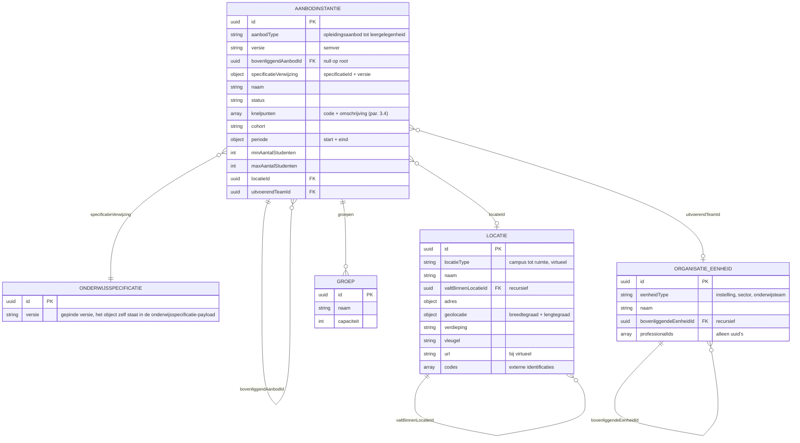
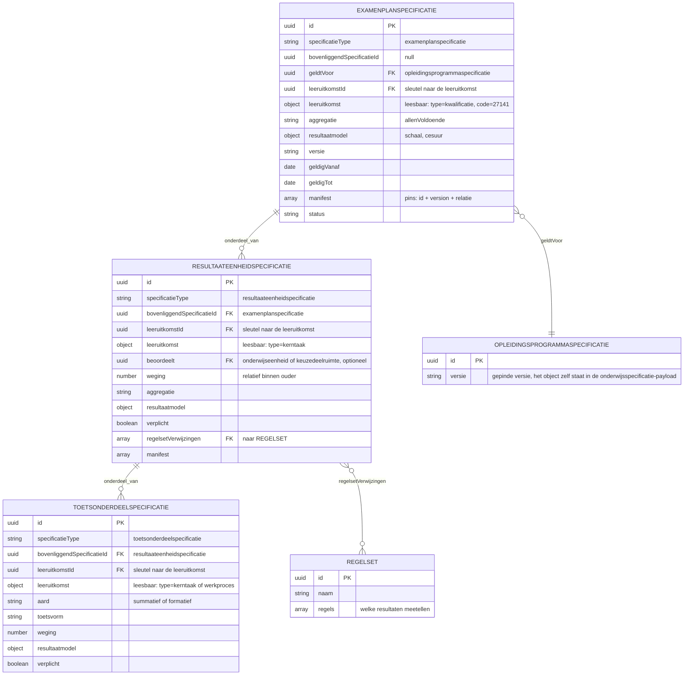
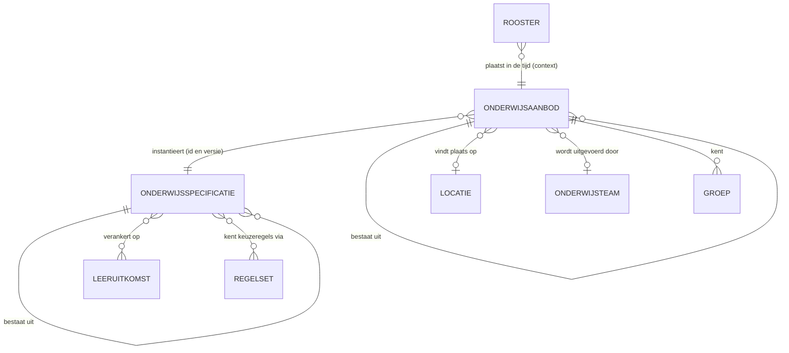
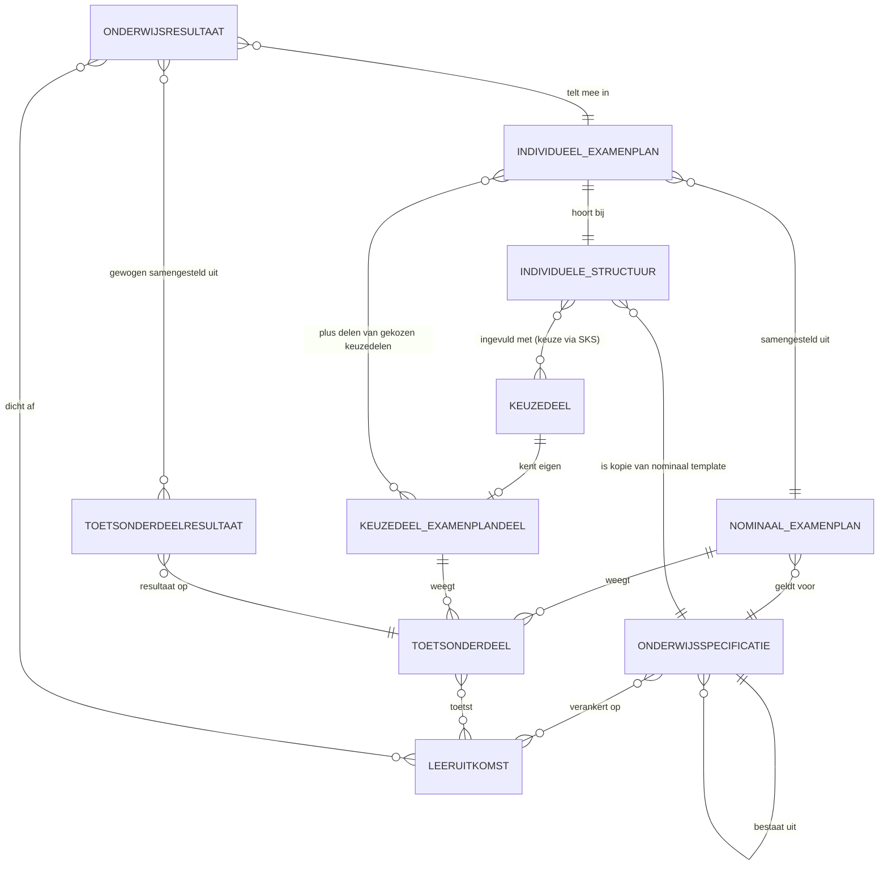
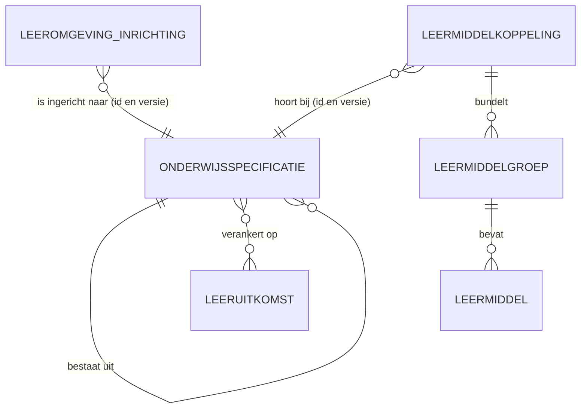

<!-- Gegenereerd door scripts/build-release.py uit release.json. Niet met de hand wijzigen: pas de bronnen aan en bouw opnieuw. -->

# Informatie- en gegevensmodellen

De vorm waarin onderwijsgegevens over een koppeling gaan: het logisch gegevensmodel, de JSON Schema's en de regels daarbij.

Versie 0.1.0


<!-- pagina-einde -->

## 1 Inleiding

Dit document legt de vorm vast waarin onderwijsgegevens over een koppeling gaan: de entiteiten en hun samenhang, de JSON Schema's waartegen een implementatie kan valideren, de regels die zo'n schema niet kan uitdrukken, en per koppeling welk deel ervan meegaat.

**Aanleiding.** De modellen zijn eerder als bijlage bij de koppelvlakspecificatie uitgebracht. Ze hebben een eigen ritme: een veld erbij of een strakkere validatie raakt wel elke implementatie die tegen het schema valideert, maar niet de berichtstroom of het endpoint eromheen. Omgekeerd verandert een nieuwe koppelingspecificatie vaak niets aan de vorm van de gegevens. Als bijlage deelden beide noodgedwongen één versienummer, en zei een versiesprong van het ene niets over het andere.

**Context.** OKx modelleert in vier lagen, van betekenis naar techniek. De begrippen leggen vast wat een term betekent; het conceptueel informatiemodel ordent die begrippen en hun samenhang; het logisch gegevensmodel zet dat om in entiteiten, velden en relaties, onafhankelijk van de techniek; het technisch gegevensmodel legt vast hoe dat over de lijn gaat. Dit document draagt de onderste twee lagen en verbindt ze: elke entiteit in het logisch model is terug te vinden als schema, en elk schema is terug te voeren op een entiteit.

| Laag | Wat de laag vastlegt | Waar |
|---|---|---|
| 1. Begrippen | Wat een term betekent | Buiten dit document |
| 2. Conceptueel informatiemodel | Welke begrippen er zijn en hoe ze samenhangen | Buiten dit document |
| 3. Logisch gegevensmodel | Entiteiten, velden en relaties, techniekonafhankelijk | Dit document |
| 4. Technisch gegevensmodel | De JSON Schema's waartegen een implementatie valideert | Dit document |

De [koppelvlakspecificatie](../Koppelvlakspecificaties/inleiding.md) beschrijft welke applicatiediensten een systeem implementeert en welk berichtverkeer daaroverheen gaat; zij verwijst naar dit pakket op een vastgelegde versie voor de vorm van wat er in die berichten zit. Deze modellen zijn **alfa en indicatief** ([U1](../Koppelvlakspecificaties/uitgangspunten.md#u1-indicatief-en-onderbouwend-niet-voorschrijvend)) en volgen de payloadvorm uit [U7](../Koppelvlakspecificaties/uitgangspunten.md#u7-payload-plat-met-verwijzingen-en-de-sleutelconventie): plat, met verwijzingen tussen objecten in plaats van nesting, zodat een consument alleen ophaalt wat hij nodig heeft.

**Doel.** Een bouwer moet hieruit kunnen afleiden welke objecten er zijn, hoe ze samenhangen, welke velden ze dragen, en wat er geldt bovenop wat het schema afdwingt. Geslaagd is het document wanneer twee partijen die er onafhankelijk tegenaan bouwen berichten uitwisselen die elkaar begrijpen.

**Scope.** Het logisch gegevensmodel met de regels daarbij, het technisch gegevensmodel met de voorbeeldpayloads en de mapping van Engelse veldnamen naar hun Nederlandse oorsprong, en de gebruiksprofielen per koppeling. De begrippen en het conceptueel informatiemodel, laag 1 en 2, staan er nog niet in. Welke velden een koppeling gebruikt en waarom staat in de payload-specificatie van die koppeling, in de koppelvlakspecificatie; die is daarin leidend. De interne structuur van een regelset, de endpoints waarover een payload gaat en de technische ontsluiting in OpenAPI vallen erbuiten, en al het overige eveneens.


<!-- pagina-einde -->

## Inhoudsopgave

- [1 Inleiding](#1-inleiding)
- [2 Logisch gegevensmodel](#2-logisch-gegevensmodel)
  - [2.1 Onderwijsspecificatie](#21-onderwijsspecificatie)
  - [2.2 Onderwijsaanbod](#22-onderwijsaanbod)
  - [2.3 Resultaatstructuur en examenplan](#23-resultaatstructuur-en-examenplan)
  - [2.4 Onderwijscatalogus naar planning en roostering](#24-onderwijscatalogus-naar-planning-en-roostering)
  - [2.5 Onderwijscatalogus naar studentinformatiesysteem](#25-onderwijscatalogus-naar-studentinformatiesysteem)
  - [2.6 Onderwijscatalogus naar leermanagementsysteem](#26-onderwijscatalogus-naar-leermanagementsysteem)
  - [2.7 Regels bij de schema's](#27-regels-bij-de-schemas)
- [3 Technisch gegevensmodel](#3-technisch-gegevensmodel)
  - [3.1 address.json](#31-addressjson)
  - [3.2 bottleneck.json](#32-bottleneckjson)
  - [3.3 code.json](#33-codejson)
  - [3.4 education-offering.json](#34-education-offeringjson)
  - [3.5 education-specification-delta.json](#35-education-specification-deltajson)
  - [3.6 education-specification.json](#36-education-specificationjson)
  - [3.7 geolocation.json](#37-geolocationjson)
  - [3.8 group.json](#38-groupjson)
  - [3.9 learning-outcome-designation.json](#39-learning-outcome-designationjson)
  - [3.10 learning-outcome.json](#310-learning-outcomejson)
  - [3.11 location.json](#311-locationjson)
  - [3.12 manifest-item.json](#312-manifest-itemjson)
  - [3.13 organisation-unit.json](#313-organisation-unitjson)
  - [3.14 period.json](#314-periodjson)
  - [3.15 processing-status.json](#315-processing-statusjson)
  - [3.16 result-model.json](#316-result-modeljson)
  - [3.17 result-structure.json](#317-result-structurejson)
  - [3.18 rule-set.json](#318-rule-setjson)
  - [3.19 source.json](#319-sourcejson)
  - [3.20 specification-changed.json](#320-specification-changedjson)
  - [3.21 specification-reference.json](#321-specification-referencejson)
  - [3.22 specification-status-changed.json](#322-specification-status-changedjson)
  - [3.23 subscription.json](#323-subscriptionjson)
  - [3.24 volume.json](#324-volumejson)
  - [3.25 Voorbeeldpayloads](#325-voorbeeldpayloads)
    - [3.25.1 Voorbeeld onderwijsspecificatie](#3251-voorbeeld-onderwijsspecificatie)
    - [3.25.2 Voorbeeld onderwijsaanbod](#3252-voorbeeld-onderwijsaanbod)
    - [3.25.3 Voorbeeld resultaatstructuur en examenplan](#3253-voorbeeld-resultaatstructuur-en-examenplan)
  - [3.26 Mapping veldnamen](#326-mapping-veldnamen)
    - [3.26.1 Abonnement — Subscription](#3261-abonnement--subscription)
    - [3.26.2 Adres — Address](#3262-adres--address)
    - [3.26.3 Bron — Source](#3263-bron--source)
    - [3.26.4 Code — Code](#3264-code--code)
    - [3.26.5 Geolocatie — Geolocation](#3265-geolocatie--geolocation)
    - [3.26.6 Groep — Group](#3266-groep--group)
    - [3.26.7 Knelpunt — Bottleneck](#3267-knelpunt--bottleneck)
    - [3.26.8 Leeruitkomst-aanduiding — Learning outcome designation](#3268-leeruitkomst-aanduiding--learning-outcome-designation)
    - [3.26.9 Leeruitkomst — Learning outcome](#3269-leeruitkomst--learning-outcome)
    - [3.26.10 Locatie — Location](#32610-locatie--location)
    - [3.26.11 Manifest-item — Manifest item](#32611-manifest-item--manifest-item)
    - [3.26.12 Omvang — Volume](#32612-omvang--volume)
    - [3.26.13 Onderwijsaanbod — Education offering](#32613-onderwijsaanbod--education-offering)
    - [3.26.14 Onderwijsspecificatie-delta — Education specification delta](#32614-onderwijsspecificatie-delta--education-specification-delta)
    - [3.26.15 Onderwijsspecificatie — Education specification](#32615-onderwijsspecificatie--education-specification)
    - [3.26.16 OrganisatieEenheid — Organisation unit](#32616-organisatieeenheid--organisation-unit)
    - [3.26.17 Periode — Period](#32617-periode--period)
    - [3.26.18 Regelset — Rule set](#32618-regelset--rule-set)
    - [3.26.19 Resultaatmodel — Result model](#32619-resultaatmodel--result-model)
    - [3.26.20 Resultaatstructuur en examenplan — Result structure and exam plan](#32620-resultaatstructuur-en-examenplan--result-structure-and-exam-plan)
    - [3.26.21 Specificatie-gewijzigd — Specification changed](#32621-specificatie-gewijzigd--specification-changed)
    - [3.26.22 Specificatie-referentie — Specification reference](#32622-specificatie-referentie--specification-reference)
    - [3.26.23 Specificatie-status-gewijzigd — Specification status changed](#32623-specificatie-status-gewijzigd--specification-status-changed)
    - [3.26.24 Verwerkingsstatus — Processing status](#32624-verwerkingsstatus--processing-status)
- [4 Gebruiksprofielen](#4-gebruiksprofielen)
  - [4.1 Onderwijscatalogus naar planning en roostering](#41-onderwijscatalogus-naar-planning-en-roostering)
  - [4.2 Onderwijscatalogus naar studentinformatiesysteem](#42-onderwijscatalogus-naar-studentinformatiesysteem)
  - [4.3 Onderwijscatalogus naar leermanagementsysteem](#43-onderwijscatalogus-naar-leermanagementsysteem)

<!-- pagina-einde -->

## 2 Logisch gegevensmodel

Per begrippenfamilie de entiteiten, hun velden en hun onderlinge relaties, onafhankelijk van de techniek waarin ze worden uitgewisseld. Wat een diagram niet kan uitdrukken staat in [regels bij de schema's](#27-regels-bij-de-schemas); de technische vorm die hieruit volgt staat in de [schema's](schemas).

### 2.1 Onderwijsspecificatie

Alle specificaties zijn hetzelfde objecttype, gespecialiseerd via `specificatieType`. In het informatiemodel hieronder betekent `onderdeel_van` additief (de studielast telt op) en `variant_van` alternatief (een keuze tussen varianten, geen optelling). Elke entiteit draagt daarnaast `versie` (semver); dat is voor de leesbaarheid niet in elke box herhaald.

```mermaid
erDiagram
    OPLEIDINGSSPECIFICATIE ||--o{ OPLEIDINGSPROGRAMMASPECIFICATIE_LEERWEG : variant_van
    OPLEIDINGSPROGRAMMASPECIFICATIE_LEERWEG ||--o{ OPLEIDINGSPROGRAMMASPECIFICATIE_DOELGROEP : variant_van
    OPLEIDINGSPROGRAMMASPECIFICATIE_DOELGROEP ||--o{ ONDERWIJSEENHEIDSPECIFICATIE : onderdeel_van
    OPLEIDINGSPROGRAMMASPECIFICATIE_DOELGROEP ||--|| KEUZEDEELRUIMTESPECIFICATIE : bevat
    ONDERWIJSEENHEIDSPECIFICATIE ||--o{ LEERONDERDEELSPECIFICATIE : onderdeel_van
    KEUZEDEELRUIMTESPECIFICATIE }o--o{ REGELSET : regelsetVerwijzingen
    REGELSET }o--o{ KEUZEDEELPROGRAMMASPECIFICATIE : kiesbaar
    REGELSET }o--o{ LEERUITKOMST : "stelt deelname-voorwaarden in behaalde leeruitkomsten"
    KEUZEDEELPROGRAMMASPECIFICATIE ||--o{ ONDERWIJSEENHEIDSPECIFICATIE : onderdeel_van

    OPLEIDINGSSPECIFICATIE }o--|| LEERUITKOMST : "verankert op"
    OPLEIDINGSPROGRAMMASPECIFICATIE_LEERWEG }o--|| LEERUITKOMST : "verankert op"
    OPLEIDINGSPROGRAMMASPECIFICATIE_DOELGROEP }o--|| LEERUITKOMST : "verankert op"
    ONDERWIJSEENHEIDSPECIFICATIE }o--|| LEERUITKOMST : "verankert op"
    LEERONDERDEELSPECIFICATIE }o--|| LEERUITKOMST : "verankert op"
    KEUZEDEELPROGRAMMASPECIFICATIE }o--|| LEERUITKOMST : "verankert op"
    LEERUITKOMST ||--o{ LEERUITKOMST : "aggregeert bottom-up en top-down"
    LEERUITKOMST {
        uuid id PK
        string versie "eigen lifecycle"
        string naam
        object bron "standaard (nu sbb-kwalificatiekader, later bv. competentnl) + type + code"
        uuid bovenliggendLeeruitkomstId FK "recursief, orde van grootte per niveau"
        string waardedocument "diploma, certificaat, later microcredential"
        array indicatieveOmvang "SBU en/of EC naast elkaar ([ADR 0004](../Referentiemateriaal/adr/0004-leeruitkomsten-sbu-ec-logistieke-containergrootte.md))"
        string omschrijving "optioneel, per gebruiksprofiel"
        string resultaat "optioneel"
        array gedrag "optioneel"
        int nlqfNiveau
    }
    OPLEIDINGSSPECIFICATIE {
        uuid id PK
        string specificatieType "opleidingsspecificatie"
        uuid bovenliggendSpecificatieId "null"
        uuid leeruitkomstId FK "sleutel naar leeruitkomst"
        string naam
        string curriculumtype
        string versie
        date geldigVanaf
        date geldigTot
        object studielast "waarde + SBU"
        array manifest "pins: id + version + relatie"
        string status
    }
    OPLEIDINGSPROGRAMMASPECIFICATIE_LEERWEG {
        uuid id PK
        string specificatieType "opleidingsprogrammaspecificatie"
        uuid bovenliggendSpecificatieId FK "opleiding"
        uuid leeruitkomstId FK "sleutel naar leeruitkomst"
        string programmaLaag "leerweg"
        string leerweg "BOL of BBL"
        string programmatype "diplomaprogramma"
        object studielast
    }
    OPLEIDINGSPROGRAMMASPECIFICATIE_DOELGROEP {
        uuid id PK
        string specificatieType "opleidingsprogrammaspecificatie"
        uuid bovenliggendSpecificatieId FK "leerweg-programma"
        uuid leeruitkomstId FK "sleutel naar leeruitkomst"
        string programmaLaag "doelgroep"
        string doelgroep "regulier, zijinstromer, hybride, organisatiespecifiek"
        string leerweg
        string curriculumtype
        object organisatie "optioneel, bv. Ziekenhuis 12"
        string cohort
        date startdatum
        date geldigVanaf
        date geldigTot
        object studielast
        array manifest "pins: id + version + relatie"
    }
    ONDERWIJSEENHEIDSPECIFICATIE {
        uuid id PK
        string specificatieType "onderwijseenheidspecificatie"
        uuid bovenliggendSpecificatieId FK "programma of keuzedeelprogramma"
        uuid leeruitkomstId FK "sleutel naar leeruitkomst"
        string naam
        object studielast
    }
    LEERONDERDEELSPECIFICATIE {
        uuid id PK
        string specificatieType "leeronderdeelspecificatie"
        uuid bovenliggendSpecificatieId FK "onderwijseenheid"
        uuid leeruitkomstId FK "sleutel naar leeruitkomst"
        string naam
        string tijdsverdeling "BOT of OOT"
        object studielast
    }
    KEUZEDEELRUIMTESPECIFICATIE {
        uuid id PK
        string specificatieType "keuzedeelruimtespecificatie"
        uuid bovenliggendSpecificatieId FK "doelgroep-programma"
        object studielast "keuzeruimte in SBU"
        array regelsetVerwijzingen FK "naar REGELSET"
    }
    KEUZEDEELPROGRAMMASPECIFICATIE {
        uuid id PK
        string specificatieType "opleidingsprogrammaspecificatie"
        uuid bovenliggendSpecificatieId "null, zelfstandig"
        uuid leeruitkomstId FK "sleutel naar leeruitkomst"
        string programmatype "keuzedeelprogramma"
        string keuzedeelKlasse "algemeen-verbredend of beroepsspecifiek-verdiepend"
        object studielast
    }
    REGELSET {
        uuid id PK
        string naam
        uuid vanToepassingOp FK "keuzedeelruimte"
        array regels "kiesbaar + voorwaardeVooraf in behaalde leeruitkomsten"
    }
```



Het model toont de relatie tussen specificatie en leeruitkomst als veel-op-veel. De payload implementeert dat voorlopig als één `leeruitkomstId` per specificatie; een array-vorm is nog niet uitgewerkt.

### 2.2 Onderwijsaanbod



### 2.3 Resultaatstructuur en examenplan



### 2.4 Onderwijscatalogus naar planning en roostering

De begrippen uit het semantisch kader en hun relaties, in de context van dit proces. Links de wereld van OC (specificeren), rechts die van P (instantiëren); de koppeling verbindt ze via de verwijzing "instantieert".



### 2.5 Onderwijscatalogus naar studentinformatiesysteem

Conform het ROSA Kernmodel Onderwijsinformatie (KOI) en [ADR 0022](../Referentiemateriaal/adr/0022-resultaatbegrippen-conform-rosa-koi.md): een onderwijsresultaat wordt behaald op leeruitkomsten, en meerdere toetsonderdeelresultaten leiden gewogen tot dat onderwijsresultaat. De verbintenis hoort bij het aanbod (ankertabel), niet bij de specificatie, en staat daarom niet in dit kernmodel.



### 2.6 Onderwijscatalogus naar leermanagementsysteem




<!-- pagina-einde -->

### 2.7 Regels bij de schema's

Wat een JSON Schema niet kan uitdrukken, maar wel geldt. Zonder deze regels valideren twee implementaties allebei en werken ze toch niet samen.

**Twee soorten ouder-verwijzing.** `bovenliggendSpecificatieId` draagt zowel onderdeel-van (additief, een kerntaak onder een programma) als variant-van (alternatief, een doelgroep onder een leerweg). Welke van de twee geldt staat in het `manifest` van de ouder, in `relatie`.

**Aggregatie-invariant.** `studielast` telt bottom-up op binnen onderdeel-van: de som van de onderdelen is gelijk aan de ouder. Over varianten telt hij niet op; een leerweg en een doelgroep zijn alternatieven, geen optelling.

**Keuzedelen staan als root.** Een keuzedeelprogramma draagt geen ouder-verwijzing en is alleen bereikbaar via `regelsetVerwijzingen`. Wie de structuur aflegt via de ouder-verwijzing mist ze. Ze zijn herbruikbaar over opleidingen heen (N:M via de regelset).

**Regels staan buiten de specificatie.** `regelsetVerwijzingen` kan op elke specificatie staan, niet alleen op de keuzeruimte. De regelset draagt de kiesbaarheid en de voorwaarde vooraf, uitgedrukt in **behaalde leeruitkomsten** en niet in afgeronde specificaties. De interne structuur van een regelset valt buiten deze schema's.

**Rekenregels staan op de resultaateenheid.** `aggregatie` en `weging` horen op de `resultaateenheidspecificatie`, niet op het toetsonderdeel: de rekenregel staat op het niveau waar hij geldt. `aard: formatief` betekent weging 0 en telt niet mee voor het diploma.

**Knelpuntcodes.** De code benoemt welke categorie randvoorwaarde onvervulbaar bleek. De lijst is een aanzet; een genormeerde codelijst met foutmodel volgt.

| Code | Geschonden constraint | Voorbeeld |
|---|---|---|
| `capaciteitTekort` | Inzetbare uren van team of professionals | 4 groepen vragen 960 contacturen, 666 beschikbaar |
| `expertiseTekort` | Vereist expertiseprofiel ontbreekt | Geen docent met profiel farmaceutische zorg |
| `ruimteTekort` | Ruimtetype of ruimtecapaciteit ontoereikend | Geen praktijklokaal beschikbaar in de periode |
| `locatieConflict` | Zelfde ruimte gelijktijdig dubbel nodig | Twee opleidingen claimen lokaal 2.14 in dezelfde weken |
| `volgordeConflict` | Voorwaarde vooraf past niet in de periodes | Wiskunde 1 en Ruimtelijk inzicht passen niet na elkaar binnen het jaar |
| `regelConflict` | Keuzeregels (regelset) onvervulbaar | De regelset sluit alle kiesbare keuzedelen uit |
| `groepsgrootteConflict` | Minimum of maximum aantal studenten | Prognose blijft onder het minimum |
| `kalenderConflict` | Urennorm of lesweken passen niet | Vereiste begeleide uren passen niet in de beschikbare weken |

**Versionering.** Semver per specificatie: MAJOR is brekend binnen dezelfde identiteit (leeruitkomsten, structuur, studielast), MINOR is additief, PATCH is een correctie. Het `id` is stabiel; een fundamentele wijziging — een nieuw kwalificatiedossier, gewijzigde wettelijke eisen — is een **nieuwe specificatie met een nieuw id**, geen MAJOR-ophoging. Temporele geldigheid loopt via `geldigVanaf` en `geldigTot`, niet via het versienummer: zo kunnen meerdere versies gelijktijdig actief zijn, de oude voor lopende studenten en de nieuwe voor nieuwe instroom. Eén partij geeft versienummers uit, de onderwijscatalogus.

**Momentopname en manifest.** Een geleverde payload is een momentopname: elke specificatie staat erin met haar `versie`, en de versie van de bovenste specificatie is de release-versie daarvan. Het `manifest` maakt de pin expliciet ([manifest-item.json](schemas/manifest-item.json)). Een MAJOR-ophoging van een onderdeel propageert **niet** automatisch omhoog: dat gebeurt alleen als de afhankelijkheid breekt, dus wanneer leeruitkomsten, weging of het recht op een waardedocument veranderen. Anders is het enkel een nieuwe pin.

| Breekt onderdeel A de bovenliggende specificatie? | Bovenliggende specificatie | Manifest pint |
|---|---|---|
| Ja (leeruitkomst, weging of diploma-eligibility) | `2.1` naar `3.0` (MAJOR) | A `2.0` |
| Nee (interne herstructurering van A) | `2.1` naar `2.2` (MINOR) | A `2.0` |

**Deactiveren, niet verwijderen.** Zodra er aanbod, een verbintenis of een resultaat aan een specificatie hangt, is verwijderen geen optie: een lopende student moet herleidbaar blijven tot de versie waarop hij is ingeschreven. Daarvoor is de status `gedeactiveerd`.

**Wijzigingsklasse.** `changeClass` in [specification-changed.json](schemas/specification-changed.json) zegt wat de ontvanger moet doen.

| Waarde | Wat het betekent | Gevolg voor de ontvanger |
|---|---|---|
| `fundamenteel` | Nieuw kwalificatiedossier, gewijzigde wettelijke eisen, nieuwe onderwijsvisie | Nieuwe specificatie met een nieuw id; meestal alleen voor nieuwe instroom |
| `examenplan` | Aanpassing van de summatieve resultaatstructuur | Alleen na expliciete impactanalyse en besluit; de strengste regels, want het examenplan is een contractuele afspraak met de student |
| `onderdeel` | Update van een onderwijseenheid- of leeronderdeelspecificatie | Nieuwe versie van het onderdeel; de bovenliggende specificatie volgt alleen bij een brekende afhankelijkheid |
| `niet-brekend` | Actualisatie van lessen, materiaal of uitvoeringsvorm | PATCH of MINOR binnen dezelfde identiteit |
| `na-planning-of-roostering` | Wijziging nadat aanbod of rooster is gepubliceerd | Alleen bij uitzondering en na ketenafstemming |

**Locatie en organisatie.** Eén object `locatie` dekt elke korrelgrootte via `locatieType`, van campus tot ruimte en ook virtueel; `valtBinnenLocatieId` legt de ruimtelijke hiërarchie vast. Een locatie kan een adres en onafhankelijk daarvan een geopunt dragen. `organisatieEenheden` volgt hetzelfde recursiepatroon via `bovenliggendeEenheidId`; `professionalIds` draagt alleen uuid's, want inzet en beschikbaarheid leven in het plan-van-inzetsysteem.


<!-- pagina-einde -->

## 3 Technisch gegevensmodel

<!-- pagina-einde -->

### 3.1 address.json

```json
{
  "$schema": "https://json-schema.org/draft/2020-12/schema",
  "$id": "https://okx.npuls.nl/schema/address/alfa",
  "title": "Address",
  "DutchName": "Adres",
  "$comment": "Alfa en indicatief. Deze vorm onderbouwt welke velden het koppelvlak nodig heeft en kan wijzigen zolang de payload niet is vastgesteld.",
  "type": "object",
  "properties": {
    "street": { "type": "string", "DutchName": "straat" },
    "houseNumber": { "type": "string", "DutchName": "huisnummer" },
    "postcode": { "type": "string", "DutchName": "postcode" },
    "city": { "type": "string", "DutchName": "plaats" },
    "country": { "type": "string", "DutchName": "land" }
  }
}
```

### 3.2 bottleneck.json

```json
{
  "$schema": "https://json-schema.org/draft/2020-12/schema",
  "$id": "https://okx.npuls.nl/schema/bottleneck/alfa",
  "title": "Bottleneck",
  "DutchName": "Knelpunt",
  "$comment": "Alfa en indicatief. Deze vorm onderbouwt welke velden het koppelvlak nodig heeft en kan wijzigen zolang de payload niet is vastgesteld.",
  "type": "object",
  "required": [
    "code",
    "description"
  ],
  "properties": {
    "code": {
      "type": "string",
      "DutchName": "code",
      "enum": [
        "capaciteitTekort",
        "expertiseTekort",
        "ruimteTekort",
        "locatieConflict",
        "volgordeConflict",
        "regelConflict",
        "groepsgrootteConflict",
        "kalenderConflict"
      ]
    },
    "description": {
      "type": "string",
      "DutchName": "omschrijving"
    },
    "involvedSpecificationIds": {
      "type": "array",
      "items": {
        "type": "string"
      },
      "DutchName": "betrokkenSpecificatieIds"
    }
  }
}
```

### 3.3 code.json

```json
{
  "$schema": "https://json-schema.org/draft/2020-12/schema",
  "$id": "https://okx.npuls.nl/schema/code/alfa",
  "title": "Code",
  "DutchName": "Code",
  "$comment": "Alfa en indicatief. Externe identificatie, bijvoorbeeld een vestigingscode. Deze vorm onderbouwt welke velden het koppelvlak nodig heeft en kan wijzigen zolang de payload niet is vastgesteld.",
  "type": "object",
  "properties": {
    "codeType": { "type": "string", "DutchName": "codeType" },
    "code": { "type": "string", "DutchName": "code" }
  }
}
```

### 3.4 education-offering.json

```json
{
  "$schema": "https://json-schema.org/draft/2020-12/schema",
  "$id": "https://okx.npuls.nl/schema/education-offering/alfa",
  "title": "Education offering",
  "DutchName": "Onderwijsaanbod",
  "$comment": "Alfa en indicatief. Deze vorm onderbouwt welke velden het koppelvlak nodig heeft en kan wijzigen zolang de payload niet is vastgesteld.",
  "type": "object",
  "required": ["offeringInstances"],
  "properties": {
    "offeringInstances": {
      "type": "array",
      "items": {
        "type": "object",
        "required": ["id", "offeringType", "version", "parentOfferingId", "specificationReference", "name", "status"],
        "properties": {
          "id": { "type": "string", "format": "uuid", "DutchName": "id" },
          "offeringType": { "enum": ["opleidingsaanbod", "opleidingsprogramma-aanbod", "onderwijseenheid-aanbod", "leergelegenheid"], "DutchName": "aanbodType" },
          "version": { "type": "string", "pattern": "^\\d+\\.\\d+\\.\\d+$", "DutchName": "versie" },
          "parentOfferingId": { "type": ["string", "null"], "format": "uuid", "DutchName": "bovenliggendAanbodId" },
          "specificationReference": { "$ref": "./specification-reference.json", "DutchName": "specificatieVerwijzing" },
          "name": { "type": "string", "DutchName": "naam" },
          "status": { "enum": ["inPlanning", "gepland", "nietRealiseerbaar", "geannuleerd"], "DutchName": "status" },
          "bottlenecks": {
            "type": "array",
            "items": { "$ref": "./bottleneck.json" },
            "DutchName": "knelpunten"
          },
          "cohort": { "type": "string", "DutchName": "cohort" },
          "period": { "$ref": "./period.json", "DutchName": "periode" },
          "minStudentCount": { "type": "integer", "DutchName": "minAantalStudenten" },
          "maxStudentCount": { "type": "integer", "DutchName": "maxAantalStudenten" },
          "locationId": { "type": "string", "format": "uuid", "DutchName": "locatieId" },
          "executingTeamId": { "type": "string", "format": "uuid", "DutchName": "uitvoerendTeamId" },
          "groups": {
            "type": "array",
            "items": { "$ref": "./group.json" },
            "DutchName": "groepen"
          }
        }
      },
      "DutchName": "aanbodInstanties"
    },
    "locations": {
      "type": "array",
      "items": { "$ref": "./location.json" },
      "DutchName": "locaties"
    },
    "organisationUnits": {
      "type": "array",
      "items": { "$ref": "./organisation-unit.json" },
      "DutchName": "organisatieEenheden"
    }
  }
}
```

### 3.5 education-specification-delta.json

```json
{
  "$schema": "https://json-schema.org/draft/2020-12/schema",
  "$id": "https://okx.npuls.nl/schema/education-specification-delta/alfa",
  "title": "Education specification delta",
  "DutchName": "Onderwijsspecificatie-delta",
  "$comment": "Alfa en indicatief. JSON Patch (RFC 6902) tussen twee versies van de onderwijsspecificatiestructuur; RFC 6902 is de normatieve definitie van de operatievorm, dit schema legt vast dat de respons daaraan voldoet.",
  "type": "array",
  "items": {
    "type": "object",
    "required": ["op", "path"],
    "properties": {
      "op": { "enum": ["add", "remove", "replace", "move", "copy", "test"], "DutchName": "op" },
      "path": { "type": "string", "DutchName": "path" },
      "from": { "type": "string", "DutchName": "from" },
      "value": { "DutchName": "value" }
    }
  }
}
```

### 3.6 education-specification.json

```json
{
  "$schema": "https://json-schema.org/draft/2020-12/schema",
  "$id": "https://okx.npuls.nl/schema/education-specification/alfa",
  "title": "Education specification",
  "DutchName": "Onderwijsspecificatie",
  "$comment": "Alfa en indicatief. Deze vorm onderbouwt welke velden het koppelvlak nodig heeft en kan wijzigen zolang de payload niet is vastgesteld.",
  "type": "object",
  "required": ["educationSpecifications"],
  "$comment_required": "Alleen onderwijsspecificaties is altijd aanwezig. Of leeruitkomsten en regelsets meekomen bepaalt het gebruiksprofiel van de koppeling; binnen onderwijscatalogus naar planning en roostering blijven leeruitkomsten weg ([ADR 0023](../../Referentiemateriaal/adr/0023-leeruitkomsten-als-opaque-sleutels-in-koppeling-oc-p-en-r.md)).",
  "properties": {
    "learningOutcomes": {
      "type": "array",
      "items": { "$ref": "./learning-outcome.json" },
      "DutchName": "leeruitkomsten"
    },
    "educationSpecifications": {
      "type": "array",
      "items": {
        "type": "object",
        "required": ["id", "specificationType", "version", "parentSpecificationId", "name", "studyLoad"],
        "properties": {
          "id": { "type": "string", "format": "uuid", "DutchName": "id" },
          "specificationType": { "enum": ["opleidingsspecificatie", "opleidingsprogrammaspecificatie", "onderwijseenheidspecificatie", "leeronderdeelspecificatie", "keuzedeelruimtespecificatie", "toetsonderdeelspecificatie", "examenplanspecificatie", "resultaateenheidspecificatie"], "DutchName": "specificatieType" },
          "version": { "type": "string", "pattern": "^\\d+\\.\\d+\\.\\d+$", "DutchName": "versie" },
          "parentSpecificationId": { "type": ["string", "null"], "format": "uuid", "DutchName": "bovenliggendSpecificatieId" },
          "learningOutcomeId": { "type": "string", "format": "uuid", "DutchName": "leeruitkomstId" },
          "name": { "type": "string", "DutchName": "naam" },
          "description": { "type": "string", "DutchName": "omschrijving" },
          "status": { "enum": ["concept", "vastgesteld", "gepubliceerd", "gedeactiveerd", "vervallen", "gearchiveerd"], "DutchName": "status" },
          "studyLoad": { "$ref": "./volume.json", "DutchName": "studielast" },
          "curriculumType": { "enum": ["nominaal", "hybride", "flexibel"], "DutchName": "curriculumtype" },
          "programmeType": { "type": "string", "$comment": "open lijst: diplomaprogramma, keuzedeelprogramma, certificaatprogramma", "DutchName": "programmatype" },
          "programmeLayer": { "enum": ["leerweg", "doelgroep"], "DutchName": "programmaLaag" },
          "learningPathway": { "enum": ["BOL", "BBL"], "DutchName": "leerweg" },
          "targetGroup": { "type": "string", "$comment": "open lijst: regulier, zijinstromer, hybride, organisatiespecifiek", "DutchName": "doelgroep" },
          "electiveUnitClass": { "type": "string", "$comment": "open lijst: algemeen-verbredend, beroepsspecifiek-verdiepend", "DutchName": "keuzedeelKlasse" },
          "organisation": { "$ref": "./organisation-unit.json", "$comment": "de organisatie waarvoor deze variant geldt, bijvoorbeeld een leerbedrijf", "DutchName": "organisatie" },
          "cohort": { "type": "string", "DutchName": "cohort" },
          "startDate": { "type": "string", "format": "date", "DutchName": "startdatum" },
          "validFrom": { "type": "string", "format": "date", "DutchName": "geldigVanaf" },
          "validUntil": { "type": ["string", "null"], "format": "date", "DutchName": "geldigTot" },
          "timeDistribution": { "type": "string", "$comment": "open lijst: BOT (begeleide onderwijstijd), OOT (overige onderwijstijd), BPV", "DutchName": "tijdsverdeling" },
          "explanation": { "type": "string", "DutchName": "toelichting" },
          "ruleSetReferences": { "type": "array", "items": { "type": "string", "format": "uuid" }, "DutchName": "regelsetVerwijzingen" },
          "manifest": {
            "type": "array",
            "items": { "$ref": "./manifest-item.json" },
            "DutchName": "manifest"
          }
        }
      },
      "DutchName": "onderwijsspecificaties"
    },
    "ruleSets": {
      "type": "array",
      "items": { "$ref": "./rule-set.json" },
      "DutchName": "regelsets"
    }
  }
}
```

### 3.7 geolocation.json

```json
{
  "$schema": "https://json-schema.org/draft/2020-12/schema",
  "$id": "https://okx.npuls.nl/schema/geolocation/alfa",
  "title": "Geolocation",
  "DutchName": "Geolocatie",
  "$comment": "Alfa en indicatief. Deze vorm onderbouwt welke velden het koppelvlak nodig heeft en kan wijzigen zolang de payload niet is vastgesteld.",
  "type": "object",
  "properties": {
    "latitude": { "type": "number", "DutchName": "breedtegraad" },
    "longitude": { "type": "number", "DutchName": "lengtegraad" }
  }
}
```

### 3.8 group.json

```json
{
  "$schema": "https://json-schema.org/draft/2020-12/schema",
  "$id": "https://okx.npuls.nl/schema/group/alfa",
  "title": "Group",
  "DutchName": "Groep",
  "$comment": "Alfa en indicatief. Deze vorm onderbouwt welke velden het koppelvlak nodig heeft en kan wijzigen zolang de payload niet is vastgesteld.",
  "type": "object",
  "required": ["id", "name"],
  "properties": {
    "id": { "type": "string", "format": "uuid", "DutchName": "id" },
    "name": { "type": "string", "DutchName": "naam" },
    "capacity": { "type": "integer", "DutchName": "capaciteit" }
  }
}
```

### 3.9 learning-outcome-designation.json

```json
{
  "$schema": "https://json-schema.org/draft/2020-12/schema",
  "$id": "https://okx.npuls.nl/schema/learning-outcome-designation/alfa",
  "title": "Learning outcome designation",
  "DutchName": "Leeruitkomst-aanduiding",
  "$comment": "Alfa en indicatief. Leesbare aanduiding naast de sleutel (leeruitkomstId); type en code komen uit het kwalificatiekader. Deze vorm onderbouwt welke velden het koppelvlak nodig heeft en kan wijzigen zolang de payload niet is vastgesteld.",
  "type": "object",
  "required": ["type", "code"],
  "properties": {
    "type": { "type": "string", "DutchName": "type" },
    "code": { "type": "string", "DutchName": "code" }
  }
}
```

### 3.10 learning-outcome.json

```json
{
  "$schema": "https://json-schema.org/draft/2020-12/schema",
  "$id": "https://okx.npuls.nl/schema/learning-outcome/alfa",
  "title": "Learning outcome",
  "DutchName": "Leeruitkomst",
  "$comment": "Alfa en indicatief. Deze vorm onderbouwt welke velden het koppelvlak nodig heeft en kan wijzigen zolang de payload niet is vastgesteld.",
  "type": "object",
  "required": ["id", "version", "name", "source", "parentLearningOutcomeId", "indicativeVolume"],
  "properties": {
    "id": { "type": "string", "format": "uuid", "DutchName": "id" },
    "version": { "type": "string", "pattern": "^\\d+\\.\\d+\\.\\d+$", "DutchName": "versie" },
    "name": { "type": "string", "DutchName": "naam" },
    "source": { "$ref": "./source.json", "DutchName": "bron" },
    "parentLearningOutcomeId": { "type": ["string", "null"], "format": "uuid", "DutchName": "bovenliggendLeeruitkomstId" },
    "indicativeVolume": {
      "type": "array",
      "items": { "$ref": "./volume.json" },
      "DutchName": "indicatieveOmvang"
    },
    "nlqfLevel": { "type": "integer", "minimum": 1, "maximum": 8, "DutchName": "nlqfNiveau" },
    "credentialDocument": { "type": "string", "$comment": "open lijst: diploma, mbo-certificaat, microcredential", "DutchName": "waardedocument" },
    "description": { "type": "string", "DutchName": "omschrijving" },
    "result": { "type": "string", "DutchName": "resultaat" },
    "behaviour": { "type": "array", "items": { "type": "string" }, "DutchName": "gedrag" }
  }
}
```

### 3.11 location.json

```json
{
  "$schema": "https://json-schema.org/draft/2020-12/schema",
  "$id": "https://okx.npuls.nl/schema/location/alfa",
  "title": "Location",
  "DutchName": "Locatie",
  "$comment": "Alfa en indicatief. Deze vorm onderbouwt welke velden het koppelvlak nodig heeft en kan wijzigen zolang de payload niet is vastgesteld.",
  "type": "object",
  "required": ["id", "locationType", "name"],
  "properties": {
    "id": { "type": "string", "format": "uuid", "DutchName": "id" },
    "locationType": { "enum": ["campus", "vestiging", "gebouw", "ruimte", "balie", "adres", "geopunt", "virtueel"], "DutchName": "locatieType" },
    "name": { "type": "string", "DutchName": "naam" },
    "partOfLocationId": { "type": ["string", "null"], "format": "uuid", "DutchName": "valtBinnenLocatieId" },
    "address": { "$ref": "./address.json", "DutchName": "adres" },
    "geolocation": { "$ref": "./geolocation.json", "DutchName": "geolocatie" },
    "floor": { "type": "string", "DutchName": "verdieping" },
    "wing": { "type": "string", "DutchName": "vleugel" },
    "url": { "type": "string", "DutchName": "url" },
    "codes": {
      "type": "array",
      "items": { "$ref": "./code.json" },
      "DutchName": "codes"
    }
  }
}
```

### 3.12 manifest-item.json

```json
{
  "$schema": "https://json-schema.org/draft/2020-12/schema",
  "$id": "https://okx.npuls.nl/schema/manifest-item/alfa",
  "title": "Manifest item",
  "DutchName": "Manifest-item",
  "$comment": "Alfa en indicatief. Deze vorm onderbouwt welke velden het koppelvlak nodig heeft en kan wijzigen zolang de payload niet is vastgesteld.",
  "type": "object",
  "required": ["specificationId", "version", "relation"],
  "properties": {
    "specificationId": { "type": "string", "format": "uuid", "DutchName": "specificatieId" },
    "version": { "type": "string", "DutchName": "versie" },
    "relation": { "enum": ["onderdeel", "variant", "referentie"], "DutchName": "relatie" }
  }
}
```

### 3.13 organisation-unit.json

```json
{
  "$schema": "https://json-schema.org/draft/2020-12/schema",
  "$id": "https://okx.npuls.nl/schema/organisation-unit/alfa",
  "title": "Organisation unit",
  "DutchName": "OrganisatieEenheid",
  "$comment": "Alfa en indicatief. Deze vorm onderbouwt welke velden het koppelvlak nodig heeft en kan wijzigen zolang de payload niet is vastgesteld.",
  "type": "object",
  "required": ["id", "unitType", "name"],
  "properties": {
    "id": { "type": "string", "format": "uuid", "DutchName": "id" },
    "unitType": { "type": "string", "$comment": "open lijst: instelling, sector, college, afdeling, onderwijsteam", "DutchName": "eenheidType" },
    "name": { "type": "string", "DutchName": "naam" },
    "parentUnitId": { "type": ["string", "null"], "format": "uuid", "DutchName": "bovenliggendeEenheidId" },
    "professionalIds": { "type": "array", "items": { "type": "string", "format": "uuid" }, "DutchName": "professionalIds" }
  }
}
```

### 3.14 period.json

```json
{
  "$schema": "https://json-schema.org/draft/2020-12/schema",
  "$id": "https://okx.npuls.nl/schema/period/alfa",
  "title": "Period",
  "DutchName": "Periode",
  "$comment": "Alfa en indicatief. Deze vorm onderbouwt welke velden het koppelvlak nodig heeft en kan wijzigen zolang de payload niet is vastgesteld.",
  "type": "object",
  "properties": {
    "start": { "type": "string", "format": "date", "DutchName": "start" },
    "end": { "type": "string", "format": "date", "DutchName": "eind" }
  }
}
```

### 3.15 processing-status.json

```json
{
  "$schema": "https://json-schema.org/draft/2020-12/schema",
  "$id": "https://okx.npuls.nl/schema/processing-status/alfa",
  "title": "Processing status",
  "DutchName": "Verwerkingsstatus",
  "$comment": "Alfa en indicatief. Deze vorm onderbouwt welke velden het koppelvlak nodig heeft en kan wijzigen zolang de payload niet is vastgesteld.",
  "type": "object",
  "required": ["status", "specificationReference"],
  "properties": {
    "status": { "enum": ["ontvangen", "gestart", "afgekeurd", "gelukt", "nietGelukt"], "DutchName": "status" },
    "programmeOfferingId": { "type": ["string", "null"], "format": "uuid", "DutchName": "opleidingsaanbodId" },
    "specificationReference": { "$ref": "./specification-reference.json", "DutchName": "specificatieVerwijzing" }
  }
}
```

### 3.16 result-model.json

```json
{
  "$schema": "https://json-schema.org/draft/2020-12/schema",
  "$id": "https://okx.npuls.nl/schema/result-model/alfa",
  "title": "Result model",
  "DutchName": "Resultaatmodel",
  "$comment": "Alfa en indicatief. Deze vorm onderbouwt welke velden het koppelvlak nodig heeft en kan wijzigen zolang de payload niet is vastgesteld.",
  "type": "object",
  "properties": {
    "scale": { "type": "string", "$comment": "open lijst: cijfer-1-10, voldoende-onvoldoende, punten", "DutchName": "schaal" },
    "passMark": { "type": "number", "DutchName": "cesuur" },
    "decimalPlaces": { "type": "integer", "DutchName": "decimalen" }
  }
}
```

### 3.17 result-structure.json

```json
{
  "$schema": "https://json-schema.org/draft/2020-12/schema",
  "$id": "https://okx.npuls.nl/schema/result-structure/alfa",
  "title": "Result structure and exam plan",
  "DutchName": "Resultaatstructuur en examenplan",
  "$comment": "Alfa en indicatief. Deze vorm onderbouwt welke velden het koppelvlak nodig heeft en kan wijzigen zolang de payload niet is vastgesteld.",
  "type": "object",
  "required": ["educationSpecifications"],
  "properties": {
    "educationSpecifications": {
      "type": "array",
      "items": {
        "type": "object",
        "required": ["id", "specificationType", "version", "parentSpecificationId", "name", "status", "resultModel"],
        "properties": {
          "id": { "type": "string", "format": "uuid", "DutchName": "id" },
          "specificationType": { "enum": ["examenplanspecificatie", "resultaateenheidspecificatie", "toetsonderdeelspecificatie"], "DutchName": "specificatieType" },
          "version": { "type": "string", "pattern": "^\\d+\\.\\d+\\.\\d+$", "DutchName": "versie" },
          "parentSpecificationId": { "type": ["string", "null"], "format": "uuid", "DutchName": "bovenliggendSpecificatieId" },
          "name": { "type": "string", "DutchName": "naam" },
          "description": { "type": "string", "DutchName": "omschrijving" },
          "status": { "type": "string", "DutchName": "status" },
          "validFrom": { "type": "string", "format": "date", "DutchName": "geldigVanaf" },
          "validUntil": { "type": ["string", "null"], "format": "date", "DutchName": "geldigTot" },
          "appliesTo": { "type": "string", "format": "uuid", "$comment": "de opleidingsprogrammaspecificatie waarvoor dit examenplan geldt", "DutchName": "geldtVoor" },
          "assesses": { "type": "string", "format": "uuid", "$comment": "de specificatie die deze resultaateenheid beoordeelt", "DutchName": "beoordeelt" },
          "learningOutcomeId": { "type": "string", "format": "uuid", "$comment": "verwijst naar de leeruitkomst in de onderwijsspecificatie-payload; dit is de sleutel waarop het onderwijsresultaat wordt behaald (ADR 0022)", "DutchName": "leeruitkomstId" },
          "learningOutcome": { "$ref": "./learning-outcome-designation.json", "DutchName": "leeruitkomst" },
          "nature": { "enum": ["summatief", "formatief"], "DutchName": "aard" },
          "assessmentForm": { "type": "string", "$comment": "open lijst: proeveVanBekwaamheid, kennistoets, praktijkopdracht, portfolio, criteriumgesprek", "DutchName": "toetsvorm" },
          "aggregation": { "enum": ["gewogenGemiddelde", "som", "allenVoldoende", "minimaalAantal"], "DutchName": "aggregatie" },
          "weighting": { "type": "number", "$comment": "relatief binnen de ouder; 0 bij formatief", "DutchName": "weging" },
          "mandatory": { "type": "boolean", "DutchName": "verplicht" },
          "resultModel": { "$ref": "./result-model.json", "DutchName": "resultaatmodel" },
          "ruleSetReferences": { "type": "array", "items": { "type": "string", "format": "uuid" }, "DutchName": "regelsetVerwijzingen" },
          "manifest": {
            "type": "array",
            "items": { "$ref": "./manifest-item.json" },
            "DutchName": "manifest"
          }
        }
      },
      "DutchName": "onderwijsspecificaties"
    },
    "ruleSets": {
      "type": "array",
      "items": { "$ref": "./rule-set.json" },
      "DutchName": "regelsets"
    }
  }
}
```

### 3.18 rule-set.json

```json
{
  "$schema": "https://json-schema.org/draft/2020-12/schema",
  "$id": "https://okx.npuls.nl/schema/rule-set/alfa",
  "title": "Rule set",
  "DutchName": "Regelset",
  "$comment": "Alfa en indicatief. Deze vorm onderbouwt welke velden het koppelvlak nodig heeft en kan wijzigen zolang de payload niet is vastgesteld.",
  "type": "object",
  "required": ["id", "version", "name", "appliesTo", "rules"],
  "properties": {
    "id": { "type": "string", "format": "uuid", "DutchName": "id" },
    "version": { "type": "string", "DutchName": "versie" },
    "name": { "type": "string", "DutchName": "naam" },
    "description": { "type": "string", "DutchName": "omschrijving" },
    "appliesTo": { "type": "string", "format": "uuid", "DutchName": "vanToepassingOp" },
    "rules": { "type": "array", "items": { "type": "object" }, "DutchName": "regels" }
  }
}
```

### 3.19 source.json

```json
{
  "$schema": "https://json-schema.org/draft/2020-12/schema",
  "$id": "https://okx.npuls.nl/schema/source/alfa",
  "title": "Source",
  "DutchName": "Bron",
  "$comment": "Alfa en indicatief. Deze vorm onderbouwt welke velden het koppelvlak nodig heeft en kan wijzigen zolang de payload niet is vastgesteld.",
  "type": "object",
  "required": ["standard", "type", "code"],
  "properties": {
    "standard": { "type": "string", "$comment": "open lijst; nu sbb-kwalificatiekader, later bijvoorbeeld competentnl", "DutchName": "standaard" },
    "type": { "enum": ["kwalificatiedossier", "kwalificatie", "kerntaak", "werkproces", "keuzedeel"], "DutchName": "type" },
    "code": { "type": "string", "DutchName": "code" }
  }
}
```

### 3.20 specification-changed.json

```json
{
  "$schema": "https://json-schema.org/draft/2020-12/schema",
  "$id": "https://okx.npuls.nl/schema/specification-changed/alfa",
  "title": "Specification changed",
  "DutchName": "Specificatie-gewijzigd",
  "$comment": "Alfa en indicatief. Deze vorm onderbouwt welke velden het koppelvlak nodig heeft en kan wijzigen zolang de payload niet is vastgesteld. Wijzigingsklasse volgt de classificatie in de lifecycle-uitwerking, §4.",
  "type": "object",
  "required": ["objectId", "oldVersion", "newVersion", "changeClass"],
  "properties": {
    "objectId": { "type": "string", "format": "uuid", "DutchName": "objectId" },
    "oldVersion": { "type": "string", "DutchName": "oudeVersie" },
    "newVersion": { "type": "string", "DutchName": "nieuweVersie" },
    "changeClass": { "enum": ["fundamenteel", "examenplan", "onderdeel", "niet-brekend", "na-planning-of-roostering"], "DutchName": "wijzigingsklasse" }
  }
}
```

### 3.21 specification-reference.json

```json
{
  "$schema": "https://json-schema.org/draft/2020-12/schema",
  "$id": "https://okx.npuls.nl/schema/specification-reference/alfa",
  "title": "Specification reference",
  "DutchName": "Specificatie-referentie",
  "$comment": "Alfa en indicatief. Deze vorm onderbouwt welke velden het koppelvlak nodig heeft en kan wijzigen zolang de payload niet is vastgesteld.",
  "type": "object",
  "required": ["specificationId", "version"],
  "properties": {
    "specificationId": { "type": "string", "format": "uuid", "DutchName": "specificatieId" },
    "version": { "type": "string", "DutchName": "versie" }
  }
}
```

### 3.22 specification-status-changed.json

```json
{
  "$schema": "https://json-schema.org/draft/2020-12/schema",
  "$id": "https://okx.npuls.nl/schema/specification-status-changed/alfa",
  "title": "Specification status changed",
  "DutchName": "Specificatie-status-gewijzigd",
  "$comment": "Alfa en indicatief. Deze vorm onderbouwt welke velden het koppelvlak nodig heeft en kan wijzigen zolang de payload niet is vastgesteld. Status-lifecycle volgt de lifecycle-uitwerking, §3.",
  "type": "object",
  "required": ["objectId", "oldStatus", "newStatus"],
  "properties": {
    "objectId": { "type": "string", "format": "uuid", "DutchName": "objectId" },
    "oldStatus": { "enum": ["concept", "vastgesteld", "gepubliceerd", "gedeactiveerd", "gearchiveerd", "vervallen"], "DutchName": "oudeStatus" },
    "newStatus": { "enum": ["concept", "vastgesteld", "gepubliceerd", "gedeactiveerd", "gearchiveerd", "vervallen"], "DutchName": "nieuweStatus" }
  }
}
```

### 3.23 subscription.json

```json
{
  "$schema": "https://json-schema.org/draft/2020-12/schema",
  "$id": "https://okx.npuls.nl/schema/subscription/alfa",
  "title": "Subscription",
  "DutchName": "Abonnement",
  "$comment": "Alfa en indicatief. Deze vorm onderbouwt welke velden het koppelvlak nodig heeft en kan wijzigen zolang de payload niet is vastgesteld. `id` is afwezig in het verzoek en door de server toegekend in de respons.",
  "type": "object",
  "required": ["callbackUrl", "events"],
  "properties": {
    "id": { "type": "string", "format": "uuid", "DutchName": "id" },
    "callbackUrl": { "type": "string", "format": "uri", "DutchName": "callbackUrl" },
    "events": {
      "type": "array",
      "items": { "enum": ["specificatie-planbaar", "specificatie-gewijzigd", "specificatie-status-gewijzigd", "verwerkingsstatus"] },
      "DutchName": "events"
    }
  }
}
```

### 3.24 volume.json

```json
{
  "$schema": "https://json-schema.org/draft/2020-12/schema",
  "$id": "https://okx.npuls.nl/schema/volume/alfa",
  "title": "Volume",
  "DutchName": "Omvang",
  "$comment": "Alfa en indicatief. Deze vorm onderbouwt welke velden het koppelvlak nodig heeft en kan wijzigen zolang de payload niet is vastgesteld.",
  "type": "object",
  "required": ["value", "unit"],
  "properties": {
    "value": { "type": "number", "DutchName": "waarde" },
    "unit": { "enum": ["SBU", "EC"], "DutchName": "eenheid" }
  }
}
```

<!-- pagina-einde -->

### 3.25 Voorbeeldpayloads

De waarden in deze voorbeelden zijn **indicatief**: ze illustreren de vorm en de samenhang, niet de inhoud van een bestaande opleiding.

#### 3.25.1 Voorbeeld onderwijsspecificatie

Leerroute 1, waarden indicatief. De `studielast` telt bottom-up op binnen onderdeel-van: de kerntaken 2000 plus 1200 plus 880 is 4080, plus de keuzeruimte van 720 komt op 4800 onder Regulier BOL. Programma-varianten tellen niet op. De inhoud hangt hier onder één doelgroep (Regulier BOL); de andere varianten zijn leeg gelaten. De voorwaarde vooraf van Wiskunde 1 voor Ruimtelijk inzicht komt uit de uitwerking van de keuzedeel-regels.

```json
{
  "leeruitkomsten": [
    {
      "id": "c5b64fe5-f7bf-490c-acaf-7af1bd24f980",
      "versie": "0.1.0",
      "naam": "Apothekersassistent (kwalificatiedossier 23450)",
      "bron": {
        "standaard": "sbb-kwalificatiekader",
        "type": "kwalificatiedossier",
        "code": "23450"
      },
      "indicatieveOmvang": [
        {
          "waarde": 4800,
          "eenheid": "SBU"
        },
        {
          "waarde": 171,
          "eenheid": "EC"
        }
      ],
      "bovenliggendLeeruitkomstId": null,
      "waardedocument": "diploma",
      "nlqfNiveau": 4
    },
    {
      "id": "b84dc98b-6c5f-4ee8-bdfb-40b2639ca5a4",
      "versie": "0.1.0",
      "naam": "Apothekersassistent (kwalificatie 27141)",
      "bron": {
        "standaard": "sbb-kwalificatiekader",
        "type": "kwalificatie",
        "code": "27141"
      },
      "indicatieveOmvang": [
        {
          "waarde": 4800,
          "eenheid": "SBU"
        }
      ],
      "bovenliggendLeeruitkomstId": "c5b64fe5-f7bf-490c-acaf-7af1bd24f980"
    },
    {
      "id": "12301838-92d4-4040-aea2-050bb131ceb7",
      "versie": "0.1.0",
      "naam": "Biedt farmaceutische patiëntenzorg",
      "bron": {
        "standaard": "sbb-kwalificatiekader",
        "type": "kerntaak",
        "code": "B1-K1"
      },
      "indicatieveOmvang": [
        {
          "waarde": 2000,
          "eenheid": "SBU"
        }
      ],
      "bovenliggendLeeruitkomstId": "b84dc98b-6c5f-4ee8-bdfb-40b2639ca5a4"
    },
    {
      "id": "bedb4c31-b818-491c-8227-9b32146a3363",
      "versie": "0.1.0",
      "naam": "Voert logistieke taken uit in de apotheek",
      "bron": {
        "standaard": "sbb-kwalificatiekader",
        "type": "kerntaak",
        "code": "B1-K2"
      },
      "indicatieveOmvang": [
        {
          "waarde": 1200,
          "eenheid": "SBU"
        }
      ],
      "bovenliggendLeeruitkomstId": "b84dc98b-6c5f-4ee8-bdfb-40b2639ca5a4"
    },
    {
      "id": "8b085118-ff81-4639-9152-ed2e447db2db",
      "versie": "0.1.0",
      "naam": "Werkt mee aan kwaliteit en deskundigheid",
      "bron": {
        "standaard": "sbb-kwalificatiekader",
        "type": "kerntaak",
        "code": "B1-K3"
      },
      "indicatieveOmvang": [
        {
          "waarde": 880,
          "eenheid": "SBU"
        }
      ],
      "bovenliggendLeeruitkomstId": "b84dc98b-6c5f-4ee8-bdfb-40b2639ca5a4"
    },
    {
      "id": "78f25d62-9fd4-45c4-aa04-3d22f59213f5",
      "versie": "0.1.0",
      "naam": "Neemt de zorg-/adviesvraag in behandeling",
      "bron": {
        "standaard": "sbb-kwalificatiekader",
        "type": "werkproces",
        "code": "B1-K1-W1"
      },
      "indicatieveOmvang": [
        {
          "waarde": 600,
          "eenheid": "SBU"
        }
      ],
      "bovenliggendLeeruitkomstId": "12301838-92d4-4040-aea2-050bb131ceb7",
      "omschrijving": "De beginnend beroepsbeoefenaar neemt de zorg-/adviesvraag in behandeling en staat de patiënt en/of naastbetrokkenen te woord, stelt gerichte vragen, verzamelt en controleert patiëntinformatie en brengt de situatie in kaart, en kiest op basis hiervan een vervolgstap.",
      "resultaat": "De zorg-/adviesvraag is in behandeling genomen.",
      "gedrag": [
        "is geduldig en empathisch",
        "maakt een realistische inschatting van de situatie",
        "legt logische verbanden",
        "past de communicatie aan op doel en doelgroep",
        "communiceert duidelijk en begrijpelijk",
        "gaat discreet om met vertrouwelijke informatie",
        "werkt volgens richtlijnen en protocollen"
      ]
    },
    {
      "id": "0ffa279f-c595-49d7-b033-c91f66d18bb1",
      "versie": "0.1.0",
      "naam": "Voert medicatiebewaking uit",
      "bron": {
        "standaard": "sbb-kwalificatiekader",
        "type": "werkproces",
        "code": "B1-K1-W2"
      },
      "indicatieveOmvang": [
        {
          "waarde": 500,
          "eenheid": "SBU"
        }
      ],
      "bovenliggendLeeruitkomstId": "12301838-92d4-4040-aea2-050bb131ceb7"
    },
    {
      "id": "9d6a5081-9356-4058-8ac0-a4df8f8c60bd",
      "versie": "0.1.0",
      "naam": "Verstrekt (zelfzorg)medicijnen en/of hulpmiddelen",
      "bron": {
        "standaard": "sbb-kwalificatiekader",
        "type": "werkproces",
        "code": "B1-K1-W3"
      },
      "indicatieveOmvang": [
        {
          "waarde": 500,
          "eenheid": "SBU"
        }
      ],
      "bovenliggendLeeruitkomstId": "12301838-92d4-4040-aea2-050bb131ceb7"
    },
    {
      "id": "71f42c36-dcfb-42ec-b492-8ed665639eda",
      "versie": "0.1.0",
      "naam": "Geeft informatie en advies over medicijngebruik, gezondheid en leefstijl",
      "bron": {
        "standaard": "sbb-kwalificatiekader",
        "type": "werkproces",
        "code": "B1-K1-W4"
      },
      "indicatieveOmvang": [
        {
          "waarde": 400,
          "eenheid": "SBU"
        }
      ],
      "bovenliggendLeeruitkomstId": "12301838-92d4-4040-aea2-050bb131ceb7"
    },
    {
      "id": "1d5f3f8e-76d1-4bf1-bcf2-986a4a2fe7fd",
      "versie": "0.1.0",
      "naam": "Maakt medicijnen klaar voor gebruik en/of aflevering",
      "bron": {
        "standaard": "sbb-kwalificatiekader",
        "type": "werkproces",
        "code": "B1-K2-W1"
      },
      "indicatieveOmvang": [
        {
          "waarde": 700,
          "eenheid": "SBU"
        }
      ],
      "bovenliggendLeeruitkomstId": "bedb4c31-b818-491c-8227-9b32146a3363"
    },
    {
      "id": "772c792b-f5ec-425f-9dd7-87d8fad4d2db",
      "versie": "0.1.0",
      "naam": "Houdt de voorraad bij",
      "bron": {
        "standaard": "sbb-kwalificatiekader",
        "type": "werkproces",
        "code": "B1-K2-W2"
      },
      "indicatieveOmvang": [
        {
          "waarde": 500,
          "eenheid": "SBU"
        }
      ],
      "bovenliggendLeeruitkomstId": "bedb4c31-b818-491c-8227-9b32146a3363"
    },
    {
      "id": "d929b0df-9119-4b89-ada3-342ab6b9f937",
      "versie": "0.1.0",
      "naam": "Draagt bij aan sociaal veilige werkomgeving",
      "bron": {
        "standaard": "sbb-kwalificatiekader",
        "type": "werkproces",
        "code": "B1-K3-W1"
      },
      "indicatieveOmvang": [
        {
          "waarde": 280,
          "eenheid": "SBU"
        }
      ],
      "bovenliggendLeeruitkomstId": "8b085118-ff81-4639-9152-ed2e447db2db"
    },
    {
      "id": "5cb6ce9c-82cc-4143-86bd-9f375b2901bc",
      "versie": "0.1.0",
      "naam": "Evalueert de werkzaamheden en ontwikkelt zichzelf als professional",
      "bron": {
        "standaard": "sbb-kwalificatiekader",
        "type": "werkproces",
        "code": "B1-K3-W2"
      },
      "indicatieveOmvang": [
        {
          "waarde": 300,
          "eenheid": "SBU"
        }
      ],
      "bovenliggendLeeruitkomstId": "8b085118-ff81-4639-9152-ed2e447db2db"
    },
    {
      "id": "ac69e604-6192-4eaf-b786-ed2668dc0faf",
      "versie": "0.1.0",
      "naam": "Stemt de farmaceutische zorgverlening af",
      "bron": {
        "standaard": "sbb-kwalificatiekader",
        "type": "werkproces",
        "code": "B1-K3-W3"
      },
      "indicatieveOmvang": [
        {
          "waarde": 300,
          "eenheid": "SBU"
        }
      ],
      "bovenliggendLeeruitkomstId": "8b085118-ff81-4639-9152-ed2e447db2db"
    },
    {
      "id": "4dca5ee6-ea76-4cc2-ac34-bbd466d7b6d3",
      "versie": "0.1.0",
      "naam": "Keuzedeel Ondernemerschap",
      "bron": {
        "standaard": "sbb-kwalificatiekader",
        "type": "keuzedeel",
        "code": "K0072"
      },
      "indicatieveOmvang": [
        {
          "waarde": 240,
          "eenheid": "SBU"
        },
        {
          "waarde": 8.6,
          "eenheid": "EC"
        }
      ],
      "bovenliggendLeeruitkomstId": null,
      "waardedocument": "mbo-certificaat"
    },
    {
      "id": "235745ac-bf0f-4a94-b966-aa4ebbfcdabb",
      "versie": "0.1.0",
      "naam": "Zet een onderneming op in de zorg (indicatief)",
      "bron": {
        "standaard": "sbb-kwalificatiekader",
        "type": "kerntaak",
        "code": "K0072-K1"
      },
      "indicatieveOmvang": [
        {
          "waarde": 240,
          "eenheid": "SBU"
        }
      ],
      "bovenliggendLeeruitkomstId": "4dca5ee6-ea76-4cc2-ac34-bbd466d7b6d3"
    },
    {
      "id": "bfcef8b4-49e6-4ba4-87a5-36389838969b",
      "versie": "0.1.0",
      "naam": "Stelt een ondernemingsplan op (indicatief)",
      "bron": {
        "standaard": "sbb-kwalificatiekader",
        "type": "werkproces",
        "code": "K0072-K1-W1"
      },
      "indicatieveOmvang": [
        {
          "waarde": 240,
          "eenheid": "SBU"
        }
      ],
      "bovenliggendLeeruitkomstId": "235745ac-bf0f-4a94-b966-aa4ebbfcdabb"
    },
    {
      "id": "a12bbc9c-ce75-41df-837b-489f46df500d",
      "versie": "0.1.0",
      "naam": "Keuzedeel Ruimtelijk inzicht (illustratief)",
      "bron": {
        "standaard": "sbb-kwalificatiekader",
        "type": "keuzedeel",
        "code": "K0000-ri"
      },
      "indicatieveOmvang": [
        {
          "waarde": 240,
          "eenheid": "SBU"
        },
        {
          "waarde": 8.6,
          "eenheid": "EC"
        }
      ],
      "bovenliggendLeeruitkomstId": null,
      "waardedocument": "mbo-certificaat"
    },
    {
      "id": "3f9dea35-395d-4a4b-8474-64f0d45d19dd",
      "versie": "0.1.0",
      "naam": "Past ruimtelijk inzicht toe (illustratief)",
      "bron": {
        "standaard": "sbb-kwalificatiekader",
        "type": "kerntaak",
        "code": "K0000-ri-K1"
      },
      "indicatieveOmvang": [
        {
          "waarde": 240,
          "eenheid": "SBU"
        }
      ],
      "bovenliggendLeeruitkomstId": "a12bbc9c-ce75-41df-837b-489f46df500d"
    },
    {
      "id": "92476363-cd8e-4b3c-aeea-b70add98786f",
      "versie": "0.1.0",
      "naam": "Interpreteert ruimtelijke figuren (illustratief)",
      "bron": {
        "standaard": "sbb-kwalificatiekader",
        "type": "werkproces",
        "code": "K0000-ri-K1-W1"
      },
      "indicatieveOmvang": [
        {
          "waarde": 240,
          "eenheid": "SBU"
        }
      ],
      "bovenliggendLeeruitkomstId": "3f9dea35-395d-4a4b-8474-64f0d45d19dd"
    },
    {
      "id": "0d83e73a-e0d8-47de-8b83-983d2b8226e8",
      "versie": "0.1.0",
      "naam": "Keuzedeel Wiskunde 1 (illustratief)",
      "bron": {
        "standaard": "sbb-kwalificatiekader",
        "type": "keuzedeel",
        "code": "K0000-w1"
      },
      "indicatieveOmvang": [
        {
          "waarde": 240,
          "eenheid": "SBU"
        },
        {
          "waarde": 8.6,
          "eenheid": "EC"
        }
      ],
      "bovenliggendLeeruitkomstId": null,
      "waardedocument": "mbo-certificaat"
    },
    {
      "id": "c980007d-93db-40c9-bd8e-405293f1b20f",
      "versie": "0.1.0",
      "naam": "Beheerst basale wiskunde (illustratief)",
      "bron": {
        "standaard": "sbb-kwalificatiekader",
        "type": "kerntaak",
        "code": "K0000-w1-K1"
      },
      "indicatieveOmvang": [
        {
          "waarde": 240,
          "eenheid": "SBU"
        }
      ],
      "bovenliggendLeeruitkomstId": "0d83e73a-e0d8-47de-8b83-983d2b8226e8"
    },
    {
      "id": "d44a185e-1348-4ed7-92a4-f0cb898dd85b",
      "versie": "0.1.0",
      "naam": "Rekent met verhoudingen en formules (illustratief)",
      "bron": {
        "standaard": "sbb-kwalificatiekader",
        "type": "werkproces",
        "code": "K0000-w1-K1-W1"
      },
      "indicatieveOmvang": [
        {
          "waarde": 240,
          "eenheid": "SBU"
        }
      ],
      "bovenliggendLeeruitkomstId": "c980007d-93db-40c9-bd8e-405293f1b20f"
    }
  ],
  "onderwijsspecificaties": [
    {
      "id": "79736830-1c5c-470f-b2c2-005029c96733",
      "specificatieType": "opleidingsspecificatie",
      "versie": "0.1.0",
      "bovenliggendSpecificatieId": null,
      "leeruitkomstId": "c5b64fe5-f7bf-490c-acaf-7af1bd24f980",
      "naam": "Apothekersassistent",
      "omschrijving": "Opleiding tot apothekersassistent. Domein Zorg en welzijn.",
      "curriculumtype": "nominaal",
      "status": "concept",
      "geldigVanaf": "2026-08-01",
      "geldigTot": null,
      "studielast": {
        "waarde": 4800,
        "eenheid": "SBU"
      },
      "manifest": [
        {
          "specificatieId": "5ef37812-ae0f-4232-904f-451b9928e45e",
          "versie": "0.1.0",
          "relatie": "variant"
        },
        {
          "specificatieId": "93f3c239-5baa-4d96-a56f-728c09d7fefe",
          "versie": "0.1.0",
          "relatie": "variant"
        }
      ]
    },
    {
      "id": "5ef37812-ae0f-4232-904f-451b9928e45e",
      "specificatieType": "opleidingsprogrammaspecificatie",
      "versie": "0.1.0",
      "bovenliggendSpecificatieId": "79736830-1c5c-470f-b2c2-005029c96733",
      "leeruitkomstId": "b84dc98b-6c5f-4ee8-bdfb-40b2639ca5a4",
      "naam": "Apothekersassistent, leerweg BOL",
      "programmatype": "diplomaprogramma",
      "programmaLaag": "leerweg",
      "leerweg": "BOL",
      "status": "concept",
      "studielast": {
        "waarde": 4800,
        "eenheid": "SBU"
      }
    },
    {
      "id": "93f3c239-5baa-4d96-a56f-728c09d7fefe",
      "specificatieType": "opleidingsprogrammaspecificatie",
      "versie": "0.1.0",
      "bovenliggendSpecificatieId": "79736830-1c5c-470f-b2c2-005029c96733",
      "leeruitkomstId": "b84dc98b-6c5f-4ee8-bdfb-40b2639ca5a4",
      "naam": "Apothekersassistent, leerweg BBL",
      "programmatype": "diplomaprogramma",
      "programmaLaag": "leerweg",
      "leerweg": "BBL",
      "status": "concept",
      "studielast": {
        "waarde": 4800,
        "eenheid": "SBU"
      }
    },
    {
      "id": "7ae25c1e-ee27-43a2-a001-761ee39ea5c7",
      "specificatieType": "opleidingsprogrammaspecificatie",
      "versie": "0.1.0",
      "bovenliggendSpecificatieId": "5ef37812-ae0f-4232-904f-451b9928e45e",
      "leeruitkomstId": "b84dc98b-6c5f-4ee8-bdfb-40b2639ca5a4",
      "naam": "Regulier BOL",
      "programmatype": "diplomaprogramma",
      "programmaLaag": "doelgroep",
      "doelgroep": "regulier",
      "leerweg": "BOL",
      "curriculumtype": "nominaal",
      "cohort": "2026",
      "startdatum": "2026-09-01",
      "geldigVanaf": "2026-09-01",
      "geldigTot": null,
      "status": "concept",
      "studielast": {
        "waarde": 4800,
        "eenheid": "SBU"
      },
      "manifest": [
        {
          "specificatieId": "402c2342-d897-4df4-a667-7fc5bd930944",
          "versie": "0.1.0",
          "relatie": "onderdeel"
        },
        {
          "specificatieId": "aa0a8af1-d383-4981-8a0f-6ec2ba4e6283",
          "versie": "0.1.0",
          "relatie": "onderdeel"
        },
        {
          "specificatieId": "f686a286-d555-4eda-bd22-001c5b60e4dc",
          "versie": "0.1.0",
          "relatie": "onderdeel"
        },
        {
          "specificatieId": "fb5be5ae-faa0-4b4b-8085-474fce9aae08",
          "versie": "0.1.0",
          "relatie": "onderdeel"
        }
      ]
    },
    {
      "id": "82de8b94-8a43-4ccf-8114-043f8f9bc2f8",
      "specificatieType": "opleidingsprogrammaspecificatie",
      "versie": "0.1.0",
      "bovenliggendSpecificatieId": "5ef37812-ae0f-4232-904f-451b9928e45e",
      "leeruitkomstId": "b84dc98b-6c5f-4ee8-bdfb-40b2639ca5a4",
      "naam": "Zijstroom/LLO BOL (illustratief)",
      "programmatype": "diplomaprogramma",
      "programmaLaag": "doelgroep",
      "doelgroep": "zijinstromer",
      "leerweg": "BOL",
      "status": "concept",
      "studielast": {
        "waarde": 4800,
        "eenheid": "SBU"
      }
    },
    {
      "id": "685dc983-1597-46d5-9935-001d7e3715ca",
      "specificatieType": "opleidingsprogrammaspecificatie",
      "versie": "0.1.0",
      "bovenliggendSpecificatieId": "5ef37812-ae0f-4232-904f-451b9928e45e",
      "leeruitkomstId": "b84dc98b-6c5f-4ee8-bdfb-40b2639ca5a4",
      "naam": "Hybride BOL (illustratief)",
      "programmatype": "diplomaprogramma",
      "programmaLaag": "doelgroep",
      "doelgroep": "hybride",
      "leerweg": "BOL",
      "curriculumtype": "hybride",
      "status": "concept",
      "studielast": {
        "waarde": 4800,
        "eenheid": "SBU"
      }
    },
    {
      "id": "23d18a33-dafc-47e7-a60e-84cd31d27613",
      "specificatieType": "opleidingsprogrammaspecificatie",
      "versie": "0.1.0",
      "bovenliggendSpecificatieId": "93f3c239-5baa-4d96-a56f-728c09d7fefe",
      "leeruitkomstId": "b84dc98b-6c5f-4ee8-bdfb-40b2639ca5a4",
      "naam": "Regulier BBL (illustratief)",
      "programmatype": "diplomaprogramma",
      "programmaLaag": "doelgroep",
      "doelgroep": "regulier",
      "leerweg": "BBL",
      "status": "concept",
      "studielast": {
        "waarde": 4800,
        "eenheid": "SBU"
      }
    },
    {
      "id": "c295478c-c1c1-4647-9550-dc728aff1a7c",
      "specificatieType": "opleidingsprogrammaspecificatie",
      "versie": "0.1.0",
      "bovenliggendSpecificatieId": "93f3c239-5baa-4d96-a56f-728c09d7fefe",
      "leeruitkomstId": "b84dc98b-6c5f-4ee8-bdfb-40b2639ca5a4",
      "naam": "BBL Ziekenhuis 12 (illustratief)",
      "programmatype": "diplomaprogramma",
      "programmaLaag": "doelgroep",
      "doelgroep": "organisatiespecifiek",
      "organisatie": {
        "naam": "Ziekenhuis 12"
      },
      "leerweg": "BBL",
      "toelichting": "BBL-variant, 4 dagen werken en 1 dag school.",
      "status": "concept",
      "studielast": {
        "waarde": 4800,
        "eenheid": "SBU"
      }
    },
    {
      "id": "402c2342-d897-4df4-a667-7fc5bd930944",
      "specificatieType": "onderwijseenheidspecificatie",
      "versie": "0.1.0",
      "bovenliggendSpecificatieId": "7ae25c1e-ee27-43a2-a001-761ee39ea5c7",
      "leeruitkomstId": "12301838-92d4-4040-aea2-050bb131ceb7",
      "naam": "Biedt farmaceutische patiëntenzorg",
      "studielast": {
        "waarde": 2000,
        "eenheid": "SBU"
      }
    },
    {
      "id": "aa0a8af1-d383-4981-8a0f-6ec2ba4e6283",
      "specificatieType": "onderwijseenheidspecificatie",
      "versie": "0.1.0",
      "bovenliggendSpecificatieId": "7ae25c1e-ee27-43a2-a001-761ee39ea5c7",
      "leeruitkomstId": "bedb4c31-b818-491c-8227-9b32146a3363",
      "naam": "Voert logistieke taken uit in de apotheek",
      "studielast": {
        "waarde": 1200,
        "eenheid": "SBU"
      }
    },
    {
      "id": "f686a286-d555-4eda-bd22-001c5b60e4dc",
      "specificatieType": "onderwijseenheidspecificatie",
      "versie": "0.1.0",
      "bovenliggendSpecificatieId": "7ae25c1e-ee27-43a2-a001-761ee39ea5c7",
      "leeruitkomstId": "8b085118-ff81-4639-9152-ed2e447db2db",
      "naam": "Werkt mee aan kwaliteit en deskundigheid",
      "studielast": {
        "waarde": 880,
        "eenheid": "SBU"
      }
    },
    {
      "id": "327c8263-3516-4b5a-8d57-c16241ec008d",
      "specificatieType": "leeronderdeelspecificatie",
      "versie": "0.1.0",
      "bovenliggendSpecificatieId": "402c2342-d897-4df4-a667-7fc5bd930944",
      "leeruitkomstId": "78f25d62-9fd4-45c4-aa04-3d22f59213f5",
      "naam": "Neemt de zorg-/adviesvraag in behandeling",
      "tijdsverdeling": "BOT",
      "studielast": {
        "waarde": 600,
        "eenheid": "SBU"
      }
    },
    {
      "id": "29522e42-fb32-46d2-a504-0869831f941f",
      "specificatieType": "leeronderdeelspecificatie",
      "versie": "0.1.0",
      "bovenliggendSpecificatieId": "402c2342-d897-4df4-a667-7fc5bd930944",
      "leeruitkomstId": "0ffa279f-c595-49d7-b033-c91f66d18bb1",
      "naam": "Voert medicatiebewaking uit",
      "tijdsverdeling": "BOT",
      "studielast": {
        "waarde": 500,
        "eenheid": "SBU"
      }
    },
    {
      "id": "db4ae6c8-7dda-45ef-953e-a4e8bfc557f8",
      "specificatieType": "leeronderdeelspecificatie",
      "versie": "0.1.0",
      "bovenliggendSpecificatieId": "402c2342-d897-4df4-a667-7fc5bd930944",
      "leeruitkomstId": "9d6a5081-9356-4058-8ac0-a4df8f8c60bd",
      "naam": "Verstrekt (zelfzorg)medicijnen en/of hulpmiddelen",
      "tijdsverdeling": "BOT",
      "studielast": {
        "waarde": 500,
        "eenheid": "SBU"
      }
    },
    {
      "id": "2a4e31d4-2b27-401f-a28c-f152b0d502db",
      "specificatieType": "leeronderdeelspecificatie",
      "versie": "0.1.0",
      "bovenliggendSpecificatieId": "402c2342-d897-4df4-a667-7fc5bd930944",
      "leeruitkomstId": "71f42c36-dcfb-42ec-b492-8ed665639eda",
      "naam": "Geeft informatie en advies over medicijngebruik, gezondheid en leefstijl",
      "tijdsverdeling": "BOT",
      "studielast": {
        "waarde": 400,
        "eenheid": "SBU"
      }
    },
    {
      "id": "c36d635f-7b1c-4459-a035-adfca96768da",
      "specificatieType": "leeronderdeelspecificatie",
      "versie": "0.1.0",
      "bovenliggendSpecificatieId": "aa0a8af1-d383-4981-8a0f-6ec2ba4e6283",
      "leeruitkomstId": "1d5f3f8e-76d1-4bf1-bcf2-986a4a2fe7fd",
      "naam": "Maakt medicijnen klaar voor gebruik en/of aflevering",
      "tijdsverdeling": "BOT",
      "studielast": {
        "waarde": 700,
        "eenheid": "SBU"
      }
    },
    {
      "id": "c5262133-0873-44a7-9b54-d15004c9d940",
      "specificatieType": "leeronderdeelspecificatie",
      "versie": "0.1.0",
      "bovenliggendSpecificatieId": "aa0a8af1-d383-4981-8a0f-6ec2ba4e6283",
      "leeruitkomstId": "772c792b-f5ec-425f-9dd7-87d8fad4d2db",
      "naam": "Houdt de voorraad bij",
      "tijdsverdeling": "BOT",
      "studielast": {
        "waarde": 500,
        "eenheid": "SBU"
      }
    },
    {
      "id": "f956bad0-f49c-4b5c-a040-c084229b23e0",
      "specificatieType": "leeronderdeelspecificatie",
      "versie": "0.1.0",
      "bovenliggendSpecificatieId": "f686a286-d555-4eda-bd22-001c5b60e4dc",
      "leeruitkomstId": "d929b0df-9119-4b89-ada3-342ab6b9f937",
      "naam": "Draagt bij aan sociaal veilige werkomgeving",
      "tijdsverdeling": "BOT",
      "studielast": {
        "waarde": 280,
        "eenheid": "SBU"
      }
    },
    {
      "id": "6d5b468e-ceac-47df-b221-d09dce4cce3c",
      "specificatieType": "leeronderdeelspecificatie",
      "versie": "0.1.0",
      "bovenliggendSpecificatieId": "f686a286-d555-4eda-bd22-001c5b60e4dc",
      "leeruitkomstId": "5cb6ce9c-82cc-4143-86bd-9f375b2901bc",
      "naam": "Evalueert de werkzaamheden en ontwikkelt zichzelf als professional",
      "tijdsverdeling": "BOT",
      "studielast": {
        "waarde": 300,
        "eenheid": "SBU"
      }
    },
    {
      "id": "90245c2e-2f2d-4d58-b770-24427e717f97",
      "specificatieType": "leeronderdeelspecificatie",
      "versie": "0.1.0",
      "bovenliggendSpecificatieId": "f686a286-d555-4eda-bd22-001c5b60e4dc",
      "leeruitkomstId": "ac69e604-6192-4eaf-b786-ed2668dc0faf",
      "naam": "Stemt de farmaceutische zorgverlening af",
      "tijdsverdeling": "BOT",
      "studielast": {
        "waarde": 300,
        "eenheid": "SBU"
      }
    },
    {
      "id": "fb5be5ae-faa0-4b4b-8085-474fce9aae08",
      "specificatieType": "keuzedeelruimtespecificatie",
      "versie": "0.1.0",
      "bovenliggendSpecificatieId": "7ae25c1e-ee27-43a2-a001-761ee39ea5c7",
      "naam": "Keuzedeelruimte",
      "omschrijving": "Ruimte binnen de kwalificatie die met keuzedelen wordt ingevuld.",
      "studielast": {
        "waarde": 720,
        "eenheid": "SBU"
      },
      "regelsetVerwijzingen": [
        "e4037953-17d6-40a4-9e59-92ec1f9c19a8"
      ],
      "manifest": [
        {
          "specificatieId": "6a5ec549-da21-4034-b0cd-a709731de2eb",
          "versie": "0.1.0",
          "relatie": "referentie"
        },
        {
          "specificatieId": "ecf4a1ce-8fe4-4ed2-82d4-6c743862094e",
          "versie": "0.1.0",
          "relatie": "referentie"
        },
        {
          "specificatieId": "65342d39-7716-4d33-a5cd-a255cc1a2feb",
          "versie": "0.1.0",
          "relatie": "referentie"
        }
      ]
    },
    {
      "id": "6a5ec549-da21-4034-b0cd-a709731de2eb",
      "specificatieType": "opleidingsprogrammaspecificatie",
      "versie": "0.1.0",
      "bovenliggendSpecificatieId": null,
      "leeruitkomstId": "4dca5ee6-ea76-4cc2-ac34-bbd466d7b6d3",
      "naam": "Keuzedeel Ondernemerschap",
      "programmatype": "keuzedeelprogramma",
      "keuzedeelKlasse": "algemeen-verbredend",
      "studielast": {
        "waarde": 240,
        "eenheid": "SBU"
      }
    },
    {
      "id": "7d4d9a10-bb71-4d05-9b30-0b79d7144be1",
      "specificatieType": "onderwijseenheidspecificatie",
      "versie": "0.1.0",
      "bovenliggendSpecificatieId": "6a5ec549-da21-4034-b0cd-a709731de2eb",
      "leeruitkomstId": "235745ac-bf0f-4a94-b966-aa4ebbfcdabb",
      "naam": "Zet een onderneming op in de zorg (indicatief)",
      "studielast": {
        "waarde": 240,
        "eenheid": "SBU"
      }
    },
    {
      "id": "b4ec6046-fae8-442e-91df-163c5e9e72f2",
      "specificatieType": "leeronderdeelspecificatie",
      "versie": "0.1.0",
      "bovenliggendSpecificatieId": "7d4d9a10-bb71-4d05-9b30-0b79d7144be1",
      "leeruitkomstId": "bfcef8b4-49e6-4ba4-87a5-36389838969b",
      "naam": "Stelt een ondernemingsplan op (indicatief)",
      "tijdsverdeling": "BOT",
      "studielast": {
        "waarde": 240,
        "eenheid": "SBU"
      }
    },
    {
      "id": "ecf4a1ce-8fe4-4ed2-82d4-6c743862094e",
      "specificatieType": "opleidingsprogrammaspecificatie",
      "versie": "0.1.0",
      "bovenliggendSpecificatieId": null,
      "leeruitkomstId": "a12bbc9c-ce75-41df-837b-489f46df500d",
      "naam": "Keuzedeel Ruimtelijk inzicht (illustratief)",
      "programmatype": "keuzedeelprogramma",
      "keuzedeelKlasse": "beroepsspecifiek-verdiepend",
      "studielast": {
        "waarde": 240,
        "eenheid": "SBU"
      }
    },
    {
      "id": "20f1099a-949f-40b8-b893-1aa5bfea3f4c",
      "specificatieType": "onderwijseenheidspecificatie",
      "versie": "0.1.0",
      "bovenliggendSpecificatieId": "ecf4a1ce-8fe4-4ed2-82d4-6c743862094e",
      "leeruitkomstId": "3f9dea35-395d-4a4b-8474-64f0d45d19dd",
      "naam": "Past ruimtelijk inzicht toe (illustratief)",
      "studielast": {
        "waarde": 240,
        "eenheid": "SBU"
      }
    },
    {
      "id": "9e74eb44-1155-4882-8eb4-24e58a9146b2",
      "specificatieType": "leeronderdeelspecificatie",
      "versie": "0.1.0",
      "bovenliggendSpecificatieId": "20f1099a-949f-40b8-b893-1aa5bfea3f4c",
      "leeruitkomstId": "92476363-cd8e-4b3c-aeea-b70add98786f",
      "naam": "Interpreteert ruimtelijke figuren (illustratief)",
      "tijdsverdeling": "BOT",
      "studielast": {
        "waarde": 240,
        "eenheid": "SBU"
      }
    },
    {
      "id": "65342d39-7716-4d33-a5cd-a255cc1a2feb",
      "specificatieType": "opleidingsprogrammaspecificatie",
      "versie": "0.1.0",
      "bovenliggendSpecificatieId": null,
      "leeruitkomstId": "0d83e73a-e0d8-47de-8b83-983d2b8226e8",
      "naam": "Keuzedeel Wiskunde 1 (illustratief)",
      "programmatype": "keuzedeelprogramma",
      "keuzedeelKlasse": "beroepsspecifiek-verdiepend",
      "studielast": {
        "waarde": 240,
        "eenheid": "SBU"
      }
    },
    {
      "id": "729972d9-b83a-418f-91ec-10db1ecb56da",
      "specificatieType": "onderwijseenheidspecificatie",
      "versie": "0.1.0",
      "bovenliggendSpecificatieId": "65342d39-7716-4d33-a5cd-a255cc1a2feb",
      "leeruitkomstId": "c980007d-93db-40c9-bd8e-405293f1b20f",
      "naam": "Beheerst basale wiskunde (illustratief)",
      "studielast": {
        "waarde": 240,
        "eenheid": "SBU"
      }
    },
    {
      "id": "6952e0af-eca5-422e-aa6a-69cfd38f97c9",
      "specificatieType": "leeronderdeelspecificatie",
      "versie": "0.1.0",
      "bovenliggendSpecificatieId": "729972d9-b83a-418f-91ec-10db1ecb56da",
      "leeruitkomstId": "d44a185e-1348-4ed7-92a4-f0cb898dd85b",
      "naam": "Rekent met verhoudingen en formules (illustratief)",
      "tijdsverdeling": "BOT",
      "studielast": {
        "waarde": 240,
        "eenheid": "SBU"
      }
    }
  ],
  "regelsets": [
    {
      "id": "e4037953-17d6-40a4-9e59-92ec1f9c19a8",
      "versie": "0.1.0",
      "naam": "Kiesbare keuzedelen voor Apothekersassistent (LR1)",
      "omschrijving": "Bepaalt welke keuzedelen in de keuzedeelruimte kiesbaar zijn. Deelname-voorwaarden zijn uitgedrukt in behaalde leeruitkomsten ([ADR 0022](../Referentiemateriaal/adr/0022-resultaatbegrippen-conform-rosa-koi.md)). De regelstructuur wordt in een aparte uitwerking behandeld; onderstaande regels zijn indicatief.",
      "vanToepassingOp": "fb5be5ae-faa0-4b4b-8085-474fce9aae08",
      "regels": [
        {
          "type": "kiesbaar",
          "bereik": "alle keuzedelen met keuzedeelKlasse algemeen-verbredend"
        },
        {
          "type": "kiesbaar",
          "keuzedeel": "ecf4a1ce-8fe4-4ed2-82d4-6c743862094e",
          "voorwaardeVooraf": [
            {
              "vereisteLeeruitkomstId": "0d83e73a-e0d8-47de-8b83-983d2b8226e8",
              "status": "behaald"
            }
          ]
        }
      ]
    }
  ]
}
```

De voorwaarde vooraf (Ruimtelijk inzicht vereist Wiskunde 1) staat in de regelset, niet in de specificatie, en is uitgedrukt in de **behaalde leeruitkomst** (`vereisteLeeruitkomstId`), niet in een afgeronde specificatie. Zo blijft de regel los van het item en toetst hij op wat er werkelijk behaald is ([ADR 0022](../Referentiemateriaal/adr/0022-resultaatbegrippen-conform-rosa-koi.md)).

De drie keuzedeelprogramma's staan als **losse roots**: ze hangen bewust niet onder een opleiding, want een keuzedeel is herbruikbaar over opleidingen heen. Ze zijn alleen bereikbaar via de regelset waarnaar de `keuzedeelruimtespecificatie` verwijst. Dat is precies de N-op-M-relatie die in de platte JSON onzichtbaar blijft.

De leeruitkomstboom volgt de opbouw van het kwalificatiekader: dossier, kwalificatie, kerntaken, werkprocessen. De keuzedeel-leeruitkomsten vormen eigen roots, om dezelfde reden als hierboven.

De bottom-up-optelling sluit alleen **binnen** de kwalificatiekader-tak. Op kwalificatieniveau staat 4800 SBU terwijl de drie kerntaken optellen tot 4080; het verschil is de keuzedeelruimte van 720 SBU, die per ontwerp geen eigen leeruitkomst heeft omdat pas bij de keuze duidelijk wordt welke leeruitkomsten erin vallen.

#### 3.25.2 Voorbeeld onderwijsaanbod

Leerroute 1. De `specificatieVerwijzing`-uuid's komen uit de [voorbeeld onderwijsspecificatie](#3251-voorbeeld-onderwijsspecificatie).

```json
{
  "aanbodInstanties": [
    {
      "id": "7aa6609f-1d1b-471a-a0f8-beae490d31b5",
      "aanbodType": "opleidingsaanbod",
      "versie": "0.1.0",
      "bovenliggendAanbodId": null,
      "specificatieVerwijzing": { "specificatieId": "79736830-1c5c-470f-b2c2-005029c96733", "versie": "0.1.0" },
      "naam": "Apothekersassistent, cohort 2026",
      "status": "gepland",
      "knelpunten": [],
      "cohort": "2026",
      "periode": { "start": "2026-09-01", "eind": "2029-07-15" },
      "uitvoerendTeamId": "d9561371-5ece-482d-a675-a076e63f980f"
    },
    {
      "id": "8c494250-b67a-4666-a762-6f9ec1e70aff",
      "aanbodType": "opleidingsprogramma-aanbod",
      "versie": "0.1.0",
      "bovenliggendAanbodId": "7aa6609f-1d1b-471a-a0f8-beae490d31b5",
      "specificatieVerwijzing": { "specificatieId": "7ae25c1e-ee27-43a2-a001-761ee39ea5c7", "versie": "0.1.0" },
      "naam": "Regulier BOL, cohort 2026",
      "status": "gepland",
      "minAantalStudenten": 18,
      "maxAantalStudenten": 120,
      "periode": { "start": "2026-09-01", "eind": "2029-07-15" },
      "uitvoerendTeamId": "d9561371-5ece-482d-a675-a076e63f980f"
    },
    {
      "id": "04af26e6-96be-480a-8413-87a128164681",
      "aanbodType": "onderwijseenheid-aanbod",
      "versie": "0.1.0",
      "bovenliggendAanbodId": "8c494250-b67a-4666-a762-6f9ec1e70aff",
      "specificatieVerwijzing": { "specificatieId": "402c2342-d897-4df4-a667-7fc5bd930944", "versie": "0.1.0" },
      "naam": "Biedt farmaceutische patiëntenzorg, leerjaar 1-2",
      "status": "gepland",
      "periode": { "start": "2026-09-01", "eind": "2028-07-15" },
      "locatieId": "59807057-a6f1-473b-9084-114644557a68"
    },
    {
      "id": "04070a96-01e0-4958-9f7e-69b429c72eec",
      "aanbodType": "leergelegenheid",
      "versie": "0.1.0",
      "bovenliggendAanbodId": "04af26e6-96be-480a-8413-87a128164681",
      "specificatieVerwijzing": { "specificatieId": "327c8263-3516-4b5a-8d57-c16241ec008d", "versie": "0.1.0" },
      "naam": "Neemt de zorg-/adviesvraag in behandeling, periode 1",
      "status": "gepland",
      "periode": { "start": "2026-09-01", "eind": "2026-11-13" },
      "locatieId": "cfe4ae31-d8d1-40f8-9d62-eda917fefbd3",
      "uitvoerendTeamId": "d9561371-5ece-482d-a675-a076e63f980f",
      "groepen": [
        { "id": "13cc9125-6f0d-4faf-b483-9f0e4102790e", "naam": "APO26-1A", "capaciteit": 30 },
        { "id": "93937bfe-4e4a-4f6a-9d5b-2754613aa2df", "naam": "APO26-1B", "capaciteit": 30 }
      ]
    },
    {
      "id": "d18dd9d1-24f2-43c0-b6aa-0090953ac965",
      "aanbodType": "onderwijseenheid-aanbod",
      "versie": "0.1.0",
      "bovenliggendAanbodId": "8c494250-b67a-4666-a762-6f9ec1e70aff",
      "specificatieVerwijzing": { "specificatieId": "20f1099a-949f-40b8-b893-1aa5bfea3f4c", "versie": "0.1.0" },
      "naam": "Keuzedeel Ruimtelijk inzicht, periode 3, Utrecht",
      "status": "gepland",
      "periode": { "start": "2027-02-01", "eind": "2027-04-16" },
      "locatieId": "59807057-a6f1-473b-9084-114644557a68",
      "uitvoerendTeamId": "d9561371-5ece-482d-a675-a076e63f980f",
      "groepen": [
        { "id": "9c6dac69-845a-49d8-b3a5-f7a07cfbee5a", "naam": "KD-RI-27-P3-UTR", "capaciteit": 25 }
      ]
    }
  ],
  "locaties": [
    {
      "id": "6293d6a9-51b4-4983-b652-11d784a32aa9",
      "locatieType": "campus",
      "naam": "Campus Utrecht Zorg",
      "valtBinnenLocatieId": null,
      "adres": { "straat": "Zorglaan", "huisnummer": "1", "postcode": "3500 AA", "plaats": "Utrecht", "land": "NL" },
      "geolocatie": { "breedtegraad": 52.0907, "lengtegraad": 5.1214 }
    },
    {
      "id": "59807057-a6f1-473b-9084-114644557a68",
      "locatieType": "vestiging",
      "naam": "Hoofdlocatie Utrecht",
      "valtBinnenLocatieId": "6293d6a9-51b4-4983-b652-11d784a32aa9",
      "codes": [ { "codeType": "vestigingscode", "code": "UTR-01" } ]
    },
    {
      "id": "cfe4ae31-d8d1-40f8-9d62-eda917fefbd3",
      "locatieType": "ruimte",
      "naam": "Praktijklokaal farmacie 2.14",
      "valtBinnenLocatieId": "59807057-a6f1-473b-9084-114644557a68",
      "verdieping": "2",
      "vleugel": "B"
    },
    {
      "id": "7ea1af8f-fbac-4fac-891b-8cb7d85af376",
      "locatieType": "virtueel",
      "naam": "Online leeromgeving",
      "valtBinnenLocatieId": null,
      "url": "https://leren.instelling.nl"
    }
  ],
  "organisatieEenheden": [
    {
      "id": "2f1bd932-e862-4b27-9dec-cc1245c1c1c2",
      "eenheidType": "instelling",
      "naam": "ROC Voorbeeld",
      "bovenliggendeEenheidId": null
    },
    {
      "id": "2b76d57f-ab53-4e37-b40a-80d15bc77bc5",
      "eenheidType": "sector",
      "naam": "Sector Zorg en Welzijn",
      "bovenliggendeEenheidId": "2f1bd932-e862-4b27-9dec-cc1245c1c1c2"
    },
    {
      "id": "d9561371-5ece-482d-a675-a076e63f980f",
      "eenheidType": "onderwijsteam",
      "naam": "Onderwijsteam Farmacie",
      "bovenliggendeEenheidId": "2b76d57f-ab53-4e37-b40a-80d15bc77bc5",
      "professionalIds": ["a821c012-0ed7-4a40-9866-bfac43749342", "51842a28-426b-4edb-b028-1ef7298c4fa2"]
    }
  ]
}
```

Loopt de planning vast, dan bestaat de instantie wel maar draagt die status en knelpunten. Zie het faalpad in de [Planning niet gelukt melden](../Koppelvlakspecificaties/Koppelingspecificaties/onderwijscatalogus-planning-en-roostering.md#planning-niet-gelukt-melden):

```json
{
  "aanbodInstanties": [
    {
      "id": "7aa6609f-1d1b-471a-a0f8-beae490d31b5",
      "aanbodType": "opleidingsaanbod",
      "versie": "0.1.0",
      "bovenliggendAanbodId": null,
      "specificatieVerwijzing": { "specificatieId": "79736830-1c5c-470f-b2c2-005029c96733", "versie": "0.1.0" },
      "naam": "Apothekersassistent, cohort 2026",
      "status": "nietRealiseerbaar",
      "knelpunten": [
        { "code": "expertiseTekort", "omschrijving": "Geen docent beschikbaar met expertiseprofiel farmaceutische zorg voor 4 parallelle groepen.", "betrokkenSpecificatieIds": ["402c2342-d897-4df4-a667-7fc5bd930944"] }
      ]
    }
  ]
}
```

#### 3.25.3 Voorbeeld resultaatstructuur en examenplan

```json
{
  "onderwijsspecificaties": [
    {
      "id": "08b4656d-27ec-4175-8c1b-1f1d51780785",
      "specificatieType": "examenplanspecificatie",
      "versie": "0.1.0",
      "bovenliggendSpecificatieId": null,
      "geldtVoor": "7ae25c1e-ee27-43a2-a001-761ee39ea5c7",
      "leeruitkomstId": "b84dc98b-6c5f-4ee8-bdfb-40b2639ca5a4",
      "leeruitkomst": { "type": "kwalificatie", "code": "27141" },
      "naam": "Examenplan Apothekersassistent",
      "omschrijving": "Summatieve resultaatstructuur voor de kwalificatie 27141, leerweg BOL, doelgroep regulier.",
      "aggregatie": "allenVoldoende",
      "resultaatmodel": { "schaal": "voldoende-onvoldoende" },
      "status": "concept",
      "geldigVanaf": "2026-09-01",
      "geldigTot": null,
      "manifest": [
        { "specificatieId": "7ae25c1e-ee27-43a2-a001-761ee39ea5c7", "versie": "0.1.0", "relatie": "referentie" },
        { "specificatieId": "0512c773-9c1b-42c4-ae0d-9af8554f2462", "versie": "0.1.0", "relatie": "onderdeel" },
        { "specificatieId": "aa15c5d9-133e-4976-9154-d2f6f9e7ad7c", "versie": "0.1.0", "relatie": "onderdeel" },
        { "specificatieId": "3c248e38-504c-4505-b0b8-d860d7b14919", "versie": "0.1.0", "relatie": "onderdeel" },
        { "specificatieId": "df0d3e50-c7c3-416e-b694-12fe5791eb7c", "versie": "0.1.0", "relatie": "onderdeel" }
      ]
    },
    {
      "id": "0512c773-9c1b-42c4-ae0d-9af8554f2462",
      "specificatieType": "resultaateenheidspecificatie",
      "versie": "0.1.0",
      "bovenliggendSpecificatieId": "08b4656d-27ec-4175-8c1b-1f1d51780785",
      "leeruitkomstId": "12301838-92d4-4040-aea2-050bb131ceb7",
      "leeruitkomst": { "type": "kerntaak", "code": "B1-K1" },
      "beoordeelt": "402c2342-d897-4df4-a667-7fc5bd930944",
      "naam": "Resultaat kerntaak B1-K1, biedt farmaceutische patientenzorg",
      "weging": 1,
      "aggregatie": "gewogenGemiddelde",
      "resultaatmodel": { "schaal": "cijfer-1-10", "cesuur": 5.5, "decimalen": 1 },
      "verplicht": true,
      "status": "concept",
      "manifest": [
        { "specificatieId": "941f180d-b0af-4933-a580-6ab654dfadda", "versie": "0.1.0", "relatie": "onderdeel" },
        { "specificatieId": "b5dcc33e-681f-4c7e-ab9a-f65c745c855c", "versie": "0.1.0", "relatie": "onderdeel" },
        { "specificatieId": "f004ba43-1e0b-4b8f-a677-0644ce29f4ea", "versie": "0.1.0", "relatie": "onderdeel" }
      ]
    },
    {
      "id": "aa15c5d9-133e-4976-9154-d2f6f9e7ad7c",
      "specificatieType": "resultaateenheidspecificatie",
      "versie": "0.1.0",
      "bovenliggendSpecificatieId": "08b4656d-27ec-4175-8c1b-1f1d51780785",
      "leeruitkomstId": "bedb4c31-b818-491c-8227-9b32146a3363",
      "leeruitkomst": { "type": "kerntaak", "code": "B1-K2" },
      "beoordeelt": "aa0a8af1-d383-4981-8a0f-6ec2ba4e6283",
      "naam": "Resultaat kerntaak B1-K2, voert logistieke taken uit in de apotheek",
      "weging": 1,
      "aggregatie": "gewogenGemiddelde",
      "resultaatmodel": { "schaal": "cijfer-1-10", "cesuur": 5.5, "decimalen": 1 },
      "verplicht": true,
      "status": "concept",
      "manifest": [
        { "specificatieId": "a1215600-e8c2-4fda-b3a5-be6adb433b71", "versie": "0.1.0", "relatie": "onderdeel" }
      ]
    },
    {
      "id": "3c248e38-504c-4505-b0b8-d860d7b14919",
      "specificatieType": "resultaateenheidspecificatie",
      "versie": "0.1.0",
      "bovenliggendSpecificatieId": "08b4656d-27ec-4175-8c1b-1f1d51780785",
      "leeruitkomstId": "8b085118-ff81-4639-9152-ed2e447db2db",
      "leeruitkomst": { "type": "kerntaak", "code": "B1-K3" },
      "beoordeelt": "f686a286-d555-4eda-bd22-001c5b60e4dc",
      "naam": "Resultaat kerntaak B1-K3, werkt mee aan kwaliteit en deskundigheid",
      "weging": 1,
      "aggregatie": "gewogenGemiddelde",
      "resultaatmodel": { "schaal": "cijfer-1-10", "cesuur": 5.5, "decimalen": 1 },
      "verplicht": true,
      "status": "concept",
      "manifest": [
        { "specificatieId": "7fb3ffd3-621f-4d21-aec2-a1a2e58b7449", "versie": "0.1.0", "relatie": "onderdeel" }
      ]
    },
    {
      "id": "df0d3e50-c7c3-416e-b694-12fe5791eb7c",
      "specificatieType": "resultaateenheidspecificatie",
      "versie": "0.1.0",
      "bovenliggendSpecificatieId": "08b4656d-27ec-4175-8c1b-1f1d51780785",
      "beoordeelt": "fb5be5ae-faa0-4b4b-8085-474fce9aae08",
      "naam": "Resultaat keuzedelen",
      "omschrijving": "Welke keuzedeelresultaten meetellen staat in de ruleset, niet in deze specificatie.",
      "weging": 1,
      "aggregatie": "minimaalAantal",
      "resultaatmodel": { "schaal": "voldoende-onvoldoende" },
      "verplicht": true,
      "status": "concept",
      "regelsetVerwijzingen": ["132f165a-973c-41c2-98df-e58d4ca6d7eb"]
    },
    {
      "id": "941f180d-b0af-4933-a580-6ab654dfadda",
      "specificatieType": "toetsonderdeelspecificatie",
      "versie": "0.1.0",
      "bovenliggendSpecificatieId": "0512c773-9c1b-42c4-ae0d-9af8554f2462",
      "leeruitkomstId": "12301838-92d4-4040-aea2-050bb131ceb7",
      "leeruitkomst": { "type": "kerntaak", "code": "B1-K1" },
      "naam": "Proeve van bekwaamheid farmaceutische patientenzorg",
      "aard": "summatief",
      "toetsvorm": "proeveVanBekwaamheid",
      "weging": 2,
      "resultaatmodel": { "schaal": "cijfer-1-10", "cesuur": 5.5, "decimalen": 1 },
      "verplicht": true,
      "status": "concept"
    },
    {
      "id": "b5dcc33e-681f-4c7e-ab9a-f65c745c855c",
      "specificatieType": "toetsonderdeelspecificatie",
      "versie": "0.1.0",
      "bovenliggendSpecificatieId": "0512c773-9c1b-42c4-ae0d-9af8554f2462",
      "leeruitkomstId": "0ffa279f-c595-49d7-b033-c91f66d18bb1",
      "leeruitkomst": { "type": "werkproces", "code": "B1-K1-W2" },
      "naam": "Kennistoets medicatiebewaking",
      "aard": "summatief",
      "toetsvorm": "kennistoets",
      "weging": 1,
      "resultaatmodel": { "schaal": "cijfer-1-10", "cesuur": 5.5, "decimalen": 1 },
      "verplicht": true,
      "status": "concept"
    },
    {
      "id": "f004ba43-1e0b-4b8f-a677-0644ce29f4ea",
      "specificatieType": "toetsonderdeelspecificatie",
      "versie": "0.1.0",
      "bovenliggendSpecificatieId": "0512c773-9c1b-42c4-ae0d-9af8554f2462",
      "leeruitkomstId": "78f25d62-9fd4-45c4-aa04-3d22f59213f5",
      "leeruitkomst": { "type": "werkproces", "code": "B1-K1-W1" },
      "naam": "Formatieve voortgangstoets zorg- en adviesvraag",
      "aard": "formatief",
      "toetsvorm": "criteriumgesprek",
      "weging": 0,
      "resultaatmodel": { "schaal": "voldoende-onvoldoende" },
      "verplicht": false,
      "status": "concept"
    },
    {
      "id": "a1215600-e8c2-4fda-b3a5-be6adb433b71",
      "specificatieType": "toetsonderdeelspecificatie",
      "versie": "0.1.0",
      "bovenliggendSpecificatieId": "aa15c5d9-133e-4976-9154-d2f6f9e7ad7c",
      "leeruitkomstId": "bedb4c31-b818-491c-8227-9b32146a3363",
      "leeruitkomst": { "type": "kerntaak", "code": "B1-K2" },
      "naam": "Praktijkopdracht logistiek in de apotheek",
      "aard": "summatief",
      "toetsvorm": "praktijkopdracht",
      "weging": 1,
      "resultaatmodel": { "schaal": "cijfer-1-10", "cesuur": 5.5, "decimalen": 1 },
      "verplicht": true,
      "status": "concept"
    },
    {
      "id": "7fb3ffd3-621f-4d21-aec2-a1a2e58b7449",
      "specificatieType": "toetsonderdeelspecificatie",
      "versie": "0.1.0",
      "bovenliggendSpecificatieId": "3c248e38-504c-4505-b0b8-d860d7b14919",
      "leeruitkomstId": "8b085118-ff81-4639-9152-ed2e447db2db",
      "leeruitkomst": { "type": "kerntaak", "code": "B1-K3" },
      "naam": "Portfolio professioneel handelen en samenwerken",
      "aard": "summatief",
      "toetsvorm": "portfolio",
      "weging": 1,
      "resultaatmodel": { "schaal": "cijfer-1-10", "cesuur": 5.5, "decimalen": 1 },
      "verplicht": true,
      "status": "concept"
    }
  ],
  "regelsets": [
    {
      "id": "132f165a-973c-41c2-98df-e58d4ca6d7eb",
      "versie": "0.1.0",
      "naam": "Meetellende keuzedeelresultaten Apothekersassistent",
      "omschrijving": "Bepaalt welke keuzedeelresultaten meetellen voor het diploma. De regelstructuur wordt in een aparte uitwerking behandeld; onderstaande regels zijn indicatief.",
      "vanToepassingOp": "df0d3e50-c7c3-416e-b694-12fe5791eb7c",
      "regels": [
        { "type": "minimaleStudielast", "waarde": 720, "eenheid": "SBU", "bron": "fb5be5ae-faa0-4b4b-8085-474fce9aae08" },
        { "type": "resultaatEis", "bereik": "elk gekozen keuzedeel", "eis": "voldoende" }
      ]
    }
  ]
}
```

**Hoe de weging doorwerkt.** Binnen kerntaak B1-K1 telt de proeve twee keer zo zwaar als de kennistoets (weging 2 tegen 1); de formatieve toets telt niet mee (weging 0). Het gewogen gemiddelde levert een cijfer met cesuur 5.5. Op examenplanniveau geldt `allenVoldoende`: alle vier de resultaateenheden moeten voldoende zijn voor het diploma.

De resultaateenheid Keuzedelen heeft geen toetsonderdelen onder zich: welke keuzedeelresultaten meetellen bepaalt de regelset, niet de structuur. Dat is het mechanisme waarmee een examenplan keuzes kan verwerken die nog niet bestonden toen het werd vastgesteld.


<!-- pagina-einde -->

### 3.26 Mapping veldnamen

De veldnamen in de [schema's](schemas) zijn vertaald van Nederlands naar Engels (UK). Dit document legt per model vast welke Engelse veldnaam bij welke oorspronkelijke Nederlandse naam hoort, zodat wie de modellen kent vanuit eerdere Nederlandstalige documentatie of werksessies de nieuwe velden kan terugvoeren op de bekende termen.

Elke tabel dekt de velden van één schema. Velden in geneste objecten — de items van een array-eigenschap — staan in een aparte tabel direct daaronder, met een verwijzing naar de eigenschap waar ze bij horen. Vertaald zijn alleen de veldnamen: de sleutels onder `properties` en `required`. Enumeratiewaarden (zoals status- en typewaarden), `$id`, bestandsnamen en de `title`- en `$comment`-velden van de schema's blijven ongewijzigd Nederlands.

#### 3.26.1 Abonnement — Subscription

[`subscription.json`](schemas/subscription.json)

| English (UK) | Nederlands |
|---|---|
| id | id |
| callbackUrl | callbackUrl |
| events | events |

#### 3.26.2 Adres — Address

[`address.json`](schemas/address.json)

| English (UK) | Nederlands |
|---|---|
| street | straat |
| houseNumber | huisnummer |
| postcode | postcode |
| city | plaats |
| country | land |

#### 3.26.3 Bron — Source

[`source.json`](schemas/source.json)

| English (UK) | Nederlands |
|---|---|
| standard | standaard |
| type | type |
| code | code |

#### 3.26.4 Code — Code

[`code.json`](schemas/code.json)

| English (UK) | Nederlands |
|---|---|
| codeType | codeType |
| code | code |

#### 3.26.5 Geolocatie — Geolocation

[`geolocation.json`](schemas/geolocation.json)

| English (UK) | Nederlands |
|---|---|
| latitude | breedtegraad |
| longitude | lengtegraad |

#### 3.26.6 Groep — Group

[`group.json`](schemas/group.json)

| English (UK) | Nederlands |
|---|---|
| id | id |
| name | naam |
| capacity | capaciteit |

#### 3.26.7 Knelpunt — Bottleneck

[`bottleneck.json`](schemas/bottleneck.json)

| English (UK) | Nederlands |
|---|---|
| code | code |
| description | omschrijving |
| involvedSpecificationIds | betrokkenSpecificatieIds |

#### 3.26.8 Leeruitkomst-aanduiding — Learning outcome designation

[`learning-outcome-designation.json`](schemas/learning-outcome-designation.json)

| English (UK) | Nederlands |
|---|---|
| type | type |
| code | code |

#### 3.26.9 Leeruitkomst — Learning outcome

[`learning-outcome.json`](schemas/learning-outcome.json)

| English (UK) | Nederlands |
|---|---|
| id | id |
| version | versie |
| name | naam |
| source | bron |
| parentLearningOutcomeId | bovenliggendLeeruitkomstId |
| indicativeVolume | indicatieveOmvang |
| nlqfLevel | nlqfNiveau |
| credentialDocument | waardedocument |
| description | omschrijving |
| result | resultaat |
| behaviour | gedrag |

#### 3.26.10 Locatie — Location

[`location.json`](schemas/location.json)

| English (UK) | Nederlands |
|---|---|
| id | id |
| locationType | locatieType |
| name | naam |
| partOfLocationId | valtBinnenLocatieId |
| address | adres |
| geolocation | geolocatie |
| floor | verdieping |
| wing | vleugel |
| url | url |
| codes | codes |

#### 3.26.11 Manifest-item — Manifest item

[`manifest-item.json`](schemas/manifest-item.json)

| English (UK) | Nederlands |
|---|---|
| specificationId | specificatieId |
| version | versie |
| relation | relatie |

#### 3.26.12 Omvang — Volume

[`volume.json`](schemas/volume.json)

| English (UK) | Nederlands |
|---|---|
| value | waarde |
| unit | eenheid |

#### 3.26.13 Onderwijsaanbod — Education offering

[`education-offering.json`](schemas/education-offering.json)

| English (UK) | Nederlands |
|---|---|
| offeringInstances | aanbodInstanties |
| locations | locaties |
| organisationUnits | organisatieEenheden |

Velden per item in `offeringInstances`:

| English (UK) | Nederlands |
|---|---|
| id | id |
| offeringType | aanbodType |
| version | versie |
| parentOfferingId | bovenliggendAanbodId |
| specificationReference | specificatieVerwijzing |
| name | naam |
| status | status |
| bottlenecks | knelpunten |
| cohort | cohort |
| period | periode |
| minStudentCount | minAantalStudenten |
| maxStudentCount | maxAantalStudenten |
| locationId | locatieId |
| executingTeamId | uitvoerendTeamId |
| groups | groepen |

#### 3.26.14 Onderwijsspecificatie-delta — Education specification delta

[`education-specification-delta.json`](schemas/education-specification-delta.json)

| English (UK) | Nederlands |
|---|---|
| op | op |
| path | path |
| from | from |
| value | value |

#### 3.26.15 Onderwijsspecificatie — Education specification

[`education-specification.json`](schemas/education-specification.json)

| English (UK) | Nederlands |
|---|---|
| learningOutcomes | leeruitkomsten |
| educationSpecifications | onderwijsspecificaties |
| ruleSets | regelsets |

Velden per item in `educationSpecifications`:

| English (UK) | Nederlands |
|---|---|
| id | id |
| specificationType | specificatieType |
| version | versie |
| parentSpecificationId | bovenliggendSpecificatieId |
| learningOutcomeId | leeruitkomstId |
| name | naam |
| description | omschrijving |
| status | status |
| studyLoad | studielast |
| curriculumType | curriculumtype |
| programmeType | programmatype |
| programmeLayer | programmaLaag |
| learningPathway | leerweg |
| targetGroup | doelgroep |
| electiveUnitClass | keuzedeelKlasse |
| organisation | organisatie |
| cohort | cohort |
| startDate | startdatum |
| validFrom | geldigVanaf |
| validUntil | geldigTot |
| timeDistribution | tijdsverdeling |
| explanation | toelichting |
| ruleSetReferences | regelsetVerwijzingen |
| manifest | manifest |

#### 3.26.16 OrganisatieEenheid — Organisation unit

[`organisation-unit.json`](schemas/organisation-unit.json)

| English (UK) | Nederlands |
|---|---|
| id | id |
| unitType | eenheidType |
| name | naam |
| parentUnitId | bovenliggendeEenheidId |
| professionalIds | professionalIds |

#### 3.26.17 Periode — Period

[`period.json`](schemas/period.json)

| English (UK) | Nederlands |
|---|---|
| start | start |
| end | eind |

#### 3.26.18 Regelset — Rule set

[`rule-set.json`](schemas/rule-set.json)

| English (UK) | Nederlands |
|---|---|
| id | id |
| version | versie |
| name | naam |
| description | omschrijving |
| appliesTo | vanToepassingOp |
| rules | regels |

#### 3.26.19 Resultaatmodel — Result model

[`result-model.json`](schemas/result-model.json)

| English (UK) | Nederlands |
|---|---|
| scale | schaal |
| passMark | cesuur |
| decimalPlaces | decimalen |

#### 3.26.20 Resultaatstructuur en examenplan — Result structure and exam plan

[`result-structure.json`](schemas/result-structure.json)

| English (UK) | Nederlands |
|---|---|
| educationSpecifications | onderwijsspecificaties |
| ruleSets | regelsets |

Velden per item in `educationSpecifications`:

| English (UK) | Nederlands |
|---|---|
| id | id |
| specificationType | specificatieType |
| version | versie |
| parentSpecificationId | bovenliggendSpecificatieId |
| name | naam |
| description | omschrijving |
| status | status |
| validFrom | geldigVanaf |
| validUntil | geldigTot |
| appliesTo | geldtVoor |
| assesses | beoordeelt |
| learningOutcomeId | leeruitkomstId |
| learningOutcome | leeruitkomst |
| nature | aard |
| assessmentForm | toetsvorm |
| aggregation | aggregatie |
| weighting | weging |
| mandatory | verplicht |
| resultModel | resultaatmodel |
| ruleSetReferences | regelsetVerwijzingen |
| manifest | manifest |

#### 3.26.21 Specificatie-gewijzigd — Specification changed

[`specification-changed.json`](schemas/specification-changed.json)

| English (UK) | Nederlands |
|---|---|
| objectId | objectId |
| oldVersion | oudeVersie |
| newVersion | nieuweVersie |
| changeClass | wijzigingsklasse |

#### 3.26.22 Specificatie-referentie — Specification reference

[`specification-reference.json`](schemas/specification-reference.json)

| English (UK) | Nederlands |
|---|---|
| specificationId | specificatieId |
| version | versie |

#### 3.26.23 Specificatie-status-gewijzigd — Specification status changed

[`specification-status-changed.json`](schemas/specification-status-changed.json)

| English (UK) | Nederlands |
|---|---|
| objectId | objectId |
| oldStatus | oudeStatus |
| newStatus | nieuweStatus |

#### 3.26.24 Verwerkingsstatus — Processing status

[`processing-status.json`](schemas/processing-status.json)

| English (UK) | Nederlands |
|---|---|
| status | status |
| programmeOfferingId | opleidingsaanbodId |
| specificationReference | specificatieVerwijzing |


<!-- pagina-einde -->

## 4 Gebruiksprofielen

Alle koppelingen delen dezelfde onderwijsspecificatie-payload; per koppeling verschilt welke onderdelen meegaan. Dat verschil staat hier, niet in het schema: het schema legt de vorm vast, het profiel wat een koppeling ervan gebruikt.

### 4.1 Onderwijscatalogus naar planning en roostering

| Onderdeel | Gebruik in onderwijscatalogus naar planning en roostering |
|---|---|
| `onderwijsspecificaties` | Volledig, inclusief manifest |
| `regelsets` | Volledig; `voorwaardeVooraf` bevat leeruitkomst-ids uitsluitend als **verbindende sleutels** voor volgordebepaling: planning gebruikt ze zonder de inhoud te kennen ([ADR 0026](../Referentiemateriaal/adr/0026-leeruitkomst-als-verbindende-sleutel.md)) |
| `leeruitkomsten` | **Niet meegeleverd.** Planning heeft de betekenis, aggregatie en inhoud van leeruitkomsten niet nodig ([ADR 0026](../Referentiemateriaal/adr/0026-leeruitkomst-als-verbindende-sleutel.md)) |

### 4.2 Onderwijscatalogus naar studentinformatiesysteem

| Onderdeel | Gebruik in onderwijscatalogus naar studentinformatiesysteem |
|---|---|
| `onderwijsspecificaties` | Volledig, inclusief manifest (nominaal template) |
| `leeruitkomsten` | **Volledig**, inclusief aggregatie (`bovenliggendLeeruitkomstId`), `waardedocument` en `indicatieveOmvang`: de sleutel tussen specificatie, resultaatstructuur en onderwijsresultaat ([ADR 0022](../Referentiemateriaal/adr/0022-resultaatbegrippen-conform-rosa-koi.md)) |
| `regelsets` | Volledig (kiesbaarheid keuzedeelruimte, voorwaarden in behaalde leeruitkomsten) |

Voor het ophalen van de resultaatstructuur geldt daarnaast [result-structure.json](schemas/result-structure.json) als aparte payload.

### 4.3 Onderwijscatalogus naar leermanagementsysteem

| Onderdeel | Gebruik in onderwijscatalogus naar leermanagementsysteem |
|---|---|
| `onderwijsspecificaties` | Volledig tot en met `leeronderdeelspecificatie` |
| `leeruitkomsten` | **Met inhoudsvelden** (`omschrijving`, `resultaat`, `gedrag`): dat is precies wat het LMS uitwerkt en aan de student exposet |
| `regelsets` | Niet meegeleverd (kiesbaarheid is het domein van SKS en SIS) |

De leermiddelkoppeling-payload is nog niet uitgewerkt. Verwachte kern: `id`, `versie`, en per specificatie de leermiddelgroepen met een `specificatieVerwijzing` (id en versie).
