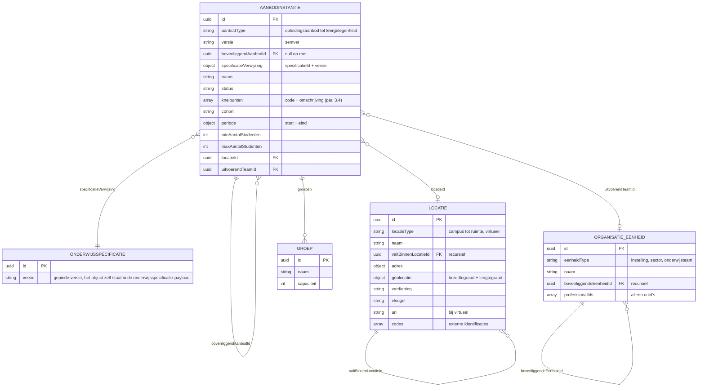
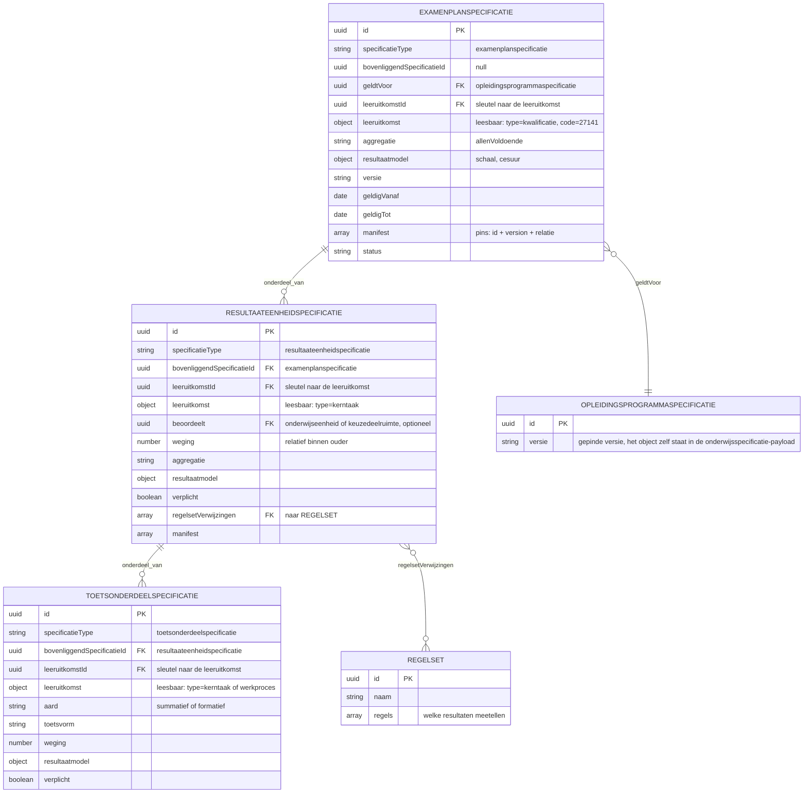
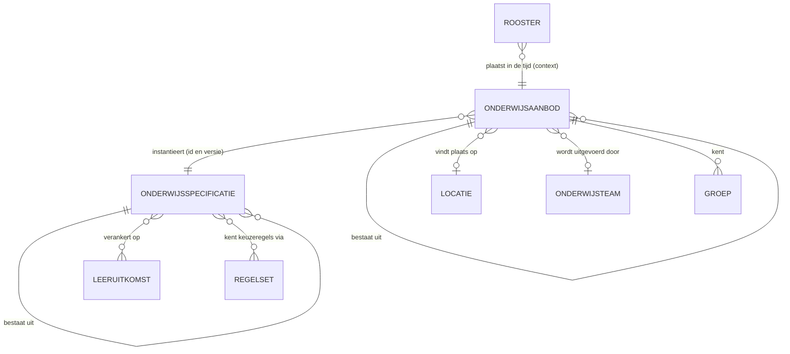
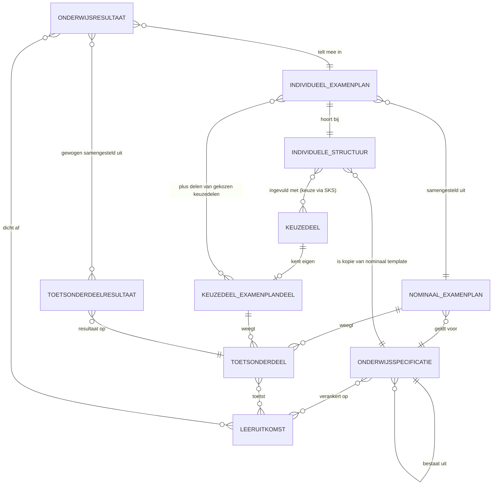
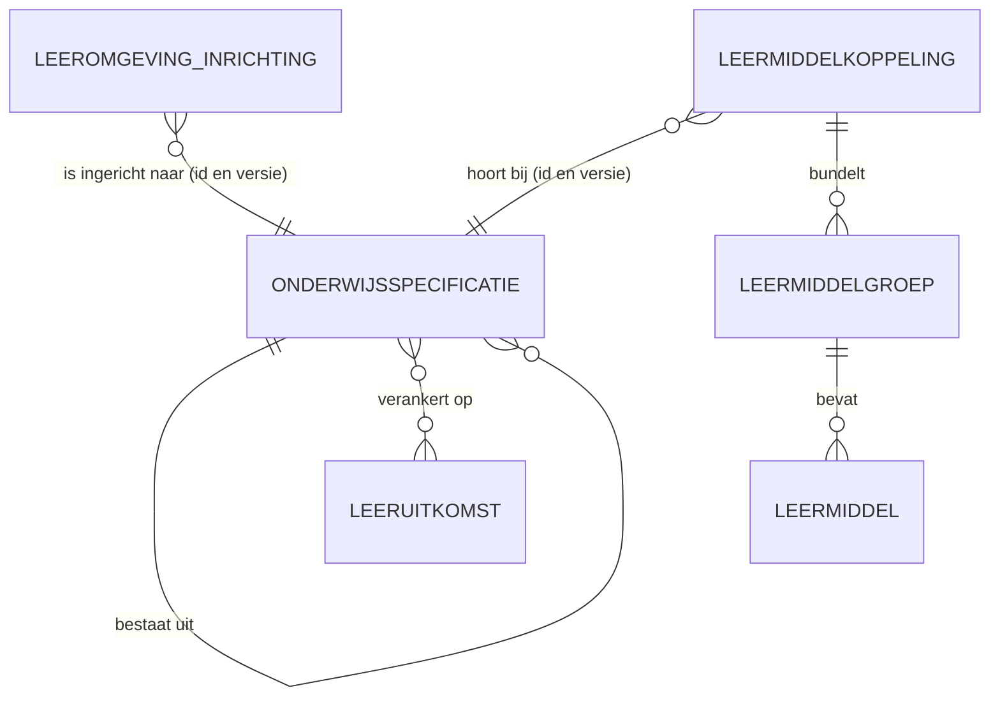

# Logisch gegevensmodel

Per begrippenfamilie de entiteiten, hun velden en hun onderlinge relaties, onafhankelijk van de techniek waarin ze worden uitgewisseld. Wat een diagram niet kan uitdrukken staat in [regels bij de schema's](regels.md); de technische vorm die hieruit volgt staat in de [schema's](schemas/).

## Onderwijsspecificatie

Alle specificaties zijn hetzelfde objecttype, gespecialiseerd via `specificatieType`. In het informatiemodel hieronder betekent `onderdeel_van` additief (de studielast telt op) en `variant_van` alternatief (een keuze tussen varianten, geen optelling). Elke entiteit draagt daarnaast `versie` (semver); dat is voor de leesbaarheid niet in elke box herhaald.

```mermaid
erDiagram
    OPLEIDINGSSPECIFICATIE ||--o{ OPLEIDINGSPROGRAMMASPECIFICATIE_LEERWEG : variant_van
    OPLEIDINGSPROGRAMMASPECIFICATIE_LEERWEG ||--o{ OPLEIDINGSPROGRAMMASPECIFICATIE_DOELGROEP : variant_van
    OPLEIDINGSPROGRAMMASPECIFICATIE_DOELGROEP ||--o{ ONDERWIJSEENHEIDSPECIFICATIE : onderdeel_van
    OPLEIDINGSPROGRAMMASPECIFICATIE_DOELGROEP ||--|| KEUZEDEELRUIMTESPECIFICATIE : bevat
    ONDERWIJSEENHEIDSPECIFICATIE ||--o{ LEERONDERDEELSPECIFICATIE : onderdeel_van
    KEUZEDEELRUIMTESPECIFICATIE }o--o{ REGELSET : regelsetVerwijzingen
    REGELSET }o--o{ KEUZEDEELPROGRAMMASPECIFICATIE : kiesbaar
    REGELSET }o--o{ LEERUITKOMST : "stelt deelname-voorwaarden in behaalde leeruitkomsten"
    KEUZEDEELPROGRAMMASPECIFICATIE ||--o{ ONDERWIJSEENHEIDSPECIFICATIE : onderdeel_van

    OPLEIDINGSSPECIFICATIE }o--|| LEERUITKOMST : "verankert op"
    OPLEIDINGSPROGRAMMASPECIFICATIE_LEERWEG }o--|| LEERUITKOMST : "verankert op"
    OPLEIDINGSPROGRAMMASPECIFICATIE_DOELGROEP }o--|| LEERUITKOMST : "verankert op"
    ONDERWIJSEENHEIDSPECIFICATIE }o--|| LEERUITKOMST : "verankert op"
    LEERONDERDEELSPECIFICATIE }o--|| LEERUITKOMST : "verankert op"
    KEUZEDEELPROGRAMMASPECIFICATIE }o--|| LEERUITKOMST : "verankert op"
    LEERUITKOMST ||--o{ LEERUITKOMST : "aggregeert bottom-up en top-down"
    LEERUITKOMST {
        uuid id PK
        string versie "eigen lifecycle"
        string naam
        object bron "standaard (nu sbb-kwalificatiekader, later bv. competentnl) + type + code"
        uuid bovenliggendLeeruitkomstId FK "recursief, orde van grootte per niveau"
        string waardedocument "diploma, certificaat, later microcredential"
        array indicatieveOmvang "SBU en/of EC naast elkaar ([ADR 0004](../Referentiemateriaal/adr/0004-leeruitkomsten-sbu-ec-logistieke-containergrootte.md))"
        string omschrijving "optioneel, per gebruiksprofiel"
        string resultaat "optioneel"
        array gedrag "optioneel"
        int nlqfNiveau
    }
    OPLEIDINGSSPECIFICATIE {
        uuid id PK
        string specificatieType "opleidingsspecificatie"
        uuid bovenliggendSpecificatieId "null"
        uuid leeruitkomstId FK "sleutel naar leeruitkomst"
        string naam
        string curriculumtype
        string versie
        date geldigVanaf
        date geldigTot
        object studielast "waarde + SBU"
        array manifest "pins: id + version + relatie"
        string status
    }
    OPLEIDINGSPROGRAMMASPECIFICATIE_LEERWEG {
        uuid id PK
        string specificatieType "opleidingsprogrammaspecificatie"
        uuid bovenliggendSpecificatieId FK "opleiding"
        uuid leeruitkomstId FK "sleutel naar leeruitkomst"
        string programmaLaag "leerweg"
        string leerweg "BOL of BBL"
        string programmatype "diplomaprogramma"
        object studielast
    }
    OPLEIDINGSPROGRAMMASPECIFICATIE_DOELGROEP {
        uuid id PK
        string specificatieType "opleidingsprogrammaspecificatie"
        uuid bovenliggendSpecificatieId FK "leerweg-programma"
        uuid leeruitkomstId FK "sleutel naar leeruitkomst"
        string programmaLaag "doelgroep"
        string doelgroep "regulier, zijinstromer, hybride, organisatiespecifiek"
        string leerweg
        string curriculumtype
        object organisatie "optioneel, bv. Ziekenhuis 12"
        string cohort
        date startdatum
        date geldigVanaf
        date geldigTot
        object studielast
        array manifest "pins: id + version + relatie"
    }
    ONDERWIJSEENHEIDSPECIFICATIE {
        uuid id PK
        string specificatieType "onderwijseenheidspecificatie"
        uuid bovenliggendSpecificatieId FK "programma of keuzedeelprogramma"
        uuid leeruitkomstId FK "sleutel naar leeruitkomst"
        string naam
        object studielast
    }
    LEERONDERDEELSPECIFICATIE {
        uuid id PK
        string specificatieType "leeronderdeelspecificatie"
        uuid bovenliggendSpecificatieId FK "onderwijseenheid"
        uuid leeruitkomstId FK "sleutel naar leeruitkomst"
        string naam
        string tijdsverdeling "BOT of OOT"
        object studielast
    }
    KEUZEDEELRUIMTESPECIFICATIE {
        uuid id PK
        string specificatieType "keuzedeelruimtespecificatie"
        uuid bovenliggendSpecificatieId FK "doelgroep-programma"
        object studielast "keuzeruimte in SBU"
        array regelsetVerwijzingen FK "naar REGELSET"
    }
    KEUZEDEELPROGRAMMASPECIFICATIE {
        uuid id PK
        string specificatieType "opleidingsprogrammaspecificatie"
        uuid bovenliggendSpecificatieId "null, zelfstandig"
        uuid leeruitkomstId FK "sleutel naar leeruitkomst"
        string programmatype "keuzedeelprogramma"
        string keuzedeelKlasse "algemeen-verbredend of beroepsspecifiek-verdiepend"
        object studielast
    }
    REGELSET {
        uuid id PK
        string naam
        uuid vanToepassingOp FK "keuzedeelruimte"
        array regels "kiesbaar + voorwaardeVooraf in behaalde leeruitkomsten"
    }
```

Het model toont de relatie tussen specificatie en leeruitkomst als veel-op-veel. De payload implementeert dat voorlopig als één `leeruitkomstId` per specificatie; een array-vorm is nog niet uitgewerkt.

## Onderwijsaanbod

## Resultaatstructuur en examenplan

## Onderwijscatalogus naar planning en roostering

De begrippen uit het semantisch kader en hun relaties, in de context van dit proces. Links de wereld van OC (specificeren), rechts die van P (instantiëren); de koppeling verbindt ze via de verwijzing "instantieert".

## Onderwijscatalogus naar studentinformatiesysteem

Conform het ROSA Kernmodel Onderwijsinformatie (KOI) en [ADR 0022](../Referentiemateriaal/adr/0022-resultaatbegrippen-conform-rosa-koi.md): een onderwijsresultaat wordt behaald op leeruitkomsten, en meerdere toetsonderdeelresultaten leiden gewogen tot dat onderwijsresultaat. De verbintenis hoort bij het aanbod (ankertabel), niet bij de specificatie, en staat daarom niet in dit kernmodel.

## Onderwijscatalogus naar leermanagementsysteem

