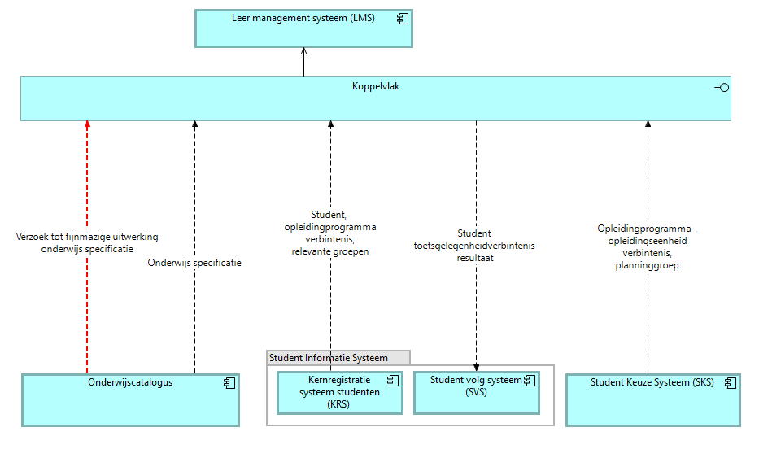

# Leermanagementsysteem (LMS)

Het leermanagementsysteem is de online leeromgeving waarin de student het onderwijs volgt. Het neemt de onderwijsspecificatiestructuur van de catalogus over, inclusief de inhoudsvelden van de leeruitkomsten die het aan de student toont, en richt daarmee de leeromgeving in. Het bezit de leermiddelkoppeling, de koppeling tussen leermiddelgroepen en specificatie ([U3](../uitgangspunten.md#u3-resource-eigenaarschap)), en meldt die terug aan de catalogus. Kiesbaarheid is niet zijn domein: regelsets gaan over deze koppeling niet mee.

## Koppelvlak

De view toont het koppelvlak van het leermanagementsysteem: de optelsom van zijn koppelingen op de informatiestromen-hoofdplaat v1.7.

## Endpoints

Endpoints die LMS zelf implementeert. Authenticatie op elk endpoint: [auth-standaard](../auth-standaard.md).

| Endpoint/event | Methode | Parameters | Request | Response | Statuscodes | Interacties |
|---|---|---|---|---|---|---|
| `/leermiddelkoppelingen/{id}` | GET | — | — | Leermiddelkoppeling-instantie: leermiddelgroepen per specificatie (payload nog uit te werken) | 200, 400, 404 | L5 |
| `specificatie-beschikbaar` | POST | — | [specification-reference.json](../Datamodelschema's/specification-reference.json) | — | 200 | L1 |
| `specificatie-gewijzigd` | POST | — | [specification-changed.json](../Datamodelschema's/specification-changed.json) | — | 200 | L6 |
