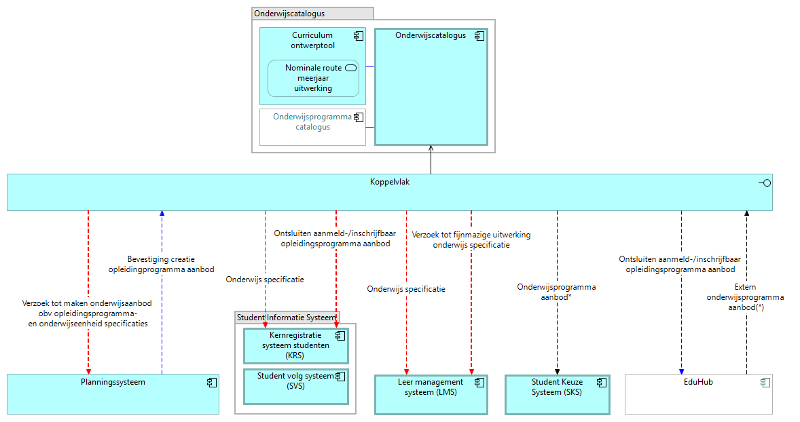

# Onderwijscatalogus (OC)

De onderwijscatalogus is het distributiepunt voor onderwijsspecificaties: zij neemt ze aan van de curriculum-ontwerptool, legt ze vast en publiceert ze naar de systemen die het onderwijs klaarzetten voor de start van de student. Zij bezit de onderwijsspecificaties ([U3](../uitgangspunten.md#u3-resource-eigenaarschap)), en is daarmee in elk van de drie koppelingen hieronder de partij die een wijziging meldt en de resource levert ([U4](../uitgangspunten.md#u4-notify-then-pull)).

De view toont het koppelvlak van de onderwijscatalogus als optelsom van haar koppelingen op de informatiestromen-hoofdplaat v1.7.

Endpoints die OC zelf implementeert. Authenticatie op elk endpoint: [auth-standaard](../auth-standaard.md).

| Endpoint/event | Methode | Parameters | Request | Response | Statuscodes | Interacties |
|---|---|---|---|---|---|---|
| `/onderwijsspecificaties/{id}` | GET | `versie` (optioneel, standaard laatst gepubliceerd) | — | [education-specification.json](../Datamodelschema's/education-specification.json); welk deel meekomt bepaalt het [gebruiksprofiel](../Datamodelschema's/README.md#gebruiksprofielen) | 200, 400, 404 | I2, S2, L2 |
| `/onderwijsspecificaties/{id}/delta` | GET | `van` (versie, verplicht), `naar` (versie, verplicht) | — | JSON Patch (RFC 6902), [education-specification-delta.json](../Datamodelschema's/education-specification-delta.json) | 200, 400, 404 | I2, S2, L2 |
| `/onderwijsspecificaties` | GET | `status` (optioneel, standaard `gepubliceerd`), `gewijzigdSinds` (optioneel, timestamp) | — | Lijst van specificatie-id's met hun laatste versie ([specification-reference.json](../Datamodelschema's/specification-reference.json)) | 200, 400 | I7 |
| `/examenplanspecificaties/{id}` | GET | `versie` (optioneel, standaard laatst gepubliceerd) | — | [result-structure.json](../Datamodelschema's/result-structure.json): toetsonderdelen, weging en aggregatie | 200, 400, 404 | S3 |
| `/abonnementen` | POST | — | [subscription.json](../Datamodelschema's/subscription.json): `callbackUrl` en de events | Abonnement-id | 201, 400 | I8 |
| `verwerkingsstatus` | POST | — | [processing-status.json](../Datamodelschema's/processing-status.json) | — | 200 | I3 |
| `inrichtingsstatus` | POST | — | Status en referentie naar de inrichting (uuid), specificatie-id en versie (payloadschema nog niet uitgewerkt) | — | 200 | S4, L3 |
| `leermiddelkoppeling-beschikbaar` | POST | — | Referentie (uuid) naar de leermiddelkoppeling, specificatie-id en versie (payloadschema nog niet uitgewerkt) | — | 200 | L4 |
