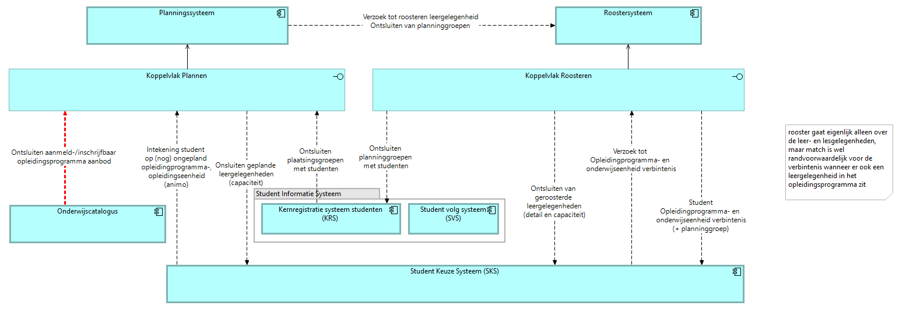

# Roostersysteem (R)

Het roostersysteem plaatst het geplande onderwijs in tijd en ruimte: het maakt van het `opleidingsaanbod` een rooster met momenten, docenten en zalen. Het bezit het rooster, waar het planningssysteem het aanbod bezit en de catalogus de specificaties ([U3](../uitgangspunten.md#u3-resource-eigenaarschap)).

De view toont het gedeelde koppelvlak van planning en roostering als optelsom van hun koppelingen op de informatiestromen-hoofdplaat v1.7.

Dit pakket specificeert geen koppeling met het roostersysteem, en levert er dus nog geen endpoints voor op. Het systeem komt alleen als context voor, bij de koppeling met planning en roostering: [doorwerking naar het roostersysteem](../Interactiepatronen/onderwijscatalogus-planning-en-roostering.md#context-doorwerking-naar-het-roostersysteem).
