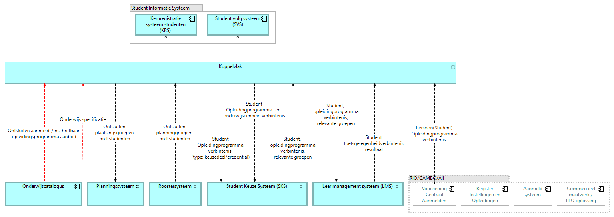

# Studentinformatiesysteem (SIS)

Het studentinformatiesysteem is hier de combinatie van het **kernregistratiesysteem (KRS)**, dat de inschrijving en de verbintenis vastlegt, en het **studentvolgsysteem (SVS)**, dat de individuele structuur, de voortgang en de resultaten bijhoudt. Het bezit de verbintenissen, de individuele structuren, de voortgang en de resultaten ([U3](../uitgangspunten.md#u3-resource-eigenaarschap)). Uit de catalogus haalt het twee dingen op, de onderwijsspecificatiestructuur en de resultaatstructuur, en richt daarmee het nominale template in plus de mapping van welke toetsonderdeelresultaten welke leeruitkomsten afdichten.

De view toont het koppelvlak van het studentinformatiesysteem, met kernregistratie (KRS) en studievoortgang (SVS), op de informatiestromen-hoofdplaat v1.7.

Endpoints die SIS zelf implementeert. Authenticatie op elk endpoint: [auth-standaard](../auth-standaard.md). Een eigen REST-endpoint serveert SIS in deze koppeling niet: de inrichtingsstatus draagt de referentie naar de inrichting al in het event mee, en een pull-operatie daarop is niet gedefinieerd.

| Endpoint/event | Methode | Parameters | Request | Response | Statuscodes | Interacties |
|---|---|---|---|---|---|---|
| `specificatie-en-resultaatstructuur-beschikbaar` | POST | — | Specificatie-id en versie, examenplan-id en versie (payloadschema nog niet uitgewerkt) | — | 200 | S1 |
| `examenplanspecificatie-gewijzigd` | POST | — | [specification-changed.json](../Datamodelschema's/specification-changed.json) | — | 200 | S5 |
