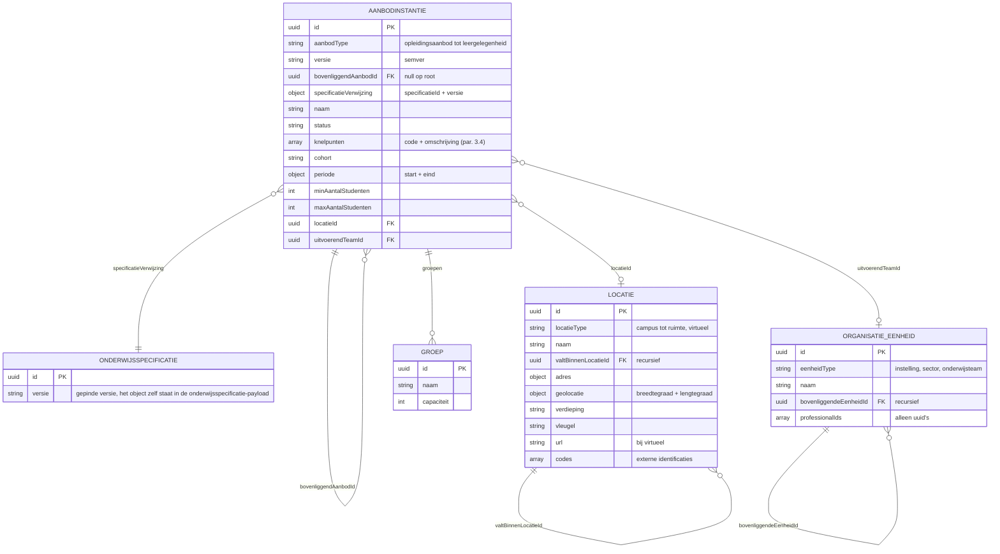
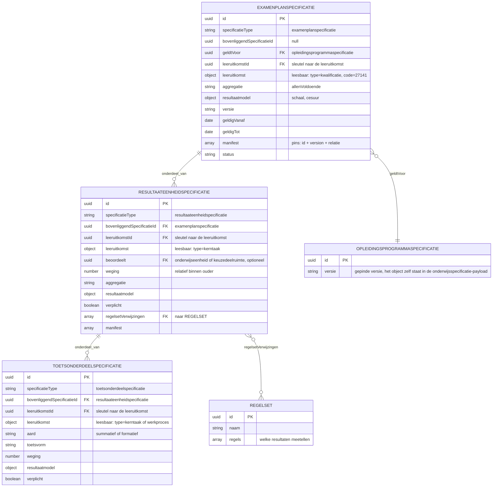
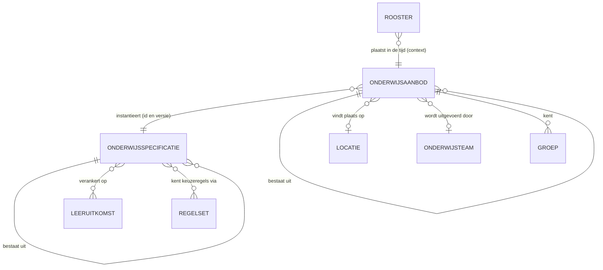
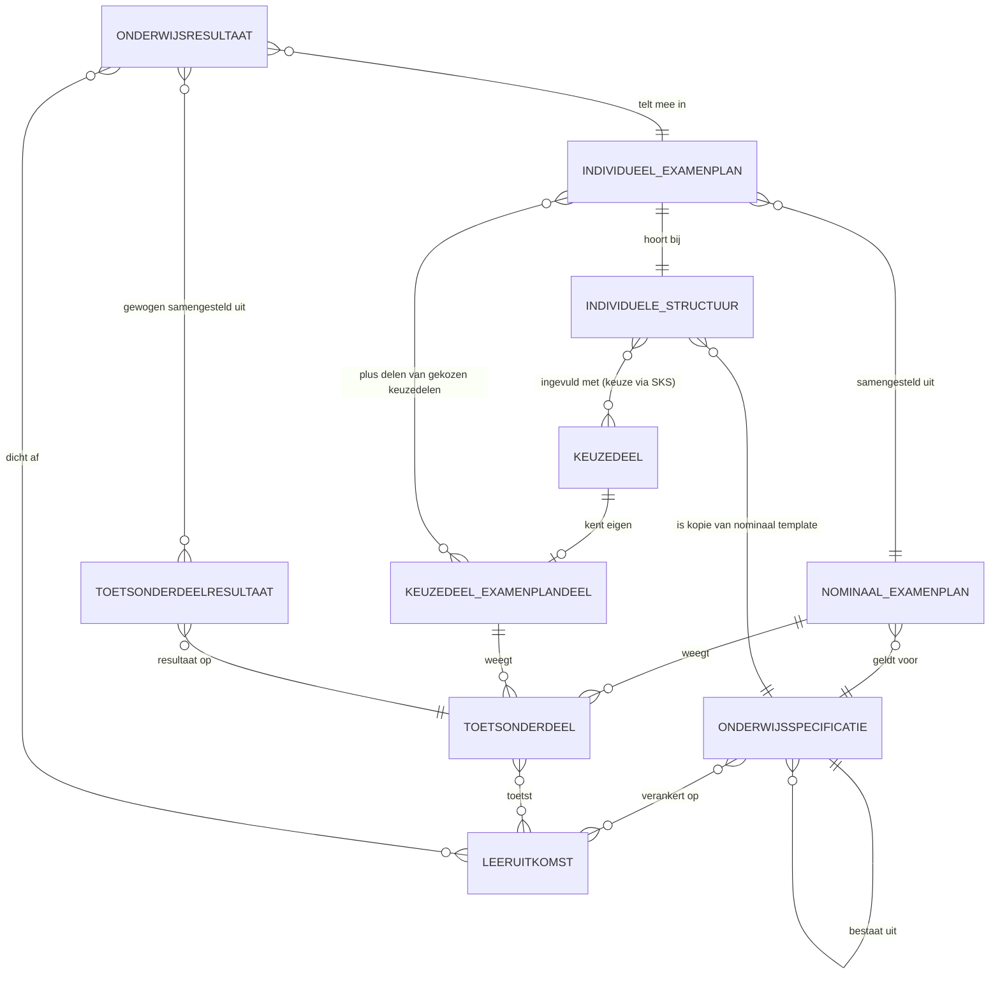
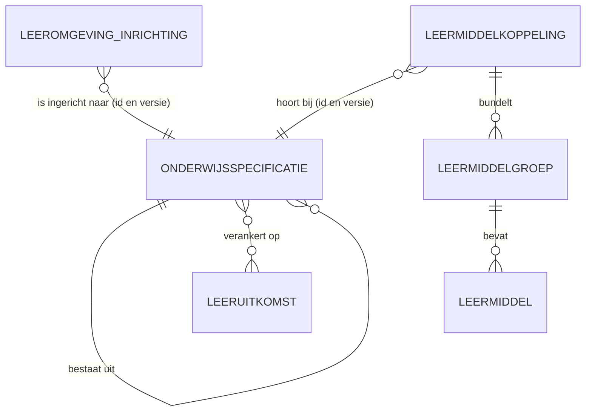

# Datamodelschema's

De JSON Schema's bij de payload-specificaties van dit pakket: per resource de vorm waarin hij over een koppeling gaat. Zij zijn **alfa en indicatief** ([U1](../uitgangspunten.md#u1-indicatief-en-onderbouwend-niet-voorschrijvend)). Welke velden een koppeling gebruikt, en waarom, staat in de payload-specificatie; die is daarin leidend. Deze map draagt de vorm, niet de betekenis.

De schema's volgen de payloadvorm uit [U7](../uitgangspunten.md#u7-payload-plat-met-verwijzingen-en-de-sleutelconventie): plat, met verwijzingen tussen objecten in plaats van nesting, zodat een consument alleen ophaalt wat hij nodig heeft. In het gebundelde releasedocument staan ze voluit als bijlage; in de zip en in dit repository staan ze als losse bestanden, zodat je ze direct kunt gebruiken om tegen te valideren.

## Informatiemodellen

### Onderwijsspecificatie

Alle specificaties zijn hetzelfde objecttype, gespecialiseerd via `specificatieType`. In het informatiemodel hieronder betekent `onderdeel_van` additief (de studielast telt op) en `variant_van` alternatief (een keuze tussen varianten, geen optelling). Elke entiteit draagt daarnaast `versie` (semver); dat is voor de leesbaarheid niet in elke box herhaald.

```mermaid
erDiagram
    OPLEIDINGSSPECIFICATIE ||--o{ OPLEIDINGSPROGRAMMASPECIFICATIE_LEERWEG : variant_van
    OPLEIDINGSPROGRAMMASPECIFICATIE_LEERWEG ||--o{ OPLEIDINGSPROGRAMMASPECIFICATIE_DOELGROEP : variant_van
    OPLEIDINGSPROGRAMMASPECIFICATIE_DOELGROEP ||--o{ ONDERWIJSEENHEIDSPECIFICATIE : onderdeel_van
    OPLEIDINGSPROGRAMMASPECIFICATIE_DOELGROEP ||--|| KEUZEDEELRUIMTESPECIFICATIE : bevat
    ONDERWIJSEENHEIDSPECIFICATIE ||--o{ LEERONDERDEELSPECIFICATIE : onderdeel_van
    KEUZEDEELRUIMTESPECIFICATIE }o--o{ REGELSET : regelsetVerwijzingen
    REGELSET }o--o{ KEUZEDEELPROGRAMMASPECIFICATIE : kiesbaar
    REGELSET }o--o{ LEERUITKOMST : "stelt deelname-voorwaarden in behaalde leeruitkomsten"
    KEUZEDEELPROGRAMMASPECIFICATIE ||--o{ ONDERWIJSEENHEIDSPECIFICATIE : onderdeel_van

    OPLEIDINGSSPECIFICATIE }o--|| LEERUITKOMST : "verankert op"
    OPLEIDINGSPROGRAMMASPECIFICATIE_LEERWEG }o--|| LEERUITKOMST : "verankert op"
    OPLEIDINGSPROGRAMMASPECIFICATIE_DOELGROEP }o--|| LEERUITKOMST : "verankert op"
    ONDERWIJSEENHEIDSPECIFICATIE }o--|| LEERUITKOMST : "verankert op"
    LEERONDERDEELSPECIFICATIE }o--|| LEERUITKOMST : "verankert op"
    KEUZEDEELPROGRAMMASPECIFICATIE }o--|| LEERUITKOMST : "verankert op"
    LEERUITKOMST ||--o{ LEERUITKOMST : "aggregeert bottom-up en top-down"
    LEERUITKOMST {
        uuid id PK
        string versie "eigen lifecycle"
        string naam
        object bron "standaard (nu sbb-kwalificatiekader, later bv. competentnl) + type + code"
        uuid bovenliggendLeeruitkomstId FK "recursief, orde van grootte per niveau"
        string waardedocument "diploma, certificaat, later microcredential"
        array indicatieveOmvang "SBU en/of EC naast elkaar ([ADR 0004](../../Referentiemateriaal/adr/0004-leeruitkomsten-sbu-ec-logistieke-containergrootte.md))"
        string omschrijving "optioneel, per gebruiksprofiel"
        string resultaat "optioneel"
        array gedrag "optioneel"
        int nlqfNiveau
    }
    OPLEIDINGSSPECIFICATIE {
        uuid id PK
        string specificatieType "opleidingsspecificatie"
        uuid bovenliggendSpecificatieId "null"
        uuid leeruitkomstId FK "sleutel naar leeruitkomst"
        string naam
        string curriculumtype
        string versie
        date geldigVanaf
        date geldigTot
        object studielast "waarde + SBU"
        array manifest "pins: id + version + relatie"
        string status
    }
    OPLEIDINGSPROGRAMMASPECIFICATIE_LEERWEG {
        uuid id PK
        string specificatieType "opleidingsprogrammaspecificatie"
        uuid bovenliggendSpecificatieId FK "opleiding"
        uuid leeruitkomstId FK "sleutel naar leeruitkomst"
        string programmaLaag "leerweg"
        string leerweg "BOL of BBL"
        string programmatype "diplomaprogramma"
        object studielast
    }
    OPLEIDINGSPROGRAMMASPECIFICATIE_DOELGROEP {
        uuid id PK
        string specificatieType "opleidingsprogrammaspecificatie"
        uuid bovenliggendSpecificatieId FK "leerweg-programma"
        uuid leeruitkomstId FK "sleutel naar leeruitkomst"
        string programmaLaag "doelgroep"
        string doelgroep "regulier, zijinstromer, hybride, organisatiespecifiek"
        string leerweg
        string curriculumtype
        object organisatie "optioneel, bv. Ziekenhuis 12"
        string cohort
        date startdatum
        date geldigVanaf
        date geldigTot
        object studielast
        array manifest "pins: id + version + relatie"
    }
    ONDERWIJSEENHEIDSPECIFICATIE {
        uuid id PK
        string specificatieType "onderwijseenheidspecificatie"
        uuid bovenliggendSpecificatieId FK "programma of keuzedeelprogramma"
        uuid leeruitkomstId FK "sleutel naar leeruitkomst"
        string naam
        object studielast
    }
    LEERONDERDEELSPECIFICATIE {
        uuid id PK
        string specificatieType "leeronderdeelspecificatie"
        uuid bovenliggendSpecificatieId FK "onderwijseenheid"
        uuid leeruitkomstId FK "sleutel naar leeruitkomst"
        string naam
        string tijdsverdeling "BOT of OOT"
        object studielast
    }
    KEUZEDEELRUIMTESPECIFICATIE {
        uuid id PK
        string specificatieType "keuzedeelruimtespecificatie"
        uuid bovenliggendSpecificatieId FK "doelgroep-programma"
        object studielast "keuzeruimte in SBU"
        array regelsetVerwijzingen FK "naar REGELSET"
    }
    KEUZEDEELPROGRAMMASPECIFICATIE {
        uuid id PK
        string specificatieType "opleidingsprogrammaspecificatie"
        uuid bovenliggendSpecificatieId "null, zelfstandig"
        uuid leeruitkomstId FK "sleutel naar leeruitkomst"
        string programmatype "keuzedeelprogramma"
        string keuzedeelKlasse "algemeen-verbredend of beroepsspecifiek-verdiepend"
        object studielast
    }
    REGELSET {
        uuid id PK
        string naam
        uuid vanToepassingOp FK "keuzedeelruimte"
        array regels "kiesbaar + voorwaardeVooraf in behaalde leeruitkomsten"
    }
```

Het model toont de relatie tussen specificatie en leeruitkomst als veel-op-veel. De payload implementeert dat voorlopig als één `leeruitkomstId` per specificatie; een array-vorm is nog niet uitgewerkt.

### Onderwijsaanbod

### Resultaatstructuur en examenplan

### Onderwijscatalogus naar planning en roostering

De begrippen uit het semantisch kader en hun relaties, in de context van dit proces. Links de wereld van OC (specificeren), rechts die van P (instantiëren); de koppeling verbindt ze via de verwijzing "instantieert".

### Onderwijscatalogus naar studentinformatiesysteem

Conform het ROSA Kernmodel Onderwijsinformatie (KOI) en [ADR 0022](../../Referentiemateriaal/adr/0022-resultaatbegrippen-conform-rosa-koi.md): een onderwijsresultaat wordt behaald op leeruitkomsten, en meerdere toetsonderdeelresultaten leiden gewogen tot dat onderwijsresultaat. De verbintenis hoort bij het aanbod (ankertabel), niet bij de specificatie, en staat daarom niet in dit kernmodel.

### Onderwijscatalogus naar leermanagementsysteem

## Regels bij de schema's

Wat een JSON Schema niet kan uitdrukken, maar wel geldt. Zonder deze regels valideren twee implementaties allebei en werken ze toch niet samen.

**Twee soorten ouder-verwijzing.** `bovenliggendSpecificatieId` draagt zowel onderdeel-van (additief, een kerntaak onder een programma) als variant-van (alternatief, een doelgroep onder een leerweg). Welke van de twee geldt staat in het `manifest` van de ouder, in `relatie`.

**Aggregatie-invariant.** `studielast` telt bottom-up op binnen onderdeel-van: de som van de onderdelen is gelijk aan de ouder. Over varianten telt hij niet op; een leerweg en een doelgroep zijn alternatieven, geen optelling.

**Keuzedelen staan als root.** Een keuzedeelprogramma draagt geen ouder-verwijzing en is alleen bereikbaar via `regelsetVerwijzingen`. Wie de structuur aflegt via de ouder-verwijzing mist ze. Ze zijn herbruikbaar over opleidingen heen (N:M via de regelset).

**Regels staan buiten de specificatie.** `regelsetVerwijzingen` kan op elke specificatie staan, niet alleen op de keuzeruimte. De regelset draagt de kiesbaarheid en de voorwaarde vooraf, uitgedrukt in **behaalde leeruitkomsten** en niet in afgeronde specificaties. De interne structuur van een regelset valt buiten deze schema's.

**Rekenregels staan op de resultaateenheid.** `aggregatie` en `weging` horen op de `resultaateenheidspecificatie`, niet op het toetsonderdeel: de rekenregel staat op het niveau waar hij geldt. `aard: formatief` betekent weging 0 en telt niet mee voor het diploma.

**Knelpuntcodes.** De code benoemt welke categorie randvoorwaarde onvervulbaar bleek. De lijst is een aanzet; een genormeerde codelijst met foutmodel volgt.

| Code | Geschonden constraint | Voorbeeld |
|---|---|---|
| `capaciteitTekort` | Inzetbare uren van team of professionals | 4 groepen vragen 960 contacturen, 666 beschikbaar |
| `expertiseTekort` | Vereist expertiseprofiel ontbreekt | Geen docent met profiel farmaceutische zorg |
| `ruimteTekort` | Ruimtetype of ruimtecapaciteit ontoereikend | Geen praktijklokaal beschikbaar in de periode |
| `locatieConflict` | Zelfde ruimte gelijktijdig dubbel nodig | Twee opleidingen claimen lokaal 2.14 in dezelfde weken |
| `volgordeConflict` | Voorwaarde vooraf past niet in de periodes | Wiskunde 1 en Ruimtelijk inzicht passen niet na elkaar binnen het jaar |
| `regelConflict` | Keuzeregels (regelset) onvervulbaar | De regelset sluit alle kiesbare keuzedelen uit |
| `groepsgrootteConflict` | Minimum of maximum aantal studenten | Prognose blijft onder het minimum |
| `kalenderConflict` | Urennorm of lesweken passen niet | Vereiste begeleide uren passen niet in de beschikbare weken |

**Versionering.** Semver per specificatie: MAJOR is brekend binnen dezelfde identiteit (leeruitkomsten, structuur, studielast), MINOR is additief, PATCH is een correctie. Het `id` is stabiel; een fundamentele wijziging — een nieuw kwalificatiedossier, gewijzigde wettelijke eisen — is een **nieuwe specificatie met een nieuw id**, geen MAJOR-ophoging. Temporele geldigheid loopt via `geldigVanaf` en `geldigTot`, niet via het versienummer: zo kunnen meerdere versies gelijktijdig actief zijn, de oude voor lopende studenten en de nieuwe voor nieuwe instroom. Eén partij geeft versienummers uit, de onderwijscatalogus.

**Momentopname en manifest.** Een geleverde payload is een momentopname: elke specificatie staat erin met haar `versie`, en de versie van de bovenste specificatie is de release-versie daarvan. Het `manifest` maakt de pin expliciet ([manifest-item.json](manifest-item.json)). Een MAJOR-ophoging van een onderdeel propageert **niet** automatisch omhoog: dat gebeurt alleen als de afhankelijkheid breekt, dus wanneer leeruitkomsten, weging of het recht op een waardedocument veranderen. Anders is het enkel een nieuwe pin.

| Breekt onderdeel A de bovenliggende specificatie? | Bovenliggende specificatie | Manifest pint |
|---|---|---|
| Ja (leeruitkomst, weging of diploma-eligibility) | `2.1` naar `3.0` (MAJOR) | A `2.0` |
| Nee (interne herstructurering van A) | `2.1` naar `2.2` (MINOR) | A `2.0` |

**Deactiveren, niet verwijderen.** Zodra er aanbod, een verbintenis of een resultaat aan een specificatie hangt, is verwijderen geen optie: een lopende student moet herleidbaar blijven tot de versie waarop hij is ingeschreven. Daarvoor is de status `gedeactiveerd`.

**Wijzigingsklasse.** `changeClass` in [specification-changed.json](specification-changed.json) zegt wat de ontvanger moet doen.

| Waarde | Wat het betekent | Gevolg voor de ontvanger |
|---|---|---|
| `fundamenteel` | Nieuw kwalificatiedossier, gewijzigde wettelijke eisen, nieuwe onderwijsvisie | Nieuwe specificatie met een nieuw id; meestal alleen voor nieuwe instroom |
| `examenplan` | Aanpassing van de summatieve resultaatstructuur | Alleen na expliciete impactanalyse en besluit; de strengste regels, want het examenplan is een contractuele afspraak met de student |
| `onderdeel` | Update van een onderwijseenheid- of leeronderdeelspecificatie | Nieuwe versie van het onderdeel; de bovenliggende specificatie volgt alleen bij een brekende afhankelijkheid |
| `niet-brekend` | Actualisatie van lessen, materiaal of uitvoeringsvorm | PATCH of MINOR binnen dezelfde identiteit |
| `na-planning-of-roostering` | Wijziging nadat aanbod of rooster is gepubliceerd | Alleen bij uitzondering en na ketenafstemming |

**Locatie en organisatie.** Eén object `locatie` dekt elke korrelgrootte via `locatieType`, van campus tot ruimte en ook virtueel; `valtBinnenLocatieId` legt de ruimtelijke hiërarchie vast. Een locatie kan een adres en onafhankelijk daarvan een geopunt dragen. `organisatieEenheden` volgt hetzelfde recursiepatroon via `bovenliggendeEenheidId`; `professionalIds` draagt alleen uuid's, want inzet en beschikbaarheid leven in het plan-van-inzetsysteem.

## Gebruiksprofielen

Alle koppelingen delen dezelfde onderwijsspecificatie-payload; per koppeling verschilt welke onderdelen meegaan. Dat verschil staat hier, niet in het schema: het schema legt de vorm vast, het profiel wat een koppeling ervan gebruikt.

### Onderwijscatalogus naar planning en roostering

| Onderdeel | Gebruik in onderwijscatalogus naar planning en roostering |
|---|---|
| `onderwijsspecificaties` | Volledig, inclusief manifest |
| `regelsets` | Volledig; `voorwaardeVooraf` bevat leeruitkomst-ids uitsluitend als **verbindende sleutels** voor volgordebepaling: planning gebruikt ze zonder de inhoud te kennen ([ADR 0026](../../Referentiemateriaal/adr/0026-leeruitkomst-als-verbindende-sleutel.md)) |
| `leeruitkomsten` | **Niet meegeleverd.** Planning heeft de betekenis, aggregatie en inhoud van leeruitkomsten niet nodig ([ADR 0026](../../Referentiemateriaal/adr/0026-leeruitkomst-als-verbindende-sleutel.md)) |

### Onderwijscatalogus naar studentinformatiesysteem

| Onderdeel | Gebruik in onderwijscatalogus naar studentinformatiesysteem |
|---|---|
| `onderwijsspecificaties` | Volledig, inclusief manifest (nominaal template) |
| `leeruitkomsten` | **Volledig**, inclusief aggregatie (`bovenliggendLeeruitkomstId`), `waardedocument` en `indicatieveOmvang`: de sleutel tussen specificatie, resultaatstructuur en onderwijsresultaat ([ADR 0022](../../Referentiemateriaal/adr/0022-resultaatbegrippen-conform-rosa-koi.md)) |
| `regelsets` | Volledig (kiesbaarheid keuzedeelruimte, voorwaarden in behaalde leeruitkomsten) |

Voor S3 geldt daarnaast [result-structure.json](result-structure.json) als aparte payload.

### Onderwijscatalogus naar leermanagementsysteem

| Onderdeel | Gebruik in onderwijscatalogus naar leermanagementsysteem |
|---|---|
| `onderwijsspecificaties` | Volledig tot en met `leeronderdeelspecificatie` |
| `leeruitkomsten` | **Met inhoudsvelden** (`omschrijving`, `resultaat`, `gedrag`): dat is precies wat het LMS uitwerkt en aan de student exposet |
| `regelsets` | Niet meegeleverd (kiesbaarheid is het domein van SKS en SIS) |

De leermiddelkoppeling-payload is nog niet uitgewerkt. Verwachte kern: `id`, `versie`, en per specificatie de leermiddelgroepen met een `specificatieVerwijzing` (id en versie).
