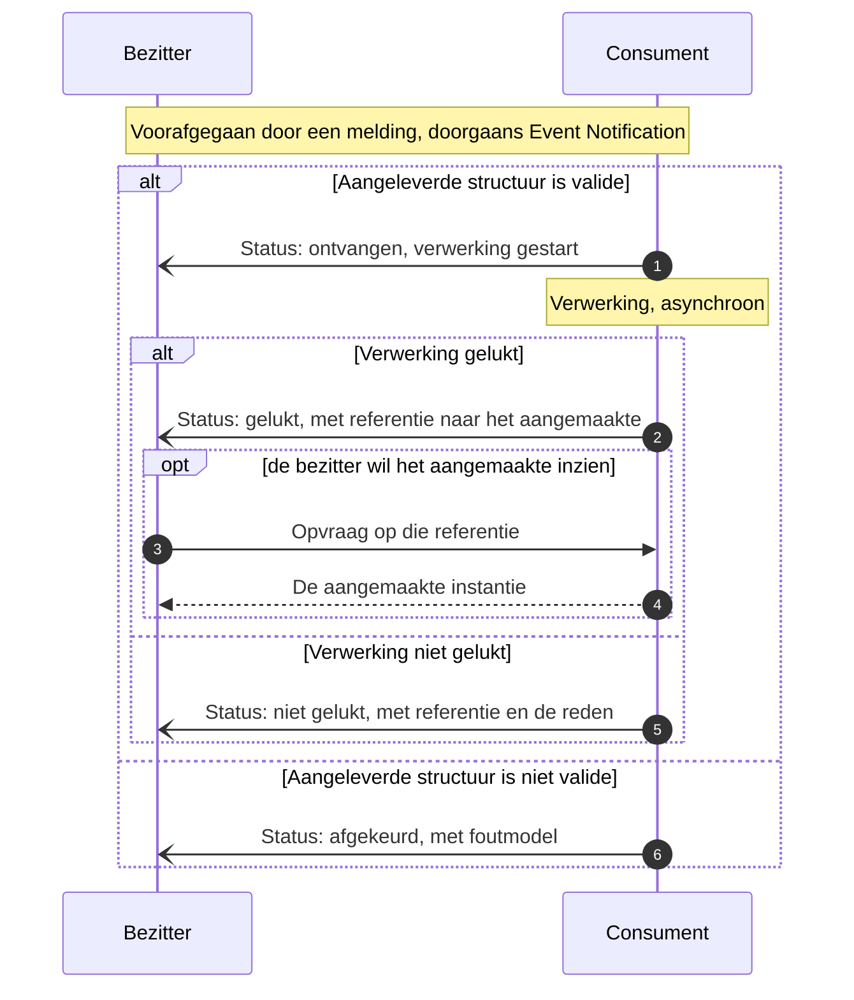

# Asynchronous Request-Reply

De verwerking duurt langer dan een aanroep mag duren, dus de uitkomst komt terug als een apart bericht met een referentie naar wat de verwerker heeft aangemaakt. De naam komt uit de [Azure Cloud Design Patterns](https://learn.microsoft.com/en-us/azure/architecture/patterns/asynchronous-request-reply); wie de verwerking als opvraagbare resource modelleert volgt [AIP-151, Long-running operations](https://google.aip.dev/151).

## Wanneer

De consument kan niet in dezelfde aanroep antwoorden. Zijn verwerking duurt te lang, kan gedeeltelijk slagen, en kan stuklopen op gronden die alleen hij kent: een structuur die niet valide is, regels waarbinnen geen geldige uitkomst bestaat, of een uitkomst die lopende afspraken zou raken. De aanroep openhouden tot dat rond is bindt de bezitter aan de doorlooptijd van de consument.

## Verloop

| Bericht | Richting | Synchroniciteit | Draagt | Draagt niet |
|---|---|---|---|---|
| Statusmelding | consument naar bezitter | Asynchroon | Status, referentie naar het aangemaakte, bij falen de reden | De aangemaakte instantie zelf |
| Opvraag | bezitter naar consument | Synchroon | De referentie uit de statusmelding | — |

## Eigenschappen

**De consument wordt bezitter van wat hij aanmaakt** ([U3](../uitgangspunten.md#u3-resource-eigenaarschap)). Daarom draagt de statusmelding een referentie en niet de instantie: wie hem wil inzien haalt hem op bij de nieuwe bezitter. De terugweg is daarmee opnieuw [Event Notification](event-notification.md), met de rollen omgedraaid.

Eén verwerking levert meer dan één statusmelding op. `Ontvangen` en `gestart` zijn niet-terminaal en zeggen alleen dat het bericht is aangekomen en het proces loopt; `gelukt`, `niet gelukt` en `afgekeurd` sluiten de verwerking af. Alleen op een terminale status stelt de bezitter zijn eigen afgeleide status bij.

**De uitkomst zit in de statuswaarde, niet in het patroon.** Of de verwerking slaagt, afketst op een validatiefout, of vraagt om een besluit dat buiten de koppeling valt: het is in alle gevallen dezelfde uitwisseling met een andere waarde in het statusveld. Dat een bericht niet aankomt is iets anders — dat is een aflevervraagstuk.

OKx duwt de status terug als event. Het alternatief uit AIP-151, de verwerking als opvraagbare resource waar de bezitter zelf naar kijkt, vraagt geen afleveradres bij de tegenpartij en dus geen [Subscription registration](subscription-registration.md).

## Toegepast in

| Koppeling | Wat teruggemeld wordt | Referentie naar |
|---|---|---|
| [Onderwijscatalogus naar planning en roostering](../Koppelingspecificaties/onderwijscatalogus-planning-en-roostering.md) | Verwerkingsstatus van het planproces | Het opleidingsaanbod |
| [Onderwijscatalogus naar studentinformatiesysteem](../Koppelingspecificaties/onderwijscatalogus-studentinformatiesysteem.md) | Inrichtingsstatus | De inrichting |
| [Onderwijscatalogus naar leermanagementsysteem](../Koppelingspecificaties/onderwijscatalogus-leermanagementsysteem.md) | Inrichtingsstatus | De inrichting |
