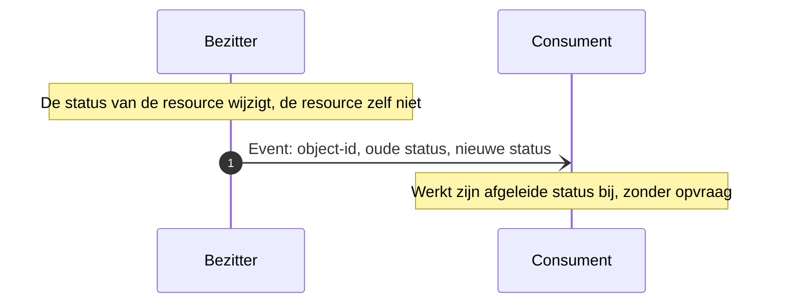

# Event-Carried State Transfer

Het event draagt de gewijzigde waarde zelf, zodat de ontvanger zijn afgeleide beeld bijwerkt zonder iets op te halen. De naam en het onderscheid met [Event Notification](event-notification.md) komen van [Martin Fowler](https://martinfowler.com/articles/201701-event-driven.html).

## Wanneer

De wijziging is volledig in het event uit te drukken en er valt niets zinnigs op te halen. Dat is het geval bij een toestandsovergang die los staat van een nieuwe versie van de resource: de resource zelf is niet veranderd, alleen zijn status. Een opvraag zou dezelfde structuur teruggeven als de ontvanger al heeft.

## Verloop

| Bericht | Richting | Synchroniciteit | Draagt | Draagt niet |
|---|---|---|---|---|
| Event | bezitter naar consument | Asynchroon | Object-id, oude waarde, nieuwe waarde | Een verwijzing die tot opvragen uitnodigt |

## Eigenschappen

**Een verloren bericht is verloren informatie.** Bij [Event Notification](event-notification.md) staat de inhoud nog bij de bezitter en haalt de consument hem alsnog op; hier is het event de enige drager. Volgorde per object-id is daarom niet comfortabel maar noodzakelijk: twee overgangen in de verkeerde volgorde laten de ontvanger achter met een verkeerde status en zonder bron om op terug te vallen.

Het event draagt inhoud en niet alleen een verwijzing. Dataminimalisatie weegt hier dus zwaarder dan bij de andere patronen: het event draagt wat de ontvanger nodig heeft om zijn afgeleide status te bepalen, en niet meer.

Wat de ontvanger met de overgang doet is applicatiefunctionaliteit en valt buiten de koppeling.

## Toegepast in

| Koppeling | Wat gemeld wordt |
|---|---|
| [Onderwijscatalogus naar planning en roostering](../Koppelingspecificaties/onderwijscatalogus-planning-en-roostering.md) | Specificatiestatus gewijzigd buiten een versiewijziging om, bijvoorbeeld van `gepubliceerd` naar `gedeactiveerd` |
