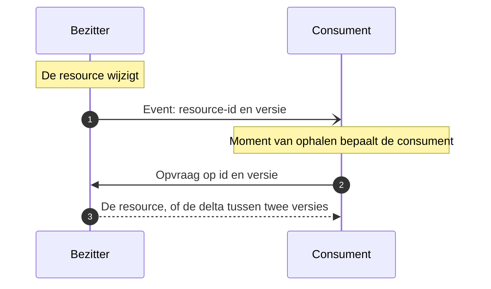

# Event Notification

De bezitter meldt met een dun bericht dát er iets is veranderd, met een verwijzing naar de resource; de consument haalt die op wanneer het hem uitkomt. De naam en de afbakening komen van [Martin Fowler](https://martinfowler.com/articles/201701-event-driven.html); dat het bericht een verwijzing draagt in plaats van de inhoud is [Claim Check](https://www.enterpriseintegrationpatterns.com/patterns/messaging/StoreInLibrary.html), in CloudEvents het attribuut `dataref`. Binnen OKx ligt de keuze voor dit patroon vast als [uitgangspunt U4](../uitgangspunten.md#u4-event-notification).

## Wanneer

De bezitter weet wanneer iets wijzigt, de consument niet. Hem laten pollen kost verkeer en loopt altijd achter op de wijziging. Hem de volledige inhoud toesturen levert het omgekeerde probleem op: de bezitter wordt afhankelijk van de verwerkingssnelheid van de consument, en verstuurt inhoud aan partijen die er maar een deel van gebruiken.

Event Notification haalt die twee uit elkaar. Het event draagt de aanleiding, de opvraag draagt de inhoud.

## Verloop

| Bericht | Richting | Synchroniciteit | Draagt | Draagt niet |
|---|---|---|---|---|
| Event | bezitter naar consument | Asynchroon | Resource-id, versie, de aanleiding | De inhoud van de resource |
| Opvraag | consument naar bezitter | Synchroon | Id, gevraagde versie of versiebereik | — |
| Antwoord | bezitter naar consument | Synchroon | De resource of de delta | — |

## Eigenschappen

Het event legt geen termijn op en verplicht niet tot ophalen. Er is geen bevestiging dat de consument de resource heeft opgehaald, en de bezitter wacht daar niet op; wil hij weten wat de verwerking opleverde, dan is dat [Asynchronous Request-Reply](asynchronous-request-reply.md).

De consument kiest de vorm van wat hij ophaalt: de volledige structuur of de delta tussen twee versies ([U11](../uitgangspunten.md#u11-toekomstvaste-endpoints-volledige-structuur-en-delta)).

Omdat de inhoud bij de bezitter blijft staan, is een gemist event herstelbaar: de consument haalt alsnog op met [Request-Reply](request-reply.md). Dat is het verschil met [Event-Carried State Transfer](event-carried-state-transfer.md), waar een verloren bericht verloren informatie is.

Het event is idempotent op event-id en de volgorde blijft behouden per resource-id, niet daarbuiten. De opvraag is alleen-lezen en zonder neveneffect.

## Toegepast in

| Koppeling | Wat gemeld wordt | Wat opgehaald wordt |
|---|---|---|
| [Onderwijscatalogus naar planning en roostering](../Koppelingspecificaties/onderwijscatalogus-planning-en-roostering.md) | Specificatie planbaar; specificatie gewijzigd | Onderwijsspecificatiestructuur of delta |
| [Onderwijscatalogus naar studentinformatiesysteem](../Koppelingspecificaties/onderwijscatalogus-studentinformatiesysteem.md) | Specificatie en resultaatstructuur beschikbaar; examenplanspecificatie gewijzigd | Onderwijsspecificatiestructuur, resultaatstructuur |
| [Onderwijscatalogus naar leermanagementsysteem](../Koppelingspecificaties/onderwijscatalogus-leermanagementsysteem.md) | Specificatie beschikbaar; specificatie gewijzigd | Onderwijsspecificatiestructuur of delta |
| [Onderwijscatalogus naar leermanagementsysteem](../Koppelingspecificaties/onderwijscatalogus-leermanagementsysteem.md) | Leermiddelkoppeling beschikbaar, met referentie | De leermiddelkoppeling, op die referentie |
