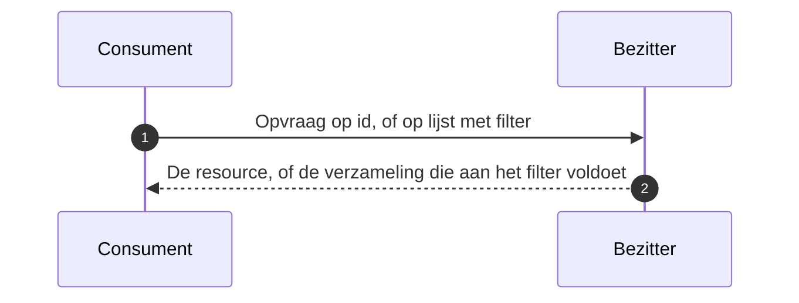

# Request-Reply

De afnemer vraagt op en krijgt antwoord, op een moment dat hij zelf kiest en zonder voorafgaand event. De naam komt uit [Enterprise Integration Patterns](https://www.enterpriseintegrationpatterns.com/patterns/messaging/RequestReply.html).

## Wanneer

Er is geen aanleiding van de andere kant, of de aanleiding is er wel geweest maar niet aangekomen. Twee gevallen: de afnemer richt zich in en heeft de huidige stand nodig, of hij herstelt nadat een event in de dead letter channel is beland en haalt op wat hij gemist heeft.

## Verloop

| Bericht | Richting | Synchroniciteit | Draagt | Draagt niet |
|---|---|---|---|---|
| Opvraag | consument naar bezitter | Synchroon | Id en versie, of een filter op status en wijzigingsmoment | — |
| Antwoord | bezitter naar consument | Synchroon | De resource, of een lijst van id's met hun laatste versie | De inhoud van elk item in een lijstantwoord |

## Eigenschappen

De opvraag is alleen-lezen en zonder neveneffect: herhaald aanroepen geeft hetzelfde resultaat, en dubbele ontvangst is onschadelijk.

**De lijst- of queryvariant is de herstelroute, niet de reguliere route.** Hij bestaat om te herstellen na een verloren event; de reguliere stroom blijft event-gedreven. Wie hem als polling-mechanisme gebruikt draait het model om dat [Event Notification](event-notification.md) vastlegt.

Een lijstantwoord draagt verwijzingen, geen inhoud: id's met hun laatste versie, waarna de afnemer ophaalt wat hij nodig heeft.

## Toegepast in

| Koppeling | Waarvoor |
|---|---|
| [Onderwijscatalogus naar planning en roostering](../Koppelingspecificaties/onderwijscatalogus-planning-en-roostering.md) | Gepubliceerde specificaties of aanbod-instanties opnieuw opvragen na een gemist event |
| [Onderwijscatalogus naar studentinformatiesysteem](../Koppelingspecificaties/onderwijscatalogus-studentinformatiesysteem.md) | Resultaatstructuur ophalen bij inrichting |
