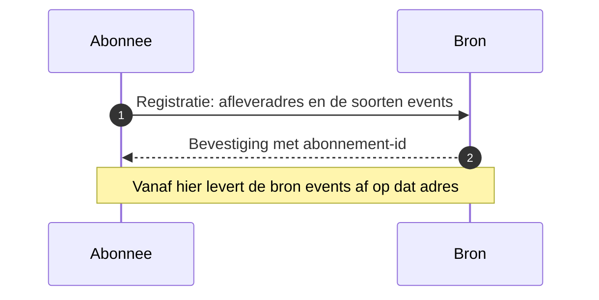

# Subscription registration

Een partij legt bij de ander vast waar events afgeleverd mogen worden, en voor welke soorten. Het patroon is gestandaardiseerd als [WebSub](https://www.w3.org/TR/websub/), een W3C Recommendation, en als de [CloudEvents Subscriptions API](https://github.com/cloudevents/spec/blob/main/subscriptions/spec.md).

## Wanneer

Voorwaarde onder elk push-patroon. Zolang de bezitter geen afleveradres kent, kan hij niets melden en valt [Event Notification](event-notification.md) terug op opvragen. Beide partijen registreren over en weer, elk voor de events die de ander van hem ontvangt.

## Verloop

| Bericht | Richting | Synchroniciteit | Draagt | Draagt niet |
|---|---|---|---|---|
| Registratie | abonnee naar bron | Synchroon | Afleveradres en de event-soorten | Inhoudelijke gegevens |
| Bevestiging | bron naar abonnee | Synchroon | Abonnement-id | — |

## Eigenschappen

Registratie is idempotent op de combinatie van afleveradres en event-soort: herregistratie overschrijft de vorige en levert geen dubbele aflevering op.

**Het abonnement hoort bij het kanaal, niet bij het bericht** ([U5](../uitgangspunten.md#u5-bericht-versus-kanaal)). Het bestaat omdat aflevering via webhooks loopt, en vervalt zodra die via een bus of broker gaat. De berichten zelf veranderen daar niet van.

WebSub voegt twee dingen toe die OKx nu niet vastlegt: een verificatiehandshake waarmee de bron controleert of het opgegeven adres de registratie werkelijk wil, en ondertekening van elk afgeleverd bericht zodat de ontvanger de herkomst kan vaststellen. Zonder die twee kan een derde een afleveradres laten registreren, en kan een ontvanger niet vaststellen dat een binnengekomen event van de bron komt.

## Toegepast in

| Koppeling | Waarvoor |
|---|---|
| [Onderwijscatalogus naar planning en roostering](../Koppelingspecificaties/onderwijscatalogus-planning-en-roostering.md) | Afleveradres vastleggen voor de meldingen die beide partijen van elkaar ontvangen |
