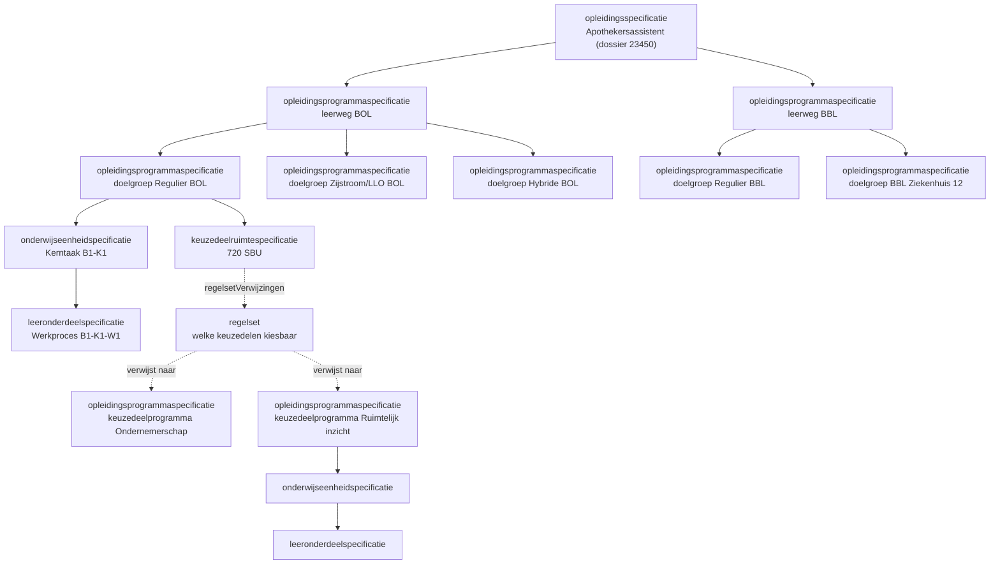

# Onderwijsspecificatie als JSON-payload

> **Centrale specificatie.** Dit document is de ene bron voor de onderwijsspecificatie-payload. Welke objecten en velden een koppeling gebruikt staat in het **gebruiksprofiel** van de betreffende koppelingspecificatie (onderwijscatalogus naar planning en roostering, onderwijscatalogus naar studentinformatiesysteem, onderwijscatalogus naar leermanagementsysteem). Leeruitkomst-inhoudsvelden zijn optioneel en profiel-afhankelijk; binnen onderwijscatalogus naar planning en roostering zijn leeruitkomst-ids verbindende sleutels zonder meegeleverde inhoud ([ADR 0026](../../../Referentiemateriaal/adr/0026-leeruitkomst-als-verbindende-sleutel.md)).

## Inhoudsopgave

1. [Inleiding](#1-inleiding) (aanleiding, context, doel, scope)
2. [Payload](#2-payload)
3. [Toelichting bij de keuzes](#3-toelichting-bij-de-keuzes)
   - [3.1 Waarom plat met verwijzingen](#31-waarom-plat-met-verwijzingen)
   - [3.2 Ontwerpkeuzes](#32-ontwerpkeuzes)
   - [3.3 Lifecycle, versionering en manifest](#33-lifecycle-versionering-en-manifest)

## 1. Inleiding

### 1.1 Aanleiding en context

**Aanleiding.** Drie afnemers, planning, leeromgeving en studentinformatiesysteem, hebben elk een ander deel van dezelfde onderwijsspecificatie nodig. Bij het uitwerken van de eerste koppeling bleek dat elke koppeling zonder ingrijpen een eigen vorm van die specificatie zou krijgen, met per koppeling andere veldnamen voor hetzelfde begrip. Daarom is de payload hier **eenmaal centraal** beschreven; een koppeling legt in een gebruiksprofiel vast welk deel zij afneemt.

Een onderwijsontwerper vertaalt een kwalificatiedossier naar een **onderwijsspecificatie**: de beschrijving van wat een instelling gaat organiseren, nog los van wanneer en met wie. Die beschrijving is gelaagd, van opleiding tot leeronderdeel, en de onderwijscatalogus publiceert hem naar planning, het leermanagementsysteem en het studentinformatiesysteem.

Dit is de **centrale payload**: alle koppelingen delen hem, en elke koppelingspecificatie legt in een gebruiksprofiel vast welke objecten en velden zij gebruikt ([ADR 0021](../../../Referentiemateriaal/adr/0021-koppeling-versus-koppelvlak-terminologie.md)). Ketenoverzicht, begrippen en afkortingen: de [instap in de README](../../README.md#context).

Scenario is leerroute 1 (regulier), persona [Jochem](https://github.com/Npuls-OKx/meta/blob/d47bb0c74ec899a4384d06331692f74b9bd1db58/architecture/docs/specificatie/okx-oeapi-consumer-profiel/doc/persona_jochem.md), opleiding Apothekersassistent (kwalificatiedossier 23450, kwalificatie 27141). Leerroute 2 en 3 volgen als verschil. Het begrippenkader komt uit de ankertabel van het [OEAPI consumer-profiel](https://github.com/Npuls-OKx/meta/blob/d47bb0c74ec899a4384d06331692f74b9bd1db58/architecture/docs/specificatie/okx-oeapi-consumer-profiel/README.md), specificatie-kolom; de ArchiMate-view "01. Onderwijsvisie vertalen naar onderwijsaanbod" hanteert dat kader nog niet en is hier dus niet leidend.

De conceptniveaus, hun bron in het kwalificatiekader en de indicatieve mapping op de Open Onderwijs API:

| Conceptniveau (`specificatieType`) | Bron in kwalificatiekader          | OEAPI-mapping (indicatief)        |
| ---------------------------------- | ---------------------------------- | --------------------------------- |
| `opleidingsspecificatie`           | Kwalificatiedossier                | EducationSpecification (program)  |
| `opleidingsprogrammaspecificatie`  | Kwalificatie                       | Programme                         |
| `onderwijseenheidspecificatie`     | Kerntaak                           | Course                            |
| `leeronderdeelspecificatie`        | Werkproces                         | LearningComponent                 |
| `keuzedeelruimtespecificatie`      | ruimte binnen kwalificatie         | (afgeleid, geen 1:1 OEAPI-object) |
| `toetsonderdeelspecificatie`       | toetsing                           | TestComponent                     |
| `examenplanspecificatie`           | OER, summatieve resultaatstructuur | (aparte uitwerking)               |
| `resultaateenheidspecificatie`     | groepering binnen het examenplan   | (aparte uitwerking)               |
| `lesspecificatie` (buiten scope)   | beleid instelling                  | LearningComponent (lesson)        |

De **kwalificatie ligt niet op root-niveau**: de `opleidingsspecificatie` verankert op de leeruitkomst van het kwalificatiedossier (23450), de `opleidingsprogrammaspecificatie` op die van de kwalificatie (27141). Leeruitkomsten zijn zelfstandige objecten; waarom, staat in [§3.2](#32-ontwerpkeuzes).

De boom voor leerroute 1, met de keuzedelen die via een regelset bereikbaar zijn:



### 1.2 Doel

Dit document beantwoordt drie vragen:

- Hoe leg je de gelaagdheid van een onderwijsspecificatie generiek vast in JSON, zodat de vorm ook bij latere onderwijsvormen overeind blijft?
- Hoe verhouden leeruitkomsten zich tot de specificaties, en waar hangt de kiesbaarheid van keuzedelen?
- Welke velden dragen identiteit, versie en geldigheid, zodat een afnemer weet waarop hij plant of inricht?

Geslaagd wanneer een afnemer de structuur kan reconstrueren en verwerken zonder aanvullende uitleg, en wanneer leerroute 2 en 3 erin passen met alleen een handvol afwijkende attributen.

De payload is indicatief en onderbouwend, geen voorschrift aan de sector ([uitgangspunt U1](../../uitgangspunten.md#u1-indicatief-en-onderbouwend-niet-voorschrijvend)).

### 1.3 Scope

In scope is de specificatiestructuur van opleiding tot leeronderdeel: `opleidingsspecificatie`, `opleidingsprogrammaspecificatie`, `onderwijseenheidspecificatie` en `leeronderdeelspecificatie`, plus de `keuzedeelruimtespecificatie` en de leeruitkomsten waaraan die verankeren. Uitgewerkt voor leerroute 1 op het niveau van het grofmazige ontwerp.

Vier afbakeningen die anders verwarring geven:

- De **lesspecificatie** valt erbuiten: het lesniveau leeft in het leermanagementsysteem en wordt binnen dit programma niet gerealiseerd. De diepte is verder geen harde grens.
- De **interne structuur van een regelset** staat hier niet; deze payload verwijst er alleen naar.
- **Generieke onderdelen** (taal, rekenen, burgerschap, Engels) zitten niet in dit voorbeeld.
- Het **aanbod** (wanneer, waar, met wie), de **endpoints** en de **binding met de Open Onderwijs API** zijn eigen uitwerkingen.

Al het overige valt buiten dit document.

## 2. Payload

Het bijbehorende [informatiemodel](../../Datamodelschema's/README.md#onderwijsspecificatie) en de [voorbeeldpayload](../../Datamodelschema's/README.md#voorbeeld-onderwijsspecificatie) staan bij de datamodelschema's.

Het schema legt de exacte vorm vast: welke velden er zijn, welke verplicht zijn en welke waarden een veld mag dragen. Het is **alfa en indicatief** en verandert mee zolang de payload nog niet vaststaat.

```json
{
  "$schema": "https://json-schema.org/draft/2020-12/schema",
  "$id": "https://okx.npuls.nl/schema/onderwijsspecificatie/alfa",
  "title": "Onderwijsspecificatie",
  "$comment": "Alfa en indicatief. Deze vorm onderbouwt welke velden het koppelvlak nodig heeft en kan wijzigen zolang de payload niet is vastgesteld.",
  "type": "object",
  "required": ["onderwijsspecificaties"],
  "$comment_required": "Alleen onderwijsspecificaties is altijd aanwezig. Of leeruitkomsten en regelsets meekomen bepaalt het gebruiksprofiel van de koppeling; binnen onderwijscatalogus naar planning en roostering blijven leeruitkomsten weg ([ADR 0026](../../../Referentiemateriaal/adr/0026-leeruitkomst-als-verbindende-sleutel.md)).",
  "properties": {
    "leeruitkomsten": {
      "type": "array",
      "items": {
        "type": "object",
        "required": ["id", "versie", "naam", "bron", "bovenliggendLeeruitkomstId", "indicatieveOmvang"],
        "properties": {
          "id": { "type": "string", "format": "uuid" },
          "versie": { "type": "string", "pattern": "^\\d+\\.\\d+\\.\\d+$" },
          "naam": { "type": "string" },
          "bron": {
            "type": "object",
            "required": ["standaard", "type", "code"],
            "properties": {
              "standaard": { "type": "string", "$comment": "open lijst; nu sbb-kwalificatiekader, later bijvoorbeeld competentnl" },
              "type": { "enum": ["kwalificatiedossier", "kwalificatie", "kerntaak", "werkproces", "keuzedeel"] },
              "code": { "type": "string" }
            }
          },
          "bovenliggendLeeruitkomstId": { "type": ["string", "null"], "format": "uuid" },
          "indicatieveOmvang": {
            "type": "array",
            "items": {
              "type": "object",
              "required": ["waarde", "eenheid"],
              "properties": {
                "waarde": { "type": "number" },
                "eenheid": { "enum": ["SBU", "EC"] }
              }
            }
          },
          "nlqfNiveau": { "type": "integer", "minimum": 1, "maximum": 8 },
          "waardedocument": { "type": "string", "$comment": "open lijst: diploma, mbo-certificaat, microcredential" },
          "omschrijving": { "type": "string" },
          "resultaat": { "type": "string" },
          "gedrag": { "type": "array", "items": { "type": "string" } }
        }
      }
    },
    "onderwijsspecificaties": {
      "type": "array",
      "items": {
        "type": "object",
        "required": ["id", "specificatieType", "versie", "bovenliggendSpecificatieId", "naam", "studielast"],
        "properties": {
          "id": { "type": "string", "format": "uuid" },
          "specificatieType": { "enum": ["opleidingsspecificatie", "opleidingsprogrammaspecificatie", "onderwijseenheidspecificatie", "leeronderdeelspecificatie", "keuzedeelruimtespecificatie", "toetsonderdeelspecificatie", "examenplanspecificatie", "resultaateenheidspecificatie"] },
          "versie": { "type": "string", "pattern": "^\\d+\\.\\d+\\.\\d+$" },
          "bovenliggendSpecificatieId": { "type": ["string", "null"], "format": "uuid" },
          "leeruitkomstId": { "type": "string", "format": "uuid" },
          "naam": { "type": "string" },
          "omschrijving": { "type": "string" },
          "status": { "enum": ["concept", "vastgesteld", "gepubliceerd", "gedeactiveerd", "vervallen", "gearchiveerd"] },
          "studielast": {
            "type": "object",
            "required": ["waarde", "eenheid"],
            "properties": {
              "waarde": { "type": "number" },
              "eenheid": { "enum": ["SBU", "EC"] }
            }
          },
          "curriculumtype": { "enum": ["nominaal", "hybride", "flexibel"] },
          "programmatype": { "type": "string", "$comment": "open lijst: diplomaprogramma, keuzedeelprogramma, certificaatprogramma" },
          "programmaLaag": { "enum": ["leerweg", "doelgroep"] },
          "leerweg": { "enum": ["BOL", "BBL"] },
          "doelgroep": { "type": "string", "$comment": "open lijst: regulier, zijinstromer, hybride, organisatiespecifiek" },
          "keuzedeelKlasse": { "type": "string", "$comment": "open lijst: algemeen-verbredend, beroepsspecifiek-verdiepend" },
          "organisatie": { "type": "object", "$comment": "verwijzing naar de organisatie waarvoor deze variant geldt, bijvoorbeeld een leerbedrijf" },
          "cohort": { "type": "string" },
          "startdatum": { "type": "string", "format": "date" },
          "geldigVanaf": { "type": "string", "format": "date" },
          "geldigTot": { "type": ["string", "null"], "format": "date" },
          "tijdsverdeling": { "type": "string", "$comment": "open lijst: BOT (begeleide onderwijstijd), OOT (overige onderwijstijd), BPV" },
          "toelichting": { "type": "string" },
          "regelsetVerwijzingen": { "type": "array", "items": { "type": "string", "format": "uuid" } },
          "manifest": {
            "type": "array",
            "items": {
              "type": "object",
              "required": ["specificatieId", "versie", "relatie"],
              "properties": {
                "specificatieId": { "type": "string", "format": "uuid" },
                "versie": { "type": "string" },
                "relatie": { "enum": ["onderdeel", "variant", "referentie"] }
              }
            }
          }
        }
      }
    },
    "regelsets": {
      "type": "array",
      "items": {
        "type": "object",
        "required": ["id", "versie", "naam", "vanToepassingOp", "regels"],
        "properties": {
          "id": { "type": "string", "format": "uuid" },
          "versie": { "type": "string" },
          "naam": { "type": "string" },
          "omschrijving": { "type": "string" },
          "vanToepassingOp": { "type": "string", "format": "uuid" },
          "regels": { "type": "array", "items": { "type": "object" } }
        }
      }
    }
  }
}
```

Het `manifest` pint per specificatie de versies van haar onderdelen vast: `relatie: onderdeel` telt additief mee in de studielast, `variant` is een alternatief, en `referentie` is een gepinde verwijzing, bijvoorbeeld naar een keuzedeelprogramma.

## 3. Toelichting bij de keuzes

### 3.1 Waarom plat met verwijzingen

| Optie                                | Vorm                                         | Voordeel                                                                                         | Nadeel                           |
| ------------------------------------ | -------------------------------------------- | ------------------------------------------------------------------------------------------------ | -------------------------------- |
| A. Pure nesting                      | children-arrays, alles inline                | Simpel                                                                                           | Hergebruik wordt gedupliceerd    |
| B. Nesting + referenties             | genest, hergebruik via uuid                  | Minder duplicatie                                                                                | Twee relatievormen door elkaar   |
| C. Recursief plat met een ouder-verwijzing | uniforme lijst, relatie via `bovenliggendSpecificatieId` | Elk object gelijk, generiek, herbruikbaar, uitlijnbaar met OEAPI `EducationSpecification.parent` | Structuur minder direct leesbaar |

Voorstel: optie C.

### 3.2 Ontwerpkeuzes

- Eén uniform type. Alle specificaties staan in een platte lijst `onderwijsspecificaties`. Elke specificatie heeft een `bovenliggendSpecificatieId` (uuid; `null` op de root). De structuur reconstrueer je door die verwijzing te volgen; een geneste weergave is daaruit af te leiden.
- Discriminator `specificatieType` bepaalt het niveau.
- **Leeruitkomst als zelfstandig object met eigen lifecycle.** Leeruitkomsten staan in een eigen platte lijst `leeruitkomsten`, elk met een eigen `id` (uuid) en `versie`. Elke specificatie verwijst met `leeruitkomstId`: de leeruitkomst is de **sleutel** die aangeeft wat je precies afrondt en hoe dat zich verhoudt tot diploma, certificaat of ander waardedocument ([ADR 0022](../../../Referentiemateriaal/adr/0022-resultaatbegrippen-conform-rosa-koi.md)). De huidige onderwijsvorm hangt eraan via `bron` (standaard `sbb-kwalificatiekader`, met type en code); later hangt hier de nationale standaard aan, bijvoorbeeld CompetentNL, zonder dat de sleutel of de specificaties wijzigen ([ADR 0003](../../../Referentiemateriaal/adr/0003-student-kiest-leeruitkomsten-domeinprincipes.md), 0004).
- **Leeruitkomsten op elk niveau, met een eigen orde van grootte.** Een leeruitkomst bestaat op elk specificatieniveau: op opleidingsniveau is hij van grote orde (jaren werk, een NLQF-kwalificatie, leidend tot een diploma), op onderwijseenheid- en leeronderdeelniveau van kleinere orde (een deelverzameling kan tot een certificaat leiden), en straks op lessenreeks- of lesniveau (aangetoonde kennis, inzichten of vaardigheden). Leeruitkomsten aggregeren onderling via `bovenliggendLeeruitkomstId`: bottom-up telt klein op naar groot, top-down is een grote leeruitkomst te ontleden. Zo is van de grond af zichtbaar welke volgende onderwijsspecificaties je verder brengen richting een waardepapier of microcredential (`waardedocument`). Elke leeruitkomst draagt een `indicatieveOmvang` (kwantificatie in SBU en/of EC naast elkaar, voor aansluiting met HBO en WO; [ADR 0004](../../../Referentiemateriaal/adr/0004-leeruitkomsten-sbu-ec-logistieke-containergrootte.md)): de logistieke containergrootte van wat je behaalt. Daarnaast kent de leeruitkomst **optionele inhoudsvelden** (`omschrijving`, `resultaat`, `gedrag`, uit het kwalificatiedossier): meegeleverd waar het gebruiksprofiel dat vraagt (onderwijscatalogus naar leermanagementsysteem wel, onderwijscatalogus naar planning en roostering niet). Voorbeeld: werkproces B1-K1-W1 in de payload.
- **Sleutels en verwijzingen** volgen [uitgangspunt U7](../../uitgangspunten.md#u7-payload-plat-met-verwijzingen-en-de-sleutelconventie): `id` voor de eigen sleutel, een expliciete naam zodra een veld ergens anders heen wijst (`bovenliggendSpecificatieId`, `leeruitkomstId`, `regelsetVerwijzingen`, `manifest[].specificatieId`). Alle id's zijn uuid's.
- Versionering per specificatie met semver (`MAJOR.MINOR.PATCH`). MAJOR = wijziging die betekenis of uitkomst raakt (leeruitkomsten, structuur, studielast), MINOR = additief zonder bestaande betekenis te breken, PATCH = correctie. Temporele geldigheid apart via `geldigVanaf`/`geldigTot` en cohort, niet als versienummer.
- Identiteit los van versie (uitgangspunt, memo van Niels). Het `id` van een specificatie is stabiel; `versie` verandert bij een wijziging binnen dezelfde identiteit. Een fundamentele wijziging (nieuw kwalificatiedossier, nieuwe wettelijke eisen) is een nieuwe specificatie met een nieuw id, niet alleen een MAJOR-bump.
- Kwalificatie op programma-niveau, dossier op opleiding-niveau (zie de conceptniveaus in §1.1).
- `programmaLaag` onderscheidt leerweg- en doelgroep-programma. Beide zijn `programma`.
- `bovenliggendSpecificatieId` draagt twee betekenissen: onderdeel-van (additief, bv. kerntaak onder programma) en variant-van (alternatief, bv. doelgroep onder leerweg). De aggregatie-invariant geldt alleen voor onderdeel-van.
- Niveau, leeruitkomsten en leerroute zijn afleidbaar uit de structuur, niet als losse specificatie-velden. Het NLQF-niveau hangt aan de leeruitkomst. Wie een bepaalde set kerntaken en werkprocessen heeft afgerond, voldoet aan de kwalificatie. Leerroute-typen zijn indicatief voor wat mogelijk wordt en horen niet in het datamodel. Leeruitkomsten worden naar verwachting later flexibeler ([ADR 0003](../../../Referentiemateriaal/adr/0003-student-kiest-leeruitkomsten-domeinprincipes.md), 0004).
- Keuzeruimte is een eigen specificatie (`keuzedeelruimtespecificatie`) met studielast, herbruikbaar.
- Regels los van de onderwijsspecificatie. `regelsetVerwijzingen` op een specificatie verwijst naar losse `regelsets`. De regelset draagt de kiesbaarheid (welke keuzedelen) en de voorwaarde vooraf (prerequisite), uitgedrukt in **behaalde leeruitkomsten** in plaats van afgeronde specificaties: je moet bepaalde leeruitkomsten behaald hebben om deel te nemen ([ADR 0022](../../../Referentiemateriaal/adr/0022-resultaatbegrippen-conform-rosa-koi.md)). De interne structuur van de regelset wordt apart uitgewerkt.
- Elke specificatie kan `regelsetVerwijzingen` hebben (generiek), niet alleen de keuzeruimte.
- Keuzedelen zijn zelfstandige programma-specificaties (zonder ouder-verwijzing), zelf opgebouwd als programma naar onderwijseenheid naar leeronderdeel. Herbruikbaar over opleidingen (N:M via regelset-verwijzingen).
- Aggregatie-invariant: `studielast` telt bottom-up op binnen onderdeel-van (SOM children = ouder). Niet over varianten (leerweg, doelgroep).

### 3.3 Lifecycle, versionering en manifest

De volledige lifecycle (classificatie van wijzigingen, acceptatie, deactiveren, migratie) staat in de aparte uitwerking [lifecycle en versionering](lifecycle-en-versionering.md). Hier alleen de mechaniek die de payload zelf raakt.

**Momentopname (snapshot) als manifest.** De payload zoals geleverd is een momentopname (snapshot): elke specificatie staat erin met haar `versie`. De versie van de `opleidingsspecificatie` is de manifest- of release-versie; de versies van de onderdelen staan inline. Een geleverde payload pint zo precies één samenhangende set (id, version).

**Manifest op elk niveau.** Niet alleen de `opleidingsspecificatie`. Elk niveau met onderdelen is een manifest voor die onderdelen; dezelfde logica geldt recursief: een `opleidingsprogrammaspecificatie` pint haar `onderwijseenheidspecificatie`s, een `onderwijseenheidspecificatie` pint haar `leeronderdeelspecificatie`s.

**Afgeleide versie, impact-gedreven propagatie.** Een niveau versioneert wanneer zijn samenstelling wijzigt of een onderliggende wijziging zijn afhankelijkheid breekt (leeruitkomsten, weging, diploma-eligibility). Een child-bump propageert dus niet automatisch omhoog.

**Voorbeeld.** Uitgangspunt: de `opleidingsprogrammaspecificatie` (doelgroep Regulier BOL) `2.1` pint `onderwijseenheidspecificatie` A `1.1` en B `1.2`. A wijzigt naar `2.0` (MAJOR op A):

| Breekt A de `opleidingsprogrammaspecificatie`?   | `opleidingsprogrammaspecificatie` | Manifest pint    |
| ------------------------------------------------ | --------------------------------- | ---------------- |
| Ja (leeruitkomst, weging of diploma-eligibility) | `2.1` naar `3.0` (MAJOR)          | A `2.0`, B `1.2` |
| Nee (interne herstructurering van A)             | `2.1` naar `2.2` (MINOR)          | A `2.0`, B `1.2` |

B blijft in beide gevallen `1.2`. Dezelfde afweging geldt een niveau hoger richting de `opleidingsspecificatie`.

**Manifest payload.** Elke specificatie met onderdelen, varianten of gepinde verwijzingen draagt een `manifest`: een lijst van (id, versie, relatie). Daarmee is de pin expliciet in plaats van impliciet.

| Veld             | Betekenis                                                                                                                                      |
| ---------------- | ---------------------------------------------------------------------------------------------------------------------------------------------- |
| `specificatieId` | de gepinde specificatie                                                                                                                        |
| `versie`         | de exacte versie die deze release vastlegt                                                                                                     |
| `relatie`        | `onderdeel` (additief, telt mee in de studielast), `variant` (alternatief), `referentie` (gepinde verwijzing, bv. naar een keuzedeelprogramma) |

```json
{
  "onderwijsspecificaties": [
    {
      "id": "7ae25c1e-ee27-43a2-a001-761ee39ea5c7",
      "specificatieType": "opleidingsprogrammaspecificatie",
      "versie": "0.1.0",
      "bovenliggendSpecificatieId": "5ef37812-ae0f-4232-904f-451b9928e45e",
      "naam": "Regulier BOL",
      "studielast": { "waarde": 4800, "eenheid": "SBU" },
      "manifest": [
        { "specificatieId": "402c2342-d897-4df4-a667-7fc5bd930944", "versie": "0.1.0", "relatie": "onderdeel" },
        { "specificatieId": "fb5be5ae-faa0-4b4b-8085-474fce9aae08", "versie": "0.1.0", "relatie": "onderdeel" }
      ]
    }
  ]
}
```

In §2.2 staat het manifest uitgewerkt op drie niveaus: de `opleidingsspecificatie` (pint de leerweg-varianten), de `opleidingsprogrammaspecificatie` Regulier BOL (pint haar `onderwijseenheidspecificatie`s en de `keuzedeelruimtespecificatie`), en de `keuzedeelruimtespecificatie` (pint de keuzedeelprogramma's als referentie). Voor de leesbaarheid niet op elk niveau herhaald; in een volledige payload draagt elke specificatie met onderdelen een manifest.
