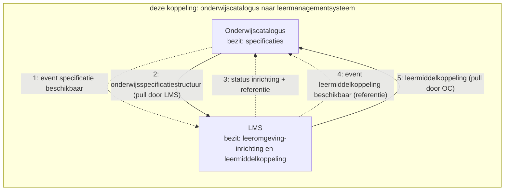
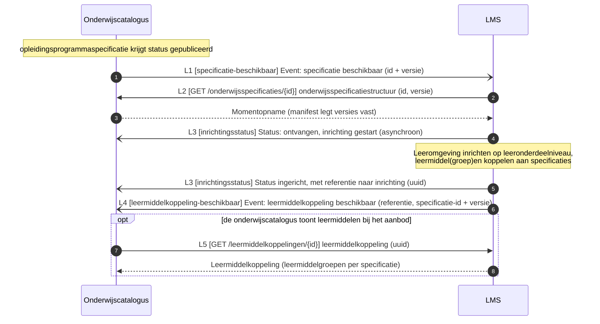
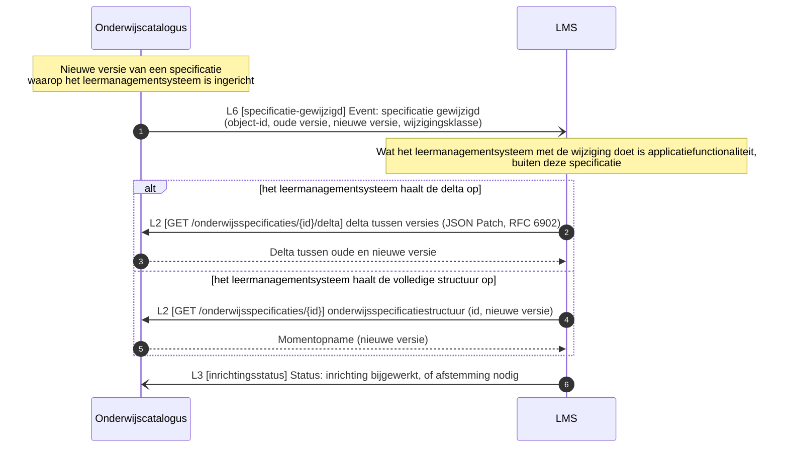

# Onderwijscatalogus naar leermanagementsysteem

De koppeling tussen de onderwijscatalogus en het leermanagementsysteem: welke informatie erover beweegt, in welke volgorde, en welk bericht dat draagt, met de sequentiediagrammen erbij. De functionele eisen die het proces aan deze koppeling stelt staan als vertrekpunt in de eerste tabel; het interactieoverzicht legt per interactie het bericht, het patroon en de foutafhandeling vast, en de endpoints staan bij de [applicatiecomponent](../Applicatiecomponenten/README.md) die ze serveert.

## Plek in de keten

De uitsnede komt uit de informatiestromen-hoofdplaat v1.7 (richtinggevend; de legenda draagt nog "concept"), met deze koppeling gemarkeerd. De koppelvlakken van beide componenten staan bij de [onderwijscatalogus](../Applicatiecomponenten/onderwijscatalogus.md) en het [leermanagementsysteem](../Applicatiecomponenten/leermanagementsysteem.md).

## Functionele eisen

| Id | Functionele eis | Interactie | Story |
|---|---|---|---|
| functionele-eis-0010 | De onderwijscatalogus moet het leermanagementsysteem kunnen laten weten dat een specificatie beschikbaar is om de leeromgeving op in te richten, en het leermanagementsysteem moet daarop een inrichtingsstatus met referentie kunnen terugleveren | [Leeromgeving inrichten en leermiddelkoppeling melden](#leeromgeving-inrichten-en-leermiddelkoppeling-melden) | geen |
| functionele-eis-0011 | Het leermanagementsysteem moet een leermiddelkoppeling die het heeft gelegd aan de onderwijscatalogus kunnen melden, zodat die de leermiddelen bij het aanbod kan tonen | [Leeromgeving inrichten en leermiddelkoppeling melden](#leeromgeving-inrichten-en-leermiddelkoppeling-melden) | [story-0003](../../Referentiemateriaal/requirementsboom/stories.md#story-0003) |
| functionele-eis-0012 | Het leermanagementsysteem moet zijn inrichting kunnen bijwerken wanneer een specificatie wijzigt, zonder verplicht de volledige structuur opnieuw te ontvangen | [Inrichting bijwerken na wijziging](#inrichting-bijwerken-na-wijziging) | geen |

## Applicatiediensten

Deze koppeling is de optelsom van de [applicatiediensten](../Applicatiediensten/README.md) in de tabel.

| Applicatiedienst | Geïmplementeerd door |
|---|---|
| [onderwijsspecificatiestructuur-aanbieder](../Applicatiediensten/onderwijsspecificatiestructuur-aanbieder.md) | Onderwijscatalogus |
| [onderwijsspecificatiestructuur-afnemer](../Applicatiediensten/onderwijsspecificatiestructuur-afnemer.md) | Leermanagementsysteem |
| [leermiddelkoppeling-aanbieder](../Applicatiediensten/leermiddelkoppeling-aanbieder.md) | Leermanagementsysteem |
| [leermiddelkoppeling-afnemer](../Applicatiediensten/leermiddelkoppeling-afnemer.md) | Onderwijscatalogus |
| [verwerkingsuitkomst-aanbieder](../Applicatiediensten/verwerkingsuitkomst-aanbieder.md) | Leermanagementsysteem |
| [verwerkingsuitkomst-afnemer](../Applicatiediensten/verwerkingsuitkomst-afnemer.md) | Onderwijscatalogus |

Deze koppeling kent geen afleverabonnement: zolang er geen registratie is vastgelegd, is het afleveradres een inrichtingskeuze tussen beide partijen.

## Interactiepatronen

Deze koppeling zet de volgende [interactiepatronen](../Interactiepatronen/README.md) in. Het interactieoverzicht noemt per interactie welk patroon geldt.

| Interactiepatroon | Waarvoor in deze koppeling | Interacties |
|---|---|---|
| [Event Notification](../Interactiepatronen/event-notification.md) | Melden dat een specificatie beschikbaar is of is gewijzigd en dat de leermiddelkoppeling er is, met het ophalen dat daarop volgt | L1, L2, L4, L5, L6 |
| [Asynchronous Request-Reply](../Interactiepatronen/asynchronous-request-reply.md) | De inrichtingsstatus terugmelden, met een referentie naar de inrichting | L3 |

## Procesbeeld

**Resource-eigenaarschap** ([U3](../uitgangspunten.md#u3-resource-eigenaarschap)): de onderwijscatalogus bezit de specificaties, de leeromgeving haar inrichting en de leermiddelkoppeling. **Event notification** ([U4](../uitgangspunten.md#u4-event-notification)) geldt in beide richtingen.

Wat het diagram niet toont: de leeromgeving richt zich in tot op **leeronderdeelniveau** en vult daaronder haar eigen lesniveau in, waar de catalogus buiten staat. De leermiddelkoppeling gaat de andere kant op zodra de leeromgeving die heeft gelegd; de catalogus haalt hem op wanneer die de leermiddelen bij het aanbod wil tonen. Wijzigt een specificatie, dan volgt een nieuw event en haalt de leeromgeving het verschil of de volledige structuur opnieuw op.

## Interactieoverzicht

De interacties op deze koppeling, met per interactie het messaging-patroon, in dezelfde patroontaal als de koppeling met planning ([Enterprise Integration Patterns, Messaging](https://www.enterpriseintegrationpatterns.com/patterns/messaging/)).
Wat hier wordt vastgelegd is het **bericht**, niet het **kanaal**: hoe het bericht bij de ontvanger komt is een inrichtingskeuze van instelling en leverancier, binnen de vier eigenschappen die [ADR 0018](../../Referentiemateriaal/adr/0018-enterprise-messaging-patronen-voor-betrouwbare-koppelvlakken.md) eist. Zie [uitgangspunt U5](../uitgangspunten.md#u5-bericht-versus-kanaal).

| # | Interactie | Initiator | Patroon | Synchroniciteit | Gedrag bij dubbele ontvangst | Foutafhandeling |
|---|---|---|---|---|---|---|
| L1 | Specificatie beschikbaar melden | OC | [Event Notification](../Interactiepatronen/event-notification.md) (id + versie) | Asynchroon | Geen effect: event-id ([Idempotent Receiver](https://www.enterpriseintegrationpatterns.com/patterns/messaging/IdempotentReceiver.html)) | [Guaranteed Delivery](https://www.enterpriseintegrationpatterns.com/patterns/messaging/GuaranteedDelivery.html); [Dead Letter Channel](https://www.enterpriseintegrationpatterns.com/patterns/messaging/DeadLetterChannel.html) |
| L2 | Onderwijsspecificatiestructuur of delta ophalen | LMS | [Event Notification](../Interactiepatronen/event-notification.md) (GET, alleen-lezen) | Synchroon | Geen effect (alleen-lezen) | HTTP-foutcodes, client bepaalt retry |
| L3 | Inrichtingsstatus melden, met referentie | LMS | [Asynchronous Request-Reply](../Interactiepatronen/asynchronous-request-reply.md) (status: ontvangen/gestart, afgekeurd, ingericht, niet ingericht) | Asynchroon | Geen effect: status-id | Retry met backoff, daarna [Dead Letter Channel](https://www.enterpriseintegrationpatterns.com/patterns/messaging/DeadLetterChannel.html) |
| L4 | Leermiddelkoppeling beschikbaar melden | LMS | [Event Notification](../Interactiepatronen/event-notification.md) (referentie + specificatie-id en versie) | Asynchroon | Geen effect: event-id | [Guaranteed Delivery](https://www.enterpriseintegrationpatterns.com/patterns/messaging/GuaranteedDelivery.html); [Dead Letter Channel](https://www.enterpriseintegrationpatterns.com/patterns/messaging/DeadLetterChannel.html) |
| L5 | Leermiddelkoppeling ophalen | OC | [Event Notification](../Interactiepatronen/event-notification.md) op referentie (GET uuid, alleen-lezen) | Synchroon | Geen effect (alleen-lezen) | HTTP-foutcodes |
| L6 | Specificatiewijziging melden | OC | [Event Notification](../Interactiepatronen/event-notification.md) (object-id, oude en nieuwe versie, wijzigingsklasse) | Asynchroon | Geen effect: event-id | [Guaranteed Delivery](https://www.enterpriseintegrationpatterns.com/patterns/messaging/GuaranteedDelivery.html); [Dead Letter Channel](https://www.enterpriseintegrationpatterns.com/patterns/messaging/DeadLetterChannel.html) |

## Berichtstromen

| Berichtstroom | Patroon | Doel | Trigger | Initiator | Interacties | Endpoints | Sequentiediagram |
|---|---|---|---|---|---|---|---|
| Leeromgeving inrichten en leermiddelkoppeling melden | [Event Notification](../Interactiepatronen/event-notification.md), [Asynchronous Request-Reply](../Interactiepatronen/asynchronous-request-reply.md) | Een gepubliceerde specificatie omzetten in een ingerichte leeromgeving, met een leermiddelkoppeling terug naar de onderwijscatalogus | Onderwijsspecificatie krijgt status `gepubliceerd` | Onderwijscatalogus | L1, L2, L3, L4, (L5) | webhook `specificatie-beschikbaar`; `GET /onderwijsspecificaties/{id}`; webhook `inrichtingsstatus`; webhook `leermiddelkoppeling-beschikbaar`; (`GET /leermiddelkoppelingen/{id}`) | [hieronder](#leeromgeving-inrichten-en-leermiddelkoppeling-melden) |
| Inrichting bijwerken na wijziging | [Event Notification](../Interactiepatronen/event-notification.md), [Asynchronous Request-Reply](../Interactiepatronen/asynchronous-request-reply.md) | Een bestaande inrichting laten volgen op een nieuwe specificatieversie, met delta of volledige structuur als keuze voor het leermanagementsysteem | Nieuwe versie van een specificatie waarop het leermanagementsysteem is ingericht | Onderwijscatalogus | L2, L3, L6 | `GET /onderwijsspecificaties/{id}/delta` of `GET /onderwijsspecificaties/{id}`; webhook `inrichtingsstatus`; webhook `specificatie-gewijzigd` | [hieronder](#inrichting-bijwerken-na-wijziging) |

## Leeromgeving inrichten en leermiddelkoppeling melden

Doel: een gepubliceerde specificatie omzetten in een ingerichte leeromgeving, met een leermiddelkoppeling terug naar de onderwijscatalogus. Trigger: onderwijsspecificatie krijgt status `gepubliceerd`. Initiator: Onderwijscatalogus. Interacties: L1, L2, L3, L4, (L5).

Endpoints:

- [webhook `specificatie-beschikbaar` (L1)](../Applicatiediensten/onderwijsspecificatiestructuur-afnemer.md)
- [`GET /onderwijsspecificaties/{id}` (L2)](../Applicatiediensten/onderwijsspecificatiestructuur-aanbieder.md)
- [webhook `inrichtingsstatus` (L3)](../Applicatiediensten/verwerkingsuitkomst-afnemer.md)
- [webhook `leermiddelkoppeling-beschikbaar` (L4)](../Applicatiediensten/leermiddelkoppeling-afnemer.md)
- [`GET /leermiddelkoppelingen/{id}` (L5, optioneel)](../Applicatiediensten/leermiddelkoppeling-aanbieder.md)

## Inrichting bijwerken na wijziging

Doel: een bestaande inrichting laten volgen op een nieuwe specificatieversie, met delta of volledige structuur als keuze voor het leermanagementsysteem. Trigger: nieuwe versie van een specificatie waarop het leermanagementsysteem is ingericht. Initiator: Onderwijscatalogus. Interacties: L2, L3, L6.

Endpoints:

- [`GET /onderwijsspecificaties/{id}/delta` of `GET /onderwijsspecificaties/{id}` (L2)](../Applicatiediensten/onderwijsspecificatiestructuur-aanbieder.md)
- [webhook `inrichtingsstatus` (L3)](../Applicatiediensten/verwerkingsuitkomst-afnemer.md)
- [webhook `specificatie-gewijzigd` (L6)](../Applicatiediensten/onderwijsspecificatiestructuur-afnemer.md)

