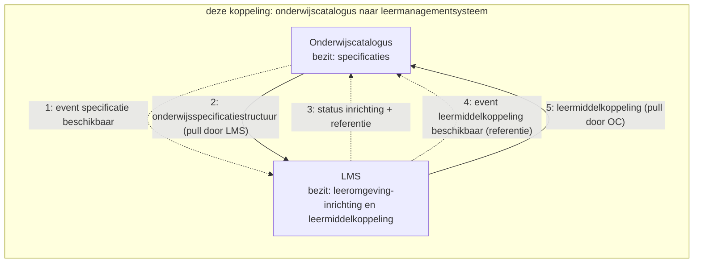
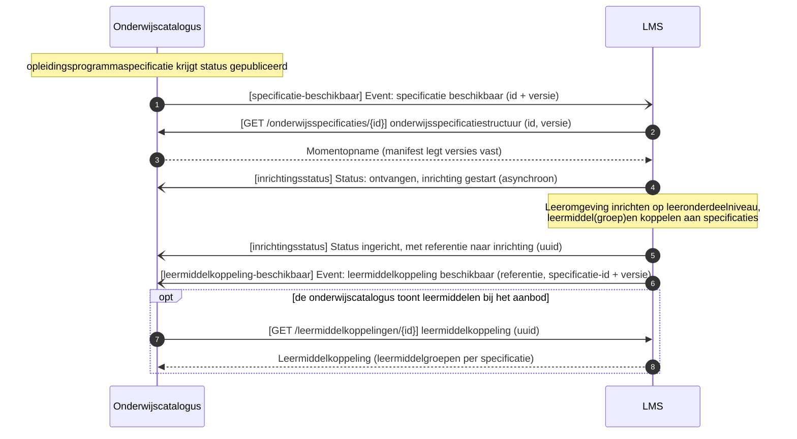
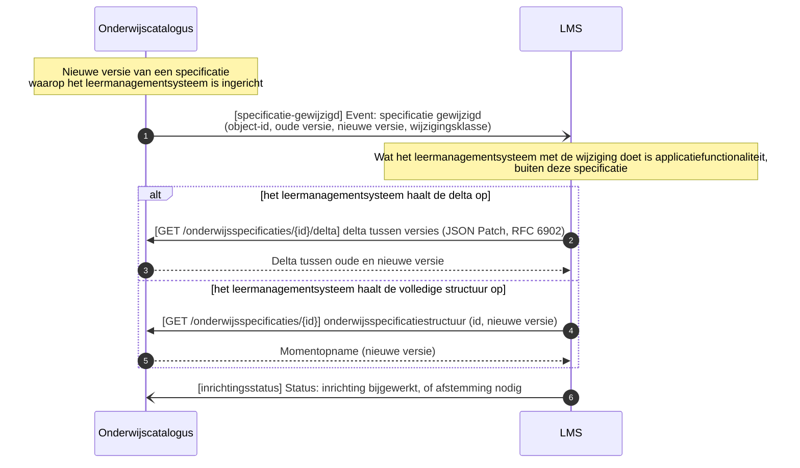

# Onderwijscatalogus naar leermanagementsysteem

De koppeling tussen de onderwijscatalogus en het leermanagementsysteem: welke informatie erover beweegt, in welke volgorde, en welk bericht dat draagt, met de sequentiediagrammen erbij. De functionele eisen die het proces aan deze koppeling stelt staan als vertrekpunt in de eerste tabel; het interactieoverzicht legt per interactie het bericht, het patroon en de foutafhandeling vast, en de endpoints staan bij de [applicatiecomponent](../Applicatiecomponenten/README.md) die ze serveert.

## Plek in de keten

De uitsnede komt uit de informatiestromen-hoofdplaat v1.7 (richtinggevend; de legenda draagt nog "concept"), met deze koppeling gemarkeerd. De koppelvlakken van beide componenten staan bij de [onderwijscatalogus](../Applicatiecomponenten/onderwijscatalogus.md) en het [leermanagementsysteem](../Applicatiecomponenten/leermanagementsysteem.md).

## Stories

De stories uit de [requirementsboom](../../Referentiemateriaal/requirementsboom/README.md) die deze koppeling invult, met de berichtstroom die dat doet.

| Story | Ingevuld door |
|---|---|
| [story-0003](../../Referentiemateriaal/requirementsboom/stories.md#story-0003) | [Leeromgeving inrichten en leermiddelkoppeling melden](#leeromgeving-inrichten-en-leermiddelkoppeling-melden) |
| [story-0029](../../Referentiemateriaal/requirementsboom/stories.md#story-0029) | [Leeromgeving inrichten en leermiddelkoppeling melden](#leeromgeving-inrichten-en-leermiddelkoppeling-melden) |
| [story-0031](../../Referentiemateriaal/requirementsboom/stories.md#story-0031) | [Inrichting bijwerken na wijziging](#inrichting-bijwerken-na-wijziging) |

## Applicatiediensten

Deze koppeling zet de volgende [applicatiediensten](../Applicatiediensten/README.md) in. De tabel legt vast welk component welke dienst implementeert; welke stromen daarover lopen en in welke volgorde bepaalt de koppeling zelf.

| Applicatiedienst | Geïmplementeerd door |
|---|---|
| [onderwijsspecificatiestructuur-aanbieder](../Applicatiediensten/onderwijsspecificatiestructuur-aanbieder.md) | Onderwijscatalogus |
| [onderwijsspecificatiestructuur-afnemer](../Applicatiediensten/onderwijsspecificatiestructuur-afnemer.md) | Leermanagementsysteem |
| [leermiddelkoppeling-aanbieder](../Applicatiediensten/leermiddelkoppeling-aanbieder.md) | Leermanagementsysteem |
| [leermiddelkoppeling-afnemer](../Applicatiediensten/leermiddelkoppeling-afnemer.md) | Onderwijscatalogus |
| [verwerkingsuitkomst-aanbieder](../Applicatiediensten/verwerkingsuitkomst-aanbieder.md) | Leermanagementsysteem |
| [verwerkingsuitkomst-afnemer](../Applicatiediensten/verwerkingsuitkomst-afnemer.md) | Onderwijscatalogus |

Deze koppeling kent geen afleverabonnement: zolang er geen registratie is vastgelegd, is het afleveradres een inrichtingskeuze tussen beide partijen.

## Interactiepatronen

Deze koppeling zet de volgende [interactiepatronen](../Interactiepatronen/README.md) in.

| Interactiepatroon | Waarvoor in deze koppeling |
|---|---|
| [Event Notification](../Interactiepatronen/event-notification.md) | Melden dat een specificatie beschikbaar is of is gewijzigd en dat de leermiddelkoppeling er is, met het ophalen dat daarop volgt |
| [Asynchronous Request-Reply](../Interactiepatronen/asynchronous-request-reply.md) | De inrichtingsstatus terugmelden, met een referentie naar de inrichting |

## Procesbeeld

**Resource-eigenaarschap** ([U3](../uitgangspunten.md#u3-resource-eigenaarschap)): de onderwijscatalogus bezit de specificaties, de leeromgeving haar inrichting en de leermiddelkoppeling. **Event notification** ([U4](../uitgangspunten.md#u4-event-notification)) geldt in beide richtingen.

Wat het diagram niet toont: de leeromgeving richt zich in tot op **leeronderdeelniveau** en vult daaronder haar eigen lesniveau in, waar de catalogus buiten staat. De leermiddelkoppeling gaat de andere kant op zodra de leeromgeving die heeft gelegd; de catalogus haalt hem op wanneer die de leermiddelen bij het aanbod wil tonen. Wijzigt een specificatie, dan volgt een nieuw event en haalt de leeromgeving het verschil of de volledige structuur opnieuw op.

## Berichtstromen

## Leeromgeving inrichten en leermiddelkoppeling melden

Doel: een gepubliceerde specificatie omzetten in een ingerichte leeromgeving, met een leermiddelkoppeling terug naar de onderwijscatalogus. Trigger: onderwijsspecificatie krijgt status `gepubliceerd`. Initiator: Onderwijscatalogus.

| Versie | Interactiepatronen | Applicatiediensten |
|---|---|---|
| 1.0 | [Event Notification](../Interactiepatronen/event-notification.md), [Asynchronous Request-Reply](../Interactiepatronen/asynchronous-request-reply.md) | [onderwijsspecificatiestructuur-afnemer](../Applicatiediensten/onderwijsspecificatiestructuur-afnemer.md), [onderwijsspecificatiestructuur-aanbieder](../Applicatiediensten/onderwijsspecificatiestructuur-aanbieder.md), [verwerkingsuitkomst-afnemer](../Applicatiediensten/verwerkingsuitkomst-afnemer.md), [leermiddelkoppeling-afnemer](../Applicatiediensten/leermiddelkoppeling-afnemer.md), [leermiddelkoppeling-aanbieder](../Applicatiediensten/leermiddelkoppeling-aanbieder.md) |

Endpoints:

- [webhook `specificatie-beschikbaar`](../Applicatiediensten/onderwijsspecificatiestructuur-afnemer.md)
- [`GET /onderwijsspecificaties/{id}`](../Applicatiediensten/onderwijsspecificatiestructuur-aanbieder.md)
- [webhook `inrichtingsstatus`](../Applicatiediensten/verwerkingsuitkomst-afnemer.md)
- [webhook `leermiddelkoppeling-beschikbaar`](../Applicatiediensten/leermiddelkoppeling-afnemer.md)
- [`GET /leermiddelkoppelingen/{id}` (optioneel)](../Applicatiediensten/leermiddelkoppeling-aanbieder.md)

## Inrichting bijwerken na wijziging

Doel: een bestaande inrichting laten volgen op een nieuwe specificatieversie, met delta of volledige structuur als keuze voor het leermanagementsysteem. Trigger: nieuwe versie van een specificatie waarop het leermanagementsysteem is ingericht. Initiator: Onderwijscatalogus.

| Versie | Interactiepatronen | Applicatiediensten |
|---|---|---|
| 1.0 | [Event Notification](../Interactiepatronen/event-notification.md), [Asynchronous Request-Reply](../Interactiepatronen/asynchronous-request-reply.md) | [onderwijsspecificatiestructuur-aanbieder](../Applicatiediensten/onderwijsspecificatiestructuur-aanbieder.md), [verwerkingsuitkomst-afnemer](../Applicatiediensten/verwerkingsuitkomst-afnemer.md), [onderwijsspecificatiestructuur-afnemer](../Applicatiediensten/onderwijsspecificatiestructuur-afnemer.md) |

Endpoints:

- [`GET /onderwijsspecificaties/{id}/delta` of `GET /onderwijsspecificaties/{id}`](../Applicatiediensten/onderwijsspecificatiestructuur-aanbieder.md)
- [webhook `inrichtingsstatus`](../Applicatiediensten/verwerkingsuitkomst-afnemer.md)
- [webhook `specificatie-gewijzigd`](../Applicatiediensten/onderwijsspecificatiestructuur-afnemer.md)

