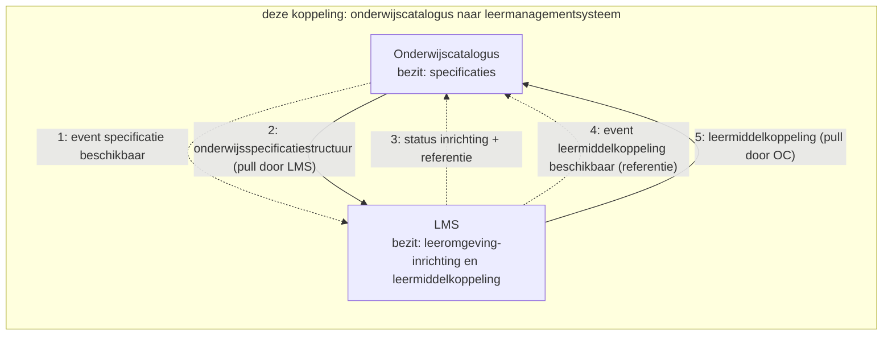
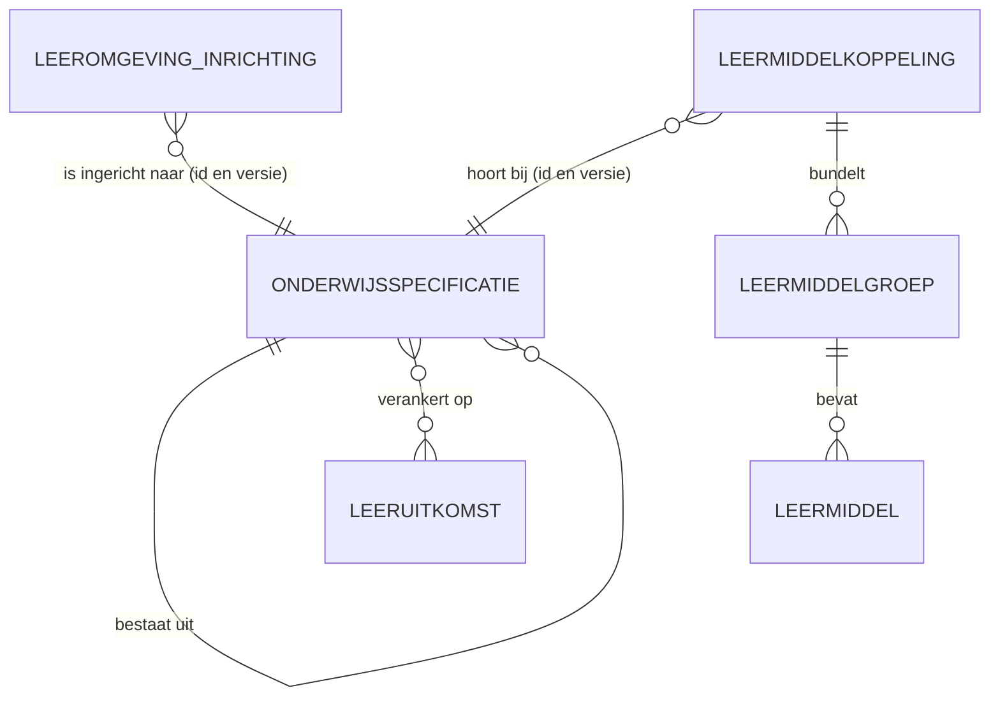
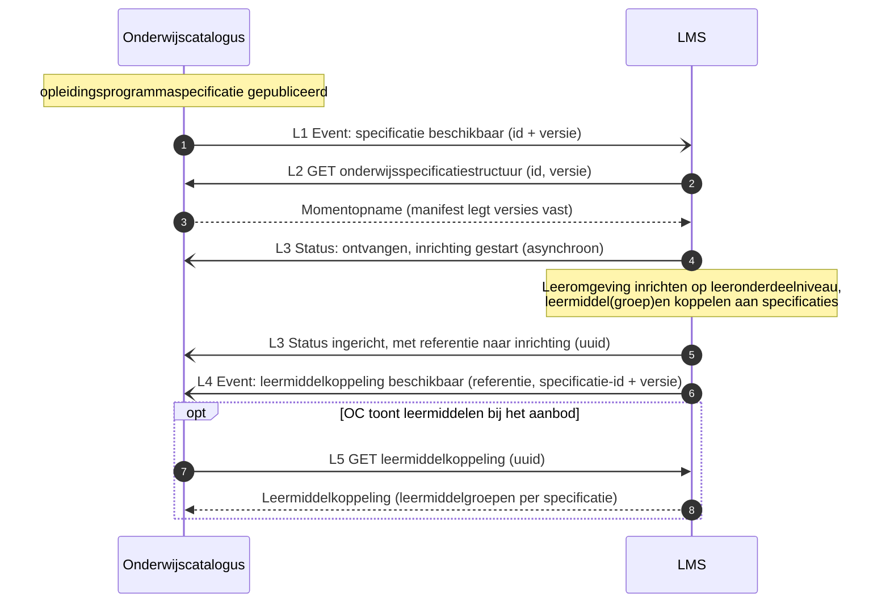
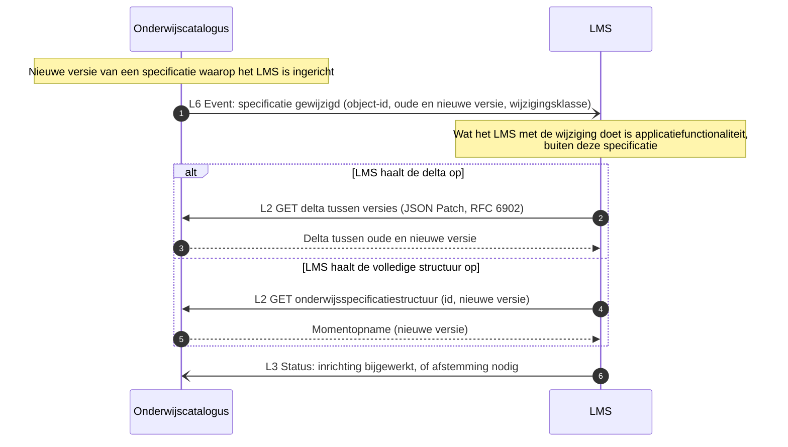

# Koppelingspecificatie onderwijscatalogus naar leermanagementsysteem

## Inhoudsopgave

1. [Inleiding](#1-inleiding) (aanleiding, context, doel, scope)
2. [Procesbeeld](#2-procesbeeld)
3. [Interactieoverzicht](#3-interactieoverzicht)
4. [Informatiemodel](#4-informatiemodel)
5. [Sequentiediagrammen](#5-sequentiediagrammen)
6. [Payload-specificaties (verwijzing) en gebruiksprofiel](#6-payload-specificaties-verwijzing-en-gebruiksprofiel)
7. [Endpointbeschrijvingen (REST)](#7-endpointbeschrijvingen-rest)
8. [Reviewvragen](#8-reviewvragen)
9. [Open punten](#9-open-punten)
10. [Gerelateerde uitwerkingen](#10-gerelateerde-uitwerkingen)

## 1. Inleiding

### 1.1 Aanleiding en context

**Aanleiding.** Bij de leeromgeving speelt een afbakeningsvraag die bij de andere koppelingen niet speelt: hoe ver moet de onderwijscatalogus gaan richting het lesniveau? Onderwijsontwikkelaars werken de specificatie in de leeromgeving verder uit tot lesplannen en werkinstructies, en het is niet vanzelfsprekend welk deel daarvan terug moet naar de catalogus. Dit document legt die grens vast. Het is **afgeleid** van het patroon met planning; er is nog geen werksessie met de betrokken partijen geweest.

Waar deze koppeling in de keten zit: de onderwijscatalogus (OC) levert de gepubliceerde onderwijsspecificatiestructuur aan het leermanagementsysteem (LMS), dat daarmee de leeromgeving inricht; het LMS levert een leermiddelkoppeling terug (stroom 4, "van leermiddel te voorziene aanbod"). Deze koppeling is dus tweerichtingsverkeer. Stroomnummers volgen de interpretatietabel in het [Projectoverzicht](https://github.com/Npuls-OKx/meta/blob/d47bb0c74ec899a4384d06331692f74b9bd1db58/doc/OKx_Projectoverzicht.md); het ketenoverzicht en de actuele [hoofdplaat v1.7](../../README.md#context) staan in de instap van de README.

Scenario is leerroute 1 (regulier), persona [Jochem](https://github.com/Npuls-OKx/meta/blob/d47bb0c74ec899a4384d06331692f74b9bd1db58/architecture/docs/specificatie/okx-oeapi-consumer-profiel/doc/persona_jochem.md), opleiding Apothekersassistent: de student vindt zijn lesstof en leermiddelen in de leeromgeving die op de gepubliceerde structuur is ingericht. Leerroute 2 en 3 volgen als verschil. Begrippenkader (ankertabel, zes families; het LMS werkt de inhoudsvelden van de leeruitkomst uit) en de volledige leerroutes: het [OEAPI consumer-profiel](https://github.com/Npuls-OKx/meta/blob/d47bb0c74ec899a4384d06331692f74b9bd1db58/architecture/docs/specificatie/okx-oeapi-consumer-profiel/README.md). Dat profiel gebruikt nog een oudere hoofdplaat; leidend is v1.7.

Beeld van het LMS in deze koppeling: een online leeromgeving die alles aan de student exposet (vergelijk een Coursera-achtig platform), inclusief e-learning. Het **ontwerp** gebeurt er niet in; wel de **gedetailleerde uitwerking** door onderwijsontwikkelaars, op lesniveau (lesplannen, werkinstructies). Van dat lesniveau hoeft OC niets te weten: de koppeling blijft op het niveau van de `leeronderdeelspecificatie`. Zelfde patroon als de [koppeling onderwijscatalogus naar planning en roostering](../onderwijscatalogus-planning-en-roostering/onderwijscatalogus-planning-en-roostering.md): resource-eigenaarschap, referenties en dunne events. OC bezit de onderwijsspecificaties; het LMS bezit de leeromgeving-inrichting (inclusief het lesniveau) en de leermiddelkoppeling. Deze koppelingspecificatie is afgeleid; hij is nog niet uitgewerkt in samenwerking met de Kerngroep Techniek.

### 1.2 Doel

Deze koppelingbeschrijving is **indicatief en onderbouwend, geen voorschrift aan de sector**; zij levert bouwstenen voor het koppelvlak van de onderwijscatalogus en dat van het leermanagementsysteem ([uitgangspunt U1](../../uitgangspunten.md#u1-indicatief-en-onderbouwend-niet-voorschrijvend)).

Het document beantwoordt drie vragen:

- Welke interacties lopen er heen (structuur) en terug (leermiddelkoppeling) tussen beide systemen?
- Tot welk niveau moet de catalogus de structuur leveren, en waar houdt zijn bemoeienis op?
- Welke payload draagt elk bericht?

Geslaagd wanneer een leverancier van een leeromgeving kan bepalen welke gegevens hij ophaalt, wat hij terugmeldt, en wat hij zelf mag invullen.

### 1.3 Scope

In scope is de tweerichtingskoppeling tussen de onderwijscatalogus en het leermanagementsysteem binnen één instelling ([ADR 0008](../../../Referentiemateriaal/adr/0008-scope-planning-eerst-intra-instelling.md)), voor leerroute 1 tot en met 3: het inrichten van de leeromgeving op basis van de gepubliceerde structuur tot en met de `leeronderdeelspecificatie`, en het terugmelden van leermiddelkoppelingen. Leidende vraag voor de prioritering is wat er uitgewisseld moet zijn voordat de student begint.

Twee afbakeningen die anders verwarring geven:

- Het **lesniveau** (lesplannen, werkinstructies) leeft in de leeromgeving zelf. De catalogus hoeft daar niets van te weten, en de `lesspecificatie` wordt binnen dit programma niet gerealiseerd.
- Het **toewijzen van leermiddelen aan individuele studenten** loopt via het studentvolgsysteem (stroom 12) en is een eigen koppeling.

Al het overige valt buiten dit document, waaronder leermiddelenlogistiek, licenties en cross-instelling.

## 2. Procesbeeld

**Resource-eigenaarschap** ([U3](../../uitgangspunten.md#u3-resource-eigenaarschap)): de onderwijscatalogus bezit de specificaties, de leeromgeving haar inrichting en de leermiddelkoppeling. **Notify-then-pull** ([U4](../../uitgangspunten.md#u4-notify-then-pull)) geldt in beide richtingen.

Wat het diagram niet toont: de leeromgeving richt zich in tot op **leeronderdeelniveau** en vult daaronder haar eigen lesniveau in, waar de catalogus buiten staat. De leermiddelkoppeling gaat de andere kant op zodra de leeromgeving die heeft gelegd; de catalogus haalt hem op wanneer die de leermiddelen bij het aanbod wil tonen. Wijzigt een specificatie, dan volgt een nieuw event en haalt de leeromgeving het verschil of de volledige structuur opnieuw op.

## 3. Interactieoverzicht

De interacties op deze koppeling, met per interactie het messaging-patroon, in dezelfde patroontaal als de koppeling met planning ([Enterprise Integration Patterns, Messaging](https://www.enterpriseintegrationpatterns.com/patterns/messaging/)).
Wat hier wordt vastgelegd is het **bericht**, niet het **kanaal**: hoe het bericht bij de ontvanger komt is een inrichtingskeuze van instelling en leverancier, binnen de vier eigenschappen die [ADR 0018](../../../Referentiemateriaal/adr/0018-enterprise-messaging-patronen-voor-betrouwbare-koppelvlakken.md) eist. Zie [uitgangspunt U5](../../uitgangspunten.md#u5-bericht-versus-kanaal).

| # | Interactie | Initiator | Patroon | Synchroniciteit | Gedrag bij dubbele ontvangst | Foutafhandeling |
|---|---|---|---|---|---|---|
| L1 | Specificatie beschikbaar melden | OC | [Event Message](https://www.enterpriseintegrationpatterns.com/patterns/messaging/EventMessage.html) (id + versie) | Asynchroon | Geen effect: event-id ([Idempotent Receiver](https://www.enterpriseintegrationpatterns.com/patterns/messaging/IdempotentReceiver.html)) | [Guaranteed Delivery](https://www.enterpriseintegrationpatterns.com/patterns/messaging/GuaranteedDelivery.html); [Dead Letter Channel](https://www.enterpriseintegrationpatterns.com/patterns/messaging/DeadLetterChannel.html) |
| L2 | Onderwijsspecificatiestructuur of delta ophalen | LMS | [Request-Reply](https://www.enterpriseintegrationpatterns.com/patterns/messaging/RequestReply.html) (GET, alleen-lezen) | Synchroon | Geen effect (alleen-lezen) | HTTP-foutcodes, client bepaalt retry |
| L3 | Inrichtingsstatus melden, met referentie | LMS | [Event Message](https://www.enterpriseintegrationpatterns.com/patterns/messaging/EventMessage.html) (status: ontvangen/gestart, afgekeurd, ingericht, niet ingericht) | Asynchroon | Geen effect: status-id | Retry met backoff, daarna [Dead Letter Channel](https://www.enterpriseintegrationpatterns.com/patterns/messaging/DeadLetterChannel.html) |
| L4 | Leermiddelkoppeling beschikbaar melden | LMS | [Event Message](https://www.enterpriseintegrationpatterns.com/patterns/messaging/EventMessage.html) (referentie + specificatie-id en versie) | Asynchroon | Geen effect: event-id | [Guaranteed Delivery](https://www.enterpriseintegrationpatterns.com/patterns/messaging/GuaranteedDelivery.html); [Dead Letter Channel](https://www.enterpriseintegrationpatterns.com/patterns/messaging/DeadLetterChannel.html) |
| L5 | Leermiddelkoppeling ophalen | OC | [Request-Reply](https://www.enterpriseintegrationpatterns.com/patterns/messaging/RequestReply.html) op referentie (GET uuid, alleen-lezen) | Synchroon | Geen effect (alleen-lezen) | HTTP-foutcodes |
| L6 | Specificatiewijziging melden | OC | [Event Message](https://www.enterpriseintegrationpatterns.com/patterns/messaging/EventMessage.html) (object-id, oude en nieuwe versie, wijzigingsklasse) | Asynchroon | Geen effect: event-id | [Guaranteed Delivery](https://www.enterpriseintegrationpatterns.com/patterns/messaging/GuaranteedDelivery.html); [Dead Letter Channel](https://www.enterpriseintegrationpatterns.com/patterns/messaging/DeadLetterChannel.html) |

## 4. Informatiemodel

Het model toont de relatie tussen specificatie en leeruitkomst als veel-op-veel. De payload implementeert dat voorlopig als één `leeruitkomstId` per specificatie; een array-vorm staat als open punt in de [onderwijsspecificatie-payload](../gedeeld/payload-onderwijsspecificatie.md#4-open-punten).

Wat het model niet toont: de leeromgeving vult onder de `leeronderdeelspecificatie` haar eigen lesniveau in. Dat blijft buiten deze koppeling, maar het is wel de reden dat de inrichting een eigen resource is met een eigen referentie.

## 5. Sequentiediagrammen

### 5.1 Happy flow: inrichting en leermiddelkoppeling

### 5.2 Wijzigingsnotificatie: specificatie gewijzigd

## 6. Payload-specificaties (verwijzing) en gebruiksprofiel

Gebruiksprofiel van deze koppeling op de centrale [onderwijsspecificatie-payload](../gedeeld/payload-onderwijsspecificatie.md) ([ADR 0021](../../../Referentiemateriaal/adr/0021-koppeling-versus-koppelvlak-terminologie.md)):

| Onderdeel | Gebruik in onderwijscatalogus naar leermanagementsysteem |
|---|---|
| `onderwijsspecificaties` | Volledig tot en met `leeronderdeelspecificatie` |
| `leeruitkomsten` | **Met inhoudsvelden** (`omschrijving`, `resultaat`, `gedrag`): dat is precies wat het LMS uitwerkt en aan de student exposet |
| `regelsets` | Niet meegeleverd (kiesbaarheid is het domein van SKS en SIS) |

- Basis voor L2: de centrale payload.
- Leermiddelkoppeling-payload: **nog uit te werken** (signalering). Verwachte kern: `id`, `versie`, per specificatie de leermiddelgroepen met een `specificatieVerwijzing` (id en versie), plat met verwijzingen conform de sleutelconventie.
- [Lifecycle en versionering](../gedeeld/lifecycle-en-versionering.md): staat eenmaal centraal en geldt ook voor deze koppeling.

## 7. Endpointbeschrijvingen (REST)

Endpointset als opstap naar de interfacespecificatie, de zesde AMIGO-stap, in dezelfde vorm als bij de [koppeling met planning](../onderwijscatalogus-planning-en-roostering/onderwijscatalogus-planning-en-roostering.md#7-endpointbeschrijvingen-rest): per endpoint de methode, de operatie, de parameters en de statuscodes, met de events als webhook-aflevering. Zoals de rest van dit document (§1.1) is deze paragraaf afgeleid en nog niet bevestigd in een werksessie. Paden en parameters zijn indicatief; een uitgewerkte OpenAPI-beschrijving volgt later. De events (L1, L3, L4, L6) staan hier uitgewerkt als webhook-aflevering, dus een HTTP POST naar de abonnee. Dat is een voorbeeld van een kanaal, geen voorschrift: een bus, broker of cloud-pubsubdienst mag het vervangen zolang die de vier eigenschappen uit §3 levert. Het bericht blijft in alle gevallen gelijk.

Endpoints die **OC** serveert:

| Endpoint | Methode | Operatie | Parameters | Response | Statuscodes |
|---|---|---|---|---|---|
| `/onderwijsspecificaties/{id}` | GET | L2: volledige structuur ophalen | `versie` (optioneel, standaard laatst gepubliceerd) | Momentopname: `onderwijsspecificaties` tot en met `leeronderdeelspecificatie`, inclusief leeruitkomsten met inhoudsvelden (gebruiksprofiel §6) | 200, 400, 404 |
| `/onderwijsspecificaties/{id}/delta` | GET | L2: delta tussen twee versies | `van` (versie, verplicht), `naar` (versie, verplicht) | JSON Patch (RFC 6902) | 200, 400, 404 |

Endpoints die **LMS** serveert:

| Endpoint | Methode | Operatie | Parameters | Response | Statuscodes |
|---|---|---|---|---|---|
| `/leermiddelkoppelingen/{id}` | GET | L5: leermiddelkoppeling ophalen | — | Leermiddelkoppeling-instantie: leermiddelgroepen per specificatie (§6) | 200, 400, 404 |

Event-aflevering, in webhook-vorm:

| Event | Interactie | Richting | Payload |
|---|---|---|---|
| `specificatie-beschikbaar` | L1 | OC naar LMS | specificatie-id + versie |
| `specificatie-gewijzigd` | L6 | OC naar LMS | object-id, oude en nieuwe versie, wijzigingsklasse |
| `inrichtingsstatus` | L3 | LMS naar OC | status + referentie naar de inrichting (uuid), specificatie-id + versie |
| `leermiddelkoppeling-beschikbaar` | L4 | LMS naar OC | referentie (uuid) naar de leermiddelkoppeling, specificatie-id + versie |

Gedrag:

- Alle GET's zijn alleen-lezen en zonder neveneffect; herhaald aanroepen geeft hetzelfde resultaat.
- Event-aflevering: ontvanger bevestigt met 200; bij uitblijven daarvan herhaalt de verzender met backoff en daarna [Dead Letter Channel](https://www.enterpriseintegrationpatterns.com/patterns/messaging/DeadLetterChannel.html). Dubbele aflevering is onschadelijk door het event-id ([Idempotent Receiver](https://www.enterpriseintegrationpatterns.com/patterns/messaging/IdempotentReceiver.html)).
- Registratie van een callback-URL, zoals `POST /abonnementen` bij de koppeling met planning (I8), is voor deze koppeling nog geen eigen interactie in §3; zolang die er niet is, is het afleveradres een inrichtingskeuze tussen OC en LMS, buiten dit document.
- Mogelijke uitbreidingen (v-next): paginering bij grote structuren, filter op deelstructuur-selectie bij het ophalen van de structuur.

## 8. Reviewvragen

1. Klopt de tweerichtingsopzet: structuur heen (L1-L3), leermiddelkoppeling terug (L4-L5)?
2. Op welk niveau koppelt het LMS leermiddelen in de praktijk: leeronderdeel, onderwijseenheid, of beide?
3. Is de leermiddelkoppeling een eigen resource bij het LMS (huidige keuze) of hoort die inhoud in OC thuis?
4. Welke wijzigingen in de specificatie moeten het LMS actief bereiken (wijzigingsklasse-drempel)?
5. Moet het LMS zijn inrichting (inclusief het lesniveau) als opvraagbare resource exposen voor andere componenten die er straks iets mee willen? Zo ja, dan volgt dat hetzelfde patroon (referentie plus ophalen), als aparte koppeling.

## 9. Open punten

- Leermiddelkoppeling-payload uitwerken (§6), inclusief de relatie met `leermiddelengroepen` uit de specificatie-catalogus van het profiel.
- De leeruitkomst-inhoudsvelden (`omschrijving`, `resultaat`, `gedrag`) staan als optionele velden in de centrale payload; dit gebruiksprofiel levert ze mee.
- Exposen van de LMS-inrichting (inclusief lesniveau) voor andere componenten: optie, zelfde patroon, aparte koppeling (reviewvraag 5).
- Toewijzing van leermiddelen aan studenten (stroom 12, SVS naar LMS) is een aparte koppeling.

## 10. Gerelateerde uitwerkingen

- [Koppelingspecificatie onderwijscatalogus naar planning en roostering](../onderwijscatalogus-planning-en-roostering/onderwijscatalogus-planning-en-roostering.md) (het patroon waarop deze koppeling voortbouwt).
- [Koppelingspecificatie onderwijscatalogus naar studentinformatiesysteem](../onderwijscatalogus-studentinformatiesysteem/onderwijscatalogus-studentinformatiesysteem.md).
- [OKx OEAPI consumer-profiel](https://github.com/Npuls-OKx/meta/blob/d47bb0c74ec899a4384d06331692f74b9bd1db58/architecture/docs/specificatie/okx-oeapi-consumer-profiel/README.md): inrichting van de leeromgeving en de specificatie-catalogus met `leermiddelengroepen`.
- [ADR 0021](../../../Referentiemateriaal/adr/0021-koppeling-versus-koppelvlak-terminologie.md) (koppeling versus koppelvlak).
