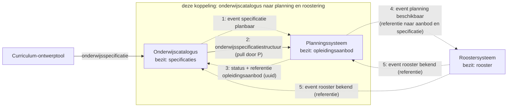
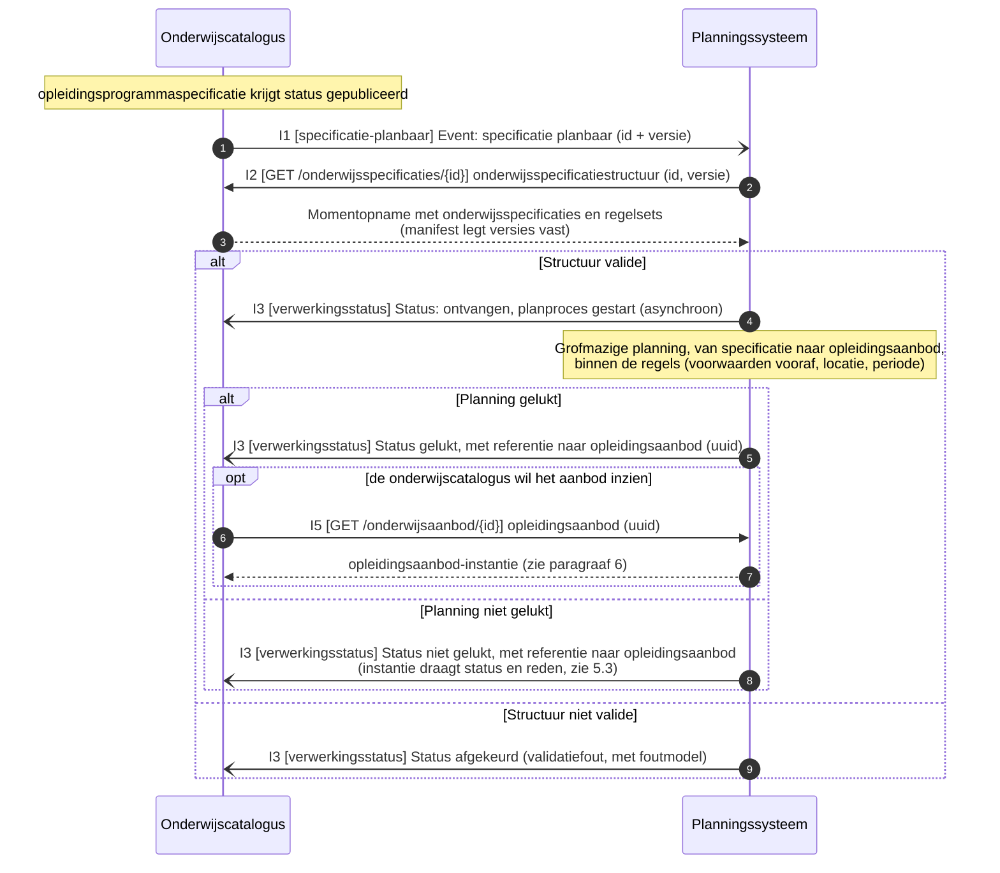
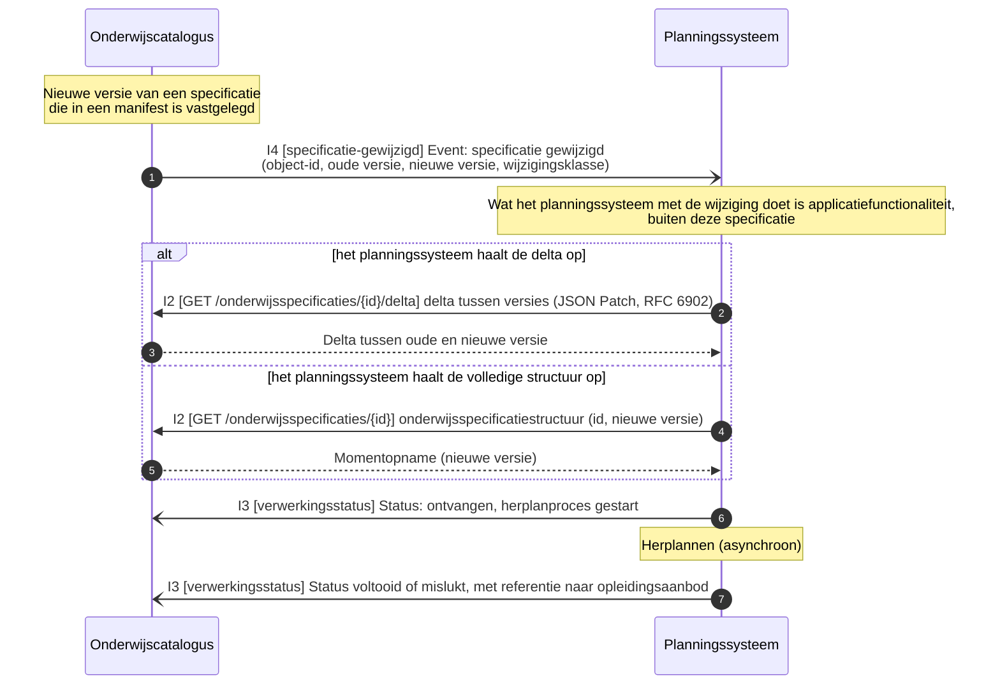
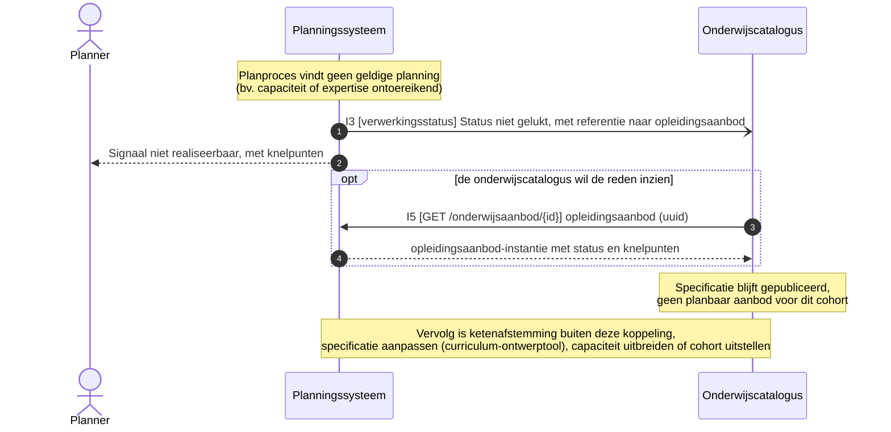
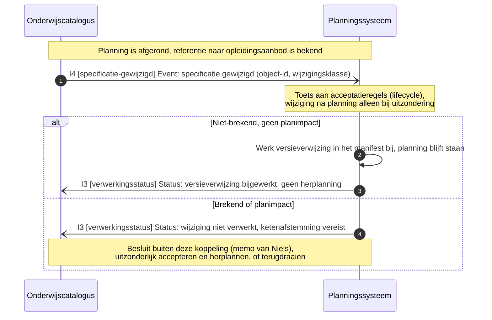
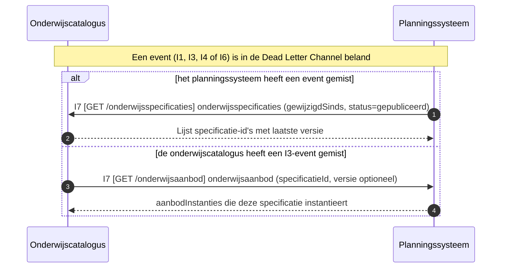
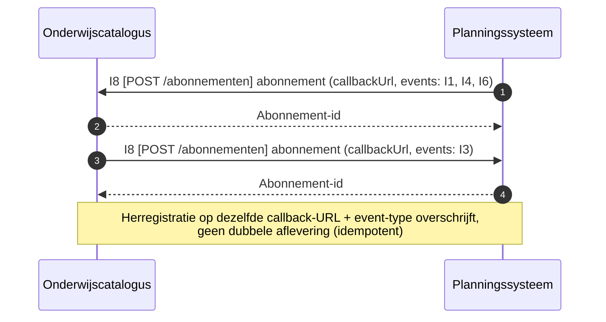
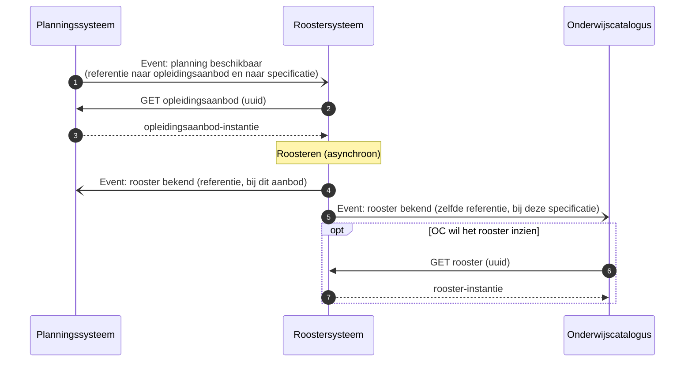

# Onderwijscatalogus naar planning en roostering

De koppeling tussen de onderwijscatalogus en het planningssysteem: welke informatie erover beweegt, in welke volgorde, en welk bericht dat draagt, met de sequentiediagrammen erbij. De functionele eisen die het proces aan deze koppeling stelt staan als vertrekpunt in de eerste tabel; het interactieoverzicht legt per interactie het bericht, het patroon en de foutafhandeling vast, en de endpoints staan bij de [applicatiecomponent](../Applicatiecomponenten/README.md) die ze serveert.

## Plek in de keten

De uitsnede komt uit de informatiestromen-hoofdplaat v1.7 (richtinggevend; de legenda draagt nog "concept"), met deze koppeling gemarkeerd. De koppelvlakken van beide componenten staan bij de [onderwijscatalogus](../Applicatiecomponenten/onderwijscatalogus.md) en het [planningssysteem](../Applicatiecomponenten/planningssysteem.md).

## Functionele eisen

| Id | Functionele eis | Interactie | Story |
|---|---|---|---|
| functionele-eis-0001 | De onderwijscatalogus moet het planningssysteem kunnen laten weten dat een specificatie gereed is om te plannen, en het planningssysteem moet daarop een opleidingsaanbod met referentie kunnen terugleveren | [Opleidingsaanbod aanmaken](#opleidingsaanbod-aanmaken) | [story-0006](../../Referentiemateriaal/requirementsboom/stories.md#story-0006); [story-0007](../../Referentiemateriaal/requirementsboom/stories.md#story-0007) |
| functionele-eis-0002 | Het planningssysteem moet de planning kunnen bijwerken wanneer een specificatie wijzigt, zonder verplicht de volledige structuur opnieuw te ontvangen | [Opleidingsaanbod herplannen](#opleidingsaanbod-herplannen) | geen |
| functionele-eis-0003 | De onderwijscatalogus moet kunnen weten wanneer een specificatie voor een of meer cohorten niet planbaar blijkt in een schooljaar, inclusief de reden | [Planning niet gelukt melden](#planning-niet-gelukt-melden) | [story-0007](../../Referentiemateriaal/requirementsboom/stories.md#story-0007) |
| functionele-eis-0004 | Een afgeronde planning moet beschermd zijn tegen een specificatiewijziging die er ongecontroleerd doorheen breekt | [Acceptatietoets bij late wijziging](#acceptatietoets-bij-late-wijziging) | [story-0002](../../Referentiemateriaal/requirementsboom/stories.md#story-0002) |
| functionele-eis-0005 | De onderwijscatalogus moet een statuswijziging kunnen melden die niet aan een nieuwe versie hangt, los van het wijzigingsproces | [Specificatiestatus gewijzigd melden](#specificatiestatus-gewijzigd-melden) | geen |
| functionele-eis-0006 | Beide partijen moeten na een gemist event de informatie alsnog kunnen ophalen | [Reconciliatie na gemist event](#reconciliatie-na-gemist-event) | [story-0011](../../Referentiemateriaal/requirementsboom/stories.md#story-0011) |
| functionele-eis-0007 | Beide partijen moeten een afleveradres kunnen vastleggen voordat events afgeleverd worden | [Abonnement registreren](#abonnement-registreren) | [story-0010](../../Referentiemateriaal/requirementsboom/stories.md#story-0010) |

## Applicatiediensten

Deze koppeling is de optelsom van de [applicatiediensten](../Applicatiediensten/README.md) in de tabel.

| Applicatiedienst | Geïmplementeerd door |
|---|---|
| [onderwijsspecificatiestructuur-aanbieder](../Applicatiediensten/onderwijsspecificatiestructuur-aanbieder.md) | Onderwijscatalogus |
| [onderwijsspecificatiestructuur-afnemer](../Applicatiediensten/onderwijsspecificatiestructuur-afnemer.md) | Planningssysteem |
| [planbaar-onderwijsaanbod-aanbieder](../Applicatiediensten/planbaar-onderwijsaanbod-aanbieder.md) | Planningssysteem |
| [planbaar-onderwijsaanbod-afnemer](../Applicatiediensten/planbaar-onderwijsaanbod-afnemer.md) | Onderwijscatalogus |
| [verwerkingsuitkomst-aanbieder](../Applicatiediensten/verwerkingsuitkomst-aanbieder.md) | Planningssysteem |
| [verwerkingsuitkomst-afnemer](../Applicatiediensten/verwerkingsuitkomst-afnemer.md) | Onderwijscatalogus |
| [afleverabonnement-aanbieder](../Applicatiediensten/afleverabonnement-aanbieder.md) | Onderwijscatalogus en planningssysteem |
| [afleverabonnement-afnemer](../Applicatiediensten/afleverabonnement-afnemer.md) | Onderwijscatalogus en planningssysteem |

## Interactiepatronen

Deze koppeling zet de volgende [interactiepatronen](../Interactiepatronen/README.md) in. Het interactieoverzicht noemt per interactie welk patroon geldt.

| Interactiepatroon | Waarvoor in deze koppeling | Interacties |
|---|---|---|
| [Event Notification](../Interactiepatronen/event-notification.md) | Melden dat een specificatie planbaar is of is gewijzigd, en het ophalen van structuur, delta of aanbod-instantie dat daarop volgt | I1, I2, I4, I5 |
| [Asynchronous Request-Reply](../Interactiepatronen/asynchronous-request-reply.md) | De uitkomst van het planproces terugmelden, met een referentie naar het opleidingsaanbod | I3 |
| [Event-Carried State Transfer](../Interactiepatronen/event-carried-state-transfer.md) | Een statusovergang die los staat van een versie: het planningssysteem werkt zijn afgeleide status bij zonder op te halen | I6 |
| [Request-Reply](../Interactiepatronen/request-reply.md) | Herstel nadat een event in de dead letter channel is beland | I7 |
| [Subscription registration](../Interactiepatronen/subscription-registration.md) | Het afleveradres vastleggen waarop de meldingen landen | I8 |

## Procesbeeld

Twee gedeelde principes bepalen het verkeer over deze koppeling. **Resource-eigenaarschap** ([U3](../uitgangspunten.md#u3-resource-eigenaarschap)): de onderwijscatalogus bezit de onderwijsspecificaties, het planningssysteem het onderwijsaanbod, het roostersysteem het rooster. **Event notification** ([U4](../uitgangspunten.md#u4-event-notification)): de onderwijscatalogus meldt, het planningssysteem haalt op wanneer het hem uitkomt.

Wat het diagram niet toont: het planningssysteem bouwt de planning **asynchroon** op, binnen de regels uit de specificatie (voorwaarden vooraf, locatie, periode). De uitkomst, gelukt of niet gelukt, komt terug als status met een referentie naar het `opleidingsaanbod`; de aanbod-instantie zelf blijft bij planning en wordt alleen opgehaald als de catalogus die wil inzien. Stap 4 en 5 liggen buiten deze koppeling en staan er ter illustratie van hetzelfde patroon.

## Interactieoverzicht

De interacties op deze koppeling, met per interactie het messaging-patroon. Betrouwbaarheidseisen volgen [ADR 0018](../../Referentiemateriaal/adr/0018-enterprise-messaging-patronen-voor-betrouwbare-koppelvlakken.md). De events zijn dunne notificaties ([Event Message](https://www.enterpriseintegrationpatterns.com/patterns/messaging/EventMessage.html)): ze dragen de aanleiding (id en versie), niet de inhoud.
Wat hier wordt vastgelegd is het **bericht**, niet het **kanaal**: hoe het bericht bij de ontvanger komt is een inrichtingskeuze van instelling en leverancier, binnen de vier eigenschappen die [ADR 0018](../../Referentiemateriaal/adr/0018-enterprise-messaging-patronen-voor-betrouwbare-koppelvlakken.md) eist. Zie [uitgangspunt U5](../uitgangspunten.md#u5-bericht-versus-kanaal).

I1 tot en met I5 zijn als berichtstroom uitgewerkt tot sequentiediagrammen. I6 tot en met I8 zijn nodig om I1, I3 en I4 in productie te kunnen laten werken (statuswijziging los van versie, hersynchronisatie na een verloren event, en de abonnementen waar de webhook-events I1/I3/I4 op leunen) en horen daarom net zo goed bij deze koppeling; ze volgen het patroon van de interactie die ze het dichtst benaderen (I6 spiegelt I4, I7 en I8 spiegelen I2/I5).

| # | Interactie | Initiator | Patroon | Synchroniciteit | Gedrag bij dubbele ontvangst | Foutafhandeling |
|---|---|---|---|---|---|---|
| I1 | Specificatie planbaar melden | OC | [Event Notification](../Interactiepatronen/event-notification.md) (id + versie) | Asynchroon | Geen effect: ontvanger herkent event-id ([Idempotent Receiver](https://www.enterpriseintegrationpatterns.com/patterns/messaging/IdempotentReceiver.html)) | [Guaranteed Delivery](https://www.enterpriseintegrationpatterns.com/patterns/messaging/GuaranteedDelivery.html); [Dead Letter Channel](https://www.enterpriseintegrationpatterns.com/patterns/messaging/DeadLetterChannel.html) |
| I2 | Onderwijsspecificatiestructuur of delta ophalen | P | [Event Notification](../Interactiepatronen/event-notification.md) (GET, alleen-lezen) | Synchroon | Geen effect (alleen-lezen) | HTTP-foutcodes, client bepaalt retry |
| I3 | Verwerkingsstatus melden, met referentie naar het `opleidingsaanbod` | P | [Asynchronous Request-Reply](../Interactiepatronen/asynchronous-request-reply.md) (status: ontvangen/gestart, afgekeurd, gelukt, niet gelukt) | Asynchroon | Geen effect: status-id | Retry met backoff, daarna [Dead Letter Channel](https://www.enterpriseintegrationpatterns.com/patterns/messaging/DeadLetterChannel.html) |
| I4 | Specificatiewijziging melden | OC | [Event Notification](../Interactiepatronen/event-notification.md) (object-id, oude en nieuwe versie, wijzigingsklasse) | Asynchroon | Geen effect: event-id | [Guaranteed Delivery](https://www.enterpriseintegrationpatterns.com/patterns/messaging/GuaranteedDelivery.html); [Dead Letter Channel](https://www.enterpriseintegrationpatterns.com/patterns/messaging/DeadLetterChannel.html) |
| I5 | `opleidingsaanbod` ophalen | OC (of R) | [Event Notification](../Interactiepatronen/event-notification.md) op referentie (GET uuid, alleen-lezen) | Synchroon | Geen effect (alleen-lezen) | HTTP-foutcodes |
| I6 | Specificatiestatus gewijzigd, los van versie (bv. `gepubliceerd` naar `gedeactiveerd`, [regels bij de schema's](../Datamodelschema's/README.md#regels-bij-de-schemas)) | OC | [Event-Carried State Transfer](../Interactiepatronen/event-carried-state-transfer.md) (object-id, oude status, nieuwe status) | Asynchroon | Geen effect: event-id ([Idempotent Receiver](https://www.enterpriseintegrationpatterns.com/patterns/messaging/IdempotentReceiver.html)) | [Guaranteed Delivery](https://www.enterpriseintegrationpatterns.com/patterns/messaging/GuaranteedDelivery.html); [Dead Letter Channel](https://www.enterpriseintegrationpatterns.com/patterns/messaging/DeadLetterChannel.html) |
| I7 | Reconciliatie: gepubliceerde specificaties of aanbod-instanties opnieuw opvragen na een event in de Dead Letter Channel | OC of P | [Request-Reply](../Interactiepatronen/request-reply.md) (GET, lijst-/queryoperatie, alleen-lezen) | Synchroon | Geen effect (alleen-lezen) | HTTP-foutcodes |
| I8 | Abonnement registreren voor de events I1, I3, I4 en I6 | OC en P (over en weer, elk voor de events die de ander van hem ontvangt) | [Subscription registration](../Interactiepatronen/subscription-registration.md) (registratie: callback-URL + event-typen) | Synchroon | Idempotent op callback-URL + event-type: herregistratie overschrijft, geen dubbele aflevering | HTTP-foutcodes |

Referentie voor de patroontaal: [Enterprise Integration Patterns, Messaging](https://www.enterpriseintegrationpatterns.com/patterns/messaging/). De koppelingspecificatie legt de patronen op dit niveau vast; implementatiekeuzes (bus, broker, polling) schrijft ze niet voor.

Buiten deze koppeling, maar wel tussen dezelfde twee systemen: capaciteitsterugkoppeling en het door P annuleren van een reeds gepland aanbod buiten de I4-flow. Bewust uitgesteld.

Context, buiten deze koppeling maar zelfde patroon: P meldt R "planning beschikbaar" (referenties), R meldt OC en P "rooster bekend" (referentie).

Ordening: per `specificatieId` blijft de berichtvolgorde behouden (zelfde sleutel, zelfde volgorde, [ADR 0018](../../Referentiemateriaal/adr/0018-enterprise-messaging-patronen-voor-betrouwbare-koppelvlakken.md)).

## Berichtstromen

| Berichtstroom | Patroon | Doel | Trigger | Initiator | Interacties | Endpoints | Sequentiediagram |
|---|---|---|---|---|---|---|---|
| Opleidingsaanbod aanmaken | [Event Notification](../Interactiepatronen/event-notification.md), [Asynchronous Request-Reply](../Interactiepatronen/asynchronous-request-reply.md) | Een gepubliceerde specificatie omzetten in een planbaar `opleidingsaanbod`, met een referentie terug naar de onderwijscatalogus | Onderwijsspecificatie krijgt status `gepubliceerd` | Onderwijscatalogus | I1, I2, I3, (I5) | webhook `specificatie-planbaar`; `GET /onderwijsspecificaties/{id}`; webhook `verwerkingsstatus`; (`GET /onderwijsaanbod/{id}`) | [hieronder](#opleidingsaanbod-aanmaken) |
| Opleidingsaanbod herplannen | [Event Notification](../Interactiepatronen/event-notification.md), [Asynchronous Request-Reply](../Interactiepatronen/asynchronous-request-reply.md) | Een lopende planning laten volgen op een nieuwe specificatieversie, met delta of volledige structuur als keuze voor de ontvanger | Nieuwe versie van een specificatie die al in een manifest is vastgelegd | Onderwijscatalogus | I2, I3, I4 | `GET /onderwijsspecificaties/{id}/delta` of `GET /onderwijsspecificaties/{id}`; webhook `verwerkingsstatus`; webhook `specificatie-gewijzigd` | [hieronder](#opleidingsaanbod-herplannen) |
| Planning niet gelukt melden | [Asynchronous Request-Reply](../Interactiepatronen/asynchronous-request-reply.md) | De onderwijscatalogus in kennis stellen dat een specificatie voor een of meer cohorten niet planbaar blijkt, met referentie en knelpunten, zonder de aanroep te blokkeren | Planproces bij het planningssysteem vindt geen geldige planning | Planningssysteem | I3, (I5) | webhook `verwerkingsstatus`; (`GET /onderwijsaanbod/{id}`) | [hieronder](#planning-niet-gelukt-melden) |
| Acceptatietoets bij late wijziging | [Event Notification](../Interactiepatronen/event-notification.md), [Asynchronous Request-Reply](../Interactiepatronen/asynchronous-request-reply.md) | Een afgeronde planning beschermen tegen een wijziging die er ongecontroleerd doorheen breekt | Specificatiewijziging terwijl de planning al is afgerond | Onderwijscatalogus | I3, I4 | webhook `specificatie-gewijzigd`; webhook `verwerkingsstatus` | [hieronder](#acceptatietoets-bij-late-wijziging) |
| Specificatiestatus gewijzigd melden | [Event-Carried State Transfer](../Interactiepatronen/event-carried-state-transfer.md) | De onderwijscatalogus een statuswijziging laten melden die los staat van een nieuwe versie, zodat het planningssysteem zijn afgeleide status kan bijwerken zonder herplanronde | Specificatie krijgt een nieuwe status buiten een versiewijziging om (bv. `gepubliceerd` naar `gedeactiveerd`) | Onderwijscatalogus | I6 | webhook `specificatie-status-gewijzigd` | [hieronder](#specificatiestatus-gewijzigd-melden) |
| Reconciliatie na gemist event | [Request-Reply](../Interactiepatronen/request-reply.md) | De gemiste informatie via een gewone opvraag herstellen na een event dat in de Dead Letter Channel is beland | Een I1-, I3-, I4- of I6-event is niet aangekomen | Onderwijscatalogus of Planningssysteem | I7 | `GET /onderwijsspecificaties` (op OC); `GET /onderwijsaanbod` (op P) | [hieronder](#reconciliatie-na-gemist-event) |
| Abonnement registreren | [Subscription registration](../Interactiepatronen/subscription-registration.md) | Elke partij een callback-URL laten vastleggen voor de events die zij van de ander ontvangt, als voorwaarde voor I1, I3, I4 en I6 | Inrichting van de koppeling, of wijziging van de callback-URL | Onderwijscatalogus en Planningssysteem | I8 | `POST /abonnementen` (op OC en op P) | [hieronder](#abonnement-registreren) |

## Opleidingsaanbod aanmaken

Doel: een gepubliceerde specificatie omzetten in een planbaar `opleidingsaanbod`, met een referentie terug naar de onderwijscatalogus. Trigger: onderwijsspecificatie krijgt status `gepubliceerd`. Initiator: Onderwijscatalogus. Interacties: I1, I2, I3, (I5).

Endpoints:

- [webhook `specificatie-planbaar` (I1)](../Applicatiediensten/onderwijsspecificatiestructuur-afnemer.md)
- [`GET /onderwijsspecificaties/{id}` (I2)](../Applicatiediensten/onderwijsspecificatiestructuur-aanbieder.md)
- [webhook `verwerkingsstatus` (I3)](../Applicatiediensten/verwerkingsuitkomst-afnemer.md)
- [`GET /onderwijsaanbod/{id}` (I5, optioneel)](../Applicatiediensten/planbaar-onderwijsaanbod-aanbieder.md)

## Opleidingsaanbod herplannen

Doel: een lopende planning laten volgen op een nieuwe specificatieversie, met delta of volledige structuur als keuze voor de ontvanger. Trigger: nieuwe versie van een specificatie die al in een manifest is vastgelegd. Initiator: Onderwijscatalogus. Interacties: I2, I3, I4.

Endpoints:

- [`GET /onderwijsspecificaties/{id}/delta` of `GET /onderwijsspecificaties/{id}` (I2)](../Applicatiediensten/onderwijsspecificatiestructuur-aanbieder.md)
- [webhook `verwerkingsstatus` (I3)](../Applicatiediensten/verwerkingsuitkomst-afnemer.md)
- [webhook `specificatie-gewijzigd` (I4)](../Applicatiediensten/onderwijsspecificatiestructuur-afnemer.md)

## Planning niet gelukt melden

Doel: de onderwijscatalogus in kennis stellen dat een specificatie voor een of meer cohorten niet planbaar blijkt, met referentie en knelpunten, zonder de aanroep te blokkeren. Trigger: planproces bij het planningssysteem vindt geen geldige planning. Initiator: Planningssysteem. Interacties: I3, (I5).

Endpoints:

- [webhook `verwerkingsstatus` (I3)](../Applicatiediensten/verwerkingsuitkomst-afnemer.md)
- [`GET /onderwijsaanbod/{id}` (I5, optioneel)](../Applicatiediensten/planbaar-onderwijsaanbod-aanbieder.md)

## Acceptatietoets bij late wijziging

Doel: een afgeronde planning beschermen tegen een wijziging die er ongecontroleerd doorheen breekt. Trigger: specificatiewijziging terwijl de planning al is afgerond. Initiator: Onderwijscatalogus. Interacties: I3, I4.

Endpoints:

- [webhook `specificatie-gewijzigd` (I4)](../Applicatiediensten/onderwijsspecificatiestructuur-afnemer.md)
- [webhook `verwerkingsstatus` (I3)](../Applicatiediensten/verwerkingsuitkomst-afnemer.md)

## Specificatiestatus gewijzigd melden

Doel: de onderwijscatalogus een statuswijziging laten melden die los staat van een nieuwe versie, zodat het planningssysteem zijn afgeleide status kan bijwerken zonder herplanronde. Trigger: specificatie krijgt een nieuwe status buiten een versiewijziging om (bv. `gepubliceerd` naar `gedeactiveerd`, [regels bij de schema's](../Datamodelschema's/README.md#regels-bij-de-schemas)). Initiator: Onderwijscatalogus. Interacties: I6. Voorbeeldgeval: een opleiding die voor een ouder cohort bewust niet meer wordt aangeboden is nog wel planbaar, maar wordt niet meer gepland; dat is deze statuswijziging (met archivering als vervolg), geen planningsfout uit de melding hierboven.

Endpoints:

- [webhook `specificatie-status-gewijzigd` (I6)](../Applicatiediensten/onderwijsspecificatiestructuur-afnemer.md)

I6 volgt het patroon van I4.

## Reconciliatie na gemist event

Doel: de gemiste informatie via een gewone opvraag herstellen na een event dat in de Dead Letter Channel is beland, zonder op een herhaalde aflevering te wachten. Trigger: een I1-, I3-, I4- of I6-event is niet aangekomen. Initiator: Onderwijscatalogus of Planningssysteem. Interacties: I7.

Endpoints:

- [`GET /onderwijsspecificaties` (op OC)](../Applicatiediensten/onderwijsspecificatiestructuur-aanbieder.md)
- [`GET /onderwijsaanbod` (op P)](../Applicatiediensten/planbaar-onderwijsaanbod-aanbieder.md)

I7 volgt het patroon van I2/I5.

## Abonnement registreren

Doel: elke partij een callback-URL laten vastleggen voor de events die zij van de ander ontvangt, als voorwaarde voor de event-gedreven interacties (I1, I3, I4, I6). Trigger: inrichting van de koppeling, of wijziging van de callback-URL. Initiator: Onderwijscatalogus en Planningssysteem (over en weer, elk voor de events die de ander van hem ontvangt). Interacties: I8.

Endpoints:

- [`POST /abonnementen` (op OC en op P)](../Applicatiediensten/afleverabonnement-aanbieder.md)

I8 volgt het patroon van I2/I5.

## Context: doorwerking naar het roostersysteem

Buiten deze koppeling, en niet als vastgelegde interactie: het roostersysteem plaatst het geplande aanbod in tijd en ruimte. Het planningssysteem meldt dat de planning beschikbaar is, het roostersysteem haalt het aanbod op en meldt het rooster terug aan zowel planning als catalogus. Hetzelfde patroon van referentie plus event dus, opgenomen om te tonen dat de lijn doorloopt tot voorbij wat dit pakket specificeert. Het [roostersysteem](../Applicatiecomponenten/roostersysteem.md) draagt daarom geen endpoints.

