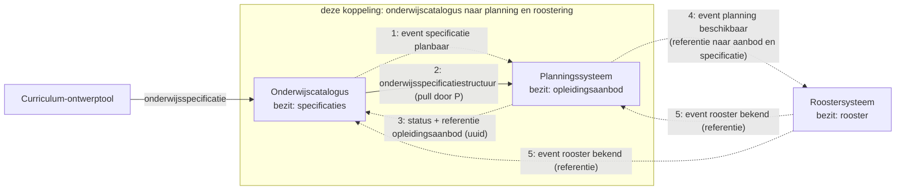
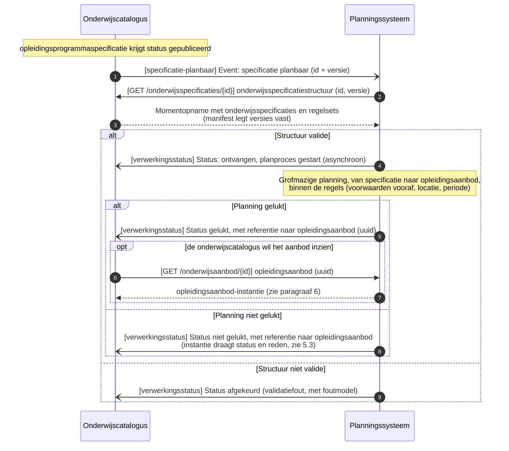
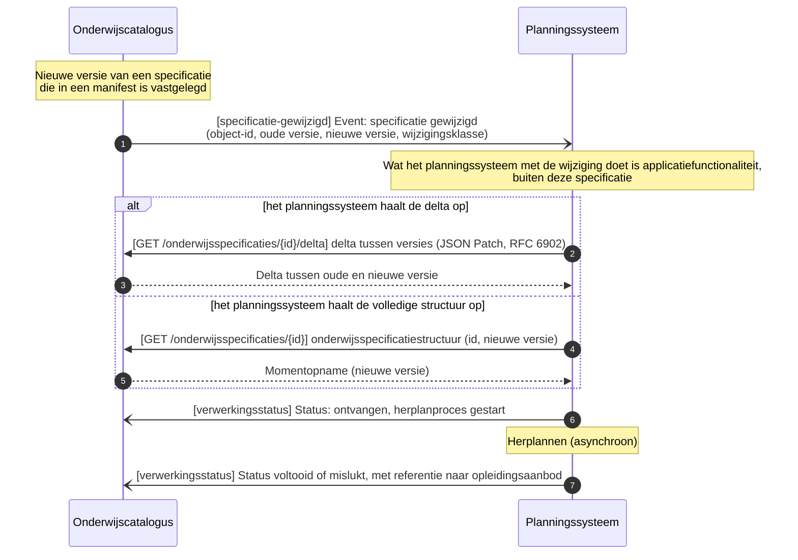
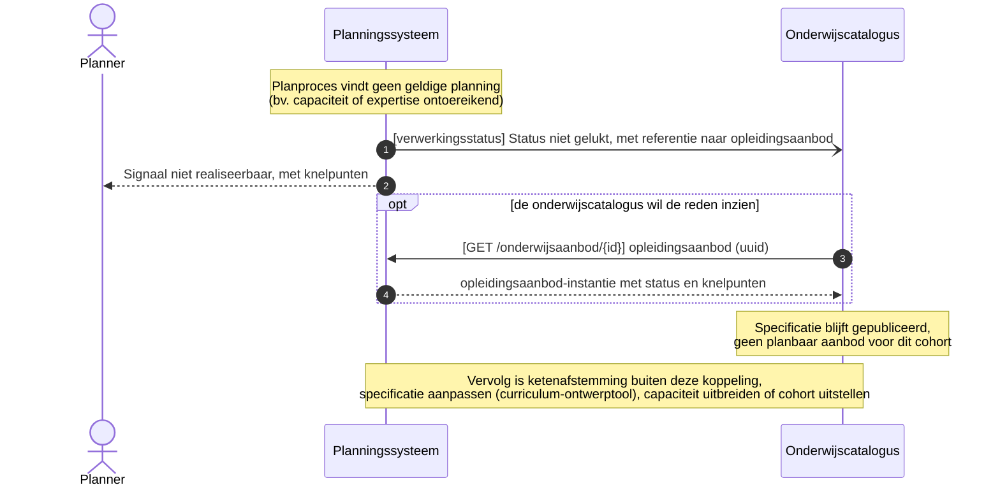
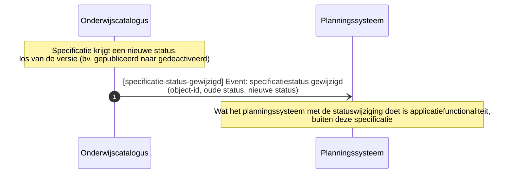
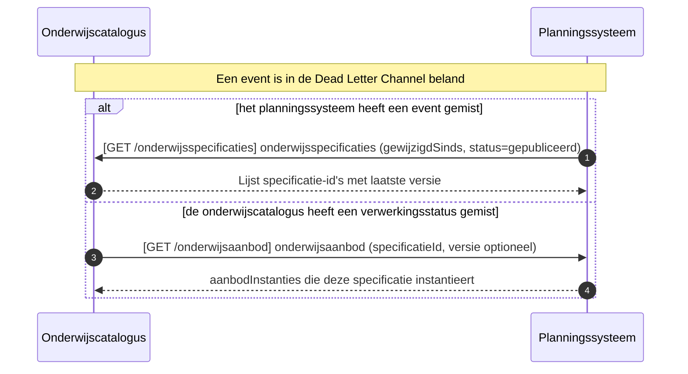
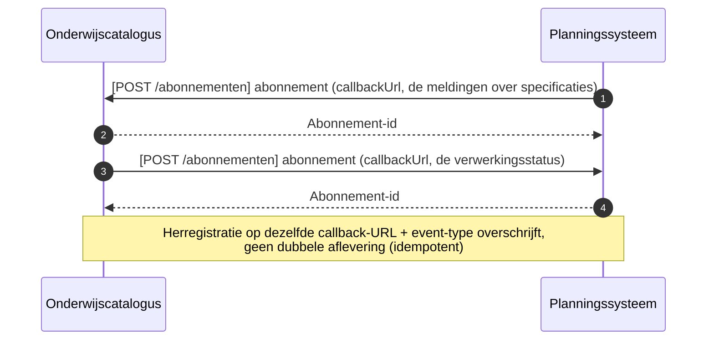
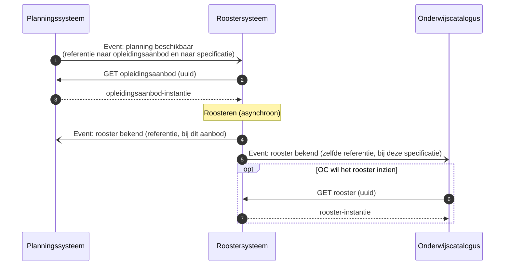

# Onderwijscatalogus naar planning en roostering

De koppeling tussen de onderwijscatalogus en het planningssysteem: welke informatie erover beweegt, in welke volgorde, en welk bericht dat draagt, met de sequentiediagrammen erbij. De functionele eisen die het proces aan deze koppeling stelt staan als vertrekpunt in de eerste tabel; het interactieoverzicht legt per interactie het bericht, het patroon en de foutafhandeling vast, en de endpoints staan bij de [applicatiecomponent](../Applicatiecomponenten/README.md) die ze serveert.

## Plek in de keten

De uitsnede komt uit de informatiestromen-hoofdplaat v1.7 (richtinggevend; de legenda draagt nog "concept"), met deze koppeling gemarkeerd. De koppelvlakken van beide componenten staan bij de [onderwijscatalogus](../Applicatiecomponenten/onderwijscatalogus.md) en het [planningssysteem](../Applicatiecomponenten/planningssysteem.md).

## Stories

De stories uit de [requirementsboom](../../Referentiemateriaal/requirementsboom/README.md) die deze koppeling invult, met de berichtstroom die dat doet.

| Story | Ingevuld door |
|---|---|
| [story-0006](../../Referentiemateriaal/requirementsboom/stories.md#story-0006) | [Opleidingsaanbod aanmaken](#opleidingsaanbod-aanmaken) |
| [story-0007](../../Referentiemateriaal/requirementsboom/stories.md#story-0007) | [Opleidingsaanbod aanmaken](#opleidingsaanbod-aanmaken) en [Planning niet gelukt melden](#planning-niet-gelukt-melden) |
| [story-0030](../../Referentiemateriaal/requirementsboom/stories.md#story-0030) | [Opleidingsaanbod herplannen](#opleidingsaanbod-herplannen) |
| [story-0002](../../Referentiemateriaal/requirementsboom/stories.md#story-0002) | [Acceptatietoets bij late wijziging](#acceptatietoets-bij-late-wijziging) |
| [story-0032](../../Referentiemateriaal/requirementsboom/stories.md#story-0032) | [Specificatiestatus gewijzigd melden](#specificatiestatus-gewijzigd-melden) |
| [story-0011](../../Referentiemateriaal/requirementsboom/stories.md#story-0011) | [Reconciliatie na gemist event](#reconciliatie-na-gemist-event) |
| [story-0010](../../Referentiemateriaal/requirementsboom/stories.md#story-0010) | [Abonnement registreren](#abonnement-registreren) |

## Applicatiediensten

Deze koppeling zet de volgende [applicatiediensten](../Applicatiediensten/README.md) in. De tabel legt vast welk component welke dienst implementeert; welke stromen daarover lopen en in welke volgorde bepaalt de koppeling zelf.

| Applicatiedienst | Geïmplementeerd door |
|---|---|
| [onderwijsspecificatiestructuur-aanbieder](../Applicatiediensten/onderwijsspecificatiestructuur-aanbieder.md) | Onderwijscatalogus |
| [onderwijsspecificatiestructuur-afnemer](../Applicatiediensten/onderwijsspecificatiestructuur-afnemer.md) | Planningssysteem |
| [planbaar-onderwijsaanbod-aanbieder](../Applicatiediensten/planbaar-onderwijsaanbod-aanbieder.md) | Planningssysteem |
| [planbaar-onderwijsaanbod-afnemer](../Applicatiediensten/planbaar-onderwijsaanbod-afnemer.md) | Onderwijscatalogus |
| [verwerkingsuitkomst-aanbieder](../Applicatiediensten/verwerkingsuitkomst-aanbieder.md) | Planningssysteem |
| [verwerkingsuitkomst-afnemer](../Applicatiediensten/verwerkingsuitkomst-afnemer.md) | Onderwijscatalogus |
| [afleverabonnement-aanbieder](../Applicatiediensten/afleverabonnement-aanbieder.md) | Onderwijscatalogus en planningssysteem |
| [afleverabonnement-afnemer](../Applicatiediensten/afleverabonnement-afnemer.md) | Onderwijscatalogus en planningssysteem |

## Interactiepatronen

Deze koppeling zet de volgende [interactiepatronen](../Interactiepatronen/README.md) in.

| Interactiepatroon | Waarvoor in deze koppeling |
|---|---|
| [Event Notification](../Interactiepatronen/event-notification.md) | Melden dat een specificatie planbaar is of is gewijzigd, en het ophalen van structuur, delta of aanbod-instantie dat daarop volgt |
| [Asynchronous Request-Reply](../Interactiepatronen/asynchronous-request-reply.md) | De uitkomst van het planproces terugmelden, met een referentie naar het opleidingsaanbod |
| [Event-Carried State Transfer](../Interactiepatronen/event-carried-state-transfer.md) | Een statusovergang die los staat van een versie: het planningssysteem werkt zijn afgeleide status bij zonder op te halen |
| [Request-Reply](../Interactiepatronen/request-reply.md) | Herstel nadat een event in de dead letter channel is beland |
| [Subscription registration](../Interactiepatronen/subscription-registration.md) | Het afleveradres vastleggen waarop de meldingen landen |

## Procesbeeld

Twee gedeelde principes bepalen het verkeer over deze koppeling. **Resource-eigenaarschap** ([U3](../uitgangspunten.md#u3-resource-eigenaarschap)): de onderwijscatalogus bezit de onderwijsspecificaties, het planningssysteem het onderwijsaanbod, het roostersysteem het rooster. **Event notification** ([U4](../uitgangspunten.md#u4-event-notification)): de onderwijscatalogus meldt, het planningssysteem haalt op wanneer het hem uitkomt.

Wat het diagram niet toont: het planningssysteem bouwt de planning **asynchroon** op, binnen de regels uit de specificatie (voorwaarden vooraf, locatie, periode). De uitkomst, gelukt of niet gelukt, komt terug als status met een referentie naar het `opleidingsaanbod`; de aanbod-instantie zelf blijft bij planning en wordt alleen opgehaald als de catalogus die wil inzien. Stap 4 en 5 liggen buiten deze koppeling en staan er ter illustratie van hetzelfde patroon.

## Berichtstromen

## Opleidingsaanbod aanmaken

Doel: een gepubliceerde specificatie omzetten in een planbaar `opleidingsaanbod`, met een referentie terug naar de onderwijscatalogus. Trigger: onderwijsspecificatie krijgt status `gepubliceerd`. Initiator: Onderwijscatalogus.

| Versie | Interactiepatronen | Applicatiediensten |
|---|---|---|
| 1.0 | [Event Notification](../Interactiepatronen/event-notification.md), [Asynchronous Request-Reply](../Interactiepatronen/asynchronous-request-reply.md) | [onderwijsspecificatiestructuur-afnemer](../Applicatiediensten/onderwijsspecificatiestructuur-afnemer.md), [onderwijsspecificatiestructuur-aanbieder](../Applicatiediensten/onderwijsspecificatiestructuur-aanbieder.md), [verwerkingsuitkomst-afnemer](../Applicatiediensten/verwerkingsuitkomst-afnemer.md), [planbaar-onderwijsaanbod-aanbieder](../Applicatiediensten/planbaar-onderwijsaanbod-aanbieder.md) |

Endpoints:

- [webhook `specificatie-planbaar`](../Applicatiediensten/onderwijsspecificatiestructuur-afnemer.md)
- [`GET /onderwijsspecificaties/{id}`](../Applicatiediensten/onderwijsspecificatiestructuur-aanbieder.md)
- [webhook `verwerkingsstatus`](../Applicatiediensten/verwerkingsuitkomst-afnemer.md)
- [`GET /onderwijsaanbod/{id}` (optioneel)](../Applicatiediensten/planbaar-onderwijsaanbod-aanbieder.md)

## Opleidingsaanbod herplannen

Doel: een lopende planning laten volgen op een nieuwe specificatieversie, met delta of volledige structuur als keuze voor de ontvanger. Trigger: nieuwe versie van een specificatie die al in een manifest is vastgelegd. Initiator: Onderwijscatalogus.

| Versie | Interactiepatronen | Applicatiediensten |
|---|---|---|
| 1.0 | [Event Notification](../Interactiepatronen/event-notification.md), [Asynchronous Request-Reply](../Interactiepatronen/asynchronous-request-reply.md) | [onderwijsspecificatiestructuur-aanbieder](../Applicatiediensten/onderwijsspecificatiestructuur-aanbieder.md), [verwerkingsuitkomst-afnemer](../Applicatiediensten/verwerkingsuitkomst-afnemer.md), [onderwijsspecificatiestructuur-afnemer](../Applicatiediensten/onderwijsspecificatiestructuur-afnemer.md) |

Endpoints:

- [`GET /onderwijsspecificaties/{id}/delta` of `GET /onderwijsspecificaties/{id}`](../Applicatiediensten/onderwijsspecificatiestructuur-aanbieder.md)
- [webhook `verwerkingsstatus`](../Applicatiediensten/verwerkingsuitkomst-afnemer.md)
- [webhook `specificatie-gewijzigd`](../Applicatiediensten/onderwijsspecificatiestructuur-afnemer.md)

## Planning niet gelukt melden

Doel: de onderwijscatalogus in kennis stellen dat een specificatie voor een of meer cohorten niet planbaar blijkt, met referentie en knelpunten, zonder de aanroep te blokkeren. Trigger: planproces bij het planningssysteem vindt geen geldige planning. Initiator: Planningssysteem.

| Versie | Interactiepatronen | Applicatiediensten |
|---|---|---|
| 1.0 | [Asynchronous Request-Reply](../Interactiepatronen/asynchronous-request-reply.md) | [verwerkingsuitkomst-afnemer](../Applicatiediensten/verwerkingsuitkomst-afnemer.md), [planbaar-onderwijsaanbod-aanbieder](../Applicatiediensten/planbaar-onderwijsaanbod-aanbieder.md) |

Endpoints:

- [webhook `verwerkingsstatus`](../Applicatiediensten/verwerkingsuitkomst-afnemer.md)
- [`GET /onderwijsaanbod/{id}` (optioneel)](../Applicatiediensten/planbaar-onderwijsaanbod-aanbieder.md)

## Acceptatietoets bij late wijziging

Doel: een afgeronde planning beschermen tegen een wijziging die er ongecontroleerd doorheen breekt. Trigger: specificatiewijziging terwijl de planning al is afgerond. Initiator: Onderwijscatalogus.

| Versie | Interactiepatronen | Applicatiediensten |
|---|---|---|
| 1.0 | [Event Notification](../Interactiepatronen/event-notification.md), [Asynchronous Request-Reply](../Interactiepatronen/asynchronous-request-reply.md) | [onderwijsspecificatiestructuur-afnemer](../Applicatiediensten/onderwijsspecificatiestructuur-afnemer.md), [verwerkingsuitkomst-afnemer](../Applicatiediensten/verwerkingsuitkomst-afnemer.md) |

Endpoints:

- [webhook `specificatie-gewijzigd`](../Applicatiediensten/onderwijsspecificatiestructuur-afnemer.md)
- [webhook `verwerkingsstatus`](../Applicatiediensten/verwerkingsuitkomst-afnemer.md)

## Specificatiestatus gewijzigd melden

Doel: de onderwijscatalogus een statuswijziging laten melden die los staat van een nieuwe versie, zodat het planningssysteem zijn afgeleide status kan bijwerken zonder herplanronde. Trigger: specificatie krijgt een nieuwe status buiten een versiewijziging om (bv. `gepubliceerd` naar `gedeactiveerd`, [regels bij de schema's](../Datamodelschema's/README.md#regels-bij-de-schemas)). Initiator: Onderwijscatalogus. Voorbeeldgeval: een opleiding die voor een ouder cohort bewust niet meer wordt aangeboden is nog wel planbaar, maar wordt niet meer gepland; dat is deze statuswijziging (met archivering als vervolg), geen planningsfout uit de melding hierboven.

| Versie | Interactiepatronen | Applicatiediensten |
|---|---|---|
| 1.0 | [Event-Carried State Transfer](../Interactiepatronen/event-carried-state-transfer.md) | [onderwijsspecificatiestructuur-afnemer](../Applicatiediensten/onderwijsspecificatiestructuur-afnemer.md) |

Endpoints:

- [webhook `specificatie-status-gewijzigd`](../Applicatiediensten/onderwijsspecificatiestructuur-afnemer.md)

## Reconciliatie na gemist event

Doel: de gemiste informatie via een gewone opvraag herstellen na een event dat in de Dead Letter Channel is beland, zonder op een herhaalde aflevering te wachten. Trigger: een event is niet aangekomen. Initiator: Onderwijscatalogus of Planningssysteem.

| Versie | Interactiepatronen | Applicatiediensten |
|---|---|---|
| 1.0 | [Request-Reply](../Interactiepatronen/request-reply.md) | [onderwijsspecificatiestructuur-aanbieder](../Applicatiediensten/onderwijsspecificatiestructuur-aanbieder.md), [planbaar-onderwijsaanbod-aanbieder](../Applicatiediensten/planbaar-onderwijsaanbod-aanbieder.md) |

Endpoints:

- [`GET /onderwijsspecificaties` (op OC)](../Applicatiediensten/onderwijsspecificatiestructuur-aanbieder.md)
- [`GET /onderwijsaanbod` (op P)](../Applicatiediensten/planbaar-onderwijsaanbod-aanbieder.md)

## Abonnement registreren

Doel: elke partij een callback-URL laten vastleggen voor de events die zij van de ander ontvangt, als voorwaarde voor de event-gedreven stromen. Trigger: inrichting van de koppeling, of wijziging van de callback-URL. Initiator: Onderwijscatalogus en Planningssysteem (over en weer, elk voor de events die de ander van hem ontvangt).

| Versie | Interactiepatronen | Applicatiediensten |
|---|---|---|
| 1.0 | [Subscription registration](../Interactiepatronen/subscription-registration.md) | [afleverabonnement-aanbieder](../Applicatiediensten/afleverabonnement-aanbieder.md) |

Endpoints:

- [`POST /abonnementen` (op OC en op P)](../Applicatiediensten/afleverabonnement-aanbieder.md)

## Context: doorwerking naar het roostersysteem

Buiten deze koppeling, en niet als vastgelegde interactie: het roostersysteem plaatst het geplande aanbod in tijd en ruimte. Het planningssysteem meldt dat de planning beschikbaar is, het roostersysteem haalt het aanbod op en meldt het rooster terug aan zowel planning als catalogus. Hetzelfde patroon van referentie plus event dus, opgenomen om te tonen dat de lijn doorloopt tot voorbij wat dit pakket specificeert. Het [roostersysteem](../Applicatiecomponenten/roostersysteem.md) draagt daarom geen endpoints.

