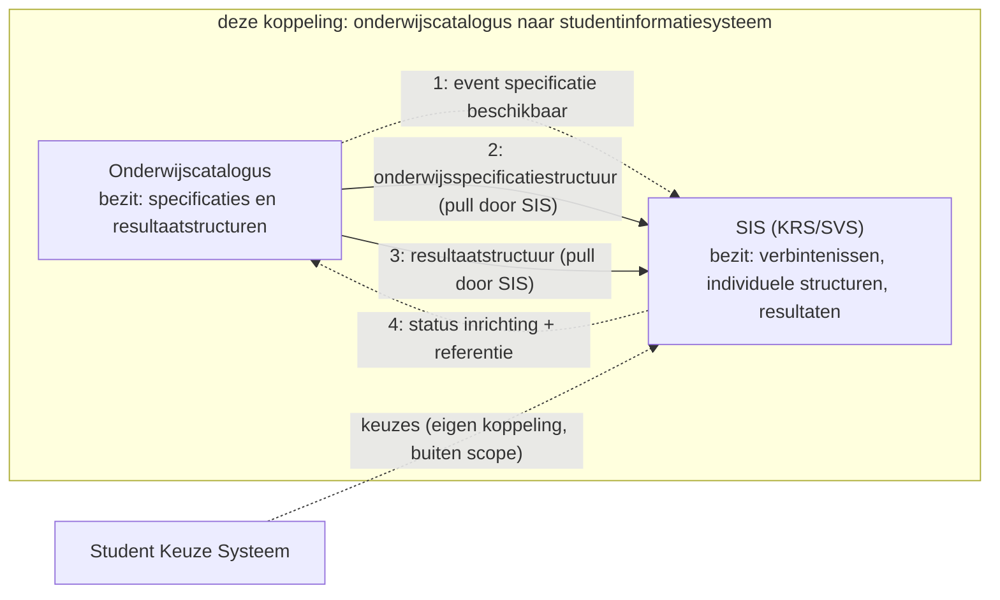
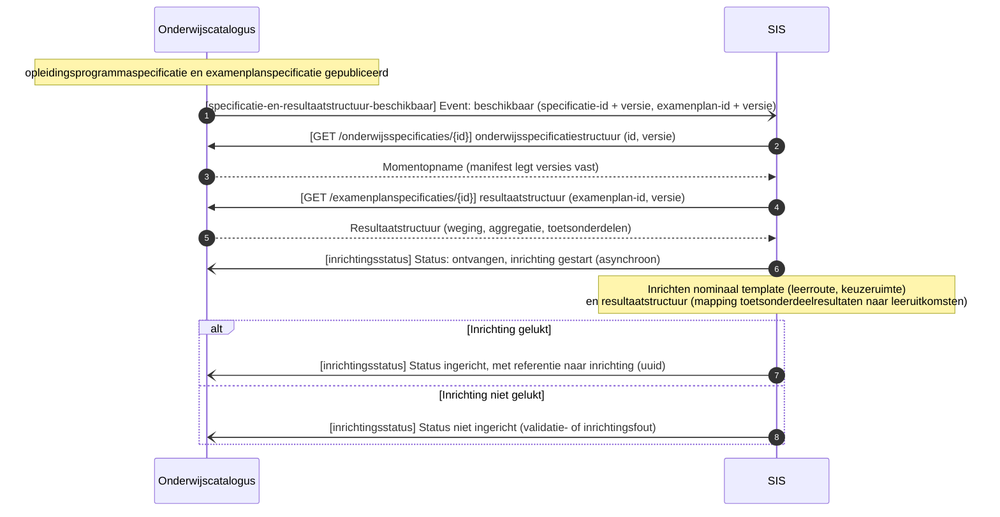
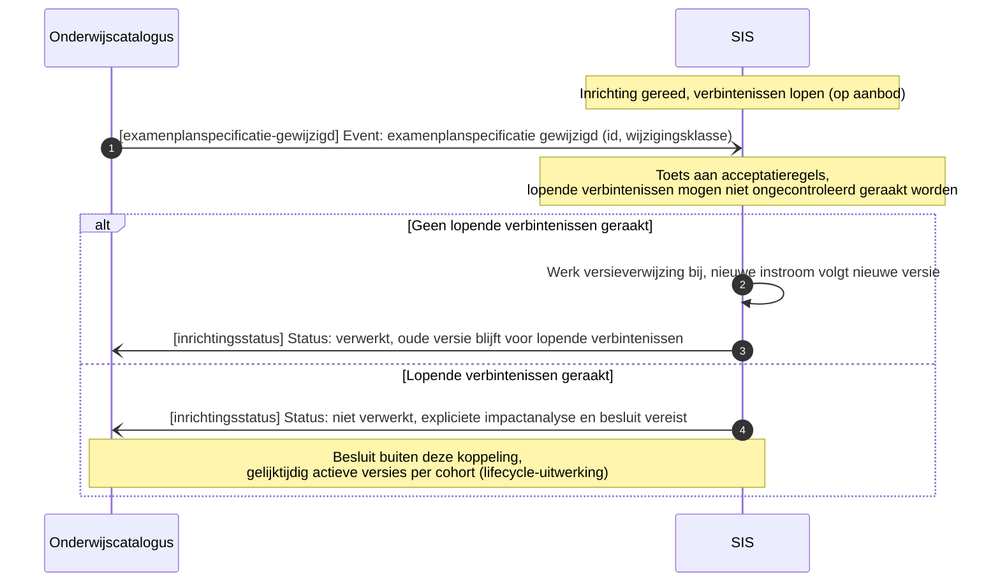

# Onderwijscatalogus naar studentinformatiesysteem

De koppeling tussen de onderwijscatalogus en het studentinformatiesysteem: welke informatie erover beweegt, in welke volgorde, en welk bericht dat draagt, met de sequentiediagrammen erbij. De functionele eisen die het proces aan deze koppeling stelt staan als vertrekpunt in de eerste tabel; het interactieoverzicht legt per interactie het bericht, het patroon en de foutafhandeling vast, en de endpoints staan bij de [applicatiecomponent](../Applicatiecomponenten/README.md) die ze serveert.

## Plek in de keten

De uitsnede komt uit de informatiestromen-hoofdplaat v1.7 (richtinggevend; de legenda draagt nog "concept"), met deze koppeling gemarkeerd. De koppelvlakken van beide componenten staan bij de [onderwijscatalogus](../Applicatiecomponenten/onderwijscatalogus.md) en het [studentinformatiesysteem](../Applicatiecomponenten/studentinformatiesysteem.md).

## Stories

De stories uit de [requirementsboom](../../Referentiemateriaal/requirementsboom/README.md) die deze koppeling invult, met de berichtstroom die dat doet.

| Story | Ingevuld door |
|---|---|
| [story-0022](../../Referentiemateriaal/requirementsboom/stories.md#story-0022) | [Nominaal template en resultaatstructuur inrichten](#nominaal-template-en-resultaatstructuur-inrichten) |
| [story-0023](../../Referentiemateriaal/requirementsboom/stories.md#story-0023) | [Nominaal template en resultaatstructuur inrichten](#nominaal-template-en-resultaatstructuur-inrichten) |
| [story-0020](../../Referentiemateriaal/requirementsboom/stories.md#story-0020) | [Acceptatietoets bij wijziging examenplan](#acceptatietoets-bij-wijziging-examenplan) |

## Applicatiediensten

Deze koppeling zet de volgende [applicatiediensten](../Applicatiediensten/README.md) in. De tabel legt vast welk component welke dienst implementeert; welke stromen daarover lopen en in welke volgorde bepaalt de koppeling zelf.

| Applicatiedienst | Geïmplementeerd door |
|---|---|
| [onderwijsspecificatiestructuur-aanbieder](../Applicatiediensten/onderwijsspecificatiestructuur-aanbieder.md) | Onderwijscatalogus |
| [onderwijsspecificatiestructuur-afnemer](../Applicatiediensten/onderwijsspecificatiestructuur-afnemer.md) | Studentinformatiesysteem |
| [resultaatstructuur-aanbieder](../Applicatiediensten/resultaatstructuur-aanbieder.md) | Onderwijscatalogus |
| [resultaatstructuur-afnemer](../Applicatiediensten/resultaatstructuur-afnemer.md) | Studentinformatiesysteem |
| [verwerkingsuitkomst-aanbieder](../Applicatiediensten/verwerkingsuitkomst-aanbieder.md) | Studentinformatiesysteem |
| [verwerkingsuitkomst-afnemer](../Applicatiediensten/verwerkingsuitkomst-afnemer.md) | Onderwijscatalogus |

Deze koppeling kent geen afleverabonnement: zolang er geen registratie is vastgelegd, is het afleveradres een inrichtingskeuze tussen beide partijen.

## Interactiepatronen

Deze koppeling zet de volgende [interactiepatronen](../Interactiepatronen/README.md) in.

| Interactiepatroon | Waarvoor in deze koppeling |
|---|---|
| [Event Notification](../Interactiepatronen/event-notification.md) | Melden dat specificatie en resultaatstructuur beschikbaar zijn of zijn gewijzigd, en het ophalen dat daarop volgt |
| [Asynchronous Request-Reply](../Interactiepatronen/asynchronous-request-reply.md) | De inrichtingsstatus terugmelden, met een referentie naar de inrichting |

## Procesbeeld

**Resource-eigenaarschap** ([U3](../uitgangspunten.md#u3-resource-eigenaarschap)): de onderwijscatalogus bezit de specificaties en de resultaatstructuren, het studentinformatiesysteem de verbintenissen, individuele structuren, voortgang en resultaten. **Event notification** ([U4](../uitgangspunten.md#u4-event-notification)): de catalogus meldt, het studentinformatiesysteem haalt op.

Wat het diagram niet toont: het studentinformatiesysteem haalt twee dingen op, de specificatiestructuur en de resultaatstructuur, en richt daarmee het **nominale template** in plus de mapping van welke toetsonderdeelresultaten welke leeruitkomsten afdichten ([ADR 0022](../../Referentiemateriaal/adr/0022-resultaatbegrippen-conform-rosa-koi.md)). Bij een wijziging draagt het event een wijzigingsklasse mee. Voor het examenplan gelden daarbij de strengste acceptatieregels: lopende verbintenissen mogen niet ongecontroleerd geraakt worden.

## Berichtstromen

## Nominaal template en resultaatstructuur inrichten

Doel: een gepubliceerde specificatie en examenplanspecificatie omzetten in een ingericht nominaal template en resultaatstructuur bij het studentinformatiesysteem. Trigger: onderwijsspecificatie en examenplanspecificatie krijgen status `gepubliceerd`. Initiator: Onderwijscatalogus.

| Versie | Interactiepatronen | Applicatiediensten |
|---|---|---|
| 1.0 | [Event Notification](../Interactiepatronen/event-notification.md), [Asynchronous Request-Reply](../Interactiepatronen/asynchronous-request-reply.md) | [onderwijsspecificatiestructuur-afnemer](../Applicatiediensten/onderwijsspecificatiestructuur-afnemer.md), [onderwijsspecificatiestructuur-aanbieder](../Applicatiediensten/onderwijsspecificatiestructuur-aanbieder.md), [resultaatstructuur-aanbieder](../Applicatiediensten/resultaatstructuur-aanbieder.md), [verwerkingsuitkomst-afnemer](../Applicatiediensten/verwerkingsuitkomst-afnemer.md) |

Endpoints:

- [webhook `specificatie-en-resultaatstructuur-beschikbaar`](../Applicatiediensten/onderwijsspecificatiestructuur-afnemer.md)
- [`GET /onderwijsspecificaties/{id}`](../Applicatiediensten/onderwijsspecificatiestructuur-aanbieder.md)
- [`GET /examenplanspecificaties/{id}`](../Applicatiediensten/resultaatstructuur-aanbieder.md)
- [webhook `inrichtingsstatus`](../Applicatiediensten/verwerkingsuitkomst-afnemer.md)

## Acceptatietoets bij wijziging examenplan

Doel: lopende verbintenissen beschermen tegen een examenplanwijziging die er ongecontroleerd doorheen breekt. Trigger: examenplanspecificatie wijzigt terwijl er al verbintenissen lopen. Initiator: Onderwijscatalogus.

| Versie | Interactiepatronen | Applicatiediensten |
|---|---|---|
| 1.0 | [Event Notification](../Interactiepatronen/event-notification.md), [Asynchronous Request-Reply](../Interactiepatronen/asynchronous-request-reply.md) | [resultaatstructuur-afnemer](../Applicatiediensten/resultaatstructuur-afnemer.md), [verwerkingsuitkomst-afnemer](../Applicatiediensten/verwerkingsuitkomst-afnemer.md) |

Endpoints:

- [webhook `examenplanspecificatie-gewijzigd`](../Applicatiediensten/resultaatstructuur-afnemer.md)
- [webhook `inrichtingsstatus`](../Applicatiediensten/verwerkingsuitkomst-afnemer.md)

