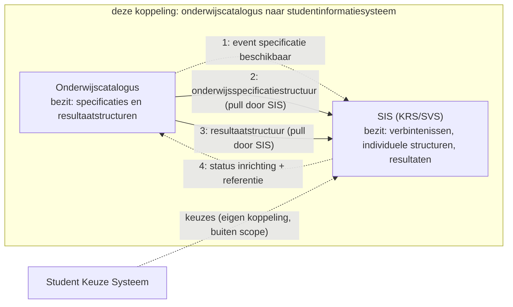
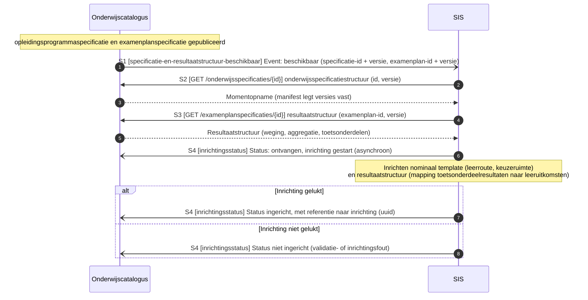
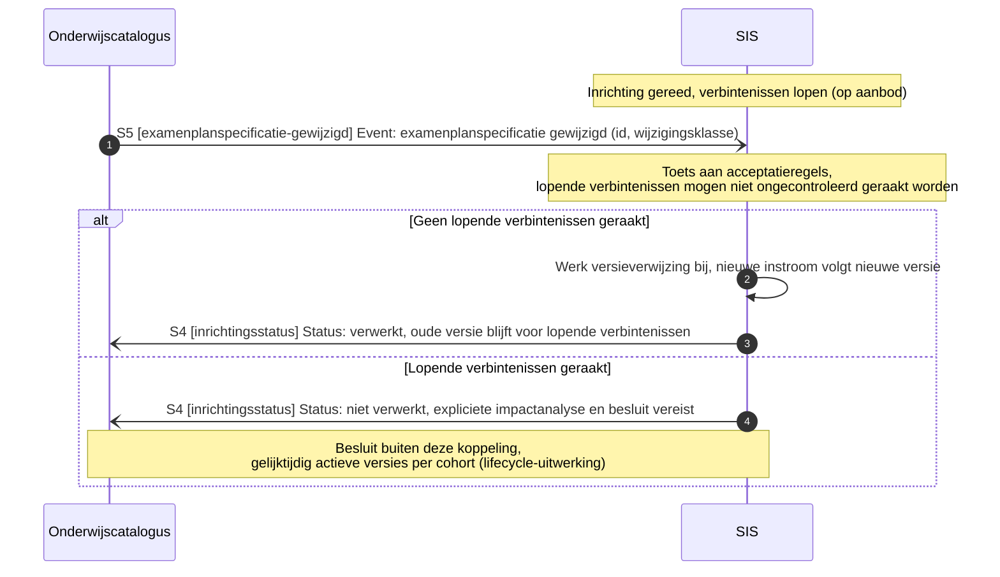

# Onderwijscatalogus naar studentinformatiesysteem

De koppeling tussen de onderwijscatalogus en het studentinformatiesysteem: welke informatie erover beweegt, in welke volgorde, en welk bericht dat draagt, met de sequentiediagrammen erbij. De functionele eisen die het proces aan deze koppeling stelt staan als vertrekpunt in de eerste tabel; het interactieoverzicht legt per interactie het bericht, het patroon en de foutafhandeling vast, en de endpoints staan bij de [applicatiecomponent](../Applicatiecomponenten/README.md) die ze serveert.

## Plek in de keten

De uitsnede komt uit de informatiestromen-hoofdplaat v1.7 (richtinggevend; de legenda draagt nog "concept"), met deze koppeling gemarkeerd. De koppelvlakken van beide componenten staan bij de [onderwijscatalogus](../Applicatiecomponenten/onderwijscatalogus.md) en het [studentinformatiesysteem](../Applicatiecomponenten/studentinformatiesysteem.md).

## Stories

De stories uit de [requirementsboom](../../Referentiemateriaal/requirementsboom/README.md) die deze koppeling invult, met de berichtstroom die dat doet.

| Story | Ingevuld door |
|---|---|
| [story-0022](../../Referentiemateriaal/requirementsboom/stories.md#story-0022) | [Nominaal template en resultaatstructuur inrichten](#nominaal-template-en-resultaatstructuur-inrichten) |
| [story-0023](../../Referentiemateriaal/requirementsboom/stories.md#story-0023) | [Nominaal template en resultaatstructuur inrichten](#nominaal-template-en-resultaatstructuur-inrichten) |
| [story-0020](../../Referentiemateriaal/requirementsboom/stories.md#story-0020) | [Acceptatietoets bij wijziging examenplan](#acceptatietoets-bij-wijziging-examenplan) |

## Applicatiediensten

Deze koppeling is de optelsom van de [applicatiediensten](../Applicatiediensten/README.md) in de tabel.

| Applicatiedienst | Geïmplementeerd door |
|---|---|
| [onderwijsspecificatiestructuur-aanbieder](../Applicatiediensten/onderwijsspecificatiestructuur-aanbieder.md) | Onderwijscatalogus |
| [onderwijsspecificatiestructuur-afnemer](../Applicatiediensten/onderwijsspecificatiestructuur-afnemer.md) | Studentinformatiesysteem |
| [resultaatstructuur-aanbieder](../Applicatiediensten/resultaatstructuur-aanbieder.md) | Onderwijscatalogus |
| [resultaatstructuur-afnemer](../Applicatiediensten/resultaatstructuur-afnemer.md) | Studentinformatiesysteem |
| [verwerkingsuitkomst-aanbieder](../Applicatiediensten/verwerkingsuitkomst-aanbieder.md) | Studentinformatiesysteem |
| [verwerkingsuitkomst-afnemer](../Applicatiediensten/verwerkingsuitkomst-afnemer.md) | Onderwijscatalogus |

Deze koppeling kent geen afleverabonnement: zolang er geen registratie is vastgelegd, is het afleveradres een inrichtingskeuze tussen beide partijen.

## Interactiepatronen

Deze koppeling zet de volgende [interactiepatronen](../Interactiepatronen/README.md) in. Het interactieoverzicht noemt per interactie welk patroon geldt.

| Interactiepatroon | Waarvoor in deze koppeling | Interacties |
|---|---|---|
| [Event Notification](../Interactiepatronen/event-notification.md) | Melden dat specificatie en resultaatstructuur beschikbaar zijn of zijn gewijzigd, en het ophalen dat daarop volgt | S1, S2, S3, S5 |
| [Asynchronous Request-Reply](../Interactiepatronen/asynchronous-request-reply.md) | De inrichtingsstatus terugmelden, met een referentie naar de inrichting | S4 |

## Procesbeeld

**Resource-eigenaarschap** ([U3](../uitgangspunten.md#u3-resource-eigenaarschap)): de onderwijscatalogus bezit de specificaties en de resultaatstructuren, het studentinformatiesysteem de verbintenissen, individuele structuren, voortgang en resultaten. **Event notification** ([U4](../uitgangspunten.md#u4-event-notification)): de catalogus meldt, het studentinformatiesysteem haalt op.

Wat het diagram niet toont: het studentinformatiesysteem haalt twee dingen op, de specificatiestructuur en de resultaatstructuur, en richt daarmee het **nominale template** in plus de mapping van welke toetsonderdeelresultaten welke leeruitkomsten afdichten ([ADR 0022](../../Referentiemateriaal/adr/0022-resultaatbegrippen-conform-rosa-koi.md)). Bij een wijziging draagt het event een wijzigingsklasse mee. Voor het examenplan gelden daarbij de strengste acceptatieregels: lopende verbintenissen mogen niet ongecontroleerd geraakt worden.

## Interactieoverzicht

De interacties op deze koppeling, met per interactie het messaging-patroon, in dezelfde patroontaal als de koppeling met planning ([Enterprise Integration Patterns, Messaging](https://www.enterpriseintegrationpatterns.com/patterns/messaging/)).
Wat hier wordt vastgelegd is het **bericht**, niet het **kanaal**: hoe het bericht bij de ontvanger komt is een inrichtingskeuze van instelling en leverancier, binnen de vier eigenschappen die [ADR 0018](../../Referentiemateriaal/adr/0018-enterprise-messaging-patronen-voor-betrouwbare-koppelvlakken.md) eist. Zie [uitgangspunt U5](../uitgangspunten.md#u5-bericht-versus-kanaal).

| # | Interactie | Initiator | Patroon | Synchroniciteit | Gedrag bij dubbele ontvangst | Foutafhandeling |
|---|---|---|---|---|---|---|
| S1 | Specificatie en resultaatstructuur beschikbaar melden | OC | [Event Notification](../Interactiepatronen/event-notification.md) (id + versie) | Asynchroon | Geen effect: event-id ([Idempotent Receiver](https://www.enterpriseintegrationpatterns.com/patterns/messaging/IdempotentReceiver.html)) | [Guaranteed Delivery](https://www.enterpriseintegrationpatterns.com/patterns/messaging/GuaranteedDelivery.html); [Dead Letter Channel](https://www.enterpriseintegrationpatterns.com/patterns/messaging/DeadLetterChannel.html) |
| S2 | Onderwijsspecificatiestructuur of delta ophalen | SIS | [Event Notification](../Interactiepatronen/event-notification.md) (GET, alleen-lezen) | Synchroon | Geen effect (alleen-lezen) | HTTP-foutcodes, client bepaalt retry |
| S3 | Resultaatstructuur ophalen | SIS | [Event Notification](../Interactiepatronen/event-notification.md) (GET, alleen-lezen) | Synchroon | Geen effect (alleen-lezen) | HTTP-foutcodes |
| S4 | Inrichtingsstatus melden, met referentie naar de inrichting | SIS | [Asynchronous Request-Reply](../Interactiepatronen/asynchronous-request-reply.md) (status: ontvangen/gestart, afgekeurd, ingericht, niet ingericht) | Asynchroon | Geen effect: status-id | Retry met backoff, daarna [Dead Letter Channel](https://www.enterpriseintegrationpatterns.com/patterns/messaging/DeadLetterChannel.html) |
| S5 | Wijziging specificatie of resultaatstructuur melden | OC | [Event Notification](../Interactiepatronen/event-notification.md) (object-id, oude en nieuwe versie, wijzigingsklasse) | Asynchroon | Geen effect: event-id | [Guaranteed Delivery](https://www.enterpriseintegrationpatterns.com/patterns/messaging/GuaranteedDelivery.html); [Dead Letter Channel](https://www.enterpriseintegrationpatterns.com/patterns/messaging/DeadLetterChannel.html) |

## Berichtstromen

| Berichtstroom | Patroon | Doel | Trigger | Initiator | Interacties | Endpoints | Sequentiediagram |
|---|---|---|---|---|---|---|---|
| Nominaal template en resultaatstructuur inrichten | [Event Notification](../Interactiepatronen/event-notification.md), [Asynchronous Request-Reply](../Interactiepatronen/asynchronous-request-reply.md) | Een gepubliceerde specificatie en examenplanspecificatie omzetten in een ingericht nominaal template en resultaatstructuur bij het studentinformatiesysteem | Onderwijsspecificatie en examenplanspecificatie krijgen status `gepubliceerd` | Onderwijscatalogus | S1, S2, S3, S4 | webhook `specificatie-en-resultaatstructuur-beschikbaar`; `GET /onderwijsspecificaties/{id}`; `GET /examenplanspecificaties/{id}`; webhook `inrichtingsstatus` | [hieronder](#nominaal-template-en-resultaatstructuur-inrichten) |
| Acceptatietoets bij wijziging examenplan | [Event Notification](../Interactiepatronen/event-notification.md), [Asynchronous Request-Reply](../Interactiepatronen/asynchronous-request-reply.md) | Lopende verbintenissen beschermen tegen een examenplanwijziging die er ongecontroleerd doorheen breekt | Examenplanspecificatie wijzigt terwijl er al verbintenissen lopen | Onderwijscatalogus | S5 | webhook `examenplanspecificatie-gewijzigd`; webhook `inrichtingsstatus` | [hieronder](#acceptatietoets-bij-wijziging-examenplan) |

## Nominaal template en resultaatstructuur inrichten

Doel: een gepubliceerde specificatie en examenplanspecificatie omzetten in een ingericht nominaal template en resultaatstructuur bij het studentinformatiesysteem. Trigger: onderwijsspecificatie en examenplanspecificatie krijgen status `gepubliceerd`. Initiator: Onderwijscatalogus. Interacties: S1, S2, S3, S4.

Endpoints:

- [webhook `specificatie-en-resultaatstructuur-beschikbaar` (S1)](../Applicatiediensten/onderwijsspecificatiestructuur-afnemer.md)
- [`GET /onderwijsspecificaties/{id}` (S2)](../Applicatiediensten/onderwijsspecificatiestructuur-aanbieder.md)
- [`GET /examenplanspecificaties/{id}` (S3)](../Applicatiediensten/resultaatstructuur-aanbieder.md)
- [webhook `inrichtingsstatus` (S4)](../Applicatiediensten/verwerkingsuitkomst-afnemer.md)

## Acceptatietoets bij wijziging examenplan

Doel: lopende verbintenissen beschermen tegen een examenplanwijziging die er ongecontroleerd doorheen breekt. Trigger: examenplanspecificatie wijzigt terwijl er al verbintenissen lopen. Initiator: Onderwijscatalogus. Interacties: S5.

Endpoints:

- [webhook `examenplanspecificatie-gewijzigd` (S5)](../Applicatiediensten/resultaatstructuur-afnemer.md)
- [webhook `inrichtingsstatus` (S4)](../Applicatiediensten/verwerkingsuitkomst-afnemer.md)

