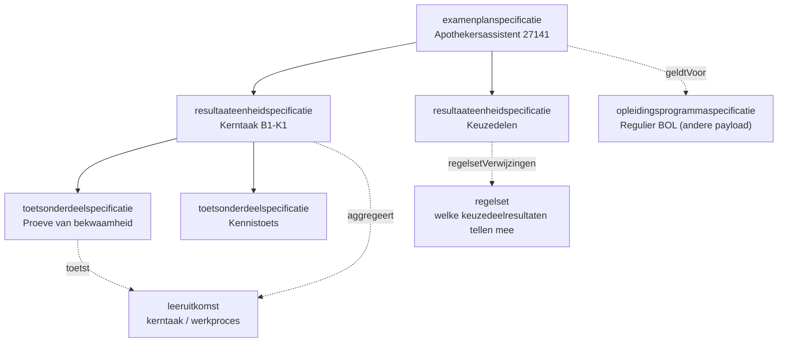

# Resultaatstructuur en examenplan als JSON-payload

## Inhoudsopgave

1. [Inleiding](#1-inleiding) (aanleiding, context, doel, scope)
2. [Payload](#2-payload)
3. [Toelichting bij de keuzes](#3-toelichting-bij-de-keuzes)

## 1. Inleiding

### 1.1 Aanleiding en context

**Aanleiding.** Bij het uitwerken van de koppeling naar het studentinformatiesysteem bleek dat onderwijsresultaten niet aan de onderwijsspecificatie hangen maar aan een **tweede boom**: de resultaatstructuur, met het examenplan als wortel. Die twee bomen werden tot dan toe door elkaar gebruikt, terwijl ze een verschillende eigenaar en een verschillend wijzigingsritme hebben. Dit document scheidt ze en legt vast hoe ze via leeruitkomsten aan elkaar hangen.

De onderwijsspecificatie beschrijft wat een student leert. De **resultaatstructuur** beschrijft hoe dat wordt getoetst en gewogen richting het diploma. Het zijn twee aparte bomen die via **leeruitkomsten** aan elkaar hangen: de leeruitkomst is de sleutel waarop een onderwijsresultaat wordt behaald ([ADR 0022](../../../Referentiemateriaal/adr/0022-resultaatbegrippen-conform-rosa-koi.md)).

De `examenplanspecificatie`, in de praktijk de onderwijs- en examenregeling, is de wortel van die tweede boom. De memo "Onderwijs PDCA-cyclus" van Niels leverde hiervoor de invoer: het examenplan kent de zwaarste eisen omdat het een contractuele afspraak met de student is, en beschrijft de summatieve resultaatstructuur met scope, relatie tot kerntaken, wegingen en formules.

Scenario is leerroute 1, persona [Jochem](https://github.com/Npuls-OKx/meta/blob/d47bb0c74ec899a4384d06331692f74b9bd1db58/architecture/docs/specificatie/okx-oeapi-consumer-profiel/doc/persona_jochem.md), opleiding Apothekersassistent (kwalificatie 27141). Ketenoverzicht, begrippen en afkortingen: de [instap in de README](../../README.md#context).

De resultaatstructuur gebruikt dezelfde specificatiefamilie als de onderwijsspecificatie. Drie typen:

| Conceptniveau (`specificatieType`) | Rol | OEAPI-mapping (indicatief) |
|---|---|---|
| `examenplanspecificatie` | Wortel (OER). Scope, aggregatie richting diploma | (geen 1:1 OEAPI-object) |
| `resultaateenheidspecificatie` | Groepering, meestal per kerntaak. Draagt weging en aggregatie | (geen 1:1 OEAPI-object) |
| `toetsonderdeelspecificatie` | Blad. Het concrete toets- of examenonderdeel | TestComponent |

Koppeling met de onderwijsspecificatie:

- Semantisch via `leeruitkomstId`, dezelfde sleutel als in de onderwijsspecificatie-payload. Daarnaast staat de leesbare aanduiding (`type` en `code` uit het kwalificatiekader) als `leeruitkomst` in het object, zodat een mens de structuur kan lezen zonder uuid's op te zoeken.
- Administratief via `geldtVoor` (de `opleidingsprogrammaspecificatie` waarvoor het examenplan geldt) en optioneel `beoordeelt` (directe verwijzing naar de beoordeelde specificatie).



### 1.2 Doel

Dit document beantwoordt drie vragen:

- Hoe leg je een examenplan vast als structuur die een systeem kan uitrekenen, in plaats van als tekstdocument?
- Hoe hangt die structuur aan de onderwijsspecificatie, zodat duidelijk is welke toets welke leeruitkomst afdicht?
- Hoe blijven keuzedelen mogelijk die nog niet bestonden toen het examenplan werd vastgesteld?

Geslaagd wanneer een studentinformatiesysteem de resultaatstructuur kan inrichten en de aggregatie richting diploma kan berekenen zonder aanvullende uitleg.

De payload is indicatief en onderbouwend, geen voorschrift aan de sector ([uitgangspunt U1](../../uitgangspunten.md#u1-indicatief-en-onderbouwend-niet-voorschrijvend)).

### 1.3 Scope

In scope is de **summatieve** resultaatstructuur voor leerroute 1, gekoppeld aan de `opleidingsprogrammaspecificatie` Regulier BOL uit de onderwijsspecificatie-payload: examenplan, resultaateenheden, toetsonderdelen, wegingen en aggregatie.

Drie afbakeningen die anders verwarring geven:

- **Uitvoering en beoordeling** (afname, behaalde resultaten, examendossier) horen bij het examendomein OKE, niet hier.
- **Generieke onderdelen** (taal, rekenen, burgerschap, Engels) kennen een eigen wettelijk regime en zitten niet in deze payload.
- De **waarden zijn indicatief**; het echte examenplan stelt de instelling vast.

Al het overige valt buiten dit document.

## 2. Payload

Het bijbehorende [informatiemodel](../../Datamodelschema's/README.md#resultaatstructuur-en-examenplan) en de [voorbeeldpayload](../../Datamodelschema's/README.md#voorbeeld-resultaatstructuur-en-examenplan) staan bij de datamodelschema's.

Het schema legt de exacte vorm vast. Het is **alfa en indicatief** en verandert mee zolang de payload nog niet vaststaat. Velden die identiek zijn aan de onderwijsspecificatie-payload dragen daar dezelfde betekenis.

```json
{
  "$schema": "https://json-schema.org/draft/2020-12/schema",
  "$id": "https://okx.npuls.nl/schema/resultaatstructuur/alfa",
  "title": "Resultaatstructuur en examenplan",
  "$comment": "Alfa en indicatief. Deze vorm onderbouwt welke velden het koppelvlak nodig heeft en kan wijzigen zolang de payload niet is vastgesteld.",
  "type": "object",
  "required": ["onderwijsspecificaties"],
  "properties": {
    "onderwijsspecificaties": {
      "type": "array",
      "items": {
        "type": "object",
        "required": ["id", "specificatieType", "versie", "bovenliggendSpecificatieId", "naam", "status", "resultaatmodel"],
        "properties": {
          "id": { "type": "string", "format": "uuid" },
          "specificatieType": { "enum": ["examenplanspecificatie", "resultaateenheidspecificatie", "toetsonderdeelspecificatie"] },
          "versie": { "type": "string", "pattern": "^\\d+\\.\\d+\\.\\d+$" },
          "bovenliggendSpecificatieId": { "type": ["string", "null"], "format": "uuid" },
          "naam": { "type": "string" },
          "omschrijving": { "type": "string" },
          "status": { "type": "string" },
          "geldigVanaf": { "type": "string", "format": "date" },
          "geldigTot": { "type": ["string", "null"], "format": "date" },
          "geldtVoor": { "type": "string", "format": "uuid", "$comment": "de opleidingsprogrammaspecificatie waarvoor dit examenplan geldt" },
          "beoordeelt": { "type": "string", "format": "uuid", "$comment": "de specificatie die deze resultaateenheid beoordeelt" },
          "leeruitkomstId": { "type": "string", "format": "uuid", "$comment": "verwijst naar de leeruitkomst in de onderwijsspecificatie-payload; dit is de sleutel waarop het onderwijsresultaat wordt behaald (ADR 0022)" },
          "leeruitkomst": {
            "type": "object",
            "$comment": "leesbare aanduiding naast de sleutel; type en code komen uit het kwalificatiekader",
            "required": ["type", "code"],
            "properties": {
              "type": { "type": "string" },
              "code": { "type": "string" }
            }
          },
          "aard": { "enum": ["summatief", "formatief"] },
          "toetsvorm": { "type": "string", "$comment": "open lijst: proeveVanBekwaamheid, kennistoets, praktijkopdracht, portfolio, criteriumgesprek" },
          "aggregatie": { "enum": ["gewogenGemiddelde", "som", "allenVoldoende", "minimaalAantal"] },
          "weging": { "type": "number", "$comment": "relatief binnen de ouder; 0 bij formatief" },
          "verplicht": { "type": "boolean" },
          "resultaatmodel": {
            "type": "object",
            "properties": {
              "schaal": { "type": "string", "$comment": "open lijst: cijfer-1-10, voldoende-onvoldoende, punten" },
              "cesuur": { "type": "number" },
              "decimalen": { "type": "integer" }
            }
          },
          "regelsetVerwijzingen": { "type": "array", "items": { "type": "string", "format": "uuid" } },
          "manifest": {
            "type": "array",
            "items": {
              "type": "object",
              "required": ["specificatieId", "versie", "relatie"],
              "properties": {
                "specificatieId": { "type": "string", "format": "uuid" },
                "versie": { "type": "string" },
                "relatie": { "enum": ["onderdeel", "variant", "referentie"] }
              }
            }
          }
        }
      }
    },
    "regelsets": {
      "type": "array",
      "items": {
        "type": "object",
        "required": ["id", "versie", "naam", "vanToepassingOp", "regels"],
        "properties": {
          "id": { "type": "string", "format": "uuid" },
          "versie": { "type": "string" },
          "naam": { "type": "string" },
          "omschrijving": { "type": "string" },
          "vanToepassingOp": { "type": "string", "format": "uuid" },
          "regels": { "type": "array", "items": { "type": "object" } }
        }
      }
    }
  }
}
```

## 3. Toelichting bij de keuzes

### 3.1 Waarom dezelfde vorm als de onderwijsspecificatie

Zelfde ontwerpkeuze als de onderwijsspecificatie-payload (optie C: recursief plat met een ouder-verwijzing). Concreet:

- **Eén familie, twee schema's.** De resultaatstructuur gebruikt dezelfde envelope (`onderwijsspecificaties`, `regelsets`), dezelfde sleutel- en verwijsconventie (`id`, `bovenliggendSpecificatieId`, `leeruitkomstId`) en dezelfde discriminator `specificatieType`. De verplichte velden verschillen wel: een onderwijsspecificatie draagt altijd `studielast`, een resultaatspecificatie altijd `resultaatmodel`. Daarom staan het hier en in de onderwijsspecificatie-payload als twee schema's. Of die later samengaan tot één schema met voorwaardelijke eisen per `specificatieType` staat als open punt in §4.
- **Weging bovenin, niet in het blad.** Een `resultaateenheidspecificatie` draagt `aggregatie` (hoe onderliggende resultaten samenkomen) en haar eigen `weging` binnen de ouder. Zo staat de rekenregel op het niveau waar hij geldt.
- **Aard expliciet.** `aard` onderscheidt `summatief` (telt mee voor het diploma) van `formatief` (ontwikkelingsgericht, weging 0).
- **Resultaatmodel per niveau.** `resultaatmodel` legt schaal, cesuur en afronding vast, zodat elk systeem dezelfde uitkomst berekent.
- **Regels los van de specificatie.** Dynamische delen (bijvoorbeeld welke keuzedeelresultaten meetellen) staan in een `regelset`, niet in de specificatie. Zelfde principe als bij de regelset-uitwerking. Dit maakt de modulaire resultaatstructuur mogelijk die de memo van Niels vraagt: keuzes kunnen worden ingevuld met onderdelen die nog niet bestonden toen het examenplan werd vastgesteld.
- **Manifest.** Elke specificatie met onderdelen pint de versies daarvan, inclusief de kruisverwijzing naar de `opleidingsprogrammaspecificatie` (`relatie: referentie`).

### 3.2 Lifecycle

Zelfde mechaniek als de onderwijsspecificatie: semver per specificatie, identiteit los van versie, manifest dat onderliggende versies pint, en `geldigVanaf`/`geldigTot` voor gelijktijdig actieve versies. Zie [§3.3 van de onderwijsspecificatie-payload](../gedeeld/payload-onderwijsspecificatie.md#33-lifecycle-versionering-en-manifest) en de [lifecycle-uitwerking](../gedeeld/lifecycle-en-versionering.md).

Eén verschil: de `examenplanspecificatie` heeft de **strengste acceptatieregels**. Het is een contractuele afspraak met de student, dus een wijziging vraagt altijd expliciete impactanalyse en besluitvorming, ook wanneer die technisch niet-brekend lijkt (memo van Niels).
