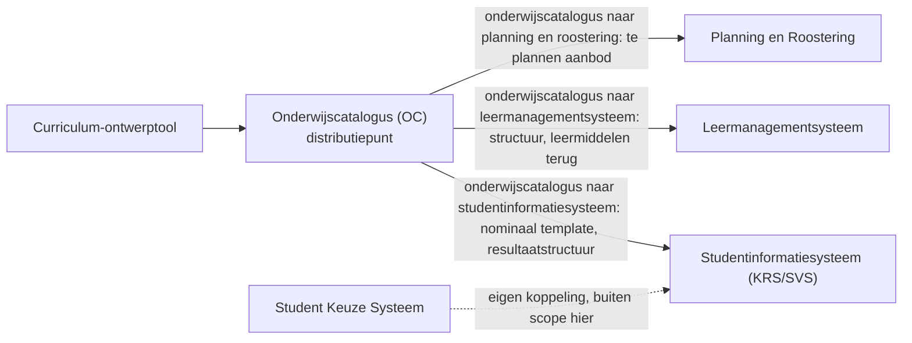

# Koppelvlakspecificaties

Het releasepakket **koppelvlakspecificatie**: de specificaties waarmee een partij een koppelvlak kan bouwen op de standaarden die OKx uitbrengt.

Het pakket is opgebouwd uit **koppelingspecificaties**. Per **koppeling** (gestandaardiseerde informatiestroom tussen twee referentiecomponenten) staat in [`Koppelingspecificaties/`](Koppelingspecificaties/) een eigen map met de koppelingspecificatie en de payload-specificaties voor de data binnen het afgekaderde informatiemodel van die koppeling. Het **koppelvlak** van een component is de verzameling van alle koppelingspecificaties die dat component raken; de koppelvlakspecificatie per component is dus de optelsom van de koppelingen hieronder. Die optelsom staat, per referentiesysteem, in [`Referentiesystemen/`](Referentiesystemen/). Terminologie: [ADR 0021](../Referentiemateriaal/adr/0021-koppeling-versus-koppelvlak-terminologie.md).

## Context

De keten in het kort: een **curriculum-ontwerptool (CO)** levert onderwijsspecificaties aan de **onderwijscatalogus (OC)**. De OC is het distributiepunt; van daaruit lopen drie koppelingen naar de systemen die het onderwijs klaarzetten voor de start van de student.



De afkortingen staan verklaard in de tabel verderop. Actuele architectuurplaat: [OKx hoofdplaat v1.7](https://github.com/Npuls-OKx/meta/blob/d47bb0c74ec899a4384d06331692f74b9bd1db58/architecture/model/informatiestromen%20hoofdplaat%20OKx/1.7/OKx%20hoofdplaat%201.7.jpg) (in het [ArchiMate-model](https://github.com/Npuls-OKx/meta/tree/d47bb0c74ec899a4384d06331692f74b9bd1db58/architecture/model/)). De genummerde interpretatie van de stromen (stroom 1 tot en met 17) staat in het [Projectoverzicht](https://github.com/Npuls-OKx/meta/blob/d47bb0c74ec899a4384d06331692f74b9bd1db58/doc/OKx_Projectoverzicht.md); die tabel is nog gebaseerd op de oudere plaat (v20260317) en wordt met v1.7 verzoend. Het [OEAPI consumer-profiel](https://github.com/Npuls-OKx/meta/blob/d47bb0c74ec899a4384d06331692f74b9bd1db58/architecture/docs/specificatie/okx-oeapi-consumer-profiel/README.md) gebruikt eveneens nog die oudere plaat; leidend voor de architectuur is v1.7.

Kernbegrippen die in elk document terugkomen:

- **Koppeling versus koppelvlak** ([ADR 0021](../Referentiemateriaal/adr/0021-koppeling-versus-koppelvlak-terminologie.md)): een koppeling is de informatiestroom tussen twee componenten; het koppelvlak van een component is de verzameling van al zijn koppelingen.
- **Ankertabel, zes begrippenfamilies**: kader, beoogde leeruitkomst, specificatie, aanbod, verbintenis, resultaat. De leeruitkomst is de sleutel; onderwijsresultaten hangen aan leeruitkomsten. Bron: [consumer-profiel](https://github.com/Npuls-OKx/meta/blob/d47bb0c74ec899a4384d06331692f74b9bd1db58/architecture/docs/specificatie/okx-oeapi-consumer-profiel/README.md), §3.2.6.
- **Notify-then-pull** ([ADR 0020](../Referentiemateriaal/adr/0020-curriculumontwerp-onderwijscatalogus-happy-flow-synchronisatie-en-federatie-adopt-klonen.md)): de bezitter van een resource meldt een dun event met een referentie; de consument haalt de resource op wanneer die hem nodig heeft.
- **Scenario's met persona's**: de documenten werken leerroute 1 (regulier) uit aan de hand van persona Jochem (opleiding Apothekersassistent); leerroute 2 en 3 volgen als verschil. De route en de persona staan volledig in het [kaderscenario leerroute 1 — regulier](../Referentiemateriaal/kaderscenario's/leerroute-1-regulier.md), de kaderstellende basis onder deze specificaties.

### Uitgangspunten

De aannames die voor **alle** documenten in deze map gelden staan eenmaal in [uitgangspunten.md](uitgangspunten.md), genummerd U1 tot en met U10: de doelbinding (indicatief en onderbouwend, niet voorschrijvend), resource-eigenaarschap, notify-then-pull, het onderscheid tussen bericht en kanaal, de semantiek uit de ankertabel, de payloadvorm en sleutelconventie, en de scope- en documentdiscipline. De afzonderlijke documenten noemen een uitgangspunt in één regel en verwijzen erheen, zodat een wijziging in de redenering maar op één plek hoeft.

Kort samengevat: OKx legt de sector niet op hoe een koppeling gerealiseerd moet worden. We beschrijven koppelingen om te ontdekken welke operaties en endpoints nodig zijn; de som ervan levert de koppelvlakspecificatie per component op, met ruimte voor behoeften die nu nog niet uit de scenario's naar voren komen.

Leesvolgorde: eerst deze instap, dan [`Koppelingspecificaties/gedeeld/`](Koppelingspecificaties/gedeeld/) (de centrale onderwijsspecificatie-payload en de lifecycle-uitwerking), dan de koppeling van je interesse.

### Afkortingen en mappen

| Afkorting of map | Betekenis |
|---|---|
| OC | Onderwijscatalogus, het distributiepunt voor onderwijsspecificaties |
| P&R | Planning en roostering (planningssysteem en roostersysteem) |
| LMS | Leermanagementsysteem, de online leeromgeving voor de student |
| SIS | Studentinformatiesysteem, hier de combinatie KRS en SVS |
| KRS | Kernregistratiesysteem studenten (inschrijving) |
| SVS | Studentvolgsysteem (individuele structuur, voortgang, resultaten) |
| SKS | Studentkeuzesysteem, waar de student zijn keuzes maakt |
| CO | Curriculum-ontwerptool, waar onderwijsspecificaties ontstaan |
| Leerroute 1-3 | De Npuls-leerroutes: regulier, temporiseren, en versnellen. Leerroute 1 is de basis, 2 en 3 worden als verschil beschreven |
| SBU | Studiebelastingsuren |
| EC | European Credit, de studiepunt-eenheid van het hoger onderwijs |
| BOL | Beroepsopleidende leerweg (voltijd op school, met stage) |
| BBL | Beroepsbegeleidende leerweg (werken en leren gecombineerd) |
| BPV | Beroepspraktijkvorming, het praktijkdeel van de opleiding |
| SBB | Samenwerkingsorganisatie Beroepsonderwijs Bedrijfsleven, beheerder van het kwalificatiekader |
| NLQF | Nederlands kwalificatieraamwerk, dat een niveau aan een leeruitkomst hangt |
| OER | Onderwijs- en examenregeling, de contractuele afspraak met de student |
| OEAPI | Open Onderwijs API, de sectorstandaard waarop OKx zoveel mogelijk aansluit |
| [`Referentiemateriaal/adr/`](../Referentiemateriaal/adr/) | Decision records: de architectuurbesluiten (ADR's) waarop deze specificaties steunen |

### Wat staat waar

Het pakket bestaat uit vijf delen: deze instap, de [uitgangspunten](uitgangspunten.md) die voor alles gelden, de [auth-standaard](auth-standaard.md) die voor elk endpoint geldt, de koppelingen onder [`Koppelingspecificaties/`](Koppelingspecificaties/), en de [`templates/`](templates/) waarmee je er een nieuwe schrijft.

De koppelingen staan elk in een eigen map:

| Map | Koppeling | Inhoud | Herkomst |
|---|---|---|---|
| [`gedeeld/`](Koppelingspecificaties/gedeeld/) | alle koppelingen | Centrale onderwijsspecificatie-payload en lifecycle-uitwerking | Uitgewerkt vanuit de koppeling met planning |
| [`onderwijscatalogus-planning-en-roostering/`](Koppelingspecificaties/onderwijscatalogus-planning-en-roostering/) | Onderwijscatalogus naar planning en roostering | Koppelingspecificatie, onderwijsaanbod-payload | Werksessie met de eerste schets van deze koppeling |
| [`onderwijscatalogus-studentinformatiesysteem/`](Koppelingspecificaties/onderwijscatalogus-studentinformatiesysteem/) | Onderwijscatalogus naar studentinformatiesysteem | Koppelingspecificatie, resultaatstructuur en examenplan | Afgeleid van het patroon met planning; werksessie volgt |
| [`onderwijscatalogus-leermanagementsysteem/`](Koppelingspecificaties/onderwijscatalogus-leermanagementsysteem/) | Onderwijscatalogus naar leermanagementsysteem | Koppelingspecificatie; leermiddelkoppeling-payload volgt | Afgeleid van het patroon met planning; werksessie volgt |

Gedeelde payload-specificaties staan **éénmaal centraal** in `gedeeld/`. Elke koppelingspecificatie definieert een **gebruiksprofiel**: welke objecten en velden van de centrale payload die koppeling gebruikt. Het studentinformatiesysteem krijgt de volledige leeruitkomst-laag, planning alleen de leeruitkomst-ids als opaque sleutels ([ADR 0023](../Referentiemateriaal/adr/0023-leeruitkomsten-als-opaque-sleutels-in-koppeling-oc-p-en-r.md)), en de leeromgeving de inhoudsvelden. Koppeling-specifieke payloads staan in de koppeling-map.

Leidende prioriteringsvraag: wat moeten deze drie koppelingen uitgewisseld hebben om klaar te zijn voor de start van de student? De documenten dragen geen metadatakop: auteurschap en datums staan in de git-historie, en de aanleiding staat uitgeschreven in de inleiding van elk document.

**Herkomst.** Deze specificaties zijn uitgewerkt in de meta-repository ([`Npuls-OKx/meta`](https://github.com/Npuls-OKx/meta)), waar de kaderstelling ontstaat, en zijn van daaruit als releaseartefact naar deze repository overgebracht. De besluiten waarop ze steunen staan in [`Referentiemateriaal/`](../Referentiemateriaal/). Verwijzingen naar achtergronddocumenten die niet zijn meeverhuisd, wijzen gepind naar meta-commit [`d47bb0c`](https://github.com/Npuls-OKx/meta/tree/d47bb0c74ec899a4384d06331692f74b9bd1db58), zodat ze niet met de bron meebewegen.

### Voor schrijvers

Begin bij de [uitgangspunten](uitgangspunten.md) en kopieer daarna het passende template:

- [template-koppelingspecificatie.md](templates/template-koppelingspecificatie.md) voor een informatiestroom tussen twee componenten;
- [template-payload-specificatie.md](templates/template-payload-specificatie.md) voor de JSON die over zo'n koppeling gaat.

Beide templates bevatten instructies tussen HTML-commentaar die je verwijdert als het onderdeel af is. Werk je met een AI-agent, dan hanteert de skill [`okx-koppelingspecificatie`](https://github.com/Npuls-OKx/meta/blob/d47bb0c74ec899a4384d06331692f74b9bd1db58/.agents/skills/okx-koppelingspecificatie/SKILL.md) dezelfde opbouw.

Elke payload-specificatie draagt een **JSON Schema** (alfa en indicatief) plus ASCII-bomen: een **schemaboom** die de vorm leesbaar toont, en per platte array een **instantieboom** die de verwijzingen oplost en de hiërarchie zichtbaar maakt die in de JSON verborgen blijft. Beide worden gegenereerd; draai vóór een commit:

```bash
python3 scripts/json-tree.py --check <document>.md   # faalt bij drift, dode verwijzingen of schemafouten
python3 scripts/json-tree.py --write <document>.md   # bomen bijwerken
```
