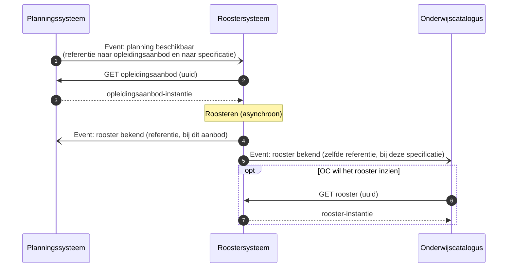

# Roostersysteem (R)

Het roostersysteem plaatst het geplande onderwijs in tijd en ruimte: het maakt van het `opleidingsaanbod` een rooster met momenten, docenten en zalen. Het bezit het rooster, waar het planningssysteem het aanbod bezit en de catalogus de specificaties ([U3](../uitgangspunten.md#u3-resource-eigenaarschap)).

Dit pakket specificeert geen koppeling met het roostersysteem, en levert er dus nog geen endpoints voor op. Het systeem komt alleen als context voor, in het diagram hieronder: het planningssysteem meldt dat de planning beschikbaar is, het roostersysteem haalt het aanbod op en meldt het rooster terug aan zowel planning als catalogus. Dat is hetzelfde patroon van referentie plus event dat de uitgewerkte koppelingen dragen, opgenomen om de consistente lijn te tonen, niet als vastgelegde interactie.

