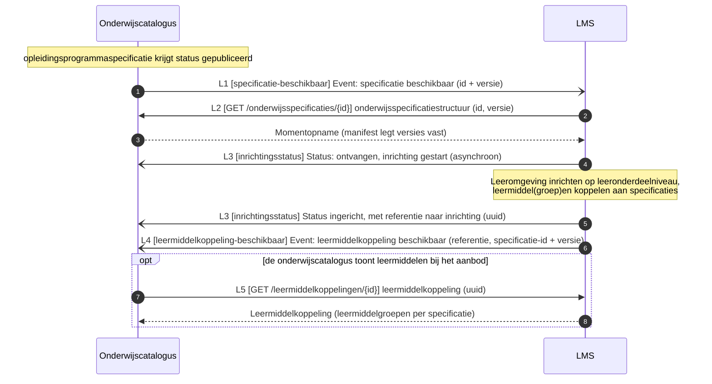
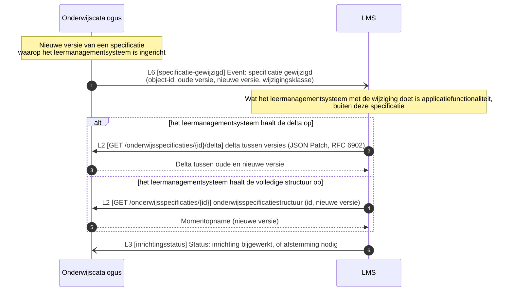

# Technisch proces: onderwijscatalogus naar leermanagementsysteem

Het technisch proces van deze koppeling: de systeem-naar-systeemberichten tussen de onderwijscatalogus en het leermanagementsysteem, met de sequentiediagrammen. Doel: per proces laten zien welk berichtenpatroon het technisch implementeert en wat het oplevert, zonder de koppelingspecificatie te herhalen. De sequentiediagrammen zijn overgenomen uit [§5](../Koppelingspecificaties/onderwijscatalogus-leermanagementsysteem/onderwijscatalogus-leermanagementsysteem.md#5-sequentiediagrammen) van de koppelingspecificatie; voor het bericht, het patroon en de foutafhandeling per interactie blijft [§3](../Koppelingspecificaties/onderwijscatalogus-leermanagementsysteem/onderwijscatalogus-leermanagementsysteem.md#3-interactieoverzicht) leidend, voor de endpoint(s) die het bericht draagt [§7](../Koppelingspecificaties/onderwijscatalogus-leermanagementsysteem/onderwijscatalogus-leermanagementsysteem.md#7-endpointbeschrijvingen-rest). Elk technisch proces hieronder draagt zo de keten functionele eis → technisch proces → endpoint(s). Anders dan bij de koppeling met planning kent deze koppeling nog geen interacties voor een statusmelding los van de versie, reconciliatie na een gemist event, of abonnementenbeheer; die volgen pas zodra deze koppeling in een werksessie met de betrokken partijen is uitgewerkt ([§9](../Koppelingspecificaties/onderwijscatalogus-leermanagementsysteem/onderwijscatalogus-leermanagementsysteem.md#9-open-punten)). Het functionele proces dat deze koppeling ondersteunt (het inrichten van de leeromgeving en het ontsluiten van leermiddelen) valt buiten dit document; de functionele eisen die dat proces aan deze koppeling stelt staan als vertrekpunt in de eerste tabel.

## Functionele eisen

| # | Functionele eis | Technisch proces |
|---|---|---|
| FR1 | De onderwijscatalogus moet het leermanagementsysteem kunnen laten weten dat een specificatie beschikbaar is om de leeromgeving op in te richten, en het leermanagementsysteem moet daarop een inrichtingsstatus met referentie kunnen terugleveren | [Notify-then-pull: leeromgeving inrichten en leermiddelkoppeling melden](#notify-then-pull-leeromgeving-inrichten-en-leermiddelkoppeling-melden) |
| FR2 | Het leermanagementsysteem moet een leermiddelkoppeling die het heeft gelegd aan de onderwijscatalogus kunnen melden, zodat die de leermiddelen bij het aanbod kan tonen | [Notify-then-pull: leeromgeving inrichten en leermiddelkoppeling melden](#notify-then-pull-leeromgeving-inrichten-en-leermiddelkoppeling-melden) |
| FR3 | Het leermanagementsysteem moet zijn inrichting kunnen bijwerken wanneer een specificatie wijzigt, zonder verplicht de volledige structuur opnieuw te ontvangen | [Notify-then-pull: inrichting bijwerken na wijziging](#notify-then-pull-inrichting-bijwerken-na-wijziging) |

## Technische processen

| Technisch proces | Doel | Trigger | Initiator | Interacties (§3) | Endpoints (§7) | Sequentiediagram |
|---|---|---|---|---|---|---|
| Notify-then-pull: leeromgeving inrichten en leermiddelkoppeling melden | Een gepubliceerde specificatie omzetten in een ingerichte leeromgeving, met een leermiddelkoppeling terug naar de onderwijscatalogus | Onderwijsspecificatie krijgt status `gepubliceerd` | Onderwijscatalogus | L1, L2, L3, L4, (L5) | webhook `specificatie-beschikbaar`; `GET /onderwijsspecificaties/{id}`; webhook `inrichtingsstatus`; webhook `leermiddelkoppeling-beschikbaar`; (`GET /leermiddelkoppelingen/{id}`) | [hieronder](#notify-then-pull-leeromgeving-inrichten-en-leermiddelkoppeling-melden) |
| Notify-then-pull: inrichting bijwerken na wijziging | Een bestaande inrichting laten volgen op een nieuwe specificatieversie, met delta of volledige structuur als keuze voor het leermanagementsysteem | Nieuwe versie van een specificatie waarop het leermanagementsysteem is ingericht | Onderwijscatalogus | L2, L3, L6 | `GET /onderwijsspecificaties/{id}/delta` of `GET /onderwijsspecificaties/{id}`; webhook `inrichtingsstatus`; webhook `specificatie-gewijzigd` | [hieronder](#notify-then-pull-inrichting-bijwerken-na-wijziging) |

## Notify-then-pull: leeromgeving inrichten en leermiddelkoppeling melden

Doel: een gepubliceerde specificatie omzetten in een ingerichte leeromgeving, met een leermiddelkoppeling terug naar de onderwijscatalogus. Trigger: onderwijsspecificatie krijgt status `gepubliceerd`. Initiator: Onderwijscatalogus. Interacties: L1, L2, L3, L4, (L5).

Endpoints:

- [webhook `specificatie-beschikbaar` (L1)](../Koppelingspecificaties/onderwijscatalogus-leermanagementsysteem/onderwijscatalogus-leermanagementsysteem.md#7-endpointbeschrijvingen-rest)
- [`GET /onderwijsspecificaties/{id}` (L2)](../Koppelingspecificaties/onderwijscatalogus-leermanagementsysteem/onderwijscatalogus-leermanagementsysteem.md#7-endpointbeschrijvingen-rest)
- [webhook `inrichtingsstatus` (L3)](../Koppelingspecificaties/onderwijscatalogus-leermanagementsysteem/onderwijscatalogus-leermanagementsysteem.md#7-endpointbeschrijvingen-rest)
- [webhook `leermiddelkoppeling-beschikbaar` (L4)](../Koppelingspecificaties/onderwijscatalogus-leermanagementsysteem/onderwijscatalogus-leermanagementsysteem.md#7-endpointbeschrijvingen-rest)
- [`GET /leermiddelkoppelingen/{id}` (L5, optioneel)](../Koppelingspecificaties/onderwijscatalogus-leermanagementsysteem/onderwijscatalogus-leermanagementsysteem.md#7-endpointbeschrijvingen-rest)

## Notify-then-pull: inrichting bijwerken na wijziging

Doel: een bestaande inrichting laten volgen op een nieuwe specificatieversie, met delta of volledige structuur als keuze voor het leermanagementsysteem. Trigger: nieuwe versie van een specificatie waarop het leermanagementsysteem is ingericht. Initiator: Onderwijscatalogus. Interacties: L2, L3, L6.

Endpoints:

- [`GET /onderwijsspecificaties/{id}/delta` of `GET /onderwijsspecificaties/{id}` (L2)](../Koppelingspecificaties/onderwijscatalogus-leermanagementsysteem/onderwijscatalogus-leermanagementsysteem.md#7-endpointbeschrijvingen-rest)
- [webhook `inrichtingsstatus` (L3)](../Koppelingspecificaties/onderwijscatalogus-leermanagementsysteem/onderwijscatalogus-leermanagementsysteem.md#7-endpointbeschrijvingen-rest)
- [webhook `specificatie-gewijzigd` (L6)](../Koppelingspecificaties/onderwijscatalogus-leermanagementsysteem/onderwijscatalogus-leermanagementsysteem.md#7-endpointbeschrijvingen-rest)

