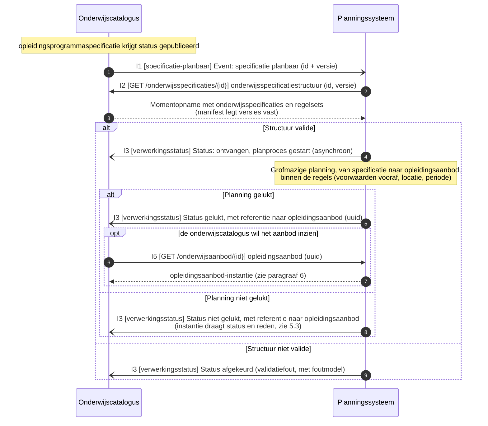
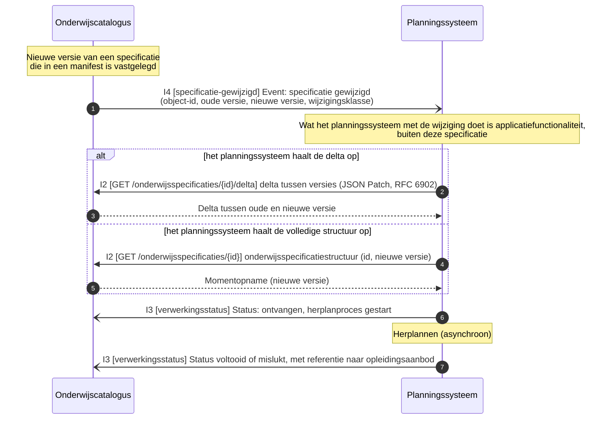
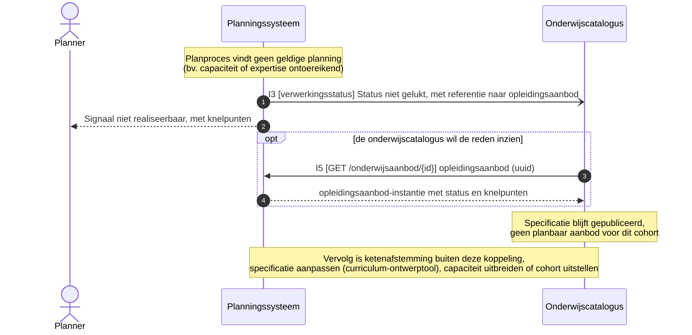
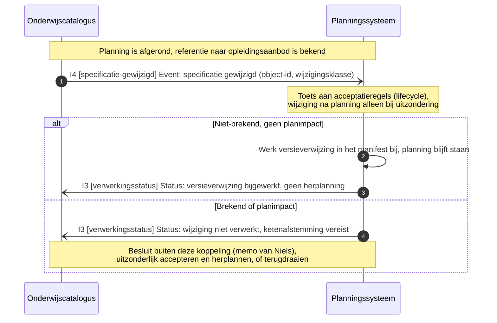
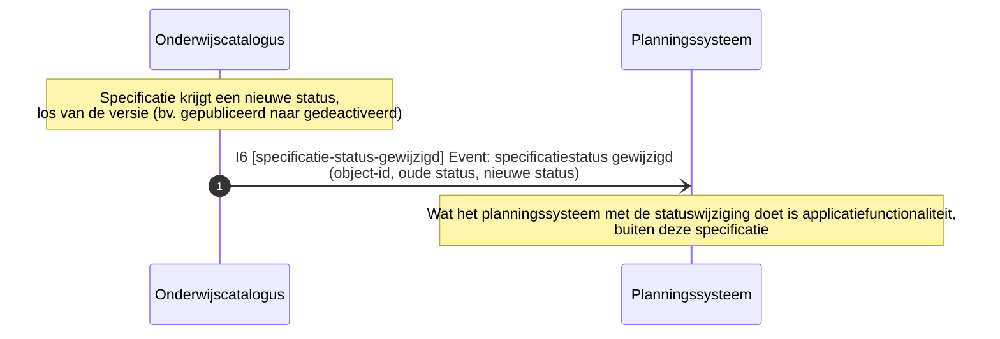
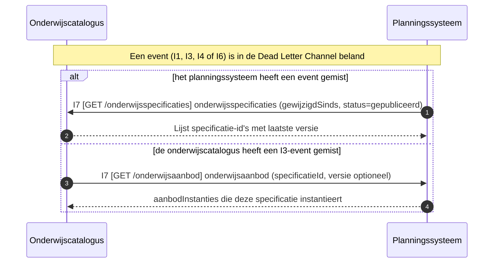
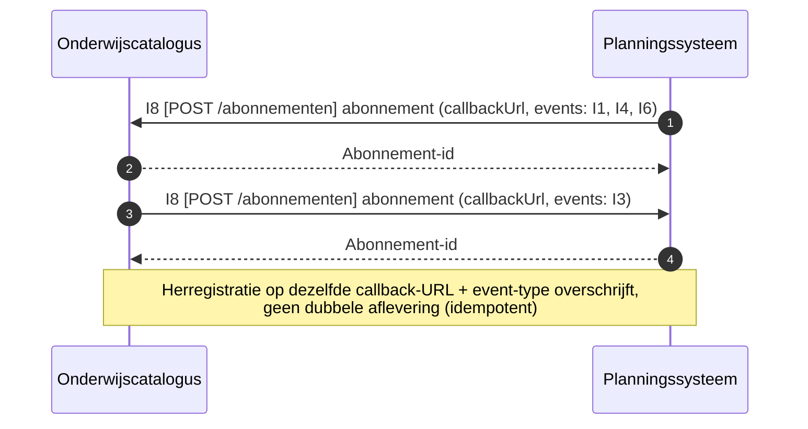

# Technisch proces: onderwijscatalogus naar planning en roostering

Het technisch proces van deze koppeling: de systeem-naar-systeemberichten tussen de onderwijscatalogus en het planningssysteem, met de sequentiediagrammen. Doel: per proces laten zien welk berichtenpatroon het technisch implementeert en wat het oplevert, zonder de koppelingspecificatie te herhalen. Voor I1 tot en met I5 zijn de sequentiediagrammen overgenomen uit [§5](../Koppelingspecificaties/onderwijscatalogus-planning-en-roostering/onderwijscatalogus-planning-en-roostering.md#5-sequentiediagrammen) van de koppelingspecificatie; I6 tot en met I8 hebben daar geen eigen diagram (ze volgen het patroon van resp. I4 en I2/I5) en zijn hier opgebouwd uit [§3](../Koppelingspecificaties/onderwijscatalogus-planning-en-roostering/onderwijscatalogus-planning-en-roostering.md#3-interactieoverzicht) en [§7](../Koppelingspecificaties/onderwijscatalogus-planning-en-roostering/onderwijscatalogus-planning-en-roostering.md#7-endpointbeschrijvingen-rest). Voor het bericht, het patroon en de foutafhandeling per interactie blijft §3 leidend, voor de endpoint(s) die het bericht draagt §7. Elk technisch proces hieronder draagt zo de keten functionele eis → technisch proces → endpoint(s). Het functionele proces dat deze koppeling ondersteunt (onderwijsontwikkeling en planvorming) valt buiten dit document; de functionele eisen die dat proces aan deze koppeling stelt staan als vertrekpunt in de eerste tabel.

## Functionele eisen

| # | Functionele eis | Technisch proces |
|---|---|---|
| FR1 | De onderwijscatalogus moet het planningssysteem kunnen laten weten dat een specificatie gereed is om te plannen, en het planningssysteem moet daarop een opleidingsaanbod met referentie kunnen terugleveren | [Notify-then-pull: opleidingsaanbod aanmaken](#notify-then-pull-opleidingsaanbod-aanmaken) |
| FR2 | Het planningssysteem moet de planning kunnen bijwerken wanneer een specificatie wijzigt, zonder verplicht de volledige structuur opnieuw te ontvangen | [Notify-then-pull: opleidingsaanbod herplannen](#notify-then-pull-opleidingsaanbod-herplannen) |
| FR3 | De onderwijscatalogus moet kunnen weten wanneer een cohort niet planbaar is, inclusief de reden | [Asynchrone statusmelding: planning niet gelukt](#asynchrone-statusmelding-planning-niet-gelukt) |
| FR4 | Een afgeronde planning moet beschermd zijn tegen een specificatiewijziging die er ongecontroleerd doorheen breekt | [Acceptatietoets bij late wijziging](#acceptatietoets-bij-late-wijziging) |
| FR5 | De onderwijscatalogus moet een statuswijziging kunnen melden die niet aan een nieuwe versie hangt, los van het wijzigingsproces | [Asynchrone statusmelding: specificatiestatus gewijzigd](#asynchrone-statusmelding-specificatiestatus-gewijzigd) |
| FR6 | Beide partijen moeten na een gemist event de informatie alsnog kunnen ophalen | [Reconciliatie na gemist event](#reconciliatie-na-gemist-event) |
| FR7 | Beide partijen moeten een afleveradres kunnen vastleggen voordat events afgeleverd worden | [Abonnement registreren](#abonnement-registreren) |

## Technische processen

| Technisch proces | Doel | Trigger | Initiator | Interacties (§3) | Endpoints (§7) | Sequentiediagram |
|---|---|---|---|---|---|---|
| Notify-then-pull: opleidingsaanbod aanmaken | Een gepubliceerde specificatie omzetten in een planbaar `opleidingsaanbod`, met een referentie terug naar de onderwijscatalogus | Onderwijsspecificatie krijgt status `gepubliceerd` | Onderwijscatalogus | I1, I2, I3, (I5) | webhook `specificatie-planbaar`; `GET /onderwijsspecificaties/{id}`; webhook `verwerkingsstatus`; (`GET /onderwijsaanbod/{id}`) | [hieronder](#notify-then-pull-opleidingsaanbod-aanmaken) |
| Notify-then-pull: opleidingsaanbod herplannen | Een lopende planning laten volgen op een nieuwe specificatieversie, met delta of volledige structuur als keuze voor de ontvanger | Nieuwe versie van een specificatie die al in een manifest is vastgelegd | Onderwijscatalogus | I2, I3, I4 | `GET /onderwijsspecificaties/{id}/delta` of `GET /onderwijsspecificaties/{id}`; webhook `verwerkingsstatus`; webhook `specificatie-gewijzigd` | [hieronder](#notify-then-pull-opleidingsaanbod-herplannen) |
| Asynchrone statusmelding: planning niet gelukt | De onderwijscatalogus in kennis stellen dat een cohort niet planbaar is, met referentie en knelpunten, zonder de aanroep te blokkeren | Planproces bij het planningssysteem vindt geen geldige planning | Planningssysteem | I3, (I5) | webhook `verwerkingsstatus`; (`GET /onderwijsaanbod/{id}`) | [hieronder](#asynchrone-statusmelding-planning-niet-gelukt) |
| Acceptatietoets bij late wijziging | Een afgeronde planning beschermen tegen een wijziging die er ongecontroleerd doorheen breekt | Specificatiewijziging terwijl de planning al is afgerond | Onderwijscatalogus | I3, I4 | webhook `specificatie-gewijzigd`; webhook `verwerkingsstatus` | [hieronder](#acceptatietoets-bij-late-wijziging) |
| Asynchrone statusmelding: specificatiestatus gewijzigd | De onderwijscatalogus een statuswijziging laten melden die los staat van een nieuwe versie, zodat het planningssysteem zijn afgeleide status kan bijwerken zonder herplanronde | Specificatie krijgt een nieuwe status buiten een versiewijziging om (bv. `gepubliceerd` naar `gedeactiveerd`) | Onderwijscatalogus | I6 | webhook `specificatie-status-gewijzigd` | [hieronder](#asynchrone-statusmelding-specificatiestatus-gewijzigd) |
| Reconciliatie na gemist event | De gemiste informatie via een gewone opvraag herstellen na een event dat in de Dead Letter Channel is beland | Een I1-, I3-, I4- of I6-event is niet aangekomen | Onderwijscatalogus of Planningssysteem | I7 | `GET /onderwijsspecificaties` (op OC); `GET /onderwijsaanbod` (op P) | [hieronder](#reconciliatie-na-gemist-event) |
| Abonnement registreren | Elke partij een callback-URL laten vastleggen voor de events die zij van de ander ontvangt, als voorwaarde voor I1, I3, I4 en I6 | Inrichting van de koppeling, of wijziging van de callback-URL | Onderwijscatalogus en Planningssysteem | I8 | `POST /abonnementen` (op OC en op P) | [hieronder](#abonnement-registreren) |

## Notify-then-pull: opleidingsaanbod aanmaken

Doel: een gepubliceerde specificatie omzetten in een planbaar `opleidingsaanbod`, met een referentie terug naar de onderwijscatalogus. Trigger: onderwijsspecificatie krijgt status `gepubliceerd`. Initiator: Onderwijscatalogus. Interacties: I1, I2, I3, (I5).

Endpoints:

- [webhook `specificatie-planbaar` (I1)](../Koppelingspecificaties/onderwijscatalogus-planning-en-roostering/onderwijscatalogus-planning-en-roostering.md#7-endpointbeschrijvingen-rest)
- [`GET /onderwijsspecificaties/{id}` (I2)](../Koppelingspecificaties/onderwijscatalogus-planning-en-roostering/onderwijscatalogus-planning-en-roostering.md#7-endpointbeschrijvingen-rest)
- [webhook `verwerkingsstatus` (I3)](../Koppelingspecificaties/onderwijscatalogus-planning-en-roostering/onderwijscatalogus-planning-en-roostering.md#7-endpointbeschrijvingen-rest)
- [`GET /onderwijsaanbod/{id}` (I5, optioneel)](../Koppelingspecificaties/onderwijscatalogus-planning-en-roostering/onderwijscatalogus-planning-en-roostering.md#7-endpointbeschrijvingen-rest)

## Notify-then-pull: opleidingsaanbod herplannen

Doel: een lopende planning laten volgen op een nieuwe specificatieversie, met delta of volledige structuur als keuze voor de ontvanger. Trigger: nieuwe versie van een specificatie die al in een manifest is vastgelegd. Initiator: Onderwijscatalogus. Interacties: I2, I3, I4.

Endpoints:

- [`GET /onderwijsspecificaties/{id}/delta` of `GET /onderwijsspecificaties/{id}` (I2)](../Koppelingspecificaties/onderwijscatalogus-planning-en-roostering/onderwijscatalogus-planning-en-roostering.md#7-endpointbeschrijvingen-rest)
- [webhook `verwerkingsstatus` (I3)](../Koppelingspecificaties/onderwijscatalogus-planning-en-roostering/onderwijscatalogus-planning-en-roostering.md#7-endpointbeschrijvingen-rest)
- [webhook `specificatie-gewijzigd` (I4)](../Koppelingspecificaties/onderwijscatalogus-planning-en-roostering/onderwijscatalogus-planning-en-roostering.md#7-endpointbeschrijvingen-rest)

## Asynchrone statusmelding: planning niet gelukt

Doel: de onderwijscatalogus in kennis stellen dat een cohort niet planbaar is, met referentie en knelpunten, zonder de aanroep te blokkeren. Trigger: planproces bij het planningssysteem vindt geen geldige planning. Initiator: Planningssysteem. Interacties: I3, (I5).

Endpoints:

- [webhook `verwerkingsstatus` (I3)](../Koppelingspecificaties/onderwijscatalogus-planning-en-roostering/onderwijscatalogus-planning-en-roostering.md#7-endpointbeschrijvingen-rest)
- [`GET /onderwijsaanbod/{id}` (I5, optioneel)](../Koppelingspecificaties/onderwijscatalogus-planning-en-roostering/onderwijscatalogus-planning-en-roostering.md#7-endpointbeschrijvingen-rest)

## Acceptatietoets bij late wijziging

Doel: een afgeronde planning beschermen tegen een wijziging die er ongecontroleerd doorheen breekt. Trigger: specificatiewijziging terwijl de planning al is afgerond. Initiator: Onderwijscatalogus. Interacties: I3, I4.

Endpoints:

- [webhook `specificatie-gewijzigd` (I4)](../Koppelingspecificaties/onderwijscatalogus-planning-en-roostering/onderwijscatalogus-planning-en-roostering.md#7-endpointbeschrijvingen-rest)
- [webhook `verwerkingsstatus` (I3)](../Koppelingspecificaties/onderwijscatalogus-planning-en-roostering/onderwijscatalogus-planning-en-roostering.md#7-endpointbeschrijvingen-rest)

## Asynchrone statusmelding: specificatiestatus gewijzigd

Doel: de onderwijscatalogus een statuswijziging laten melden die los staat van een nieuwe versie, zodat het planningssysteem zijn afgeleide status kan bijwerken zonder herplanronde. Trigger: specificatie krijgt een nieuwe status buiten een versiewijziging om (bv. `gepubliceerd` naar `gedeactiveerd`, [lifecycle-uitwerking §3](../Koppelingspecificaties/gedeeld/lifecycle-en-versionering.md#3-versioneringsmechaniek)). Initiator: Onderwijscatalogus. Interacties: I6.

Endpoints:

- [webhook `specificatie-status-gewijzigd` (I6)](../Koppelingspecificaties/onderwijscatalogus-planning-en-roostering/onderwijscatalogus-planning-en-roostering.md#7-endpointbeschrijvingen-rest)

Geen apart sequentiediagram in de koppelingspecificatie; I6 spiegelt daar het patroon van I4. Opgebouwd uit de interactiebeschrijving in §3.

## Reconciliatie na gemist event

Doel: de gemiste informatie via een gewone opvraag herstellen na een event dat in de Dead Letter Channel is beland, zonder op een herhaalde aflevering te wachten. Trigger: een I1-, I3-, I4- of I6-event is niet aangekomen. Initiator: Onderwijscatalogus of Planningssysteem. Interacties: I7.

Endpoints:

- [`GET /onderwijsspecificaties` (op OC)](../Koppelingspecificaties/onderwijscatalogus-planning-en-roostering/onderwijscatalogus-planning-en-roostering.md#7-endpointbeschrijvingen-rest)
- [`GET /onderwijsaanbod` (op P)](../Koppelingspecificaties/onderwijscatalogus-planning-en-roostering/onderwijscatalogus-planning-en-roostering.md#7-endpointbeschrijvingen-rest)

Geen apart sequentiediagram in de koppelingspecificatie; I7 spiegelt daar het patroon van I2/I5. Opgebouwd uit de interactiebeschrijving in §3 en de endpoints in §7.

## Abonnement registreren

Doel: elke partij een callback-URL laten vastleggen voor de events die zij van de ander ontvangt, als voorwaarde voor de event-gedreven interacties (I1, I3, I4, I6). Trigger: inrichting van de koppeling, of wijziging van de callback-URL. Initiator: Onderwijscatalogus en Planningssysteem (over en weer, elk voor de events die de ander van hem ontvangt). Interacties: I8.

Endpoints:

- [`POST /abonnementen` (op OC en op P)](../Koppelingspecificaties/onderwijscatalogus-planning-en-roostering/onderwijscatalogus-planning-en-roostering.md#7-endpointbeschrijvingen-rest)

Geen apart sequentiediagram in de koppelingspecificatie; I8 spiegelt daar het patroon van I2/I5. Opgebouwd uit de endpoints in §7.

