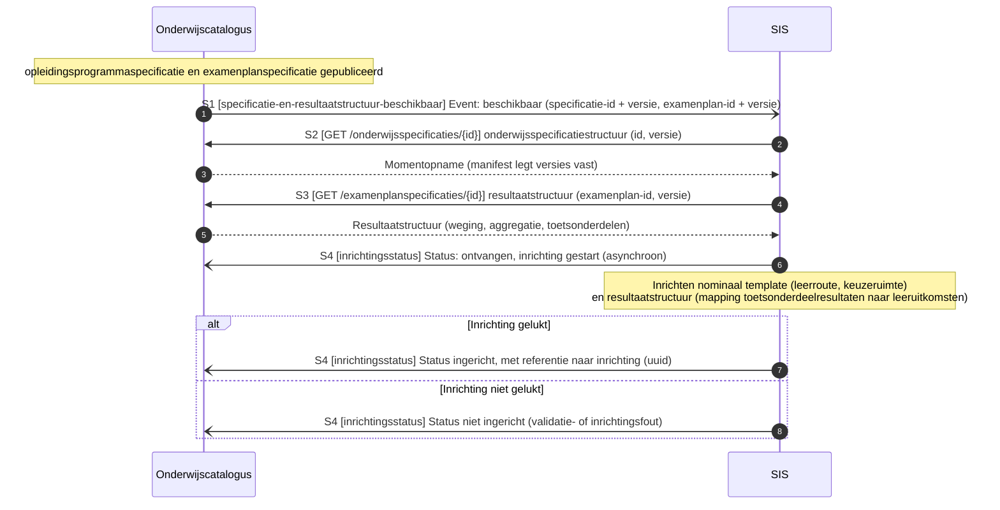
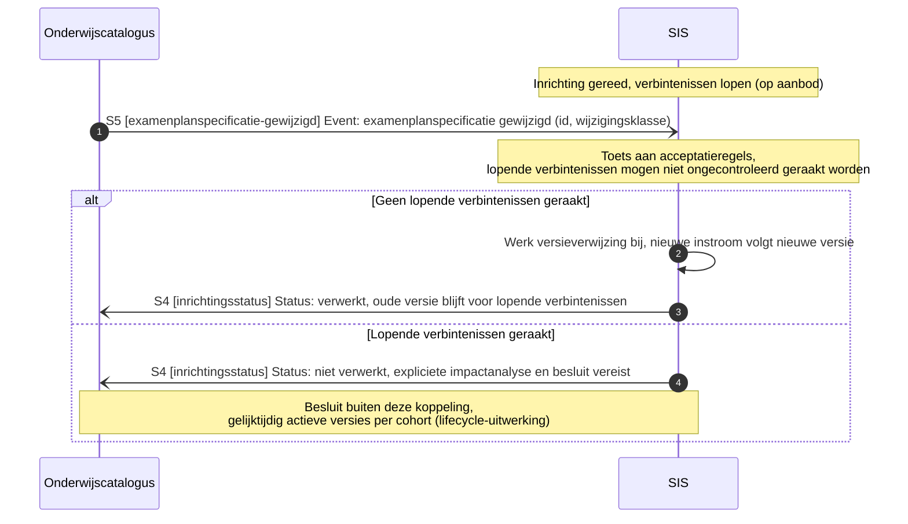

# Technisch proces: onderwijscatalogus naar studentinformatiesysteem

Het technisch proces van deze koppeling: de systeem-naar-systeemberichten tussen de onderwijscatalogus en het studentinformatiesysteem, met de sequentiediagrammen. Doel: per proces laten zien welk berichtenpatroon het technisch implementeert en wat het oplevert, zonder de koppelingspecificatie te herhalen. De sequentiediagrammen zijn overgenomen uit [§5](../Koppelingspecificaties/onderwijscatalogus-studentinformatiesysteem/onderwijscatalogus-studentinformatiesysteem.md#5-sequentiediagrammen) van de koppelingspecificatie; voor het bericht, het patroon en de foutafhandeling per interactie blijft [§3](../Koppelingspecificaties/onderwijscatalogus-studentinformatiesysteem/onderwijscatalogus-studentinformatiesysteem.md#3-interactieoverzicht) leidend, voor de endpoint(s) die het bericht draagt [§7](../Koppelingspecificaties/onderwijscatalogus-studentinformatiesysteem/onderwijscatalogus-studentinformatiesysteem.md#7-endpointbeschrijvingen-rest). Elk technisch proces hieronder draagt zo de keten functionele eis → technisch proces → endpoint(s). Anders dan bij de koppeling met planning kent deze koppeling nog geen interacties voor een statusmelding los van de versie, reconciliatie na een gemist event, of abonnementenbeheer; die volgen pas zodra deze koppeling in een werksessie met de betrokken partijen is uitgewerkt ([§9](../Koppelingspecificaties/onderwijscatalogus-studentinformatiesysteem/onderwijscatalogus-studentinformatiesysteem.md#9-open-punten)). Het functionele proces dat deze koppeling ondersteunt (verbintenis, individuele structuur en resultaatregistratie) valt buiten dit document; de functionele eisen die dat proces aan deze koppeling stelt staan als vertrekpunt in de eerste tabel.

## Functionele eisen

| # | Functionele eis | Technisch proces |
|---|---|---|
| FR1 | De onderwijscatalogus moet het studentinformatiesysteem kunnen laten weten dat een specificatie en resultaatstructuur beschikbaar zijn om het nominale template en de resultaatstructuur op in te richten, en het studentinformatiesysteem moet daarop een inrichtingsstatus met referentie kunnen terugleveren | [Notify-then-pull: nominaal template en resultaatstructuur inrichten](#notify-then-pull-nominaal-template-en-resultaatstructuur-inrichten) |
| FR2 | Een ingerichte resultaatstructuur waarop al verbintenissen lopen moet beschermd zijn tegen een examenplanwijziging die er ongecontroleerd doorheen breekt | [Acceptatietoets bij wijziging examenplan](#acceptatietoets-bij-wijziging-examenplan) |

## Technische processen

| Technisch proces | Doel | Trigger | Initiator | Interacties (§3) | Endpoints (§7) | Sequentiediagram |
|---|---|---|---|---|---|---|
| Notify-then-pull: nominaal template en resultaatstructuur inrichten | Een gepubliceerde specificatie en examenplanspecificatie omzetten in een ingericht nominaal template en resultaatstructuur bij het studentinformatiesysteem | Onderwijsspecificatie en examenplanspecificatie krijgen status `gepubliceerd` | Onderwijscatalogus | S1, S2, S3, S4 | webhook `specificatie-en-resultaatstructuur-beschikbaar`; `GET /onderwijsspecificaties/{id}`; `GET /examenplanspecificaties/{id}`; webhook `inrichtingsstatus` | [hieronder](#notify-then-pull-nominaal-template-en-resultaatstructuur-inrichten) |
| Acceptatietoets bij wijziging examenplan | Lopende verbintenissen beschermen tegen een examenplanwijziging die er ongecontroleerd doorheen breekt | Examenplanspecificatie wijzigt terwijl er al verbintenissen lopen | Onderwijscatalogus | S5 | webhook `examenplanspecificatie-gewijzigd`; webhook `inrichtingsstatus` | [hieronder](#acceptatietoets-bij-wijziging-examenplan) |

## Notify-then-pull: nominaal template en resultaatstructuur inrichten

Doel: een gepubliceerde specificatie en examenplanspecificatie omzetten in een ingericht nominaal template en resultaatstructuur bij het studentinformatiesysteem. Trigger: onderwijsspecificatie en examenplanspecificatie krijgen status `gepubliceerd`. Initiator: Onderwijscatalogus. Interacties: S1, S2, S3, S4.

Endpoints:

- [webhook `specificatie-en-resultaatstructuur-beschikbaar` (S1)](../Koppelingspecificaties/onderwijscatalogus-studentinformatiesysteem/onderwijscatalogus-studentinformatiesysteem.md#7-endpointbeschrijvingen-rest)
- [`GET /onderwijsspecificaties/{id}` (S2)](../Koppelingspecificaties/onderwijscatalogus-studentinformatiesysteem/onderwijscatalogus-studentinformatiesysteem.md#7-endpointbeschrijvingen-rest)
- [`GET /examenplanspecificaties/{id}` (S3)](../Koppelingspecificaties/onderwijscatalogus-studentinformatiesysteem/onderwijscatalogus-studentinformatiesysteem.md#7-endpointbeschrijvingen-rest)
- [webhook `inrichtingsstatus` (S4)](../Koppelingspecificaties/onderwijscatalogus-studentinformatiesysteem/onderwijscatalogus-studentinformatiesysteem.md#7-endpointbeschrijvingen-rest)

## Acceptatietoets bij wijziging examenplan

Doel: lopende verbintenissen beschermen tegen een examenplanwijziging die er ongecontroleerd doorheen breekt. Trigger: examenplanspecificatie wijzigt terwijl er al verbintenissen lopen. Initiator: Onderwijscatalogus. Interacties: S5.

Endpoints:

- [webhook `examenplanspecificatie-gewijzigd` (S5)](../Koppelingspecificaties/onderwijscatalogus-studentinformatiesysteem/onderwijscatalogus-studentinformatiesysteem.md#7-endpointbeschrijvingen-rest)
- [webhook `inrichtingsstatus` (S4)](../Koppelingspecificaties/onderwijscatalogus-studentinformatiesysteem/onderwijscatalogus-studentinformatiesysteem.md#7-endpointbeschrijvingen-rest)

