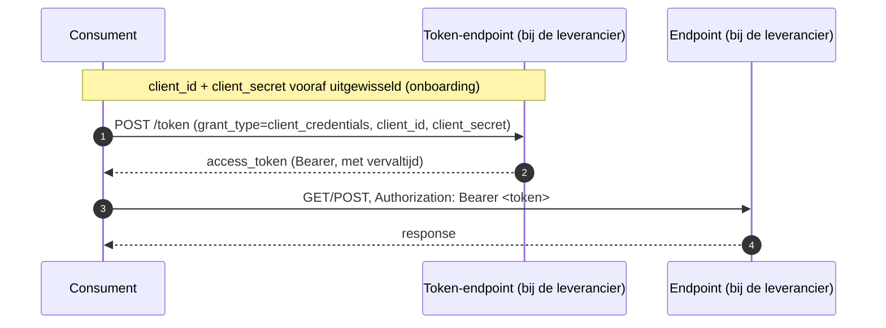

# Auth-standaard voor koppelvlakken

**Aanleiding.** Geen enkele koppelingspecificatie in dit pakket legt vast hoe een consument zich bij een endpoint authenticeert. Zonder een gedeelde standaard verzint elke koppeling dat opnieuw, en twee leveranciers die beide "aan de koppelingspecificatie voldoen" kunnen alsnog niet verbinden omdat de een OAuth2 verwacht en de ander een API-sleutel. Dit document legt één mechanisme vast voor alle koppelvlakken in dit pakket.

Dit is, net als de uitgangspunten, een repo-brede keuze, geen keuze per koppeling: elke koppelingspecificatie verwijst hierheen in plaats van authenticatie opnieuw te beschrijven.

## Mechanisme: OAuth 2.0 Client Credentials

Consument en leverancier wisselen vooraf, buiten de koppeling om, een `client_id` en `client_secret` uit (onboarding/registratie, bilateraal per koppeling). Een consument vraagt daarmee een access token op bij de token-endpoint van het systeem dat hij aanroept, via de **Client Credentials grant** ([RFC 6749 §4.4](https://www.rfc-editor.org/rfc/rfc6749#section-4.4)): geen gebruiker in de lus, puur systeem-naar-systeem.

Elk systeem dat endpoints serveert is verantwoordelijk voor zijn eigen token-endpoint (of een eigen identity provider erachter); er is geen centrale OKx-brede autorisatieserver. Dat sluit aan bij [U3, resource-eigenaarschap](uitgangspunten.md#u3-resource-eigenaarschap): wie de resource bezit, bezit ook de toegang ertoe.

## Toepassing op webhook-aflevering

Een webhook-event is zelf ook een HTTP-aanroep, van de bezitter naar de callback-URL die de ontvanger bij het registreren van zijn abonnement heeft opgegeven. Dezelfde regel geldt dan omgekeerd: de afzender authenticeert zich bij het afleveren met een Bearer-token, opgehaald bij de token-endpoint van de ontvanger, met de credentials die bij de abonnementregistratie zijn afgesproken.

## Wat dit niet regelt

- **Scopes en autorisatieclaims** binnen het token: welke velden of operaties een token precies mag, is nog niet uitgewerkt.
- **Tokenlevensduur en vernieuwing**: Client Credentials kent geen refresh token; een consument vraagt bij verval opnieuw een token op. De concrete geldigheidsduur is een inrichtingskeuze van de leverancier.
- **Sleutelbeheer**: rotatie en intrekking van `client_secret` zijn een operationele afspraak tussen de partijen, geen onderdeel van deze standaard.
- **Gebruikersauthenticatie**: alle koppelingen in dit pakket zijn systeem-naar-systeem; een leerling of medewerker komt nergens in de lus voor. Delegated auth (authorization code grant) valt daarmee buiten scope.

## Gerelateerde uitwerkingen

- [Uitgangspunten voor koppelingspecificaties](uitgangspunten.md), met name [U3 (resource-eigenaarschap)](uitgangspunten.md#u3-resource-eigenaarschap) en [U5 (bericht versus kanaal)](uitgangspunten.md#u5-bericht-versus-kanaal).
- [ADR 0018](../Referentiemateriaal/adr/0018-enterprise-messaging-patronen-voor-betrouwbare-koppelvlakken.md): de vier eigenschappen die het afleveringskanaal moet leveren, aanvullend op authenticatie.
- [RFC 6749, The OAuth 2.0 Authorization Framework, §4.4 Client Credentials Grant](https://www.rfc-editor.org/rfc/rfc6749#section-4.4).
- [RFC 6750, Bearer Token Usage](https://www.rfc-editor.org/rfc/rfc6750).
