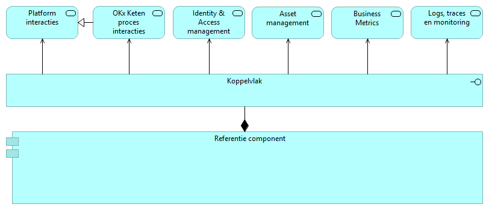
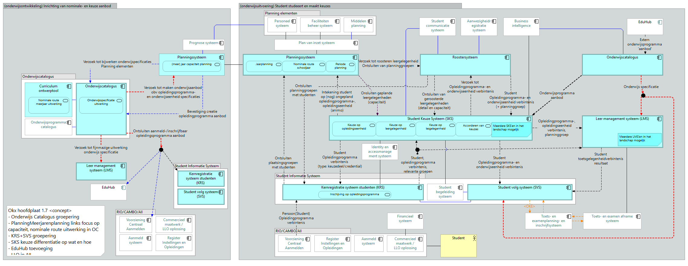

# Inleiding

Dit document specificeert het koppelvlak van elk systeem dat deelneemt aan de uitwisseling van onderwijsspecificaties. Het beschrijft per systeem welke endpoints en events dat systeem aanbiedt, per koppeling welk berichtverkeer daaroverheen gaat en in welke volgorde, en welke vorm de uitgewisselde gegevens hebben.

Waar de eisen vandaan komen, staat in de [requirementsboom](../Referentiemateriaal/requirementsboom/README.md): van de opdracht via epics en features naar stories, en vandaar naar de functionele eisen bij de interactiepatronen. Voorschrijven doet het document niet; de [uitgangspunten](uitgangspunten.md) leggen die doelbinding vast in U1, samen met negen andere aannames die voor het hele pakket gelden. Elk document noemt zo'n uitgangspunt in één regel en verwijst erheen.

## Kernbegrippen

- **Koppeling en koppelvlak** ([ADR 0021](../Referentiemateriaal/adr/0021-koppeling-versus-koppelvlak-terminologie.md)): een koppeling is de informatiestroom tussen twee referentiecomponenten; het koppelvlak van een component is de verzameling koppelingen die dat component raken. De koppelvlakspecificatie van een component is daarmee de optelsom van zijn koppelingen.
- **Ankertabel, zes begrippenfamilies**: kader, beoogde leeruitkomst, specificatie, aanbod, verbintenis, resultaat. De leeruitkomst verbindt die families: specificaties verankeren erop en onderwijsresultaten worden erop behaald. De tabel staat voluit in het [kaderscenario leerroute 1](../Referentiemateriaal/kaderscenario's/leerroute-1-regulier.md#betrokken-informatie-bij-proces).
- **Notify-then-pull** ([ADR 0020](../Referentiemateriaal/adr/0020-curriculumontwerp-onderwijscatalogus-happy-flow-synchronisatie-en-federatie-adopt-klonen.md)): de bezitter van een gegeven meldt een wijziging met een kort bericht dat alleen een referentie draagt; de ontvanger haalt het gegeven op wanneer het hem uitkomt.

De uitwerking volgt leerroute 1, de reguliere route, aan de hand van persona Jochem en de opleiding Apothekersassistent; leerroute 2 en 3 staan erbij als verschil daarop. Het [kaderscenario leerroute 1](../Referentiemateriaal/kaderscenario's/leerroute-1-regulier.md) draagt die route en die persona voluit.

## Koppelvlak versus koppeling

Een koppeling is de gestandaardiseerde informatiestroom tussen twee applicatiecomponenten; een koppelvlak is de optelsom van alle koppelingen die één component raken ([ADR 0021](../Referentiemateriaal/adr/0021-koppeling-versus-koppelvlak-terminologie.md)). Dit document volgt die knip: de interactiepatronen beschrijven per koppeling de functionele eisen en het berichtgedrag, en de applicatiecomponent-hoofdstukken tonen per component het koppelvlak met de endpoints en events die het serveert.

Elke interactie van een koppelvlak is te herleiden tot een informatiestroom op de informatiestromen-hoofdplaat:

Die lijn loopt van scenario naar informatiestroom, naar koppeling, naar koppelvlak: een scenario maakt zichtbaar welke informatie moet bewegen, de hoofdplaat toont die beweging als stroom (versie 1.7 is leidend; de legenda draagt nog "concept", dus richtinggevend), de koppeling standaardiseert de stroom, en het koppelvlak bundelt wat één component daarvan serveert. Per component staat die bundel als view op de hoofdplaat in het bijbehorende hoofdstuk.

## Afkortingen

| Afkorting | Betekenis |
|---|---|
| OC | Onderwijscatalogus, het distributiepunt voor onderwijsspecificaties |
| P&R | Planning en roostering (planningssysteem en roostersysteem) |
| LMS | Leermanagementsysteem, de online leeromgeving voor de student |
| SIS | Studentinformatiesysteem, hier de combinatie KRS en SVS |
| KRS | Kernregistratiesysteem studenten (inschrijving) |
| SVS | Studentvolgsysteem (individuele structuur, voortgang, resultaten) |
| SKS | Studentkeuzesysteem, waar de student zijn keuzes maakt |
| CO | Curriculum-ontwerptool, waar onderwijsspecificaties ontstaan |
| Leerroute 1-3 | De Npuls-leerroutes: regulier, temporiseren, en versnellen. Leerroute 1 is de basis, 2 en 3 worden als verschil beschreven |
| SBU | Studiebelastingsuren |
| EC | European Credit, de studiepunt-eenheid van het hoger onderwijs |
| BOL | Beroepsopleidende leerweg (voltijd op school, met stage) |
| BBL | Beroepsbegeleidende leerweg (werken en leren gecombineerd) |
| BPV | Beroepspraktijkvorming, het praktijkdeel van de opleiding |
| SBB | Samenwerkingsorganisatie Beroepsonderwijs Bedrijfsleven, beheerder van het kwalificatiekader |
| NLQF | Nederlands kwalificatieraamwerk, dat een niveau aan een leeruitkomst hangt |
| OER | Onderwijs- en examenregeling, de contractuele afspraak met de student |
| OEAPI | Open Onderwijs API, de sectorstandaard waarop OKx zoveel mogelijk aansluit |
