<!-- Gegenereerd door scripts/build-release.py uit release.json. Niet met de hand wijzigen: pas de bronnen aan en bouw opnieuw. -->

# Koppelvlakspecificatie

De specificaties waarmee een partij een koppelvlak kan bouwen op de standaarden die OKx uitbrengt.

Versie 0.0.2


<!-- pagina-einde -->

## 1 Inleiding

Dit document specificeert het koppelvlak van elk systeem dat deelneemt aan de uitwisseling van onderwijsspecificaties. Het beschrijft per systeem welke endpoints en events dat systeem aanbiedt, per koppeling welk berichtverkeer daaroverheen gaat en in welke volgorde, en welke vorm de uitgewisselde gegevens hebben.

Waar de eisen vandaan komen, staat in de [requirementsboom](#2-requirementsboom): van de opdracht via epics en features naar stories, en vandaar naar de functionele eisen bij de interactiepatronen. Voorschrijven doet het document niet; de [uitgangspunten](#7-uitgangspunten-voor-koppelingspecificaties) leggen die doelbinding vast in U1, samen met negen andere aannames die voor het hele pakket gelden. Elk document noemt zo'n uitgangspunt in één regel en verwijst erheen.

### 1.1 Kernbegrippen

- **Koppeling en koppelvlak** ([ADR 0021](../Referentiemateriaal/adr/0021-koppeling-versus-koppelvlak-terminologie.md)): een koppeling is de informatiestroom tussen twee referentiecomponenten; het koppelvlak van een component is de verzameling koppelingen die dat component raken. De koppelvlakspecificatie van een component is daarmee de optelsom van zijn koppelingen.
- **Ankertabel, zes begrippenfamilies**: kader, beoogde leeruitkomst, specificatie, aanbod, verbintenis, resultaat. De leeruitkomst verbindt die families: specificaties verankeren erop en onderwijsresultaten worden erop behaald. De tabel staat voluit in het [kaderscenario leerroute 1](../Referentiemateriaal/kaderscenario's/leerroute-1-regulier.md#betrokken-informatie-bij-proces).
- **Notify-then-pull** ([ADR 0020](../Referentiemateriaal/adr/0020-curriculumontwerp-onderwijscatalogus-happy-flow-synchronisatie-en-federatie-adopt-klonen.md)): de bezitter van een gegeven meldt een wijziging met een kort bericht dat alleen een referentie draagt; de ontvanger haalt het gegeven op wanneer het hem uitkomt.

De uitwerking volgt leerroute 1, de reguliere route, aan de hand van persona Jochem en de opleiding Apothekersassistent; leerroute 2 en 3 staan erbij als verschil daarop. Het [kaderscenario leerroute 1](../Referentiemateriaal/kaderscenario's/leerroute-1-regulier.md) draagt die route en die persona voluit.

### 1.2 Koppelvlak versus koppeling


Een koppeling is de gestandaardiseerde informatiestroom tussen twee applicatiecomponenten; een koppelvlak is de optelsom van alle koppelingen die één component raken ([ADR 0021](../Referentiemateriaal/adr/0021-koppeling-versus-koppelvlak-terminologie.md)). Dit document volgt die knip: de interactiepatronen beschrijven per koppeling de functionele eisen en het berichtgedrag, en de applicatiecomponent-hoofdstukken tonen per component het koppelvlak met de endpoints en events die het serveert.

Elke interactie van een koppelvlak is te herleiden tot een informatiestroom op de informatiestromen-hoofdplaat:


Die lijn loopt van scenario naar informatiestroom, naar koppeling, naar koppelvlak: een scenario maakt zichtbaar welke informatie moet bewegen, de hoofdplaat toont die beweging als stroom (versie 1.7 is leidend; de legenda draagt nog "concept", dus richtinggevend), de koppeling standaardiseert de stroom, en het koppelvlak bundelt wat één component daarvan serveert. Per component staat die bundel als view op de hoofdplaat in het bijbehorende hoofdstuk.

### 1.3 Afkortingen

| Afkorting | Betekenis |
|---|---|
| OC | Onderwijscatalogus, het distributiepunt voor onderwijsspecificaties |
| P&R | Planning en roostering (planningssysteem en roostersysteem) |
| LMS | Leermanagementsysteem, de online leeromgeving voor de student |
| SIS | Studentinformatiesysteem, hier de combinatie KRS en SVS |
| KRS | Kernregistratiesysteem studenten (inschrijving) |
| SVS | Studentvolgsysteem (individuele structuur, voortgang, resultaten) |
| SKS | Studentkeuzesysteem, waar de student zijn keuzes maakt |
| CO | Curriculum-ontwerptool, waar onderwijsspecificaties ontstaan |
| Leerroute 1-3 | De Npuls-leerroutes: regulier, temporiseren, en versnellen. Leerroute 1 is de basis, 2 en 3 worden als verschil beschreven |
| SBU | Studiebelastingsuren |
| EC | European Credit, de studiepunt-eenheid van het hoger onderwijs |
| BOL | Beroepsopleidende leerweg (voltijd op school, met stage) |
| BBL | Beroepsbegeleidende leerweg (werken en leren gecombineerd) |
| BPV | Beroepspraktijkvorming, het praktijkdeel van de opleiding |
| SBB | Samenwerkingsorganisatie Beroepsonderwijs Bedrijfsleven, beheerder van het kwalificatiekader |
| NLQF | Nederlands kwalificatieraamwerk, dat een niveau aan een leeruitkomst hangt |
| OER | Onderwijs- en examenregeling, de contractuele afspraak met de student |
| OEAPI | Open Onderwijs API, de sectorstandaard waarop OKx zoveel mogelijk aansluit |


<!-- pagina-einde -->

## Inhoudsopgave

- [1 Inleiding](#1-inleiding)
  - [1.1 Kernbegrippen](#11-kernbegrippen)
  - [1.2 Koppelvlak versus koppeling](#12-koppelvlak-versus-koppeling)
  - [1.3 Afkortingen](#13-afkortingen)
- [2 Requirementsboom](#2-requirementsboom)
  - [2.1 Visualisatie requirementsboom](#21-visualisatie-requirementsboom)
  - [2.2 Requirementsleeswijzer](#22-requirementsleeswijzer)
  - [2.3 Aansluiting op de techniek](#23-aansluiting-op-de-techniek)
  - [2.4 Bijdragen](#24-bijdragen)
  - [2.5 Scope](#25-scope)
  - [2.6 De opdracht: Leren zonder Drempels](#26-de-opdracht-leren-zonder-drempels)
    - [2.6.1 Context](#261-context)
    - [2.6.2 Projectdoelen](#262-projectdoelen)
    - [2.6.3 Van doel naar epic](#263-van-doel-naar-epic)
  - [2.7 Epics](#27-epics)
  - [2.8 Features](#28-features)
    - [2.8.1 Gezamenlijke taal en standaard](#281-gezamenlijke-taal-en-standaard)
    - [2.8.2 Onderwijsaanbod specificeren en ontsluiten](#282-onderwijsaanbod-specificeren-en-ontsluiten)
    - [2.8.3 Aanbod plannen en roosteren](#283-aanbod-plannen-en-roosteren)
    - [2.8.4 Betrouwbare en vervangbare koppelingen](#284-betrouwbare-en-vervangbare-koppelingen)
    - [2.8.5 Standaard beproeven en adopteren](#285-standaard-beproeven-en-adopteren)
    - [2.8.6 Student kiest onderwijsspecificaties](#286-student-kiest-onderwijsspecificaties)
    - [2.8.7 Keuze en verbintenis vastleggen](#287-keuze-en-verbintenis-vastleggen)
    - [2.8.8 Voortgang en resultaat op leeruitkomsten](#288-voortgang-en-resultaat-op-leeruitkomsten)
  - [2.9 Stories](#29-stories)
    - [2.9.1 Onderwijsaanbod specificeren en ontsluiten](#291-onderwijsaanbod-specificeren-en-ontsluiten)
    - [2.9.2 Aanbod plannen en roosteren](#292-aanbod-plannen-en-roosteren)
    - [2.9.3 Betrouwbare en vervangbare koppelingen](#293-betrouwbare-en-vervangbare-koppelingen)
    - [2.9.4 Student kiest onderwijsspecificaties](#294-student-kiest-onderwijsspecificaties)
    - [2.9.5 Keuze en verbintenis vastleggen](#295-keuze-en-verbintenis-vastleggen)
    - [2.9.6 Voortgang en resultaat op leeruitkomsten](#296-voortgang-en-resultaat-op-leeruitkomsten)
- [3 Applicatiecomponenten](#3-applicatiecomponenten)
  - [3.1 Ecosysteem](#31-ecosysteem)
  - [3.2 Onderwijscatalogus (OC)](#32-onderwijscatalogus-oc)
    - [3.2.1 Koppelvlak](#321-koppelvlak)
    - [3.2.2 Endpoints](#322-endpoints)
  - [3.3 Planningssysteem (P)](#33-planningssysteem-p)
    - [3.3.1 Koppelvlak](#331-koppelvlak)
    - [3.3.2 Endpoints](#332-endpoints)
  - [3.4 Studentinformatiesysteem (SIS)](#34-studentinformatiesysteem-sis)
    - [3.4.1 Koppelvlak](#341-koppelvlak)
    - [3.4.2 Endpoints](#342-endpoints)
  - [3.5 Leermanagementsysteem (LMS)](#35-leermanagementsysteem-lms)
    - [3.5.1 Koppelvlak](#351-koppelvlak)
    - [3.5.2 Endpoints](#352-endpoints)
  - [3.6 Roostersysteem (R)](#36-roostersysteem-r)
    - [3.6.1 Koppelvlak](#361-koppelvlak)
  - [3.7 Studentkeuzesysteem (SKS)](#37-studentkeuzesysteem-sks)
    - [3.7.1 Koppelvlak](#371-koppelvlak)
  - [3.8 Curriculum-ontwerptool (CO)](#38-curriculum-ontwerptool-co)
- [4 Interactiepatronen](#4-interactiepatronen)
  - [4.1 Interactiepatroon: onderwijscatalogus naar planning en roostering](#41-interactiepatroon-onderwijscatalogus-naar-planning-en-roostering)
    - [4.1.1 Plek in de keten](#411-plek-in-de-keten)
    - [4.1.2 Functionele eisen](#412-functionele-eisen)
    - [4.1.3 Procesbeeld](#413-procesbeeld)
    - [4.1.4 Interactieoverzicht](#414-interactieoverzicht)
    - [4.1.5 Berichtgedrag](#415-berichtgedrag)
    - [4.1.6 Interactiepatronen](#416-interactiepatronen)
    - [4.1.7 Notify-then-pull: opleidingsaanbod aanmaken](#417-notify-then-pull-opleidingsaanbod-aanmaken)
    - [4.1.8 Notify-then-pull: opleidingsaanbod herplannen](#418-notify-then-pull-opleidingsaanbod-herplannen)
    - [4.1.9 Asynchrone statusmelding: planning niet gelukt](#419-asynchrone-statusmelding-planning-niet-gelukt)
    - [4.1.10 Acceptatietoets bij late wijziging](#4110-acceptatietoets-bij-late-wijziging)
    - [4.1.11 Asynchrone statusmelding: specificatiestatus gewijzigd](#4111-asynchrone-statusmelding-specificatiestatus-gewijzigd)
    - [4.1.12 Reconciliatie na gemist event](#4112-reconciliatie-na-gemist-event)
    - [4.1.13 Abonnement registreren](#4113-abonnement-registreren)
    - [4.1.14 Context: doorwerking naar het roostersysteem](#4114-context-doorwerking-naar-het-roostersysteem)
  - [4.2 Interactiepatroon: onderwijscatalogus naar studentinformatiesysteem](#42-interactiepatroon-onderwijscatalogus-naar-studentinformatiesysteem)
    - [4.2.1 Plek in de keten](#421-plek-in-de-keten)
    - [4.2.2 Functionele eisen](#422-functionele-eisen)
    - [4.2.3 Procesbeeld](#423-procesbeeld)
    - [4.2.4 Interactieoverzicht](#424-interactieoverzicht)
    - [4.2.5 Berichtgedrag](#425-berichtgedrag)
    - [4.2.6 Interactiepatronen](#426-interactiepatronen)
    - [4.2.7 Notify-then-pull: nominaal template en resultaatstructuur inrichten](#427-notify-then-pull-nominaal-template-en-resultaatstructuur-inrichten)
    - [4.2.8 Acceptatietoets bij wijziging examenplan](#428-acceptatietoets-bij-wijziging-examenplan)
  - [4.3 Interactiepatroon: onderwijscatalogus naar leermanagementsysteem](#43-interactiepatroon-onderwijscatalogus-naar-leermanagementsysteem)
    - [4.3.1 Plek in de keten](#431-plek-in-de-keten)
    - [4.3.2 Functionele eisen](#432-functionele-eisen)
    - [4.3.3 Procesbeeld](#433-procesbeeld)
    - [4.3.4 Interactieoverzicht](#434-interactieoverzicht)
    - [4.3.5 Berichtgedrag](#435-berichtgedrag)
    - [4.3.6 Interactiepatronen](#436-interactiepatronen)
    - [4.3.7 Notify-then-pull: leeromgeving inrichten en leermiddelkoppeling melden](#437-notify-then-pull-leeromgeving-inrichten-en-leermiddelkoppeling-melden)
    - [4.3.8 Notify-then-pull: inrichting bijwerken na wijziging](#438-notify-then-pull-inrichting-bijwerken-na-wijziging)
- [5 Auth-standaard voor koppelvlakken](#5-auth-standaard-voor-koppelvlakken)
  - [5.1 Mechanisme: OAuth 2.0 Client Credentials](#51-mechanisme-oauth-20-client-credentials)
  - [5.2 Toepassing op webhook-aflevering](#52-toepassing-op-webhook-aflevering)
  - [5.3 Wat dit niet regelt](#53-wat-dit-niet-regelt)
- [6 Datamodelschema's](#6-datamodelschemas)
  - [6.1 Informatiemodellen](#61-informatiemodellen)
  - [6.2 Regels bij de schema's](#62-regels-bij-de-schemas)
  - [6.3 Gebruiksprofielen](#63-gebruiksprofielen)
  - [6.4 Voorbeeldpayloads](#64-voorbeeldpayloads)
    - [6.4.1 Voorbeeld onderwijsspecificatie](#641-voorbeeld-onderwijsspecificatie)
    - [6.4.2 Voorbeeld onderwijsaanbod](#642-voorbeeld-onderwijsaanbod)
    - [6.4.3 Voorbeeld resultaatstructuur en examenplan](#643-voorbeeld-resultaatstructuur-en-examenplan)
  - [6.5 address.json](#65-addressjson)
  - [6.6 bottleneck.json](#66-bottleneckjson)
  - [6.7 code.json](#67-codejson)
  - [6.8 education-offering.json](#68-education-offeringjson)
  - [6.9 education-specification-delta.json](#69-education-specification-deltajson)
  - [6.10 education-specification.json](#610-education-specificationjson)
  - [6.11 geolocation.json](#611-geolocationjson)
  - [6.12 group.json](#612-groupjson)
  - [6.13 learning-outcome-designation.json](#613-learning-outcome-designationjson)
  - [6.14 learning-outcome.json](#614-learning-outcomejson)
  - [6.15 location.json](#615-locationjson)
  - [6.16 manifest-item.json](#616-manifest-itemjson)
  - [6.17 organisation-unit.json](#617-organisation-unitjson)
  - [6.18 period.json](#618-periodjson)
  - [6.19 processing-status.json](#619-processing-statusjson)
  - [6.20 result-model.json](#620-result-modeljson)
  - [6.21 result-structure.json](#621-result-structurejson)
  - [6.22 rule-set.json](#622-rule-setjson)
  - [6.23 source.json](#623-sourcejson)
  - [6.24 specification-changed.json](#624-specification-changedjson)
  - [6.25 specification-reference.json](#625-specification-referencejson)
  - [6.26 specification-status-changed.json](#626-specification-status-changedjson)
  - [6.27 subscription.json](#627-subscriptionjson)
  - [6.28 volume.json](#628-volumejson)
- [7 Uitgangspunten voor koppelingspecificaties](#7-uitgangspunten-voor-koppelingspecificaties)
  - [7.1 U1. Indicatief en onderbouwend, niet voorschrijvend](#71-u1-indicatief-en-onderbouwend-niet-voorschrijvend)
  - [7.2 U2. Koppeling versus koppelvlak](#72-u2-koppeling-versus-koppelvlak)
  - [7.3 U3. Resource-eigenaarschap](#73-u3-resource-eigenaarschap)
  - [7.4 U4. Notify-then-pull](#74-u4-notify-then-pull)
  - [7.5 U5. Bericht versus kanaal](#75-u5-bericht-versus-kanaal)
  - [7.6 U6. Semantiek uit de ankertabel](#76-u6-semantiek-uit-de-ankertabel)
  - [7.7 U7. Payload plat met verwijzingen, en de sleutelconventie](#77-u7-payload-plat-met-verwijzingen-en-de-sleutelconventie)
  - [7.8 U8. Machine-interpreteerbaar, met leesbare weergaven](#78-u8-machine-interpreteerbaar-met-leesbare-weergaven)
  - [7.9 U9. Scenario's en persona's](#79-u9-scenarios-en-personas)
  - [7.10 U10. Scope- en documentdiscipline](#710-u10-scope--en-documentdiscipline)
  - [7.11 Gerelateerde documenten](#711-gerelateerde-documenten)
  - [7.12 U11. Toekomstvaste endpoints: volledige structuur en delta](#712-u11-toekomstvaste-endpoints-volledige-structuur-en-delta)
- [8 Mapping veldnamen: Engels (UK) naar Nederlands](#8-mapping-veldnamen-engels-uk-naar-nederlands)
  - [8.1 Abonnement — Subscription](#81-abonnement--subscription)
  - [8.2 Adres — Address](#82-adres--address)
  - [8.3 Bron — Source](#83-bron--source)
  - [8.4 Code — Code](#84-code--code)
  - [8.5 Geolocatie — Geolocation](#85-geolocatie--geolocation)
  - [8.6 Groep — Group](#86-groep--group)
  - [8.7 Knelpunt — Bottleneck](#87-knelpunt--bottleneck)
  - [8.8 Leeruitkomst-aanduiding — Learning outcome designation](#88-leeruitkomst-aanduiding--learning-outcome-designation)
  - [8.9 Leeruitkomst — Learning outcome](#89-leeruitkomst--learning-outcome)
  - [8.10 Locatie — Location](#810-locatie--location)
  - [8.11 Manifest-item — Manifest item](#811-manifest-item--manifest-item)
  - [8.12 Omvang — Volume](#812-omvang--volume)
  - [8.13 Onderwijsaanbod — Education offering](#813-onderwijsaanbod--education-offering)
  - [8.14 Onderwijsspecificatie-delta — Education specification delta](#814-onderwijsspecificatie-delta--education-specification-delta)
  - [8.15 Onderwijsspecificatie — Education specification](#815-onderwijsspecificatie--education-specification)
  - [8.16 OrganisatieEenheid — Organisation unit](#816-organisatieeenheid--organisation-unit)
  - [8.17 Periode — Period](#817-periode--period)
  - [8.18 Regelset — Rule set](#818-regelset--rule-set)
  - [8.19 Resultaatmodel — Result model](#819-resultaatmodel--result-model)
  - [8.20 Resultaatstructuur en examenplan — Result structure and exam plan](#820-resultaatstructuur-en-examenplan--result-structure-and-exam-plan)
  - [8.21 Specificatie-gewijzigd — Specification changed](#821-specificatie-gewijzigd--specification-changed)
  - [8.22 Specificatie-referentie — Specification reference](#822-specificatie-referentie--specification-reference)
  - [8.23 Specificatie-status-gewijzigd — Specification status changed](#823-specificatie-status-gewijzigd--specification-status-changed)
  - [8.24 Verwerkingsstatus — Processing status](#824-verwerkingsstatus--processing-status)

<!-- pagina-einde -->

## 2 Requirementsboom

De gelaagde breakdown van de OKx-requirements: van de opdracht (Leren zonder Drempels) via epics en features naar stories, met onderaan de aansluiting op de koppelvlakspecificaties. De boom is de getoonde koppeling tussen business en techniek; elke rij draagt een bron. De bovenste lagen zijn geschreven voor product owner en kernteam, de onderste voor de technische werkgroep en leveranciers; per laag staat het erbij. De boom is opgesteld in de meta-werkomgeving en per [ADR 0025](../Referentiemateriaal/adr/0025-requirementsboom-als-koppeling-business-techniek.md) naar deze repository overgeheveld; de bronverwijzingen naar meta zijn gepind op het commit van de overheveling.

### 2.1 Visualisatie requirementsboom

De plaat toont de opdracht (Leren zonder Drempels), de OKx-projectdoelen en de epics; onder elke epic hangen features en daaronder stories, als twee gestippelde verzamelknopen. De uitwerking per rij staat in de tabellen, uitgelegd in de leeswijzer hieronder. GitHub rendert mermaid zonder klikbare knopen, dus de leeswijzer is de klikroute.

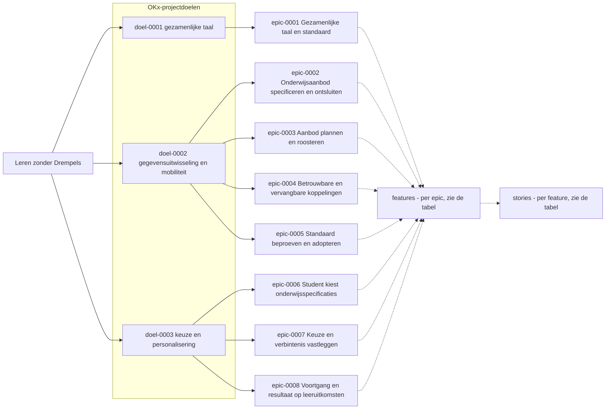
```mermaid
flowchart LR
  LZD["Leren zonder Drempels"] --> DL1 & DL2 & DL3
  subgraph doelen["OKx-projectdoelen"]
    DL1["doel-0001 gezamenlijke taal"]
    DL2["doel-0002 gegevensuitwisseling en mobiliteit"]
    DL3["doel-0003 keuze en personalisering"]
  end
  DL1 --> EP1["epic-0001 Gezamenlijke taal en standaard"]
  DL2 --> EP2["epic-0002 Onderwijsaanbod specificeren en ontsluiten"]
  DL2 --> EP3["epic-0003 Aanbod plannen en roosteren"]
  DL2 --> EP4["epic-0004 Betrouwbare en vervangbare koppelingen"]
  DL2 --> EP5["epic-0005 Standaard beproeven en adopteren"]
  DL3 --> EP6["epic-0006 Student kiest onderwijsspecificaties"]
  DL3 --> EP7["epic-0007 Keuze en verbintenis vastleggen"]
  DL3 --> EP8["epic-0008 Voortgang en resultaat op leeruitkomsten"]
  EP1 & EP2 & EP3 & EP4 & EP5 & EP6 & EP7 & EP8 -.-> FT["features - per epic, zie de tabel"] -.-> ST["stories - per feature, zie de tabel"]
```

### 2.2 Requirementsleeswijzer

Elke rij draagt een id om naar te verwijzen (doel-0001, epic-0001, feature-0001, story-0001: plat per soort, voluit met vier cijfers) en een kolom Bron: de context en bronvermelding van die rij. Alle verwijzingen leven in de tabellen zelf, niet in deze leesroute. Systeemafkortingen: OC (onderwijscatalogus), SKS (studentkeuzesysteem), P&R (planning en roostering), SIS (studentinformatiesysteem), LMS (leermanagementsysteem), SVS (studievoortgangsysteem). Bronafkortingen: ADR (architectuurbesluit), U (uitgangspunt), OKx-AP (architectuurprincipe).

#### 2.2.1 Opdracht en doelen ([opdracht.md](#26-de-opdracht-leren-zonder-drempels))

- **Wat**: de doelen die vanuit de Npuls-programmacontext (Leren zonder Drempels) aan het project OKx zijn gesteld. Vooral voor product owner en kernteam.
- **Rij**: doel-id, omschrijving, bron; de tabel "Van doel naar epic" is de stap omlaag.

#### 2.2.2 Epics ([epics.md](#27-epics))

- **Wat**: vertalen de doelen naar thema's, bekwaamheden van de keten. Vooral voor product owner en kernteam.
- **Rij**: "Draagt bij aan" = de ouder (het doel) · Features = de stap omlaag · Bron.

#### 2.2.3 Features ([features.md](#28-features))

- **Wat**: één concreet stuk van een thema dat de keten moet kunnen, zoals kiesbaarheid bepalen of specificaties versioneren zonder verwijzingen te breken; per epic een eigen sectie. Vooral voor kernteam en technische werkgroep.
- **Rij**: Epic-cel = de ouder · Stories = de stap omlaag ("geen" = nog niet uitgewerkt) · Bron.

#### 2.2.4 Stories ([stories.md](#29-stories))

- **Wat**: één toetsbare wens van één actor, in één zin ("Als ... wil ik ... zodat ..."). Vooral voor de technische werkgroep en leveranciers.
- **Rij**: Feature-cel = de ouder · Functionele eisen = de brug naar de techniek ("geen" = nog geen eis) · Bron.

### 2.3 Aansluiting op de techniek

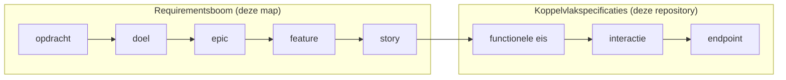
```mermaid
flowchart LR
  subgraph boom["Requirementsboom (deze map)"]
    OPD["opdracht"] --> DOEL["doel"] --> EPIC["epic"] --> FEAT["feature"] --> STORY["story"]
  end
  subgraph kvs["Koppelvlakspecificaties (deze repository)"]
    FE["functionele eis"] --> IA["interactie"] --> EP["endpoint"]
  end
  STORY --> FE
```

Per koppeling beschrijft een [interactiepatroon](Interactiepatronen) de interacties; interacties hergebruiken vastgestelde patronen. De kolom Functionele eisen van een story linkt naar de rij van de eis in het interactiepatroon; de eis wijst met zijn Story-kolom terug. Het interactieoverzicht somt de interacties op, en de endpointtabellen van de [applicatiecomponenten](Applicatiecomponenten) noemen per endpoint de methode en de interacties die hij draagt. Wie een featureset wil ondersteunen, wordt eigenaar van de bijbehorende endpoints.

### 2.4 Bijdragen

- Vorm en spelregels staan in de [skill okx-requirements-boom](https://github.com/Npuls-OKx/meta/blob/bd6fc9499b283fe974fd32c87bbb9307e75e7d1b/.agents/skills/okx-requirements-boom/SKILL.md) (gepind). Kern: één document per laag, elke rij één ouder, één bron en een id, overzicht boven volledigheid.
- Elke wijziging haalt de navigatiecontrole: `python3 scripts/validate-requirementsboom-navigatie.py` plus `python3 -m unittest discover -s tests`; beide draaien ook in de CI op elke pull request.
- Een idee of bevinding wordt een issue onder een milestone van deze repository; planningsstatus leeft in milestones en issues, niet in deze tabellen.
- Herkomst en verificatie van elke rij: de [extractieverantwoording](https://github.com/Npuls-OKx/meta/blob/bd6fc9499b283fe974fd32c87bbb9307e75e7d1b/architecture/agent-artifacts/research/20260806_0837_requirementsboom-extractie.md) met de parkeerlijst; oudere documenten gebruiken id-vormen van vóór de hernummering, de [hernummeringstabel](https://github.com/Npuls-OKx/meta/blob/bd6fc9499b283fe974fd32c87bbb9307e75e7d1b/architecture/agent-artifacts/research/20260816_1820_hernummering-requirementsboom.md) vertaalt oud naar nieuw.
- Eis-id's en uitvoerbare scenario's staan bewust niet in de boom; die achtergrondmechaniek volgt gefaseerd, zie de [synthese van het onderzoek](https://github.com/Npuls-OKx/meta/blob/bd6fc9499b283fe974fd32c87bbb9307e75e7d1b/architecture/agent-artifacts/research/20260804_1700_oplossingsrichtingen-business-techniek.md).
- Werkwijze voor branches, issues en review: [CONTRIBUTING](https://github.com/Npuls-OKx/meta/blob/bd6fc9499b283fe974fd32c87bbb9307e75e7d1b/CONTRIBUTING.md) (gepind).

### 2.5 Scope

Deze map bevat de requirementsboom: de vier laagdocumenten en deze leeswijzer. De boom verwijst naar bestaande documenten en herhaalt ze niet. Al het overige valt buiten scope.


<!-- pagina-einde -->

### 2.6 De opdracht: Leren zonder Drempels

Laag 1 van de [requirementsboom](#2-requirementsboom): waarom OKx bestaat en aan welke doelen elke epic bijdraagt.

#### 2.6.1 Context

OKx is onderdeel van het Npuls-groeifondsprogramma, pijler [Leren zonder Drempels](https://npuls.nl/pijlers/leren-zonder-drempels/). De kern van die pijler: lerenden ontwikkelen zich op een manier die bij hen past en krijgen meer regie over hun eigen leer- en ontwikkelroute, zonder (administratieve) drempels. Mbo (middelbaar beroepsonderwijs), hbo (hoger beroepsonderwijs) en wo (wetenschappelijk onderwijs) werken daarvoor aan een gezamenlijke onderwijsruimte met geharmoniseerde afspraken.

De pijler kent vijf programmaonderdelen. OKx draagt er een en raakt er twee:

| Programmaonderdeel | Wat het regelt | Rol van OKx |
|---|---|---|
| Identiteit | Eenmalige digitale identiteit (eduID) voor alle instellingen | voorwaarde: identiteitsuitgifte (identity provisioning) is nodig voor ketenwerking |
| Ontsluiten onderwijsaanbod | Gebundelde informatie over onderwijsmogelijkheden | **dit is OKx**, naast OKE (Onderwijslogistiek Keten Examen) en SURFeduhub |
| Aanmelden en inschrijven | Gestandaardiseerde aanmelding voor volledige en deelopleidingen | raakvlak: keuze en verbintenis |
| Credentials | Digitale portefeuille (eduwallet) en microcredentials | raakvlak: resultaat op leeruitkomsten |
| Verrekeningen | Financiële afrekening tussen instellingen | raakvlak: instellingsoverstijgende scenario's |

#### 2.6.2 Projectdoelen

De drie doelen waar elke [epic](#27-epics) aan bijdraagt.

| Doel | Omschrijving | Bron |
|---|---|---|
| <a id="doel-0001"></a>doel-0001 | OKx levert een gezamenlijke taal en standaarden voor gegevensuitwisseling die een scala aan flexibilisering mogelijk maken. | [Leerroute-uitwerking §1.2](https://github.com/Npuls-OKx/meta/blob/bd6fc9499b283fe974fd32c87bbb9307e75e7d1b/architecture/docs/specificatie/leerroute-uitwerking/doc/leerroute-uitwerking-lr1.md#12-wat-wil-okx-bereiken) |
| <a id="doel-0002"></a>doel-0002 | OKx realiseert functionele en technische gegevensuitwisseling voor mbo, hbo en wo die studentmobiliteit ondersteunt. | [Leerroute-uitwerking §1.2](https://github.com/Npuls-OKx/meta/blob/bd6fc9499b283fe974fd32c87bbb9307e75e7d1b/architecture/docs/specificatie/leerroute-uitwerking/doc/leerroute-uitwerking-lr1.md#12-wat-wil-okx-bereiken) |
| <a id="doel-0003"></a>doel-0003 | OKx ondersteunt keuze, personalisering en ketenoverstijgende routes van de student binnen wettelijke en kwaliteitskaders, met de leeruitkomst als sleutel. | [ADR 0003](../Referentiemateriaal/adr/0003-student-kiest-leeruitkomsten-domeinprincipes.md) |

#### 2.6.3 Van doel naar epic

| Doel | Epics die eraan bijdragen |
|---|---|
| [doel-0001](#doel-0001) | [epic-0001 Gezamenlijke taal en standaard](#epic-0001) |
| [doel-0002](#doel-0002) | [epic-0002 Onderwijsaanbod specificeren en ontsluiten](#epic-0002); [epic-0003 Aanbod plannen en roosteren](#epic-0003); [epic-0004 Betrouwbare en vervangbare koppelingen](#epic-0004); [epic-0005 Standaard beproeven en adopteren](#epic-0005) |
| [doel-0003](#doel-0003) | [epic-0006 Student kiest onderwijsspecificaties](#epic-0006); [epic-0007 Keuze en verbintenis vastleggen](#epic-0007); [epic-0008 Voortgang en resultaat op leeruitkomsten](#epic-0008) |

De epics zelf, met doel en bron: [epics.md](#27-epics).


<!-- pagina-einde -->

### 2.7 Epics

Laag 2 van de [requirementsboom](#2-requirementsboom): de bekwaamheden van de keten, elk gekoppeld aan een [projectdoel](#26-de-opdracht-leren-zonder-drempels).

Zes epics zijn tot stories uitgewerkt, in wisselende diepte; de epics voor gezamenlijke taal en voor beproeven en adopteren dragen alleen features. De kandidaten voor verdere uitwerking staan op de [parkeerlijst](https://github.com/Npuls-OKx/meta/blob/bd6fc9499b283fe974fd32c87bbb9307e75e7d1b/architecture/agent-artifacts/research/20260806_0837_requirementsboom-extractie.md#parkeerlijst).

| Id | Epic | Doel | Draagt bij aan | Bron | Features |
|---|---|---|---|---|---|
| <a id="epic-0001"></a>epic-0001 | Gezamenlijke taal en standaard | Ketenpartijen spreken dezelfde taal: één begrippenkader en uniforme leeruitkomstdefinities, aangesloten op landelijke referentiemodellen. | [doel-0001](#doel-0001) | [Begrippenkader](https://github.com/Npuls-OKx/meta/blob/bd6fc9499b283fe974fd32c87bbb9307e75e7d1b/architecture/docs/specificatie/leerroute-uitwerking/doc/begrippenkader.md) | [features](#281-gezamenlijke-taal-en-standaard) |
| <a id="epic-0002"></a>epic-0002 | Onderwijsaanbod specificeren en ontsluiten | Elke ketenpartij werkt met dezelfde actuele onderwijsspecificaties en hetzelfde aanbod uit de onderwijscatalogus. | [doel-0002](#doel-0002) | [Scenario 1.1](https://github.com/Npuls-OKx/meta/blob/bd6fc9499b283fe974fd32c87bbb9307e75e7d1b/architecture/docs/specificatie/leerroute-uitwerking/doc/scenario-uitwerkingen/scenario-1.1-regulier-happyflow.md) | [features](#282-onderwijsaanbod-specificeren-en-ontsluiten) |
| <a id="epic-0003"></a>epic-0003 | Aanbod plannen en roosteren | Studenten krijgen tijdig haalbaar, gefaseerd en geroosterd aanbod, met heldere terugkoppeling op hun keuzes. | [doel-0002](#doel-0002) | [Scenario 1.1](https://github.com/Npuls-OKx/meta/blob/bd6fc9499b283fe974fd32c87bbb9307e75e7d1b/architecture/docs/specificatie/leerroute-uitwerking/doc/scenario-uitwerkingen/scenario-1.1-regulier-happyflow.md) | [features](#283-aanbod-plannen-en-roosteren) |
| <a id="epic-0004"></a>epic-0004 | Betrouwbare en vervangbare koppelingen | Instellingen vervangen componenten zonder ketenimpact, dankzij betrouwbare, veilige en versioneerbare koppelingen. | [doel-0002](#doel-0002) | [Architectuurprincipes, OKx-AP04](../Referentiemateriaal/principes/principes.md) | [features](#284-betrouwbare-en-vervangbare-koppelingen) |
| <a id="epic-0005"></a>epic-0005 | Standaard beproeven en adopteren | Pilotscholen, instellingen en leveranciers implementeren en adopteren de standaard, beproefd in pilots. | [doel-0002](#doel-0002) | [Meetingverslag 17 april](https://github.com/Npuls-OKx/meta/blob/bd6fc9499b283fe974fd32c87bbb9307e75e7d1b/architecture/meetings/20260417_okx_kernteam_inhoud_uitwerken_studentkeuze_roostering_planning_pocs/summary.md#stakeholdermanagement-en-adoptiestrategie) | [features](#285-standaard-beproeven-en-adopteren) |
| <a id="epic-0006"></a>epic-0006 | Student kiest onderwijsspecificaties | De student kiest zijn onderwijsspecificaties vrij en instellingsonafhankelijk, met zekerheid dat die keuze geldig is. | [doel-0003](#doel-0003) | [ADR 0012](../Referentiemateriaal/adr/0012-leerroute-onafhankelijk-keuzegate-nominaal-maatwerk.md) | [features](#286-student-kiest-onderwijsspecificaties) |
| <a id="epic-0007"></a>epic-0007 | Keuze en verbintenis vastleggen | Keuze, intekening en verbintenis staan herleidbaar vast en zijn consistent bekend bij alle betrokken systemen. | [doel-0003](#doel-0003) | [Persona Jochem, instellingsjourney](https://github.com/Npuls-OKx/meta/blob/bd6fc9499b283fe974fd32c87bbb9307e75e7d1b/architecture/docs/specificatie/leerroute-uitwerking/doc/persona_jochem.md#instellingsjourney) | [features](#287-keuze-en-verbintenis-vastleggen) |
| <a id="epic-0008"></a>epic-0008 | Voortgang en resultaat op leeruitkomsten | Voortgang en resultaten op leeruitkomsten zijn instellingsoverstijgend herleidbaar voor student en instelling. | [doel-0003](#doel-0003) | [Uitgangspunt U6](#7-uitgangspunten-voor-koppelingspecificaties) | [features](#288-voortgang-en-resultaat-op-leeruitkomsten) |


<!-- pagina-einde -->

### 2.8 Features

Laag 3 van de [requirementsboom](#2-requirementsboom): afgebakend gedrag per [epic](#27-epics). De ouder staat per rij in de kolom Epic en als groepering in de sectiekop; de kolom Stories linkt per feature naar zijn uitgewerkte [stories](#29-stories), of draagt "geen" zolang die uitwerking ontbreekt.

#### 2.8.1 [Gezamenlijke taal en standaard](#epic-0001)

| Id | Feature | Omschrijving | Bron | Epic | Stories |
|---|---|---|---|---|---|
| <a id="feature-0001"></a>feature-0001 | Formele begrippenlijst als artefact | Alle informatiemodellen en data gebruiken eenduidige termen, herleidbaar tot één vastgestelde begrippenlijst. | [Sparsessie 5 augustus](https://github.com/Npuls-OKx/meta/blob/bd6fc9499b283fe974fd32c87bbb9307e75e7d1b/architecture/agent-artifacts/research/20260806_0837_requirementsboom-extractie.md#meetingbronnen-die-alleen-extern-zijn-vastgelegd) | [epic-0001](#epic-0001) | geen |
| <a id="feature-0002"></a>feature-0002 | Uitlijning met ROSA en KOI | Instellingen en landelijke systemen herkennen dezelfde begrippen, zonder eigen vertaalslag naar ROSA (Referentie Onderwijs Sector Architectuur) of KOI (Kernmodel Onderwijsinformatie). | [Meetingverslag 30 april](https://github.com/Npuls-OKx/meta/blob/bd6fc9499b283fe974fd32c87bbb9307e75e7d1b/architecture/meetings/20260430_nde_nvd_klus53_allignment_OKx_referentiekader/summary.md#executive-summary) | [epic-0001](#epic-0001) | geen |
| <a id="feature-0003"></a>feature-0003 | N:M-cardinaliteit en prerequisite-relaties | Systemen leggen relaties tussen leeruitkomsten, onderdelen en voorwaarden (prerequisites) eenduidig vast, ook waar één leeruitkomst meerdere onderdelen raakt. | [Datamodelschema's, regels bij de schema's](Datamodelschema%27s/README.md#regels-bij-de-schemas) | [epic-0001](#epic-0001) | geen |
| <a id="feature-0004"></a>feature-0004 | Eenduidige regelevaluatie (conformance) | Elk systeem berekent voor dezelfde keuzeregel dezelfde uitkomst, een voorwaarde voor conformance-toetsing. | [Keuze-requirements R6](https://github.com/Npuls-OKx/meta/blob/bd6fc9499b283fe974fd32c87bbb9307e75e7d1b/architecture/docs/specificatie/student-keuze/keuze-requirements.md#6-requirements) | [epic-0001](#epic-0001) | geen |
| <a id="feature-0005"></a>feature-0005 | Koppeling versus koppelvlak als vaste terminologie | Alle betrokkenen gebruiken de termen koppeling en koppelvlak eenduidig en zonder onderlinge verwarring. | [Uitgangspunt U2](#7-uitgangspunten-voor-koppelingspecificaties) | [epic-0001](#epic-0001) | geen |
| <a id="feature-0006"></a>feature-0006 | Engelse veldnamen met Nederlandse mapping | Systemen gebruiken Engelstalige veldnamen die eenduidig terugvoeren op de eerdere Nederlandse veldnamen. | [Mapping veldnamen](#8-mapping-veldnamen-engels-uk-naar-nederlands) | [epic-0001](#epic-0001) | geen |

#### 2.8.2 [Onderwijsaanbod specificeren en ontsluiten](#epic-0002)

| Id | Feature | Omschrijving | Bron | Epic | Stories |
|---|---|---|---|---|---|
| <a id="feature-0007"></a>feature-0007 | Catalogus vullen vanuit curriculumontwerp | Alle ketenpartijen binnen de instelling vertrouwen op één actuele, formeel vastgestelde bron voor haar onderwijsspecificaties. | [ADR 0002](../Referentiemateriaal/adr/0002-prioriteitsketen-catalogus-drielagen-fundament.md) | [epic-0002](#epic-0002) | geen |
| <a id="feature-0008"></a>feature-0008 | Hiërarchische, refereerbare onderwijsspecificatiestructuur | Elk onderdeel van de onderwijsspecificatie is eenduidig herleidbaar en herbruikbaar, ook over leerwegen en doelgroepvarianten heen. | [Meetingverslag 10 juli, besluiten](https://github.com/Npuls-OKx/meta/blob/bd6fc9499b283fe974fd32c87bbb9307e75e7d1b/architecture/meetings/20260710_okx_kernteam_inhoud_specificatie_uitwerken_OC_P/summary.md#besluiten) en [technische details](https://github.com/Npuls-OKx/meta/blob/bd6fc9499b283fe974fd32c87bbb9307e75e7d1b/architecture/meetings/20260710_okx_kernteam_inhoud_specificatie_uitwerken_OC_P/summary.md#technische--implementatiedetails) | [epic-0002](#epic-0002) | [story-0001](#story-0001) |
| <a id="feature-0009"></a>feature-0009 | Stabiele identiteit en versionering van specificaties | Verwijzingen van afnemers naar een specificatie blijven geldig, ook na inhoudelijke wijzigingen. | [Regels bij de schema's](Datamodelschema%27s/README.md#regels-bij-de-schemas) | [epic-0002](#epic-0002) | [story-0002](#story-0002) |
| <a id="feature-0010"></a>feature-0010 | Leeromgeving inrichten op de specificatie | De leeromgeving is altijd inhoudelijk consistent met de specificatie, met ruimte voor eigen invulling op lesniveau. | [Interactiepatroon OC-LMS](#43-interactiepatroon-onderwijscatalogus-naar-leermanagementsysteem) | [epic-0002](#epic-0002) | [story-0003](#story-0003) |

#### 2.8.3 [Aanbod plannen en roosteren](#epic-0003)

| Id | Feature | Omschrijving | Bron | Epic | Stories |
|---|---|---|---|---|---|
| <a id="feature-0011"></a>feature-0011 | Drie stadia van onderwijsaanbod | Systemen onderscheiden betrouwbaar in welke fase het aanbod verkeert, van specificatie tot concreet rooster. | [Begrippenkader, stadia van onderwijsaanbod](https://github.com/Npuls-OKx/meta/blob/bd6fc9499b283fe974fd32c87bbb9307e75e7d1b/architecture/docs/specificatie/leerroute-uitwerking/doc/begrippenkader.md#stadia-van-onderwijsaanbod-specificatie-planbaar-geroosterd) | [epic-0003](#epic-0003) | [story-0004](#story-0004); [story-0005](#story-0005) |
| <a id="feature-0012"></a>feature-0012 | Planbaarheid als rijpheidskenmerk | Planners plannen zonder giswerk op elke horizon: meerjaren-, jaar- en periodeplanning kennen elk hun vooraf vastgelegde gegevensset in de specificatie. | [Kaderscenario leerroute 1](../Referentiemateriaal/kaderscenario%27s/leerroute-1-regulier.md) | [epic-0003](#epic-0003) | geen |
| <a id="feature-0013"></a>feature-0013 | Geldig, gefaseerd aanbod afleiden | Het geplande aanbod is altijd geldig en sluit in de tijd logisch aan op de vereiste leeruitkomsten. | [Keuze-requirements R9 en R11](https://github.com/Npuls-OKx/meta/blob/bd6fc9499b283fe974fd32c87bbb9307e75e7d1b/architecture/docs/specificatie/student-keuze/keuze-requirements.md#6-requirements) | [epic-0003](#epic-0003) | [story-0006](#story-0006); [story-0007](#story-0007); [story-0008](#story-0008); [story-0026](#story-0026); [story-0028](#story-0028) |
| <a id="feature-0014"></a>feature-0014 | Eigenaarschap van het aanbodobject | Planninggegevens en specificatie-inhoud blijven gescheiden; het aanbodobject bevat geen dubbele of verouderde specificatiegegevens. | [Meetingverslag 10 juli](https://github.com/Npuls-OKx/meta/blob/bd6fc9499b283fe974fd32c87bbb9307e75e7d1b/architecture/meetings/20260710_okx_kernteam_inhoud_specificatie_uitwerken_OC_P/summary.md#besluiten) | [epic-0003](#epic-0003) | geen |
| <a id="feature-0015"></a>feature-0015 | Haalbaarheid van keuze en ontwerp toetsen | De student weet vóór bevestiging of zijn definitieve keuze haalbaar is, via acceptatie, afwijzing of een alternatief. | [ADR 0015](../Referentiemateriaal/adr/0015-request-for-offering-haalbaarheidstoets-tussen-sks-en-planning.md) | [epic-0003](#epic-0003) | [story-0009](#story-0009) |

#### 2.8.4 [Betrouwbare en vervangbare koppelingen](#epic-0004)

| Id | Feature | Omschrijving | Bron | Epic | Stories |
|---|---|---|---|---|---|
| <a id="feature-0016"></a>feature-0016 | Betrouwbaar berichtenverkeer | Consumenten missen nooit een mutatie en verwerken elk bericht eenmalig en in de juiste volgorde. | [Uitgangspunten U4 en U5](#7-uitgangspunten-voor-koppelingspecificaties) | [epic-0004](#epic-0004) | [story-0010](#story-0010); [story-0011](#story-0011) |
| <a id="feature-0017"></a>feature-0017 | Authenticatie via OAuth 2.0 Client Credentials | Alleen geautoriseerde consumenten krijgen toegang tot endpoints, via één gedeeld mechanisme voor alle koppelvlakken. | [Auth-standaard](#5-auth-standaard-voor-koppelvlakken) | [epic-0004](#epic-0004) | geen |
| <a id="feature-0018"></a>feature-0018 | Maximaal twee actieve major versies | Afnemers hebben altijd voldoende tijd om over te stappen naar een nieuwe major versie. | [Meetingverslag 14 juli](https://github.com/Npuls-OKx/meta/blob/bd6fc9499b283fe974fd32c87bbb9307e75e7d1b/architecture/meetings/20260714_SI_afstemming_PR_specificatie_uitwerking_P_en_R/summary.md#progress) | [epic-0004](#epic-0004) | geen |
| <a id="feature-0019"></a>feature-0019 | Intra-instelling eerst, federatie gefaseerd | Instellingen gebruiken koppelingen eerst betrouwbaar binnen de eigen instelling, vóór cross-instelling uitbreiding nodig is. | [Uitgangspunt U10](#7-uitgangspunten-voor-koppelingspecificaties) | [epic-0004](#epic-0004) | geen |

#### 2.8.5 [Standaard beproeven en adopteren](#epic-0005)

| Id | Feature | Omschrijving | Bron | Epic | Stories |
|---|---|---|---|---|---|
| <a id="feature-0020"></a>feature-0020 | Standaard beproeven met pilotscholen | De standaard is bij pilotinstellingen in de praktijk beproefd voordat bredere adoptie start. | [Meetingverslag 17 april, POC-scholen](https://github.com/Npuls-OKx/meta/blob/bd6fc9499b283fe974fd32c87bbb9307e75e7d1b/architecture/meetings/20260417_okx_kernteam_inhoud_uitwerken_studentkeuze_roostering_planning_pocs/summary.md#voortgang-en-selectie-van-de-poc-scholen) | [epic-0005](#epic-0005) | geen |
| <a id="feature-0021"></a>feature-0021 | Kennisopbouw bij instellingen | Instellingen beschikken over de kennis om de standaard en de onderliggende referentiearchitectuur toe te passen. | [Meetingverslag 17 april, MORA en kennisoverdracht](https://github.com/Npuls-OKx/meta/blob/bd6fc9499b283fe974fd32c87bbb9307e75e7d1b/architecture/meetings/20260417_okx_kernteam_inhoud_uitwerken_studentkeuze_roostering_planning_pocs/summary.md#uitdagingen-rondom-de-mora-en-kennisoverdracht) | [epic-0005](#epic-0005) | geen |
| <a id="feature-0022"></a>feature-0022 | Leveranciersafspraken borgen via richtlijnen | Afspraken met leveranciers zijn geborgd zodat implementaties de standaard blijven volgen. | [Meetingverslag 17 april, EduV en borging](https://github.com/Npuls-OKx/meta/blob/bd6fc9499b283fe974fd32c87bbb9307e75e7d1b/architecture/meetings/20260417_okx_kernteam_inhoud_uitwerken_studentkeuze_roostering_planning_pocs/summary.md#status-van-eduv-en-potentiële-borging-integratiestandaarden) | [epic-0005](#epic-0005) | geen |
| <a id="feature-0023"></a>feature-0023 | Feedbackloop met leveranciers en scholen | Specificaties zijn aangescherpt op basis van praktijkervaring van leveranciers en scholen. | [Meetingverslag 17 april, adoptiestrategie](https://github.com/Npuls-OKx/meta/blob/bd6fc9499b283fe974fd32c87bbb9307e75e7d1b/architecture/meetings/20260417_okx_kernteam_inhoud_uitwerken_studentkeuze_roostering_planning_pocs/summary.md#stakeholdermanagement-en-adoptiestrategie) | [epic-0005](#epic-0005) | geen |

#### 2.8.6 [Student kiest onderwijsspecificaties](#epic-0006)

| Id | Feature | Omschrijving | Bron | Epic | Stories |
|---|---|---|---|---|---|
| <a id="feature-0024"></a>feature-0024 | Kiesbaarheid bepalen | Voor elke student staat op elk niveau vast welke onderwijsspecificaties hij mag kiezen (eligibility). | [Keuze-requirements R1](https://github.com/Npuls-OKx/meta/blob/bd6fc9499b283fe974fd32c87bbb9307e75e7d1b/architecture/docs/specificatie/student-keuze/keuze-requirements.md#6-requirements) | [epic-0006](#epic-0006) | [story-0012](#story-0012); [story-0013](#story-0013); [story-0014](#story-0014) |
| <a id="feature-0025"></a>feature-0025 | Keuzecriteria als queryparameters op de aanbodquery | Systemen doorzoeken het onderwijsaanbod met precieze, herbruikbare criteria die rechtstreeks uit de leervraag volgen. | [ADR 0007](../Referentiemateriaal/adr/0007-student-keuze-criteria-als-query-parameters-onderwijs-aanbod.md) | [epic-0006](#epic-0006) | geen |
| <a id="feature-0026"></a>feature-0026 | Regelsets los van items, met min/max-keuzeregels | Beheerders wijzigen regelsets los van catalogusitems; keuzeregels leggen per benoemd bereik vast hoeveel er minimaal en maximaal gekozen wordt. | [Keuze-requirements R2 en R5](https://github.com/Npuls-OKx/meta/blob/bd6fc9499b283fe974fd32c87bbb9307e75e7d1b/architecture/docs/specificatie/student-keuze/keuze-requirements.md#6-requirements) | [epic-0006](#epic-0006) | [story-0015](#story-0015); [story-0016](#story-0016); [story-0017](#story-0017); [story-0018](#story-0018) |
| <a id="feature-0027"></a>feature-0027 | Leeruitkomst-id's als verbindende sleutels in keuzeregels | Systemen wisselen keuzegegevens uit zonder de inhoud van leeruitkomsten te hoeven delen. | [ADR 0026](../Referentiemateriaal/adr/0026-leeruitkomst-als-verbindende-sleutel.md) en [Keuze-requirements R14 en R15](https://github.com/Npuls-OKx/meta/blob/bd6fc9499b283fe974fd32c87bbb9307e75e7d1b/architecture/docs/specificatie/student-keuze/keuze-requirements.md#6-requirements) | [epic-0006](#epic-0006) | geen |
| <a id="feature-0028"></a>feature-0028 | Regelsets versioneren voor verantwoording | Achteraf staat vast welke regelversie gold bij een keuze, nodig voor de diplomaverantwoording. | [Keuze-requirements R17](https://github.com/Npuls-OKx/meta/blob/bd6fc9499b283fe974fd32c87bbb9307e75e7d1b/architecture/docs/specificatie/student-keuze/keuze-requirements.md#6-requirements) | [epic-0006](#epic-0006) | geen |
| <a id="feature-0029"></a>feature-0029 | Bottom-up en top-down samenstellen | Een opleiding is van bovenaf en van onderop samen te stellen, met dezelfde onderliggende onderdelen als uitkomst. | [Keuze-requirements R13](https://github.com/Npuls-OKx/meta/blob/bd6fc9499b283fe974fd32c87bbb9307e75e7d1b/architecture/docs/specificatie/student-keuze/keuze-requirements.md#6-requirements) | [epic-0006](#epic-0006) | [story-0019](#story-0019) |

#### 2.8.7 [Keuze en verbintenis vastleggen](#epic-0007)

| Id | Feature | Omschrijving | Bron | Epic | Stories |
|---|---|---|---|---|---|
| <a id="feature-0030"></a>feature-0030 | Verbintenis als toestandsmachine per niveau | Systemen en actoren stellen op elk niveau, van programma tot toets, de actuele status van de verbintenis vast. | [Begrippenkader, stadia van onderwijsverbintenis](https://github.com/Npuls-OKx/meta/blob/bd6fc9499b283fe974fd32c87bbb9307e75e7d1b/architecture/docs/specificatie/leerroute-uitwerking/doc/begrippenkader.md#stadia-van-onderwijsverbintenis-aangemeld-ingeschreven-deelnemend-afgerond) | [epic-0007](#epic-0007) | [story-0025](#story-0025); [story-0027](#story-0027) |
| <a id="feature-0031"></a>feature-0031 | Keuze gescheiden van inschrijving en resultaat | Studentkeuze staat als eigen verantwoordelijkheid los van de formele inschrijving en van resultaat en voortgang. | [ADR 0014](../Referentiemateriaal/adr/0014-splitsing-inschrijving-rodkrs-en-studentkeuze-sks.md) en [ADR 0009](../Referentiemateriaal/adr/0009-sks-svs-rollenverdeling-keuze-vs-resultaat-voortgang.md) | [epic-0007](#epic-0007) | geen |
| <a id="feature-0032"></a>feature-0032 | Examenplanwijzigingen alleen na impactanalyse | Een wijziging in het examenplan raakt lopende verbintenissen nooit ongecontroleerd. | [Interactiepatroon OC-SIS, acceptatietoets](#428-acceptatietoets-bij-wijziging-examenplan) | [epic-0007](#epic-0007) | [story-0020](#story-0020) |

#### 2.8.8 [Voortgang en resultaat op leeruitkomsten](#epic-0008)

| Id | Feature | Omschrijving | Bron | Epic | Stories |
|---|---|---|---|---|---|
| <a id="feature-0033"></a>feature-0033 | Resultaatstructuur inrichten en resultaten registreren | Elk onderwijsresultaat koppelt gewogen en herleidbaar aan de behaalde leeruitkomsten van de student. | [ADR 0022](../Referentiemateriaal/adr/0022-resultaatbegrippen-conform-rosa-koi.md) | [epic-0008](#epic-0008) | [story-0021](#story-0021); [story-0022](#story-0022); [story-0023](#story-0023) |
| <a id="feature-0034"></a>feature-0034 | Voorwaarden vooraf uitgedrukt in behaalde leeruitkomsten | Een voorwaarde vooraf (prerequisite) is uitgedrukt in behaalde leeruitkomsten, niet in doorlopen specificaties; via welke route de student de leeruitkomst behaalde doet er niet toe. | [Keuze-requirements R7](https://github.com/Npuls-OKx/meta/blob/bd6fc9499b283fe974fd32c87bbb9307e75e7d1b/architecture/docs/specificatie/student-keuze/keuze-requirements.md#6-requirements) | [epic-0008](#epic-0008) | geen |
| <a id="feature-0035"></a>feature-0035 | Aanvullend resultaat-koppelvlak voor bewijsvoering | Afnemers beschikken naast de verbintenisstatus over rijkere bewijsvoering van resultaten op leeruitkomstniveau. | [Begrippenkader, stadia van onderwijsverbintenis](https://github.com/Npuls-OKx/meta/blob/bd6fc9499b283fe974fd32c87bbb9307e75e7d1b/architecture/docs/specificatie/leerroute-uitwerking/doc/begrippenkader.md#stadia-van-onderwijsverbintenis-aangemeld-ingeschreven-deelnemend-afgerond) | [epic-0008](#epic-0008) | geen |
| <a id="feature-0036"></a>feature-0036 | Toetsing zodra het leeruitkomst-niveau is behaald | De student kan toetsen zodra het vereiste niveau van de leeruitkomsten is behaald, ook zonder elke leergelegenheid te hebben bijgewoond. | [Scenario 3.1](https://github.com/Npuls-OKx/meta/blob/bd6fc9499b283fe974fd32c87bbb9307e75e7d1b/architecture/docs/specificatie/leerroute-uitwerking/doc/scenario-uitwerkingen/scenario-3.1-versnellen-by-design.md) | [epic-0008](#epic-0008) | [story-0024](#story-0024) |


<!-- pagina-einde -->

### 2.9 Stories

Laag 4 van de [requirementsboom](#2-requirementsboom): toetsbare wensen van één actor, per uitgewerkte [epic](#27-epics). Een story traceert via zijn feature terug naar de epic; de kolom Functionele eisen linkt per eis (functionele-eis-id, plat genummerd over de koppelingen heen) naar zijn rij in de [koppelvlakspecificaties](.); elke eis verwijst daar door naar interacties en endpoint-sets, en wie de featureset wil ondersteunen, wordt eigenaar van die endpoints.

#### 2.9.1 [Onderwijsaanbod specificeren en ontsluiten](#epic-0002)

| Id | Story | Feature | Bron | Functionele eisen |
|---|---|---|---|---|
| <a id="story-0001"></a>story-0001 | Als onderwijsontwerper wil ik dat de keten bij publicatie valideert dat de studielast (studiebelastingsuren en studiepunten, SBU/EC) van onderliggende delen optelt naar het bovenliggende niveau, zodat een aggregatiefout tot terugdraaien (rollback) leidt. | [feature-0008 Hiërarchische, refereerbare onderwijsspecificatiestructuur](#feature-0008) | [ADR 0017](../Referentiemateriaal/adr/0017-hierarchisch-datamodel-aanbodstructuur-leeruitkomsten-en-sbuec-aggregatie.md) | geen |
| <a id="story-0002"></a>story-0002 | Als planner wil ik dat bij een specificatie-update de vorige versie actief blijft voor lopend aanbod en de nieuwe alleen op nieuw aanbod geldt, zodat lopende planningen niet breken. | [feature-0009 Stabiele identiteit en versionering van specificaties](#feature-0009) | [Archief leerroute-uitwerking §19, F10](https://github.com/Npuls-OKx/meta/blob/bd6fc9499b283fe974fd32c87bbb9307e75e7d1b/architecture/docs/specificatie/leerroute-uitwerking/doc/archief-conceptmodellen.md#19-faalmatrix--overzicht-ketenfaalmodi) | [functionele-eis-0004](#functionele-eis-0004) |
| <a id="story-0003"></a>story-0003 | Als onderwijsontwikkelaar wil ik dat het leermanagementsysteem de gelegde leermiddelkoppeling als eigen resource terugmeldt, zodat de catalogus die kan ophalen en tonen bij het aanbod. | [feature-0010 Leeromgeving inrichten op de specificatie](#feature-0010) | [Interactiepatroon OC-LMS, interactieoverzicht](#434-interactieoverzicht) | [functionele-eis-0011](#functionele-eis-0011) |

#### 2.9.2 [Aanbod plannen en roosteren](#epic-0003)

| Id | Story | Feature | Bron | Functionele eisen |
|---|---|---|---|---|
| <a id="story-0004"></a>story-0004 | Als roosteraar wil ik geroosterd aanbod per periode publiceren en beschikbaar stellen aan student en docent, zodat latere perioden planbaar blijven. | [feature-0011 Drie stadia van onderwijsaanbod](#feature-0011) | [Scenario 1.1](https://github.com/Npuls-OKx/meta/blob/bd6fc9499b283fe974fd32c87bbb9307e75e7d1b/architecture/docs/specificatie/leerroute-uitwerking/doc/scenario-uitwerkingen/scenario-1.1-regulier-happyflow.md) | geen |
| <a id="story-0005"></a>story-0005 | Als student wil ik voor de start van het onderwijs toegang tot het leermanagementsysteem en mijn periode-rooster krijgen, zodat ik op de eerste lesdag kan beginnen. | [feature-0011 Drie stadia van onderwijsaanbod](#feature-0011) | [Scenario 1.1](https://github.com/Npuls-OKx/meta/blob/bd6fc9499b283fe974fd32c87bbb9307e75e7d1b/architecture/docs/specificatie/leerroute-uitwerking/doc/scenario-uitwerkingen/scenario-1.1-regulier-happyflow.md) | geen |
| <a id="story-0006"></a>story-0006 | Als planner wil ik dat de catalogus een planbaar geworden specificatie met een dun event (id en versie) meldt en ik de structuur of delta kan ophalen, zodat ik er opleidingsaanbod van kan maken. | [feature-0013 Geldig, gefaseerd aanbod afleiden](#feature-0013) | [Interactiepatroon OC-P&R, interactieoverzicht](#414-interactieoverzicht) | [functionele-eis-0001](#functionele-eis-0001) |
| <a id="story-0007"></a>story-0007 | Als onderwijsontwikkelaar wil ik dat planning en roostering de verwerkingsstatus met referentie naar het opleidingsaanbod terugmeldt, zodat de catalogus weet of de specificatie planbaar bleek. | [feature-0013 Geldig, gefaseerd aanbod afleiden](#feature-0013) | [Interactiepatroon OC-P&R, interactieoverzicht](#414-interactieoverzicht) | [functionele-eis-0001](#functionele-eis-0001) en [functionele-eis-0003](#functionele-eis-0003) |
| <a id="story-0008"></a>story-0008 | Als planner wil ik per combinatie keuzedeel, locatie en periode bepalen hoeveel groepen ik beschikbaar stel, zodat keuzes stabiel tussen systemen uitwisselbaar zijn. | [feature-0013 Geldig, gefaseerd aanbod afleiden](#feature-0013) | [Keuze-requirements R4](https://github.com/Npuls-OKx/meta/blob/bd6fc9499b283fe974fd32c87bbb9307e75e7d1b/architecture/docs/specificatie/student-keuze/keuze-requirements.md#6-requirements) | geen |
| <a id="story-0026"></a>story-0026 | Als planner wil ik leergelegenheden uit een latere periode vervroegd kunnen roosteren en hun capaciteit kunnen uitbreiden voor een versnellende student, zodat versnelling zonder herontwerp van de route kan. | [feature-0013 Geldig, gefaseerd aanbod afleiden](#feature-0013) | [Scenario 1.3](https://github.com/Npuls-OKx/meta/blob/bd6fc9499b283fe974fd32c87bbb9307e75e7d1b/architecture/docs/specificatie/leerroute-uitwerking/doc/scenario-uitwerkingen/scenario-1.3-regulier-versnelling-by-accident.md) | geen |
| <a id="story-0028"></a>story-0028 | Als student wil ik gemiste leergelegenheden in een latere periode kunnen inhalen, zodat ik met beperkte uitloop mijn diploma haal. | [feature-0013 Geldig, gefaseerd aanbod afleiden](#feature-0013) | [Scenario 1.2](https://github.com/Npuls-OKx/meta/blob/bd6fc9499b283fe974fd32c87bbb9307e75e7d1b/architecture/docs/specificatie/leerroute-uitwerking/doc/scenario-uitwerkingen/scenario-1.2-regulier-vertraging-by-accident.md) | geen |
| <a id="story-0009"></a>story-0009 | Als onderwijsontwerper wil ik dat het planningssysteem mijn concept-programma met een snelle toets (quick scan) op realiseerbaarheid beoordeelt, zodat ik het ontwerp vóór publicatie kan aanpassen. | [feature-0015 Haalbaarheid van keuze en ontwerp toetsen](#feature-0015) | [Archief leerroute-uitwerking §19, F3](https://github.com/Npuls-OKx/meta/blob/bd6fc9499b283fe974fd32c87bbb9307e75e7d1b/architecture/docs/specificatie/leerroute-uitwerking/doc/archief-conceptmodellen.md#19-faalmatrix--overzicht-ketenfaalmodi) | geen |

#### 2.9.3 [Betrouwbare en vervangbare koppelingen](#epic-0004)

| Id | Story | Feature | Bron | Functionele eisen |
|---|---|---|---|---|
| <a id="story-0010"></a>story-0010 | Als beheerder van een afnemend systeem wil ik een afleveradres met event-typen kunnen registreren voordat events afgeleverd worden, zodat de aflevering vastligt. | [feature-0016 Betrouwbaar berichtenverkeer](#feature-0016) | [Interactiepatroon OC-P&R, abonnement registreren](#4113-abonnement-registreren) | [functionele-eis-0007](#functionele-eis-0007) |
| <a id="story-0011"></a>story-0011 | Als beheerder van een afnemend systeem wil ik na een gemist of onverwerkbaar event de gepubliceerde specificaties en aanbod-instanties opnieuw kunnen opvragen, zodat uitval geen informatie kost. | [feature-0016 Betrouwbaar berichtenverkeer](#feature-0016) | [Interactiepatroon OC-P&R, reconciliatie](#4112-reconciliatie-na-gemist-event) | [functionele-eis-0006](#functionele-eis-0006) |

#### 2.9.4 [Student kiest onderwijsspecificaties](#epic-0006)

| Id | Story | Feature | Bron | Functionele eisen |
|---|---|---|---|---|
| <a id="story-0012"></a>story-0012 | Als student wil ik dezelfde opleiding by design in een lager tempo kunnen volgen, bijvoorbeeld vier in plaats van drie jaar, zodat ik studeren met werk en gezin kan combineren. | [feature-0024 Kiesbaarheid bepalen](#feature-0024) | [Scenario 2.1](https://github.com/Npuls-OKx/meta/blob/bd6fc9499b283fe974fd32c87bbb9307e75e7d1b/architecture/docs/specificatie/leerroute-uitwerking/doc/scenario-uitwerkingen/scenario-2.1-temporiseren-by-design.md) | geen |
| <a id="story-0013"></a>story-0013 | Als student wil ik eerst de door mijn instelling voorgesorteerde keuzedelen zien, zodat ik gericht kan kiezen binnen mijn leerroute en keuzedeelruimte. | [feature-0024 Kiesbaarheid bepalen](#feature-0024) | [Persona Jochem, kiezen keuzedelen (instellingsjourney)](https://github.com/Npuls-OKx/meta/blob/bd6fc9499b283fe974fd32c87bbb9307e75e7d1b/architecture/docs/specificatie/leerroute-uitwerking/doc/persona_jochem.md#instellingsjourney-kiezen-keuzedelen) | geen |
| <a id="story-0014"></a>story-0014 | Als student wil ik alleen keuzedelen als kiesbaar zien wanneer ze op mijn locatie en in mijn periode beschikbaar zijn, zodat ik geen onhaalbare keuze maak. | [feature-0024 Kiesbaarheid bepalen](#feature-0024) | [Keuze-requirements R3](https://github.com/Npuls-OKx/meta/blob/bd6fc9499b283fe974fd32c87bbb9307e75e7d1b/architecture/docs/specificatie/student-keuze/keuze-requirements.md#6-requirements) | geen |
| <a id="story-0015"></a>story-0015 | Als planner wil ik dezelfde voorwaarde-regel gebruiken die het keuzemoment stuurde, zodat keuze en rooster niet uiteenlopen. | [feature-0026 Regelsets los van items, met min/max-keuzeregels](#feature-0026) | [Keuze-requirements R8](https://github.com/Npuls-OKx/meta/blob/bd6fc9499b283fe974fd32c87bbb9307e75e7d1b/architecture/docs/specificatie/student-keuze/keuze-requirements.md#6-requirements) | geen |
| <a id="story-0016"></a>story-0016 | Als instelling wil ik naast algemene en beroepsspecifieke keuzedelen eigen kiesbaarheidsklassen kunnen toevoegen, zodat de indeling niet vastligt. | [feature-0026 Regelsets los van items, met min/max-keuzeregels](#feature-0026) | [Keuze-requirements R10](https://github.com/Npuls-OKx/meta/blob/bd6fc9499b283fe974fd32c87bbb9307e75e7d1b/architecture/docs/specificatie/student-keuze/keuze-requirements.md#6-requirements) | geen |
| <a id="story-0017"></a>story-0017 | Als beheerder wil ik een keuzedeelprogramma via een regelset over opleidingen heen kunnen hergebruiken, zodat ik hetzelfde keuzedeel niet per opleiding opnieuw definieer. | [feature-0026 Regelsets los van items, met min/max-keuzeregels](#feature-0026) | [Datamodelschema's, regels bij de schema's](Datamodelschema%27s/README.md#regels-bij-de-schemas) | geen |
| <a id="story-0018"></a>story-0018 | Als instelling wil ik dezelfde regelvorm op elk specificatieniveau en op leeruitkomsten van elke orde kunnen toepassen, zodat keuzedelen nu en losse leeronderdelen straks dezelfde regels volgen. | [feature-0026 Regelsets los van items, met min/max-keuzeregels](#feature-0026) | [Keuze-requirements R16](https://github.com/Npuls-OKx/meta/blob/bd6fc9499b283fe974fd32c87bbb9307e75e7d1b/architecture/docs/specificatie/student-keuze/keuze-requirements.md#6-requirements) | geen |
| <a id="story-0019"></a>story-0019 | Als student wil ik mijn opleiding van onderop uit losse leeronderdelen kunnen samenstellen, zodat ik dezelfde leeruitkomsten bereik als via de nominale route van bovenaf. | [feature-0029 Bottom-up en top-down samenstellen](#feature-0029) | [Keuze-requirements R13](https://github.com/Npuls-OKx/meta/blob/bd6fc9499b283fe974fd32c87bbb9307e75e7d1b/architecture/docs/specificatie/student-keuze/keuze-requirements.md#6-requirements) | geen |

#### 2.9.5 [Keuze en verbintenis vastleggen](#epic-0007)

| Id | Story | Feature | Bron | Functionele eisen |
|---|---|---|---|---|
| <a id="story-0025"></a>story-0025 | Als student wil ik dat mijn verbintenis bij uitval wordt onderbroken en daarna hervat, zodat mijn opleiding na de uitval gewoon doorloopt. | [feature-0030 Verbintenis als toestandsmachine per niveau](#feature-0030) | [Scenario 1.2](https://github.com/Npuls-OKx/meta/blob/bd6fc9499b283fe974fd32c87bbb9307e75e7d1b/architecture/docs/specificatie/leerroute-uitwerking/doc/scenario-uitwerkingen/scenario-1.2-regulier-vertraging-by-accident.md) | geen |
| <a id="story-0027"></a>story-0027 | Als instelling wil ik per werkproces de actuele verbintenisstatus kunnen vaststellen, zodat zichtbaar is dat een student in totaal op tempo is maar per werkproces uit ritme. | [feature-0030 Verbintenis als toestandsmachine per niveau](#feature-0030) | [Scenario 1.4](https://github.com/Npuls-OKx/meta/blob/bd6fc9499b283fe974fd32c87bbb9307e75e7d1b/architecture/docs/specificatie/leerroute-uitwerking/doc/scenario-uitwerkingen/scenario-1.4-regulier-hybride-by-accident.md) | geen |
| <a id="story-0020"></a>story-0020 | Als examencommissie wil ik dat een examenplanwijziging op een resultaatstructuur waarop verbintenissen lopen eerst een acceptatietoets doorloopt, zodat lopende verbintenissen beschermd blijven. | [feature-0032 Examenplanwijzigingen alleen na impactanalyse](#feature-0032) | [Interactiepatroon OC-SIS, acceptatietoets](#428-acceptatietoets-bij-wijziging-examenplan) | [functionele-eis-0009](#functionele-eis-0009) |

#### 2.9.6 [Voortgang en resultaat op leeruitkomsten](#epic-0008)

| Id | Story | Feature | Bron | Functionele eisen |
|---|---|---|---|---|
| <a id="story-0021"></a>story-0021 | Als docent wil ik tijdens de uitvoering per les de verbintenistoestand (Association.state) van studenten muteren en resultaten vastleggen, zodat voortgang en resultaat herleidbaar zijn. | [feature-0033 Resultaatstructuur inrichten en resultaten registreren](#feature-0033) | [Scenario 1.1](https://github.com/Npuls-OKx/meta/blob/bd6fc9499b283fe974fd32c87bbb9307e75e7d1b/architecture/docs/specificatie/leerroute-uitwerking/doc/scenario-uitwerkingen/scenario-1.1-regulier-happyflow.md) | geen |
| <a id="story-0022"></a>story-0022 | Als onderwijsontwikkelaar wil ik dat het studentinformatiesysteem na de beschikbaar-melding de specificatiestructuur en de resultaatstructuur ophaalt en het nominale template inricht, zodat het onderwijs administratief klaarstaat. | [feature-0033 Resultaatstructuur inrichten en resultaten registreren](#feature-0033) | [Interactiepatroon OC-SIS, inrichten](#427-notify-then-pull-nominaal-template-en-resultaatstructuur-inrichten) | [functionele-eis-0008](#functionele-eis-0008) |
| <a id="story-0023"></a>story-0023 | Als onderwijsontwikkelaar wil ik dat het studentinformatiesysteem de inrichtingsstatus met referentie terugmeldt, zodat de catalogus weet of het onderwijs klaarstaat. | [feature-0033 Resultaatstructuur inrichten en resultaten registreren](#feature-0033) | [Interactiepatroon OC-SIS, inrichten](#427-notify-then-pull-nominaal-template-en-resultaatstructuur-inrichten) | [functionele-eis-0008](#functionele-eis-0008) |
| <a id="story-0024"></a>story-0024 | Als student wil ik vrijstellingen kunnen aanvragen op basis van eerder behaalde resultaten of aangetoonde competenties, zodat ik mijn opleiding versneld kan afronden. | [feature-0036 Toetsing zodra het leeruitkomst-niveau is behaald](#feature-0036) | [Persona Linda, examineren](https://github.com/Npuls-OKx/meta/blob/bd6fc9499b283fe974fd32c87bbb9307e75e7d1b/architecture/docs/specificatie/leerroute-uitwerking/doc/persona_linda.md#examineren) | geen |


<!-- pagina-einde -->

## 3 Applicatiecomponenten

Het koppelvlak van een component is de optelsom van alle koppelingen die het raken ([instap-README](README.md), [ADR 0021](../Referentiemateriaal/adr/0021-koppeling-versus-koppelvlak-terminologie.md)). Deze map maakt die optelsom concreet: één document per systeem, met de endpoints en events die het raken, elk met een verwijzing naar de bron-interactie en de datamodellen die erbij horen. Hier staat het endpointcontract zelf: per endpoint de parameters, de payload, de statuscodes en de interacties die het draagt. Het bericht eromheen — patroon, foutafhandeling, volgorde — staat bij de [interactiepatronen](Interactiepatronen). Elk systeem uit de keten heeft een eigen document, ook wanneer dit pakket er nog geen koppeling voor specificeert: dan beschrijft het document wat het systeem voorstelt en waar het in de keten staat, zonder tabel.


### 3.1 Ecosysteem


De hoofdplaat toont het volledige ecosysteem: alle informatiestromen tussen de applicatiecomponenten in de keten. Versie 1.7 is leidend; de legenda draagt nog de aanduiding "concept", dus de plaat is richtinggevend.


<!-- pagina-einde -->

### 3.2 Onderwijscatalogus (OC)

De onderwijscatalogus is het distributiepunt voor onderwijsspecificaties: zij neemt ze aan van de curriculum-ontwerptool, legt ze vast en publiceert ze naar de systemen die het onderwijs klaarzetten voor de start van de student. Zij bezit de onderwijsspecificaties ([U3](#73-u3-resource-eigenaarschap)), en is daarmee in elk van de drie koppelingen hieronder de partij die een wijziging meldt en de resource levert ([U4](#74-u4-notify-then-pull)).

#### 3.2.1 Koppelvlak


De view toont het koppelvlak van de onderwijscatalogus: de optelsom van haar koppelingen op de informatiestromen-hoofdplaat v1.7.

#### 3.2.2 Endpoints

Endpoints die OC zelf implementeert. Authenticatie op elk endpoint: [auth-standaard](#5-auth-standaard-voor-koppelvlakken).

| Endpoint/event | Methode | Parameters | Request | Response | Statuscodes | Interacties |
|---|---|---|---|---|---|---|
| `/onderwijsspecificaties/{id}` | GET | `versie` (optioneel, standaard laatst gepubliceerd) | — | [education-specification.json](Datamodelschema's/education-specification.json); welk deel meekomt bepaalt het [gebruiksprofiel](#63-gebruiksprofielen) | 200, 400, 404 | I2, S2, L2 |
| `/onderwijsspecificaties/{id}/delta` | GET | `van` (versie, verplicht), `naar` (versie, verplicht) | — | JSON Patch (RFC 6902), [education-specification-delta.json](Datamodelschema's/education-specification-delta.json) | 200, 400, 404 | I2, S2, L2 |
| `/onderwijsspecificaties` | GET | `status` (optioneel, standaard `gepubliceerd`), `gewijzigdSinds` (optioneel, timestamp) | — | Lijst van specificatie-id's met hun laatste versie ([specification-reference.json](Datamodelschema's/specification-reference.json)) | 200, 400 | I7 |
| `/examenplanspecificaties/{id}` | GET | `versie` (optioneel, standaard laatst gepubliceerd) | — | [result-structure.json](Datamodelschema's/result-structure.json): toetsonderdelen, weging en aggregatie | 200, 400, 404 | S3 |
| `/abonnementen` | POST | — | [subscription.json](Datamodelschema's/subscription.json): `callbackUrl` en de events | Abonnement-id | 201, 400 | I8 |
| `verwerkingsstatus` | POST | — | [processing-status.json](Datamodelschema's/processing-status.json) | — | 200 | I3 |
| `inrichtingsstatus` | POST | — | Status en referentie naar de inrichting (uuid), specificatie-id en versie (payloadschema nog niet uitgewerkt) | — | 200 | S4, L3 |
| `leermiddelkoppeling-beschikbaar` | POST | — | Referentie (uuid) naar de leermiddelkoppeling, specificatie-id en versie (payloadschema nog niet uitgewerkt) | — | 200 | L4 |


<!-- pagina-einde -->

### 3.3 Planningssysteem (P)

Het planningssysteem maakt van een gepubliceerde onderwijsspecificatie planbaar `opleidingsaanbod`: het bepaalt wanneer, hoe vaak en in welke vorm het onderwijs wordt aangeboden, en meldt de referentie naar dat aanbod terug aan de catalogus. Het bezit het onderwijsaanbod ([U3](#73-u3-resource-eigenaarschap)). Het rooster zelf ligt bij het roostersysteem; dat kent in dit pakket geen eigen koppeling en komt alleen als context voor ([roostersysteem](#36-roostersysteem-r)).

#### 3.3.1 Koppelvlak


De view toont het gedeelde koppelvlak van planning en roostering op de informatiestromen-hoofdplaat v1.7. Beide componenten delen dit koppelvlak; het rooster zelf blijft bij het roostersysteem.

#### 3.3.2 Endpoints

Endpoints die het planningssysteem zelf implementeert. Authenticatie op elk endpoint: [auth-standaard](#5-auth-standaard-voor-koppelvlakken).

| Endpoint/event | Methode | Parameters | Request | Response | Statuscodes | Interacties |
|---|---|---|---|---|---|---|
| `/onderwijsaanbod/{id}` | GET | `status` (optioneel filter op onderliggende instanties) | — | [education-offering.json](Datamodelschema's/education-offering.json): de gevraagde instantie plus haar subtree via `bovenliggendAanbodId` | 200, 400, 404 | I5 |
| `/onderwijsaanbod` | GET | `specificatieId` (verplicht), `versie` (optioneel, standaard alle versies) | — | [education-offering.json](Datamodelschema's/education-offering.json) (lijst): de instanties die deze specificatie instantiëren | 200, 400 | I7 |
| `/abonnementen` | POST | — | [subscription.json](Datamodelschema's/subscription.json): `callbackUrl` en de events | Abonnement-id | 201, 400 | I8 |
| `specificatie-planbaar` | POST | — | [specification-reference.json](Datamodelschema's/specification-reference.json) | — | 200 | I1 |
| `specificatie-gewijzigd` | POST | — | [specification-changed.json](Datamodelschema's/specification-changed.json) | — | 200 | I4 |
| `specificatie-status-gewijzigd` | POST | — | [specification-status-changed.json](Datamodelschema's/specification-status-changed.json) | — | 200 | I6 |


<!-- pagina-einde -->

### 3.4 Studentinformatiesysteem (SIS)

Het studentinformatiesysteem is hier de combinatie van het **kernregistratiesysteem (KRS)**, dat de inschrijving en de verbintenis vastlegt, en het **studentvolgsysteem (SVS)**, dat de individuele structuur, de voortgang en de resultaten bijhoudt. Het bezit de verbintenissen, de individuele structuren, de voortgang en de resultaten ([U3](#73-u3-resource-eigenaarschap)). Uit de catalogus haalt het twee dingen op, de onderwijsspecificatiestructuur en de resultaatstructuur, en richt daarmee het nominale template in plus de mapping van welke toetsonderdeelresultaten welke leeruitkomsten afdichten.

#### 3.4.1 Koppelvlak


De view toont het koppelvlak van het studentinformatiesysteem op de informatiestromen-hoofdplaat v1.7. Kernregistratie (KRS) en studievoortgang (SVS) maken er deel van uit.

#### 3.4.2 Endpoints

Endpoints die SIS zelf implementeert. Authenticatie op elk endpoint: [auth-standaard](#5-auth-standaard-voor-koppelvlakken). Een eigen REST-endpoint serveert SIS in deze koppeling niet: de inrichtingsstatus draagt de referentie naar de inrichting al in het event mee, en een pull-operatie daarop is niet gedefinieerd.

| Endpoint/event | Methode | Parameters | Request | Response | Statuscodes | Interacties |
|---|---|---|---|---|---|---|
| `specificatie-en-resultaatstructuur-beschikbaar` | POST | — | Specificatie-id en versie, examenplan-id en versie (payloadschema nog niet uitgewerkt) | — | 200 | S1 |
| `examenplanspecificatie-gewijzigd` | POST | — | [specification-changed.json](Datamodelschema's/specification-changed.json) | — | 200 | S5 |


<!-- pagina-einde -->

### 3.5 Leermanagementsysteem (LMS)

Het leermanagementsysteem is de online leeromgeving waarin de student het onderwijs volgt. Het neemt de onderwijsspecificatiestructuur van de catalogus over, inclusief de inhoudsvelden van de leeruitkomsten die het aan de student toont, en richt daarmee de leeromgeving in. Het bezit de leermiddelkoppeling, de koppeling tussen leermiddelgroepen en specificatie ([U3](#73-u3-resource-eigenaarschap)), en meldt die terug aan de catalogus. Kiesbaarheid is niet zijn domein: regelsets gaan over deze koppeling niet mee.

#### 3.5.1 Koppelvlak


De view toont het koppelvlak van het leermanagementsysteem: de optelsom van zijn koppelingen op de informatiestromen-hoofdplaat v1.7.

#### 3.5.2 Endpoints

Endpoints die LMS zelf implementeert. Authenticatie op elk endpoint: [auth-standaard](#5-auth-standaard-voor-koppelvlakken).

| Endpoint/event | Methode | Parameters | Request | Response | Statuscodes | Interacties |
|---|---|---|---|---|---|---|
| `/leermiddelkoppelingen/{id}` | GET | — | — | Leermiddelkoppeling-instantie: leermiddelgroepen per specificatie (payload nog uit te werken) | 200, 400, 404 | L5 |
| `specificatie-beschikbaar` | POST | — | [specification-reference.json](Datamodelschema's/specification-reference.json) | — | 200 | L1 |
| `specificatie-gewijzigd` | POST | — | [specification-changed.json](Datamodelschema's/specification-changed.json) | — | 200 | L6 |


<!-- pagina-einde -->

### 3.6 Roostersysteem (R)

Het roostersysteem plaatst het geplande onderwijs in tijd en ruimte: het maakt van het `opleidingsaanbod` een rooster met momenten, docenten en zalen. Het bezit het rooster, waar het planningssysteem het aanbod bezit en de catalogus de specificaties ([U3](#73-u3-resource-eigenaarschap)).

Dit pakket specificeert geen koppeling met het roostersysteem, en levert er dus nog geen endpoints voor op. Het systeem komt alleen als context voor, bij de koppeling met planning en roostering: [doorwerking naar het roostersysteem](#4114-context-doorwerking-naar-het-roostersysteem).

#### 3.6.1 Koppelvlak


De view toont het gedeelde koppelvlak van planning en roostering op de informatiestromen-hoofdplaat v1.7.


<!-- pagina-einde -->

### 3.7 Studentkeuzesysteem (SKS)

Het studentkeuzesysteem is de component waar de student zijn keuzes maakt. Het is bewust als **zelfstandige** referentiecomponent belegd en niet verspreid over portaal, catalogus of leeromgeving, zodat de keuze-interactie expliciet wordt in plaats van verborgen ([ADR 0005](../Referentiemateriaal/adr/0005-student-keuze-systeem-zelfstandige-referentiecomponent.md)). Het draagt de keuze-interacties van de student; het studentvolgsysteem blijft bij resultaat en voortgang, en de inschrijving blijft bij het kernregistratiesysteem ([ADR 0009](../Referentiemateriaal/adr/0009-sks-svs-rollenverdeling-keuze-vs-resultaat-voortgang.md), [ADR 0014](../Referentiemateriaal/adr/0014-splitsing-inschrijving-rodkrs-en-studentkeuze-sks.md)).

Dit pakket specificeert geen koppeling met het studentkeuzesysteem, en levert er dus nog geen endpoints voor op. Het systeem komt in de procesbeelden alleen voor als de partij die keuzes aan het studentinformatiesysteem levert; die koppeling is een eigen uitwerking en valt buiten de drie koppelingen vanuit de catalogus die hier zijn uitgewerkt.

#### 3.7.1 Koppelvlak

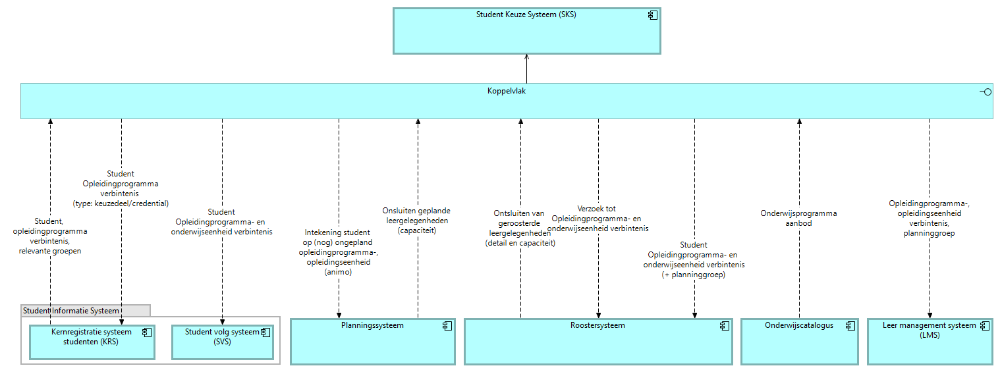

De view toont het koppelvlak van het studentkeuzesysteem: de optelsom van zijn koppelingen op de informatiestromen-hoofdplaat v1.7.


<!-- pagina-einde -->

### 3.8 Curriculum-ontwerptool (CO)

De curriculum-ontwerptool is waar onderwijsspecificaties ontstaan: ontwerpers werken er het curriculum uit en leveren het resultaat aan de onderwijscatalogus, die het vanaf daar distribueert. Zij staat daarmee aan het begin van de keten die dit pakket beschrijft, één stap voor de drie koppelingen vanuit de catalogus.

Dit pakket specificeert de koppeling van de curriculum-ontwerptool naar de catalogus niet, en levert er dus nog geen endpoints voor op. Hoe beide zich tot elkaar verhouden is wel als besluit vastgelegd: de catalogus synchroniseert de aangeleverde specificatie en kan die federatief overnemen ([ADR 0020](../Referentiemateriaal/adr/0020-curriculumontwerp-onderwijscatalogus-happy-flow-synchronisatie-en-federatie-adopt-klonen.md)).


<!-- pagina-einde -->

## 4 Interactiepatronen

### 4.1 Interactiepatroon: onderwijscatalogus naar planning en roostering

Het interactiepatroon van deze koppeling: de systeem-naar-systeemberichten (machine-to-machine) tussen de onderwijscatalogus en het planningssysteem, met de sequentiediagrammen. Doel: per patroon laten zien welk berichtenpatroon het technisch implementeert en wat het oplevert, zonder de koppelingspecificatie te herhalen. De functionele eisen die het proces aan deze koppeling stelt staan als vertrekpunt in de eerste tabel; het interactieoverzicht legt per interactie het bericht, het patroon en de foutafhandeling vast, en de endpoints staan bij de [applicatiecomponent](#3-applicatiecomponenten) dat ze serveert.

#### 4.1.1 Plek in de keten

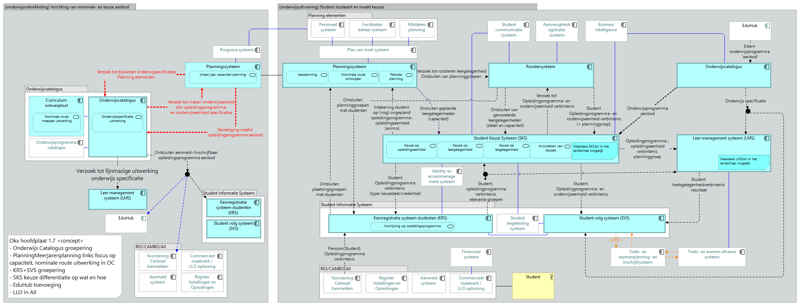

De uitsnede komt uit de informatiestromen-hoofdplaat v1.7 (richtinggevend; de legenda draagt nog "concept"), met deze koppeling gemarkeerd. De koppelvlakken van beide componenten staan bij de [onderwijscatalogus](#32-onderwijscatalogus-oc) en het [planningssysteem](#33-planningssysteem-p).

#### 4.1.2 Functionele eisen

| Id | Functionele eis | Interactie | Story |
|---|---|---|---|
| <a id="functionele-eis-0001"></a>functionele-eis-0001 | De onderwijscatalogus moet het planningssysteem kunnen laten weten dat een specificatie gereed is om te plannen, en het planningssysteem moet daarop een opleidingsaanbod met referentie kunnen terugleveren | [Notify-then-pull: opleidingsaanbod aanmaken](#417-notify-then-pull-opleidingsaanbod-aanmaken) | [story-0006](#story-0006); [story-0007](#story-0007) |
| <a id="functionele-eis-0002"></a>functionele-eis-0002 | Het planningssysteem moet de planning kunnen bijwerken wanneer een specificatie wijzigt, zonder verplicht de volledige structuur opnieuw te ontvangen | [Notify-then-pull: opleidingsaanbod herplannen](#418-notify-then-pull-opleidingsaanbod-herplannen) | geen |
| <a id="functionele-eis-0003"></a>functionele-eis-0003 | De onderwijscatalogus moet kunnen weten wanneer een specificatie voor een of meer cohorten niet planbaar blijkt in een schooljaar, inclusief de reden | [Asynchrone statusmelding: planning niet gelukt](#419-asynchrone-statusmelding-planning-niet-gelukt) | [story-0007](#story-0007) |
| <a id="functionele-eis-0004"></a>functionele-eis-0004 | Een afgeronde planning moet beschermd zijn tegen een specificatiewijziging die er ongecontroleerd doorheen breekt | [Acceptatietoets bij late wijziging](#4110-acceptatietoets-bij-late-wijziging) | [story-0002](#story-0002) |
| <a id="functionele-eis-0005"></a>functionele-eis-0005 | De onderwijscatalogus moet een statuswijziging kunnen melden die niet aan een nieuwe versie hangt, los van het wijzigingsproces | [Asynchrone statusmelding: specificatiestatus gewijzigd](#4111-asynchrone-statusmelding-specificatiestatus-gewijzigd) | geen |
| <a id="functionele-eis-0006"></a>functionele-eis-0006 | Beide partijen moeten na een gemist event de informatie alsnog kunnen ophalen | [Reconciliatie na gemist event](#4112-reconciliatie-na-gemist-event) | [story-0011](#story-0011) |
| <a id="functionele-eis-0007"></a>functionele-eis-0007 | Beide partijen moeten een afleveradres kunnen vastleggen voordat events afgeleverd worden | [Abonnement registreren](#4113-abonnement-registreren) | [story-0010](#story-0010) |

#### 4.1.3 Procesbeeld

Twee gedeelde principes bepalen het verkeer over deze koppeling. **Resource-eigenaarschap** ([U3](#73-u3-resource-eigenaarschap)): de onderwijscatalogus bezit de onderwijsspecificaties, het planningssysteem het onderwijsaanbod, het roostersysteem het rooster. **Notify-then-pull** ([U4](#74-u4-notify-then-pull)): de bezitter publiceert een dun event met een referentie, de consument haalt de resource op wanneer het hem uitkomt. Het is dus geen pull-only model; het event is de trigger.

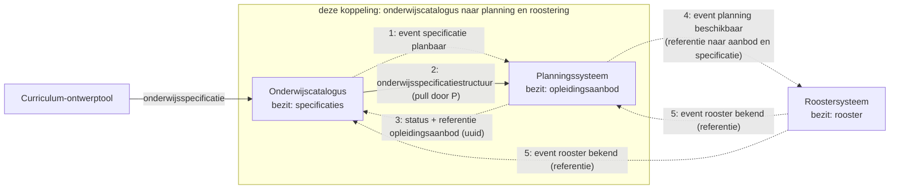
```mermaid
flowchart LR
    CO["Curriculum-ontwerptool"] -- "onderwijsspecificatie" --> OC["Onderwijscatalogus<br/>bezit: specificaties"]
    subgraph KOP["deze koppeling: onderwijscatalogus naar planning en roostering"]
        OC -. "1: event specificatie planbaar" .-> P["Planningssysteem<br/>bezit: opleidingsaanbod"]
        OC -- "2: onderwijsspecificatiestructuur (pull door P)" --> P
        P -. "3: status + referentie opleidingsaanbod (uuid)" .-> OC
    end
    P -. "4: event planning beschikbaar<br/>(referentie naar aanbod en specificatie)" .-> R["Roostersysteem<br/>bezit: rooster"]
    R -. "5: event rooster bekend (referentie)" .-> OC
    R -. "5: event rooster bekend (referentie)" .-> P
```

Wat het diagram niet toont: het planningssysteem bouwt de planning **asynchroon** op, binnen de regels uit de specificatie (voorwaarden vooraf, locatie, periode). De uitkomst, gelukt of niet gelukt, komt terug als status met een referentie naar het `opleidingsaanbod`; de aanbod-instantie zelf blijft bij planning en wordt alleen opgehaald als de catalogus die wil inzien. Stap 4 en 5 liggen buiten deze koppeling en staan er ter illustratie van hetzelfde patroon (§5.5).

#### 4.1.4 Interactieoverzicht

De interacties op deze koppeling, met per interactie het messaging-patroon. Betrouwbaarheidseisen volgen [ADR 0018](../Referentiemateriaal/adr/0018-enterprise-messaging-patronen-voor-betrouwbare-koppelvlakken.md). De events zijn dunne notificaties ([Event Message](https://www.enterpriseintegrationpatterns.com/patterns/messaging/EventMessage.html)): ze dragen de aanleiding (id en versie), niet de inhoud.
Wat hier wordt vastgelegd is het **bericht**, niet het **kanaal**: hoe het bericht bij de ontvanger komt is een inrichtingskeuze van instelling en leverancier, binnen de vier eigenschappen die [ADR 0018](../Referentiemateriaal/adr/0018-enterprise-messaging-patronen-voor-betrouwbare-koppelvlakken.md) eist. Zie [uitgangspunt U5](#75-u5-bericht-versus-kanaal).

I1 tot en met I5 zijn uitgewerkt in §5 tot sequentiediagrammen. I6 tot en met I8 zijn nodig om I1, I3 en I4 in productie te kunnen laten werken (statuswijziging los van versie, hersynchronisatie na een verloren event, en de abonnementen waar de webhook-events I1/I3/I4 op leunen) en horen daarom net zo goed bij deze koppeling; ze volgen het patroon van de interactie die ze het dichtst benaderen (I6 spiegelt I4, I7 en I8 spiegelen I2/I5).

| # | Interactie | Initiator | Patroon | Synchroniciteit | Gedrag bij dubbele ontvangst | Foutafhandeling |
|---|---|---|---|---|---|---|
| I1 | Specificatie planbaar melden | OC | [Event Message](https://www.enterpriseintegrationpatterns.com/patterns/messaging/EventMessage.html) (id + versie) | Asynchroon | Geen effect: ontvanger herkent event-id ([Idempotent Receiver](https://www.enterpriseintegrationpatterns.com/patterns/messaging/IdempotentReceiver.html)) | [Guaranteed Delivery](https://www.enterpriseintegrationpatterns.com/patterns/messaging/GuaranteedDelivery.html); [Dead Letter Channel](https://www.enterpriseintegrationpatterns.com/patterns/messaging/DeadLetterChannel.html) |
| I2 | Onderwijsspecificatiestructuur of delta ophalen | P | [Request-Reply](https://www.enterpriseintegrationpatterns.com/patterns/messaging/RequestReply.html) (GET, alleen-lezen) | Synchroon | Geen effect (alleen-lezen) | HTTP-foutcodes, client bepaalt retry |
| I3 | Verwerkingsstatus melden, met referentie naar het `opleidingsaanbod` | P | [Event Message](https://www.enterpriseintegrationpatterns.com/patterns/messaging/EventMessage.html) (status: ontvangen/gestart, afgekeurd, gelukt, niet gelukt) | Asynchroon | Geen effect: status-id | Retry met backoff, daarna [Dead Letter Channel](https://www.enterpriseintegrationpatterns.com/patterns/messaging/DeadLetterChannel.html) |
| I4 | Specificatiewijziging melden | OC | [Event Message](https://www.enterpriseintegrationpatterns.com/patterns/messaging/EventMessage.html) (object-id, oude en nieuwe versie, wijzigingsklasse) | Asynchroon | Geen effect: event-id | [Guaranteed Delivery](https://www.enterpriseintegrationpatterns.com/patterns/messaging/GuaranteedDelivery.html); [Dead Letter Channel](https://www.enterpriseintegrationpatterns.com/patterns/messaging/DeadLetterChannel.html) |
| I5 | `opleidingsaanbod` ophalen | OC (of R) | [Request-Reply](https://www.enterpriseintegrationpatterns.com/patterns/messaging/RequestReply.html) op referentie (GET uuid, alleen-lezen) | Synchroon | Geen effect (alleen-lezen) | HTTP-foutcodes |
| I6 | Specificatiestatus gewijzigd, los van versie (bv. `gepubliceerd` naar `gedeactiveerd`, [regels bij de schema's](#62-regels-bij-de-schemas)) | OC | [Event Message](https://www.enterpriseintegrationpatterns.com/patterns/messaging/EventMessage.html) (object-id, oude status, nieuwe status) | Asynchroon | Geen effect: event-id ([Idempotent Receiver](https://www.enterpriseintegrationpatterns.com/patterns/messaging/IdempotentReceiver.html)) | [Guaranteed Delivery](https://www.enterpriseintegrationpatterns.com/patterns/messaging/GuaranteedDelivery.html); [Dead Letter Channel](https://www.enterpriseintegrationpatterns.com/patterns/messaging/DeadLetterChannel.html) |
| I7 | Reconciliatie: gepubliceerde specificaties of aanbod-instanties opnieuw opvragen na een event in de Dead Letter Channel | OC of P | [Request-Reply](https://www.enterpriseintegrationpatterns.com/patterns/messaging/RequestReply.html) (GET, lijst-/queryoperatie, alleen-lezen) | Synchroon | Geen effect (alleen-lezen) | HTTP-foutcodes |
| I8 | Abonnement registreren voor de events I1, I3, I4 en I6 | OC en P (over en weer, elk voor de events die de ander van hem ontvangt) | [Request-Reply](https://www.enterpriseintegrationpatterns.com/patterns/messaging/RequestReply.html) (registratie: callback-URL + event-typen) | Synchroon | Idempotent op callback-URL + event-type: herregistratie overschrijft, geen dubbele aflevering | HTTP-foutcodes |

Referentie voor de patroontaal: [Enterprise Integration Patterns, Messaging](https://www.enterpriseintegrationpatterns.com/patterns/messaging/). De koppelingspecificatie legt de patronen op dit niveau vast; implementatiekeuzes (bus, broker, polling) schrijft ze niet voor.

Buiten deze koppeling, maar wel tussen dezelfde twee systemen: capaciteitsterugkoppeling en het door P annuleren van een reeds gepland aanbod buiten de I4-flow. Bewust uitgesteld.

Context, buiten deze koppeling maar zelfde patroon: P meldt R "planning beschikbaar" (referenties), R meldt OC en P "rooster bekend" (referentie). Zie §5.5.

Ordening: per `specificatieId` blijft de berichtvolgorde behouden (zelfde sleutel, zelfde volgorde, [ADR 0018](../Referentiemateriaal/adr/0018-enterprise-messaging-patronen-voor-betrouwbare-koppelvlakken.md)).

#### 4.1.5 Berichtgedrag

Dat is een voorbeeld van een kanaal, geen voorschrift: een bus, broker of cloud-pubsubdienst mag het vervangen zolang die de vier eigenschappen uit §3 levert. Het bericht blijft in alle gevallen gelijk.

- Alle GET's zijn alleen-lezen en zonder neveneffect; herhaald aanroepen geeft hetzelfde resultaat.
- Event-aflevering: ontvanger bevestigt met 200; bij uitblijven daarvan herhaalt de verzender met backoff en daarna [Dead Letter Channel](https://www.enterpriseintegrationpatterns.com/patterns/messaging/DeadLetterChannel.html). Dubbele aflevering is onschadelijk door het event-id ([Idempotent Receiver](https://www.enterpriseintegrationpatterns.com/patterns/messaging/IdempotentReceiver.html)).
- `POST /abonnementen`: idempotent op de combinatie callback-URL + event-type. Een herhaalde registratie overschrijft de vorige, geen dubbel geregistreerde aflevering. Alleen bestemd voor de webhook-events (I1, I3, I4, I6); vervalt zodra event-aflevering via bus of broker loopt (§3).
- `/onderwijsspecificaties` en `/onderwijsaanbod` (zonder `{id}`) zijn de reconciliatie-route: bedoeld voor herstel na een event in de Dead Letter Channel, niet voor reguliere polling. De reguliere flow blijft event-gedreven (I1, I3, I4, I6).
- Mogelijke uitbreidingen (v-next): filter op `specificatieType` of deelstructuur-selectie bij het ophalen van de structuur, paginering bij grote structuren.

#### 4.1.6 Interactiepatronen

| Interactiepatroon | Doel | Trigger | Initiator | Interacties (§3) | Endpoints (§7) | Sequentiediagram |
|---|---|---|---|---|---|---|
| Notify-then-pull: opleidingsaanbod aanmaken | Een gepubliceerde specificatie omzetten in een planbaar `opleidingsaanbod`, met een referentie terug naar de onderwijscatalogus | Onderwijsspecificatie krijgt status `gepubliceerd` | Onderwijscatalogus | I1, I2, I3, (I5) | webhook `specificatie-planbaar`; `GET /onderwijsspecificaties/{id}`; webhook `verwerkingsstatus`; (`GET /onderwijsaanbod/{id}`) | [hieronder](#417-notify-then-pull-opleidingsaanbod-aanmaken) |
| Notify-then-pull: opleidingsaanbod herplannen | Een lopende planning laten volgen op een nieuwe specificatieversie, met delta of volledige structuur als keuze voor de ontvanger | Nieuwe versie van een specificatie die al in een manifest is vastgelegd | Onderwijscatalogus | I2, I3, I4 | `GET /onderwijsspecificaties/{id}/delta` of `GET /onderwijsspecificaties/{id}`; webhook `verwerkingsstatus`; webhook `specificatie-gewijzigd` | [hieronder](#418-notify-then-pull-opleidingsaanbod-herplannen) |
| Asynchrone statusmelding: planning niet gelukt | De onderwijscatalogus in kennis stellen dat een specificatie voor een of meer cohorten niet planbaar blijkt, met referentie en knelpunten, zonder de aanroep te blokkeren | Planproces bij het planningssysteem vindt geen geldige planning | Planningssysteem | I3, (I5) | webhook `verwerkingsstatus`; (`GET /onderwijsaanbod/{id}`) | [hieronder](#419-asynchrone-statusmelding-planning-niet-gelukt) |
| Acceptatietoets bij late wijziging | Een afgeronde planning beschermen tegen een wijziging die er ongecontroleerd doorheen breekt | Specificatiewijziging terwijl de planning al is afgerond | Onderwijscatalogus | I3, I4 | webhook `specificatie-gewijzigd`; webhook `verwerkingsstatus` | [hieronder](#4110-acceptatietoets-bij-late-wijziging) |
| Asynchrone statusmelding: specificatiestatus gewijzigd | De onderwijscatalogus een statuswijziging laten melden die los staat van een nieuwe versie, zodat het planningssysteem zijn afgeleide status kan bijwerken zonder herplanronde | Specificatie krijgt een nieuwe status buiten een versiewijziging om (bv. `gepubliceerd` naar `gedeactiveerd`) | Onderwijscatalogus | I6 | webhook `specificatie-status-gewijzigd` | [hieronder](#4111-asynchrone-statusmelding-specificatiestatus-gewijzigd) |
| Reconciliatie na gemist event | De gemiste informatie via een gewone opvraag herstellen na een event dat in de Dead Letter Channel is beland | Een I1-, I3-, I4- of I6-event is niet aangekomen | Onderwijscatalogus of Planningssysteem | I7 | `GET /onderwijsspecificaties` (op OC); `GET /onderwijsaanbod` (op P) | [hieronder](#4112-reconciliatie-na-gemist-event) |
| Abonnement registreren | Elke partij een callback-URL laten vastleggen voor de events die zij van de ander ontvangt, als voorwaarde voor I1, I3, I4 en I6 | Inrichting van de koppeling, of wijziging van de callback-URL | Onderwijscatalogus en Planningssysteem | I8 | `POST /abonnementen` (op OC en op P) | [hieronder](#4113-abonnement-registreren) |

#### 4.1.7 Notify-then-pull: opleidingsaanbod aanmaken

Doel: een gepubliceerde specificatie omzetten in een planbaar `opleidingsaanbod`, met een referentie terug naar de onderwijscatalogus. Trigger: onderwijsspecificatie krijgt status `gepubliceerd`. Initiator: Onderwijscatalogus. Interacties: I1, I2, I3, (I5).

Endpoints:

- [webhook `specificatie-planbaar` (I1)](#33-planningssysteem-p)
- [`GET /onderwijsspecificaties/{id}` (I2)](#32-onderwijscatalogus-oc)
- [webhook `verwerkingsstatus` (I3)](#32-onderwijscatalogus-oc)
- [`GET /onderwijsaanbod/{id}` (I5, optioneel)](#33-planningssysteem-p)

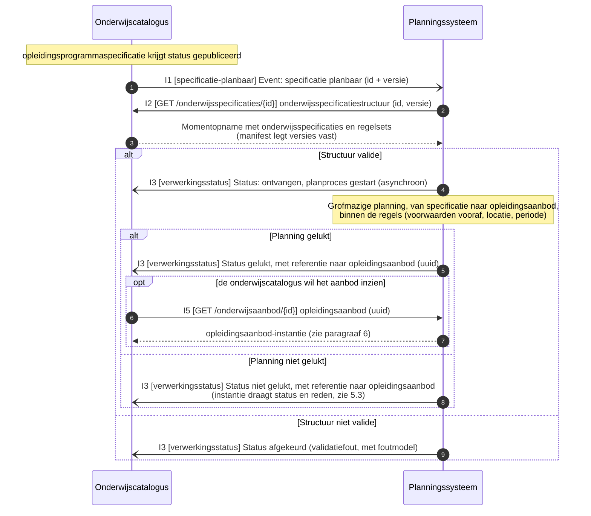
```mermaid
sequenceDiagram
    autonumber
    participant Onderwijscatalogus
    participant Planningssysteem

    Note over Onderwijscatalogus: opleidingsprogrammaspecificatie krijgt status gepubliceerd
    Onderwijscatalogus-)Planningssysteem: I1 [specificatie-planbaar] Event: specificatie planbaar (id + versie)
    Planningssysteem->>Onderwijscatalogus: I2 [GET /onderwijsspecificaties/{id}] onderwijsspecificatiestructuur (id, versie)
    Onderwijscatalogus-->>Planningssysteem: Momentopname met onderwijsspecificaties en regelsets<br/>(manifest legt versies vast)
    alt Structuur valide
        Planningssysteem-)Onderwijscatalogus: I3 [verwerkingsstatus] Status: ontvangen, planproces gestart (asynchroon)
        Note over Planningssysteem: Grofmazige planning, van specificatie naar opleidingsaanbod,<br/>binnen de regels (voorwaarden vooraf, locatie, periode)
        alt Planning gelukt
            Planningssysteem-)Onderwijscatalogus: I3 [verwerkingsstatus] Status gelukt, met referentie naar opleidingsaanbod (uuid)
            opt de onderwijscatalogus wil het aanbod inzien
                Onderwijscatalogus->>Planningssysteem: I5 [GET /onderwijsaanbod/{id}] opleidingsaanbod (uuid)
                Planningssysteem-->>Onderwijscatalogus: opleidingsaanbod-instantie (zie paragraaf 6)
            end
        else Planning niet gelukt
            Planningssysteem-)Onderwijscatalogus: I3 [verwerkingsstatus] Status niet gelukt, met referentie naar opleidingsaanbod<br/>(instantie draagt status en reden, zie 5.3)
        end
    else Structuur niet valide
        Planningssysteem-)Onderwijscatalogus: I3 [verwerkingsstatus] Status afgekeurd (validatiefout, met foutmodel)
    end
```

#### 4.1.8 Notify-then-pull: opleidingsaanbod herplannen

Doel: een lopende planning laten volgen op een nieuwe specificatieversie, met delta of volledige structuur als keuze voor de ontvanger. Trigger: nieuwe versie van een specificatie die al in een manifest is vastgelegd. Initiator: Onderwijscatalogus. Interacties: I2, I3, I4.

Endpoints:

- [`GET /onderwijsspecificaties/{id}/delta` of `GET /onderwijsspecificaties/{id}` (I2)](#32-onderwijscatalogus-oc)
- [webhook `verwerkingsstatus` (I3)](#32-onderwijscatalogus-oc)
- [webhook `specificatie-gewijzigd` (I4)](#33-planningssysteem-p)

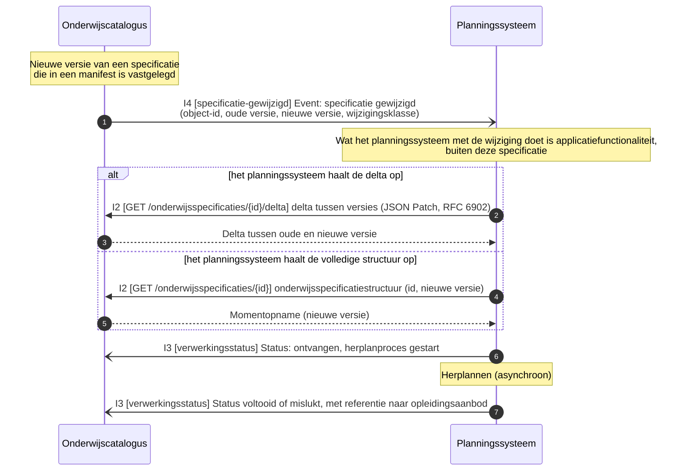
```mermaid
sequenceDiagram
    autonumber
    participant Onderwijscatalogus
    participant Planningssysteem

    Note over Onderwijscatalogus: Nieuwe versie van een specificatie<br/>die in een manifest is vastgelegd
    Onderwijscatalogus-)Planningssysteem: I4 [specificatie-gewijzigd] Event: specificatie gewijzigd<br/>(object-id, oude versie, nieuwe versie, wijzigingsklasse)
    Note over Planningssysteem: Wat het planningssysteem met de wijziging doet is applicatiefunctionaliteit,<br/>buiten deze specificatie
    alt het planningssysteem haalt de delta op
        Planningssysteem->>Onderwijscatalogus: I2 [GET /onderwijsspecificaties/{id}/delta] delta tussen versies (JSON Patch, RFC 6902)
        Onderwijscatalogus-->>Planningssysteem: Delta tussen oude en nieuwe versie
    else het planningssysteem haalt de volledige structuur op
        Planningssysteem->>Onderwijscatalogus: I2 [GET /onderwijsspecificaties/{id}] onderwijsspecificatiestructuur (id, nieuwe versie)
        Onderwijscatalogus-->>Planningssysteem: Momentopname (nieuwe versie)
    end
    Planningssysteem-)Onderwijscatalogus: I3 [verwerkingsstatus] Status: ontvangen, herplanproces gestart
    Note over Planningssysteem: Herplannen (asynchroon)
    Planningssysteem-)Onderwijscatalogus: I3 [verwerkingsstatus] Status voltooid of mislukt, met referentie naar opleidingsaanbod
```

#### 4.1.9 Asynchrone statusmelding: planning niet gelukt

Doel: de onderwijscatalogus in kennis stellen dat een specificatie voor een of meer cohorten niet planbaar blijkt, met referentie en knelpunten, zonder de aanroep te blokkeren. Trigger: planproces bij het planningssysteem vindt geen geldige planning. Initiator: Planningssysteem. Interacties: I3, (I5).

Endpoints:

- [webhook `verwerkingsstatus` (I3)](#32-onderwijscatalogus-oc)
- [`GET /onderwijsaanbod/{id}` (I5, optioneel)](#33-planningssysteem-p)

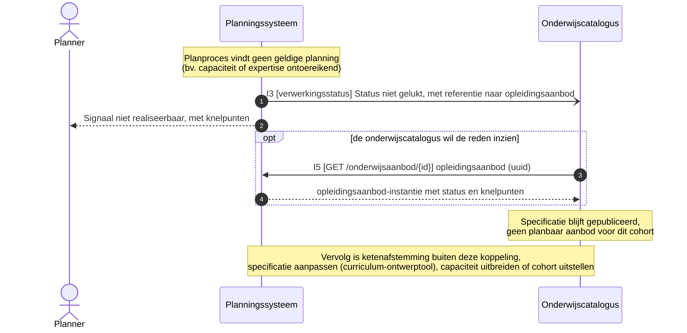
```mermaid
sequenceDiagram
    autonumber
    actor Planner
    participant Planningssysteem
    participant Onderwijscatalogus

    Note over Planningssysteem: Planproces vindt geen geldige planning<br/>(bv. capaciteit of expertise ontoereikend)
    Planningssysteem-)Onderwijscatalogus: I3 [verwerkingsstatus] Status niet gelukt, met referentie naar opleidingsaanbod
    Planningssysteem-->>Planner: Signaal niet realiseerbaar, met knelpunten
    opt de onderwijscatalogus wil de reden inzien
        Onderwijscatalogus->>Planningssysteem: I5 [GET /onderwijsaanbod/{id}] opleidingsaanbod (uuid)
        Planningssysteem-->>Onderwijscatalogus: opleidingsaanbod-instantie met status en knelpunten
    end
    Note over Onderwijscatalogus: Specificatie blijft gepubliceerd,<br/>geen planbaar aanbod voor dit cohort
    Note over Onderwijscatalogus,Planningssysteem: Vervolg is ketenafstemming buiten deze koppeling,<br/>specificatie aanpassen (curriculum-ontwerptool), capaciteit uitbreiden of cohort uitstellen
```

#### 4.1.10 Acceptatietoets bij late wijziging

Doel: een afgeronde planning beschermen tegen een wijziging die er ongecontroleerd doorheen breekt. Trigger: specificatiewijziging terwijl de planning al is afgerond. Initiator: Onderwijscatalogus. Interacties: I3, I4.

Endpoints:

- [webhook `specificatie-gewijzigd` (I4)](#33-planningssysteem-p)
- [webhook `verwerkingsstatus` (I3)](#32-onderwijscatalogus-oc)

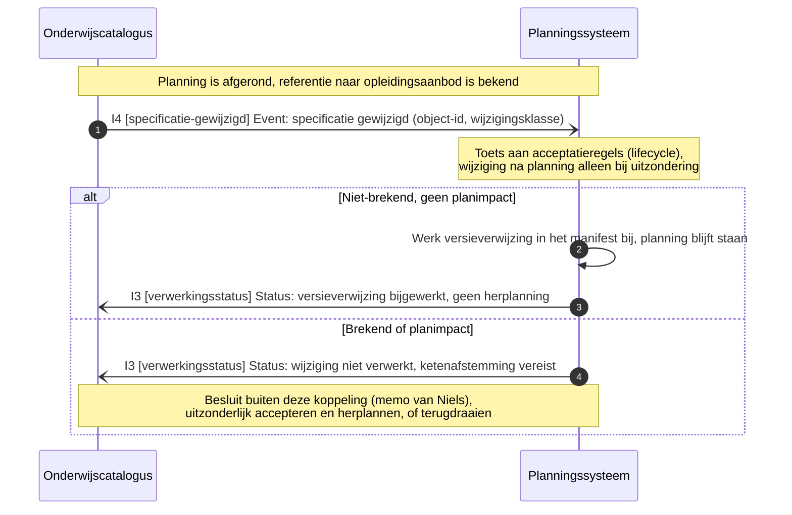
```mermaid
sequenceDiagram
    autonumber
    participant Onderwijscatalogus
    participant Planningssysteem

    Note over Onderwijscatalogus,Planningssysteem: Planning is afgerond, referentie naar opleidingsaanbod is bekend
    Onderwijscatalogus-)Planningssysteem: I4 [specificatie-gewijzigd] Event: specificatie gewijzigd (object-id, wijzigingsklasse)
    Note over Planningssysteem: Toets aan acceptatieregels (lifecycle),<br/>wijziging na planning alleen bij uitzondering
    alt Niet-brekend, geen planimpact
        Planningssysteem->>Planningssysteem: Werk versieverwijzing in het manifest bij, planning blijft staan
        Planningssysteem-)Onderwijscatalogus: I3 [verwerkingsstatus] Status: versieverwijzing bijgewerkt, geen herplanning
    else Brekend of planimpact
        Planningssysteem-)Onderwijscatalogus: I3 [verwerkingsstatus] Status: wijziging niet verwerkt, ketenafstemming vereist
        Note over Onderwijscatalogus,Planningssysteem: Besluit buiten deze koppeling (memo van Niels),<br/>uitzonderlijk accepteren en herplannen, of terugdraaien
    end
```

#### 4.1.11 Asynchrone statusmelding: specificatiestatus gewijzigd

Doel: de onderwijscatalogus een statuswijziging laten melden die los staat van een nieuwe versie, zodat het planningssysteem zijn afgeleide status kan bijwerken zonder herplanronde. Trigger: specificatie krijgt een nieuwe status buiten een versiewijziging om (bv. `gepubliceerd` naar `gedeactiveerd`, [regels bij de schema's](#62-regels-bij-de-schemas)). Initiator: Onderwijscatalogus. Interacties: I6. Voorbeeldgeval: een opleiding die voor een ouder cohort bewust niet meer wordt aangeboden is nog wel planbaar, maar wordt niet meer gepland; dat is deze statuswijziging (met archivering als vervolg), geen planningsfout uit de melding hierboven.

Endpoints:

- [webhook `specificatie-status-gewijzigd` (I6)](#33-planningssysteem-p)

Geen apart sequentiediagram in de koppelingspecificatie; I6 spiegelt daar het patroon van I4. Opgebouwd uit de interactiebeschrijving in §3.


```mermaid
sequenceDiagram
    autonumber
    participant Onderwijscatalogus
    participant Planningssysteem

    Note over Onderwijscatalogus: Specificatie krijgt een nieuwe status,<br/>los van de versie (bv. gepubliceerd naar gedeactiveerd)
    Onderwijscatalogus-)Planningssysteem: I6 [specificatie-status-gewijzigd] Event: specificatiestatus gewijzigd<br/>(object-id, oude status, nieuwe status)
    Note over Planningssysteem: Wat het planningssysteem met de statuswijziging doet is applicatiefunctionaliteit,<br/>buiten deze specificatie
```

#### 4.1.12 Reconciliatie na gemist event

Doel: de gemiste informatie via een gewone opvraag herstellen na een event dat in de Dead Letter Channel is beland, zonder op een herhaalde aflevering te wachten. Trigger: een I1-, I3-, I4- of I6-event is niet aangekomen. Initiator: Onderwijscatalogus of Planningssysteem. Interacties: I7.

Endpoints:

- [`GET /onderwijsspecificaties` (op OC)](#32-onderwijscatalogus-oc)
- [`GET /onderwijsaanbod` (op P)](#33-planningssysteem-p)

Geen apart sequentiediagram in de koppelingspecificatie; I7 spiegelt daar het patroon van I2/I5. Opgebouwd uit de interactiebeschrijving in §3 en de endpoints in §7.

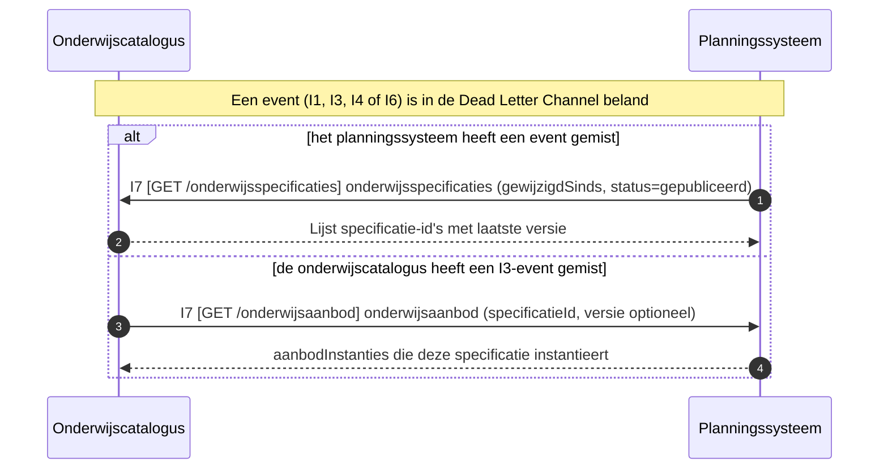
```mermaid
sequenceDiagram
    autonumber
    participant Onderwijscatalogus
    participant Planningssysteem

    Note over Onderwijscatalogus,Planningssysteem: Een event (I1, I3, I4 of I6) is in de Dead Letter Channel beland
    alt het planningssysteem heeft een event gemist
        Planningssysteem->>Onderwijscatalogus: I7 [GET /onderwijsspecificaties] onderwijsspecificaties (gewijzigdSinds, status=gepubliceerd)
        Onderwijscatalogus-->>Planningssysteem: Lijst specificatie-id's met laatste versie
    else de onderwijscatalogus heeft een I3-event gemist
        Onderwijscatalogus->>Planningssysteem: I7 [GET /onderwijsaanbod] onderwijsaanbod (specificatieId, versie optioneel)
        Planningssysteem-->>Onderwijscatalogus: aanbodInstanties die deze specificatie instantieert
    end
```

#### 4.1.13 Abonnement registreren

Doel: elke partij een callback-URL laten vastleggen voor de events die zij van de ander ontvangt, als voorwaarde voor de event-gedreven interacties (I1, I3, I4, I6). Trigger: inrichting van de koppeling, of wijziging van de callback-URL. Initiator: Onderwijscatalogus en Planningssysteem (over en weer, elk voor de events die de ander van hem ontvangt). Interacties: I8.

Endpoints:

- [`POST /abonnementen` (op OC en op P)](#33-planningssysteem-p)

Geen apart sequentiediagram in de koppelingspecificatie; I8 spiegelt daar het patroon van I2/I5. Opgebouwd uit de endpoints in §7.

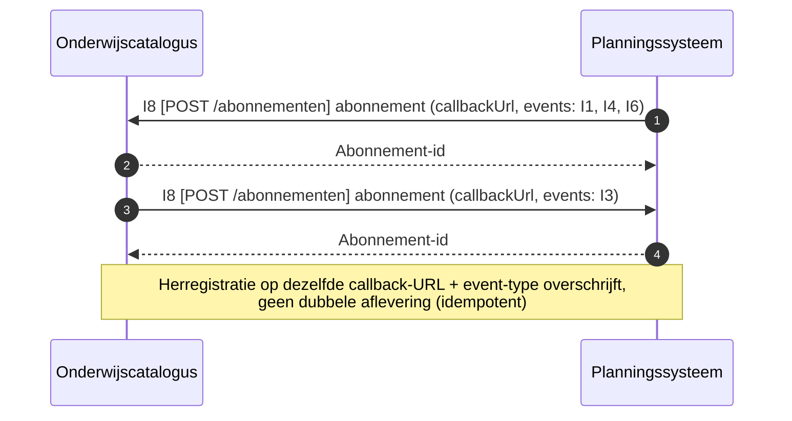
```mermaid
sequenceDiagram
    autonumber
    participant Onderwijscatalogus
    participant Planningssysteem

    Planningssysteem->>Onderwijscatalogus: I8 [POST /abonnementen] abonnement (callbackUrl, events: I1, I4, I6)
    Onderwijscatalogus-->>Planningssysteem: Abonnement-id
    Onderwijscatalogus->>Planningssysteem: I8 [POST /abonnementen] abonnement (callbackUrl, events: I3)
    Planningssysteem-->>Onderwijscatalogus: Abonnement-id
    Note over Onderwijscatalogus,Planningssysteem: Herregistratie op dezelfde callback-URL + event-type overschrijft,<br/>geen dubbele aflevering (idempotent)
```

#### 4.1.14 Context: doorwerking naar het roostersysteem

Buiten deze koppeling, en niet als vastgelegde interactie: het roostersysteem plaatst het geplande aanbod in tijd en ruimte. Het planningssysteem meldt dat de planning beschikbaar is, het roostersysteem haalt het aanbod op en meldt het rooster terug aan zowel planning als catalogus. Hetzelfde patroon van referentie plus event dus, opgenomen om te tonen dat de lijn doorloopt tot voorbij wat dit pakket specificeert. Het [roostersysteem](#36-roostersysteem-r) draagt daarom geen endpoints.

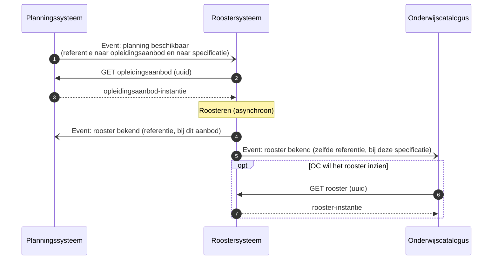
```mermaid
sequenceDiagram
    autonumber
    participant P as Planningssysteem
    participant R as Roostersysteem
    participant OC as Onderwijscatalogus

    P-)R: Event: planning beschikbaar<br/>(referentie naar opleidingsaanbod en naar specificatie)
    R->>P: GET opleidingsaanbod (uuid)
    P-->>R: opleidingsaanbod-instantie
    Note over R: Roosteren (asynchroon)
    R-)P: Event: rooster bekend (referentie, bij dit aanbod)
    R-)OC: Event: rooster bekend (zelfde referentie, bij deze specificatie)
    opt OC wil het rooster inzien
        OC->>R: GET rooster (uuid)
        R-->>OC: rooster-instantie
    end
```


<!-- pagina-einde -->

### 4.2 Interactiepatroon: onderwijscatalogus naar studentinformatiesysteem

Het interactiepatroon van deze koppeling: de systeem-naar-systeemberichten (machine-to-machine) tussen de onderwijscatalogus en het studentinformatiesysteem, met de sequentiediagrammen. Doel: per patroon laten zien welk berichtenpatroon het technisch implementeert en wat het oplevert, zonder de koppelingspecificatie te herhalen. De functionele eisen die het proces aan deze koppeling stelt staan als vertrekpunt in de eerste tabel; het interactieoverzicht legt per interactie het bericht, het patroon en de foutafhandeling vast, en de endpoints staan bij de [applicatiecomponent](#3-applicatiecomponenten) dat ze serveert.

#### 4.2.1 Plek in de keten

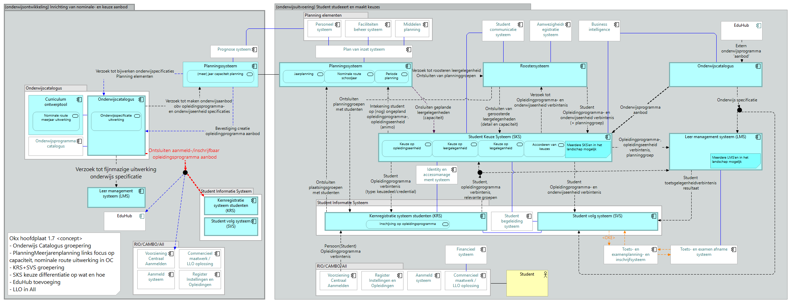

De uitsnede komt uit de informatiestromen-hoofdplaat v1.7 (richtinggevend; de legenda draagt nog "concept"), met deze koppeling gemarkeerd. De koppelvlakken van beide componenten staan bij de [onderwijscatalogus](#32-onderwijscatalogus-oc) en het [studentinformatiesysteem](#34-studentinformatiesysteem-sis).

#### 4.2.2 Functionele eisen

| Id | Functionele eis | Interactie | Story |
|---|---|---|---|
| <a id="functionele-eis-0008"></a>functionele-eis-0008 | De onderwijscatalogus moet het studentinformatiesysteem kunnen laten weten dat een specificatie en resultaatstructuur beschikbaar zijn om het nominale template en de resultaatstructuur op in te richten, en het studentinformatiesysteem moet daarop een inrichtingsstatus met referentie kunnen terugleveren | [Notify-then-pull: nominaal template en resultaatstructuur inrichten](#427-notify-then-pull-nominaal-template-en-resultaatstructuur-inrichten) | [story-0022](#story-0022); [story-0023](#story-0023) |
| <a id="functionele-eis-0009"></a>functionele-eis-0009 | Een ingerichte resultaatstructuur waarop al verbintenissen lopen moet beschermd zijn tegen een examenplanwijziging die er ongecontroleerd doorheen breekt | [Acceptatietoets bij wijziging examenplan](#428-acceptatietoets-bij-wijziging-examenplan) | [story-0020](#story-0020) |

#### 4.2.3 Procesbeeld

**Resource-eigenaarschap** ([U3](#73-u3-resource-eigenaarschap)): de onderwijscatalogus bezit de specificaties en de resultaatstructuren, het studentinformatiesysteem de verbintenissen, individuele structuren, voortgang en resultaten. **Notify-then-pull** ([U4](#74-u4-notify-then-pull)): de catalogus meldt, het studentinformatiesysteem haalt op.

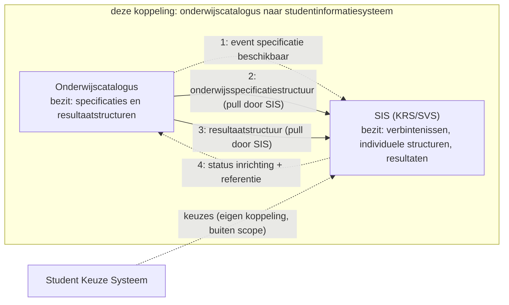
```mermaid
flowchart LR
    OC["Onderwijscatalogus<br/>bezit: specificaties en resultaatstructuren"]
    subgraph KOP["deze koppeling: onderwijscatalogus naar studentinformatiesysteem"]
        OC -. "1: event specificatie beschikbaar" .-> SIS["SIS (KRS/SVS)<br/>bezit: verbintenissen, individuele structuren, resultaten"]
        OC -- "2: onderwijsspecificatiestructuur (pull door SIS)" --> SIS
        OC -- "3: resultaatstructuur (pull door SIS)" --> SIS
        SIS -. "4: status inrichting + referentie" .-> OC
    end
    SKS["Student Keuze Systeem"] -. "keuzes (eigen koppeling, buiten scope)" .-> SIS
```

Wat het diagram niet toont: het studentinformatiesysteem haalt twee dingen op, de specificatiestructuur en de resultaatstructuur, en richt daarmee het **nominale template** in plus de mapping van welke toetsonderdeelresultaten welke leeruitkomsten afdichten ([ADR 0022](../Referentiemateriaal/adr/0022-resultaatbegrippen-conform-rosa-koi.md)). Bij een wijziging draagt het event een wijzigingsklasse mee. Voor het examenplan gelden daarbij de strengste acceptatieregels: lopende verbintenissen mogen niet ongecontroleerd geraakt worden.

#### 4.2.4 Interactieoverzicht

De interacties op deze koppeling, met per interactie het messaging-patroon, in dezelfde patroontaal als de koppeling met planning ([Enterprise Integration Patterns, Messaging](https://www.enterpriseintegrationpatterns.com/patterns/messaging/)).
Wat hier wordt vastgelegd is het **bericht**, niet het **kanaal**: hoe het bericht bij de ontvanger komt is een inrichtingskeuze van instelling en leverancier, binnen de vier eigenschappen die [ADR 0018](../Referentiemateriaal/adr/0018-enterprise-messaging-patronen-voor-betrouwbare-koppelvlakken.md) eist. Zie [uitgangspunt U5](#75-u5-bericht-versus-kanaal).

| # | Interactie | Initiator | Patroon | Synchroniciteit | Gedrag bij dubbele ontvangst | Foutafhandeling |
|---|---|---|---|---|---|---|
| S1 | Specificatie en resultaatstructuur beschikbaar melden | OC | [Event Message](https://www.enterpriseintegrationpatterns.com/patterns/messaging/EventMessage.html) (id + versie) | Asynchroon | Geen effect: event-id ([Idempotent Receiver](https://www.enterpriseintegrationpatterns.com/patterns/messaging/IdempotentReceiver.html)) | [Guaranteed Delivery](https://www.enterpriseintegrationpatterns.com/patterns/messaging/GuaranteedDelivery.html); [Dead Letter Channel](https://www.enterpriseintegrationpatterns.com/patterns/messaging/DeadLetterChannel.html) |
| S2 | Onderwijsspecificatiestructuur of delta ophalen | SIS | [Request-Reply](https://www.enterpriseintegrationpatterns.com/patterns/messaging/RequestReply.html) (GET, alleen-lezen) | Synchroon | Geen effect (alleen-lezen) | HTTP-foutcodes, client bepaalt retry |
| S3 | Resultaatstructuur ophalen | SIS | [Request-Reply](https://www.enterpriseintegrationpatterns.com/patterns/messaging/RequestReply.html) (GET, alleen-lezen) | Synchroon | Geen effect (alleen-lezen) | HTTP-foutcodes |
| S4 | Inrichtingsstatus melden, met referentie naar de inrichting | SIS | [Event Message](https://www.enterpriseintegrationpatterns.com/patterns/messaging/EventMessage.html) (status: ontvangen/gestart, afgekeurd, ingericht, niet ingericht) | Asynchroon | Geen effect: status-id | Retry met backoff, daarna [Dead Letter Channel](https://www.enterpriseintegrationpatterns.com/patterns/messaging/DeadLetterChannel.html) |
| S5 | Wijziging specificatie of resultaatstructuur melden | OC | [Event Message](https://www.enterpriseintegrationpatterns.com/patterns/messaging/EventMessage.html) (object-id, oude en nieuwe versie, wijzigingsklasse) | Asynchroon | Geen effect: event-id | [Guaranteed Delivery](https://www.enterpriseintegrationpatterns.com/patterns/messaging/GuaranteedDelivery.html); [Dead Letter Channel](https://www.enterpriseintegrationpatterns.com/patterns/messaging/DeadLetterChannel.html) |

#### 4.2.5 Berichtgedrag

Dat is een voorbeeld van een kanaal, geen voorschrift: een bus, broker of cloud-pubsubdienst mag het vervangen zolang die de vier eigenschappen uit §3 levert. Het bericht blijft in alle gevallen gelijk.

- Alle GET's zijn alleen-lezen en zonder neveneffect; herhaald aanroepen geeft hetzelfde resultaat.
- Event-aflevering: ontvanger bevestigt met 200; bij uitblijven daarvan herhaalt de verzender met backoff en daarna [Dead Letter Channel](https://www.enterpriseintegrationpatterns.com/patterns/messaging/DeadLetterChannel.html). Dubbele aflevering is onschadelijk door het event-id ([Idempotent Receiver](https://www.enterpriseintegrationpatterns.com/patterns/messaging/IdempotentReceiver.html)).
- Registratie van een callback-URL, zoals `POST /abonnementen` bij de koppeling met planning (I8), is voor deze koppeling nog geen eigen interactie in §3; zolang die er niet is, is het afleveradres een inrichtingskeuze tussen OC en SIS, buiten dit document.
- Mogelijke uitbreidingen (v-next): paginering bij grote structuren.

#### 4.2.6 Interactiepatronen

| Interactiepatroon | Doel | Trigger | Initiator | Interacties (§3) | Endpoints (§7) | Sequentiediagram |
|---|---|---|---|---|---|---|
| Notify-then-pull: nominaal template en resultaatstructuur inrichten | Een gepubliceerde specificatie en examenplanspecificatie omzetten in een ingericht nominaal template en resultaatstructuur bij het studentinformatiesysteem | Onderwijsspecificatie en examenplanspecificatie krijgen status `gepubliceerd` | Onderwijscatalogus | S1, S2, S3, S4 | webhook `specificatie-en-resultaatstructuur-beschikbaar`; `GET /onderwijsspecificaties/{id}`; `GET /examenplanspecificaties/{id}`; webhook `inrichtingsstatus` | [hieronder](#427-notify-then-pull-nominaal-template-en-resultaatstructuur-inrichten) |
| Acceptatietoets bij wijziging examenplan | Lopende verbintenissen beschermen tegen een examenplanwijziging die er ongecontroleerd doorheen breekt | Examenplanspecificatie wijzigt terwijl er al verbintenissen lopen | Onderwijscatalogus | S5 | webhook `examenplanspecificatie-gewijzigd`; webhook `inrichtingsstatus` | [hieronder](#428-acceptatietoets-bij-wijziging-examenplan) |

#### 4.2.7 Notify-then-pull: nominaal template en resultaatstructuur inrichten

Doel: een gepubliceerde specificatie en examenplanspecificatie omzetten in een ingericht nominaal template en resultaatstructuur bij het studentinformatiesysteem. Trigger: onderwijsspecificatie en examenplanspecificatie krijgen status `gepubliceerd`. Initiator: Onderwijscatalogus. Interacties: S1, S2, S3, S4.

Endpoints:

- [webhook `specificatie-en-resultaatstructuur-beschikbaar` (S1)](#34-studentinformatiesysteem-sis)
- [`GET /onderwijsspecificaties/{id}` (S2)](#32-onderwijscatalogus-oc)
- [`GET /examenplanspecificaties/{id}` (S3)](#32-onderwijscatalogus-oc)
- [webhook `inrichtingsstatus` (S4)](#32-onderwijscatalogus-oc)

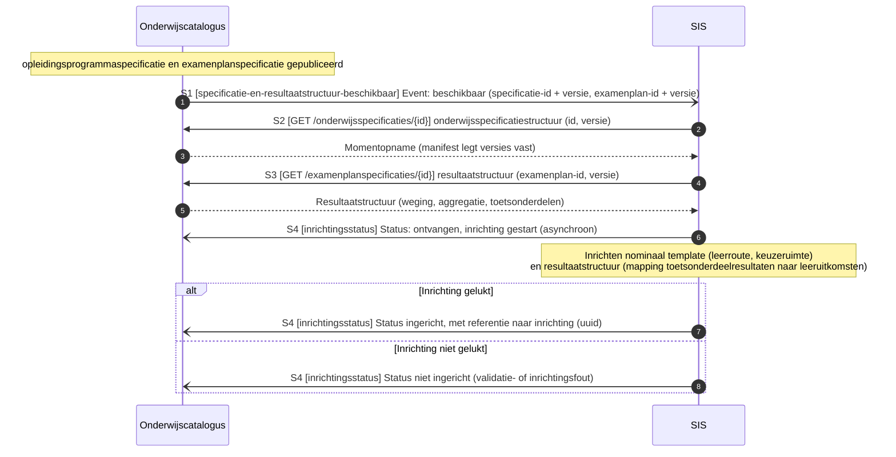
```mermaid
sequenceDiagram
    autonumber
    participant Onderwijscatalogus
    participant SIS

    Note over Onderwijscatalogus: opleidingsprogrammaspecificatie en examenplanspecificatie gepubliceerd
    Onderwijscatalogus-)SIS: S1 [specificatie-en-resultaatstructuur-beschikbaar] Event: beschikbaar (specificatie-id + versie, examenplan-id + versie)
    SIS->>Onderwijscatalogus: S2 [GET /onderwijsspecificaties/{id}] onderwijsspecificatiestructuur (id, versie)
    Onderwijscatalogus-->>SIS: Momentopname (manifest legt versies vast)
    SIS->>Onderwijscatalogus: S3 [GET /examenplanspecificaties/{id}] resultaatstructuur (examenplan-id, versie)
    Onderwijscatalogus-->>SIS: Resultaatstructuur (weging, aggregatie, toetsonderdelen)
    SIS-)Onderwijscatalogus: S4 [inrichtingsstatus] Status: ontvangen, inrichting gestart (asynchroon)
    Note over SIS: Inrichten nominaal template (leerroute, keuzeruimte)<br/>en resultaatstructuur (mapping toetsonderdeelresultaten naar leeruitkomsten)
    alt Inrichting gelukt
        SIS-)Onderwijscatalogus: S4 [inrichtingsstatus] Status ingericht, met referentie naar inrichting (uuid)
    else Inrichting niet gelukt
        SIS-)Onderwijscatalogus: S4 [inrichtingsstatus] Status niet ingericht (validatie- of inrichtingsfout)
    end
```

#### 4.2.8 Acceptatietoets bij wijziging examenplan

Doel: lopende verbintenissen beschermen tegen een examenplanwijziging die er ongecontroleerd doorheen breekt. Trigger: examenplanspecificatie wijzigt terwijl er al verbintenissen lopen. Initiator: Onderwijscatalogus. Interacties: S5.

Endpoints:

- [webhook `examenplanspecificatie-gewijzigd` (S5)](#34-studentinformatiesysteem-sis)
- [webhook `inrichtingsstatus` (S4)](#32-onderwijscatalogus-oc)

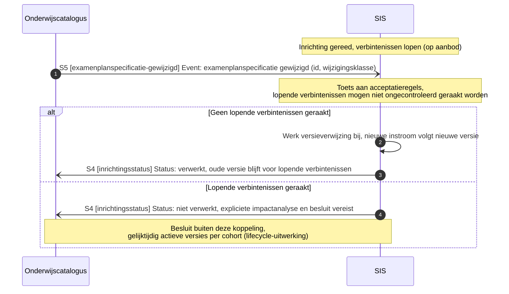
```mermaid
sequenceDiagram
    autonumber
    participant Onderwijscatalogus
    participant SIS

    Note over SIS: Inrichting gereed, verbintenissen lopen (op aanbod)
    Onderwijscatalogus-)SIS: S5 [examenplanspecificatie-gewijzigd] Event: examenplanspecificatie gewijzigd (id, wijzigingsklasse)
    Note over SIS: Toets aan acceptatieregels,<br/>lopende verbintenissen mogen niet ongecontroleerd geraakt worden
    alt Geen lopende verbintenissen geraakt
        SIS->>SIS: Werk versieverwijzing bij, nieuwe instroom volgt nieuwe versie
        SIS-)Onderwijscatalogus: S4 [inrichtingsstatus] Status: verwerkt, oude versie blijft voor lopende verbintenissen
    else Lopende verbintenissen geraakt
        SIS-)Onderwijscatalogus: S4 [inrichtingsstatus] Status: niet verwerkt, expliciete impactanalyse en besluit vereist
        Note over Onderwijscatalogus,SIS: Besluit buiten deze koppeling,<br/>gelijktijdig actieve versies per cohort (lifecycle-uitwerking)
    end
```


<!-- pagina-einde -->

### 4.3 Interactiepatroon: onderwijscatalogus naar leermanagementsysteem

Het interactiepatroon van deze koppeling: de systeem-naar-systeemberichten (machine-to-machine) tussen de onderwijscatalogus en het leermanagementsysteem, met de sequentiediagrammen. Doel: per patroon laten zien welk berichtenpatroon het technisch implementeert en wat het oplevert, zonder de koppelingspecificatie te herhalen. De functionele eisen die het proces aan deze koppeling stelt staan als vertrekpunt in de eerste tabel; het interactieoverzicht legt per interactie het bericht, het patroon en de foutafhandeling vast, en de endpoints staan bij de [applicatiecomponent](#3-applicatiecomponenten) dat ze serveert.

#### 4.3.1 Plek in de keten

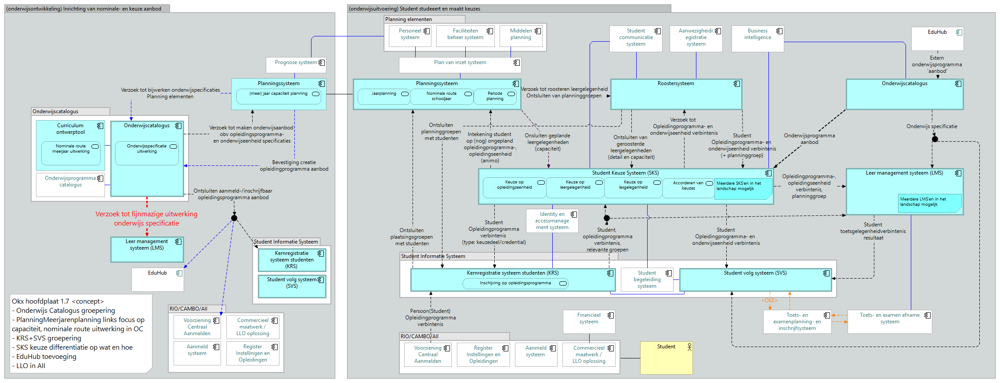

De uitsnede komt uit de informatiestromen-hoofdplaat v1.7 (richtinggevend; de legenda draagt nog "concept"), met deze koppeling gemarkeerd. De koppelvlakken van beide componenten staan bij de [onderwijscatalogus](#32-onderwijscatalogus-oc) en het [leermanagementsysteem](#35-leermanagementsysteem-lms).

#### 4.3.2 Functionele eisen

| Id | Functionele eis | Interactie | Story |
|---|---|---|---|
| <a id="functionele-eis-0010"></a>functionele-eis-0010 | De onderwijscatalogus moet het leermanagementsysteem kunnen laten weten dat een specificatie beschikbaar is om de leeromgeving op in te richten, en het leermanagementsysteem moet daarop een inrichtingsstatus met referentie kunnen terugleveren | [Notify-then-pull: leeromgeving inrichten en leermiddelkoppeling melden](#437-notify-then-pull-leeromgeving-inrichten-en-leermiddelkoppeling-melden) | geen |
| <a id="functionele-eis-0011"></a>functionele-eis-0011 | Het leermanagementsysteem moet een leermiddelkoppeling die het heeft gelegd aan de onderwijscatalogus kunnen melden, zodat die de leermiddelen bij het aanbod kan tonen | [Notify-then-pull: leeromgeving inrichten en leermiddelkoppeling melden](#437-notify-then-pull-leeromgeving-inrichten-en-leermiddelkoppeling-melden) | [story-0003](#story-0003) |
| <a id="functionele-eis-0012"></a>functionele-eis-0012 | Het leermanagementsysteem moet zijn inrichting kunnen bijwerken wanneer een specificatie wijzigt, zonder verplicht de volledige structuur opnieuw te ontvangen | [Notify-then-pull: inrichting bijwerken na wijziging](#438-notify-then-pull-inrichting-bijwerken-na-wijziging) | geen |

#### 4.3.3 Procesbeeld

**Resource-eigenaarschap** ([U3](#73-u3-resource-eigenaarschap)): de onderwijscatalogus bezit de specificaties, de leeromgeving haar inrichting en de leermiddelkoppeling. **Notify-then-pull** ([U4](#74-u4-notify-then-pull)) geldt in beide richtingen.

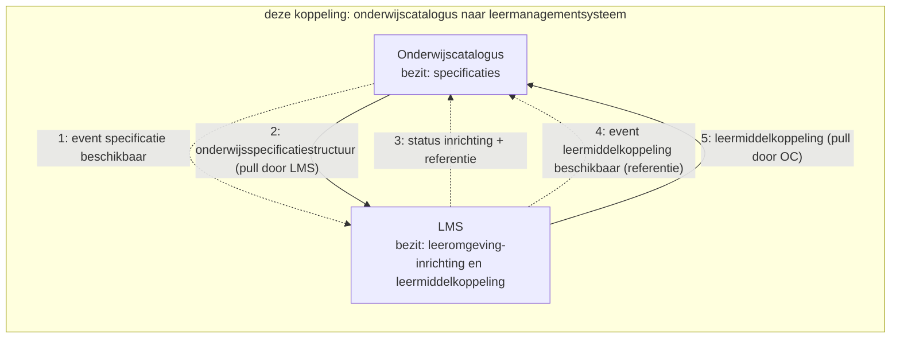
```mermaid
flowchart LR
    OC["Onderwijscatalogus<br/>bezit: specificaties"]
    subgraph KOP["deze koppeling: onderwijscatalogus naar leermanagementsysteem"]
        OC -. "1: event specificatie beschikbaar" .-> LMS["LMS<br/>bezit: leeromgeving-inrichting en leermiddelkoppeling"]
        OC -- "2: onderwijsspecificatiestructuur (pull door LMS)" --> LMS
        LMS -. "3: status inrichting + referentie" .-> OC
        LMS -. "4: event leermiddelkoppeling beschikbaar (referentie)" .-> OC
        LMS -- "5: leermiddelkoppeling (pull door OC)" --> OC
    end
```

Wat het diagram niet toont: de leeromgeving richt zich in tot op **leeronderdeelniveau** en vult daaronder haar eigen lesniveau in, waar de catalogus buiten staat. De leermiddelkoppeling gaat de andere kant op zodra de leeromgeving die heeft gelegd; de catalogus haalt hem op wanneer die de leermiddelen bij het aanbod wil tonen. Wijzigt een specificatie, dan volgt een nieuw event en haalt de leeromgeving het verschil of de volledige structuur opnieuw op.

#### 4.3.4 Interactieoverzicht

De interacties op deze koppeling, met per interactie het messaging-patroon, in dezelfde patroontaal als de koppeling met planning ([Enterprise Integration Patterns, Messaging](https://www.enterpriseintegrationpatterns.com/patterns/messaging/)).
Wat hier wordt vastgelegd is het **bericht**, niet het **kanaal**: hoe het bericht bij de ontvanger komt is een inrichtingskeuze van instelling en leverancier, binnen de vier eigenschappen die [ADR 0018](../Referentiemateriaal/adr/0018-enterprise-messaging-patronen-voor-betrouwbare-koppelvlakken.md) eist. Zie [uitgangspunt U5](#75-u5-bericht-versus-kanaal).

| # | Interactie | Initiator | Patroon | Synchroniciteit | Gedrag bij dubbele ontvangst | Foutafhandeling |
|---|---|---|---|---|---|---|
| L1 | Specificatie beschikbaar melden | OC | [Event Message](https://www.enterpriseintegrationpatterns.com/patterns/messaging/EventMessage.html) (id + versie) | Asynchroon | Geen effect: event-id ([Idempotent Receiver](https://www.enterpriseintegrationpatterns.com/patterns/messaging/IdempotentReceiver.html)) | [Guaranteed Delivery](https://www.enterpriseintegrationpatterns.com/patterns/messaging/GuaranteedDelivery.html); [Dead Letter Channel](https://www.enterpriseintegrationpatterns.com/patterns/messaging/DeadLetterChannel.html) |
| L2 | Onderwijsspecificatiestructuur of delta ophalen | LMS | [Request-Reply](https://www.enterpriseintegrationpatterns.com/patterns/messaging/RequestReply.html) (GET, alleen-lezen) | Synchroon | Geen effect (alleen-lezen) | HTTP-foutcodes, client bepaalt retry |
| L3 | Inrichtingsstatus melden, met referentie | LMS | [Event Message](https://www.enterpriseintegrationpatterns.com/patterns/messaging/EventMessage.html) (status: ontvangen/gestart, afgekeurd, ingericht, niet ingericht) | Asynchroon | Geen effect: status-id | Retry met backoff, daarna [Dead Letter Channel](https://www.enterpriseintegrationpatterns.com/patterns/messaging/DeadLetterChannel.html) |
| L4 | Leermiddelkoppeling beschikbaar melden | LMS | [Event Message](https://www.enterpriseintegrationpatterns.com/patterns/messaging/EventMessage.html) (referentie + specificatie-id en versie) | Asynchroon | Geen effect: event-id | [Guaranteed Delivery](https://www.enterpriseintegrationpatterns.com/patterns/messaging/GuaranteedDelivery.html); [Dead Letter Channel](https://www.enterpriseintegrationpatterns.com/patterns/messaging/DeadLetterChannel.html) |
| L5 | Leermiddelkoppeling ophalen | OC | [Request-Reply](https://www.enterpriseintegrationpatterns.com/patterns/messaging/RequestReply.html) op referentie (GET uuid, alleen-lezen) | Synchroon | Geen effect (alleen-lezen) | HTTP-foutcodes |
| L6 | Specificatiewijziging melden | OC | [Event Message](https://www.enterpriseintegrationpatterns.com/patterns/messaging/EventMessage.html) (object-id, oude en nieuwe versie, wijzigingsklasse) | Asynchroon | Geen effect: event-id | [Guaranteed Delivery](https://www.enterpriseintegrationpatterns.com/patterns/messaging/GuaranteedDelivery.html); [Dead Letter Channel](https://www.enterpriseintegrationpatterns.com/patterns/messaging/DeadLetterChannel.html) |

#### 4.3.5 Berichtgedrag

Dat is een voorbeeld van een kanaal, geen voorschrift: een bus, broker of cloud-pubsubdienst mag het vervangen zolang die de vier eigenschappen uit §3 levert. Het bericht blijft in alle gevallen gelijk.

- Alle GET's zijn alleen-lezen en zonder neveneffect; herhaald aanroepen geeft hetzelfde resultaat.
- Event-aflevering: ontvanger bevestigt met 200; bij uitblijven daarvan herhaalt de verzender met backoff en daarna [Dead Letter Channel](https://www.enterpriseintegrationpatterns.com/patterns/messaging/DeadLetterChannel.html). Dubbele aflevering is onschadelijk door het event-id ([Idempotent Receiver](https://www.enterpriseintegrationpatterns.com/patterns/messaging/IdempotentReceiver.html)).
- Registratie van een callback-URL, zoals `POST /abonnementen` bij de koppeling met planning (I8), is voor deze koppeling nog geen eigen interactie in §3; zolang die er niet is, is het afleveradres een inrichtingskeuze tussen OC en LMS, buiten dit document.
- Mogelijke uitbreidingen (v-next): paginering bij grote structuren, filter op deelstructuur-selectie bij het ophalen van de structuur.

#### 4.3.6 Interactiepatronen

| Interactiepatroon | Doel | Trigger | Initiator | Interacties (§3) | Endpoints (§7) | Sequentiediagram |
|---|---|---|---|---|---|---|
| Notify-then-pull: leeromgeving inrichten en leermiddelkoppeling melden | Een gepubliceerde specificatie omzetten in een ingerichte leeromgeving, met een leermiddelkoppeling terug naar de onderwijscatalogus | Onderwijsspecificatie krijgt status `gepubliceerd` | Onderwijscatalogus | L1, L2, L3, L4, (L5) | webhook `specificatie-beschikbaar`; `GET /onderwijsspecificaties/{id}`; webhook `inrichtingsstatus`; webhook `leermiddelkoppeling-beschikbaar`; (`GET /leermiddelkoppelingen/{id}`) | [hieronder](#437-notify-then-pull-leeromgeving-inrichten-en-leermiddelkoppeling-melden) |
| Notify-then-pull: inrichting bijwerken na wijziging | Een bestaande inrichting laten volgen op een nieuwe specificatieversie, met delta of volledige structuur als keuze voor het leermanagementsysteem | Nieuwe versie van een specificatie waarop het leermanagementsysteem is ingericht | Onderwijscatalogus | L2, L3, L6 | `GET /onderwijsspecificaties/{id}/delta` of `GET /onderwijsspecificaties/{id}`; webhook `inrichtingsstatus`; webhook `specificatie-gewijzigd` | [hieronder](#438-notify-then-pull-inrichting-bijwerken-na-wijziging) |

#### 4.3.7 Notify-then-pull: leeromgeving inrichten en leermiddelkoppeling melden

Doel: een gepubliceerde specificatie omzetten in een ingerichte leeromgeving, met een leermiddelkoppeling terug naar de onderwijscatalogus. Trigger: onderwijsspecificatie krijgt status `gepubliceerd`. Initiator: Onderwijscatalogus. Interacties: L1, L2, L3, L4, (L5).

Endpoints:

- [webhook `specificatie-beschikbaar` (L1)](#35-leermanagementsysteem-lms)
- [`GET /onderwijsspecificaties/{id}` (L2)](#32-onderwijscatalogus-oc)
- [webhook `inrichtingsstatus` (L3)](#32-onderwijscatalogus-oc)
- [webhook `leermiddelkoppeling-beschikbaar` (L4)](#32-onderwijscatalogus-oc)
- [`GET /leermiddelkoppelingen/{id}` (L5, optioneel)](#35-leermanagementsysteem-lms)

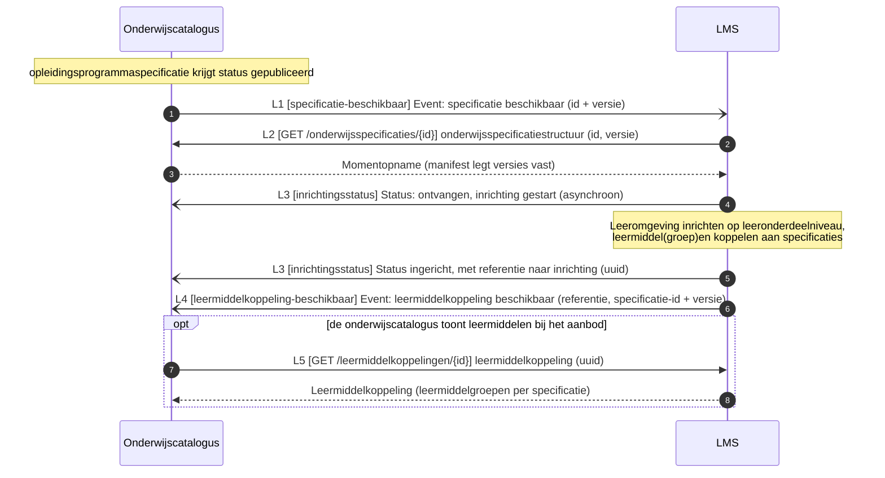
```mermaid
sequenceDiagram
    autonumber
    participant Onderwijscatalogus
    participant LMS

    Note over Onderwijscatalogus: opleidingsprogrammaspecificatie krijgt status gepubliceerd
    Onderwijscatalogus-)LMS: L1 [specificatie-beschikbaar] Event: specificatie beschikbaar (id + versie)
    LMS->>Onderwijscatalogus: L2 [GET /onderwijsspecificaties/{id}] onderwijsspecificatiestructuur (id, versie)
    Onderwijscatalogus-->>LMS: Momentopname (manifest legt versies vast)
    LMS-)Onderwijscatalogus: L3 [inrichtingsstatus] Status: ontvangen, inrichting gestart (asynchroon)
    Note over LMS: Leeromgeving inrichten op leeronderdeelniveau,<br/>leermiddel(groep)en koppelen aan specificaties
    LMS-)Onderwijscatalogus: L3 [inrichtingsstatus] Status ingericht, met referentie naar inrichting (uuid)
    LMS-)Onderwijscatalogus: L4 [leermiddelkoppeling-beschikbaar] Event: leermiddelkoppeling beschikbaar (referentie, specificatie-id + versie)
    opt de onderwijscatalogus toont leermiddelen bij het aanbod
        Onderwijscatalogus->>LMS: L5 [GET /leermiddelkoppelingen/{id}] leermiddelkoppeling (uuid)
        LMS-->>Onderwijscatalogus: Leermiddelkoppeling (leermiddelgroepen per specificatie)
    end
```

#### 4.3.8 Notify-then-pull: inrichting bijwerken na wijziging

Doel: een bestaande inrichting laten volgen op een nieuwe specificatieversie, met delta of volledige structuur als keuze voor het leermanagementsysteem. Trigger: nieuwe versie van een specificatie waarop het leermanagementsysteem is ingericht. Initiator: Onderwijscatalogus. Interacties: L2, L3, L6.

Endpoints:

- [`GET /onderwijsspecificaties/{id}/delta` of `GET /onderwijsspecificaties/{id}` (L2)](#32-onderwijscatalogus-oc)
- [webhook `inrichtingsstatus` (L3)](#32-onderwijscatalogus-oc)
- [webhook `specificatie-gewijzigd` (L6)](#35-leermanagementsysteem-lms)

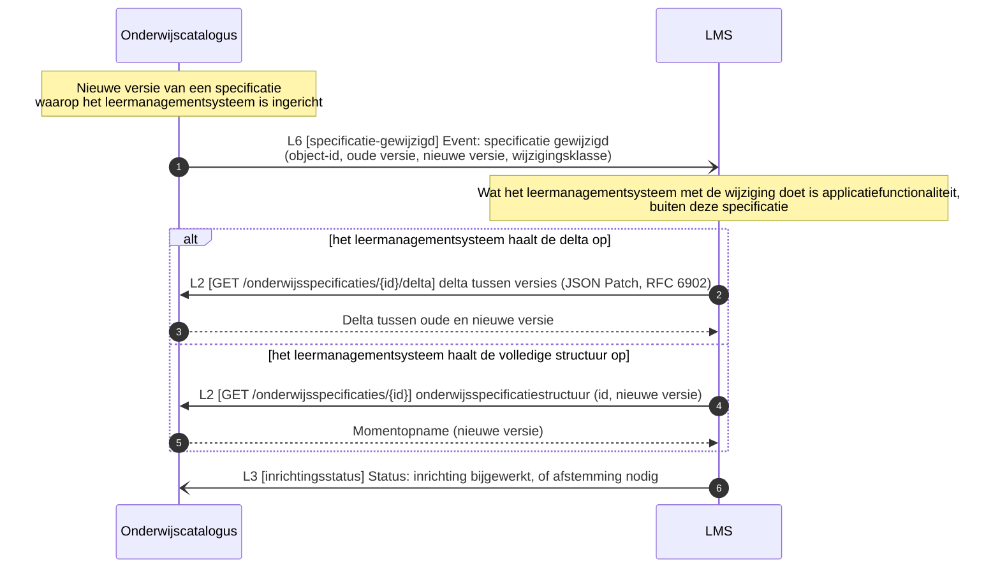
```mermaid
sequenceDiagram
    autonumber
    participant Onderwijscatalogus
    participant LMS

    Note over Onderwijscatalogus: Nieuwe versie van een specificatie<br/>waarop het leermanagementsysteem is ingericht
    Onderwijscatalogus-)LMS: L6 [specificatie-gewijzigd] Event: specificatie gewijzigd<br/>(object-id, oude versie, nieuwe versie, wijzigingsklasse)
    Note over LMS: Wat het leermanagementsysteem met de wijziging doet is applicatiefunctionaliteit,<br/>buiten deze specificatie
    alt het leermanagementsysteem haalt de delta op
        LMS->>Onderwijscatalogus: L2 [GET /onderwijsspecificaties/{id}/delta] delta tussen versies (JSON Patch, RFC 6902)
        Onderwijscatalogus-->>LMS: Delta tussen oude en nieuwe versie
    else het leermanagementsysteem haalt de volledige structuur op
        LMS->>Onderwijscatalogus: L2 [GET /onderwijsspecificaties/{id}] onderwijsspecificatiestructuur (id, nieuwe versie)
        Onderwijscatalogus-->>LMS: Momentopname (nieuwe versie)
    end
    LMS-)Onderwijscatalogus: L3 [inrichtingsstatus] Status: inrichting bijgewerkt, of afstemming nodig
```


<!-- pagina-einde -->

## 5 Auth-standaard voor koppelvlakken

**Aanleiding.** Geen enkele koppelingspecificatie in dit pakket legt vast hoe een consument zich bij een endpoint authenticeert. Zonder een gedeelde standaard verzint elke koppeling dat opnieuw, en twee leveranciers die beide "aan de koppelingspecificatie voldoen" kunnen alsnog niet verbinden omdat de een OAuth2 verwacht en de ander een API-sleutel. Dit document legt één mechanisme vast voor alle koppelvlakken in dit pakket.

Dit is, net als de uitgangspunten, een repo-brede keuze, geen keuze per koppeling: elke koppelingspecificatie verwijst hierheen in plaats van authenticatie opnieuw te beschrijven.

### 5.1 Mechanisme: OAuth 2.0 Client Credentials

Consument en leverancier wisselen vooraf, buiten de koppeling om, een `client_id` en `client_secret` uit (onboarding/registratie, bilateraal per koppeling). Een consument vraagt daarmee een access token op bij de token-endpoint van het systeem dat hij aanroept, via de **Client Credentials grant** ([RFC 6749 §4.4](https://www.rfc-editor.org/rfc/rfc6749#section-4.4)): geen gebruiker in de lus, puur systeem-naar-systeem.

Elk systeem dat endpoints serveert is verantwoordelijk voor zijn eigen token-endpoint (of een eigen identity provider erachter); er is geen centrale OKx-brede autorisatieserver. Dat sluit aan bij [U3, resource-eigenaarschap](#73-u3-resource-eigenaarschap): wie de resource bezit, bezit ook de toegang ertoe.

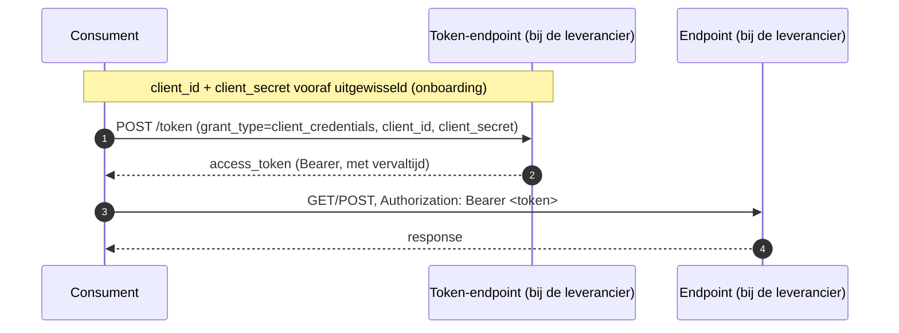
```mermaid
sequenceDiagram
    autonumber
    participant C as Consument
    participant TE as Token-endpoint (bij de leverancier)
    participant API as Endpoint (bij de leverancier)

    Note over C,TE: client_id + client_secret vooraf uitgewisseld (onboarding)
    C->>TE: POST /token (grant_type=client_credentials, client_id, client_secret)
    TE-->>C: access_token (Bearer, met vervaltijd)
    C->>API: GET/POST, Authorization: Bearer <token>
    API-->>C: response
```

### 5.2 Toepassing op webhook-aflevering

Een webhook-event is zelf ook een HTTP-aanroep, van de bezitter naar de callback-URL die de ontvanger bij het registreren van zijn abonnement heeft opgegeven. Dezelfde regel geldt dan omgekeerd: de afzender authenticeert zich bij het afleveren met een Bearer-token, opgehaald bij de token-endpoint van de ontvanger, met de credentials die bij de abonnementregistratie zijn afgesproken.

### 5.3 Wat dit niet regelt

- **Scopes en autorisatieclaims** binnen het token: welke velden of operaties een token precies mag, is nog niet uitgewerkt.
- **Tokenlevensduur en vernieuwing**: Client Credentials kent geen refresh token; een consument vraagt bij verval opnieuw een token op. De concrete geldigheidsduur is een inrichtingskeuze van de leverancier.
- **Sleutelbeheer**: rotatie en intrekking van `client_secret` zijn een operationele afspraak tussen de partijen, geen onderdeel van deze standaard.
- **Gebruikersauthenticatie**: alle koppelingen in dit pakket zijn systeem-naar-systeem; een leerling of medewerker komt nergens in de lus voor. Delegated auth (authorization code grant) valt daarmee buiten scope.


<!-- pagina-einde -->

## 6 Datamodelschema's

De JSON Schema's bij de payload-specificaties van dit pakket: per resource de vorm waarin hij over een koppeling gaat. Zij zijn **alfa en indicatief** ([U1](#71-u1-indicatief-en-onderbouwend-niet-voorschrijvend)). Welke velden een koppeling gebruikt, en waarom, staat in de payload-specificatie; die is daarin leidend. Deze map draagt de vorm, niet de betekenis.

De schema's volgen de payloadvorm uit [U7](#77-u7-payload-plat-met-verwijzingen-en-de-sleutelconventie): plat, met verwijzingen tussen objecten in plaats van nesting, zodat een consument alleen ophaalt wat hij nodig heeft. In het gebundelde releasedocument staan ze voluit als bijlage; in de zip en in dit repository staan ze als losse bestanden, zodat je ze direct kunt gebruiken om tegen te valideren.

### 6.1 Informatiemodellen

#### 6.1.1 Onderwijsspecificatie

Alle specificaties zijn hetzelfde objecttype, gespecialiseerd via `specificatieType`. In het informatiemodel hieronder betekent `onderdeel_van` additief (de studielast telt op) en `variant_van` alternatief (een keuze tussen varianten, geen optelling). Elke entiteit draagt daarnaast `versie` (semver); dat is voor de leesbaarheid niet in elke box herhaald.


```mermaid
erDiagram
    OPLEIDINGSSPECIFICATIE ||--o{ OPLEIDINGSPROGRAMMASPECIFICATIE_LEERWEG : variant_van
    OPLEIDINGSPROGRAMMASPECIFICATIE_LEERWEG ||--o{ OPLEIDINGSPROGRAMMASPECIFICATIE_DOELGROEP : variant_van
    OPLEIDINGSPROGRAMMASPECIFICATIE_DOELGROEP ||--o{ ONDERWIJSEENHEIDSPECIFICATIE : onderdeel_van
    OPLEIDINGSPROGRAMMASPECIFICATIE_DOELGROEP ||--|| KEUZEDEELRUIMTESPECIFICATIE : bevat
    ONDERWIJSEENHEIDSPECIFICATIE ||--o{ LEERONDERDEELSPECIFICATIE : onderdeel_van
    KEUZEDEELRUIMTESPECIFICATIE }o--o{ REGELSET : regelsetVerwijzingen
    REGELSET }o--o{ KEUZEDEELPROGRAMMASPECIFICATIE : kiesbaar
    REGELSET }o--o{ LEERUITKOMST : "stelt deelname-voorwaarden in behaalde leeruitkomsten"
    KEUZEDEELPROGRAMMASPECIFICATIE ||--o{ ONDERWIJSEENHEIDSPECIFICATIE : onderdeel_van

    OPLEIDINGSSPECIFICATIE }o--|| LEERUITKOMST : "verankert op"
    OPLEIDINGSPROGRAMMASPECIFICATIE_LEERWEG }o--|| LEERUITKOMST : "verankert op"
    OPLEIDINGSPROGRAMMASPECIFICATIE_DOELGROEP }o--|| LEERUITKOMST : "verankert op"
    ONDERWIJSEENHEIDSPECIFICATIE }o--|| LEERUITKOMST : "verankert op"
    LEERONDERDEELSPECIFICATIE }o--|| LEERUITKOMST : "verankert op"
    KEUZEDEELPROGRAMMASPECIFICATIE }o--|| LEERUITKOMST : "verankert op"
    LEERUITKOMST ||--o{ LEERUITKOMST : "aggregeert bottom-up en top-down"
    LEERUITKOMST {
        uuid id PK
        string versie "eigen lifecycle"
        string naam
        object bron "standaard (nu sbb-kwalificatiekader, later bv. competentnl) + type + code"
        uuid bovenliggendLeeruitkomstId FK "recursief, orde van grootte per niveau"
        string waardedocument "diploma, certificaat, later microcredential"
        array indicatieveOmvang "SBU en/of EC naast elkaar ([ADR 0004](../Referentiemateriaal/adr/0004-leeruitkomsten-sbu-ec-logistieke-containergrootte.md))"
        string omschrijving "optioneel, per gebruiksprofiel"
        string resultaat "optioneel"
        array gedrag "optioneel"
        int nlqfNiveau
    }
    OPLEIDINGSSPECIFICATIE {
        uuid id PK
        string specificatieType "opleidingsspecificatie"
        uuid bovenliggendSpecificatieId "null"
        uuid leeruitkomstId FK "sleutel naar leeruitkomst"
        string naam
        string curriculumtype
        string versie
        date geldigVanaf
        date geldigTot
        object studielast "waarde + SBU"
        array manifest "pins: id + version + relatie"
        string status
    }
    OPLEIDINGSPROGRAMMASPECIFICATIE_LEERWEG {
        uuid id PK
        string specificatieType "opleidingsprogrammaspecificatie"
        uuid bovenliggendSpecificatieId FK "opleiding"
        uuid leeruitkomstId FK "sleutel naar leeruitkomst"
        string programmaLaag "leerweg"
        string leerweg "BOL of BBL"
        string programmatype "diplomaprogramma"
        object studielast
    }
    OPLEIDINGSPROGRAMMASPECIFICATIE_DOELGROEP {
        uuid id PK
        string specificatieType "opleidingsprogrammaspecificatie"
        uuid bovenliggendSpecificatieId FK "leerweg-programma"
        uuid leeruitkomstId FK "sleutel naar leeruitkomst"
        string programmaLaag "doelgroep"
        string doelgroep "regulier, zijinstromer, hybride, organisatiespecifiek"
        string leerweg
        string curriculumtype
        object organisatie "optioneel, bv. Ziekenhuis 12"
        string cohort
        date startdatum
        date geldigVanaf
        date geldigTot
        object studielast
        array manifest "pins: id + version + relatie"
    }
    ONDERWIJSEENHEIDSPECIFICATIE {
        uuid id PK
        string specificatieType "onderwijseenheidspecificatie"
        uuid bovenliggendSpecificatieId FK "programma of keuzedeelprogramma"
        uuid leeruitkomstId FK "sleutel naar leeruitkomst"
        string naam
        object studielast
    }
    LEERONDERDEELSPECIFICATIE {
        uuid id PK
        string specificatieType "leeronderdeelspecificatie"
        uuid bovenliggendSpecificatieId FK "onderwijseenheid"
        uuid leeruitkomstId FK "sleutel naar leeruitkomst"
        string naam
        string tijdsverdeling "BOT of OOT"
        object studielast
    }
    KEUZEDEELRUIMTESPECIFICATIE {
        uuid id PK
        string specificatieType "keuzedeelruimtespecificatie"
        uuid bovenliggendSpecificatieId FK "doelgroep-programma"
        object studielast "keuzeruimte in SBU"
        array regelsetVerwijzingen FK "naar REGELSET"
    }
    KEUZEDEELPROGRAMMASPECIFICATIE {
        uuid id PK
        string specificatieType "opleidingsprogrammaspecificatie"
        uuid bovenliggendSpecificatieId "null, zelfstandig"
        uuid leeruitkomstId FK "sleutel naar leeruitkomst"
        string programmatype "keuzedeelprogramma"
        string keuzedeelKlasse "algemeen-verbredend of beroepsspecifiek-verdiepend"
        object studielast
    }
    REGELSET {
        uuid id PK
        string naam
        uuid vanToepassingOp FK "keuzedeelruimte"
        array regels "kiesbaar + voorwaardeVooraf in behaalde leeruitkomsten"
    }
```

Het model toont de relatie tussen specificatie en leeruitkomst als veel-op-veel. De payload implementeert dat voorlopig als één `leeruitkomstId` per specificatie; een array-vorm is nog niet uitgewerkt.

#### 6.1.2 Onderwijsaanbod

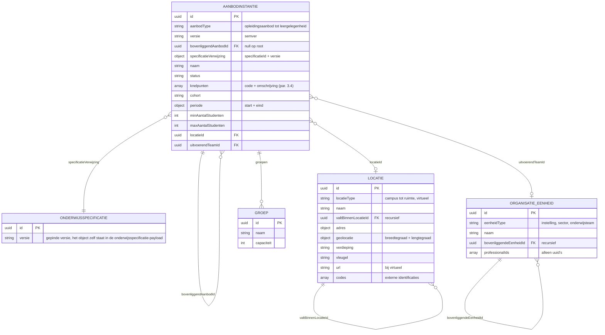
```mermaid
erDiagram
    AANBODINSTANTIE ||--o{ AANBODINSTANTIE : bovenliggendAanbodId
    AANBODINSTANTIE }o--|| ONDERWIJSSPECIFICATIE : specificatieVerwijzing
    AANBODINSTANTIE }o--o| LOCATIE : locatieId
    AANBODINSTANTIE }o--o| ORGANISATIE_EENHEID : uitvoerendTeamId
    AANBODINSTANTIE ||--o{ GROEP : groepen
    LOCATIE ||--o{ LOCATIE : valtBinnenLocatieId
    ORGANISATIE_EENHEID ||--o{ ORGANISATIE_EENHEID : bovenliggendeEenheidId

    AANBODINSTANTIE {
        uuid id PK
        string aanbodType "opleidingsaanbod tot leergelegenheid"
        string versie "semver"
        uuid bovenliggendAanbodId FK "null op root"
        object specificatieVerwijzing "specificatieId + versie"
        string naam
        string status
        array knelpunten "code + omschrijving (par. 3.4)"
        string cohort
        object periode "start + eind"
        int minAantalStudenten
        int maxAantalStudenten
        uuid locatieId FK
        uuid uitvoerendTeamId FK
    }
    GROEP {
        uuid id PK
        string naam
        int capaciteit
    }
    LOCATIE {
        uuid id PK
        string locatieType "campus tot ruimte, virtueel"
        string naam
        uuid valtBinnenLocatieId FK "recursief"
        object adres
        object geolocatie "breedtegraad + lengtegraad"
        string verdieping
        string vleugel
        string url "bij virtueel"
        array codes "externe identificaties"
    }
    ORGANISATIE_EENHEID {
        uuid id PK
        string eenheidType "instelling, sector, onderwijsteam"
        string naam
        uuid bovenliggendeEenheidId FK "recursief"
        array professionalIds "alleen uuid's"
    }
    ONDERWIJSSPECIFICATIE {
        uuid id PK
        string versie "gepinde versie, het object zelf staat in de onderwijsspecificatie-payload"
    }
```

#### 6.1.3 Resultaatstructuur en examenplan

```mermaid
erDiagram
    EXAMENPLANSPECIFICATIE ||--o{ RESULTAATEENHEIDSPECIFICATIE : onderdeel_van
    RESULTAATEENHEIDSPECIFICATIE ||--o{ TOETSONDERDEELSPECIFICATIE : onderdeel_van
    EXAMENPLANSPECIFICATIE }o--|| OPLEIDINGSPROGRAMMASPECIFICATIE : geldtVoor
    RESULTAATEENHEIDSPECIFICATIE }o--o{ REGELSET : regelsetVerwijzingen

    EXAMENPLANSPECIFICATIE {
        uuid id PK
        string specificatieType "examenplanspecificatie"
        uuid bovenliggendSpecificatieId "null"
        uuid geldtVoor FK "opleidingsprogrammaspecificatie"
        uuid leeruitkomstId FK "sleutel naar de leeruitkomst"
        object leeruitkomst "leesbaar: type=kwalificatie, code=27141"
        string aggregatie "allenVoldoende"
        object resultaatmodel "schaal, cesuur"
        string versie
        date geldigVanaf
        date geldigTot
        array manifest "pins: id + version + relatie"
        string status
    }
    RESULTAATEENHEIDSPECIFICATIE {
        uuid id PK
        string specificatieType "resultaateenheidspecificatie"
        uuid bovenliggendSpecificatieId FK "examenplanspecificatie"
        uuid leeruitkomstId FK "sleutel naar de leeruitkomst"
        object leeruitkomst "leesbaar: type=kerntaak"
        uuid beoordeelt FK "onderwijseenheid of keuzedeelruimte, optioneel"
        number weging "relatief binnen ouder"
        string aggregatie
        object resultaatmodel
        boolean verplicht
        array regelsetVerwijzingen FK "naar REGELSET"
        array manifest
    }
    TOETSONDERDEELSPECIFICATIE {
        uuid id PK
        string specificatieType "toetsonderdeelspecificatie"
        uuid bovenliggendSpecificatieId FK "resultaateenheidspecificatie"
        uuid leeruitkomstId FK "sleutel naar de leeruitkomst"
        object leeruitkomst "leesbaar: type=kerntaak of werkproces"
        string aard "summatief of formatief"
        string toetsvorm
        number weging
        object resultaatmodel
        boolean verplicht
    }
    REGELSET {
        uuid id PK
        string naam
        array regels "welke resultaten meetellen"
    }
    OPLEIDINGSPROGRAMMASPECIFICATIE {
        uuid id PK
        string versie "gepinde versie, het object zelf staat in de onderwijsspecificatie-payload"
    }
```

#### 6.1.4 Onderwijscatalogus naar planning en roostering

De begrippen uit het semantisch kader en hun relaties, in de context van dit proces. Links de wereld van OC (specificeren), rechts die van P (instantiëren); de koppeling verbindt ze via de verwijzing "instantieert".

```mermaid
erDiagram
    ONDERWIJSSPECIFICATIE ||--o{ ONDERWIJSSPECIFICATIE : "bestaat uit"
    ONDERWIJSSPECIFICATIE }o--o{ LEERUITKOMST : "verankert op"
    ONDERWIJSSPECIFICATIE }o--o{ REGELSET : "kent keuzeregels via"
    ONDERWIJSAANBOD }o--|| ONDERWIJSSPECIFICATIE : "instantieert (id en versie)"
    ONDERWIJSAANBOD ||--o{ ONDERWIJSAANBOD : "bestaat uit"
    ONDERWIJSAANBOD }o--o| LOCATIE : "vindt plaats op"
    ONDERWIJSAANBOD }o--o| ONDERWIJSTEAM : "wordt uitgevoerd door"
    ONDERWIJSAANBOD ||--o{ GROEP : "kent"
    ROOSTER }o--|| ONDERWIJSAANBOD : "plaatst in de tijd (context)"
```

#### 6.1.5 Onderwijscatalogus naar studentinformatiesysteem

Conform het ROSA Kernmodel Onderwijsinformatie (KOI) en [ADR 0022](../Referentiemateriaal/adr/0022-resultaatbegrippen-conform-rosa-koi.md): een onderwijsresultaat wordt behaald op leeruitkomsten, en meerdere toetsonderdeelresultaten leiden gewogen tot dat onderwijsresultaat. De verbintenis hoort bij het aanbod (ankertabel), niet bij de specificatie, en staat daarom niet in dit kernmodel.

```mermaid
erDiagram
    ONDERWIJSSPECIFICATIE ||--o{ ONDERWIJSSPECIFICATIE : "bestaat uit"
    ONDERWIJSSPECIFICATIE }o--o{ LEERUITKOMST : "verankert op"
    NOMINAAL_EXAMENPLAN }o--|| ONDERWIJSSPECIFICATIE : "geldt voor"
    NOMINAAL_EXAMENPLAN ||--o{ TOETSONDERDEEL : "weegt"
    KEUZEDEEL ||--o| KEUZEDEEL_EXAMENPLANDEEL : "kent eigen"
    KEUZEDEEL_EXAMENPLANDEEL ||--o{ TOETSONDERDEEL : "weegt"
    TOETSONDERDEEL }o--o{ LEERUITKOMST : "toetst"
    INDIVIDUELE_STRUCTUUR }o--|| ONDERWIJSSPECIFICATIE : "is kopie van nominaal template"
    INDIVIDUELE_STRUCTUUR }o--o{ KEUZEDEEL : "ingevuld met (keuze via SKS)"
    INDIVIDUEEL_EXAMENPLAN ||--|| INDIVIDUELE_STRUCTUUR : "hoort bij"
    INDIVIDUEEL_EXAMENPLAN }o--|| NOMINAAL_EXAMENPLAN : "samengesteld uit"
    INDIVIDUEEL_EXAMENPLAN }o--o{ KEUZEDEEL_EXAMENPLANDEEL : "plus delen van gekozen keuzedelen"
    TOETSONDERDEELRESULTAAT }o--|| TOETSONDERDEEL : "resultaat op"
    ONDERWIJSRESULTAAT }o--o{ TOETSONDERDEELRESULTAAT : "gewogen samengesteld uit"
    ONDERWIJSRESULTAAT }o--o{ LEERUITKOMST : "dicht af"
    ONDERWIJSRESULTAAT }o--|| INDIVIDUEEL_EXAMENPLAN : "telt mee in"
```

#### 6.1.6 Onderwijscatalogus naar leermanagementsysteem

```mermaid
erDiagram
    ONDERWIJSSPECIFICATIE ||--o{ ONDERWIJSSPECIFICATIE : "bestaat uit"
    ONDERWIJSSPECIFICATIE }o--o{ LEERUITKOMST : "verankert op"
    LEEROMGEVING_INRICHTING }o--|| ONDERWIJSSPECIFICATIE : "is ingericht naar (id en versie)"
    LEERMIDDELKOPPELING }o--|| ONDERWIJSSPECIFICATIE : "hoort bij (id en versie)"
    LEERMIDDELKOPPELING ||--o{ LEERMIDDELGROEP : "bundelt"
    LEERMIDDELGROEP ||--o{ LEERMIDDEL : "bevat"
```

### 6.2 Regels bij de schema's

Wat een JSON Schema niet kan uitdrukken, maar wel geldt. Zonder deze regels valideren twee implementaties allebei en werken ze toch niet samen.

**Twee soorten ouder-verwijzing.** `bovenliggendSpecificatieId` draagt zowel onderdeel-van (additief, een kerntaak onder een programma) als variant-van (alternatief, een doelgroep onder een leerweg). Welke van de twee geldt staat in het `manifest` van de ouder, in `relatie`.

**Aggregatie-invariant.** `studielast` telt bottom-up op binnen onderdeel-van: de som van de onderdelen is gelijk aan de ouder. Over varianten telt hij niet op; een leerweg en een doelgroep zijn alternatieven, geen optelling.

**Keuzedelen staan als root.** Een keuzedeelprogramma draagt geen ouder-verwijzing en is alleen bereikbaar via `regelsetVerwijzingen`. Wie de structuur aflegt via de ouder-verwijzing mist ze. Ze zijn herbruikbaar over opleidingen heen (N:M via de regelset).

**Regels staan buiten de specificatie.** `regelsetVerwijzingen` kan op elke specificatie staan, niet alleen op de keuzeruimte. De regelset draagt de kiesbaarheid en de voorwaarde vooraf, uitgedrukt in **behaalde leeruitkomsten** en niet in afgeronde specificaties. De interne structuur van een regelset valt buiten deze schema's.

**Rekenregels staan op de resultaateenheid.** `aggregatie` en `weging` horen op de `resultaateenheidspecificatie`, niet op het toetsonderdeel: de rekenregel staat op het niveau waar hij geldt. `aard: formatief` betekent weging 0 en telt niet mee voor het diploma.

**Knelpuntcodes.** De code benoemt welke categorie randvoorwaarde onvervulbaar bleek. De lijst is een aanzet; een genormeerde codelijst met foutmodel volgt.

| Code | Geschonden constraint | Voorbeeld |
|---|---|---|
| `capaciteitTekort` | Inzetbare uren van team of professionals | 4 groepen vragen 960 contacturen, 666 beschikbaar |
| `expertiseTekort` | Vereist expertiseprofiel ontbreekt | Geen docent met profiel farmaceutische zorg |
| `ruimteTekort` | Ruimtetype of ruimtecapaciteit ontoereikend | Geen praktijklokaal beschikbaar in de periode |
| `locatieConflict` | Zelfde ruimte gelijktijdig dubbel nodig | Twee opleidingen claimen lokaal 2.14 in dezelfde weken |
| `volgordeConflict` | Voorwaarde vooraf past niet in de periodes | Wiskunde 1 en Ruimtelijk inzicht passen niet na elkaar binnen het jaar |
| `regelConflict` | Keuzeregels (regelset) onvervulbaar | De regelset sluit alle kiesbare keuzedelen uit |
| `groepsgrootteConflict` | Minimum of maximum aantal studenten | Prognose blijft onder het minimum |
| `kalenderConflict` | Urennorm of lesweken passen niet | Vereiste begeleide uren passen niet in de beschikbare weken |

**Versionering.** Semver per specificatie: MAJOR is brekend binnen dezelfde identiteit (leeruitkomsten, structuur, studielast), MINOR is additief, PATCH is een correctie. Het `id` is stabiel; een fundamentele wijziging — een nieuw kwalificatiedossier, gewijzigde wettelijke eisen — is een **nieuwe specificatie met een nieuw id**, geen MAJOR-ophoging. Temporele geldigheid loopt via `geldigVanaf` en `geldigTot`, niet via het versienummer: zo kunnen meerdere versies gelijktijdig actief zijn, de oude voor lopende studenten en de nieuwe voor nieuwe instroom. Eén partij geeft versienummers uit, de onderwijscatalogus.

**Momentopname en manifest.** Een geleverde payload is een momentopname: elke specificatie staat erin met haar `versie`, en de versie van de bovenste specificatie is de release-versie daarvan. Het `manifest` maakt de pin expliciet ([manifest-item.json](Datamodelschema's/manifest-item.json)). Een MAJOR-ophoging van een onderdeel propageert **niet** automatisch omhoog: dat gebeurt alleen als de afhankelijkheid breekt, dus wanneer leeruitkomsten, weging of het recht op een waardedocument veranderen. Anders is het enkel een nieuwe pin.

| Breekt onderdeel A de bovenliggende specificatie? | Bovenliggende specificatie | Manifest pint |
|---|---|---|
| Ja (leeruitkomst, weging of diploma-eligibility) | `2.1` naar `3.0` (MAJOR) | A `2.0` |
| Nee (interne herstructurering van A) | `2.1` naar `2.2` (MINOR) | A `2.0` |

**Deactiveren, niet verwijderen.** Zodra er aanbod, een verbintenis of een resultaat aan een specificatie hangt, is verwijderen geen optie: een lopende student moet herleidbaar blijven tot de versie waarop hij is ingeschreven. Daarvoor is de status `gedeactiveerd`.

**Wijzigingsklasse.** `changeClass` in [specification-changed.json](Datamodelschema's/specification-changed.json) zegt wat de ontvanger moet doen.

| Waarde | Wat het betekent | Gevolg voor de ontvanger |
|---|---|---|
| `fundamenteel` | Nieuw kwalificatiedossier, gewijzigde wettelijke eisen, nieuwe onderwijsvisie | Nieuwe specificatie met een nieuw id; meestal alleen voor nieuwe instroom |
| `examenplan` | Aanpassing van de summatieve resultaatstructuur | Alleen na expliciete impactanalyse en besluit; de strengste regels, want het examenplan is een contractuele afspraak met de student |
| `onderdeel` | Update van een onderwijseenheid- of leeronderdeelspecificatie | Nieuwe versie van het onderdeel; de bovenliggende specificatie volgt alleen bij een brekende afhankelijkheid |
| `niet-brekend` | Actualisatie van lessen, materiaal of uitvoeringsvorm | PATCH of MINOR binnen dezelfde identiteit |
| `na-planning-of-roostering` | Wijziging nadat aanbod of rooster is gepubliceerd | Alleen bij uitzondering en na ketenafstemming |

**Locatie en organisatie.** Eén object `locatie` dekt elke korrelgrootte via `locatieType`, van campus tot ruimte en ook virtueel; `valtBinnenLocatieId` legt de ruimtelijke hiërarchie vast. Een locatie kan een adres en onafhankelijk daarvan een geopunt dragen. `organisatieEenheden` volgt hetzelfde recursiepatroon via `bovenliggendeEenheidId`; `professionalIds` draagt alleen uuid's, want inzet en beschikbaarheid leven in het plan-van-inzetsysteem.

### 6.3 Gebruiksprofielen

Alle koppelingen delen dezelfde onderwijsspecificatie-payload; per koppeling verschilt welke onderdelen meegaan. Dat verschil staat hier, niet in het schema: het schema legt de vorm vast, het profiel wat een koppeling ervan gebruikt.

#### 6.3.1 Onderwijscatalogus naar planning en roostering

| Onderdeel | Gebruik in onderwijscatalogus naar planning en roostering |
|---|---|
| `onderwijsspecificaties` | Volledig, inclusief manifest |
| `regelsets` | Volledig; `voorwaardeVooraf` bevat leeruitkomst-ids uitsluitend als **verbindende sleutels** voor volgordebepaling: planning gebruikt ze zonder de inhoud te kennen ([ADR 0026](../Referentiemateriaal/adr/0026-leeruitkomst-als-verbindende-sleutel.md)) |
| `leeruitkomsten` | **Niet meegeleverd.** Planning heeft de betekenis, aggregatie en inhoud van leeruitkomsten niet nodig ([ADR 0026](../Referentiemateriaal/adr/0026-leeruitkomst-als-verbindende-sleutel.md)) |

#### 6.3.2 Onderwijscatalogus naar studentinformatiesysteem

| Onderdeel | Gebruik in onderwijscatalogus naar studentinformatiesysteem |
|---|---|
| `onderwijsspecificaties` | Volledig, inclusief manifest (nominaal template) |
| `leeruitkomsten` | **Volledig**, inclusief aggregatie (`bovenliggendLeeruitkomstId`), `waardedocument` en `indicatieveOmvang`: de sleutel tussen specificatie, resultaatstructuur en onderwijsresultaat ([ADR 0022](../Referentiemateriaal/adr/0022-resultaatbegrippen-conform-rosa-koi.md)) |
| `regelsets` | Volledig (kiesbaarheid keuzedeelruimte, voorwaarden in behaalde leeruitkomsten) |

Voor S3 geldt daarnaast [result-structure.json](Datamodelschema's/result-structure.json) als aparte payload.

#### 6.3.3 Onderwijscatalogus naar leermanagementsysteem

| Onderdeel | Gebruik in onderwijscatalogus naar leermanagementsysteem |
|---|---|
| `onderwijsspecificaties` | Volledig tot en met `leeronderdeelspecificatie` |
| `leeruitkomsten` | **Met inhoudsvelden** (`omschrijving`, `resultaat`, `gedrag`): dat is precies wat het LMS uitwerkt en aan de student exposet |
| `regelsets` | Niet meegeleverd (kiesbaarheid is het domein van SKS en SIS) |

De leermiddelkoppeling-payload is nog niet uitgewerkt. Verwachte kern: `id`, `versie`, en per specificatie de leermiddelgroepen met een `specificatieVerwijzing` (id en versie).


<!-- pagina-einde -->

### 6.4 Voorbeeldpayloads

De waarden in deze voorbeelden zijn **indicatief**: ze illustreren de vorm en de samenhang, niet de inhoud van een bestaande opleiding.

#### 6.4.1 Voorbeeld onderwijsspecificatie

Leerroute 1, waarden indicatief. De `studielast` telt bottom-up op binnen onderdeel-van: de kerntaken 2000 plus 1200 plus 880 is 4080, plus de keuzeruimte van 720 komt op 4800 onder Regulier BOL. Programma-varianten tellen niet op. De inhoud hangt hier onder één doelgroep (Regulier BOL); de andere varianten zijn leeg gelaten. De voorwaarde vooraf van Wiskunde 1 voor Ruimtelijk inzicht komt uit de uitwerking van de keuzedeel-regels.

```json
{
  "leeruitkomsten": [
    {
      "id": "c5b64fe5-f7bf-490c-acaf-7af1bd24f980",
      "versie": "0.1.0",
      "naam": "Apothekersassistent (kwalificatiedossier 23450)",
      "bron": {
        "standaard": "sbb-kwalificatiekader",
        "type": "kwalificatiedossier",
        "code": "23450"
      },
      "indicatieveOmvang": [
        {
          "waarde": 4800,
          "eenheid": "SBU"
        },
        {
          "waarde": 171,
          "eenheid": "EC"
        }
      ],
      "bovenliggendLeeruitkomstId": null,
      "waardedocument": "diploma",
      "nlqfNiveau": 4
    },
    {
      "id": "b84dc98b-6c5f-4ee8-bdfb-40b2639ca5a4",
      "versie": "0.1.0",
      "naam": "Apothekersassistent (kwalificatie 27141)",
      "bron": {
        "standaard": "sbb-kwalificatiekader",
        "type": "kwalificatie",
        "code": "27141"
      },
      "indicatieveOmvang": [
        {
          "waarde": 4800,
          "eenheid": "SBU"
        }
      ],
      "bovenliggendLeeruitkomstId": "c5b64fe5-f7bf-490c-acaf-7af1bd24f980"
    },
    {
      "id": "12301838-92d4-4040-aea2-050bb131ceb7",
      "versie": "0.1.0",
      "naam": "Biedt farmaceutische patiëntenzorg",
      "bron": {
        "standaard": "sbb-kwalificatiekader",
        "type": "kerntaak",
        "code": "B1-K1"
      },
      "indicatieveOmvang": [
        {
          "waarde": 2000,
          "eenheid": "SBU"
        }
      ],
      "bovenliggendLeeruitkomstId": "b84dc98b-6c5f-4ee8-bdfb-40b2639ca5a4"
    },
    {
      "id": "bedb4c31-b818-491c-8227-9b32146a3363",
      "versie": "0.1.0",
      "naam": "Voert logistieke taken uit in de apotheek",
      "bron": {
        "standaard": "sbb-kwalificatiekader",
        "type": "kerntaak",
        "code": "B1-K2"
      },
      "indicatieveOmvang": [
        {
          "waarde": 1200,
          "eenheid": "SBU"
        }
      ],
      "bovenliggendLeeruitkomstId": "b84dc98b-6c5f-4ee8-bdfb-40b2639ca5a4"
    },
    {
      "id": "8b085118-ff81-4639-9152-ed2e447db2db",
      "versie": "0.1.0",
      "naam": "Werkt mee aan kwaliteit en deskundigheid",
      "bron": {
        "standaard": "sbb-kwalificatiekader",
        "type": "kerntaak",
        "code": "B1-K3"
      },
      "indicatieveOmvang": [
        {
          "waarde": 880,
          "eenheid": "SBU"
        }
      ],
      "bovenliggendLeeruitkomstId": "b84dc98b-6c5f-4ee8-bdfb-40b2639ca5a4"
    },
    {
      "id": "78f25d62-9fd4-45c4-aa04-3d22f59213f5",
      "versie": "0.1.0",
      "naam": "Neemt de zorg-/adviesvraag in behandeling",
      "bron": {
        "standaard": "sbb-kwalificatiekader",
        "type": "werkproces",
        "code": "B1-K1-W1"
      },
      "indicatieveOmvang": [
        {
          "waarde": 600,
          "eenheid": "SBU"
        }
      ],
      "bovenliggendLeeruitkomstId": "12301838-92d4-4040-aea2-050bb131ceb7",
      "omschrijving": "De beginnend beroepsbeoefenaar neemt de zorg-/adviesvraag in behandeling en staat de patiënt en/of naastbetrokkenen te woord, stelt gerichte vragen, verzamelt en controleert patiëntinformatie en brengt de situatie in kaart, en kiest op basis hiervan een vervolgstap.",
      "resultaat": "De zorg-/adviesvraag is in behandeling genomen.",
      "gedrag": [
        "is geduldig en empathisch",
        "maakt een realistische inschatting van de situatie",
        "legt logische verbanden",
        "past de communicatie aan op doel en doelgroep",
        "communiceert duidelijk en begrijpelijk",
        "gaat discreet om met vertrouwelijke informatie",
        "werkt volgens richtlijnen en protocollen"
      ]
    },
    {
      "id": "0ffa279f-c595-49d7-b033-c91f66d18bb1",
      "versie": "0.1.0",
      "naam": "Voert medicatiebewaking uit",
      "bron": {
        "standaard": "sbb-kwalificatiekader",
        "type": "werkproces",
        "code": "B1-K1-W2"
      },
      "indicatieveOmvang": [
        {
          "waarde": 500,
          "eenheid": "SBU"
        }
      ],
      "bovenliggendLeeruitkomstId": "12301838-92d4-4040-aea2-050bb131ceb7"
    },
    {
      "id": "9d6a5081-9356-4058-8ac0-a4df8f8c60bd",
      "versie": "0.1.0",
      "naam": "Verstrekt (zelfzorg)medicijnen en/of hulpmiddelen",
      "bron": {
        "standaard": "sbb-kwalificatiekader",
        "type": "werkproces",
        "code": "B1-K1-W3"
      },
      "indicatieveOmvang": [
        {
          "waarde": 500,
          "eenheid": "SBU"
        }
      ],
      "bovenliggendLeeruitkomstId": "12301838-92d4-4040-aea2-050bb131ceb7"
    },
    {
      "id": "71f42c36-dcfb-42ec-b492-8ed665639eda",
      "versie": "0.1.0",
      "naam": "Geeft informatie en advies over medicijngebruik, gezondheid en leefstijl",
      "bron": {
        "standaard": "sbb-kwalificatiekader",
        "type": "werkproces",
        "code": "B1-K1-W4"
      },
      "indicatieveOmvang": [
        {
          "waarde": 400,
          "eenheid": "SBU"
        }
      ],
      "bovenliggendLeeruitkomstId": "12301838-92d4-4040-aea2-050bb131ceb7"
    },
    {
      "id": "1d5f3f8e-76d1-4bf1-bcf2-986a4a2fe7fd",
      "versie": "0.1.0",
      "naam": "Maakt medicijnen klaar voor gebruik en/of aflevering",
      "bron": {
        "standaard": "sbb-kwalificatiekader",
        "type": "werkproces",
        "code": "B1-K2-W1"
      },
      "indicatieveOmvang": [
        {
          "waarde": 700,
          "eenheid": "SBU"
        }
      ],
      "bovenliggendLeeruitkomstId": "bedb4c31-b818-491c-8227-9b32146a3363"
    },
    {
      "id": "772c792b-f5ec-425f-9dd7-87d8fad4d2db",
      "versie": "0.1.0",
      "naam": "Houdt de voorraad bij",
      "bron": {
        "standaard": "sbb-kwalificatiekader",
        "type": "werkproces",
        "code": "B1-K2-W2"
      },
      "indicatieveOmvang": [
        {
          "waarde": 500,
          "eenheid": "SBU"
        }
      ],
      "bovenliggendLeeruitkomstId": "bedb4c31-b818-491c-8227-9b32146a3363"
    },
    {
      "id": "d929b0df-9119-4b89-ada3-342ab6b9f937",
      "versie": "0.1.0",
      "naam": "Draagt bij aan sociaal veilige werkomgeving",
      "bron": {
        "standaard": "sbb-kwalificatiekader",
        "type": "werkproces",
        "code": "B1-K3-W1"
      },
      "indicatieveOmvang": [
        {
          "waarde": 280,
          "eenheid": "SBU"
        }
      ],
      "bovenliggendLeeruitkomstId": "8b085118-ff81-4639-9152-ed2e447db2db"
    },
    {
      "id": "5cb6ce9c-82cc-4143-86bd-9f375b2901bc",
      "versie": "0.1.0",
      "naam": "Evalueert de werkzaamheden en ontwikkelt zichzelf als professional",
      "bron": {
        "standaard": "sbb-kwalificatiekader",
        "type": "werkproces",
        "code": "B1-K3-W2"
      },
      "indicatieveOmvang": [
        {
          "waarde": 300,
          "eenheid": "SBU"
        }
      ],
      "bovenliggendLeeruitkomstId": "8b085118-ff81-4639-9152-ed2e447db2db"
    },
    {
      "id": "ac69e604-6192-4eaf-b786-ed2668dc0faf",
      "versie": "0.1.0",
      "naam": "Stemt de farmaceutische zorgverlening af",
      "bron": {
        "standaard": "sbb-kwalificatiekader",
        "type": "werkproces",
        "code": "B1-K3-W3"
      },
      "indicatieveOmvang": [
        {
          "waarde": 300,
          "eenheid": "SBU"
        }
      ],
      "bovenliggendLeeruitkomstId": "8b085118-ff81-4639-9152-ed2e447db2db"
    },
    {
      "id": "4dca5ee6-ea76-4cc2-ac34-bbd466d7b6d3",
      "versie": "0.1.0",
      "naam": "Keuzedeel Ondernemerschap",
      "bron": {
        "standaard": "sbb-kwalificatiekader",
        "type": "keuzedeel",
        "code": "K0072"
      },
      "indicatieveOmvang": [
        {
          "waarde": 240,
          "eenheid": "SBU"
        },
        {
          "waarde": 8.6,
          "eenheid": "EC"
        }
      ],
      "bovenliggendLeeruitkomstId": null,
      "waardedocument": "mbo-certificaat"
    },
    {
      "id": "235745ac-bf0f-4a94-b966-aa4ebbfcdabb",
      "versie": "0.1.0",
      "naam": "Zet een onderneming op in de zorg (indicatief)",
      "bron": {
        "standaard": "sbb-kwalificatiekader",
        "type": "kerntaak",
        "code": "K0072-K1"
      },
      "indicatieveOmvang": [
        {
          "waarde": 240,
          "eenheid": "SBU"
        }
      ],
      "bovenliggendLeeruitkomstId": "4dca5ee6-ea76-4cc2-ac34-bbd466d7b6d3"
    },
    {
      "id": "bfcef8b4-49e6-4ba4-87a5-36389838969b",
      "versie": "0.1.0",
      "naam": "Stelt een ondernemingsplan op (indicatief)",
      "bron": {
        "standaard": "sbb-kwalificatiekader",
        "type": "werkproces",
        "code": "K0072-K1-W1"
      },
      "indicatieveOmvang": [
        {
          "waarde": 240,
          "eenheid": "SBU"
        }
      ],
      "bovenliggendLeeruitkomstId": "235745ac-bf0f-4a94-b966-aa4ebbfcdabb"
    },
    {
      "id": "a12bbc9c-ce75-41df-837b-489f46df500d",
      "versie": "0.1.0",
      "naam": "Keuzedeel Ruimtelijk inzicht (illustratief)",
      "bron": {
        "standaard": "sbb-kwalificatiekader",
        "type": "keuzedeel",
        "code": "K0000-ri"
      },
      "indicatieveOmvang": [
        {
          "waarde": 240,
          "eenheid": "SBU"
        },
        {
          "waarde": 8.6,
          "eenheid": "EC"
        }
      ],
      "bovenliggendLeeruitkomstId": null,
      "waardedocument": "mbo-certificaat"
    },
    {
      "id": "3f9dea35-395d-4a4b-8474-64f0d45d19dd",
      "versie": "0.1.0",
      "naam": "Past ruimtelijk inzicht toe (illustratief)",
      "bron": {
        "standaard": "sbb-kwalificatiekader",
        "type": "kerntaak",
        "code": "K0000-ri-K1"
      },
      "indicatieveOmvang": [
        {
          "waarde": 240,
          "eenheid": "SBU"
        }
      ],
      "bovenliggendLeeruitkomstId": "a12bbc9c-ce75-41df-837b-489f46df500d"
    },
    {
      "id": "92476363-cd8e-4b3c-aeea-b70add98786f",
      "versie": "0.1.0",
      "naam": "Interpreteert ruimtelijke figuren (illustratief)",
      "bron": {
        "standaard": "sbb-kwalificatiekader",
        "type": "werkproces",
        "code": "K0000-ri-K1-W1"
      },
      "indicatieveOmvang": [
        {
          "waarde": 240,
          "eenheid": "SBU"
        }
      ],
      "bovenliggendLeeruitkomstId": "3f9dea35-395d-4a4b-8474-64f0d45d19dd"
    },
    {
      "id": "0d83e73a-e0d8-47de-8b83-983d2b8226e8",
      "versie": "0.1.0",
      "naam": "Keuzedeel Wiskunde 1 (illustratief)",
      "bron": {
        "standaard": "sbb-kwalificatiekader",
        "type": "keuzedeel",
        "code": "K0000-w1"
      },
      "indicatieveOmvang": [
        {
          "waarde": 240,
          "eenheid": "SBU"
        },
        {
          "waarde": 8.6,
          "eenheid": "EC"
        }
      ],
      "bovenliggendLeeruitkomstId": null,
      "waardedocument": "mbo-certificaat"
    },
    {
      "id": "c980007d-93db-40c9-bd8e-405293f1b20f",
      "versie": "0.1.0",
      "naam": "Beheerst basale wiskunde (illustratief)",
      "bron": {
        "standaard": "sbb-kwalificatiekader",
        "type": "kerntaak",
        "code": "K0000-w1-K1"
      },
      "indicatieveOmvang": [
        {
          "waarde": 240,
          "eenheid": "SBU"
        }
      ],
      "bovenliggendLeeruitkomstId": "0d83e73a-e0d8-47de-8b83-983d2b8226e8"
    },
    {
      "id": "d44a185e-1348-4ed7-92a4-f0cb898dd85b",
      "versie": "0.1.0",
      "naam": "Rekent met verhoudingen en formules (illustratief)",
      "bron": {
        "standaard": "sbb-kwalificatiekader",
        "type": "werkproces",
        "code": "K0000-w1-K1-W1"
      },
      "indicatieveOmvang": [
        {
          "waarde": 240,
          "eenheid": "SBU"
        }
      ],
      "bovenliggendLeeruitkomstId": "c980007d-93db-40c9-bd8e-405293f1b20f"
    }
  ],
  "onderwijsspecificaties": [
    {
      "id": "79736830-1c5c-470f-b2c2-005029c96733",
      "specificatieType": "opleidingsspecificatie",
      "versie": "0.1.0",
      "bovenliggendSpecificatieId": null,
      "leeruitkomstId": "c5b64fe5-f7bf-490c-acaf-7af1bd24f980",
      "naam": "Apothekersassistent",
      "omschrijving": "Opleiding tot apothekersassistent. Domein Zorg en welzijn.",
      "curriculumtype": "nominaal",
      "status": "concept",
      "geldigVanaf": "2026-08-01",
      "geldigTot": null,
      "studielast": {
        "waarde": 4800,
        "eenheid": "SBU"
      },
      "manifest": [
        {
          "specificatieId": "5ef37812-ae0f-4232-904f-451b9928e45e",
          "versie": "0.1.0",
          "relatie": "variant"
        },
        {
          "specificatieId": "93f3c239-5baa-4d96-a56f-728c09d7fefe",
          "versie": "0.1.0",
          "relatie": "variant"
        }
      ]
    },
    {
      "id": "5ef37812-ae0f-4232-904f-451b9928e45e",
      "specificatieType": "opleidingsprogrammaspecificatie",
      "versie": "0.1.0",
      "bovenliggendSpecificatieId": "79736830-1c5c-470f-b2c2-005029c96733",
      "leeruitkomstId": "b84dc98b-6c5f-4ee8-bdfb-40b2639ca5a4",
      "naam": "Apothekersassistent, leerweg BOL",
      "programmatype": "diplomaprogramma",
      "programmaLaag": "leerweg",
      "leerweg": "BOL",
      "status": "concept",
      "studielast": {
        "waarde": 4800,
        "eenheid": "SBU"
      }
    },
    {
      "id": "93f3c239-5baa-4d96-a56f-728c09d7fefe",
      "specificatieType": "opleidingsprogrammaspecificatie",
      "versie": "0.1.0",
      "bovenliggendSpecificatieId": "79736830-1c5c-470f-b2c2-005029c96733",
      "leeruitkomstId": "b84dc98b-6c5f-4ee8-bdfb-40b2639ca5a4",
      "naam": "Apothekersassistent, leerweg BBL",
      "programmatype": "diplomaprogramma",
      "programmaLaag": "leerweg",
      "leerweg": "BBL",
      "status": "concept",
      "studielast": {
        "waarde": 4800,
        "eenheid": "SBU"
      }
    },
    {
      "id": "7ae25c1e-ee27-43a2-a001-761ee39ea5c7",
      "specificatieType": "opleidingsprogrammaspecificatie",
      "versie": "0.1.0",
      "bovenliggendSpecificatieId": "5ef37812-ae0f-4232-904f-451b9928e45e",
      "leeruitkomstId": "b84dc98b-6c5f-4ee8-bdfb-40b2639ca5a4",
      "naam": "Regulier BOL",
      "programmatype": "diplomaprogramma",
      "programmaLaag": "doelgroep",
      "doelgroep": "regulier",
      "leerweg": "BOL",
      "curriculumtype": "nominaal",
      "cohort": "2026",
      "startdatum": "2026-09-01",
      "geldigVanaf": "2026-09-01",
      "geldigTot": null,
      "status": "concept",
      "studielast": {
        "waarde": 4800,
        "eenheid": "SBU"
      },
      "manifest": [
        {
          "specificatieId": "402c2342-d897-4df4-a667-7fc5bd930944",
          "versie": "0.1.0",
          "relatie": "onderdeel"
        },
        {
          "specificatieId": "aa0a8af1-d383-4981-8a0f-6ec2ba4e6283",
          "versie": "0.1.0",
          "relatie": "onderdeel"
        },
        {
          "specificatieId": "f686a286-d555-4eda-bd22-001c5b60e4dc",
          "versie": "0.1.0",
          "relatie": "onderdeel"
        },
        {
          "specificatieId": "fb5be5ae-faa0-4b4b-8085-474fce9aae08",
          "versie": "0.1.0",
          "relatie": "onderdeel"
        }
      ]
    },
    {
      "id": "82de8b94-8a43-4ccf-8114-043f8f9bc2f8",
      "specificatieType": "opleidingsprogrammaspecificatie",
      "versie": "0.1.0",
      "bovenliggendSpecificatieId": "5ef37812-ae0f-4232-904f-451b9928e45e",
      "leeruitkomstId": "b84dc98b-6c5f-4ee8-bdfb-40b2639ca5a4",
      "naam": "Zijstroom/LLO BOL (illustratief)",
      "programmatype": "diplomaprogramma",
      "programmaLaag": "doelgroep",
      "doelgroep": "zijinstromer",
      "leerweg": "BOL",
      "status": "concept",
      "studielast": {
        "waarde": 4800,
        "eenheid": "SBU"
      }
    },
    {
      "id": "685dc983-1597-46d5-9935-001d7e3715ca",
      "specificatieType": "opleidingsprogrammaspecificatie",
      "versie": "0.1.0",
      "bovenliggendSpecificatieId": "5ef37812-ae0f-4232-904f-451b9928e45e",
      "leeruitkomstId": "b84dc98b-6c5f-4ee8-bdfb-40b2639ca5a4",
      "naam": "Hybride BOL (illustratief)",
      "programmatype": "diplomaprogramma",
      "programmaLaag": "doelgroep",
      "doelgroep": "hybride",
      "leerweg": "BOL",
      "curriculumtype": "hybride",
      "status": "concept",
      "studielast": {
        "waarde": 4800,
        "eenheid": "SBU"
      }
    },
    {
      "id": "23d18a33-dafc-47e7-a60e-84cd31d27613",
      "specificatieType": "opleidingsprogrammaspecificatie",
      "versie": "0.1.0",
      "bovenliggendSpecificatieId": "93f3c239-5baa-4d96-a56f-728c09d7fefe",
      "leeruitkomstId": "b84dc98b-6c5f-4ee8-bdfb-40b2639ca5a4",
      "naam": "Regulier BBL (illustratief)",
      "programmatype": "diplomaprogramma",
      "programmaLaag": "doelgroep",
      "doelgroep": "regulier",
      "leerweg": "BBL",
      "status": "concept",
      "studielast": {
        "waarde": 4800,
        "eenheid": "SBU"
      }
    },
    {
      "id": "c295478c-c1c1-4647-9550-dc728aff1a7c",
      "specificatieType": "opleidingsprogrammaspecificatie",
      "versie": "0.1.0",
      "bovenliggendSpecificatieId": "93f3c239-5baa-4d96-a56f-728c09d7fefe",
      "leeruitkomstId": "b84dc98b-6c5f-4ee8-bdfb-40b2639ca5a4",
      "naam": "BBL Ziekenhuis 12 (illustratief)",
      "programmatype": "diplomaprogramma",
      "programmaLaag": "doelgroep",
      "doelgroep": "organisatiespecifiek",
      "organisatie": {
        "naam": "Ziekenhuis 12"
      },
      "leerweg": "BBL",
      "toelichting": "BBL-variant, 4 dagen werken en 1 dag school.",
      "status": "concept",
      "studielast": {
        "waarde": 4800,
        "eenheid": "SBU"
      }
    },
    {
      "id": "402c2342-d897-4df4-a667-7fc5bd930944",
      "specificatieType": "onderwijseenheidspecificatie",
      "versie": "0.1.0",
      "bovenliggendSpecificatieId": "7ae25c1e-ee27-43a2-a001-761ee39ea5c7",
      "leeruitkomstId": "12301838-92d4-4040-aea2-050bb131ceb7",
      "naam": "Biedt farmaceutische patiëntenzorg",
      "studielast": {
        "waarde": 2000,
        "eenheid": "SBU"
      }
    },
    {
      "id": "aa0a8af1-d383-4981-8a0f-6ec2ba4e6283",
      "specificatieType": "onderwijseenheidspecificatie",
      "versie": "0.1.0",
      "bovenliggendSpecificatieId": "7ae25c1e-ee27-43a2-a001-761ee39ea5c7",
      "leeruitkomstId": "bedb4c31-b818-491c-8227-9b32146a3363",
      "naam": "Voert logistieke taken uit in de apotheek",
      "studielast": {
        "waarde": 1200,
        "eenheid": "SBU"
      }
    },
    {
      "id": "f686a286-d555-4eda-bd22-001c5b60e4dc",
      "specificatieType": "onderwijseenheidspecificatie",
      "versie": "0.1.0",
      "bovenliggendSpecificatieId": "7ae25c1e-ee27-43a2-a001-761ee39ea5c7",
      "leeruitkomstId": "8b085118-ff81-4639-9152-ed2e447db2db",
      "naam": "Werkt mee aan kwaliteit en deskundigheid",
      "studielast": {
        "waarde": 880,
        "eenheid": "SBU"
      }
    },
    {
      "id": "327c8263-3516-4b5a-8d57-c16241ec008d",
      "specificatieType": "leeronderdeelspecificatie",
      "versie": "0.1.0",
      "bovenliggendSpecificatieId": "402c2342-d897-4df4-a667-7fc5bd930944",
      "leeruitkomstId": "78f25d62-9fd4-45c4-aa04-3d22f59213f5",
      "naam": "Neemt de zorg-/adviesvraag in behandeling",
      "tijdsverdeling": "BOT",
      "studielast": {
        "waarde": 600,
        "eenheid": "SBU"
      }
    },
    {
      "id": "29522e42-fb32-46d2-a504-0869831f941f",
      "specificatieType": "leeronderdeelspecificatie",
      "versie": "0.1.0",
      "bovenliggendSpecificatieId": "402c2342-d897-4df4-a667-7fc5bd930944",
      "leeruitkomstId": "0ffa279f-c595-49d7-b033-c91f66d18bb1",
      "naam": "Voert medicatiebewaking uit",
      "tijdsverdeling": "BOT",
      "studielast": {
        "waarde": 500,
        "eenheid": "SBU"
      }
    },
    {
      "id": "db4ae6c8-7dda-45ef-953e-a4e8bfc557f8",
      "specificatieType": "leeronderdeelspecificatie",
      "versie": "0.1.0",
      "bovenliggendSpecificatieId": "402c2342-d897-4df4-a667-7fc5bd930944",
      "leeruitkomstId": "9d6a5081-9356-4058-8ac0-a4df8f8c60bd",
      "naam": "Verstrekt (zelfzorg)medicijnen en/of hulpmiddelen",
      "tijdsverdeling": "BOT",
      "studielast": {
        "waarde": 500,
        "eenheid": "SBU"
      }
    },
    {
      "id": "2a4e31d4-2b27-401f-a28c-f152b0d502db",
      "specificatieType": "leeronderdeelspecificatie",
      "versie": "0.1.0",
      "bovenliggendSpecificatieId": "402c2342-d897-4df4-a667-7fc5bd930944",
      "leeruitkomstId": "71f42c36-dcfb-42ec-b492-8ed665639eda",
      "naam": "Geeft informatie en advies over medicijngebruik, gezondheid en leefstijl",
      "tijdsverdeling": "BOT",
      "studielast": {
        "waarde": 400,
        "eenheid": "SBU"
      }
    },
    {
      "id": "c36d635f-7b1c-4459-a035-adfca96768da",
      "specificatieType": "leeronderdeelspecificatie",
      "versie": "0.1.0",
      "bovenliggendSpecificatieId": "aa0a8af1-d383-4981-8a0f-6ec2ba4e6283",
      "leeruitkomstId": "1d5f3f8e-76d1-4bf1-bcf2-986a4a2fe7fd",
      "naam": "Maakt medicijnen klaar voor gebruik en/of aflevering",
      "tijdsverdeling": "BOT",
      "studielast": {
        "waarde": 700,
        "eenheid": "SBU"
      }
    },
    {
      "id": "c5262133-0873-44a7-9b54-d15004c9d940",
      "specificatieType": "leeronderdeelspecificatie",
      "versie": "0.1.0",
      "bovenliggendSpecificatieId": "aa0a8af1-d383-4981-8a0f-6ec2ba4e6283",
      "leeruitkomstId": "772c792b-f5ec-425f-9dd7-87d8fad4d2db",
      "naam": "Houdt de voorraad bij",
      "tijdsverdeling": "BOT",
      "studielast": {
        "waarde": 500,
        "eenheid": "SBU"
      }
    },
    {
      "id": "f956bad0-f49c-4b5c-a040-c084229b23e0",
      "specificatieType": "leeronderdeelspecificatie",
      "versie": "0.1.0",
      "bovenliggendSpecificatieId": "f686a286-d555-4eda-bd22-001c5b60e4dc",
      "leeruitkomstId": "d929b0df-9119-4b89-ada3-342ab6b9f937",
      "naam": "Draagt bij aan sociaal veilige werkomgeving",
      "tijdsverdeling": "BOT",
      "studielast": {
        "waarde": 280,
        "eenheid": "SBU"
      }
    },
    {
      "id": "6d5b468e-ceac-47df-b221-d09dce4cce3c",
      "specificatieType": "leeronderdeelspecificatie",
      "versie": "0.1.0",
      "bovenliggendSpecificatieId": "f686a286-d555-4eda-bd22-001c5b60e4dc",
      "leeruitkomstId": "5cb6ce9c-82cc-4143-86bd-9f375b2901bc",
      "naam": "Evalueert de werkzaamheden en ontwikkelt zichzelf als professional",
      "tijdsverdeling": "BOT",
      "studielast": {
        "waarde": 300,
        "eenheid": "SBU"
      }
    },
    {
      "id": "90245c2e-2f2d-4d58-b770-24427e717f97",
      "specificatieType": "leeronderdeelspecificatie",
      "versie": "0.1.0",
      "bovenliggendSpecificatieId": "f686a286-d555-4eda-bd22-001c5b60e4dc",
      "leeruitkomstId": "ac69e604-6192-4eaf-b786-ed2668dc0faf",
      "naam": "Stemt de farmaceutische zorgverlening af",
      "tijdsverdeling": "BOT",
      "studielast": {
        "waarde": 300,
        "eenheid": "SBU"
      }
    },
    {
      "id": "fb5be5ae-faa0-4b4b-8085-474fce9aae08",
      "specificatieType": "keuzedeelruimtespecificatie",
      "versie": "0.1.0",
      "bovenliggendSpecificatieId": "7ae25c1e-ee27-43a2-a001-761ee39ea5c7",
      "naam": "Keuzedeelruimte",
      "omschrijving": "Ruimte binnen de kwalificatie die met keuzedelen wordt ingevuld.",
      "studielast": {
        "waarde": 720,
        "eenheid": "SBU"
      },
      "regelsetVerwijzingen": [
        "e4037953-17d6-40a4-9e59-92ec1f9c19a8"
      ],
      "manifest": [
        {
          "specificatieId": "6a5ec549-da21-4034-b0cd-a709731de2eb",
          "versie": "0.1.0",
          "relatie": "referentie"
        },
        {
          "specificatieId": "ecf4a1ce-8fe4-4ed2-82d4-6c743862094e",
          "versie": "0.1.0",
          "relatie": "referentie"
        },
        {
          "specificatieId": "65342d39-7716-4d33-a5cd-a255cc1a2feb",
          "versie": "0.1.0",
          "relatie": "referentie"
        }
      ]
    },
    {
      "id": "6a5ec549-da21-4034-b0cd-a709731de2eb",
      "specificatieType": "opleidingsprogrammaspecificatie",
      "versie": "0.1.0",
      "bovenliggendSpecificatieId": null,
      "leeruitkomstId": "4dca5ee6-ea76-4cc2-ac34-bbd466d7b6d3",
      "naam": "Keuzedeel Ondernemerschap",
      "programmatype": "keuzedeelprogramma",
      "keuzedeelKlasse": "algemeen-verbredend",
      "studielast": {
        "waarde": 240,
        "eenheid": "SBU"
      }
    },
    {
      "id": "7d4d9a10-bb71-4d05-9b30-0b79d7144be1",
      "specificatieType": "onderwijseenheidspecificatie",
      "versie": "0.1.0",
      "bovenliggendSpecificatieId": "6a5ec549-da21-4034-b0cd-a709731de2eb",
      "leeruitkomstId": "235745ac-bf0f-4a94-b966-aa4ebbfcdabb",
      "naam": "Zet een onderneming op in de zorg (indicatief)",
      "studielast": {
        "waarde": 240,
        "eenheid": "SBU"
      }
    },
    {
      "id": "b4ec6046-fae8-442e-91df-163c5e9e72f2",
      "specificatieType": "leeronderdeelspecificatie",
      "versie": "0.1.0",
      "bovenliggendSpecificatieId": "7d4d9a10-bb71-4d05-9b30-0b79d7144be1",
      "leeruitkomstId": "bfcef8b4-49e6-4ba4-87a5-36389838969b",
      "naam": "Stelt een ondernemingsplan op (indicatief)",
      "tijdsverdeling": "BOT",
      "studielast": {
        "waarde": 240,
        "eenheid": "SBU"
      }
    },
    {
      "id": "ecf4a1ce-8fe4-4ed2-82d4-6c743862094e",
      "specificatieType": "opleidingsprogrammaspecificatie",
      "versie": "0.1.0",
      "bovenliggendSpecificatieId": null,
      "leeruitkomstId": "a12bbc9c-ce75-41df-837b-489f46df500d",
      "naam": "Keuzedeel Ruimtelijk inzicht (illustratief)",
      "programmatype": "keuzedeelprogramma",
      "keuzedeelKlasse": "beroepsspecifiek-verdiepend",
      "studielast": {
        "waarde": 240,
        "eenheid": "SBU"
      }
    },
    {
      "id": "20f1099a-949f-40b8-b893-1aa5bfea3f4c",
      "specificatieType": "onderwijseenheidspecificatie",
      "versie": "0.1.0",
      "bovenliggendSpecificatieId": "ecf4a1ce-8fe4-4ed2-82d4-6c743862094e",
      "leeruitkomstId": "3f9dea35-395d-4a4b-8474-64f0d45d19dd",
      "naam": "Past ruimtelijk inzicht toe (illustratief)",
      "studielast": {
        "waarde": 240,
        "eenheid": "SBU"
      }
    },
    {
      "id": "9e74eb44-1155-4882-8eb4-24e58a9146b2",
      "specificatieType": "leeronderdeelspecificatie",
      "versie": "0.1.0",
      "bovenliggendSpecificatieId": "20f1099a-949f-40b8-b893-1aa5bfea3f4c",
      "leeruitkomstId": "92476363-cd8e-4b3c-aeea-b70add98786f",
      "naam": "Interpreteert ruimtelijke figuren (illustratief)",
      "tijdsverdeling": "BOT",
      "studielast": {
        "waarde": 240,
        "eenheid": "SBU"
      }
    },
    {
      "id": "65342d39-7716-4d33-a5cd-a255cc1a2feb",
      "specificatieType": "opleidingsprogrammaspecificatie",
      "versie": "0.1.0",
      "bovenliggendSpecificatieId": null,
      "leeruitkomstId": "0d83e73a-e0d8-47de-8b83-983d2b8226e8",
      "naam": "Keuzedeel Wiskunde 1 (illustratief)",
      "programmatype": "keuzedeelprogramma",
      "keuzedeelKlasse": "beroepsspecifiek-verdiepend",
      "studielast": {
        "waarde": 240,
        "eenheid": "SBU"
      }
    },
    {
      "id": "729972d9-b83a-418f-91ec-10db1ecb56da",
      "specificatieType": "onderwijseenheidspecificatie",
      "versie": "0.1.0",
      "bovenliggendSpecificatieId": "65342d39-7716-4d33-a5cd-a255cc1a2feb",
      "leeruitkomstId": "c980007d-93db-40c9-bd8e-405293f1b20f",
      "naam": "Beheerst basale wiskunde (illustratief)",
      "studielast": {
        "waarde": 240,
        "eenheid": "SBU"
      }
    },
    {
      "id": "6952e0af-eca5-422e-aa6a-69cfd38f97c9",
      "specificatieType": "leeronderdeelspecificatie",
      "versie": "0.1.0",
      "bovenliggendSpecificatieId": "729972d9-b83a-418f-91ec-10db1ecb56da",
      "leeruitkomstId": "d44a185e-1348-4ed7-92a4-f0cb898dd85b",
      "naam": "Rekent met verhoudingen en formules (illustratief)",
      "tijdsverdeling": "BOT",
      "studielast": {
        "waarde": 240,
        "eenheid": "SBU"
      }
    }
  ],
  "regelsets": [
    {
      "id": "e4037953-17d6-40a4-9e59-92ec1f9c19a8",
      "versie": "0.1.0",
      "naam": "Kiesbare keuzedelen voor Apothekersassistent (LR1)",
      "omschrijving": "Bepaalt welke keuzedelen in de keuzedeelruimte kiesbaar zijn. Deelname-voorwaarden zijn uitgedrukt in behaalde leeruitkomsten ([ADR 0022](../../Referentiemateriaal/adr/0022-resultaatbegrippen-conform-rosa-koi.md)). De regelstructuur wordt in een aparte uitwerking behandeld; onderstaande regels zijn indicatief.",
      "vanToepassingOp": "fb5be5ae-faa0-4b4b-8085-474fce9aae08",
      "regels": [
        {
          "type": "kiesbaar",
          "bereik": "alle keuzedelen met keuzedeelKlasse algemeen-verbredend"
        },
        {
          "type": "kiesbaar",
          "keuzedeel": "ecf4a1ce-8fe4-4ed2-82d4-6c743862094e",
          "voorwaardeVooraf": [
            {
              "vereisteLeeruitkomstId": "0d83e73a-e0d8-47de-8b83-983d2b8226e8",
              "status": "behaald"
            }
          ]
        }
      ]
    }
  ]
}
```

De voorwaarde vooraf (Ruimtelijk inzicht vereist Wiskunde 1) staat in de regelset, niet in de specificatie, en is uitgedrukt in de **behaalde leeruitkomst** (`vereisteLeeruitkomstId`), niet in een afgeronde specificatie. Zo blijft de regel los van het item en toetst hij op wat er werkelijk behaald is ([ADR 0022](../Referentiemateriaal/adr/0022-resultaatbegrippen-conform-rosa-koi.md)).

De drie keuzedeelprogramma's staan als **losse roots**: ze hangen bewust niet onder een opleiding, want een keuzedeel is herbruikbaar over opleidingen heen. Ze zijn alleen bereikbaar via de regelset waarnaar de `keuzedeelruimtespecificatie` verwijst. Dat is precies de N-op-M-relatie die in de platte JSON onzichtbaar blijft.

De leeruitkomstboom volgt de opbouw van het kwalificatiekader: dossier, kwalificatie, kerntaken, werkprocessen. De keuzedeel-leeruitkomsten vormen eigen roots, om dezelfde reden als hierboven.

De bottom-up-optelling sluit alleen **binnen** de kwalificatiekader-tak. Op kwalificatieniveau staat 4800 SBU terwijl de drie kerntaken optellen tot 4080; het verschil is de keuzedeelruimte van 720 SBU, die per ontwerp geen eigen leeruitkomst heeft omdat pas bij de keuze duidelijk wordt welke leeruitkomsten erin vallen.

#### 6.4.2 Voorbeeld onderwijsaanbod

Leerroute 1. De `specificatieVerwijzing`-uuid's komen uit de [voorbeeld onderwijsspecificatie](#641-voorbeeld-onderwijsspecificatie).

```json
{
  "aanbodInstanties": [
    {
      "id": "7aa6609f-1d1b-471a-a0f8-beae490d31b5",
      "aanbodType": "opleidingsaanbod",
      "versie": "0.1.0",
      "bovenliggendAanbodId": null,
      "specificatieVerwijzing": { "specificatieId": "79736830-1c5c-470f-b2c2-005029c96733", "versie": "0.1.0" },
      "naam": "Apothekersassistent, cohort 2026",
      "status": "gepland",
      "knelpunten": [],
      "cohort": "2026",
      "periode": { "start": "2026-09-01", "eind": "2029-07-15" },
      "uitvoerendTeamId": "d9561371-5ece-482d-a675-a076e63f980f"
    },
    {
      "id": "8c494250-b67a-4666-a762-6f9ec1e70aff",
      "aanbodType": "opleidingsprogramma-aanbod",
      "versie": "0.1.0",
      "bovenliggendAanbodId": "7aa6609f-1d1b-471a-a0f8-beae490d31b5",
      "specificatieVerwijzing": { "specificatieId": "7ae25c1e-ee27-43a2-a001-761ee39ea5c7", "versie": "0.1.0" },
      "naam": "Regulier BOL, cohort 2026",
      "status": "gepland",
      "minAantalStudenten": 18,
      "maxAantalStudenten": 120,
      "periode": { "start": "2026-09-01", "eind": "2029-07-15" },
      "uitvoerendTeamId": "d9561371-5ece-482d-a675-a076e63f980f"
    },
    {
      "id": "04af26e6-96be-480a-8413-87a128164681",
      "aanbodType": "onderwijseenheid-aanbod",
      "versie": "0.1.0",
      "bovenliggendAanbodId": "8c494250-b67a-4666-a762-6f9ec1e70aff",
      "specificatieVerwijzing": { "specificatieId": "402c2342-d897-4df4-a667-7fc5bd930944", "versie": "0.1.0" },
      "naam": "Biedt farmaceutische patiëntenzorg, leerjaar 1-2",
      "status": "gepland",
      "periode": { "start": "2026-09-01", "eind": "2028-07-15" },
      "locatieId": "59807057-a6f1-473b-9084-114644557a68"
    },
    {
      "id": "04070a96-01e0-4958-9f7e-69b429c72eec",
      "aanbodType": "leergelegenheid",
      "versie": "0.1.0",
      "bovenliggendAanbodId": "04af26e6-96be-480a-8413-87a128164681",
      "specificatieVerwijzing": { "specificatieId": "327c8263-3516-4b5a-8d57-c16241ec008d", "versie": "0.1.0" },
      "naam": "Neemt de zorg-/adviesvraag in behandeling, periode 1",
      "status": "gepland",
      "periode": { "start": "2026-09-01", "eind": "2026-11-13" },
      "locatieId": "cfe4ae31-d8d1-40f8-9d62-eda917fefbd3",
      "uitvoerendTeamId": "d9561371-5ece-482d-a675-a076e63f980f",
      "groepen": [
        { "id": "13cc9125-6f0d-4faf-b483-9f0e4102790e", "naam": "APO26-1A", "capaciteit": 30 },
        { "id": "93937bfe-4e4a-4f6a-9d5b-2754613aa2df", "naam": "APO26-1B", "capaciteit": 30 }
      ]
    },
    {
      "id": "d18dd9d1-24f2-43c0-b6aa-0090953ac965",
      "aanbodType": "onderwijseenheid-aanbod",
      "versie": "0.1.0",
      "bovenliggendAanbodId": "8c494250-b67a-4666-a762-6f9ec1e70aff",
      "specificatieVerwijzing": { "specificatieId": "20f1099a-949f-40b8-b893-1aa5bfea3f4c", "versie": "0.1.0" },
      "naam": "Keuzedeel Ruimtelijk inzicht, periode 3, Utrecht",
      "status": "gepland",
      "periode": { "start": "2027-02-01", "eind": "2027-04-16" },
      "locatieId": "59807057-a6f1-473b-9084-114644557a68",
      "uitvoerendTeamId": "d9561371-5ece-482d-a675-a076e63f980f",
      "groepen": [
        { "id": "9c6dac69-845a-49d8-b3a5-f7a07cfbee5a", "naam": "KD-RI-27-P3-UTR", "capaciteit": 25 }
      ]
    }
  ],
  "locaties": [
    {
      "id": "6293d6a9-51b4-4983-b652-11d784a32aa9",
      "locatieType": "campus",
      "naam": "Campus Utrecht Zorg",
      "valtBinnenLocatieId": null,
      "adres": { "straat": "Zorglaan", "huisnummer": "1", "postcode": "3500 AA", "plaats": "Utrecht", "land": "NL" },
      "geolocatie": { "breedtegraad": 52.0907, "lengtegraad": 5.1214 }
    },
    {
      "id": "59807057-a6f1-473b-9084-114644557a68",
      "locatieType": "vestiging",
      "naam": "Hoofdlocatie Utrecht",
      "valtBinnenLocatieId": "6293d6a9-51b4-4983-b652-11d784a32aa9",
      "codes": [ { "codeType": "vestigingscode", "code": "UTR-01" } ]
    },
    {
      "id": "cfe4ae31-d8d1-40f8-9d62-eda917fefbd3",
      "locatieType": "ruimte",
      "naam": "Praktijklokaal farmacie 2.14",
      "valtBinnenLocatieId": "59807057-a6f1-473b-9084-114644557a68",
      "verdieping": "2",
      "vleugel": "B"
    },
    {
      "id": "7ea1af8f-fbac-4fac-891b-8cb7d85af376",
      "locatieType": "virtueel",
      "naam": "Online leeromgeving",
      "valtBinnenLocatieId": null,
      "url": "https://leren.instelling.nl"
    }
  ],
  "organisatieEenheden": [
    {
      "id": "2f1bd932-e862-4b27-9dec-cc1245c1c1c2",
      "eenheidType": "instelling",
      "naam": "ROC Voorbeeld",
      "bovenliggendeEenheidId": null
    },
    {
      "id": "2b76d57f-ab53-4e37-b40a-80d15bc77bc5",
      "eenheidType": "sector",
      "naam": "Sector Zorg en Welzijn",
      "bovenliggendeEenheidId": "2f1bd932-e862-4b27-9dec-cc1245c1c1c2"
    },
    {
      "id": "d9561371-5ece-482d-a675-a076e63f980f",
      "eenheidType": "onderwijsteam",
      "naam": "Onderwijsteam Farmacie",
      "bovenliggendeEenheidId": "2b76d57f-ab53-4e37-b40a-80d15bc77bc5",
      "professionalIds": ["a821c012-0ed7-4a40-9866-bfac43749342", "51842a28-426b-4edb-b028-1ef7298c4fa2"]
    }
  ]
}
```

Loopt de planning vast, dan bestaat de instantie wel maar draagt die status en knelpunten. Zie het faalpad in de [Asynchrone statusmelding: planning niet gelukt](#419-asynchrone-statusmelding-planning-niet-gelukt):

```json
{
  "aanbodInstanties": [
    {
      "id": "7aa6609f-1d1b-471a-a0f8-beae490d31b5",
      "aanbodType": "opleidingsaanbod",
      "versie": "0.1.0",
      "bovenliggendAanbodId": null,
      "specificatieVerwijzing": { "specificatieId": "79736830-1c5c-470f-b2c2-005029c96733", "versie": "0.1.0" },
      "naam": "Apothekersassistent, cohort 2026",
      "status": "nietRealiseerbaar",
      "knelpunten": [
        { "code": "expertiseTekort", "omschrijving": "Geen docent beschikbaar met expertiseprofiel farmaceutische zorg voor 4 parallelle groepen.", "betrokkenSpecificatieIds": ["402c2342-d897-4df4-a667-7fc5bd930944"] }
      ]
    }
  ]
}
```

#### 6.4.3 Voorbeeld resultaatstructuur en examenplan

```json
{
  "onderwijsspecificaties": [
    {
      "id": "08b4656d-27ec-4175-8c1b-1f1d51780785",
      "specificatieType": "examenplanspecificatie",
      "versie": "0.1.0",
      "bovenliggendSpecificatieId": null,
      "geldtVoor": "7ae25c1e-ee27-43a2-a001-761ee39ea5c7",
      "leeruitkomstId": "b84dc98b-6c5f-4ee8-bdfb-40b2639ca5a4",
      "leeruitkomst": { "type": "kwalificatie", "code": "27141" },
      "naam": "Examenplan Apothekersassistent",
      "omschrijving": "Summatieve resultaatstructuur voor de kwalificatie 27141, leerweg BOL, doelgroep regulier.",
      "aggregatie": "allenVoldoende",
      "resultaatmodel": { "schaal": "voldoende-onvoldoende" },
      "status": "concept",
      "geldigVanaf": "2026-09-01",
      "geldigTot": null,
      "manifest": [
        { "specificatieId": "7ae25c1e-ee27-43a2-a001-761ee39ea5c7", "versie": "0.1.0", "relatie": "referentie" },
        { "specificatieId": "0512c773-9c1b-42c4-ae0d-9af8554f2462", "versie": "0.1.0", "relatie": "onderdeel" },
        { "specificatieId": "aa15c5d9-133e-4976-9154-d2f6f9e7ad7c", "versie": "0.1.0", "relatie": "onderdeel" },
        { "specificatieId": "3c248e38-504c-4505-b0b8-d860d7b14919", "versie": "0.1.0", "relatie": "onderdeel" },
        { "specificatieId": "df0d3e50-c7c3-416e-b694-12fe5791eb7c", "versie": "0.1.0", "relatie": "onderdeel" }
      ]
    },
    {
      "id": "0512c773-9c1b-42c4-ae0d-9af8554f2462",
      "specificatieType": "resultaateenheidspecificatie",
      "versie": "0.1.0",
      "bovenliggendSpecificatieId": "08b4656d-27ec-4175-8c1b-1f1d51780785",
      "leeruitkomstId": "12301838-92d4-4040-aea2-050bb131ceb7",
      "leeruitkomst": { "type": "kerntaak", "code": "B1-K1" },
      "beoordeelt": "402c2342-d897-4df4-a667-7fc5bd930944",
      "naam": "Resultaat kerntaak B1-K1, biedt farmaceutische patientenzorg",
      "weging": 1,
      "aggregatie": "gewogenGemiddelde",
      "resultaatmodel": { "schaal": "cijfer-1-10", "cesuur": 5.5, "decimalen": 1 },
      "verplicht": true,
      "status": "concept",
      "manifest": [
        { "specificatieId": "941f180d-b0af-4933-a580-6ab654dfadda", "versie": "0.1.0", "relatie": "onderdeel" },
        { "specificatieId": "b5dcc33e-681f-4c7e-ab9a-f65c745c855c", "versie": "0.1.0", "relatie": "onderdeel" },
        { "specificatieId": "f004ba43-1e0b-4b8f-a677-0644ce29f4ea", "versie": "0.1.0", "relatie": "onderdeel" }
      ]
    },
    {
      "id": "aa15c5d9-133e-4976-9154-d2f6f9e7ad7c",
      "specificatieType": "resultaateenheidspecificatie",
      "versie": "0.1.0",
      "bovenliggendSpecificatieId": "08b4656d-27ec-4175-8c1b-1f1d51780785",
      "leeruitkomstId": "bedb4c31-b818-491c-8227-9b32146a3363",
      "leeruitkomst": { "type": "kerntaak", "code": "B1-K2" },
      "beoordeelt": "aa0a8af1-d383-4981-8a0f-6ec2ba4e6283",
      "naam": "Resultaat kerntaak B1-K2, voert logistieke taken uit in de apotheek",
      "weging": 1,
      "aggregatie": "gewogenGemiddelde",
      "resultaatmodel": { "schaal": "cijfer-1-10", "cesuur": 5.5, "decimalen": 1 },
      "verplicht": true,
      "status": "concept",
      "manifest": [
        { "specificatieId": "a1215600-e8c2-4fda-b3a5-be6adb433b71", "versie": "0.1.0", "relatie": "onderdeel" }
      ]
    },
    {
      "id": "3c248e38-504c-4505-b0b8-d860d7b14919",
      "specificatieType": "resultaateenheidspecificatie",
      "versie": "0.1.0",
      "bovenliggendSpecificatieId": "08b4656d-27ec-4175-8c1b-1f1d51780785",
      "leeruitkomstId": "8b085118-ff81-4639-9152-ed2e447db2db",
      "leeruitkomst": { "type": "kerntaak", "code": "B1-K3" },
      "beoordeelt": "f686a286-d555-4eda-bd22-001c5b60e4dc",
      "naam": "Resultaat kerntaak B1-K3, werkt mee aan kwaliteit en deskundigheid",
      "weging": 1,
      "aggregatie": "gewogenGemiddelde",
      "resultaatmodel": { "schaal": "cijfer-1-10", "cesuur": 5.5, "decimalen": 1 },
      "verplicht": true,
      "status": "concept",
      "manifest": [
        { "specificatieId": "7fb3ffd3-621f-4d21-aec2-a1a2e58b7449", "versie": "0.1.0", "relatie": "onderdeel" }
      ]
    },
    {
      "id": "df0d3e50-c7c3-416e-b694-12fe5791eb7c",
      "specificatieType": "resultaateenheidspecificatie",
      "versie": "0.1.0",
      "bovenliggendSpecificatieId": "08b4656d-27ec-4175-8c1b-1f1d51780785",
      "beoordeelt": "fb5be5ae-faa0-4b4b-8085-474fce9aae08",
      "naam": "Resultaat keuzedelen",
      "omschrijving": "Welke keuzedeelresultaten meetellen staat in de ruleset, niet in deze specificatie.",
      "weging": 1,
      "aggregatie": "minimaalAantal",
      "resultaatmodel": { "schaal": "voldoende-onvoldoende" },
      "verplicht": true,
      "status": "concept",
      "regelsetVerwijzingen": ["132f165a-973c-41c2-98df-e58d4ca6d7eb"]
    },
    {
      "id": "941f180d-b0af-4933-a580-6ab654dfadda",
      "specificatieType": "toetsonderdeelspecificatie",
      "versie": "0.1.0",
      "bovenliggendSpecificatieId": "0512c773-9c1b-42c4-ae0d-9af8554f2462",
      "leeruitkomstId": "12301838-92d4-4040-aea2-050bb131ceb7",
      "leeruitkomst": { "type": "kerntaak", "code": "B1-K1" },
      "naam": "Proeve van bekwaamheid farmaceutische patientenzorg",
      "aard": "summatief",
      "toetsvorm": "proeveVanBekwaamheid",
      "weging": 2,
      "resultaatmodel": { "schaal": "cijfer-1-10", "cesuur": 5.5, "decimalen": 1 },
      "verplicht": true,
      "status": "concept"
    },
    {
      "id": "b5dcc33e-681f-4c7e-ab9a-f65c745c855c",
      "specificatieType": "toetsonderdeelspecificatie",
      "versie": "0.1.0",
      "bovenliggendSpecificatieId": "0512c773-9c1b-42c4-ae0d-9af8554f2462",
      "leeruitkomstId": "0ffa279f-c595-49d7-b033-c91f66d18bb1",
      "leeruitkomst": { "type": "werkproces", "code": "B1-K1-W2" },
      "naam": "Kennistoets medicatiebewaking",
      "aard": "summatief",
      "toetsvorm": "kennistoets",
      "weging": 1,
      "resultaatmodel": { "schaal": "cijfer-1-10", "cesuur": 5.5, "decimalen": 1 },
      "verplicht": true,
      "status": "concept"
    },
    {
      "id": "f004ba43-1e0b-4b8f-a677-0644ce29f4ea",
      "specificatieType": "toetsonderdeelspecificatie",
      "versie": "0.1.0",
      "bovenliggendSpecificatieId": "0512c773-9c1b-42c4-ae0d-9af8554f2462",
      "leeruitkomstId": "78f25d62-9fd4-45c4-aa04-3d22f59213f5",
      "leeruitkomst": { "type": "werkproces", "code": "B1-K1-W1" },
      "naam": "Formatieve voortgangstoets zorg- en adviesvraag",
      "aard": "formatief",
      "toetsvorm": "criteriumgesprek",
      "weging": 0,
      "resultaatmodel": { "schaal": "voldoende-onvoldoende" },
      "verplicht": false,
      "status": "concept"
    },
    {
      "id": "a1215600-e8c2-4fda-b3a5-be6adb433b71",
      "specificatieType": "toetsonderdeelspecificatie",
      "versie": "0.1.0",
      "bovenliggendSpecificatieId": "aa15c5d9-133e-4976-9154-d2f6f9e7ad7c",
      "leeruitkomstId": "bedb4c31-b818-491c-8227-9b32146a3363",
      "leeruitkomst": { "type": "kerntaak", "code": "B1-K2" },
      "naam": "Praktijkopdracht logistiek in de apotheek",
      "aard": "summatief",
      "toetsvorm": "praktijkopdracht",
      "weging": 1,
      "resultaatmodel": { "schaal": "cijfer-1-10", "cesuur": 5.5, "decimalen": 1 },
      "verplicht": true,
      "status": "concept"
    },
    {
      "id": "7fb3ffd3-621f-4d21-aec2-a1a2e58b7449",
      "specificatieType": "toetsonderdeelspecificatie",
      "versie": "0.1.0",
      "bovenliggendSpecificatieId": "3c248e38-504c-4505-b0b8-d860d7b14919",
      "leeruitkomstId": "8b085118-ff81-4639-9152-ed2e447db2db",
      "leeruitkomst": { "type": "kerntaak", "code": "B1-K3" },
      "naam": "Portfolio professioneel handelen en samenwerken",
      "aard": "summatief",
      "toetsvorm": "portfolio",
      "weging": 1,
      "resultaatmodel": { "schaal": "cijfer-1-10", "cesuur": 5.5, "decimalen": 1 },
      "verplicht": true,
      "status": "concept"
    }
  ],
  "regelsets": [
    {
      "id": "132f165a-973c-41c2-98df-e58d4ca6d7eb",
      "versie": "0.1.0",
      "naam": "Meetellende keuzedeelresultaten Apothekersassistent",
      "omschrijving": "Bepaalt welke keuzedeelresultaten meetellen voor het diploma. De regelstructuur wordt in een aparte uitwerking behandeld; onderstaande regels zijn indicatief.",
      "vanToepassingOp": "df0d3e50-c7c3-416e-b694-12fe5791eb7c",
      "regels": [
        { "type": "minimaleStudielast", "waarde": 720, "eenheid": "SBU", "bron": "fb5be5ae-faa0-4b4b-8085-474fce9aae08" },
        { "type": "resultaatEis", "bereik": "elk gekozen keuzedeel", "eis": "voldoende" }
      ]
    }
  ]
}
```

**Hoe de weging doorwerkt.** Binnen kerntaak B1-K1 telt de proeve twee keer zo zwaar als de kennistoets (weging 2 tegen 1); de formatieve toets telt niet mee (weging 0). Het gewogen gemiddelde levert een cijfer met cesuur 5.5. Op examenplanniveau geldt `allenVoldoende`: alle vier de resultaateenheden moeten voldoende zijn voor het diploma.

De resultaateenheid Keuzedelen heeft geen toetsonderdelen onder zich: welke keuzedeelresultaten meetellen bepaalt de regelset, niet de structuur. Dat is het mechanisme waarmee een examenplan keuzes kan verwerken die nog niet bestonden toen het werd vastgesteld.


<!-- pagina-einde -->

### 6.5 address.json

```json
{
  "$schema": "https://json-schema.org/draft/2020-12/schema",
  "$id": "https://okx.npuls.nl/schema/address/alfa",
  "title": "Address",
  "DutchName": "Adres",
  "$comment": "Alfa en indicatief. Deze vorm onderbouwt welke velden het koppelvlak nodig heeft en kan wijzigen zolang de payload niet is vastgesteld.",
  "type": "object",
  "properties": {
    "street": { "type": "string", "DutchName": "straat" },
    "houseNumber": { "type": "string", "DutchName": "huisnummer" },
    "postcode": { "type": "string", "DutchName": "postcode" },
    "city": { "type": "string", "DutchName": "plaats" },
    "country": { "type": "string", "DutchName": "land" }
  }
}
```

### 6.6 bottleneck.json

```json
{
  "$schema": "https://json-schema.org/draft/2020-12/schema",
  "$id": "https://okx.npuls.nl/schema/bottleneck/alfa",
  "title": "Bottleneck",
  "DutchName": "Knelpunt",
  "$comment": "Alfa en indicatief. Deze vorm onderbouwt welke velden het koppelvlak nodig heeft en kan wijzigen zolang de payload niet is vastgesteld.",
  "type": "object",
  "required": [
    "code",
    "description"
  ],
  "properties": {
    "code": {
      "type": "string",
      "DutchName": "code",
      "enum": [
        "capaciteitTekort",
        "expertiseTekort",
        "ruimteTekort",
        "locatieConflict",
        "volgordeConflict",
        "regelConflict",
        "groepsgrootteConflict",
        "kalenderConflict"
      ]
    },
    "description": {
      "type": "string",
      "DutchName": "omschrijving"
    },
    "involvedSpecificationIds": {
      "type": "array",
      "items": {
        "type": "string"
      },
      "DutchName": "betrokkenSpecificatieIds"
    }
  }
}
```

### 6.7 code.json

```json
{
  "$schema": "https://json-schema.org/draft/2020-12/schema",
  "$id": "https://okx.npuls.nl/schema/code/alfa",
  "title": "Code",
  "DutchName": "Code",
  "$comment": "Alfa en indicatief. Externe identificatie, bijvoorbeeld een vestigingscode. Deze vorm onderbouwt welke velden het koppelvlak nodig heeft en kan wijzigen zolang de payload niet is vastgesteld.",
  "type": "object",
  "properties": {
    "codeType": { "type": "string", "DutchName": "codeType" },
    "code": { "type": "string", "DutchName": "code" }
  }
}
```

### 6.8 education-offering.json

```json
{
  "$schema": "https://json-schema.org/draft/2020-12/schema",
  "$id": "https://okx.npuls.nl/schema/education-offering/alfa",
  "title": "Education offering",
  "DutchName": "Onderwijsaanbod",
  "$comment": "Alfa en indicatief. Deze vorm onderbouwt welke velden het koppelvlak nodig heeft en kan wijzigen zolang de payload niet is vastgesteld.",
  "type": "object",
  "required": ["offeringInstances"],
  "properties": {
    "offeringInstances": {
      "type": "array",
      "items": {
        "type": "object",
        "required": ["id", "offeringType", "version", "parentOfferingId", "specificationReference", "name", "status"],
        "properties": {
          "id": { "type": "string", "format": "uuid", "DutchName": "id" },
          "offeringType": { "enum": ["opleidingsaanbod", "opleidingsprogramma-aanbod", "onderwijseenheid-aanbod", "leergelegenheid"], "DutchName": "aanbodType" },
          "version": { "type": "string", "pattern": "^\\d+\\.\\d+\\.\\d+$", "DutchName": "versie" },
          "parentOfferingId": { "type": ["string", "null"], "format": "uuid", "DutchName": "bovenliggendAanbodId" },
          "specificationReference": { "$ref": "./specification-reference.json", "DutchName": "specificatieVerwijzing" },
          "name": { "type": "string", "DutchName": "naam" },
          "status": { "enum": ["inPlanning", "gepland", "nietRealiseerbaar", "geannuleerd"], "DutchName": "status" },
          "bottlenecks": {
            "type": "array",
            "items": { "$ref": "./bottleneck.json" },
            "DutchName": "knelpunten"
          },
          "cohort": { "type": "string", "DutchName": "cohort" },
          "period": { "$ref": "./period.json", "DutchName": "periode" },
          "minStudentCount": { "type": "integer", "DutchName": "minAantalStudenten" },
          "maxStudentCount": { "type": "integer", "DutchName": "maxAantalStudenten" },
          "locationId": { "type": "string", "format": "uuid", "DutchName": "locatieId" },
          "executingTeamId": { "type": "string", "format": "uuid", "DutchName": "uitvoerendTeamId" },
          "groups": {
            "type": "array",
            "items": { "$ref": "./group.json" },
            "DutchName": "groepen"
          }
        }
      },
      "DutchName": "aanbodInstanties"
    },
    "locations": {
      "type": "array",
      "items": { "$ref": "./location.json" },
      "DutchName": "locaties"
    },
    "organisationUnits": {
      "type": "array",
      "items": { "$ref": "./organisation-unit.json" },
      "DutchName": "organisatieEenheden"
    }
  }
}
```

### 6.9 education-specification-delta.json

```json
{
  "$schema": "https://json-schema.org/draft/2020-12/schema",
  "$id": "https://okx.npuls.nl/schema/education-specification-delta/alfa",
  "title": "Education specification delta",
  "DutchName": "Onderwijsspecificatie-delta",
  "$comment": "Alfa en indicatief. JSON Patch (RFC 6902) tussen twee versies van de onderwijsspecificatiestructuur; RFC 6902 is de normatieve definitie van de operatievorm, dit schema legt vast dat de respons daaraan voldoet.",
  "type": "array",
  "items": {
    "type": "object",
    "required": ["op", "path"],
    "properties": {
      "op": { "enum": ["add", "remove", "replace", "move", "copy", "test"], "DutchName": "op" },
      "path": { "type": "string", "DutchName": "path" },
      "from": { "type": "string", "DutchName": "from" },
      "value": { "DutchName": "value" }
    }
  }
}
```

### 6.10 education-specification.json

```json
{
  "$schema": "https://json-schema.org/draft/2020-12/schema",
  "$id": "https://okx.npuls.nl/schema/education-specification/alfa",
  "title": "Education specification",
  "DutchName": "Onderwijsspecificatie",
  "$comment": "Alfa en indicatief. Deze vorm onderbouwt welke velden het koppelvlak nodig heeft en kan wijzigen zolang de payload niet is vastgesteld.",
  "type": "object",
  "required": ["educationSpecifications"],
  "$comment_required": "Alleen onderwijsspecificaties is altijd aanwezig. Of leeruitkomsten en regelsets meekomen bepaalt het gebruiksprofiel van de koppeling; binnen onderwijscatalogus naar planning en roostering blijven leeruitkomsten weg ([ADR 0023](../../Referentiemateriaal/adr/0023-leeruitkomsten-als-opaque-sleutels-in-koppeling-oc-p-en-r.md)).",
  "properties": {
    "learningOutcomes": {
      "type": "array",
      "items": { "$ref": "./learning-outcome.json" },
      "DutchName": "leeruitkomsten"
    },
    "educationSpecifications": {
      "type": "array",
      "items": {
        "type": "object",
        "required": ["id", "specificationType", "version", "parentSpecificationId", "name", "studyLoad"],
        "properties": {
          "id": { "type": "string", "format": "uuid", "DutchName": "id" },
          "specificationType": { "enum": ["opleidingsspecificatie", "opleidingsprogrammaspecificatie", "onderwijseenheidspecificatie", "leeronderdeelspecificatie", "keuzedeelruimtespecificatie", "toetsonderdeelspecificatie", "examenplanspecificatie", "resultaateenheidspecificatie"], "DutchName": "specificatieType" },
          "version": { "type": "string", "pattern": "^\\d+\\.\\d+\\.\\d+$", "DutchName": "versie" },
          "parentSpecificationId": { "type": ["string", "null"], "format": "uuid", "DutchName": "bovenliggendSpecificatieId" },
          "learningOutcomeId": { "type": "string", "format": "uuid", "DutchName": "leeruitkomstId" },
          "name": { "type": "string", "DutchName": "naam" },
          "description": { "type": "string", "DutchName": "omschrijving" },
          "status": { "enum": ["concept", "vastgesteld", "gepubliceerd", "gedeactiveerd", "vervallen", "gearchiveerd"], "DutchName": "status" },
          "studyLoad": { "$ref": "./volume.json", "DutchName": "studielast" },
          "curriculumType": { "enum": ["nominaal", "hybride", "flexibel"], "DutchName": "curriculumtype" },
          "programmeType": { "type": "string", "$comment": "open lijst: diplomaprogramma, keuzedeelprogramma, certificaatprogramma", "DutchName": "programmatype" },
          "programmeLayer": { "enum": ["leerweg", "doelgroep"], "DutchName": "programmaLaag" },
          "learningPathway": { "enum": ["BOL", "BBL"], "DutchName": "leerweg" },
          "targetGroup": { "type": "string", "$comment": "open lijst: regulier, zijinstromer, hybride, organisatiespecifiek", "DutchName": "doelgroep" },
          "electiveUnitClass": { "type": "string", "$comment": "open lijst: algemeen-verbredend, beroepsspecifiek-verdiepend", "DutchName": "keuzedeelKlasse" },
          "organisation": { "$ref": "./organisation-unit.json", "$comment": "de organisatie waarvoor deze variant geldt, bijvoorbeeld een leerbedrijf", "DutchName": "organisatie" },
          "cohort": { "type": "string", "DutchName": "cohort" },
          "startDate": { "type": "string", "format": "date", "DutchName": "startdatum" },
          "validFrom": { "type": "string", "format": "date", "DutchName": "geldigVanaf" },
          "validUntil": { "type": ["string", "null"], "format": "date", "DutchName": "geldigTot" },
          "timeDistribution": { "type": "string", "$comment": "open lijst: BOT (begeleide onderwijstijd), OOT (overige onderwijstijd), BPV", "DutchName": "tijdsverdeling" },
          "explanation": { "type": "string", "DutchName": "toelichting" },
          "ruleSetReferences": { "type": "array", "items": { "type": "string", "format": "uuid" }, "DutchName": "regelsetVerwijzingen" },
          "manifest": {
            "type": "array",
            "items": { "$ref": "./manifest-item.json" },
            "DutchName": "manifest"
          }
        }
      },
      "DutchName": "onderwijsspecificaties"
    },
    "ruleSets": {
      "type": "array",
      "items": { "$ref": "./rule-set.json" },
      "DutchName": "regelsets"
    }
  }
}
```

### 6.11 geolocation.json

```json
{
  "$schema": "https://json-schema.org/draft/2020-12/schema",
  "$id": "https://okx.npuls.nl/schema/geolocation/alfa",
  "title": "Geolocation",
  "DutchName": "Geolocatie",
  "$comment": "Alfa en indicatief. Deze vorm onderbouwt welke velden het koppelvlak nodig heeft en kan wijzigen zolang de payload niet is vastgesteld.",
  "type": "object",
  "properties": {
    "latitude": { "type": "number", "DutchName": "breedtegraad" },
    "longitude": { "type": "number", "DutchName": "lengtegraad" }
  }
}
```

### 6.12 group.json

```json
{
  "$schema": "https://json-schema.org/draft/2020-12/schema",
  "$id": "https://okx.npuls.nl/schema/group/alfa",
  "title": "Group",
  "DutchName": "Groep",
  "$comment": "Alfa en indicatief. Deze vorm onderbouwt welke velden het koppelvlak nodig heeft en kan wijzigen zolang de payload niet is vastgesteld.",
  "type": "object",
  "required": ["id", "name"],
  "properties": {
    "id": { "type": "string", "format": "uuid", "DutchName": "id" },
    "name": { "type": "string", "DutchName": "naam" },
    "capacity": { "type": "integer", "DutchName": "capaciteit" }
  }
}
```

### 6.13 learning-outcome-designation.json

```json
{
  "$schema": "https://json-schema.org/draft/2020-12/schema",
  "$id": "https://okx.npuls.nl/schema/learning-outcome-designation/alfa",
  "title": "Learning outcome designation",
  "DutchName": "Leeruitkomst-aanduiding",
  "$comment": "Alfa en indicatief. Leesbare aanduiding naast de sleutel (leeruitkomstId); type en code komen uit het kwalificatiekader. Deze vorm onderbouwt welke velden het koppelvlak nodig heeft en kan wijzigen zolang de payload niet is vastgesteld.",
  "type": "object",
  "required": ["type", "code"],
  "properties": {
    "type": { "type": "string", "DutchName": "type" },
    "code": { "type": "string", "DutchName": "code" }
  }
}
```

### 6.14 learning-outcome.json

```json
{
  "$schema": "https://json-schema.org/draft/2020-12/schema",
  "$id": "https://okx.npuls.nl/schema/learning-outcome/alfa",
  "title": "Learning outcome",
  "DutchName": "Leeruitkomst",
  "$comment": "Alfa en indicatief. Deze vorm onderbouwt welke velden het koppelvlak nodig heeft en kan wijzigen zolang de payload niet is vastgesteld.",
  "type": "object",
  "required": ["id", "version", "name", "source", "parentLearningOutcomeId", "indicativeVolume"],
  "properties": {
    "id": { "type": "string", "format": "uuid", "DutchName": "id" },
    "version": { "type": "string", "pattern": "^\\d+\\.\\d+\\.\\d+$", "DutchName": "versie" },
    "name": { "type": "string", "DutchName": "naam" },
    "source": { "$ref": "./source.json", "DutchName": "bron" },
    "parentLearningOutcomeId": { "type": ["string", "null"], "format": "uuid", "DutchName": "bovenliggendLeeruitkomstId" },
    "indicativeVolume": {
      "type": "array",
      "items": { "$ref": "./volume.json" },
      "DutchName": "indicatieveOmvang"
    },
    "nlqfLevel": { "type": "integer", "minimum": 1, "maximum": 8, "DutchName": "nlqfNiveau" },
    "credentialDocument": { "type": "string", "$comment": "open lijst: diploma, mbo-certificaat, microcredential", "DutchName": "waardedocument" },
    "description": { "type": "string", "DutchName": "omschrijving" },
    "result": { "type": "string", "DutchName": "resultaat" },
    "behaviour": { "type": "array", "items": { "type": "string" }, "DutchName": "gedrag" }
  }
}
```

### 6.15 location.json

```json
{
  "$schema": "https://json-schema.org/draft/2020-12/schema",
  "$id": "https://okx.npuls.nl/schema/location/alfa",
  "title": "Location",
  "DutchName": "Locatie",
  "$comment": "Alfa en indicatief. Deze vorm onderbouwt welke velden het koppelvlak nodig heeft en kan wijzigen zolang de payload niet is vastgesteld.",
  "type": "object",
  "required": ["id", "locationType", "name"],
  "properties": {
    "id": { "type": "string", "format": "uuid", "DutchName": "id" },
    "locationType": { "enum": ["campus", "vestiging", "gebouw", "ruimte", "balie", "adres", "geopunt", "virtueel"], "DutchName": "locatieType" },
    "name": { "type": "string", "DutchName": "naam" },
    "partOfLocationId": { "type": ["string", "null"], "format": "uuid", "DutchName": "valtBinnenLocatieId" },
    "address": { "$ref": "./address.json", "DutchName": "adres" },
    "geolocation": { "$ref": "./geolocation.json", "DutchName": "geolocatie" },
    "floor": { "type": "string", "DutchName": "verdieping" },
    "wing": { "type": "string", "DutchName": "vleugel" },
    "url": { "type": "string", "DutchName": "url" },
    "codes": {
      "type": "array",
      "items": { "$ref": "./code.json" },
      "DutchName": "codes"
    }
  }
}
```

### 6.16 manifest-item.json

```json
{
  "$schema": "https://json-schema.org/draft/2020-12/schema",
  "$id": "https://okx.npuls.nl/schema/manifest-item/alfa",
  "title": "Manifest item",
  "DutchName": "Manifest-item",
  "$comment": "Alfa en indicatief. Deze vorm onderbouwt welke velden het koppelvlak nodig heeft en kan wijzigen zolang de payload niet is vastgesteld.",
  "type": "object",
  "required": ["specificationId", "version", "relation"],
  "properties": {
    "specificationId": { "type": "string", "format": "uuid", "DutchName": "specificatieId" },
    "version": { "type": "string", "DutchName": "versie" },
    "relation": { "enum": ["onderdeel", "variant", "referentie"], "DutchName": "relatie" }
  }
}
```

### 6.17 organisation-unit.json

```json
{
  "$schema": "https://json-schema.org/draft/2020-12/schema",
  "$id": "https://okx.npuls.nl/schema/organisation-unit/alfa",
  "title": "Organisation unit",
  "DutchName": "OrganisatieEenheid",
  "$comment": "Alfa en indicatief. Deze vorm onderbouwt welke velden het koppelvlak nodig heeft en kan wijzigen zolang de payload niet is vastgesteld.",
  "type": "object",
  "required": ["id", "unitType", "name"],
  "properties": {
    "id": { "type": "string", "format": "uuid", "DutchName": "id" },
    "unitType": { "type": "string", "$comment": "open lijst: instelling, sector, college, afdeling, onderwijsteam", "DutchName": "eenheidType" },
    "name": { "type": "string", "DutchName": "naam" },
    "parentUnitId": { "type": ["string", "null"], "format": "uuid", "DutchName": "bovenliggendeEenheidId" },
    "professionalIds": { "type": "array", "items": { "type": "string", "format": "uuid" }, "DutchName": "professionalIds" }
  }
}
```

### 6.18 period.json

```json
{
  "$schema": "https://json-schema.org/draft/2020-12/schema",
  "$id": "https://okx.npuls.nl/schema/period/alfa",
  "title": "Period",
  "DutchName": "Periode",
  "$comment": "Alfa en indicatief. Deze vorm onderbouwt welke velden het koppelvlak nodig heeft en kan wijzigen zolang de payload niet is vastgesteld.",
  "type": "object",
  "properties": {
    "start": { "type": "string", "format": "date", "DutchName": "start" },
    "end": { "type": "string", "format": "date", "DutchName": "eind" }
  }
}
```

### 6.19 processing-status.json

```json
{
  "$schema": "https://json-schema.org/draft/2020-12/schema",
  "$id": "https://okx.npuls.nl/schema/processing-status/alfa",
  "title": "Processing status",
  "DutchName": "Verwerkingsstatus",
  "$comment": "Alfa en indicatief. Deze vorm onderbouwt welke velden het koppelvlak nodig heeft en kan wijzigen zolang de payload niet is vastgesteld.",
  "type": "object",
  "required": ["status", "specificationReference"],
  "properties": {
    "status": { "enum": ["ontvangen", "gestart", "afgekeurd", "gelukt", "nietGelukt"], "DutchName": "status" },
    "programmeOfferingId": { "type": ["string", "null"], "format": "uuid", "DutchName": "opleidingsaanbodId" },
    "specificationReference": { "$ref": "./specification-reference.json", "DutchName": "specificatieVerwijzing" }
  }
}
```

### 6.20 result-model.json

```json
{
  "$schema": "https://json-schema.org/draft/2020-12/schema",
  "$id": "https://okx.npuls.nl/schema/result-model/alfa",
  "title": "Result model",
  "DutchName": "Resultaatmodel",
  "$comment": "Alfa en indicatief. Deze vorm onderbouwt welke velden het koppelvlak nodig heeft en kan wijzigen zolang de payload niet is vastgesteld.",
  "type": "object",
  "properties": {
    "scale": { "type": "string", "$comment": "open lijst: cijfer-1-10, voldoende-onvoldoende, punten", "DutchName": "schaal" },
    "passMark": { "type": "number", "DutchName": "cesuur" },
    "decimalPlaces": { "type": "integer", "DutchName": "decimalen" }
  }
}
```

### 6.21 result-structure.json

```json
{
  "$schema": "https://json-schema.org/draft/2020-12/schema",
  "$id": "https://okx.npuls.nl/schema/result-structure/alfa",
  "title": "Result structure and exam plan",
  "DutchName": "Resultaatstructuur en examenplan",
  "$comment": "Alfa en indicatief. Deze vorm onderbouwt welke velden het koppelvlak nodig heeft en kan wijzigen zolang de payload niet is vastgesteld.",
  "type": "object",
  "required": ["educationSpecifications"],
  "properties": {
    "educationSpecifications": {
      "type": "array",
      "items": {
        "type": "object",
        "required": ["id", "specificationType", "version", "parentSpecificationId", "name", "status", "resultModel"],
        "properties": {
          "id": { "type": "string", "format": "uuid", "DutchName": "id" },
          "specificationType": { "enum": ["examenplanspecificatie", "resultaateenheidspecificatie", "toetsonderdeelspecificatie"], "DutchName": "specificatieType" },
          "version": { "type": "string", "pattern": "^\\d+\\.\\d+\\.\\d+$", "DutchName": "versie" },
          "parentSpecificationId": { "type": ["string", "null"], "format": "uuid", "DutchName": "bovenliggendSpecificatieId" },
          "name": { "type": "string", "DutchName": "naam" },
          "description": { "type": "string", "DutchName": "omschrijving" },
          "status": { "type": "string", "DutchName": "status" },
          "validFrom": { "type": "string", "format": "date", "DutchName": "geldigVanaf" },
          "validUntil": { "type": ["string", "null"], "format": "date", "DutchName": "geldigTot" },
          "appliesTo": { "type": "string", "format": "uuid", "$comment": "de opleidingsprogrammaspecificatie waarvoor dit examenplan geldt", "DutchName": "geldtVoor" },
          "assesses": { "type": "string", "format": "uuid", "$comment": "de specificatie die deze resultaateenheid beoordeelt", "DutchName": "beoordeelt" },
          "learningOutcomeId": { "type": "string", "format": "uuid", "$comment": "verwijst naar de leeruitkomst in de onderwijsspecificatie-payload; dit is de sleutel waarop het onderwijsresultaat wordt behaald (ADR 0022)", "DutchName": "leeruitkomstId" },
          "learningOutcome": { "$ref": "./learning-outcome-designation.json", "DutchName": "leeruitkomst" },
          "nature": { "enum": ["summatief", "formatief"], "DutchName": "aard" },
          "assessmentForm": { "type": "string", "$comment": "open lijst: proeveVanBekwaamheid, kennistoets, praktijkopdracht, portfolio, criteriumgesprek", "DutchName": "toetsvorm" },
          "aggregation": { "enum": ["gewogenGemiddelde", "som", "allenVoldoende", "minimaalAantal"], "DutchName": "aggregatie" },
          "weighting": { "type": "number", "$comment": "relatief binnen de ouder; 0 bij formatief", "DutchName": "weging" },
          "mandatory": { "type": "boolean", "DutchName": "verplicht" },
          "resultModel": { "$ref": "./result-model.json", "DutchName": "resultaatmodel" },
          "ruleSetReferences": { "type": "array", "items": { "type": "string", "format": "uuid" }, "DutchName": "regelsetVerwijzingen" },
          "manifest": {
            "type": "array",
            "items": { "$ref": "./manifest-item.json" },
            "DutchName": "manifest"
          }
        }
      },
      "DutchName": "onderwijsspecificaties"
    },
    "ruleSets": {
      "type": "array",
      "items": { "$ref": "./rule-set.json" },
      "DutchName": "regelsets"
    }
  }
}
```

### 6.22 rule-set.json

```json
{
  "$schema": "https://json-schema.org/draft/2020-12/schema",
  "$id": "https://okx.npuls.nl/schema/rule-set/alfa",
  "title": "Rule set",
  "DutchName": "Regelset",
  "$comment": "Alfa en indicatief. Deze vorm onderbouwt welke velden het koppelvlak nodig heeft en kan wijzigen zolang de payload niet is vastgesteld.",
  "type": "object",
  "required": ["id", "version", "name", "appliesTo", "rules"],
  "properties": {
    "id": { "type": "string", "format": "uuid", "DutchName": "id" },
    "version": { "type": "string", "DutchName": "versie" },
    "name": { "type": "string", "DutchName": "naam" },
    "description": { "type": "string", "DutchName": "omschrijving" },
    "appliesTo": { "type": "string", "format": "uuid", "DutchName": "vanToepassingOp" },
    "rules": { "type": "array", "items": { "type": "object" }, "DutchName": "regels" }
  }
}
```

### 6.23 source.json

```json
{
  "$schema": "https://json-schema.org/draft/2020-12/schema",
  "$id": "https://okx.npuls.nl/schema/source/alfa",
  "title": "Source",
  "DutchName": "Bron",
  "$comment": "Alfa en indicatief. Deze vorm onderbouwt welke velden het koppelvlak nodig heeft en kan wijzigen zolang de payload niet is vastgesteld.",
  "type": "object",
  "required": ["standard", "type", "code"],
  "properties": {
    "standard": { "type": "string", "$comment": "open lijst; nu sbb-kwalificatiekader, later bijvoorbeeld competentnl", "DutchName": "standaard" },
    "type": { "enum": ["kwalificatiedossier", "kwalificatie", "kerntaak", "werkproces", "keuzedeel"], "DutchName": "type" },
    "code": { "type": "string", "DutchName": "code" }
  }
}
```

### 6.24 specification-changed.json

```json
{
  "$schema": "https://json-schema.org/draft/2020-12/schema",
  "$id": "https://okx.npuls.nl/schema/specification-changed/alfa",
  "title": "Specification changed",
  "DutchName": "Specificatie-gewijzigd",
  "$comment": "Alfa en indicatief. Deze vorm onderbouwt welke velden het koppelvlak nodig heeft en kan wijzigen zolang de payload niet is vastgesteld. Wijzigingsklasse volgt de classificatie in de lifecycle-uitwerking, §4.",
  "type": "object",
  "required": ["objectId", "oldVersion", "newVersion", "changeClass"],
  "properties": {
    "objectId": { "type": "string", "format": "uuid", "DutchName": "objectId" },
    "oldVersion": { "type": "string", "DutchName": "oudeVersie" },
    "newVersion": { "type": "string", "DutchName": "nieuweVersie" },
    "changeClass": { "enum": ["fundamenteel", "examenplan", "onderdeel", "niet-brekend", "na-planning-of-roostering"], "DutchName": "wijzigingsklasse" }
  }
}
```

### 6.25 specification-reference.json

```json
{
  "$schema": "https://json-schema.org/draft/2020-12/schema",
  "$id": "https://okx.npuls.nl/schema/specification-reference/alfa",
  "title": "Specification reference",
  "DutchName": "Specificatie-referentie",
  "$comment": "Alfa en indicatief. Deze vorm onderbouwt welke velden het koppelvlak nodig heeft en kan wijzigen zolang de payload niet is vastgesteld.",
  "type": "object",
  "required": ["specificationId", "version"],
  "properties": {
    "specificationId": { "type": "string", "format": "uuid", "DutchName": "specificatieId" },
    "version": { "type": "string", "DutchName": "versie" }
  }
}
```

### 6.26 specification-status-changed.json

```json
{
  "$schema": "https://json-schema.org/draft/2020-12/schema",
  "$id": "https://okx.npuls.nl/schema/specification-status-changed/alfa",
  "title": "Specification status changed",
  "DutchName": "Specificatie-status-gewijzigd",
  "$comment": "Alfa en indicatief. Deze vorm onderbouwt welke velden het koppelvlak nodig heeft en kan wijzigen zolang de payload niet is vastgesteld. Status-lifecycle volgt de lifecycle-uitwerking, §3.",
  "type": "object",
  "required": ["objectId", "oldStatus", "newStatus"],
  "properties": {
    "objectId": { "type": "string", "format": "uuid", "DutchName": "objectId" },
    "oldStatus": { "enum": ["concept", "vastgesteld", "gepubliceerd", "gedeactiveerd", "gearchiveerd", "vervallen"], "DutchName": "oudeStatus" },
    "newStatus": { "enum": ["concept", "vastgesteld", "gepubliceerd", "gedeactiveerd", "gearchiveerd", "vervallen"], "DutchName": "nieuweStatus" }
  }
}
```

### 6.27 subscription.json

```json
{
  "$schema": "https://json-schema.org/draft/2020-12/schema",
  "$id": "https://okx.npuls.nl/schema/subscription/alfa",
  "title": "Subscription",
  "DutchName": "Abonnement",
  "$comment": "Alfa en indicatief. Deze vorm onderbouwt welke velden het koppelvlak nodig heeft en kan wijzigen zolang de payload niet is vastgesteld. `id` is afwezig in het verzoek en door de server toegekend in de respons.",
  "type": "object",
  "required": ["callbackUrl", "events"],
  "properties": {
    "id": { "type": "string", "format": "uuid", "DutchName": "id" },
    "callbackUrl": { "type": "string", "format": "uri", "DutchName": "callbackUrl" },
    "events": {
      "type": "array",
      "items": { "enum": ["specificatie-planbaar", "specificatie-gewijzigd", "specificatie-status-gewijzigd", "verwerkingsstatus"] },
      "DutchName": "events"
    }
  }
}
```

### 6.28 volume.json

```json
{
  "$schema": "https://json-schema.org/draft/2020-12/schema",
  "$id": "https://okx.npuls.nl/schema/volume/alfa",
  "title": "Volume",
  "DutchName": "Omvang",
  "$comment": "Alfa en indicatief. Deze vorm onderbouwt welke velden het koppelvlak nodig heeft en kan wijzigen zolang de payload niet is vastgesteld.",
  "type": "object",
  "required": ["value", "unit"],
  "properties": {
    "value": { "type": "number", "DutchName": "waarde" },
    "unit": { "enum": ["SBU", "EC"], "DutchName": "eenheid" }
  }
}
```

<!-- pagina-einde -->

## 7 Uitgangspunten voor koppelingspecificaties

**Aanleiding.** Bij het uitwerken van de eerste koppelingen bleek dat elk document dezelfde aannames opnieuw uitlegde: waarom een beschrijving indicatief is, wie welke resource bezit, waarom een event dun blijft. Die herhaling maakte de documenten langer dan nodig en, erger, liet de redenering op meerdere plekken uit elkaar lopen zodra er iets wijzigde. Daarom staan de gedeelde aannames hier eenmaal.

Deze uitgangspunten gelden voor **elke** koppelingspecificatie en payload-specificatie in deze map. Een individueel document noemt het uitgangspunt in één regel en verwijst hierheen; het herhaalt de motivering niet. Zo hoeft een wijziging in de redenering maar op één plek te gebeuren.

De uitgangspunten zijn genummerd (U1 tot en met U11) zodat je er in een document of een review naar kunt verwijzen: "conform U5".

Herkomst: de [OKx-architectuurprincipes](../Referentiemateriaal/principes/principes.md) en [OKx-uitgangspunten](../Referentiemateriaal/principes/uitgangspunten.md), plus de architectuurbesluiten in [`Referentiemateriaal/adr/`](../Referentiemateriaal/adr). Waar een uitgangspunt op een besluit steunt, staat dat erbij. Alle aangehaalde besluiten hebben op dit moment de status voorstel.

### 7.1 U1. Indicatief en onderbouwend, niet voorschrijvend

Een koppelingspecificatie beschrijft hoe een informatiestroom er in een scenario uit **kan** zien. OKx legt de sector niet op hoe een koppeling gerealiseerd moet worden; instellingen en leveranciers geven hun koppelingen zelf vorm.

Waarom we ze dan beschrijven: we hebben nog beperkt zicht op de werking van het ecosysteem. Door koppeling voor koppeling en scenario voor scenario de interacties te bestuderen, ontdekken we welke operaties, endpoints en data nodig zijn. De **som** van de koppelingbeschrijvingen levert de koppelvlakspecificatie per referentiecomponent op: de endpoints en operaties die dat component waarschijnlijk moet bieden, elk gegrond in een beschreven interactie.

```mermaid
flowchart LR
    S["Scenario's leerroute 1-3<br/>(persona's)"] --> KB["Koppelingbeschrijvingen<br/>per informatiestroom"]
    N["Nieuwe behoeften<br/>uit later scenario"] --> KB
    KB --> KV["Koppelvlakspecificatie per component<br/>endpoints en operaties, onderbouwd"]
```

De beschreven koppelingen zijn **niet uitputtend**. Nieuwe functionaliteit kan operaties vragen die niet uit de huidige scenario's naar voren komen. Voorbeeld: een studentkeuzesysteem dat namens een student onderwijs aanvraagt dat nog niet bestaat. Zo'n behoefte komt binnen als nieuw scenario met een eigen koppelingbeschrijving, en onderbouwt daarmee een nieuwe operatie op het koppelvlak. Het koppelvlak houdt die ruimte.

Sluit aan op [OKx-AP02 — Semantiek vóór techniek](../Referentiemateriaal/principes/principes.md#okx-ap02--semantiek-vóór-techniek) (geen API-first zonder voorafgaande keten- en informatiemodelcontext) en [OKx-AP06 — Contracten zijn versieerbaar en evolueerbaar](../Referentiemateriaal/principes/principes.md#okx-ap06--contracten-zijn-versieerbaar-en-evolueerbaar).

### 7.2 U2. Koppeling versus koppelvlak

Een **koppeling** is de gestandaardiseerde informatiestroom tussen twee referentiecomponenten. Een **koppelvlak** is de verzameling van alle koppelingen die één component raken. Een koppelingspecificatie beschrijft dus één stroom; de koppelvlakspecificatie is de optelsom per component.

Vastgelegd in [ADR 0021](../Referentiemateriaal/adr/0021-koppeling-versus-koppelvlak-terminologie.md).

### 7.3 U3. Resource-eigenaarschap

Elk systeem bezit zijn eigen resource en is er de enige bron van. De onderwijscatalogus bezit de onderwijsspecificaties, planning bezit het onderwijsaanbod, roostering bezit het rooster, het studentinformatiesysteem bezit de verbintenissen en resultaten. Niemand kopieert de resource van een ander.

Over de koppeling gaan daarom **referenties** (uuid) en niet de resource zelf, tenzij die expliciet wordt opgevraagd. Dat voorkomt dat dezelfde gegevens op meerdere plekken een eigen leven gaan leiden.

### 7.4 U4. Notify-then-pull

De bezitter van een resource **publiceert een event** zodra er iets te melden valt. Dat event is dun: het draagt de aanleiding (id en versie) plus een referentie, niet de inhoud. De consument **haalt de resource daarna zelf op**, wanneer het hem uitkomt.

Het is dus geen pull-only model: het event is de trigger, de pull is het ophalen. De combinatie voorkomt dat systemen elkaar bevragen zonder aanleiding, en voorkomt tegelijk dat een grote payload wordt gestuurd naar een ontvanger die er nog niets mee doet.

Vastgelegd in [ADR 0020](../Referentiemateriaal/adr/0020-curriculumontwerp-onderwijscatalogus-happy-flow-synchronisatie-en-federatie-adopt-klonen.md). Dit is een repo-brede keuze, geen keuze per koppeling.

### 7.5 U5. Bericht versus kanaal

Een koppelingspecificatie legt het **bericht** vast: wat erin staat, wanneer het wordt verstuurd, hoe een ontvanger een herhaling herkent, en in welke volgorde berichten over dezelfde sleutel aankomen.

Hoe dat bericht bij de ontvanger komt, het **kanaal**, is een inrichtingskeuze van instelling en leverancier: een webhook, een bus, een broker of een cloud-pubsubdienst. OKx schrijft dat product niet voor.

Het kanaal is daarmee niet volledig vrij. [ADR 0018](../Referentiemateriaal/adr/0018-enterprise-messaging-patronen-voor-betrouwbare-koppelvlakken.md) is technologie-agnostisch maar niet vrijblijvend: welk kanaal je ook kiest, het moet aantoonbaar vier eigenschappen leveren.

| Eigenschap | Wat het betekent | Waarom het niet vrij is |
|---|---|---|
| Gegarandeerde aflevering | Een bericht raakt niet stil zoek | Zonder deze eigenschap merkt de keten een gemiste mutatie pas veel later |
| Idempotente verwerking | Een herhaald bericht heeft geen extra effect | Vereist een stabiel event-id in het bericht; dat is dus wel onze zorg |
| Dead-letterpad | Onverwerkbare berichten komen ergens zichtbaar terecht | Anders verdwijnt een fout zonder spoor |
| Volgorde per sleutel | Berichten over dezelfde entiteit komen in volgorde aan | Veel cloud-pubsubdiensten garanderen dit niet standaard en vragen expliciete configuratie |

De laatste is de scherpste. Twee implementaties die allebei "een bericht sturen" maar de volgorde per entiteitsleutel niet bewaken, leveren verschillende uitkomsten op bij statusovergangen.

**Open punt.** Welk afleveringsmechanisme partijen onderling kiezen is nog niet belegd. Twee systemen die beide aan het bericht voldoen maar waarvan het ene een webhook aanbiedt en het andere op een eigen broker publiceert, kunnen zonder afspraak of adapter alsnog niet koppelen. Dat is een vraag voor het koppelvlak, niet voor een afzonderlijke koppeling.

### 7.6 U6. Semantiek uit de ankertabel

Begrippen komen uit de [ankertabel](../Referentiemateriaal/kaderscenario's/leerroute-1-regulier.md#betrokken-informatie-bij-proces): kader, beoogde leeruitkomst, specificatie, aanbod, verbintenis, resultaat. Geen verzonnen termen; subtypen voluit met backquotes.

De **leeruitkomst is de sleutel**. Specificaties verankeren erop, en onderwijsresultaten worden erop behaald ([ADR 0022](../Referentiemateriaal/adr/0022-resultaatbegrippen-conform-rosa-koi.md), conform het ROSA Kernmodel Onderwijsinformatie). Verankering gebeurt op de uuid van de leeruitkomst, niet op een tekstcode; een leesbare aanduiding mag ernaast staan.

### 7.7 U7. Payload plat met verwijzingen, en de sleutelconventie

Objecten staan in **platte arrays** met een zelfverwijzende ouder-pointer, niet fysiek genest. Daardoor is elk object los adresseerbaar en los te versioneren, en hoef je geen halve boom mee te sturen om één onderdeel te wijzigen. De prijs is dat de hiërarchie niet meer uit de JSON zelf blijkt; daarom hoort er een instantieboom bij (U8).

**Sleutelconventie.** Het eigen sleutelveld van een object binnen zijn array heet `id`. Zodra een veld naar een ander object wijst, draagt het een expliciete naam die zegt waarheen: `bovenliggendSpecificatieId`, `bovenliggendAanbodId`, `leeruitkomstId`, `locatieId`, `specificatieVerwijzing.specificatieId`. Een kaal `bovenliggendId` is context-gevoelig en dus niet toegestaan.

Dit wijkt bewust af van de Open Onderwijs API, die getypeerde sleutels hanteert zoals `educationSpecificationId`. De payloads zijn Nederlandstalig en indicatief, dus die afwijking bestond al; te betrekken bij de latere binding (uitgangspunt [OEAPI, tenzij](../Referentiemateriaal/principes/uitgangspunten.md#technologie-en-standaarden)).

**Taal.** Veldnamen en waarden in het Nederlands, met de Engelse of OEAPI-term tussen haakjes waar dat helpt.

### 7.8 U8. Machine-interpreteerbaar, met leesbare weergaven

Elke payload-specificatie draagt een **JSON Schema** (draft 2020-12) dat de vorm vastlegt: types, verplicht of optioneel, enums en patronen. Enumeraties horen daar, niet in een aparte tabel. De volwassenheid wordt op het schema zelf gemarkeerd (`$comment`), niet in de documenttitel of de doelstelling (zie U10).

Sluit aan op de uitgangspunten [machine-interpreteerbare formaten](../Referentiemateriaal/principes/uitgangspunten.md#technologie-en-standaarden) en [show don't tell](../Referentiemateriaal/principes/uitgangspunten.md#afstemming-en-beschrijvingswijze).

### 7.9 U9. Scenario's en persona's

Documenten werken **leerroute 1** (regulier) uit aan de hand van persona **Jochem**, opleiding Apothekersassistent (SBB-kwalificatiedossier 23450, kwalificatie 27141). Leerroute 2 (temporiseren) en 3 (versnellen) volgen als **verschil** ten opzichte daarvan: de structuur blijft gelijk, een handvol attributen wijzigt.

De route en de persona staan volledig uitgewerkt in het [kaderscenario leerroute 1 — regulier](../Referentiemateriaal/kaderscenario's/leerroute-1-regulier.md). Dat document is de kaderstellende basis waarop de koppelingspecificaties hier doorbouwen; het beschrijft per processtap wat er gebeurt en welke informatie beweegt. De overige leerroutes: [`kaderscenario's/`](../Referentiemateriaal/kaderscenario's).

### 7.10 U10. Scope- en documentdiscipline

- **Intra-instelling eerst.** Koppelingen worden eerst binnen één instelling uitgewerkt; federatie en cross-instelling volgen gefaseerd ([ADR 0008](../Referentiemateriaal/adr/0008-scope-planning-eerst-intra-instelling.md)).
- **Scope sluit af.** Een document benoemt positief wat in scope is, noemt de afbakeningen die anders verwarring geven, en sluit af met de regel dat al het overige buiten het document valt. Een lezer hoeft dan niet te raden of iets vergeten of bewust weggelaten is.
- **Doel is toetsbaar.** Een document benoemt welke vragen het beantwoordt en wanneer het geslaagd is.
- **Geen statusaanduiding in de inhoud.** Woorden als "alpha" of "een eerste versie" horen niet in een titel, doel of scope. De volwassenheid van een artefact noteer je op dat artefact (bijvoorbeeld op het schema); de status van het werk staat in de pull request en de git-historie.
- **Geen metadatakop, geen issueverwijzingen.** Auteurschap en datums komen uit de git-historie; de weg waarlangs een document tot stand kwam staat in de pull requests. Deze documenten worden gereleased en moeten leesbaar zijn voor iemand die geen toegang heeft tot het werkproces erachter. Een verwijzing naar een issuenummer zegt zo'n lezer niets en veroudert bovendien: schrijf in plaats daarvan de **aanleiding** uit in de inleiding.
- **De inleiding is zelfdragend.** Ze benoemt de **aanleiding** (welk probleem of welke waarneming aanleiding gaf tot dit document), de **context** (waar het in de keten zit), het **doel** (welke vragen het beantwoordt) en de **scope** (wat er wel en niet in staat). Wie alleen de inleiding leest, weet of dit document zijn vraag beantwoordt.
- **Verwijzingen zijn links**, ook naar besluiten en naar andere documenten in deze map.

De bredere schrijfstijl staat in [`.cursor/rules/docs-style.mdc`](https://github.com/Npuls-OKx/meta/blob/d47bb0c74ec899a4384d06331692f74b9bd1db58/.cursor/rules/docs-style.mdc).

### 7.11 Gerelateerde documenten

- [Instap voor nieuwkomers](README.md): ketenoverzicht, hoofdplaat, afkortingenlegenda en leesvolgorde.
- [OKx-architectuurprincipes](../Referentiemateriaal/principes/principes.md) en [OKx-uitgangspunten](../Referentiemateriaal/principes/uitgangspunten.md): de richting waarop deze uitgangspunten steunen.

### 7.12 U11. Toekomstvaste endpoints: volledige structuur en delta

OKx definieert endpoints die ook toekomstige scenario's mogelijk maken. Waar een resource als structuur wordt ontsloten, biedt de eigenaar daarom beide vormen aan: de volledige structuur en de wijziging (delta). Een implementatie kiest zelf wat bij haar situatie past: een eenvoudige implementatie verwerkt de volledige structuur opnieuw, een rijkere implementatie verwerkt alleen de delta.

Waarom: de keten kent implementaties van verschillende volwassenheid, en scenario's die we nog niet kennen. Eén verplichte vorm dwingt óf onnodige complexiteit af (delta-berekening voor wie die niet nodig heeft) óf onnodig zwaar verkeer (volledige structuur voor wie alleen de wijziging wil). Twee vormen op dezelfde resource houden beide routes open zonder de semantiek te splitsen.

Zichtbaar in het [interactiepatroon onderwijscatalogus naar planning en roostering](#417-notify-then-pull-opleidingsaanbod-aanmaken): de planbaar-melding is dun (conform U4), waarna de afnemer de volledige structuur of de delta ophaalt.


<!-- pagina-einde -->

## 8 Mapping veldnamen: Engels (UK) naar Nederlands

De veldnamen in de datamodelschema's ([`Datamodelschema's/`](Datamodelschema's)) zijn vertaald van Nederlands naar Engels (UK). Dit document legt per model vast welke Engelse veldnaam bij welke oorspronkelijke Nederlandse naam hoort, zodat wie de modellen kent vanuit eerdere Nederlandstalige documentatie of werksessies de nieuwe velden kan terugvoeren op de bekende termen.

Elke tabel dekt de velden van één schema. Velden in geneste objecten — de items van een array-eigenschap — staan in een aparte tabel direct daaronder, met een verwijzing naar de eigenschap waar ze bij horen. Vertaald zijn alleen de veldnamen: de sleutels onder `properties` en `required`. Enumeratiewaarden (zoals status- en typewaarden), `$id`, bestandsnamen en de `title`- en `$comment`-velden van de schema's blijven ongewijzigd Nederlands.

### 8.1 Abonnement — Subscription

[`subscription.json`](Datamodelschema's/subscription.json)

| English (UK) | Nederlands |
|---|---|
| id | id |
| callbackUrl | callbackUrl |
| events | events |

### 8.2 Adres — Address

[`address.json`](Datamodelschema's/address.json)

| English (UK) | Nederlands |
|---|---|
| street | straat |
| houseNumber | huisnummer |
| postcode | postcode |
| city | plaats |
| country | land |

### 8.3 Bron — Source

[`source.json`](Datamodelschema's/source.json)

| English (UK) | Nederlands |
|---|---|
| standard | standaard |
| type | type |
| code | code |

### 8.4 Code — Code

[`code.json`](Datamodelschema's/code.json)

| English (UK) | Nederlands |
|---|---|
| codeType | codeType |
| code | code |

### 8.5 Geolocatie — Geolocation

[`geolocation.json`](Datamodelschema's/geolocation.json)

| English (UK) | Nederlands |
|---|---|
| latitude | breedtegraad |
| longitude | lengtegraad |

### 8.6 Groep — Group

[`group.json`](Datamodelschema's/group.json)

| English (UK) | Nederlands |
|---|---|
| id | id |
| name | naam |
| capacity | capaciteit |

### 8.7 Knelpunt — Bottleneck

[`bottleneck.json`](Datamodelschema's/bottleneck.json)

| English (UK) | Nederlands |
|---|---|
| code | code |
| description | omschrijving |
| involvedSpecificationIds | betrokkenSpecificatieIds |

### 8.8 Leeruitkomst-aanduiding — Learning outcome designation

[`learning-outcome-designation.json`](Datamodelschema's/learning-outcome-designation.json)

| English (UK) | Nederlands |
|---|---|
| type | type |
| code | code |

### 8.9 Leeruitkomst — Learning outcome

[`learning-outcome.json`](Datamodelschema's/learning-outcome.json)

| English (UK) | Nederlands |
|---|---|
| id | id |
| version | versie |
| name | naam |
| source | bron |
| parentLearningOutcomeId | bovenliggendLeeruitkomstId |
| indicativeVolume | indicatieveOmvang |
| nlqfLevel | nlqfNiveau |
| credentialDocument | waardedocument |
| description | omschrijving |
| result | resultaat |
| behaviour | gedrag |

### 8.10 Locatie — Location

[`location.json`](Datamodelschema's/location.json)

| English (UK) | Nederlands |
|---|---|
| id | id |
| locationType | locatieType |
| name | naam |
| partOfLocationId | valtBinnenLocatieId |
| address | adres |
| geolocation | geolocatie |
| floor | verdieping |
| wing | vleugel |
| url | url |
| codes | codes |

### 8.11 Manifest-item — Manifest item

[`manifest-item.json`](Datamodelschema's/manifest-item.json)

| English (UK) | Nederlands |
|---|---|
| specificationId | specificatieId |
| version | versie |
| relation | relatie |

### 8.12 Omvang — Volume

[`volume.json`](Datamodelschema's/volume.json)

| English (UK) | Nederlands |
|---|---|
| value | waarde |
| unit | eenheid |

### 8.13 Onderwijsaanbod — Education offering

[`education-offering.json`](Datamodelschema's/education-offering.json)

| English (UK) | Nederlands |
|---|---|
| offeringInstances | aanbodInstanties |
| locations | locaties |
| organisationUnits | organisatieEenheden |

Velden per item in `offeringInstances`:

| English (UK) | Nederlands |
|---|---|
| id | id |
| offeringType | aanbodType |
| version | versie |
| parentOfferingId | bovenliggendAanbodId |
| specificationReference | specificatieVerwijzing |
| name | naam |
| status | status |
| bottlenecks | knelpunten |
| cohort | cohort |
| period | periode |
| minStudentCount | minAantalStudenten |
| maxStudentCount | maxAantalStudenten |
| locationId | locatieId |
| executingTeamId | uitvoerendTeamId |
| groups | groepen |

### 8.14 Onderwijsspecificatie-delta — Education specification delta

[`education-specification-delta.json`](Datamodelschema's/education-specification-delta.json)

| English (UK) | Nederlands |
|---|---|
| op | op |
| path | path |
| from | from |
| value | value |

### 8.15 Onderwijsspecificatie — Education specification

[`education-specification.json`](Datamodelschema's/education-specification.json)

| English (UK) | Nederlands |
|---|---|
| learningOutcomes | leeruitkomsten |
| educationSpecifications | onderwijsspecificaties |
| ruleSets | regelsets |

Velden per item in `educationSpecifications`:

| English (UK) | Nederlands |
|---|---|
| id | id |
| specificationType | specificatieType |
| version | versie |
| parentSpecificationId | bovenliggendSpecificatieId |
| learningOutcomeId | leeruitkomstId |
| name | naam |
| description | omschrijving |
| status | status |
| studyLoad | studielast |
| curriculumType | curriculumtype |
| programmeType | programmatype |
| programmeLayer | programmaLaag |
| learningPathway | leerweg |
| targetGroup | doelgroep |
| electiveUnitClass | keuzedeelKlasse |
| organisation | organisatie |
| cohort | cohort |
| startDate | startdatum |
| validFrom | geldigVanaf |
| validUntil | geldigTot |
| timeDistribution | tijdsverdeling |
| explanation | toelichting |
| ruleSetReferences | regelsetVerwijzingen |
| manifest | manifest |

### 8.16 OrganisatieEenheid — Organisation unit

[`organisation-unit.json`](Datamodelschema's/organisation-unit.json)

| English (UK) | Nederlands |
|---|---|
| id | id |
| unitType | eenheidType |
| name | naam |
| parentUnitId | bovenliggendeEenheidId |
| professionalIds | professionalIds |

### 8.17 Periode — Period

[`period.json`](Datamodelschema's/period.json)

| English (UK) | Nederlands |
|---|---|
| start | start |
| end | eind |

### 8.18 Regelset — Rule set

[`rule-set.json`](Datamodelschema's/rule-set.json)

| English (UK) | Nederlands |
|---|---|
| id | id |
| version | versie |
| name | naam |
| description | omschrijving |
| appliesTo | vanToepassingOp |
| rules | regels |

### 8.19 Resultaatmodel — Result model

[`result-model.json`](Datamodelschema's/result-model.json)

| English (UK) | Nederlands |
|---|---|
| scale | schaal |
| passMark | cesuur |
| decimalPlaces | decimalen |

### 8.20 Resultaatstructuur en examenplan — Result structure and exam plan

[`result-structure.json`](Datamodelschema's/result-structure.json)

| English (UK) | Nederlands |
|---|---|
| educationSpecifications | onderwijsspecificaties |
| ruleSets | regelsets |

Velden per item in `educationSpecifications`:

| English (UK) | Nederlands |
|---|---|
| id | id |
| specificationType | specificatieType |
| version | versie |
| parentSpecificationId | bovenliggendSpecificatieId |
| name | naam |
| description | omschrijving |
| status | status |
| validFrom | geldigVanaf |
| validUntil | geldigTot |
| appliesTo | geldtVoor |
| assesses | beoordeelt |
| learningOutcomeId | leeruitkomstId |
| learningOutcome | leeruitkomst |
| nature | aard |
| assessmentForm | toetsvorm |
| aggregation | aggregatie |
| weighting | weging |
| mandatory | verplicht |
| resultModel | resultaatmodel |
| ruleSetReferences | regelsetVerwijzingen |
| manifest | manifest |

### 8.21 Specificatie-gewijzigd — Specification changed

[`specification-changed.json`](Datamodelschema's/specification-changed.json)

| English (UK) | Nederlands |
|---|---|
| objectId | objectId |
| oldVersion | oudeVersie |
| newVersion | nieuweVersie |
| changeClass | wijzigingsklasse |

### 8.22 Specificatie-referentie — Specification reference

[`specification-reference.json`](Datamodelschema's/specification-reference.json)

| English (UK) | Nederlands |
|---|---|
| specificationId | specificatieId |
| version | versie |

### 8.23 Specificatie-status-gewijzigd — Specification status changed

[`specification-status-changed.json`](Datamodelschema's/specification-status-changed.json)

| English (UK) | Nederlands |
|---|---|
| objectId | objectId |
| oldStatus | oudeStatus |
| newStatus | nieuweStatus |

### 8.24 Verwerkingsstatus — Processing status

[`processing-status.json`](Datamodelschema's/processing-status.json)

| English (UK) | Nederlands |
|---|---|
| status | status |
| programmeOfferingId | opleidingsaanbodId |
| specificationReference | specificatieVerwijzing |
