<!-- Gegenereerd door scripts/build-release.py uit release.json. Niet met de hand wijzigen: pas de bronnen aan en bouw opnieuw. -->

# Koppelvlakspecificatie

De specificaties waarmee een partij een koppelvlak kan bouwen op de standaarden die OKx uitbrengt.

Versie 0.0.1

Bouwt op [Informatie- en gegevensmodellen v0.1.0](https://github.com/Npuls-OKx/Public/tree/informatie-en-gegevensmodellen-v0.1.0)

<!-- pagina-einde -->

## 1 Inleiding

Dit document specificeert het koppelvlak van elk systeem dat deelneemt aan de uitwisseling van onderwijsspecificaties. Het beschrijft welke applicatiediensten een systeem implementeert en welke endpoints daarbij horen, per koppeling welk berichtverkeer daaroverheen gaat en in welke volgorde, en welke payload er bij elke interactie hoort. De vorm van die payloads staat in de [informatie- en gegevensmodellen](https://github.com/Npuls-OKx/Public/blob/informatie-en-gegevensmodellen-v0.1.0/Informatie-en-gegevensmodellen/inleiding.md): het logisch gegevensmodel, de JSON Schema's en de regels die zo'n schema niet kan uitdrukken. Dat is een eigen releasepakket met een eigen versie, omdat de vorm van de gegevens en het berichtverkeer eromheen niet samen veranderen; deze specificatie bouwt op de versie die haar manifest noemt.

Waar de eisen vandaan komen staat in de [requirementsboom](#2-requirementsboom): van de opdracht via epics en features naar stories, en vandaar naar de berichtstroom in een koppelingspecificatie die de story invult. Voorschrijven doet het document niet; de [uitgangspunten](#6-uitgangspunten-voor-koppelingspecificaties) leggen die doelbinding vast in U1, samen met negen andere aannames die voor het hele pakket gelden. Elk document noemt zo'n uitgangspunt in één regel en verwijst erheen.

### 1.1 Kernbegrippen

- **Koppeling en koppelvlak** ([ADR 0021](../Referentiemateriaal/adr/0021-koppeling-versus-koppelvlak-terminologie.md)): een koppeling is de informatiestroom tussen twee referentiecomponenten; het koppelvlak van een component is de verzameling koppelingen die dat component raken. De koppelvlakspecificatie van een component is daarmee de optelsom van zijn koppelingen.
- **Ankertabel, zes begrippenfamilies**: kader, beoogde leeruitkomst, specificatie, aanbod, verbintenis, resultaat. De leeruitkomst verbindt die families: specificaties verankeren erop en onderwijsresultaten worden erop behaald. De tabel staat voluit in het [kaderscenario leerroute 1](../Referentiemateriaal/kaderscenario's/leerroute-1-regulier.md#betrokken-informatie-bij-proces).
- **Event notification**: het patroon onder vrijwel elke uitwisseling in dit document. De bezitter meldt dun, de afnemer haalt op. Uitgewerkt bij [Event Notification](Interactiepatronen/event-notification.md), als keuze vastgelegd in [U4](#64-u4-event-notification).

De uitwerking volgt leerroute 1, de reguliere route, aan de hand van persona Jochem en de opleiding Apothekersassistent; leerroute 2 en 3 staan erbij als verschil daarop. Het [kaderscenario leerroute 1](../Referentiemateriaal/kaderscenario's/leerroute-1-regulier.md) draagt die route en die persona voluit.

### 1.2 Koppelvlak versus koppeling

Een koppeling is de gestandaardiseerde informatiestroom tussen twee applicatiecomponenten; een koppelvlak is de optelsom van alle koppelingen die één component raken ([ADR 0021](../Referentiemateriaal/adr/0021-koppeling-versus-koppelvlak-terminologie.md)). Dit document volgt die knip: de interactiepatronen beschrijven per koppeling de functionele eisen en het berichtgedrag, en de applicatiecomponent-hoofdstukken tonen per component het koppelvlak met de endpoints en events die het serveert.

Elke interactie van een koppelvlak is te herleiden tot een informatiestroom op de informatiestromen-hoofdplaat:

Die lijn loopt van scenario naar informatiestroom, naar koppeling, naar koppelvlak: een scenario maakt zichtbaar welke informatie moet bewegen, de hoofdplaat toont die beweging als stroom (versie 1.7 is leidend; de legenda draagt nog "concept", dus richtinggevend), de koppeling standaardiseert de stroom, en het koppelvlak bundelt wat één component daarvan serveert. Per component staat die bundel als view op de hoofdplaat in het bijbehorende hoofdstuk.

### 1.3 Afkortingen

| Afkorting | Betekenis |
|---|---|
| OC | Onderwijscatalogus, het distributiepunt voor onderwijsspecificaties |
| P&R | Planning en roostering (planningssysteem en roostersysteem) |
| LMS | Leermanagementsysteem, de online leeromgeving voor de student |
| SIS | Studentinformatiesysteem, hier de combinatie KRS en SVS |
| KRS | Kernregistratiesysteem studenten (inschrijving) |
| SVS | Studentvolgsysteem (individuele structuur, voortgang, resultaten) |
| SKS | Studentkeuzesysteem, waar de student zijn keuzes maakt |
| CO | Curriculum-ontwerptool, waar onderwijsspecificaties ontstaan |
| Leerroute 1-3 | De Npuls-leerroutes: regulier, temporiseren, en versnellen. Leerroute 1 is de basis, 2 en 3 worden als verschil beschreven |
| SBU | Studiebelastingsuren |
| EC | European Credit, de studiepunt-eenheid van het hoger onderwijs |
| BOL | Beroepsopleidende leerweg (voltijd op school, met stage) |
| BBL | Beroepsbegeleidende leerweg (werken en leren gecombineerd) |
| BPV | Beroepspraktijkvorming, het praktijkdeel van de opleiding |
| SBB | Samenwerkingsorganisatie Beroepsonderwijs Bedrijfsleven, beheerder van het kwalificatiekader |
| NLQF | Nederlands kwalificatieraamwerk, dat een niveau aan een leeruitkomst hangt |
| OER | Onderwijs- en examenregeling, de contractuele afspraak met de student |
| OEAPI | Open Onderwijs API, de sectorstandaard waarop OKx zoveel mogelijk aansluit |

<!-- pagina-einde -->

## Inhoudsopgave

- [1 Inleiding](#1-inleiding)
  - [1.1 Kernbegrippen](#11-kernbegrippen)
  - [1.2 Koppelvlak versus koppeling](#12-koppelvlak-versus-koppeling)
  - [1.3 Afkortingen](#13-afkortingen)
- [2 Requirementsboom](#2-requirementsboom)
  - [2.1 Visualisatie requirementsboom](#21-visualisatie-requirementsboom)
  - [2.2 Requirementsleeswijzer](#22-requirementsleeswijzer)
  - [2.3 Aansluiting op de techniek](#23-aansluiting-op-de-techniek)
  - [2.4 Bijdragen](#24-bijdragen)
  - [2.5 Scope](#25-scope)
  - [2.6 De opdracht: Leren zonder Drempels](#26-de-opdracht-leren-zonder-drempels)
    - [2.6.1 Context](#261-context)
    - [2.6.2 Projectdoelen](#262-projectdoelen)
    - [2.6.3 Van doel naar epic](#263-van-doel-naar-epic)
  - [2.7 Epics](#27-epics)
  - [2.8 Features](#28-features)
    - [2.8.1 Gezamenlijke taal en standaard](#281-gezamenlijke-taal-en-standaard)
    - [2.8.2 Onderwijsaanbod specificeren en ontsluiten](#282-onderwijsaanbod-specificeren-en-ontsluiten)
    - [2.8.3 Aanbod plannen en roosteren](#283-aanbod-plannen-en-roosteren)
    - [2.8.4 Betrouwbare en vervangbare koppelingen](#284-betrouwbare-en-vervangbare-koppelingen)
    - [2.8.5 Standaard beproeven en adopteren](#285-standaard-beproeven-en-adopteren)
    - [2.8.6 Student kiest onderwijsspecificaties](#286-student-kiest-onderwijsspecificaties)
    - [2.8.7 Keuze en verbintenis vastleggen](#287-keuze-en-verbintenis-vastleggen)
    - [2.8.8 Voortgang en resultaat op leeruitkomsten](#288-voortgang-en-resultaat-op-leeruitkomsten)
  - [2.9 Stories](#29-stories)
    - [2.9.1 Onderwijsaanbod specificeren en ontsluiten](#291-onderwijsaanbod-specificeren-en-ontsluiten)
    - [2.9.2 Aanbod plannen en roosteren](#292-aanbod-plannen-en-roosteren)
    - [2.9.3 Betrouwbare en vervangbare koppelingen](#293-betrouwbare-en-vervangbare-koppelingen)
    - [2.9.4 Student kiest onderwijsspecificaties](#294-student-kiest-onderwijsspecificaties)
    - [2.9.5 Keuze en verbintenis vastleggen](#295-keuze-en-verbintenis-vastleggen)
    - [2.9.6 Voortgang en resultaat op leeruitkomsten](#296-voortgang-en-resultaat-op-leeruitkomsten)
- [3 Applicatiecomponenten](#3-applicatiecomponenten)
  - [3.1 Ecosysteem](#31-ecosysteem)
  - [3.2 Onderwijscatalogus (OC)](#32-onderwijscatalogus-oc)
    - [3.2.1 Koppelvlak](#321-koppelvlak)
    - [3.2.2 Applicatiediensten](#322-applicatiediensten)
    - [3.2.3 Koppelingen](#323-koppelingen)
  - [3.3 Planningssysteem (P)](#33-planningssysteem-p)
    - [3.3.1 Koppelvlak](#331-koppelvlak)
    - [3.3.2 Applicatiediensten](#332-applicatiediensten)
    - [3.3.3 Koppelingen](#333-koppelingen)
  - [3.4 Studentinformatiesysteem (SIS)](#34-studentinformatiesysteem-sis)
    - [3.4.1 Koppelvlak](#341-koppelvlak)
    - [3.4.2 Applicatiediensten](#342-applicatiediensten)
    - [3.4.3 Koppelingen](#343-koppelingen)
  - [3.5 Leermanagementsysteem (LMS)](#35-leermanagementsysteem-lms)
    - [3.5.1 Koppelvlak](#351-koppelvlak)
    - [3.5.2 Applicatiediensten](#352-applicatiediensten)
    - [3.5.3 Koppelingen](#353-koppelingen)
  - [3.6 Roostersysteem (R)](#36-roostersysteem-r)
    - [3.6.1 Koppelvlak](#361-koppelvlak)
    - [3.6.2 Applicatiediensten](#362-applicatiediensten)
  - [3.7 Studentkeuzesysteem (SKS)](#37-studentkeuzesysteem-sks)
    - [3.7.1 Koppelvlak](#371-koppelvlak)
    - [3.7.2 Applicatiediensten](#372-applicatiediensten)
  - [3.8 Curriculum-ontwerptool (CO)](#38-curriculum-ontwerptool-co)
    - [3.8.1 Applicatiediensten](#381-applicatiediensten)
- [4 Koppelingspecificaties](#4-koppelingspecificaties)
  - [4.1 Onderwijscatalogus naar planning en roostering](#41-onderwijscatalogus-naar-planning-en-roostering)
    - [4.1.1 Plek in de keten](#411-plek-in-de-keten)
    - [4.1.2 Stories](#412-stories)
    - [4.1.3 Applicatiediensten](#413-applicatiediensten)
    - [4.1.4 Interactiepatronen](#414-interactiepatronen)
    - [4.1.5 Procesbeeld](#415-procesbeeld)
    - [4.1.6 Berichtstromen](#416-berichtstromen)
    - [4.1.7 Opleidingsaanbod aanmaken](#417-opleidingsaanbod-aanmaken)
    - [4.1.8 Opleidingsaanbod herplannen](#418-opleidingsaanbod-herplannen)
    - [4.1.9 Planning niet gelukt melden](#419-planning-niet-gelukt-melden)
    - [4.1.10 Acceptatietoets bij late wijziging](#4110-acceptatietoets-bij-late-wijziging)
    - [4.1.11 Specificatiestatus gewijzigd melden](#4111-specificatiestatus-gewijzigd-melden)
    - [4.1.12 Reconciliatie na gemist event](#4112-reconciliatie-na-gemist-event)
    - [4.1.13 Abonnement registreren](#4113-abonnement-registreren)
    - [4.1.14 Context: doorwerking naar het roostersysteem](#4114-context-doorwerking-naar-het-roostersysteem)
  - [4.2 Onderwijscatalogus naar studentinformatiesysteem](#42-onderwijscatalogus-naar-studentinformatiesysteem)
    - [4.2.1 Plek in de keten](#421-plek-in-de-keten)
    - [4.2.2 Stories](#422-stories)
    - [4.2.3 Applicatiediensten](#423-applicatiediensten)
    - [4.2.4 Interactiepatronen](#424-interactiepatronen)
    - [4.2.5 Procesbeeld](#425-procesbeeld)
    - [4.2.6 Berichtstromen](#426-berichtstromen)
    - [4.2.7 Nominaal template en resultaatstructuur inrichten](#427-nominaal-template-en-resultaatstructuur-inrichten)
    - [4.2.8 Acceptatietoets bij wijziging examenplan](#428-acceptatietoets-bij-wijziging-examenplan)
  - [4.3 Onderwijscatalogus naar leermanagementsysteem](#43-onderwijscatalogus-naar-leermanagementsysteem)
    - [4.3.1 Plek in de keten](#431-plek-in-de-keten)
    - [4.3.2 Stories](#432-stories)
    - [4.3.3 Applicatiediensten](#433-applicatiediensten)
    - [4.3.4 Interactiepatronen](#434-interactiepatronen)
    - [4.3.5 Procesbeeld](#435-procesbeeld)
    - [4.3.6 Berichtstromen](#436-berichtstromen)
    - [4.3.7 Leeromgeving inrichten en leermiddelkoppeling melden](#437-leeromgeving-inrichten-en-leermiddelkoppeling-melden)
    - [4.3.8 Inrichting bijwerken na wijziging](#438-inrichting-bijwerken-na-wijziging)
- [5 Auth-standaard voor koppelvlakken](#5-auth-standaard-voor-koppelvlakken)
  - [5.1 Mechanisme: OAuth 2.0 Client Credentials](#51-mechanisme-oauth-20-client-credentials)
  - [5.2 Toepassing op webhook-aflevering](#52-toepassing-op-webhook-aflevering)
  - [5.3 Wat dit niet regelt](#53-wat-dit-niet-regelt)
- [6 Uitgangspunten voor koppelingspecificaties](#6-uitgangspunten-voor-koppelingspecificaties)
  - [6.1 U1. Indicatief en onderbouwend, niet voorschrijvend](#61-u1-indicatief-en-onderbouwend-niet-voorschrijvend)
  - [6.2 U2. Koppeling versus koppelvlak](#62-u2-koppeling-versus-koppelvlak)
  - [6.3 U3. Resource-eigenaarschap](#63-u3-resource-eigenaarschap)
  - [6.4 U4. Event notification](#64-u4-event-notification)
  - [6.5 U5. Bericht versus kanaal](#65-u5-bericht-versus-kanaal)
  - [6.6 U6. Semantiek uit de ankertabel](#66-u6-semantiek-uit-de-ankertabel)
  - [6.7 U7. Payload plat met verwijzingen, en de sleutelconventie](#67-u7-payload-plat-met-verwijzingen-en-de-sleutelconventie)
  - [6.8 U8. Machine-interpreteerbaar, met leesbare weergaven](#68-u8-machine-interpreteerbaar-met-leesbare-weergaven)
  - [6.9 U9. Scenario's en persona's](#69-u9-scenarios-en-personas)
  - [6.10 U10. Scope- en documentdiscipline](#610-u10-scope--en-documentdiscipline)
  - [6.11 Gerelateerde documenten](#611-gerelateerde-documenten)
  - [6.12 U11. Toekomstvaste endpoints: volledige structuur en delta](#612-u11-toekomstvaste-endpoints-volledige-structuur-en-delta)

<!-- pagina-einde -->

## 2 Requirementsboom

De gelaagde breakdown van de OKx-requirements: van de opdracht (Leren zonder Drempels) via epics en features naar stories, met onderaan de aansluiting op de koppelvlakspecificaties. De boom is de getoonde koppeling tussen business en techniek; elke rij draagt een bron. De bovenste lagen zijn geschreven voor product owner en kernteam, de onderste voor de technische werkgroep en leveranciers; per laag staat het erbij. De boom is opgesteld in de meta-werkomgeving en per [ADR 0025](../Referentiemateriaal/adr/0025-requirementsboom-als-koppeling-business-techniek.md) naar deze repository overgeheveld; de bronverwijzingen naar meta zijn gepind op het commit van de overheveling.

### 2.1 Visualisatie requirementsboom

De plaat toont de opdracht (Leren zonder Drempels), de OKx-projectdoelen en de epics; onder elke epic hangen features en daaronder stories, als twee gestippelde verzamelknopen. De uitwerking per rij staat in de tabellen, uitgelegd in de leeswijzer hieronder. GitHub rendert mermaid zonder klikbare knopen, dus de leeswijzer is de klikroute.

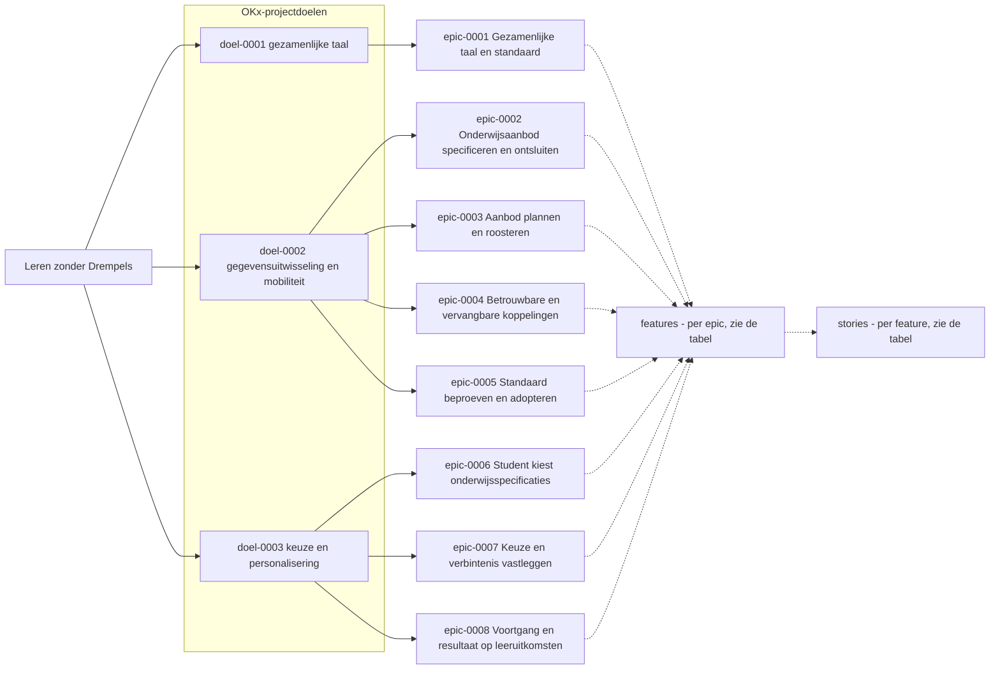

### 2.2 Requirementsleeswijzer

Elke rij draagt een id om naar te verwijzen (doel-0001, epic-0001, feature-0001, story-0001: plat per soort, voluit met vier cijfers) en een kolom Bron: de context en bronvermelding van die rij. Alle verwijzingen leven in de tabellen zelf, niet in deze leesroute. Systeemafkortingen: OC (onderwijscatalogus), SKS (studentkeuzesysteem), P&R (planning en roostering), SIS (studentinformatiesysteem), LMS (leermanagementsysteem), SVS (studievoortgangsysteem). Bronafkortingen: ADR (architectuurbesluit), U (uitgangspunt), OKx-AP (architectuurprincipe).

#### 2.2.1 Opdracht en doelen ([opdracht.md](#26-de-opdracht-leren-zonder-drempels))

- **Wat**: de doelen die vanuit de Npuls-programmacontext (Leren zonder Drempels) aan het project OKx zijn gesteld. Vooral voor product owner en kernteam.
- **Rij**: doel-id, omschrijving, bron; de tabel "Van doel naar epic" is de stap omlaag.

#### 2.2.2 Epics ([epics.md](#27-epics))

- **Wat**: vertalen de doelen naar thema's, bekwaamheden van de keten. Vooral voor product owner en kernteam.
- **Rij**: "Draagt bij aan" = de ouder (het doel) · Features = de stap omlaag · Bron.

#### 2.2.3 Features ([features.md](#28-features))

- **Wat**: één concreet stuk van een thema dat de keten moet kunnen, zoals kiesbaarheid bepalen of specificaties versioneren zonder verwijzingen te breken; per epic een eigen sectie. Vooral voor kernteam en technische werkgroep.
- **Rij**: Epic-cel = de ouder · Stories = de stap omlaag ("geen" = nog niet uitgewerkt) · Bron.

#### 2.2.4 Stories ([stories.md](#29-stories))

- **Wat**: één toetsbare wens van één actor, in één zin ("Als ... wil ik ... zodat ..."). Vooral voor de technische werkgroep en leveranciers.
- **Rij**: Feature-cel = de ouder · Functionele eisen = de brug naar de techniek ("geen" = nog geen eis) · Bron.

### 2.3 Aansluiting op de techniek

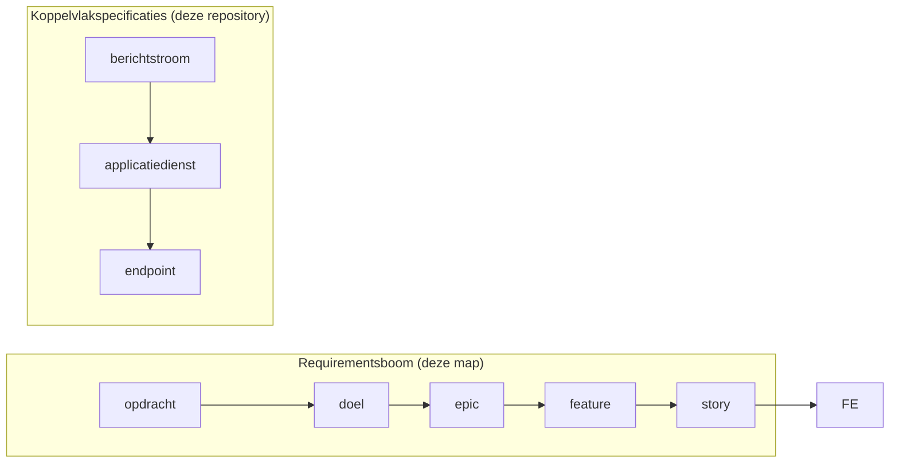

Per koppeling beschrijft een [koppelingspecificatie](Koppelingspecificaties) welke berichtstromen erover lopen. De kolom Ingevuld door van een story wijst de stroom aan die haar realiseert; die stroom noemt de story terug. Een stroom zet [applicatiediensten](Applicatiediensten) in, en elke dienst legt zijn verplichtingen en endpoints vast. Wie een featureset wil ondersteunen, claimt de bijbehorende diensten.

### 2.4 Bijdragen

- Vorm en spelregels staan in de [skill okx-requirements-boom](https://github.com/Npuls-OKx/meta/blob/bd6fc9499b283fe974fd32c87bbb9307e75e7d1b/.agents/skills/okx-requirements-boom/SKILL.md) (gepind). Kern: één document per laag, elke rij één ouder, één bron en een id, overzicht boven volledigheid.
- Elke wijziging haalt de navigatiecontrole: `python3 scripts/validate-requirementsboom-navigatie.py` plus `python3 -m unittest discover -s tests`; beide draaien ook in de CI op elke pull request.
- Een idee of bevinding wordt een issue onder een milestone van deze repository; planningsstatus leeft in milestones en issues, niet in deze tabellen.
- Herkomst en verificatie van elke rij: de [extractieverantwoording](https://github.com/Npuls-OKx/meta/blob/bd6fc9499b283fe974fd32c87bbb9307e75e7d1b/architecture/agent-artifacts/research/20260806_0837_requirementsboom-extractie.md) met de parkeerlijst; oudere documenten gebruiken id-vormen van vóór de hernummering, de [hernummeringstabel](https://github.com/Npuls-OKx/meta/blob/bd6fc9499b283fe974fd32c87bbb9307e75e7d1b/architecture/agent-artifacts/research/20260816_1820_hernummering-requirementsboom.md) vertaalt oud naar nieuw.
- Eis-id's en uitvoerbare scenario's staan bewust niet in de boom; die achtergrondmechaniek volgt gefaseerd, zie de [synthese van het onderzoek](https://github.com/Npuls-OKx/meta/blob/bd6fc9499b283fe974fd32c87bbb9307e75e7d1b/architecture/agent-artifacts/research/20260804_1700_oplossingsrichtingen-business-techniek.md).
- Werkwijze voor branches, issues en review: [CONTRIBUTING](https://github.com/Npuls-OKx/meta/blob/bd6fc9499b283fe974fd32c87bbb9307e75e7d1b/CONTRIBUTING.md) (gepind).

### 2.5 Scope

Deze map bevat de requirementsboom: de vier laagdocumenten en deze leeswijzer. De boom verwijst naar bestaande documenten en herhaalt ze niet. Al het overige valt buiten scope.

<!-- pagina-einde -->

### 2.6 De opdracht: Leren zonder Drempels

Laag 1 van de [requirementsboom](#2-requirementsboom): waarom OKx bestaat en aan welke doelen elke epic bijdraagt.

#### 2.6.1 Context

OKx is onderdeel van het Npuls-groeifondsprogramma, pijler [Leren zonder Drempels](https://npuls.nl/pijlers/leren-zonder-drempels/). De kern van die pijler: lerenden ontwikkelen zich op een manier die bij hen past en krijgen meer regie over hun eigen leer- en ontwikkelroute, zonder (administratieve) drempels. Mbo (middelbaar beroepsonderwijs), hbo (hoger beroepsonderwijs) en wo (wetenschappelijk onderwijs) werken daarvoor aan een gezamenlijke onderwijsruimte met geharmoniseerde afspraken.

De pijler kent vijf programmaonderdelen. OKx draagt er een en raakt er twee:

| Programmaonderdeel | Wat het regelt | Rol van OKx |
|---|---|---|
| Identiteit | Eenmalige digitale identiteit (eduID) voor alle instellingen | voorwaarde: identiteitsuitgifte (identity provisioning) is nodig voor ketenwerking |
| Ontsluiten onderwijsaanbod | Gebundelde informatie over onderwijsmogelijkheden | **dit is OKx**, naast OKE (Onderwijslogistiek Keten Examen) en SURFeduhub |
| Aanmelden en inschrijven | Gestandaardiseerde aanmelding voor volledige en deelopleidingen | raakvlak: keuze en verbintenis |
| Credentials | Digitale portefeuille (eduwallet) en microcredentials | raakvlak: resultaat op leeruitkomsten |
| Verrekeningen | Financiële afrekening tussen instellingen | raakvlak: instellingsoverstijgende scenario's |

#### 2.6.2 Projectdoelen

De drie doelen waar elke [epic](#27-epics) aan bijdraagt.

| Doel | Omschrijving | Bron |
|---|---|---|
| doel-0001 | OKx levert een gezamenlijke taal en standaarden voor gegevensuitwisseling die een scala aan flexibilisering mogelijk maken. | [Leerroute-uitwerking §1.2](https://github.com/Npuls-OKx/meta/blob/bd6fc9499b283fe974fd32c87bbb9307e75e7d1b/architecture/docs/specificatie/leerroute-uitwerking/doc/leerroute-uitwerking-lr1.md#12-wat-wil-okx-bereiken) |
| doel-0002 | OKx realiseert functionele en technische gegevensuitwisseling voor mbo, hbo en wo die studentmobiliteit ondersteunt. | [Leerroute-uitwerking §1.2](https://github.com/Npuls-OKx/meta/blob/bd6fc9499b283fe974fd32c87bbb9307e75e7d1b/architecture/docs/specificatie/leerroute-uitwerking/doc/leerroute-uitwerking-lr1.md#12-wat-wil-okx-bereiken) |
| doel-0003 | OKx ondersteunt keuze, personalisering en ketenoverstijgende routes van de student binnen wettelijke en kwaliteitskaders, met de leeruitkomst als sleutel. | [ADR 0003](../Referentiemateriaal/adr/0003-student-kiest-leeruitkomsten-domeinprincipes.md) |

#### 2.6.3 Van doel naar epic

| Doel | Epics die eraan bijdragen |
|---|---|
| [doel-0001](#doel-0001) | [epic-0001 Gezamenlijke taal en standaard](#epic-0001) |
| [doel-0002](#doel-0002) | [epic-0002 Onderwijsaanbod specificeren en ontsluiten](#epic-0002); [epic-0003 Aanbod plannen en roosteren](#epic-0003); [epic-0004 Betrouwbare en vervangbare koppelingen](#epic-0004); [epic-0005 Standaard beproeven en adopteren](#epic-0005) |
| [doel-0003](#doel-0003) | [epic-0006 Student kiest onderwijsspecificaties](#epic-0006); [epic-0007 Keuze en verbintenis vastleggen](#epic-0007); [epic-0008 Voortgang en resultaat op leeruitkomsten](#epic-0008) |

De epics zelf, met doel en bron: [epics.md](#27-epics).

<!-- pagina-einde -->

### 2.7 Epics

Laag 2 van de [requirementsboom](#2-requirementsboom): de bekwaamheden van de keten, elk gekoppeld aan een [projectdoel](#26-de-opdracht-leren-zonder-drempels).

Zes epics zijn tot stories uitgewerkt, in wisselende diepte; de epics voor gezamenlijke taal en voor beproeven en adopteren dragen alleen features. De kandidaten voor verdere uitwerking staan op de [parkeerlijst](https://github.com/Npuls-OKx/meta/blob/bd6fc9499b283fe974fd32c87bbb9307e75e7d1b/architecture/agent-artifacts/research/20260806_0837_requirementsboom-extractie.md#parkeerlijst).

| Id | Epic | Doel | Draagt bij aan | Bron | Features |
|---|---|---|---|---|---|
| epic-0001 | Gezamenlijke taal en standaard | Ketenpartijen spreken dezelfde taal: één begrippenkader en uniforme leeruitkomstdefinities, aangesloten op landelijke referentiemodellen. | [doel-0001](#doel-0001) | [Begrippenkader](https://github.com/Npuls-OKx/meta/blob/bd6fc9499b283fe974fd32c87bbb9307e75e7d1b/architecture/docs/specificatie/leerroute-uitwerking/doc/begrippenkader.md) | [features](#281-gezamenlijke-taal-en-standaard) |
| epic-0002 | Onderwijsaanbod specificeren en ontsluiten | Elke ketenpartij werkt met dezelfde actuele onderwijsspecificaties en hetzelfde aanbod uit de onderwijscatalogus. | [doel-0002](#doel-0002) | [Scenario 1.1](https://github.com/Npuls-OKx/meta/blob/bd6fc9499b283fe974fd32c87bbb9307e75e7d1b/architecture/docs/specificatie/leerroute-uitwerking/doc/scenario-uitwerkingen/scenario-1.1-regulier-happyflow.md) | [features](#282-onderwijsaanbod-specificeren-en-ontsluiten) |
| epic-0003 | Aanbod plannen en roosteren | Studenten krijgen tijdig haalbaar, gefaseerd en geroosterd aanbod, met heldere terugkoppeling op hun keuzes. | [doel-0002](#doel-0002) | [Scenario 1.1](https://github.com/Npuls-OKx/meta/blob/bd6fc9499b283fe974fd32c87bbb9307e75e7d1b/architecture/docs/specificatie/leerroute-uitwerking/doc/scenario-uitwerkingen/scenario-1.1-regulier-happyflow.md) | [features](#283-aanbod-plannen-en-roosteren) |
| epic-0004 | Betrouwbare en vervangbare koppelingen | Instellingen vervangen componenten zonder ketenimpact, dankzij betrouwbare, veilige en versioneerbare koppelingen. | [doel-0002](#doel-0002) | [Architectuurprincipes, OKx-AP04](../Referentiemateriaal/principes/principes.md) | [features](#284-betrouwbare-en-vervangbare-koppelingen) |
| epic-0005 | Standaard beproeven en adopteren | Pilotscholen, instellingen en leveranciers implementeren en adopteren de standaard, beproefd in pilots. | [doel-0002](#doel-0002) | [Meetingverslag 17 april](https://github.com/Npuls-OKx/meta/blob/bd6fc9499b283fe974fd32c87bbb9307e75e7d1b/architecture/meetings/20260417_okx_kernteam_inhoud_uitwerken_studentkeuze_roostering_planning_pocs/summary.md#stakeholdermanagement-en-adoptiestrategie) | [features](#285-standaard-beproeven-en-adopteren) |
| epic-0006 | Student kiest onderwijsspecificaties | De student kiest zijn onderwijsspecificaties vrij en instellingsonafhankelijk, met zekerheid dat die keuze geldig is. | [doel-0003](#doel-0003) | [ADR 0012](../Referentiemateriaal/adr/0012-leerroute-onafhankelijk-keuzegate-nominaal-maatwerk.md) | [features](#286-student-kiest-onderwijsspecificaties) |
| epic-0007 | Keuze en verbintenis vastleggen | Keuze, intekening en verbintenis staan herleidbaar vast en zijn consistent bekend bij alle betrokken systemen. | [doel-0003](#doel-0003) | [Persona Jochem, instellingsjourney](https://github.com/Npuls-OKx/meta/blob/bd6fc9499b283fe974fd32c87bbb9307e75e7d1b/architecture/docs/specificatie/leerroute-uitwerking/doc/persona_jochem.md#instellingsjourney) | [features](#287-keuze-en-verbintenis-vastleggen) |
| epic-0008 | Voortgang en resultaat op leeruitkomsten | Voortgang en resultaten op leeruitkomsten zijn instellingsoverstijgend herleidbaar voor student en instelling. | [doel-0003](#doel-0003) | [Uitgangspunt U6](#6-uitgangspunten-voor-koppelingspecificaties) | [features](#288-voortgang-en-resultaat-op-leeruitkomsten) |

<!-- pagina-einde -->

### 2.8 Features

Laag 3 van de [requirementsboom](#2-requirementsboom): afgebakend gedrag per [epic](#27-epics). De ouder staat per rij in de kolom Epic en als groepering in de sectiekop; de kolom Stories linkt per feature naar zijn uitgewerkte [stories](#29-stories), of draagt "geen" zolang die uitwerking ontbreekt.

#### 2.8.1 [Gezamenlijke taal en standaard](#epic-0001)

| Id | Feature | Omschrijving | Bron | Epic | Stories |
|---|---|---|---|---|---|
| feature-0001 | Formele begrippenlijst als artefact | Alle informatiemodellen en data gebruiken eenduidige termen, herleidbaar tot één vastgestelde begrippenlijst. | [Sparsessie 5 augustus](https://github.com/Npuls-OKx/meta/blob/bd6fc9499b283fe974fd32c87bbb9307e75e7d1b/architecture/agent-artifacts/research/20260806_0837_requirementsboom-extractie.md#meetingbronnen-die-alleen-extern-zijn-vastgelegd) | [epic-0001](#epic-0001) | geen |
| feature-0002 | Uitlijning met ROSA en KOI | Instellingen en landelijke systemen herkennen dezelfde begrippen, zonder eigen vertaalslag naar ROSA (Referentie Onderwijs Sector Architectuur) of KOI (Kernmodel Onderwijsinformatie). | [Meetingverslag 30 april](https://github.com/Npuls-OKx/meta/blob/bd6fc9499b283fe974fd32c87bbb9307e75e7d1b/architecture/meetings/20260430_nde_nvd_klus53_allignment_OKx_referentiekader/summary.md#executive-summary) | [epic-0001](#epic-0001) | geen |
| feature-0003 | N:M-cardinaliteit en prerequisite-relaties | Systemen leggen relaties tussen leeruitkomsten, onderdelen en voorwaarden (prerequisites) eenduidig vast, ook waar één leeruitkomst meerdere onderdelen raakt. | [Informatie-en-gegevensmodellen, regels bij de schema's](https://github.com/Npuls-OKx/Public/blob/informatie-en-gegevensmodellen-v0.1.0/Informatie-en-gegevensmodellen/regels.md) | [epic-0001](#epic-0001) | geen |
| feature-0004 | Eenduidige regelevaluatie (conformance) | Elk systeem berekent voor dezelfde keuzeregel dezelfde uitkomst, een voorwaarde voor conformance-toetsing. | [Keuze-requirements R6](https://github.com/Npuls-OKx/meta/blob/bd6fc9499b283fe974fd32c87bbb9307e75e7d1b/architecture/docs/specificatie/student-keuze/keuze-requirements.md#6-requirements) | [epic-0001](#epic-0001) | geen |
| feature-0005 | Koppeling versus koppelvlak als vaste terminologie | Alle betrokkenen gebruiken de termen koppeling en koppelvlak eenduidig en zonder onderlinge verwarring. | [Uitgangspunt U2](#6-uitgangspunten-voor-koppelingspecificaties) | [epic-0001](#epic-0001) | geen |
| feature-0006 | Engelse veldnamen met Nederlandse mapping | Systemen gebruiken Engelstalige veldnamen die eenduidig terugvoeren op de eerdere Nederlandse veldnamen. | [Mapping veldnamen](https://github.com/Npuls-OKx/Public/blob/informatie-en-gegevensmodellen-v0.1.0/Informatie-en-gegevensmodellen/mapping.md) | [epic-0001](#epic-0001) | geen |

#### 2.8.2 [Onderwijsaanbod specificeren en ontsluiten](#epic-0002)

| Id | Feature | Omschrijving | Bron | Epic | Stories |
|---|---|---|---|---|---|
| feature-0007 | Catalogus vullen vanuit curriculumontwerp | Alle ketenpartijen binnen de instelling vertrouwen op één actuele, formeel vastgestelde bron voor haar onderwijsspecificaties. | [ADR 0002](../Referentiemateriaal/adr/0002-prioriteitsketen-catalogus-drielagen-fundament.md) | [epic-0002](#epic-0002) | geen |
| feature-0008 | Hiërarchische, refereerbare onderwijsspecificatiestructuur | Elk onderdeel van de onderwijsspecificatie is eenduidig herleidbaar en herbruikbaar, ook over leerwegen en doelgroepvarianten heen. | [Meetingverslag 10 juli, besluiten](https://github.com/Npuls-OKx/meta/blob/bd6fc9499b283fe974fd32c87bbb9307e75e7d1b/architecture/meetings/20260710_okx_kernteam_inhoud_specificatie_uitwerken_OC_P/summary.md#besluiten) en [technische details](https://github.com/Npuls-OKx/meta/blob/bd6fc9499b283fe974fd32c87bbb9307e75e7d1b/architecture/meetings/20260710_okx_kernteam_inhoud_specificatie_uitwerken_OC_P/summary.md#technische--implementatiedetails) | [epic-0002](#epic-0002) | [story-0001](#story-0001) |
| feature-0009 | Stabiele identiteit en versionering van specificaties | Verwijzingen van afnemers naar een specificatie blijven geldig, ook na inhoudelijke wijzigingen. | [Regels bij de schema's](https://github.com/Npuls-OKx/Public/blob/informatie-en-gegevensmodellen-v0.1.0/Informatie-en-gegevensmodellen/regels.md) | [epic-0002](#epic-0002) | [story-0002](#story-0002); [story-0030](#story-0030); [story-0032](#story-0032) |
| feature-0010 | Leeromgeving inrichten op de specificatie | De leeromgeving is altijd inhoudelijk consistent met de specificatie, met ruimte voor eigen invulling op lesniveau. | [Koppelingspecificatie OC-LMS](#43-onderwijscatalogus-naar-leermanagementsysteem) | [epic-0002](#epic-0002) | [story-0003](#story-0003); [story-0029](#story-0029); [story-0031](#story-0031) |

#### 2.8.3 [Aanbod plannen en roosteren](#epic-0003)

| Id | Feature | Omschrijving | Bron | Epic | Stories |
|---|---|---|---|---|---|
| feature-0011 | Drie stadia van onderwijsaanbod | Systemen onderscheiden betrouwbaar in welke fase het aanbod verkeert, van specificatie tot concreet rooster. | [Begrippenkader, stadia van onderwijsaanbod](https://github.com/Npuls-OKx/meta/blob/bd6fc9499b283fe974fd32c87bbb9307e75e7d1b/architecture/docs/specificatie/leerroute-uitwerking/doc/begrippenkader.md#stadia-van-onderwijsaanbod-specificatie-planbaar-geroosterd) | [epic-0003](#epic-0003) | [story-0004](#story-0004); [story-0005](#story-0005) |
| feature-0012 | Planbaarheid als rijpheidskenmerk | Planners plannen zonder giswerk op elke horizon: meerjaren-, jaar- en periodeplanning kennen elk hun vooraf vastgelegde gegevensset in de specificatie. | [Kaderscenario leerroute 1](../Referentiemateriaal/kaderscenario%27s/leerroute-1-regulier.md) | [epic-0003](#epic-0003) | geen |
| feature-0013 | Geldig, gefaseerd aanbod afleiden | Het geplande aanbod is altijd geldig en sluit in de tijd logisch aan op de vereiste leeruitkomsten. | [Keuze-requirements R9 en R11](https://github.com/Npuls-OKx/meta/blob/bd6fc9499b283fe974fd32c87bbb9307e75e7d1b/architecture/docs/specificatie/student-keuze/keuze-requirements.md#6-requirements) | [epic-0003](#epic-0003) | [story-0006](#story-0006); [story-0007](#story-0007); [story-0008](#story-0008); [story-0026](#story-0026); [story-0028](#story-0028) |
| feature-0014 | Eigenaarschap van het aanbodobject | Planninggegevens en specificatie-inhoud blijven gescheiden; het aanbodobject bevat geen dubbele of verouderde specificatiegegevens. | [Meetingverslag 10 juli](https://github.com/Npuls-OKx/meta/blob/bd6fc9499b283fe974fd32c87bbb9307e75e7d1b/architecture/meetings/20260710_okx_kernteam_inhoud_specificatie_uitwerken_OC_P/summary.md#besluiten) | [epic-0003](#epic-0003) | geen |
| feature-0015 | Haalbaarheid van keuze en ontwerp toetsen | De student weet vóór bevestiging of zijn definitieve keuze haalbaar is, via acceptatie, afwijzing of een alternatief. | [ADR 0015](../Referentiemateriaal/adr/0015-request-for-offering-haalbaarheidstoets-tussen-sks-en-planning.md) | [epic-0003](#epic-0003) | [story-0009](#story-0009) |

#### 2.8.4 [Betrouwbare en vervangbare koppelingen](#epic-0004)

| Id | Feature | Omschrijving | Bron | Epic | Stories |
|---|---|---|---|---|---|
| feature-0016 | Betrouwbaar berichtenverkeer | Consumenten missen nooit een mutatie en verwerken elk bericht eenmalig en in de juiste volgorde. | [Uitgangspunten U4 en U5](#6-uitgangspunten-voor-koppelingspecificaties) | [epic-0004](#epic-0004) | [story-0010](#story-0010); [story-0011](#story-0011) |
| feature-0017 | Authenticatie via OAuth 2.0 Client Credentials | Alleen geautoriseerde consumenten krijgen toegang tot endpoints, via één gedeeld mechanisme voor alle koppelvlakken. | [Auth-standaard](#5-auth-standaard-voor-koppelvlakken) | [epic-0004](#epic-0004) | geen |
| feature-0018 | Maximaal twee actieve major versies | Afnemers hebben altijd voldoende tijd om over te stappen naar een nieuwe major versie. | [Meetingverslag 14 juli](https://github.com/Npuls-OKx/meta/blob/bd6fc9499b283fe974fd32c87bbb9307e75e7d1b/architecture/meetings/20260714_SI_afstemming_PR_specificatie_uitwerking_P_en_R/summary.md#progress) | [epic-0004](#epic-0004) | geen |
| feature-0019 | Intra-instelling eerst, federatie gefaseerd | Instellingen gebruiken koppelingen eerst betrouwbaar binnen de eigen instelling, vóór cross-instelling uitbreiding nodig is. | [Uitgangspunt U10](#6-uitgangspunten-voor-koppelingspecificaties) | [epic-0004](#epic-0004) | geen |

#### 2.8.5 [Standaard beproeven en adopteren](#epic-0005)

| Id | Feature | Omschrijving | Bron | Epic | Stories |
|---|---|---|---|---|---|
| feature-0020 | Standaard beproeven met pilotscholen | De standaard is bij pilotinstellingen in de praktijk beproefd voordat bredere adoptie start. | [Meetingverslag 17 april, POC-scholen](https://github.com/Npuls-OKx/meta/blob/bd6fc9499b283fe974fd32c87bbb9307e75e7d1b/architecture/meetings/20260417_okx_kernteam_inhoud_uitwerken_studentkeuze_roostering_planning_pocs/summary.md#voortgang-en-selectie-van-de-poc-scholen) | [epic-0005](#epic-0005) | geen |
| feature-0021 | Kennisopbouw bij instellingen | Instellingen beschikken over de kennis om de standaard en de onderliggende referentiearchitectuur toe te passen. | [Meetingverslag 17 april, MORA en kennisoverdracht](https://github.com/Npuls-OKx/meta/blob/bd6fc9499b283fe974fd32c87bbb9307e75e7d1b/architecture/meetings/20260417_okx_kernteam_inhoud_uitwerken_studentkeuze_roostering_planning_pocs/summary.md#uitdagingen-rondom-de-mora-en-kennisoverdracht) | [epic-0005](#epic-0005) | geen |
| feature-0022 | Leveranciersafspraken borgen via richtlijnen | Afspraken met leveranciers zijn geborgd zodat implementaties de standaard blijven volgen. | [Meetingverslag 17 april, EduV en borging](https://github.com/Npuls-OKx/meta/blob/bd6fc9499b283fe974fd32c87bbb9307e75e7d1b/architecture/meetings/20260417_okx_kernteam_inhoud_uitwerken_studentkeuze_roostering_planning_pocs/summary.md#status-van-eduv-en-potentiële-borging-integratiestandaarden) | [epic-0005](#epic-0005) | geen |
| feature-0023 | Feedbackloop met leveranciers en scholen | Specificaties zijn aangescherpt op basis van praktijkervaring van leveranciers en scholen. | [Meetingverslag 17 april, adoptiestrategie](https://github.com/Npuls-OKx/meta/blob/bd6fc9499b283fe974fd32c87bbb9307e75e7d1b/architecture/meetings/20260417_okx_kernteam_inhoud_uitwerken_studentkeuze_roostering_planning_pocs/summary.md#stakeholdermanagement-en-adoptiestrategie) | [epic-0005](#epic-0005) | geen |

#### 2.8.6 [Student kiest onderwijsspecificaties](#epic-0006)

| Id | Feature | Omschrijving | Bron | Epic | Stories |
|---|---|---|---|---|---|
| feature-0024 | Kiesbaarheid bepalen | Voor elke student staat op elk niveau vast welke onderwijsspecificaties hij mag kiezen (eligibility). | [Keuze-requirements R1](https://github.com/Npuls-OKx/meta/blob/bd6fc9499b283fe974fd32c87bbb9307e75e7d1b/architecture/docs/specificatie/student-keuze/keuze-requirements.md#6-requirements) | [epic-0006](#epic-0006) | [story-0012](#story-0012); [story-0013](#story-0013); [story-0014](#story-0014) |
| feature-0025 | Keuzecriteria als queryparameters op de aanbodquery | Systemen doorzoeken het onderwijsaanbod met precieze, herbruikbare criteria die rechtstreeks uit de leervraag volgen. | [ADR 0007](../Referentiemateriaal/adr/0007-student-keuze-criteria-als-query-parameters-onderwijs-aanbod.md) | [epic-0006](#epic-0006) | geen |
| feature-0026 | Regelsets los van items, met min/max-keuzeregels | Beheerders wijzigen regelsets los van catalogusitems; keuzeregels leggen per benoemd bereik vast hoeveel er minimaal en maximaal gekozen wordt. | [Keuze-requirements R2 en R5](https://github.com/Npuls-OKx/meta/blob/bd6fc9499b283fe974fd32c87bbb9307e75e7d1b/architecture/docs/specificatie/student-keuze/keuze-requirements.md#6-requirements) | [epic-0006](#epic-0006) | [story-0015](#story-0015); [story-0016](#story-0016); [story-0017](#story-0017); [story-0018](#story-0018) |
| feature-0027 | Leeruitkomst-id's als verbindende sleutels in keuzeregels | Systemen wisselen keuzegegevens uit zonder de inhoud van leeruitkomsten te hoeven delen. | [ADR 0026](../Referentiemateriaal/adr/0026-leeruitkomst-als-verbindende-sleutel.md) en [Keuze-requirements R14 en R15](https://github.com/Npuls-OKx/meta/blob/bd6fc9499b283fe974fd32c87bbb9307e75e7d1b/architecture/docs/specificatie/student-keuze/keuze-requirements.md#6-requirements) | [epic-0006](#epic-0006) | geen |
| feature-0028 | Regelsets versioneren voor verantwoording | Achteraf staat vast welke regelversie gold bij een keuze, nodig voor de diplomaverantwoording. | [Keuze-requirements R17](https://github.com/Npuls-OKx/meta/blob/bd6fc9499b283fe974fd32c87bbb9307e75e7d1b/architecture/docs/specificatie/student-keuze/keuze-requirements.md#6-requirements) | [epic-0006](#epic-0006) | geen |
| feature-0029 | Bottom-up en top-down samenstellen | Een opleiding is van bovenaf en van onderop samen te stellen, met dezelfde onderliggende onderdelen als uitkomst. | [Keuze-requirements R13](https://github.com/Npuls-OKx/meta/blob/bd6fc9499b283fe974fd32c87bbb9307e75e7d1b/architecture/docs/specificatie/student-keuze/keuze-requirements.md#6-requirements) | [epic-0006](#epic-0006) | [story-0019](#story-0019) |

#### 2.8.7 [Keuze en verbintenis vastleggen](#epic-0007)

| Id | Feature | Omschrijving | Bron | Epic | Stories |
|---|---|---|---|---|---|
| feature-0030 | Verbintenis als toestandsmachine per niveau | Systemen en actoren stellen op elk niveau, van programma tot toets, de actuele status van de verbintenis vast. | [Begrippenkader, stadia van onderwijsverbintenis](https://github.com/Npuls-OKx/meta/blob/bd6fc9499b283fe974fd32c87bbb9307e75e7d1b/architecture/docs/specificatie/leerroute-uitwerking/doc/begrippenkader.md#stadia-van-onderwijsverbintenis-aangemeld-ingeschreven-deelnemend-afgerond) | [epic-0007](#epic-0007) | [story-0025](#story-0025); [story-0027](#story-0027) |
| feature-0031 | Keuze gescheiden van inschrijving en resultaat | Studentkeuze staat als eigen verantwoordelijkheid los van de formele inschrijving en van resultaat en voortgang. | [ADR 0014](../Referentiemateriaal/adr/0014-splitsing-inschrijving-rodkrs-en-studentkeuze-sks.md) en [ADR 0009](../Referentiemateriaal/adr/0009-sks-svs-rollenverdeling-keuze-vs-resultaat-voortgang.md) | [epic-0007](#epic-0007) | geen |
| feature-0032 | Examenplanwijzigingen alleen na impactanalyse | Een wijziging in het examenplan raakt lopende verbintenissen nooit ongecontroleerd. | [Koppelingspecificatie OC-SIS, acceptatietoets](#428-acceptatietoets-bij-wijziging-examenplan) | [epic-0007](#epic-0007) | [story-0020](#story-0020) |

#### 2.8.8 [Voortgang en resultaat op leeruitkomsten](#epic-0008)

| Id | Feature | Omschrijving | Bron | Epic | Stories |
|---|---|---|---|---|---|
| feature-0033 | Resultaatstructuur inrichten en resultaten registreren | Elk onderwijsresultaat koppelt gewogen en herleidbaar aan de behaalde leeruitkomsten van de student. | [ADR 0022](../Referentiemateriaal/adr/0022-resultaatbegrippen-conform-rosa-koi.md) | [epic-0008](#epic-0008) | [story-0021](#story-0021); [story-0022](#story-0022); [story-0023](#story-0023) |
| feature-0034 | Voorwaarden vooraf uitgedrukt in behaalde leeruitkomsten | Een voorwaarde vooraf (prerequisite) is uitgedrukt in behaalde leeruitkomsten, niet in doorlopen specificaties; via welke route de student de leeruitkomst behaalde doet er niet toe. | [Keuze-requirements R7](https://github.com/Npuls-OKx/meta/blob/bd6fc9499b283fe974fd32c87bbb9307e75e7d1b/architecture/docs/specificatie/student-keuze/keuze-requirements.md#6-requirements) | [epic-0008](#epic-0008) | geen |
| feature-0035 | Aanvullend resultaat-koppelvlak voor bewijsvoering | Afnemers beschikken naast de verbintenisstatus over rijkere bewijsvoering van resultaten op leeruitkomstniveau. | [Begrippenkader, stadia van onderwijsverbintenis](https://github.com/Npuls-OKx/meta/blob/bd6fc9499b283fe974fd32c87bbb9307e75e7d1b/architecture/docs/specificatie/leerroute-uitwerking/doc/begrippenkader.md#stadia-van-onderwijsverbintenis-aangemeld-ingeschreven-deelnemend-afgerond) | [epic-0008](#epic-0008) | geen |
| feature-0036 | Toetsing zodra het leeruitkomst-niveau is behaald | De student kan toetsen zodra het vereiste niveau van de leeruitkomsten is behaald, ook zonder elke leergelegenheid te hebben bijgewoond. | [Scenario 3.1](https://github.com/Npuls-OKx/meta/blob/bd6fc9499b283fe974fd32c87bbb9307e75e7d1b/architecture/docs/specificatie/leerroute-uitwerking/doc/scenario-uitwerkingen/scenario-3.1-versnellen-by-design.md) | [epic-0008](#epic-0008) | [story-0024](#story-0024) |

<!-- pagina-einde -->

### 2.9 Stories

Laag 4 van de [requirementsboom](#2-requirementsboom): toetsbare wensen van één actor, per uitgewerkte [epic](#27-epics). Een story traceert via zijn feature terug naar de epic; de kolom Ingevuld door linkt naar de berichtstroom in een [koppelingspecificatie](Koppelingspecificaties) die de story realiseert. Die stroom noemt de applicatiediensten en het interactiepatroon waarmee dat gebeurt.

#### 2.9.1 [Onderwijsaanbod specificeren en ontsluiten](#epic-0002)

| Id | Story | Feature | Bron | Ingevuld door |
|---|---|---|---|---|
| story-0001 | Als onderwijsontwerper wil ik dat de keten bij publicatie valideert dat de studielast (studiebelastingsuren en studiepunten, SBU/EC) van onderliggende delen optelt naar het bovenliggende niveau, zodat een aggregatiefout tot terugdraaien (rollback) leidt. | [feature-0008 Hiërarchische, refereerbare onderwijsspecificatiestructuur](#feature-0008) | [ADR 0017](../Referentiemateriaal/adr/0017-hierarchisch-datamodel-aanbodstructuur-leeruitkomsten-en-sbuec-aggregatie.md) | geen |
| story-0002 | Als planner wil ik dat bij een specificatie-update de vorige versie actief blijft voor lopend aanbod en de nieuwe alleen op nieuw aanbod geldt, zodat lopende planningen niet breken. | [feature-0009 Stabiele identiteit en versionering van specificaties](#feature-0009) | [Archief leerroute-uitwerking §19, F10](https://github.com/Npuls-OKx/meta/blob/bd6fc9499b283fe974fd32c87bbb9307e75e7d1b/architecture/docs/specificatie/leerroute-uitwerking/doc/archief-conceptmodellen.md#19-faalmatrix--overzicht-ketenfaalmodi) | [Acceptatietoets bij late wijziging](#4110-acceptatietoets-bij-late-wijziging) |
| story-0003 | Als onderwijsontwikkelaar wil ik dat het leermanagementsysteem de gelegde leermiddelkoppeling als eigen resource terugmeldt, zodat de catalogus die kan ophalen en tonen bij het aanbod. | [feature-0010 Leeromgeving inrichten op de specificatie](#feature-0010) | [Koppelingspecificatie OC-LMS](#43-onderwijscatalogus-naar-leermanagementsysteem) | [Leeromgeving inrichten en leermiddelkoppeling melden](#437-leeromgeving-inrichten-en-leermiddelkoppeling-melden) |
| story-0029 | Als onderwijsontwikkelaar wil ik dat het leermanagementsysteem na de beschikbaar-melding de specificatiestructuur ophaalt, de leeromgeving inricht en de inrichtingsstatus met referentie terugmeldt, zodat de catalogus weet of de leeromgeving klaarstaat. | [feature-0010 Leeromgeving inrichten op de specificatie](#feature-0010) | [Koppelingspecificatie OC-LMS](#43-onderwijscatalogus-naar-leermanagementsysteem) | [Leeromgeving inrichten en leermiddelkoppeling melden](#437-leeromgeving-inrichten-en-leermiddelkoppeling-melden) |
| story-0030 | Als planner wil ik bij een specificatiewijziging alleen het verschil met de vorige versie kunnen ophalen, zodat ik de planning kan bijwerken zonder de volledige structuur opnieuw te verwerken. | [feature-0009 Stabiele identiteit en versionering van specificaties](#feature-0009) | [Koppelingspecificatie OC-P&R](#41-onderwijscatalogus-naar-planning-en-roostering) | [Opleidingsaanbod herplannen](#418-opleidingsaanbod-herplannen) |
| story-0031 | Als onderwijsontwikkelaar wil ik dat het leermanagementsysteem zijn inrichting bijwerkt op het verschil met de vorige specificatieversie, zodat een wijziging niet de volledige structuur opnieuw hoeft te doorlopen. | [feature-0010 Leeromgeving inrichten op de specificatie](#feature-0010) | [Koppelingspecificatie OC-LMS](#43-onderwijscatalogus-naar-leermanagementsysteem) | [Inrichting bijwerken na wijziging](#438-inrichting-bijwerken-na-wijziging) |
| story-0032 | Als beheerder van de onderwijscatalogus wil ik een statuswijziging kunnen melden die niet aan een nieuwe versie hangt, zoals van gepubliceerd naar gedeactiveerd, zodat afnemers hun afgeleide status bijwerken zonder herplanronde. | [feature-0009 Stabiele identiteit en versionering van specificaties](#feature-0009) | [Koppelingspecificatie OC-P&R](#41-onderwijscatalogus-naar-planning-en-roostering) | [Specificatiestatus gewijzigd melden](#4111-specificatiestatus-gewijzigd-melden) |

#### 2.9.2 [Aanbod plannen en roosteren](#epic-0003)

| Id | Story | Feature | Bron | Ingevuld door |
|---|---|---|---|---|
| story-0004 | Als roosteraar wil ik geroosterd aanbod per periode publiceren en beschikbaar stellen aan student en docent, zodat latere perioden planbaar blijven. | [feature-0011 Drie stadia van onderwijsaanbod](#feature-0011) | [Scenario 1.1](https://github.com/Npuls-OKx/meta/blob/bd6fc9499b283fe974fd32c87bbb9307e75e7d1b/architecture/docs/specificatie/leerroute-uitwerking/doc/scenario-uitwerkingen/scenario-1.1-regulier-happyflow.md) | geen |
| story-0005 | Als student wil ik voor de start van het onderwijs toegang tot het leermanagementsysteem en mijn periode-rooster krijgen, zodat ik op de eerste lesdag kan beginnen. | [feature-0011 Drie stadia van onderwijsaanbod](#feature-0011) | [Scenario 1.1](https://github.com/Npuls-OKx/meta/blob/bd6fc9499b283fe974fd32c87bbb9307e75e7d1b/architecture/docs/specificatie/leerroute-uitwerking/doc/scenario-uitwerkingen/scenario-1.1-regulier-happyflow.md) | geen |
| story-0006 | Als planner wil ik dat de catalogus een planbaar geworden specificatie met een dun event (id en versie) meldt en ik de structuur of delta kan ophalen, zodat ik er opleidingsaanbod van kan maken. | [feature-0013 Geldig, gefaseerd aanbod afleiden](#feature-0013) | [Koppelingspecificatie OC-P&R](#41-onderwijscatalogus-naar-planning-en-roostering) | [Opleidingsaanbod aanmaken](#417-opleidingsaanbod-aanmaken) |
| story-0007 | Als onderwijsontwikkelaar wil ik dat planning en roostering de verwerkingsstatus met referentie naar het opleidingsaanbod terugmeldt, zodat de catalogus weet of de specificatie planbaar bleek. | [feature-0013 Geldig, gefaseerd aanbod afleiden](#feature-0013) | [Koppelingspecificatie OC-P&R](#41-onderwijscatalogus-naar-planning-en-roostering) | [Opleidingsaanbod aanmaken](#417-opleidingsaanbod-aanmaken) en [Planning niet gelukt melden](#419-planning-niet-gelukt-melden) |
| story-0008 | Als planner wil ik per combinatie keuzedeel, locatie en periode bepalen hoeveel groepen ik beschikbaar stel, zodat keuzes stabiel tussen systemen uitwisselbaar zijn. | [feature-0013 Geldig, gefaseerd aanbod afleiden](#feature-0013) | [Keuze-requirements R4](https://github.com/Npuls-OKx/meta/blob/bd6fc9499b283fe974fd32c87bbb9307e75e7d1b/architecture/docs/specificatie/student-keuze/keuze-requirements.md#6-requirements) | geen |
| story-0026 | Als planner wil ik leergelegenheden uit een latere periode vervroegd kunnen roosteren en hun capaciteit kunnen uitbreiden voor een versnellende student, zodat versnelling zonder herontwerp van de route kan. | [feature-0013 Geldig, gefaseerd aanbod afleiden](#feature-0013) | [Scenario 1.3](https://github.com/Npuls-OKx/meta/blob/bd6fc9499b283fe974fd32c87bbb9307e75e7d1b/architecture/docs/specificatie/leerroute-uitwerking/doc/scenario-uitwerkingen/scenario-1.3-regulier-versnelling-by-accident.md) | geen |
| story-0028 | Als student wil ik gemiste leergelegenheden in een latere periode kunnen inhalen, zodat ik met beperkte uitloop mijn diploma haal. | [feature-0013 Geldig, gefaseerd aanbod afleiden](#feature-0013) | [Scenario 1.2](https://github.com/Npuls-OKx/meta/blob/bd6fc9499b283fe974fd32c87bbb9307e75e7d1b/architecture/docs/specificatie/leerroute-uitwerking/doc/scenario-uitwerkingen/scenario-1.2-regulier-vertraging-by-accident.md) | geen |
| story-0009 | Als onderwijsontwerper wil ik dat het planningssysteem mijn concept-programma met een snelle toets (quick scan) op realiseerbaarheid beoordeelt, zodat ik het ontwerp vóór publicatie kan aanpassen. | [feature-0015 Haalbaarheid van keuze en ontwerp toetsen](#feature-0015) | [Archief leerroute-uitwerking §19, F3](https://github.com/Npuls-OKx/meta/blob/bd6fc9499b283fe974fd32c87bbb9307e75e7d1b/architecture/docs/specificatie/leerroute-uitwerking/doc/archief-conceptmodellen.md#19-faalmatrix--overzicht-ketenfaalmodi) | geen |

#### 2.9.3 [Betrouwbare en vervangbare koppelingen](#epic-0004)

| Id | Story | Feature | Bron | Ingevuld door |
|---|---|---|---|---|
| story-0010 | Als beheerder van een afnemend systeem wil ik een afleveradres met event-typen kunnen registreren voordat events afgeleverd worden, zodat de aflevering vastligt. | [feature-0016 Betrouwbaar berichtenverkeer](#feature-0016) | [Koppelingspecificatie OC-P&R, abonnement registreren](#4113-abonnement-registreren) | [Abonnement registreren](#4113-abonnement-registreren) |
| story-0011 | Als beheerder van een afnemend systeem wil ik na een gemist of onverwerkbaar event de gepubliceerde specificaties en aanbod-instanties opnieuw kunnen opvragen, zodat uitval geen informatie kost. | [feature-0016 Betrouwbaar berichtenverkeer](#feature-0016) | [Koppelingspecificatie OC-P&R, reconciliatie](#4112-reconciliatie-na-gemist-event) | [Reconciliatie na gemist event](#4112-reconciliatie-na-gemist-event) |

#### 2.9.4 [Student kiest onderwijsspecificaties](#epic-0006)

| Id | Story | Feature | Bron | Ingevuld door |
|---|---|---|---|---|
| story-0012 | Als student wil ik dezelfde opleiding by design in een lager tempo kunnen volgen, bijvoorbeeld vier in plaats van drie jaar, zodat ik studeren met werk en gezin kan combineren. | [feature-0024 Kiesbaarheid bepalen](#feature-0024) | [Scenario 2.1](https://github.com/Npuls-OKx/meta/blob/bd6fc9499b283fe974fd32c87bbb9307e75e7d1b/architecture/docs/specificatie/leerroute-uitwerking/doc/scenario-uitwerkingen/scenario-2.1-temporiseren-by-design.md) | geen |
| story-0013 | Als student wil ik eerst de door mijn instelling voorgesorteerde keuzedelen zien, zodat ik gericht kan kiezen binnen mijn leerroute en keuzedeelruimte. | [feature-0024 Kiesbaarheid bepalen](#feature-0024) | [Persona Jochem, kiezen keuzedelen (instellingsjourney)](https://github.com/Npuls-OKx/meta/blob/bd6fc9499b283fe974fd32c87bbb9307e75e7d1b/architecture/docs/specificatie/leerroute-uitwerking/doc/persona_jochem.md#instellingsjourney-kiezen-keuzedelen) | geen |
| story-0014 | Als student wil ik alleen keuzedelen als kiesbaar zien wanneer ze op mijn locatie en in mijn periode beschikbaar zijn, zodat ik geen onhaalbare keuze maak. | [feature-0024 Kiesbaarheid bepalen](#feature-0024) | [Keuze-requirements R3](https://github.com/Npuls-OKx/meta/blob/bd6fc9499b283fe974fd32c87bbb9307e75e7d1b/architecture/docs/specificatie/student-keuze/keuze-requirements.md#6-requirements) | geen |
| story-0015 | Als planner wil ik dezelfde voorwaarde-regel gebruiken die het keuzemoment stuurde, zodat keuze en rooster niet uiteenlopen. | [feature-0026 Regelsets los van items, met min/max-keuzeregels](#feature-0026) | [Keuze-requirements R8](https://github.com/Npuls-OKx/meta/blob/bd6fc9499b283fe974fd32c87bbb9307e75e7d1b/architecture/docs/specificatie/student-keuze/keuze-requirements.md#6-requirements) | geen |
| story-0016 | Als instelling wil ik naast algemene en beroepsspecifieke keuzedelen eigen kiesbaarheidsklassen kunnen toevoegen, zodat de indeling niet vastligt. | [feature-0026 Regelsets los van items, met min/max-keuzeregels](#feature-0026) | [Keuze-requirements R10](https://github.com/Npuls-OKx/meta/blob/bd6fc9499b283fe974fd32c87bbb9307e75e7d1b/architecture/docs/specificatie/student-keuze/keuze-requirements.md#6-requirements) | geen |
| story-0017 | Als beheerder wil ik een keuzedeelprogramma via een regelset over opleidingen heen kunnen hergebruiken, zodat ik hetzelfde keuzedeel niet per opleiding opnieuw definieer. | [feature-0026 Regelsets los van items, met min/max-keuzeregels](#feature-0026) | [Informatie-en-gegevensmodellen, regels bij de schema's](https://github.com/Npuls-OKx/Public/blob/informatie-en-gegevensmodellen-v0.1.0/Informatie-en-gegevensmodellen/regels.md) | geen |
| story-0018 | Als instelling wil ik dezelfde regelvorm op elk specificatieniveau en op leeruitkomsten van elke orde kunnen toepassen, zodat keuzedelen nu en losse leeronderdelen straks dezelfde regels volgen. | [feature-0026 Regelsets los van items, met min/max-keuzeregels](#feature-0026) | [Keuze-requirements R16](https://github.com/Npuls-OKx/meta/blob/bd6fc9499b283fe974fd32c87bbb9307e75e7d1b/architecture/docs/specificatie/student-keuze/keuze-requirements.md#6-requirements) | geen |
| story-0019 | Als student wil ik mijn opleiding van onderop uit losse leeronderdelen kunnen samenstellen, zodat ik dezelfde leeruitkomsten bereik als via de nominale route van bovenaf. | [feature-0029 Bottom-up en top-down samenstellen](#feature-0029) | [Keuze-requirements R13](https://github.com/Npuls-OKx/meta/blob/bd6fc9499b283fe974fd32c87bbb9307e75e7d1b/architecture/docs/specificatie/student-keuze/keuze-requirements.md#6-requirements) | geen |

#### 2.9.5 [Keuze en verbintenis vastleggen](#epic-0007)

| Id | Story | Feature | Bron | Ingevuld door |
|---|---|---|---|---|
| story-0025 | Als student wil ik dat mijn verbintenis bij uitval wordt onderbroken en daarna hervat, zodat mijn opleiding na de uitval gewoon doorloopt. | [feature-0030 Verbintenis als toestandsmachine per niveau](#feature-0030) | [Scenario 1.2](https://github.com/Npuls-OKx/meta/blob/bd6fc9499b283fe974fd32c87bbb9307e75e7d1b/architecture/docs/specificatie/leerroute-uitwerking/doc/scenario-uitwerkingen/scenario-1.2-regulier-vertraging-by-accident.md) | geen |
| story-0027 | Als instelling wil ik per werkproces de actuele verbintenisstatus kunnen vaststellen, zodat zichtbaar is dat een student in totaal op tempo is maar per werkproces uit ritme. | [feature-0030 Verbintenis als toestandsmachine per niveau](#feature-0030) | [Scenario 1.4](https://github.com/Npuls-OKx/meta/blob/bd6fc9499b283fe974fd32c87bbb9307e75e7d1b/architecture/docs/specificatie/leerroute-uitwerking/doc/scenario-uitwerkingen/scenario-1.4-regulier-hybride-by-accident.md) | geen |
| story-0020 | Als examencommissie wil ik dat een examenplanwijziging op een resultaatstructuur waarop verbintenissen lopen eerst een acceptatietoets doorloopt, zodat lopende verbintenissen beschermd blijven. | [feature-0032 Examenplanwijzigingen alleen na impactanalyse](#feature-0032) | [Koppelingspecificatie OC-SIS, acceptatietoets](#428-acceptatietoets-bij-wijziging-examenplan) | [Acceptatietoets bij wijziging examenplan](#428-acceptatietoets-bij-wijziging-examenplan) |

#### 2.9.6 [Voortgang en resultaat op leeruitkomsten](#epic-0008)

| Id | Story | Feature | Bron | Ingevuld door |
|---|---|---|---|---|
| story-0021 | Als docent wil ik tijdens de uitvoering per les de verbintenistoestand (Association.state) van studenten muteren en resultaten vastleggen, zodat voortgang en resultaat herleidbaar zijn. | [feature-0033 Resultaatstructuur inrichten en resultaten registreren](#feature-0033) | [Scenario 1.1](https://github.com/Npuls-OKx/meta/blob/bd6fc9499b283fe974fd32c87bbb9307e75e7d1b/architecture/docs/specificatie/leerroute-uitwerking/doc/scenario-uitwerkingen/scenario-1.1-regulier-happyflow.md) | geen |
| story-0022 | Als onderwijsontwikkelaar wil ik dat het studentinformatiesysteem na de beschikbaar-melding de specificatiestructuur en de resultaatstructuur ophaalt en het nominale template inricht, zodat het onderwijs administratief klaarstaat. | [feature-0033 Resultaatstructuur inrichten en resultaten registreren](#feature-0033) | [Koppelingspecificatie OC-SIS, inrichten](#427-nominaal-template-en-resultaatstructuur-inrichten) | [Nominaal template en resultaatstructuur inrichten](#427-nominaal-template-en-resultaatstructuur-inrichten) |
| story-0023 | Als onderwijsontwikkelaar wil ik dat het studentinformatiesysteem de inrichtingsstatus met referentie terugmeldt, zodat de catalogus weet of het onderwijs klaarstaat. | [feature-0033 Resultaatstructuur inrichten en resultaten registreren](#feature-0033) | [Koppelingspecificatie OC-SIS, inrichten](#427-nominaal-template-en-resultaatstructuur-inrichten) | [Nominaal template en resultaatstructuur inrichten](#427-nominaal-template-en-resultaatstructuur-inrichten) |
| story-0024 | Als student wil ik vrijstellingen kunnen aanvragen op basis van eerder behaalde resultaten of aangetoonde competenties, zodat ik mijn opleiding versneld kan afronden. | [feature-0036 Toetsing zodra het leeruitkomst-niveau is behaald](#feature-0036) | [Persona Linda, examineren](https://github.com/Npuls-OKx/meta/blob/bd6fc9499b283fe974fd32c87bbb9307e75e7d1b/architecture/docs/specificatie/leerroute-uitwerking/doc/persona_linda.md#examineren) | geen |

<!-- pagina-einde -->

## 3 Applicatiecomponenten

Het koppelvlak van een component is de optelsom van alle koppelingen die het raken ([instap-README](README.md), [ADR 0021](../Referentiemateriaal/adr/0021-koppeling-versus-koppelvlak-terminologie.md)). Deze map maakt die optelsom concreet: één document per systeem, met de [applicatiediensten](Applicatiediensten) die het implementeert en de [koppelingen](Koppelingspecificaties) waarin het optreedt. Het contract van een dienst — verplichtingen, endpoints, payloads — staat bij die dienst. Elk systeem uit de keten heeft een eigen document, ook wanneer dit pakket er nog geen dienst bij belegt: dan beschrijft het document wat het systeem voorstelt en waar het in de keten staat.

### 3.1 Ecosysteem

De hoofdplaat toont het volledige ecosysteem: alle informatiestromen tussen de applicatiecomponenten in de keten. Versie 1.7 is leidend; de legenda draagt nog de aanduiding "concept", dus de plaat is richtinggevend.

<!-- pagina-einde -->

### 3.2 Onderwijscatalogus (OC)

De onderwijscatalogus is het distributiepunt voor onderwijsspecificaties: zij neemt ze aan van de curriculum-ontwerptool, legt ze vast en publiceert ze naar de systemen die het onderwijs klaarzetten voor de start van de student. Zij bezit de onderwijsspecificaties ([U3](#63-u3-resource-eigenaarschap)), en is daarmee in elk van de drie koppelingen hieronder de partij die een wijziging meldt en de resource levert ([U4](#64-u4-event-notification)).

#### 3.2.1 Koppelvlak

De view toont het koppelvlak van de onderwijscatalogus: de optelsom van haar koppelingen op de informatiestromen-hoofdplaat v1.7.

#### 3.2.2 Applicatiediensten

Dit component implementeert de volgende [applicatiediensten](Applicatiediensten/README.md):

- [onderwijsspecificatiestructuur-aanbieder](Applicatiediensten/onderwijsspecificatiestructuur-aanbieder.md)
- [resultaatstructuur-aanbieder](Applicatiediensten/resultaatstructuur-aanbieder.md)
- [planbaar-onderwijsaanbod-afnemer](Applicatiediensten/planbaar-onderwijsaanbod-afnemer.md)
- [leermiddelkoppeling-afnemer](Applicatiediensten/leermiddelkoppeling-afnemer.md)
- [verwerkingsuitkomst-afnemer](Applicatiediensten/verwerkingsuitkomst-afnemer.md)
- [afleverabonnement-aanbieder](Applicatiediensten/afleverabonnement-aanbieder.md)
- [afleverabonnement-afnemer](Applicatiediensten/afleverabonnement-afnemer.md)

#### 3.2.3 Koppelingen

Het treedt op in deze koppelingen:

- [Onderwijscatalogus naar planning en roostering](#41-onderwijscatalogus-naar-planning-en-roostering)
- [Onderwijscatalogus naar studentinformatiesysteem](#42-onderwijscatalogus-naar-studentinformatiesysteem)
- [Onderwijscatalogus naar leermanagementsysteem](#43-onderwijscatalogus-naar-leermanagementsysteem)

<!-- pagina-einde -->

### 3.3 Planningssysteem (P)

Het planningssysteem maakt van een gepubliceerde onderwijsspecificatie planbaar `opleidingsaanbod`: het bepaalt wanneer, hoe vaak en in welke vorm het onderwijs wordt aangeboden, en meldt de referentie naar dat aanbod terug aan de catalogus. Het bezit het onderwijsaanbod ([U3](#63-u3-resource-eigenaarschap)). Het rooster zelf ligt bij het roostersysteem; dat kent in dit pakket geen eigen koppeling en komt alleen als context voor ([roostersysteem](#36-roostersysteem-r)).

#### 3.3.1 Koppelvlak

De view toont het gedeelde koppelvlak van planning en roostering op de informatiestromen-hoofdplaat v1.7. Beide componenten delen dit koppelvlak; het rooster zelf blijft bij het roostersysteem.

#### 3.3.2 Applicatiediensten

Dit component implementeert de volgende [applicatiediensten](Applicatiediensten/README.md):

- [onderwijsspecificatiestructuur-afnemer](Applicatiediensten/onderwijsspecificatiestructuur-afnemer.md)
- [planbaar-onderwijsaanbod-aanbieder](Applicatiediensten/planbaar-onderwijsaanbod-aanbieder.md)
- [verwerkingsuitkomst-aanbieder](Applicatiediensten/verwerkingsuitkomst-aanbieder.md)
- [afleverabonnement-aanbieder](Applicatiediensten/afleverabonnement-aanbieder.md)
- [afleverabonnement-afnemer](Applicatiediensten/afleverabonnement-afnemer.md)

#### 3.3.3 Koppelingen

Het treedt op in deze koppelingen:

- [Onderwijscatalogus naar planning en roostering](#41-onderwijscatalogus-naar-planning-en-roostering)

<!-- pagina-einde -->

### 3.4 Studentinformatiesysteem (SIS)

Het studentinformatiesysteem is hier de combinatie van het **kernregistratiesysteem (KRS)**, dat de inschrijving en de verbintenis vastlegt, en het **studentvolgsysteem (SVS)**, dat de individuele structuur, de voortgang en de resultaten bijhoudt. Het bezit de verbintenissen, de individuele structuren, de voortgang en de resultaten ([U3](#63-u3-resource-eigenaarschap)). Uit de catalogus haalt het twee dingen op, de onderwijsspecificatiestructuur en de resultaatstructuur, en richt daarmee het nominale template in plus de mapping van welke toetsonderdeelresultaten welke leeruitkomsten afdichten.

#### 3.4.1 Koppelvlak

De view toont het koppelvlak van het studentinformatiesysteem op de informatiestromen-hoofdplaat v1.7. Kernregistratie (KRS) en studievoortgang (SVS) maken er deel van uit.

#### 3.4.2 Applicatiediensten

Dit component implementeert de volgende [applicatiediensten](Applicatiediensten/README.md):

- [onderwijsspecificatiestructuur-afnemer](Applicatiediensten/onderwijsspecificatiestructuur-afnemer.md)
- [resultaatstructuur-afnemer](Applicatiediensten/resultaatstructuur-afnemer.md)
- [verwerkingsuitkomst-aanbieder](Applicatiediensten/verwerkingsuitkomst-aanbieder.md)

#### 3.4.3 Koppelingen

Het treedt op in deze koppelingen:

- [Onderwijscatalogus naar studentinformatiesysteem](#42-onderwijscatalogus-naar-studentinformatiesysteem)

<!-- pagina-einde -->

### 3.5 Leermanagementsysteem (LMS)

Het leermanagementsysteem is de online leeromgeving waarin de student het onderwijs volgt. Het neemt de onderwijsspecificatiestructuur van de catalogus over, inclusief de inhoudsvelden van de leeruitkomsten die het aan de student toont, en richt daarmee de leeromgeving in. Het bezit de leermiddelkoppeling, de koppeling tussen leermiddelgroepen en specificatie ([U3](#63-u3-resource-eigenaarschap)), en meldt die terug aan de catalogus. Kiesbaarheid is niet zijn domein: regelsets gaan over deze koppeling niet mee.

#### 3.5.1 Koppelvlak

De view toont het koppelvlak van het leermanagementsysteem: de optelsom van zijn koppelingen op de informatiestromen-hoofdplaat v1.7.

#### 3.5.2 Applicatiediensten

Dit component implementeert de volgende [applicatiediensten](Applicatiediensten/README.md):

- [onderwijsspecificatiestructuur-afnemer](Applicatiediensten/onderwijsspecificatiestructuur-afnemer.md)
- [leermiddelkoppeling-aanbieder](Applicatiediensten/leermiddelkoppeling-aanbieder.md)
- [verwerkingsuitkomst-aanbieder](Applicatiediensten/verwerkingsuitkomst-aanbieder.md)

#### 3.5.3 Koppelingen

Het treedt op in deze koppelingen:

- [Onderwijscatalogus naar leermanagementsysteem](#43-onderwijscatalogus-naar-leermanagementsysteem)

<!-- pagina-einde -->

### 3.6 Roostersysteem (R)

Het roostersysteem plaatst het geplande onderwijs in tijd en ruimte: het maakt van het `opleidingsaanbod` een rooster met momenten, docenten en zalen. Het bezit het rooster, waar het planningssysteem het aanbod bezit en de catalogus de specificaties ([U3](#63-u3-resource-eigenaarschap)).

#### 3.6.1 Koppelvlak

De view toont het gedeelde koppelvlak van planning en roostering op de informatiestromen-hoofdplaat v1.7.

#### 3.6.2 Applicatiediensten

Dit pakket belegt nog geen applicatiedienst bij het roostersysteem. De requirements wijzen [geroosterd-onderwijsaanbod-aanbieder](Applicatiediensten/geroosterd-onderwijsaanbod-aanbieder.md) aan als de dienst die hier hoort. Het systeem komt wel als context voor bij de [koppeling naar planning en roostering](#4114-context-doorwerking-naar-het-roostersysteem).

<!-- pagina-einde -->

### 3.7 Studentkeuzesysteem (SKS)

Het studentkeuzesysteem is de component waar de student zijn keuzes maakt. Het is bewust als **zelfstandige** referentiecomponent belegd en niet verspreid over portaal, catalogus of leeromgeving, zodat de keuze-interactie expliciet wordt in plaats van verborgen ([ADR 0005](../Referentiemateriaal/adr/0005-student-keuze-systeem-zelfstandige-referentiecomponent.md)). Het draagt de keuze-interacties van de student; het studentvolgsysteem blijft bij resultaat en voortgang, en de inschrijving blijft bij het kernregistratiesysteem ([ADR 0009](../Referentiemateriaal/adr/0009-sks-svs-rollenverdeling-keuze-vs-resultaat-voortgang.md), [ADR 0014](../Referentiemateriaal/adr/0014-splitsing-inschrijving-rodkrs-en-studentkeuze-sks.md)).

Het systeem komt in de procesbeelden voor als de partij die keuzes aan het studentinformatiesysteem levert; die koppeling is een eigen uitwerking en valt buiten de drie koppelingen vanuit de catalogus die hier zijn uitgewerkt.

#### 3.7.1 Koppelvlak

De view toont het koppelvlak van het studentkeuzesysteem: de optelsom van zijn koppelingen op de informatiestromen-hoofdplaat v1.7.

#### 3.7.2 Applicatiediensten

Dit pakket belegt nog geen applicatiedienst bij het studentkeuzesysteem. De requirements wijzen [kiesbaarheidsbepaling-aanbieder](Applicatiediensten/kiesbaarheidsbepaling-aanbieder.md), [onderwijsaanbod-zoekvraag-afnemer](Applicatiediensten/onderwijsaanbod-zoekvraag-afnemer.md) en [onderwijsaanbod-haalbaarheidstoets-afnemer](Applicatiediensten/onderwijsaanbod-haalbaarheidstoets-afnemer.md) aan als de diensten die hier horen.

<!-- pagina-einde -->

### 3.8 Curriculum-ontwerptool (CO)

De curriculum-ontwerptool is waar onderwijsspecificaties ontstaan: ontwerpers werken er het curriculum uit en leveren het resultaat aan de onderwijscatalogus, die het vanaf daar distribueert. Zij staat daarmee aan het begin van de keten die dit pakket beschrijft, één stap voor de drie koppelingen vanuit de catalogus.

Hoe de curriculum-ontwerptool en de catalogus zich tot elkaar verhouden is wel als besluit vastgelegd: de catalogus synchroniseert de aangeleverde specificatie en kan die federatief overnemen ([ADR 0020](../Referentiemateriaal/adr/0020-curriculumontwerp-onderwijscatalogus-happy-flow-synchronisatie-en-federatie-adopt-klonen.md)).

#### 3.8.1 Applicatiediensten

Dit pakket belegt nog geen applicatiedienst bij de curriculum-ontwerptool. De requirements wijzen [onderwijsspecificatie-inname-afnemer](Applicatiediensten/onderwijsspecificatie-inname-afnemer.md) aan als de dienst die hier hoort.

<!-- pagina-einde -->

## 4 Koppelingspecificaties

### 4.1 Onderwijscatalogus naar planning en roostering

De koppeling tussen de onderwijscatalogus en het planningssysteem: welke informatie erover beweegt, in welke volgorde, en welk bericht dat draagt, met de sequentiediagrammen erbij. De functionele eisen die het proces aan deze koppeling stelt staan als vertrekpunt in de eerste tabel; het interactieoverzicht legt per interactie het bericht, het patroon en de foutafhandeling vast, en de endpoints staan bij de [applicatiecomponent](#3-applicatiecomponenten) die ze serveert.

#### 4.1.1 Plek in de keten

De uitsnede komt uit de informatiestromen-hoofdplaat v1.7 (richtinggevend; de legenda draagt nog "concept"), met deze koppeling gemarkeerd. De koppelvlakken van beide componenten staan bij de [onderwijscatalogus](#32-onderwijscatalogus-oc) en het [planningssysteem](#33-planningssysteem-p).

#### 4.1.2 Stories

De stories uit de [requirementsboom](#2-requirementsboom) die deze koppeling invult, met de berichtstroom die dat doet.

| Story | Ingevuld door |
|---|---|
| [story-0006](#story-0006) | [Opleidingsaanbod aanmaken](#417-opleidingsaanbod-aanmaken) |
| [story-0007](#story-0007) | [Opleidingsaanbod aanmaken](#417-opleidingsaanbod-aanmaken) en [Planning niet gelukt melden](#419-planning-niet-gelukt-melden) |
| [story-0030](#story-0030) | [Opleidingsaanbod herplannen](#418-opleidingsaanbod-herplannen) |
| [story-0002](#story-0002) | [Acceptatietoets bij late wijziging](#4110-acceptatietoets-bij-late-wijziging) |
| [story-0032](#story-0032) | [Specificatiestatus gewijzigd melden](#4111-specificatiestatus-gewijzigd-melden) |
| [story-0011](#story-0011) | [Reconciliatie na gemist event](#4112-reconciliatie-na-gemist-event) |
| [story-0010](#story-0010) | [Abonnement registreren](#4113-abonnement-registreren) |

#### 4.1.3 Applicatiediensten

Deze koppeling zet de volgende [applicatiediensten](Applicatiediensten/README.md) in. De tabel legt vast welk component welke dienst implementeert; welke stromen daarover lopen en in welke volgorde bepaalt de koppeling zelf.

| Applicatiedienst | Geïmplementeerd door |
|---|---|
| [onderwijsspecificatiestructuur-aanbieder](Applicatiediensten/onderwijsspecificatiestructuur-aanbieder.md) | Onderwijscatalogus |
| [onderwijsspecificatiestructuur-afnemer](Applicatiediensten/onderwijsspecificatiestructuur-afnemer.md) | Planningssysteem |
| [planbaar-onderwijsaanbod-aanbieder](Applicatiediensten/planbaar-onderwijsaanbod-aanbieder.md) | Planningssysteem |
| [planbaar-onderwijsaanbod-afnemer](Applicatiediensten/planbaar-onderwijsaanbod-afnemer.md) | Onderwijscatalogus |
| [verwerkingsuitkomst-aanbieder](Applicatiediensten/verwerkingsuitkomst-aanbieder.md) | Planningssysteem |
| [verwerkingsuitkomst-afnemer](Applicatiediensten/verwerkingsuitkomst-afnemer.md) | Onderwijscatalogus |
| [afleverabonnement-aanbieder](Applicatiediensten/afleverabonnement-aanbieder.md) | Onderwijscatalogus en planningssysteem |
| [afleverabonnement-afnemer](Applicatiediensten/afleverabonnement-afnemer.md) | Onderwijscatalogus en planningssysteem |

#### 4.1.4 Interactiepatronen

Deze koppeling zet de volgende [interactiepatronen](Interactiepatronen/README.md) in.

| Interactiepatroon | Waarvoor in deze koppeling |
|---|---|
| [Event Notification](Interactiepatronen/event-notification.md) | Melden dat een specificatie planbaar is of is gewijzigd, en het ophalen van structuur, delta of aanbod-instantie dat daarop volgt |
| [Asynchronous Request-Reply](Interactiepatronen/asynchronous-request-reply.md) | De uitkomst van het planproces terugmelden, met een referentie naar het opleidingsaanbod |
| [Event-Carried State Transfer](Interactiepatronen/event-carried-state-transfer.md) | Een statusovergang die los staat van een versie: het planningssysteem werkt zijn afgeleide status bij zonder op te halen |
| [Request-Reply](Interactiepatronen/request-reply.md) | Herstel nadat een event in de dead letter channel is beland |
| [Subscription registration](Interactiepatronen/subscription-registration.md) | Het afleveradres vastleggen waarop de meldingen landen |

#### 4.1.5 Procesbeeld

Twee gedeelde principes bepalen het verkeer over deze koppeling. **Resource-eigenaarschap** ([U3](#63-u3-resource-eigenaarschap)): de onderwijscatalogus bezit de onderwijsspecificaties, het planningssysteem het onderwijsaanbod, het roostersysteem het rooster. **Event notification** ([U4](#64-u4-event-notification)): de onderwijscatalogus meldt, het planningssysteem haalt op wanneer het hem uitkomt.

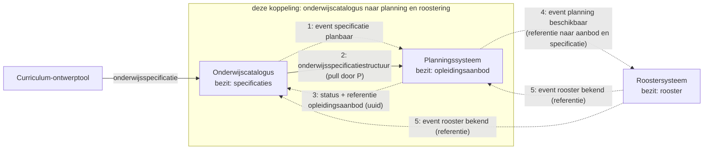

Wat het diagram niet toont: het planningssysteem bouwt de planning **asynchroon** op, binnen de regels uit de specificatie (voorwaarden vooraf, locatie, periode). De uitkomst, gelukt of niet gelukt, komt terug als status met een referentie naar het `opleidingsaanbod`; de aanbod-instantie zelf blijft bij planning en wordt alleen opgehaald als de catalogus die wil inzien. Stap 4 en 5 liggen buiten deze koppeling en staan er ter illustratie van hetzelfde patroon.

#### 4.1.6 Berichtstromen

#### 4.1.7 Opleidingsaanbod aanmaken

Doel: een gepubliceerde specificatie omzetten in een planbaar `opleidingsaanbod`, met een referentie terug naar de onderwijscatalogus. Trigger: onderwijsspecificatie krijgt status `gepubliceerd`. Initiator: Onderwijscatalogus.

| Versie | Interactiepatronen | Applicatiediensten |
|---|---|---|
| 1.0 | [Event Notification](Interactiepatronen/event-notification.md), [Asynchronous Request-Reply](Interactiepatronen/asynchronous-request-reply.md) | [onderwijsspecificatiestructuur-afnemer](Applicatiediensten/onderwijsspecificatiestructuur-afnemer.md), [onderwijsspecificatiestructuur-aanbieder](Applicatiediensten/onderwijsspecificatiestructuur-aanbieder.md), [verwerkingsuitkomst-afnemer](Applicatiediensten/verwerkingsuitkomst-afnemer.md), [planbaar-onderwijsaanbod-aanbieder](Applicatiediensten/planbaar-onderwijsaanbod-aanbieder.md) |

Endpoints:

- [webhook `specificatie-planbaar`](Applicatiediensten/onderwijsspecificatiestructuur-afnemer.md)
- [`GET /onderwijsspecificaties/{id}`](Applicatiediensten/onderwijsspecificatiestructuur-aanbieder.md)
- [webhook `verwerkingsstatus`](Applicatiediensten/verwerkingsuitkomst-afnemer.md)
- [`GET /onderwijsaanbod/{id}` (optioneel)](Applicatiediensten/planbaar-onderwijsaanbod-aanbieder.md)

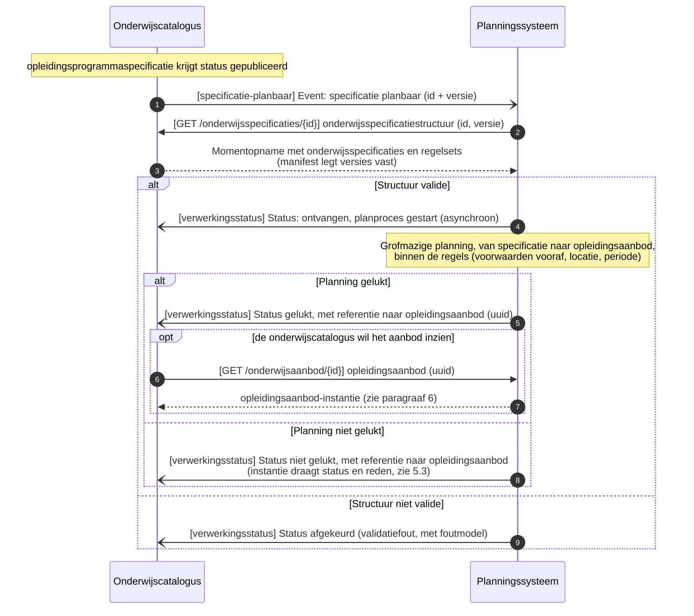

#### 4.1.8 Opleidingsaanbod herplannen

Doel: een lopende planning laten volgen op een nieuwe specificatieversie, met delta of volledige structuur als keuze voor de ontvanger. Trigger: nieuwe versie van een specificatie die al in een manifest is vastgelegd. Initiator: Onderwijscatalogus.

| Versie | Interactiepatronen | Applicatiediensten |
|---|---|---|
| 1.0 | [Event Notification](Interactiepatronen/event-notification.md), [Asynchronous Request-Reply](Interactiepatronen/asynchronous-request-reply.md) | [onderwijsspecificatiestructuur-aanbieder](Applicatiediensten/onderwijsspecificatiestructuur-aanbieder.md), [verwerkingsuitkomst-afnemer](Applicatiediensten/verwerkingsuitkomst-afnemer.md), [onderwijsspecificatiestructuur-afnemer](Applicatiediensten/onderwijsspecificatiestructuur-afnemer.md) |

Endpoints:

- [`GET /onderwijsspecificaties/{id}/delta` of `GET /onderwijsspecificaties/{id}`](Applicatiediensten/onderwijsspecificatiestructuur-aanbieder.md)
- [webhook `verwerkingsstatus`](Applicatiediensten/verwerkingsuitkomst-afnemer.md)
- [webhook `specificatie-gewijzigd`](Applicatiediensten/onderwijsspecificatiestructuur-afnemer.md)

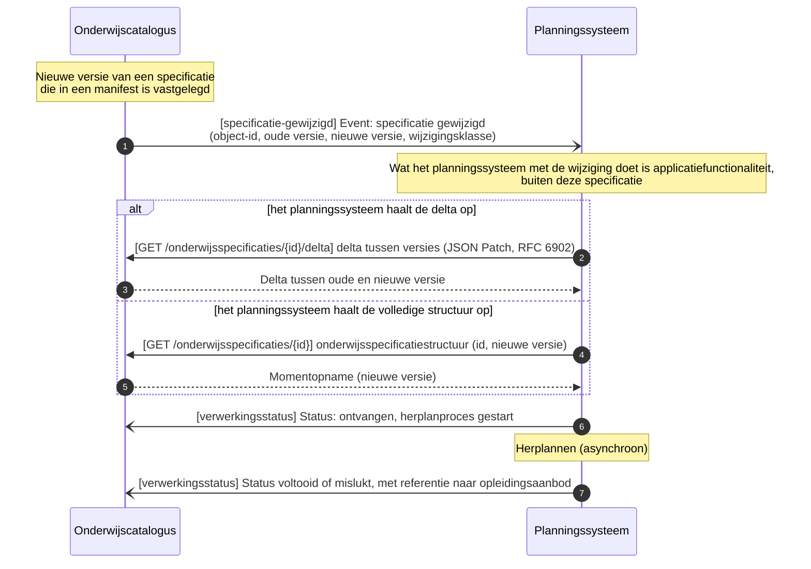

#### 4.1.9 Planning niet gelukt melden

Doel: de onderwijscatalogus in kennis stellen dat een specificatie voor een of meer cohorten niet planbaar blijkt, met referentie en knelpunten, zonder de aanroep te blokkeren. Trigger: planproces bij het planningssysteem vindt geen geldige planning. Initiator: Planningssysteem.

| Versie | Interactiepatronen | Applicatiediensten |
|---|---|---|
| 1.0 | [Asynchronous Request-Reply](Interactiepatronen/asynchronous-request-reply.md) | [verwerkingsuitkomst-afnemer](Applicatiediensten/verwerkingsuitkomst-afnemer.md), [planbaar-onderwijsaanbod-aanbieder](Applicatiediensten/planbaar-onderwijsaanbod-aanbieder.md) |

Endpoints:

- [webhook `verwerkingsstatus`](Applicatiediensten/verwerkingsuitkomst-afnemer.md)
- [`GET /onderwijsaanbod/{id}` (optioneel)](Applicatiediensten/planbaar-onderwijsaanbod-aanbieder.md)

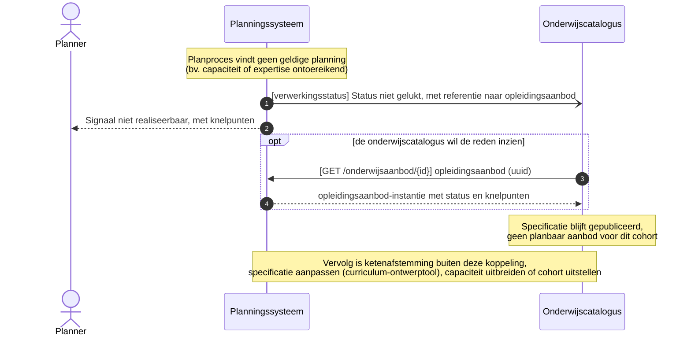

#### 4.1.10 Acceptatietoets bij late wijziging

Doel: een afgeronde planning beschermen tegen een wijziging die er ongecontroleerd doorheen breekt. Trigger: specificatiewijziging terwijl de planning al is afgerond. Initiator: Onderwijscatalogus.

| Versie | Interactiepatronen | Applicatiediensten |
|---|---|---|
| 1.0 | [Event Notification](Interactiepatronen/event-notification.md), [Asynchronous Request-Reply](Interactiepatronen/asynchronous-request-reply.md) | [onderwijsspecificatiestructuur-afnemer](Applicatiediensten/onderwijsspecificatiestructuur-afnemer.md), [verwerkingsuitkomst-afnemer](Applicatiediensten/verwerkingsuitkomst-afnemer.md) |

Endpoints:

- [webhook `specificatie-gewijzigd`](Applicatiediensten/onderwijsspecificatiestructuur-afnemer.md)
- [webhook `verwerkingsstatus`](Applicatiediensten/verwerkingsuitkomst-afnemer.md)

#### 4.1.11 Specificatiestatus gewijzigd melden

Doel: de onderwijscatalogus een statuswijziging laten melden die los staat van een nieuwe versie, zodat het planningssysteem zijn afgeleide status kan bijwerken zonder herplanronde. Trigger: specificatie krijgt een nieuwe status buiten een versiewijziging om (bv. `gepubliceerd` naar `gedeactiveerd`, [regels bij de schema's](https://github.com/Npuls-OKx/Public/blob/informatie-en-gegevensmodellen-v0.1.0/Informatie-en-gegevensmodellen/regels.md)). Initiator: Onderwijscatalogus. Voorbeeldgeval: een opleiding die voor een ouder cohort bewust niet meer wordt aangeboden is nog wel planbaar, maar wordt niet meer gepland; dat is deze statuswijziging (met archivering als vervolg), geen planningsfout uit de melding hierboven.

| Versie | Interactiepatronen | Applicatiediensten |
|---|---|---|
| 1.0 | [Event-Carried State Transfer](Interactiepatronen/event-carried-state-transfer.md) | [onderwijsspecificatiestructuur-afnemer](Applicatiediensten/onderwijsspecificatiestructuur-afnemer.md) |

Endpoints:

- [webhook `specificatie-status-gewijzigd`](Applicatiediensten/onderwijsspecificatiestructuur-afnemer.md)

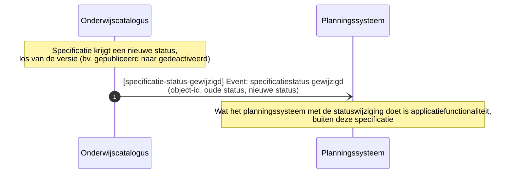

#### 4.1.12 Reconciliatie na gemist event

Doel: de gemiste informatie via een gewone opvraag herstellen na een event dat in de Dead Letter Channel is beland, zonder op een herhaalde aflevering te wachten. Trigger: een event is niet aangekomen. Initiator: Onderwijscatalogus of Planningssysteem.

| Versie | Interactiepatronen | Applicatiediensten |
|---|---|---|
| 1.0 | [Request-Reply](Interactiepatronen/request-reply.md) | [onderwijsspecificatiestructuur-aanbieder](Applicatiediensten/onderwijsspecificatiestructuur-aanbieder.md), [planbaar-onderwijsaanbod-aanbieder](Applicatiediensten/planbaar-onderwijsaanbod-aanbieder.md) |

Endpoints:

- [`GET /onderwijsspecificaties` (op OC)](Applicatiediensten/onderwijsspecificatiestructuur-aanbieder.md)
- [`GET /onderwijsaanbod` (op P)](Applicatiediensten/planbaar-onderwijsaanbod-aanbieder.md)

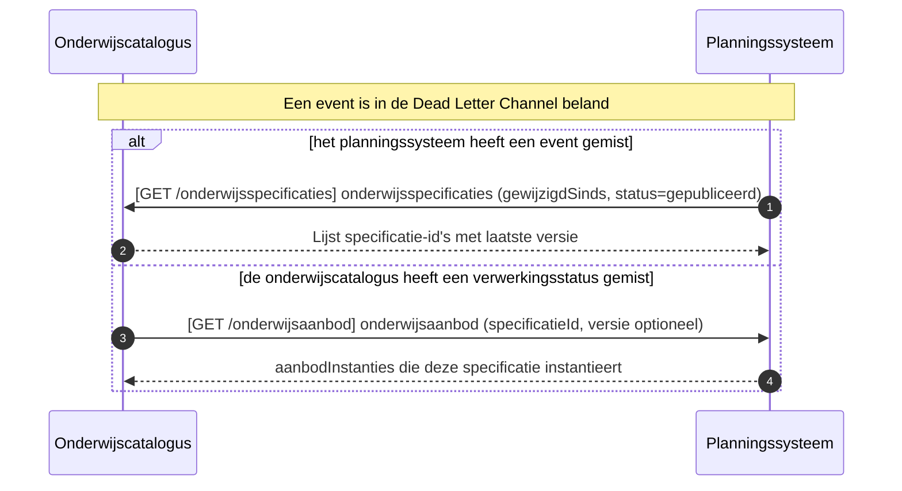

#### 4.1.13 Abonnement registreren

Doel: elke partij een callback-URL laten vastleggen voor de events die zij van de ander ontvangt, als voorwaarde voor de event-gedreven stromen. Trigger: inrichting van de koppeling, of wijziging van de callback-URL. Initiator: Onderwijscatalogus en Planningssysteem (over en weer, elk voor de events die de ander van hem ontvangt).

| Versie | Interactiepatronen | Applicatiediensten |
|---|---|---|
| 1.0 | [Subscription registration](Interactiepatronen/subscription-registration.md) | [afleverabonnement-aanbieder](Applicatiediensten/afleverabonnement-aanbieder.md) |

Endpoints:

- [`POST /abonnementen` (op OC en op P)](Applicatiediensten/afleverabonnement-aanbieder.md)

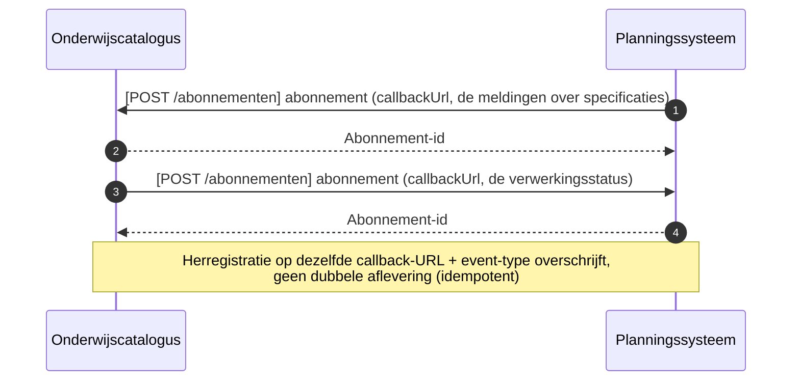

#### 4.1.14 Context: doorwerking naar het roostersysteem

Buiten deze koppeling, en niet als vastgelegde interactie: het roostersysteem plaatst het geplande aanbod in tijd en ruimte. Het planningssysteem meldt dat de planning beschikbaar is, het roostersysteem haalt het aanbod op en meldt het rooster terug aan zowel planning als catalogus. Hetzelfde patroon van referentie plus event dus, opgenomen om te tonen dat de lijn doorloopt tot voorbij wat dit pakket specificeert. Het [roostersysteem](#36-roostersysteem-r) draagt daarom geen endpoints.

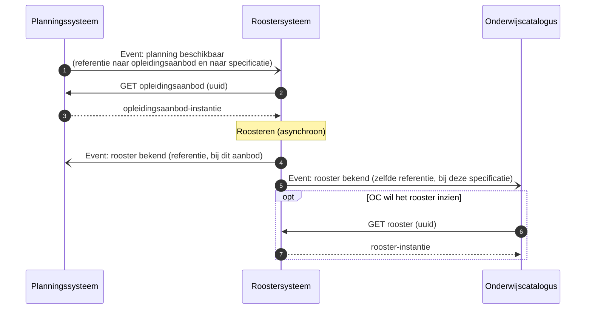

<!-- pagina-einde -->

### 4.2 Onderwijscatalogus naar studentinformatiesysteem

De koppeling tussen de onderwijscatalogus en het studentinformatiesysteem: welke informatie erover beweegt, in welke volgorde, en welk bericht dat draagt, met de sequentiediagrammen erbij. De functionele eisen die het proces aan deze koppeling stelt staan als vertrekpunt in de eerste tabel; het interactieoverzicht legt per interactie het bericht, het patroon en de foutafhandeling vast, en de endpoints staan bij de [applicatiecomponent](#3-applicatiecomponenten) die ze serveert.

#### 4.2.1 Plek in de keten

De uitsnede komt uit de informatiestromen-hoofdplaat v1.7 (richtinggevend; de legenda draagt nog "concept"), met deze koppeling gemarkeerd. De koppelvlakken van beide componenten staan bij de [onderwijscatalogus](#32-onderwijscatalogus-oc) en het [studentinformatiesysteem](#34-studentinformatiesysteem-sis).

#### 4.2.2 Stories

De stories uit de [requirementsboom](#2-requirementsboom) die deze koppeling invult, met de berichtstroom die dat doet.

| Story | Ingevuld door |
|---|---|
| [story-0022](#story-0022) | [Nominaal template en resultaatstructuur inrichten](#427-nominaal-template-en-resultaatstructuur-inrichten) |
| [story-0023](#story-0023) | [Nominaal template en resultaatstructuur inrichten](#427-nominaal-template-en-resultaatstructuur-inrichten) |
| [story-0020](#story-0020) | [Acceptatietoets bij wijziging examenplan](#428-acceptatietoets-bij-wijziging-examenplan) |

#### 4.2.3 Applicatiediensten

Deze koppeling zet de volgende [applicatiediensten](Applicatiediensten/README.md) in. De tabel legt vast welk component welke dienst implementeert; welke stromen daarover lopen en in welke volgorde bepaalt de koppeling zelf.

| Applicatiedienst | Geïmplementeerd door |
|---|---|
| [onderwijsspecificatiestructuur-aanbieder](Applicatiediensten/onderwijsspecificatiestructuur-aanbieder.md) | Onderwijscatalogus |
| [onderwijsspecificatiestructuur-afnemer](Applicatiediensten/onderwijsspecificatiestructuur-afnemer.md) | Studentinformatiesysteem |
| [resultaatstructuur-aanbieder](Applicatiediensten/resultaatstructuur-aanbieder.md) | Onderwijscatalogus |
| [resultaatstructuur-afnemer](Applicatiediensten/resultaatstructuur-afnemer.md) | Studentinformatiesysteem |
| [verwerkingsuitkomst-aanbieder](Applicatiediensten/verwerkingsuitkomst-aanbieder.md) | Studentinformatiesysteem |
| [verwerkingsuitkomst-afnemer](Applicatiediensten/verwerkingsuitkomst-afnemer.md) | Onderwijscatalogus |

Deze koppeling kent geen afleverabonnement: zolang er geen registratie is vastgelegd, is het afleveradres een inrichtingskeuze tussen beide partijen.

#### 4.2.4 Interactiepatronen

Deze koppeling zet de volgende [interactiepatronen](Interactiepatronen/README.md) in.

| Interactiepatroon | Waarvoor in deze koppeling |
|---|---|
| [Event Notification](Interactiepatronen/event-notification.md) | Melden dat specificatie en resultaatstructuur beschikbaar zijn of zijn gewijzigd, en het ophalen dat daarop volgt |
| [Asynchronous Request-Reply](Interactiepatronen/asynchronous-request-reply.md) | De inrichtingsstatus terugmelden, met een referentie naar de inrichting |

#### 4.2.5 Procesbeeld

**Resource-eigenaarschap** ([U3](#63-u3-resource-eigenaarschap)): de onderwijscatalogus bezit de specificaties en de resultaatstructuren, het studentinformatiesysteem de verbintenissen, individuele structuren, voortgang en resultaten. **Event notification** ([U4](#64-u4-event-notification)): de catalogus meldt, het studentinformatiesysteem haalt op.

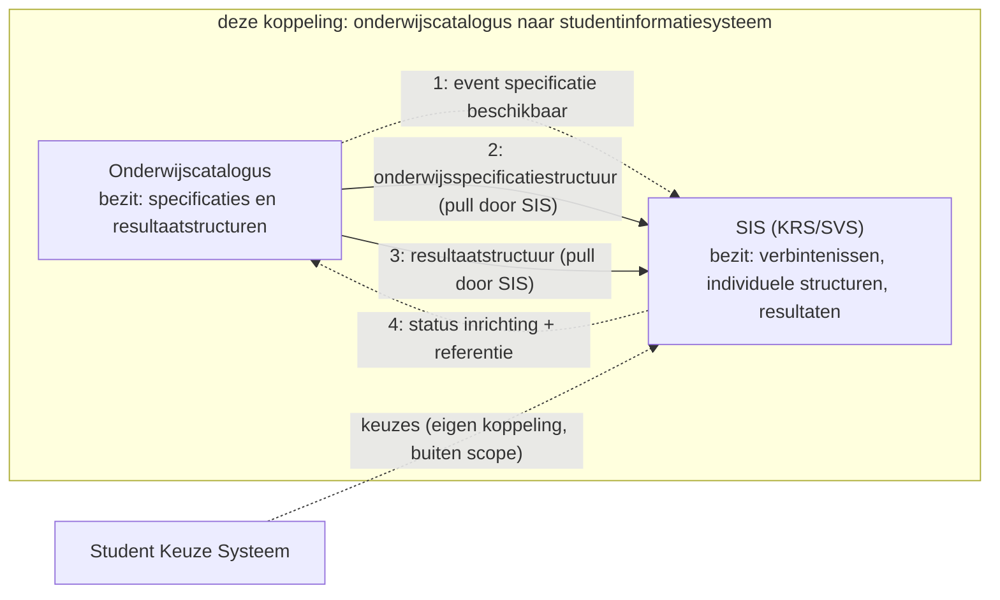

Wat het diagram niet toont: het studentinformatiesysteem haalt twee dingen op, de specificatiestructuur en de resultaatstructuur, en richt daarmee het **nominale template** in plus de mapping van welke toetsonderdeelresultaten welke leeruitkomsten afdichten ([ADR 0022](../Referentiemateriaal/adr/0022-resultaatbegrippen-conform-rosa-koi.md)). Bij een wijziging draagt het event een wijzigingsklasse mee. Voor het examenplan gelden daarbij de strengste acceptatieregels: lopende verbintenissen mogen niet ongecontroleerd geraakt worden.

#### 4.2.6 Berichtstromen

#### 4.2.7 Nominaal template en resultaatstructuur inrichten

Doel: een gepubliceerde specificatie en examenplanspecificatie omzetten in een ingericht nominaal template en resultaatstructuur bij het studentinformatiesysteem. Trigger: onderwijsspecificatie en examenplanspecificatie krijgen status `gepubliceerd`. Initiator: Onderwijscatalogus.

| Versie | Interactiepatronen | Applicatiediensten |
|---|---|---|
| 1.0 | [Event Notification](Interactiepatronen/event-notification.md), [Asynchronous Request-Reply](Interactiepatronen/asynchronous-request-reply.md) | [onderwijsspecificatiestructuur-afnemer](Applicatiediensten/onderwijsspecificatiestructuur-afnemer.md), [onderwijsspecificatiestructuur-aanbieder](Applicatiediensten/onderwijsspecificatiestructuur-aanbieder.md), [resultaatstructuur-aanbieder](Applicatiediensten/resultaatstructuur-aanbieder.md), [verwerkingsuitkomst-afnemer](Applicatiediensten/verwerkingsuitkomst-afnemer.md) |

Endpoints:

- [webhook `specificatie-en-resultaatstructuur-beschikbaar`](Applicatiediensten/onderwijsspecificatiestructuur-afnemer.md)
- [`GET /onderwijsspecificaties/{id}`](Applicatiediensten/onderwijsspecificatiestructuur-aanbieder.md)
- [`GET /examenplanspecificaties/{id}`](Applicatiediensten/resultaatstructuur-aanbieder.md)
- [webhook `inrichtingsstatus`](Applicatiediensten/verwerkingsuitkomst-afnemer.md)

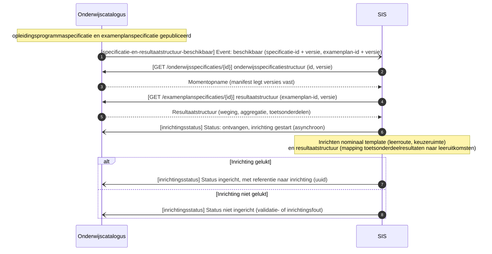

#### 4.2.8 Acceptatietoets bij wijziging examenplan

Doel: lopende verbintenissen beschermen tegen een examenplanwijziging die er ongecontroleerd doorheen breekt. Trigger: examenplanspecificatie wijzigt terwijl er al verbintenissen lopen. Initiator: Onderwijscatalogus.

| Versie | Interactiepatronen | Applicatiediensten |
|---|---|---|
| 1.0 | [Event Notification](Interactiepatronen/event-notification.md), [Asynchronous Request-Reply](Interactiepatronen/asynchronous-request-reply.md) | [resultaatstructuur-afnemer](Applicatiediensten/resultaatstructuur-afnemer.md), [verwerkingsuitkomst-afnemer](Applicatiediensten/verwerkingsuitkomst-afnemer.md) |

Endpoints:

- [webhook `examenplanspecificatie-gewijzigd`](Applicatiediensten/resultaatstructuur-afnemer.md)
- [webhook `inrichtingsstatus`](Applicatiediensten/verwerkingsuitkomst-afnemer.md)

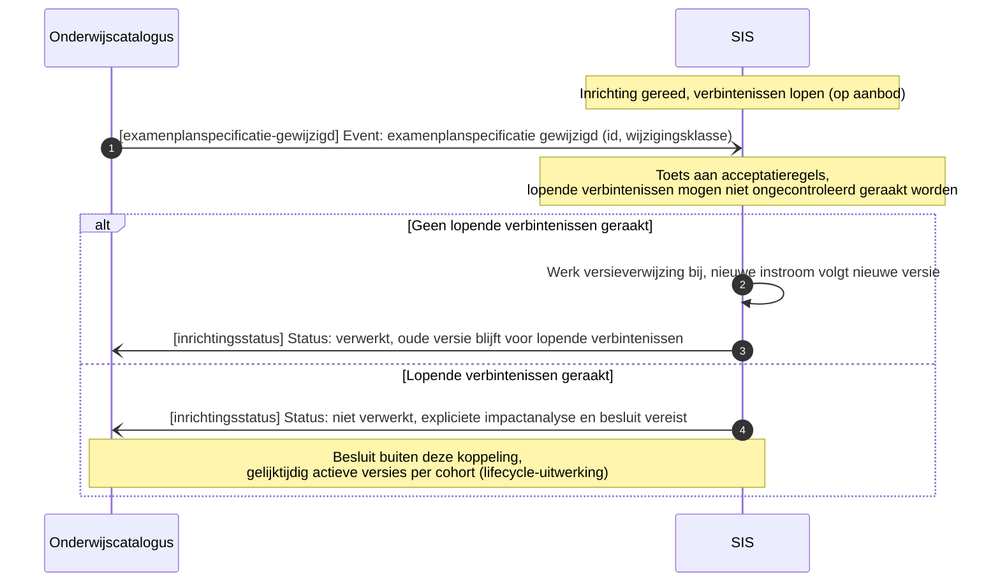

<!-- pagina-einde -->

### 4.3 Onderwijscatalogus naar leermanagementsysteem

De koppeling tussen de onderwijscatalogus en het leermanagementsysteem: welke informatie erover beweegt, in welke volgorde, en welk bericht dat draagt, met de sequentiediagrammen erbij. De functionele eisen die het proces aan deze koppeling stelt staan als vertrekpunt in de eerste tabel; het interactieoverzicht legt per interactie het bericht, het patroon en de foutafhandeling vast, en de endpoints staan bij de [applicatiecomponent](#3-applicatiecomponenten) die ze serveert.

#### 4.3.1 Plek in de keten

De uitsnede komt uit de informatiestromen-hoofdplaat v1.7 (richtinggevend; de legenda draagt nog "concept"), met deze koppeling gemarkeerd. De koppelvlakken van beide componenten staan bij de [onderwijscatalogus](#32-onderwijscatalogus-oc) en het [leermanagementsysteem](#35-leermanagementsysteem-lms).

#### 4.3.2 Stories

De stories uit de [requirementsboom](#2-requirementsboom) die deze koppeling invult, met de berichtstroom die dat doet.

| Story | Ingevuld door |
|---|---|
| [story-0003](#story-0003) | [Leeromgeving inrichten en leermiddelkoppeling melden](#437-leeromgeving-inrichten-en-leermiddelkoppeling-melden) |
| [story-0029](#story-0029) | [Leeromgeving inrichten en leermiddelkoppeling melden](#437-leeromgeving-inrichten-en-leermiddelkoppeling-melden) |
| [story-0031](#story-0031) | [Inrichting bijwerken na wijziging](#438-inrichting-bijwerken-na-wijziging) |

#### 4.3.3 Applicatiediensten

Deze koppeling zet de volgende [applicatiediensten](Applicatiediensten/README.md) in. De tabel legt vast welk component welke dienst implementeert; welke stromen daarover lopen en in welke volgorde bepaalt de koppeling zelf.

| Applicatiedienst | Geïmplementeerd door |
|---|---|
| [onderwijsspecificatiestructuur-aanbieder](Applicatiediensten/onderwijsspecificatiestructuur-aanbieder.md) | Onderwijscatalogus |
| [onderwijsspecificatiestructuur-afnemer](Applicatiediensten/onderwijsspecificatiestructuur-afnemer.md) | Leermanagementsysteem |
| [leermiddelkoppeling-aanbieder](Applicatiediensten/leermiddelkoppeling-aanbieder.md) | Leermanagementsysteem |
| [leermiddelkoppeling-afnemer](Applicatiediensten/leermiddelkoppeling-afnemer.md) | Onderwijscatalogus |
| [verwerkingsuitkomst-aanbieder](Applicatiediensten/verwerkingsuitkomst-aanbieder.md) | Leermanagementsysteem |
| [verwerkingsuitkomst-afnemer](Applicatiediensten/verwerkingsuitkomst-afnemer.md) | Onderwijscatalogus |

Deze koppeling kent geen afleverabonnement: zolang er geen registratie is vastgelegd, is het afleveradres een inrichtingskeuze tussen beide partijen.

#### 4.3.4 Interactiepatronen

Deze koppeling zet de volgende [interactiepatronen](Interactiepatronen/README.md) in.

| Interactiepatroon | Waarvoor in deze koppeling |
|---|---|
| [Event Notification](Interactiepatronen/event-notification.md) | Melden dat een specificatie beschikbaar is of is gewijzigd en dat de leermiddelkoppeling er is, met het ophalen dat daarop volgt |
| [Asynchronous Request-Reply](Interactiepatronen/asynchronous-request-reply.md) | De inrichtingsstatus terugmelden, met een referentie naar de inrichting |

#### 4.3.5 Procesbeeld

**Resource-eigenaarschap** ([U3](#63-u3-resource-eigenaarschap)): de onderwijscatalogus bezit de specificaties, de leeromgeving haar inrichting en de leermiddelkoppeling. **Event notification** ([U4](#64-u4-event-notification)) geldt in beide richtingen.

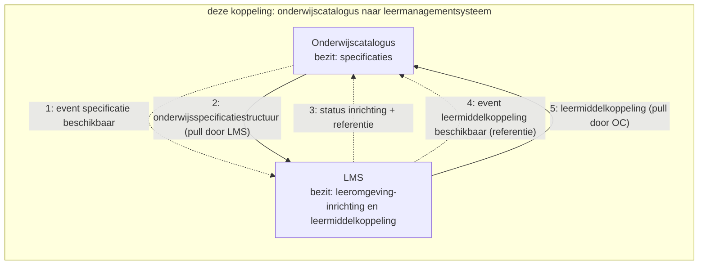

Wat het diagram niet toont: de leeromgeving richt zich in tot op **leeronderdeelniveau** en vult daaronder haar eigen lesniveau in, waar de catalogus buiten staat. De leermiddelkoppeling gaat de andere kant op zodra de leeromgeving die heeft gelegd; de catalogus haalt hem op wanneer die de leermiddelen bij het aanbod wil tonen. Wijzigt een specificatie, dan volgt een nieuw event en haalt de leeromgeving het verschil of de volledige structuur opnieuw op.

#### 4.3.6 Berichtstromen

#### 4.3.7 Leeromgeving inrichten en leermiddelkoppeling melden

Doel: een gepubliceerde specificatie omzetten in een ingerichte leeromgeving, met een leermiddelkoppeling terug naar de onderwijscatalogus. Trigger: onderwijsspecificatie krijgt status `gepubliceerd`. Initiator: Onderwijscatalogus.

| Versie | Interactiepatronen | Applicatiediensten |
|---|---|---|
| 1.0 | [Event Notification](Interactiepatronen/event-notification.md), [Asynchronous Request-Reply](Interactiepatronen/asynchronous-request-reply.md) | [onderwijsspecificatiestructuur-afnemer](Applicatiediensten/onderwijsspecificatiestructuur-afnemer.md), [onderwijsspecificatiestructuur-aanbieder](Applicatiediensten/onderwijsspecificatiestructuur-aanbieder.md), [verwerkingsuitkomst-afnemer](Applicatiediensten/verwerkingsuitkomst-afnemer.md), [leermiddelkoppeling-afnemer](Applicatiediensten/leermiddelkoppeling-afnemer.md), [leermiddelkoppeling-aanbieder](Applicatiediensten/leermiddelkoppeling-aanbieder.md) |

Endpoints:

- [webhook `specificatie-beschikbaar`](Applicatiediensten/onderwijsspecificatiestructuur-afnemer.md)
- [`GET /onderwijsspecificaties/{id}`](Applicatiediensten/onderwijsspecificatiestructuur-aanbieder.md)
- [webhook `inrichtingsstatus`](Applicatiediensten/verwerkingsuitkomst-afnemer.md)
- [webhook `leermiddelkoppeling-beschikbaar`](Applicatiediensten/leermiddelkoppeling-afnemer.md)
- [`GET /leermiddelkoppelingen/{id}` (optioneel)](Applicatiediensten/leermiddelkoppeling-aanbieder.md)

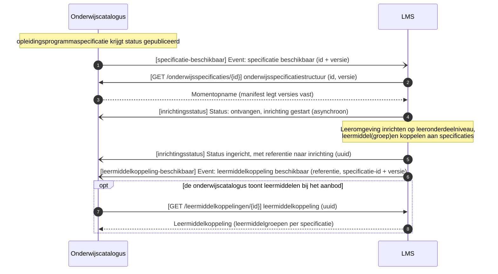

#### 4.3.8 Inrichting bijwerken na wijziging

Doel: een bestaande inrichting laten volgen op een nieuwe specificatieversie, met delta of volledige structuur als keuze voor het leermanagementsysteem. Trigger: nieuwe versie van een specificatie waarop het leermanagementsysteem is ingericht. Initiator: Onderwijscatalogus.

| Versie | Interactiepatronen | Applicatiediensten |
|---|---|---|
| 1.0 | [Event Notification](Interactiepatronen/event-notification.md), [Asynchronous Request-Reply](Interactiepatronen/asynchronous-request-reply.md) | [onderwijsspecificatiestructuur-aanbieder](Applicatiediensten/onderwijsspecificatiestructuur-aanbieder.md), [verwerkingsuitkomst-afnemer](Applicatiediensten/verwerkingsuitkomst-afnemer.md), [onderwijsspecificatiestructuur-afnemer](Applicatiediensten/onderwijsspecificatiestructuur-afnemer.md) |

Endpoints:

- [`GET /onderwijsspecificaties/{id}/delta` of `GET /onderwijsspecificaties/{id}`](Applicatiediensten/onderwijsspecificatiestructuur-aanbieder.md)
- [webhook `inrichtingsstatus`](Applicatiediensten/verwerkingsuitkomst-afnemer.md)
- [webhook `specificatie-gewijzigd`](Applicatiediensten/onderwijsspecificatiestructuur-afnemer.md)

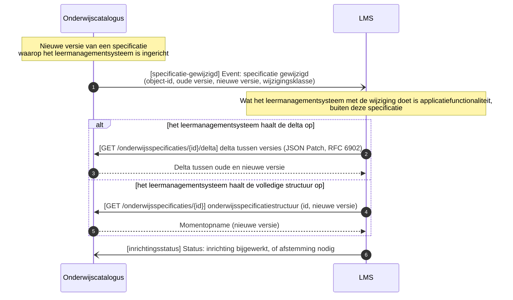

<!-- pagina-einde -->

## 5 Auth-standaard voor koppelvlakken

**Aanleiding.** Geen enkele koppelingspecificatie in dit pakket legt vast hoe een consument zich bij een endpoint authenticeert. Zonder een gedeelde standaard verzint elke koppeling dat opnieuw, en twee leveranciers die beide "aan de koppelingspecificatie voldoen" kunnen alsnog niet verbinden omdat de een OAuth2 verwacht en de ander een API-sleutel. Dit document legt één mechanisme vast voor alle koppelvlakken in dit pakket.

Dit is, net als de uitgangspunten, een repo-brede keuze, geen keuze per koppeling: elke koppelingspecificatie verwijst hierheen in plaats van authenticatie opnieuw te beschrijven.

### 5.1 Mechanisme: OAuth 2.0 Client Credentials

Consument en leverancier wisselen vooraf, buiten de koppeling om, een `client_id` en `client_secret` uit (onboarding/registratie, bilateraal per koppeling). Een consument vraagt daarmee een access token op bij de token-endpoint van het systeem dat hij aanroept, via de **Client Credentials grant** ([RFC 6749 §4.4](https://www.rfc-editor.org/rfc/rfc6749#section-4.4)): geen gebruiker in de lus, puur systeem-naar-systeem.

Elk systeem dat endpoints serveert is verantwoordelijk voor zijn eigen token-endpoint (of een eigen identity provider erachter); er is geen centrale OKx-brede autorisatieserver. Dat sluit aan bij [U3, resource-eigenaarschap](#63-u3-resource-eigenaarschap): wie de resource bezit, bezit ook de toegang ertoe.

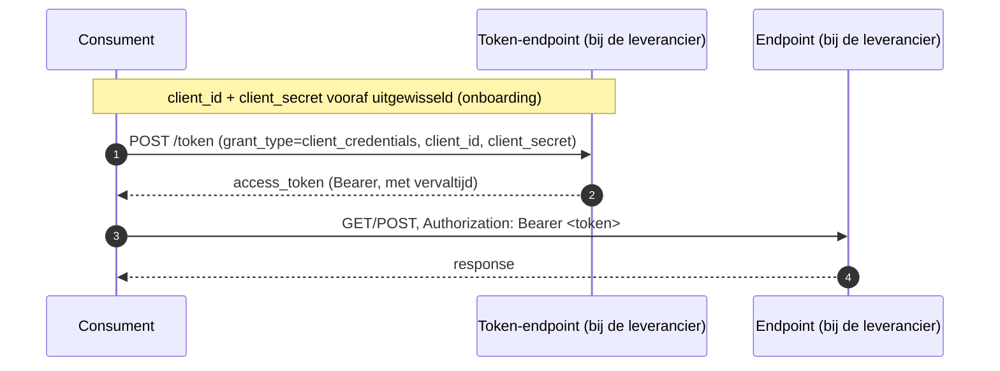

### 5.2 Toepassing op webhook-aflevering

Een webhook-event is zelf ook een HTTP-aanroep, van de bezitter naar de callback-URL die de ontvanger bij het registreren van zijn abonnement heeft opgegeven. Dezelfde regel geldt dan omgekeerd: de afzender authenticeert zich bij het afleveren met een Bearer-token, opgehaald bij de token-endpoint van de ontvanger, met de credentials die bij de abonnementregistratie zijn afgesproken.

### 5.3 Wat dit niet regelt

- **Scopes en autorisatieclaims** binnen het token: welke velden of operaties een token precies mag, is nog niet uitgewerkt.
- **Tokenlevensduur en vernieuwing**: Client Credentials kent geen refresh token; een consument vraagt bij verval opnieuw een token op. De concrete geldigheidsduur is een inrichtingskeuze van de leverancier.
- **Sleutelbeheer**: rotatie en intrekking van `client_secret` zijn een operationele afspraak tussen de partijen, geen onderdeel van deze standaard.
- **Gebruikersauthenticatie**: alle koppelingen in dit pakket zijn systeem-naar-systeem; een leerling of medewerker komt nergens in de lus voor. Delegated auth (authorization code grant) valt daarmee buiten scope.

<!-- pagina-einde -->

## 6 Uitgangspunten voor koppelingspecificaties

**Aanleiding.** Bij het uitwerken van de eerste koppelingen bleek dat elk document dezelfde aannames opnieuw uitlegde: waarom een beschrijving indicatief is, wie welke resource bezit, waarom een event dun blijft. Die herhaling maakte de documenten langer dan nodig en, erger, liet de redenering op meerdere plekken uit elkaar lopen zodra er iets wijzigde. Daarom staan de gedeelde aannames hier eenmaal.

Deze uitgangspunten gelden voor **elke** koppelingspecificatie en payload-specificatie in deze map. Een individueel document noemt het uitgangspunt in één regel en verwijst hierheen; het herhaalt de motivering niet. Zo hoeft een wijziging in de redenering maar op één plek te gebeuren.

De uitgangspunten zijn genummerd (U1 tot en met U11) zodat je er in een document of een review naar kunt verwijzen: "conform U5".

Herkomst: de [OKx-architectuurprincipes](../Referentiemateriaal/principes/principes.md) en [OKx-uitgangspunten](../Referentiemateriaal/principes/uitgangspunten.md), plus de architectuurbesluiten in [`Referentiemateriaal/adr/`](../Referentiemateriaal/adr). Waar een uitgangspunt op een besluit steunt, staat dat erbij. Alle aangehaalde besluiten hebben op dit moment de status voorstel.

### 6.1 U1. Indicatief en onderbouwend, niet voorschrijvend

Een koppelingspecificatie beschrijft hoe een informatiestroom er in een scenario uit **kan** zien. OKx legt de sector niet op hoe een koppeling gerealiseerd moet worden; instellingen en leveranciers geven hun koppelingen zelf vorm.

Waarom we ze dan beschrijven: we hebben nog beperkt zicht op de werking van het ecosysteem. Door koppeling voor koppeling en scenario voor scenario de interacties te bestuderen, ontdekken we welke operaties, endpoints en data nodig zijn. De **som** van de koppelingbeschrijvingen levert de koppelvlakspecificatie per referentiecomponent op: de endpoints en operaties die dat component waarschijnlijk moet bieden, elk gegrond in een beschreven interactie.

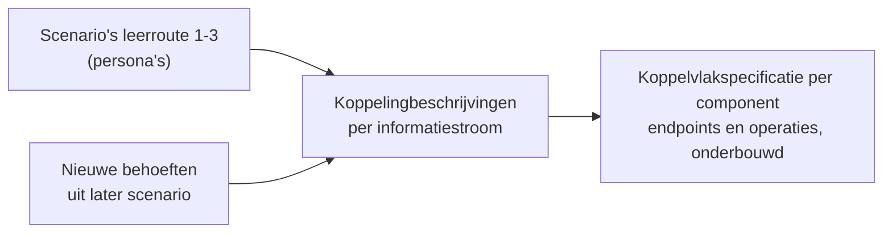

De beschreven koppelingen zijn **niet uitputtend**. Nieuwe functionaliteit kan operaties vragen die niet uit de huidige scenario's naar voren komen. Voorbeeld: een studentkeuzesysteem dat namens een student onderwijs aanvraagt dat nog niet bestaat. Zo'n behoefte komt binnen als nieuw scenario met een eigen koppelingbeschrijving, en onderbouwt daarmee een nieuwe operatie op het koppelvlak. Het koppelvlak houdt die ruimte.

Sluit aan op [OKx-AP02 — Semantiek vóór techniek](../Referentiemateriaal/principes/principes.md#okx-ap02--semantiek-vóór-techniek) (geen API-first zonder voorafgaande keten- en informatiemodelcontext) en [OKx-AP06 — Contracten zijn versieerbaar en evolueerbaar](../Referentiemateriaal/principes/principes.md#okx-ap06--contracten-zijn-versieerbaar-en-evolueerbaar).

### 6.2 U2. Koppeling versus koppelvlak

Een **koppeling** is de gestandaardiseerde informatiestroom tussen twee referentiecomponenten. Een **koppelvlak** is de verzameling van alle koppelingen die één component raken. Een koppelingspecificatie beschrijft dus één stroom; de koppelvlakspecificatie is de optelsom per component.

Vastgelegd in [ADR 0021](../Referentiemateriaal/adr/0021-koppeling-versus-koppelvlak-terminologie.md).

### 6.3 U3. Resource-eigenaarschap

Elk systeem bezit zijn eigen resource en is er de enige bron van. De onderwijscatalogus bezit de onderwijsspecificaties, planning bezit het onderwijsaanbod, roostering bezit het rooster, het studentinformatiesysteem bezit de verbintenissen en resultaten. Niemand kopieert de resource van een ander.

Over de koppeling gaan daarom **referenties** (uuid) en niet de resource zelf, tenzij die expliciet wordt opgevraagd. Dat voorkomt dat dezelfde gegevens op meerdere plekken een eigen leven gaan leiden.

### 6.4 U4. Event notification

Een melding over een koppeling is dun: zij draagt de aanleiding en een verwijzing, niet de inhoud, en de afnemer haalt de resource zelf op. Het patroon staat uitgewerkt bij [Event Notification](Interactiepatronen/event-notification.md).

Dit uitgangspunt legt de keuze vast en niet het patroon: elke koppeling in dit pakket gebruikt het, en het is geen afweging per koppeling. Vastgelegd in [ADR 0020](../Referentiemateriaal/adr/0020-curriculumontwerp-onderwijscatalogus-happy-flow-synchronisatie-en-federatie-adopt-klonen.md).

### 6.5 U5. Bericht versus kanaal

Een koppelingspecificatie legt het **bericht** vast: wat erin staat, wanneer het wordt verstuurd, hoe een ontvanger een herhaling herkent, en in welke volgorde berichten over dezelfde sleutel aankomen.

Hoe dat bericht bij de ontvanger komt, het **kanaal**, is een inrichtingskeuze van instelling en leverancier: een webhook, een bus, een broker of een cloud-pubsubdienst. OKx schrijft dat product niet voor.

Het kanaal is daarmee niet volledig vrij. [ADR 0018](../Referentiemateriaal/adr/0018-enterprise-messaging-patronen-voor-betrouwbare-koppelvlakken.md) is technologie-agnostisch maar niet vrijblijvend: welk kanaal je ook kiest, het moet aantoonbaar vier eigenschappen leveren.

| Eigenschap | Wat het betekent | Waarom het niet vrij is |
|---|---|---|
| Gegarandeerde aflevering | Een bericht raakt niet stil zoek | Zonder deze eigenschap merkt de keten een gemiste mutatie pas veel later |
| Idempotente verwerking | Een herhaald bericht heeft geen extra effect | Vereist een stabiel event-id in het bericht; dat is dus wel onze zorg |
| Dead-letterpad | Onverwerkbare berichten komen ergens zichtbaar terecht | Anders verdwijnt een fout zonder spoor |
| Volgorde per sleutel | Berichten over dezelfde entiteit komen in volgorde aan | Veel cloud-pubsubdiensten garanderen dit niet standaard en vragen expliciete configuratie |

De laatste is de scherpste. Twee implementaties die allebei "een bericht sturen" maar de volgorde per entiteitsleutel niet bewaken, leveren verschillende uitkomsten op bij statusovergangen.

**Open punt.** Welk afleveringsmechanisme partijen onderling kiezen is nog niet belegd. Twee systemen die beide aan het bericht voldoen maar waarvan het ene een webhook aanbiedt en het andere op een eigen broker publiceert, kunnen zonder afspraak of adapter alsnog niet koppelen. Dat is een vraag voor het koppelvlak, niet voor een afzonderlijke koppeling.

### 6.6 U6. Semantiek uit de ankertabel

Begrippen komen uit de [ankertabel](../Referentiemateriaal/kaderscenario's/leerroute-1-regulier.md#betrokken-informatie-bij-proces): kader, beoogde leeruitkomst, specificatie, aanbod, verbintenis, resultaat. Geen verzonnen termen; subtypen voluit met backquotes.

De **leeruitkomst is de sleutel**. Specificaties verankeren erop, en onderwijsresultaten worden erop behaald ([ADR 0022](../Referentiemateriaal/adr/0022-resultaatbegrippen-conform-rosa-koi.md), conform het ROSA Kernmodel Onderwijsinformatie). Verankering gebeurt op de uuid van de leeruitkomst, niet op een tekstcode; een leesbare aanduiding mag ernaast staan.

### 6.7 U7. Payload plat met verwijzingen, en de sleutelconventie

Objecten staan in **platte arrays** met een zelfverwijzende ouder-pointer, niet fysiek genest. Daardoor is elk object los adresseerbaar en los te versioneren, en hoef je geen halve boom mee te sturen om één onderdeel te wijzigen. De prijs is dat de hiërarchie niet meer uit de JSON zelf blijkt; daarom hoort er een instantieboom bij (U8).

**Sleutelconventie.** Het eigen sleutelveld van een object binnen zijn array heet `id`. Zodra een veld naar een ander object wijst, draagt het een expliciete naam die zegt waarheen: `bovenliggendSpecificatieId`, `bovenliggendAanbodId`, `leeruitkomstId`, `locatieId`, `specificatieVerwijzing.specificatieId`. Een kaal `bovenliggendId` is context-gevoelig en dus niet toegestaan.

Dit wijkt bewust af van de Open Onderwijs API, die getypeerde sleutels hanteert zoals `educationSpecificationId`. De payloads zijn Nederlandstalig en indicatief, dus die afwijking bestond al; te betrekken bij de latere binding (uitgangspunt [OEAPI, tenzij](../Referentiemateriaal/principes/uitgangspunten.md#technologie-en-standaarden)).

**Taal.** Veldnamen en waarden in het Nederlands, met de Engelse of OEAPI-term tussen haakjes waar dat helpt.

### 6.8 U8. Machine-interpreteerbaar, met leesbare weergaven

Elke payload-specificatie draagt een **JSON Schema** (draft 2020-12) dat de vorm vastlegt: types, verplicht of optioneel, enums en patronen. Enumeraties horen daar, niet in een aparte tabel. De volwassenheid wordt op het schema zelf gemarkeerd (`$comment`), niet in de documenttitel of de doelstelling (zie U10).

Sluit aan op de uitgangspunten [machine-interpreteerbare formaten](../Referentiemateriaal/principes/uitgangspunten.md#technologie-en-standaarden) en [show don't tell](../Referentiemateriaal/principes/uitgangspunten.md#afstemming-en-beschrijvingswijze).

### 6.9 U9. Scenario's en persona's

Documenten werken **leerroute 1** (regulier) uit aan de hand van persona **Jochem**, opleiding Apothekersassistent (SBB-kwalificatiedossier 23450, kwalificatie 27141). Leerroute 2 (temporiseren) en 3 (versnellen) volgen als **verschil** ten opzichte daarvan: de structuur blijft gelijk, een handvol attributen wijzigt.

De route en de persona staan volledig uitgewerkt in het [kaderscenario leerroute 1 — regulier](../Referentiemateriaal/kaderscenario's/leerroute-1-regulier.md). Dat document is de kaderstellende basis waarop de koppelingspecificaties hier doorbouwen; het beschrijft per processtap wat er gebeurt en welke informatie beweegt. De overige leerroutes: [`kaderscenario's/`](../Referentiemateriaal/kaderscenario's).

### 6.10 U10. Scope- en documentdiscipline

- **Intra-instelling eerst.** Koppelingen worden eerst binnen één instelling uitgewerkt; federatie en cross-instelling volgen gefaseerd ([ADR 0008](../Referentiemateriaal/adr/0008-scope-planning-eerst-intra-instelling.md)).
- **Scope sluit af.** Een document benoemt positief wat in scope is, noemt de afbakeningen die anders verwarring geven, en sluit af met de regel dat al het overige buiten het document valt. Een lezer hoeft dan niet te raden of iets vergeten of bewust weggelaten is.
- **Doel is toetsbaar.** Een document benoemt welke vragen het beantwoordt en wanneer het geslaagd is.
- **Geen statusaanduiding in de inhoud.** Woorden als "alpha" of "een eerste versie" horen niet in een titel, doel of scope. De volwassenheid van een artefact noteer je op dat artefact (bijvoorbeeld op het schema); de status van het werk staat in de pull request en de git-historie.
- **Geen metadatakop, geen issueverwijzingen.** Auteurschap en datums komen uit de git-historie; de weg waarlangs een document tot stand kwam staat in de pull requests. Deze documenten worden gereleased en moeten leesbaar zijn voor iemand die geen toegang heeft tot het werkproces erachter. Een verwijzing naar een issuenummer zegt zo'n lezer niets en veroudert bovendien: schrijf in plaats daarvan de **aanleiding** uit in de inleiding.
- **De inleiding is zelfdragend.** Ze benoemt de **aanleiding** (welk probleem of welke waarneming aanleiding gaf tot dit document), de **context** (waar het in de keten zit), het **doel** (welke vragen het beantwoordt) en de **scope** (wat er wel en niet in staat). Wie alleen de inleiding leest, weet of dit document zijn vraag beantwoordt.
- **Verwijzingen zijn links**, ook naar besluiten en naar andere documenten in deze map.

De bredere schrijfstijl staat in [`.cursor/rules/docs-style.mdc`](https://github.com/Npuls-OKx/meta/blob/d47bb0c74ec899a4384d06331692f74b9bd1db58/.cursor/rules/docs-style.mdc).

### 6.11 Gerelateerde documenten

- [Instap voor nieuwkomers](README.md): ketenoverzicht, hoofdplaat, afkortingenlegenda en leesvolgorde.
- [OKx-architectuurprincipes](../Referentiemateriaal/principes/principes.md) en [OKx-uitgangspunten](../Referentiemateriaal/principes/uitgangspunten.md): de richting waarop deze uitgangspunten steunen.

### 6.12 U11. Toekomstvaste endpoints: volledige structuur en delta

OKx definieert endpoints die ook toekomstige scenario's mogelijk maken. Waar een resource als structuur wordt ontsloten, biedt de eigenaar daarom beide vormen aan: de volledige structuur en de wijziging (delta). Een implementatie kiest zelf wat bij haar situatie past: een eenvoudige implementatie verwerkt de volledige structuur opnieuw, een rijkere implementatie verwerkt alleen de delta.

Waarom: de keten kent implementaties van verschillende volwassenheid, en scenario's die we nog niet kennen. Eén verplichte vorm dwingt óf onnodige complexiteit af (delta-berekening voor wie die niet nodig heeft) óf onnodig zwaar verkeer (volledige structuur voor wie alleen de wijziging wil). Twee vormen op dezelfde resource houden beide routes open zonder de semantiek te splitsen.

Zichtbaar in de [koppelingspecificatie onderwijscatalogus naar planning en roostering](#417-opleidingsaanbod-aanmaken): de planbaar-melding is dun (conform U4), waarna de afnemer de volledige structuur of de delta ophaalt.
