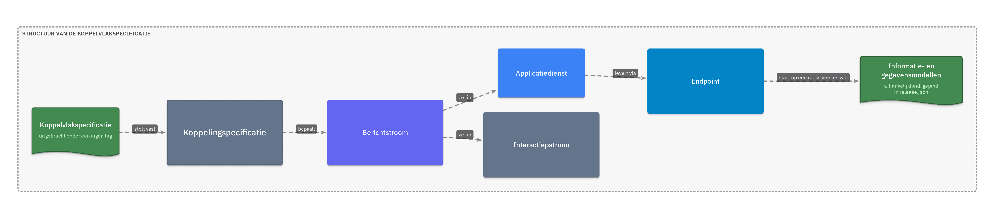
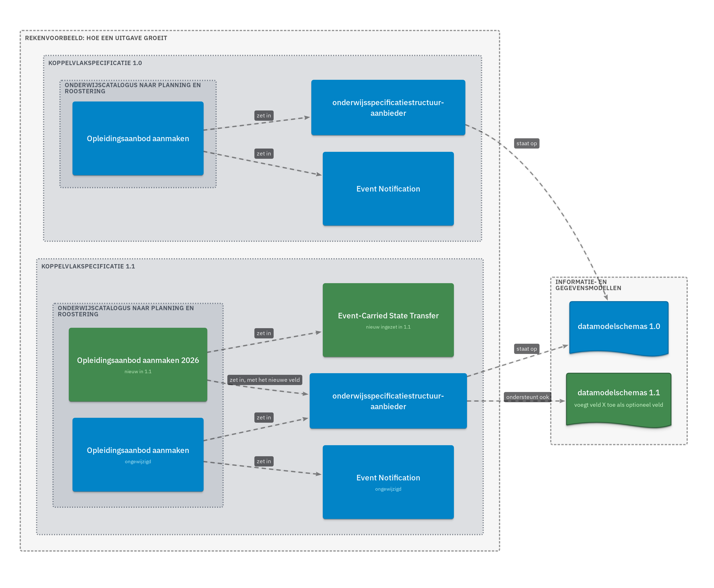

# Release management van de koppelvlakspecificatie

## 1. Inleiding

**Aanleiding.** De [algemene releaseregels](../Algemeen/release-management/Release-management-algemeen.md) definiëren een major als een niet-backward-compatibele wijziging waarna afnemers wordt geadviseerd te migreren. Die definitie gaat uit van een artifact waaraan een afnemer zich houdt. Dat is de koppelvlakspecificatie niet. Zij beschrijft hoe partijen kúnnen koppelen, niet of ze moeten koppelen, en welke koppeling een partij aangaat bepaalt die partij zelf. Het generieke schema toepassen alsof dit pakket een contract is, dwingt migraties af die niemand nodig heeft; wat dat kost is doorgerekend in het versiescenario.

**Context.** Het pakket bevat een lijst van koppelingen die systemen aan elkaar knoopt, en per koppeling de berichtstromen waarmee dat kan. Een berichtstroom is samengesteld uit bouwblokken die los daarvan zijn vastgelegd: applicatiediensten met hun endpoints en payloads, en interactiepatronen. Die bouwblokken zijn wat een implementatie deelt met andere implementaties.

**Doel.** Vastleggen wat versiebeheer voor dit pakket betekent: waar een partij zich aan houdt, wat een versienummer wel en niet zegt, en langs welke weg de inhoud wijzigt. Het beantwoordt daarmee de vraag wanneer een release een major, een minor of een patch is, en wat een afnemer bij elk van die drie moet doen.

**Scope.** Het releasepakket koppelvlakspecificatie. De [informatie- en gegevensmodellen](../Informatie-en-gegevensmodellen/README.md) vormen een eigen pakket met een eigen versie en leggen hun versiebeheer zelf vast; dit document legt alleen de verhouding met dat pakket vast. De OpenAPI-specificatie valt erbuiten, net als de vraag welke partij met welke andere partij koppelt. Al het overige valt buiten dit document.

---

## 2. Releasepakket

Het pakket bestaat uit de inleiding en de uitgangspunten, de requirementsboom, de applicatiecomponenten met hun koppelvlak, de koppelingspecificaties met de berichtstromen, de applicatiediensten met hun endpoints, de interactiepatronen en de auth-standaard. Wat er in welke volgorde in het gebouwde document komt, en op welke versie van de informatie- en gegevensmodellen het bouwt, staat in [`release.json`](release.json).

---

## 3. Eigenaarschap

| Activiteit | Eigenaar-team | Review-/consulterend team | Communicatie-rol |
|------------|:---:|:---:|:---:|
| Inhoud van het artifact | R/A | C | I |
| Release (versie bepalen, publiceren) | R/A | C | I |
| Vaststellen dat een bouwblok in plaats wijzigt | A | R | C |
| Vaststellen dat een berichtstroom vervalt | A | R | C |
| Communicatie naar belanghebbenden | C | C | R/A |

Het eigenaar-team is het OKx-team dat in dit repository merget. De twee rijen die in het [template](../Algemeen/release-management/Release-management-template.md#3-eigenaarschap) samen één regel vormen zijn hier gesplitst, omdat dit de twee besluiten zijn die in [§4](#4-versiebeheer) een uitzondering vormen op de hoofdregel. Welke teams de kolommen invullen is nog niet belegd.

---

## 4. Versiebeheer

Dit pakket volgt het SemVer-schema en de definities uit [algemene regels §3](../Algemeen/release-management/Release-management-algemeen.md#3-versienummering). Wat hieronder staat is wat daar specifiek voor dit pakket bij komt.

Dat begint bij de structuur, want die bepaalt waar een versie aan hangt. Een uitgave stelt koppelingspecificaties vast; elke koppelingspecificatie bepaalt berichtstromen; een berichtstroom zet interactiepatronen en applicatiediensten in; een dienst levert via endpoints. Aan het einde van die keten staat de afhankelijkheid op het pakket [informatie- en gegevensmodellen](../Informatie-en-gegevensmodellen/README.md).

### 4.1 Waaraan een partij zich houdt

*De formulering hieronder is de suggestie zoals die nu voorligt; zij is nog niet vastgesteld ([§4.8](#48-nog-te-beslissen)).*

Een partij houdt zich aan **bouwblokken**, niet aan een uitgave van dit document. Twee dingen samen maken haar implementatie OKx-conform:

1. **Zij implementeert de OKx-informatiemodellen.** De gegevens die zij uitwisselt hebben de vorm die het pakket [informatie- en gegevensmodellen](../Informatie-en-gegevensmodellen/README.md) beschrijft.
2. **Zij implementeert minimaal één applicatiedienst**, zoals dit pakket hem beschrijft, met de endpoints waarmee zij hem levert.

Eén dienst volstaat. Een partij implementeert de diensten die zij nodig heeft: een component dat alleen [leermiddelkoppeling-aanbieder](Applicatiediensten/leermiddelkoppeling-aanbieder.md) implementeert, is conform.

Samen zijn die twee precies wat een implementatie deelt met andere implementaties: dezelfde gegevensvorm en dezelfde interface. Daarop sluiten partijen op elkaar aan, en daar slaat de term OKx-conform op.

Het versienummer van het pakket doet iets anders. Het is een **vindmiddel**: het wijst de weg naar de uitgave waarin een bouwblok beschreven staat. Daarmee dient het drie doelen — terugvinden welke uitgave een partij heeft gevolgd, de historie van wat er sindsdien bij is gekomen, en het vastleggen van de afhankelijkheid op de gegevensmodellen ([§4.6](#46-verhouding-tot-de-informatie--en-gegevensmodellen)).

De twee bewegen onafhankelijk van elkaar, en dat is de kern van dit hoofdstuk. Conformiteit verandert wanneer een partij haar eigen implementatie uitbreidt of aanpast; het versienummer verandert wanneer dit pakket iets uitbrengt. Een uitgave die één berichtstroom aan één koppeling toevoegt, laat de andere stromen staan en laat de componenten daarachter draaien zoals zij draaiden — terwijl het pakketnummer wel meebeweegt, want dat volgt de documentatie.

### 4.2 Berichtstromen zijn een aanbod

Een koppelingspecificatie groepeert twee of meer systemen en beschrijft de berichtstromen waarmee die kunnen koppelen. Een partij implementeert de stromen die zij nodig heeft en is nooit verplicht er een te implementeren. Wil zij koppelen met een partij die een bepaalde stroom vereist, dan implementeert zij die stroom — maar dat is een afspraak tussen die twee, geen eis uit dit pakket.

Omdat een berichtstroom is samengesteld uit bouwblokken die zelfstandig zijn vastgelegd, kan een partij ook een eigen stroom samenstellen uit diezelfde bouwblokken. De lijst met stromen is daarmee een voorstel en geen voorschrift ([U1](uitgangspunten.md#u1-indicatief-en-onderbouwend-niet-voorschrijvend)). Wat dit pakket wegneemt is de vraag hoe de interfaces heten en welke vorm ze hebben, niet de vraag wie met wie koppelt.

### 4.3 Toevoegen is de hoofdregel

Een uitgave **voegt toe en wijzigt niet**. Nieuwe berichtstromen, nieuwe applicatiediensten, nieuwe endpoints en nieuwe optionele velden komen erbij; wat er is blijft zoals het is. Een bestaande implementatie blijft daarmee werken zonder dat iemand iets doet.

Moet een berichtstroom anders, dan komt er een **nieuwe stroom naast**: naast `x` verschijnt `x2`, en daarnaast te zijner tijd `x3`. De oude blijft staan zolang er partijen op draaien. Wie de nieuwe wil gebruiken stapt over wanneer het hem uitkomt; wie dat niet wil doet niets. Hetzelfde geldt een laag dieper: heeft die nieuwe stroom een ander interactiepatroon of een andere applicatiedienst nodig, dan komen ook die ernaast te staan in plaats van dat de bestaande wijzigen.

Een uitgewerkt geval. In `1.1` willen we berichtstroom `A` ook kunnen ondersteunen met een nieuw interactiepatroon `Q` en met een veld dat alleen bestaat in versie `1.1` van de gegevensmodellen. Wat er dan in `1.1` staat:

| Bouwblok | In `1.0` | In `1.1` |
|---|---|---|
| Berichtstroom `A` | aanwezig | ongewijzigd aanwezig |
| Interactiepatroon `P` | aanwezig | ongewijzigd aanwezig |
| Applicatiedienst `D` | endpoint staat op modellen `1.0` | ongewijzigd; het endpoint draagt `1.0` én `1.1` |
| Berichtstroom `A2` | — | nieuw; zet `Q` en `D` in, met het nieuwe veld |
| Interactiepatroon `Q` | — | nieuw |

Applicatiedienst `D` wijzigt niet. Het nieuwe veld is optioneel, dus het endpoint waarmee `D` geleverd wordt draagt beide modelversies: wie tegen `1.0` bouwde valideert nog steeds, wie `A2` gebruikt krijgt het veld erbij ([§4.6](#46-verhouding-tot-de-informatie--en-gegevensmodellen)).

Wat dit voor de partijen betekent, is het punt van dit hele model. Wie de koppelvlakspecificatie op basis van `1.0` heeft geïmplementeerd, blijft werken en blijft conform, ongeacht het versienummer: er is niets aan zijn bouwblokken veranderd. Wie `A2` wil gebruiken implementeert die erbij, wanneer het hem uitkomt. Wie hem niet nodig acht doet niets. Er is geen migratievenster, geen voorgeschreven volgorde tussen aanbieder en afnemer, en geen moment waarop iemand niet meer conform is.

Dit is de reden dat brekende wijzigingen in dit pakket zeldzaam horen te zijn. Ze bestaan alleen in de twee uitzonderingen hieronder.

### 4.4 Twee uitzonderingen

**Een bouwblok wijzigt in plaats.** Soms is het beter een berichtstroom, een applicatiedienst of een endpoint te wijzigen dan er een naast te zetten: als elke partij erbij wint en een tweede variant het geheel alleen maar troebeler maakt. Dat is een besluit, geen constatering, en het hoort bij de rijen in [§3](#3-eigenaarschap) die daarvoor zijn aangewezen. Dit is de enige plek waar een wijziging bestaande implementaties breekt.

**Een berichtstroom vervalt.** Een stroom waarop niemand meer draait kan worden uitgefaseerd. Ook dat is een besluit, en het vraagt om een aankondiging vooraf, omdat de uitgever niet kan zien wie er nog op draait.

De hoofdregel en deze uitzondering volgen samen het patroon *expand–contract*, ook bekend als *parallel change*, maar niet volledig. Dat patroon wijzigt een gedeelde interface in drie stappen: het nieuwe bouwblok komt naast het bestaande (*expand*), elke partij stapt over op haar eigen moment (*migrate*), en het oude vervalt (*contract*). Dit pakket neemt de eerste twee stappen over als hoofdregel ([§4.3](#43-toevoegen-is-de-hoofdregel)). De derde is hier de uitzondering en niet de afsluiting.

De reden is dat expand–contract ervan uitgaat dat de afnemers bekend zijn en dat de overstap kan worden aangestuurd. Een gepubliceerde specificatie weet geen van beide. Het oude bouwblok blijft daarom staan zolang er partijen op draaien, en opruimen is een besluit met aankondiging vooraf. De prijs daarvan is dat varianten zich opstapelen: naast `x` blijft `x2` staan, en wie de specificatie leest ziet ze allebei.

### 4.5 Wanneer welke bump

| Bump | Wanneer | Wat een afnemer moet doen |
|---|---|---|
| **PATCH** | Tekstcorrectie, verduidelijking, hersteld voorbeeld: het contract wijzigt niet | Niets |
| **MINOR** | Er komt iets bij: een berichtstroom, een applicatiedienst, een endpoint, een optioneel veld, een enum-waarde, of een variant `x2` naast `x` | Niets, tenzij hij de nieuwe mogelijkheid wil gebruiken |
| **MAJOR** | Een van de twee uitzonderingen uit [§4.4](#44-twee-uitzonderingen) | Nagaan of het gewijzigde of vervallen bouwblok in zijn implementatie zit, en zo ja: overstappen binnen de aangekondigde termijn |

Een major is daarmee zeldzaam en de norm is een minor. Dat is geen versoepeling van de algemene regels maar een gevolg van de manier waarop de inhoud wijzigt.

### 4.6 Verhouding tot de informatie- en gegevensmodellen

Dit pakket bouwt op vastgelegde versies van de informatie- en gegevensmodellen, gepind in `release.json`. De twee versienummers zijn onafhankelijk: een nieuwe uitgave van de gegevensmodellen dwingt geen uitgave van dit pakket af, en omgekeerd. Wat een uitgave van dit pakket wel doet, is vastleggen op welke versies van de gegevensmodellen de beschreven bouwblokken staan.

Meervoud, en wel om twee redenen.

**De afhankelijkheid hangt aan het endpoint.** Niet aan het pakket als geheel en niet aan de applicatiedienst: het endpoint is de plek waar een payload wordt uitgewisseld, dus daar hoort te staan op welke modelversies die payload staat. Twee endpoints van dezelfde dienst kunnen daardoor op verschillende versies staan, en een uitgave die één endpoint verlegt raakt de andere niet.

**Eén endpoint kan een reeks versies dragen.** Kreeg een schema er alleen optionele velden bij, dan blijft het endpoint geldig tegen de oude versie én tegen de nieuwe, en dan noteert het ze allebei. Dat is wat het voorbeeld in [§4.3](#43-toevoegen-is-de-hoofdregel) mogelijk maakt: het voorkomt dat een uitbreiding van de gegevensmodellen een nieuw bouwblok afdwingt.

Waar het pakketbrede pin in `release.json` dan nog voor is: hij legt vast welke uitgaven van de gegevensmodellen bij deze uitgave horen, zodat een lezer weet in welke verzameling hij de genoemde versies moet zoeken. De precieze reeks per endpoint staat bij het endpoint.

### 4.7 Wat een component ondersteunt

Omdat conformiteit niet meer aan een versienummer hangt, is er iets anders nodig waarmee twee partijen vaststellen of zij kunnen koppelen. Het versienummer vulde die rol nooit goed — het zei wat een partij had gelezen, niet wat zij had gebouwd — maar het was wel het enige wat er was.

Het voorstel is dat dit pakket een **metadata-endpoint** voorschrijft: een endpoint dat een component aanbiedt en waarmee een ander component opvraagt welke applicatiediensten en berichtstromen het implementeert, en op welke versies van de gegevensmodellen. Omdat de vorm uit dit pakket komt, kan elke partij elk ander component op dezelfde manier bevragen.

Wat dat oplost is de vraag vooraf: kunnen deze twee partijen koppelen, en op welke stromen. Wat het niet doet is iemand tot een implementatie verplichten — het maakt alleen zichtbaar wat er is ([§4.2](#42-berichtstromen-zijn-een-aanbod)).

Dit endpoint is nog niet gespecificeerd. Het vraagt eerst om het eerste open punt hieronder: zonder stabiele aanduiding per berichtstroom valt er niet naar te verwijzen.

### 4.8 Nog te beslissen

Twee dingen volgen uit dit model maar zijn nog niet geregeld.

**Een berichtstroom heeft geen stabiele aanduiding.** Hij wordt nu geïdentificeerd door zijn kop in het document. Dat werkt niet zodra `x2` naast `x` komt, het werkt niet voor een partij die in haar eigen documentatie wil verwijzen naar de stromen die zij ondersteunt, en het werkt niet voor het endpoint uit [§4.7](#47-wat-een-component-ondersteunt). Een aanduiding die niet meebeweegt met de formulering van de kop is daarvoor nodig.

**De formulering van conformiteit.** [§4.1](#41-waaraan-een-partij-zich-houdt) legt conformiteit bij twee dingen: de informatiemodellen en minimaal één applicatiedienst. Dat is een suggestie en nog geen besluit. Wat er vastligt is de richting — conformiteit hangt aan wat een partij implementeert en niet aan een uitgavenummer — en wat nog openstaat is de precieze formulering.

**De versiekolom bij een berichtstroom.** Elke stroom draagt nu een kolom `Versie`, vandaag overal `1.0`. Als een stroom nooit in plaats wijzigt, heeft dat nummer geen betekenis meer: een wijziging levert immers `x2` op en niet `x` versie `1.1`. Die kolom kan vervallen, of gaan aangeven in welke uitgave van het pakket de stroom is toegevoegd.

---

## 5. Communicatie

Standaard geldt [algemene regels §5](../Algemeen/release-management/Release-management-algemeen.md#5-communicatie-naar-belanghebbenden). Aanvullend geldt voor dit pakket dat de release notes **benoemen welke berichtstromen, applicatiediensten en endpoints erbij zijn gekomen**, zodat een afnemer kan zien of er iets bij zit dat hij wil gebruiken. Bij een van de twee uitzonderingen uit [§4.4](#44-twee-uitzonderingen) noemen de release notes bovendien welk bouwblok wijzigt of vervalt, en binnen welke termijn.

---

## 6. Releaseproces

Standaard geldt het proces uit [algemene regels §6](../Algemeen/release-management/Release-management-algemeen.md#6-releaseproces). Eén aanvulling: omdat een uitgave in de regel toevoegt en niet wijzigt, landt vrijwel alles op zowel release branch N als N-1. De tweede branch komt pas in beeld bij een van de twee uitzonderingen, en is de rest van de tijd een kopie van de eerste.
