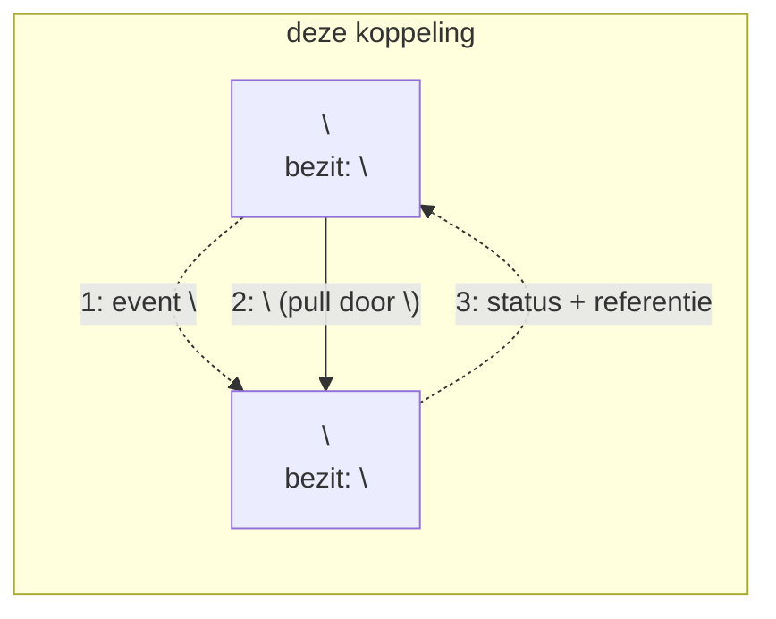
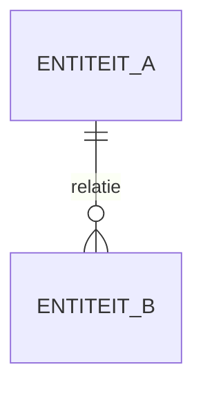
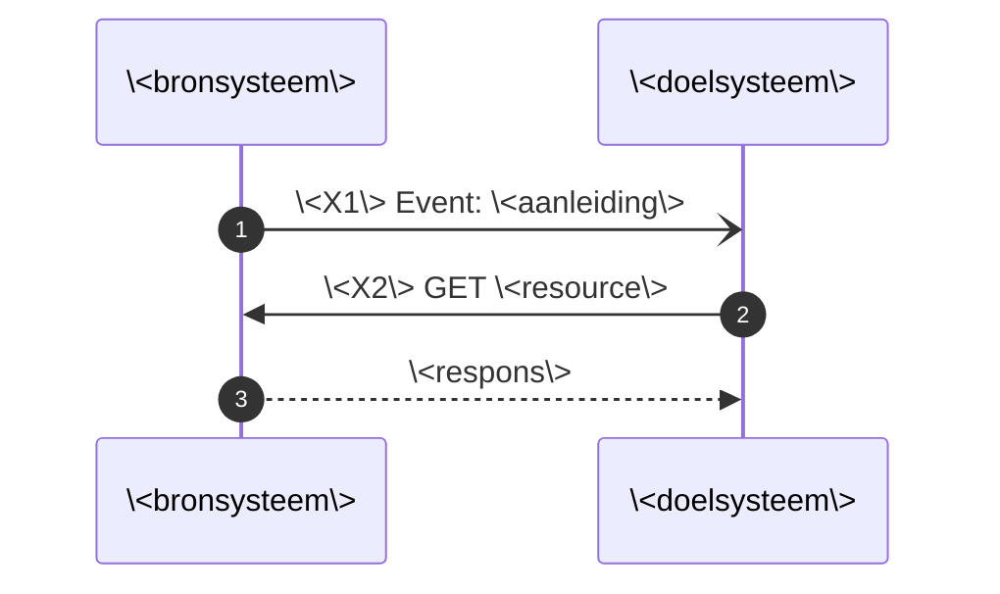

# Template koppelingspecificatie

Kopieer dit bestand naar `../Koppelingspecificaties/<bronsysteem>-<doelsysteem>/<bronsysteem>-<doelsysteem>.md` en vul het in. Zowel de map als de bestandsnaam heten voluit, zonder afkortingen (zie de titelinstructie hieronder); het woord "koppelingspecificatie" blijft weg uit de bestandsnaam, want dat is al duidelijk uit de plek in `Koppelingspecificaties/`. Geen datum of versienummer in de bestandsnaam: die staan in de git-historie. De vaste opbouw houdt de documenten onderling vergelijkbaar, zodat een verwijzing als "§7" over alle koppelingspecificaties heen klopt.

Lees eerst de [uitgangspunten](../uitgangspunten.md). Herhaal die niet: noem het uitgangspunt in één regel en link erheen. Dat scheelt herstructureerwerk zodra een uitgangspunt wijzigt.

**Instructies staan tussen `<!-- -->` en verdwijnen in de weergave.** Verwijder ze als het onderdeel af is.

---

<!-- Titel: noem de koppeling voluit, zonder afkortingen en zonder statusaanduiding.
     Goed:  Koppelingspecificatie onderwijscatalogus naar planning en roostering
     Fout:  Koppelingspecificatie OC-P&R: interactiepatronen (alpha) -->
# Koppelingspecificatie \<bronsysteem voluit\> naar \<doelsysteem voluit\>

## Inhoudsopgave

1. [Inleiding](#1-inleiding)
2. [Procesbeeld](#2-procesbeeld)
3. [Interactieoverzicht](#3-interactieoverzicht)
4. [Informatiemodel](#4-informatiemodel)
5. [Sequentiediagrammen](#5-sequentiediagrammen)
6. [Payload-specificaties (verwijzing) en gebruiksprofiel](#6-payload-specificaties-verwijzing-en-gebruiksprofiel)
7. [Endpointbeschrijvingen (REST)](#7-endpointbeschrijvingen-rest)

## 1. Inleiding

### 1.1 Aanleiding en context

<!-- Aanleiding: welk probleem, welke waarneming of welke vraag gaf aanleiding tot dit document?
     Schrijf dat uit. Verwijs NIET naar een issue- of PR-nummer: deze documenten worden
     gereleased en moeten leesbaar zijn voor iemand zonder toegang tot het werkproces (U10).
     Daarna de context: waar zit dit in de keten, voor wie is het document, hoe is het ontstaan
     (werksessie, afgeleid van een ander patroon, voortbouwend op). Een bron is invoer, geen context. -->

**Aanleiding.** \<Welk probleem of welke waarneming maakte dit document nodig, in twee of drie zinnen.\>

Waar deze koppeling in de keten zit: \<in twee of drie zinnen\>. Dit is stroom \<n\> in het [Projectoverzicht](https://github.com/Npuls-OKx/meta/blob/d47bb0c74ec899a4384d06331692f74b9bd1db58/doc/OKx_Projectoverzicht.md). Ketenoverzicht, begrippen en afkortingen: de [inleiding](../inleiding.md).

Scenario en persona conform [U9](../uitgangspunten.md#u9-scenarios-en-personas): leerroute 1, persona Jochem. \<Wat betekent dat concreet voor deze koppeling?\>

\<Hoe is dit document ontstaan, en waar bouwt het op voort?\>

### 1.2 Doel

<!-- Twee dingen: welke vragen beantwoordt dit document, en wanneer is het geslaagd.
     Geen doelen die buiten het document liggen. -->

Deze koppelingbeschrijving is indicatief en onderbouwend, geen voorschrift aan de sector ([U1](../uitgangspunten.md#u1-indicatief-en-onderbouwend-niet-voorschrijvend)).

Het document beantwoordt \<aantal\> vragen:

- \<vraag 1\>
- \<vraag 2\>
- \<vraag 3\>

Geslaagd wanneer \<toetsbaar criterium, bijvoorbeeld: beide leveranciers bouwen op basis hiervan dezelfde interactie\>.

### 1.3 Scope

<!-- Eerst positief: wat zit erin. Dan alleen de afbakeningen die anders verwarring
     geven. Sluit af met de sluitregel, zodat niemand hoeft te raden (U10). -->

In scope is \<positieve afbakening\> binnen één instelling ([ADR 0008](../../Referentiemateriaal/adr/0008-scope-planning-eerst-intra-instelling.md)), voor leerroute 1 tot en met 3.

\<Aantal\> afbakeningen die anders verwarring geven:

- **\<onderwerp\>** \<waarom het er niet in zit en waar het wel hoort\>.
- **\<onderwerp\>** \<idem\>.

Al het overige valt buiten dit document, waaronder \<voorbeelden\>.

## 2. Procesbeeld

<!-- Noem de twee principes in één regel met een link; herhaal de motivering niet. -->

Resource-eigenaarschap ([U3](../uitgangspunten.md#u3-resource-eigenaarschap)): \<wie bezit wat in deze koppeling\>. Notify-then-pull ([U4](../uitgangspunten.md#u4-notify-then-pull)): de bezitter publiceert een dun event met een referentie, de consument haalt de resource op wanneer het hem uitkomt.

<!-- Geen genummerde opsomming die de pijlen herhaalt; dat is redundantie.
     Schrijf op wat het diagram juist NIET toont. -->

Wat het diagram niet toont: \<het asynchrone karakter, wat er inhoudelijk gebeurt, wat buiten de koppeling valt\>.

## 3. Interactieoverzicht

De interacties op deze koppeling, met per interactie het messaging-patroon. Betrouwbaarheidseisen volgen [ADR 0018](../../Referentiemateriaal/adr/0018-enterprise-messaging-patronen-voor-betrouwbare-koppelvlakken.md); wat wij vastleggen is het bericht en niet het kanaal ([U5](../uitgangspunten.md#u5-bericht-versus-kanaal)).

| # | Interactie | Initiator | Patroon | Synchroniciteit | Gedrag bij dubbele ontvangst | Foutafhandeling |
|---|---|---|---|---|---|---|
| \<X1\> | \<wat gebeurt er\> | \<systeem\> | [Event Message](https://www.enterpriseintegrationpatterns.com/patterns/messaging/EventMessage.html) | Asynchroon | Geen effect: event-id ([Idempotent Receiver](https://www.enterpriseintegrationpatterns.com/patterns/messaging/IdempotentReceiver.html)) | [Guaranteed Delivery](https://www.enterpriseintegrationpatterns.com/patterns/messaging/GuaranteedDelivery.html); [Dead Letter Channel](https://www.enterpriseintegrationpatterns.com/patterns/messaging/DeadLetterChannel.html) |
| \<X2\> | \<ophalen\> | \<systeem\> | [Request-Reply](https://www.enterpriseintegrationpatterns.com/patterns/messaging/RequestReply.html) (GET, alleen-lezen) | Synchroon | Geen effect (alleen-lezen) | HTTP-foutcodes |

Ordening: per \<entiteitsleutel\> blijft de berichtvolgorde behouden.

## 4. Informatiemodel

<!-- Eén erDiagram. Zeg in de eerste zin wat het toevoegt, en zet eronder alleen
     wat het model NIET kan dragen. Niet de relaties in proza herhalen. -->

\<Wat maakt dit model duidelijk dat de tekst niet doet?\>

Wat het model niet toont: \<semantiek die een diagram niet kan dragen\>.

## 5. Sequentiediagrammen

<!-- Notatie: `-)` asynchroon event, `->>` synchrone aanroep, `-->>` respons.
     Mermaid zonder puntkomma's, ook binnen aanhalingstekens: die breken de parser. -->

### 5.1 Happy flow: \<naam\>

### 5.2 Faalpad: \<naam\>

<!-- Minimaal één faalpad. Wat gebeurt er als het misgaat, en wie doet dan wat? -->

## 6. Payload-specificaties (verwijzing) en gebruiksprofiel

<!-- Herhaal de datamodellen niet: verwijs naar de centrale payload-specificatie en leg
     hier alleen het gebruiksprofiel vast, dus welk deel van die payload deze koppeling
     gebruikt. Dat is per koppeling verschillend en juist dat verschil hoort hier. -->

| Onderdeel | Gebruik in \<naam koppeling\> |
|---|---|
| `\<onderdeel\>` | \<volledig, deels met welke velden, of niet meegeleverd met de reden\> |

- \<verwijzing naar de payload-specificatie(s) waarop dit profiel steunt\>

## 7. Endpointbeschrijvingen (REST)

<!-- Opstap naar de interfacespecificatie, de zesde AMIGO-stap. Paden en parameters zijn
     indicatief zolang er geen OpenAPI-beschrijving is; zeg dat er ook bij.
     Events als webhook uitwerken is een voorbeeld van een kanaal, geen voorschrift:
     een bus of broker mag het vervangen zolang die dezelfde eigenschappen levert (§3). -->

Endpoints die **\<component A\>** serveert:

| Endpoint | Methode | Operatie | Parameters | Response | Statuscodes |
|---|---|---|---|---|---|
| `/\<resource\>/{id}` | GET | \<interactie\>: \<wat het oplevert\> | \<parameter (verplicht of optioneel)\> | \<payload\> | 200, 400, 404 |

Event-aflevering, in webhook-vorm:

| Event | Interactie | Richting | Payload |
|---|---|---|---|
| `\<event-naam\>` | \<X1\> | \<A naar B\> | \<inhoud van het bericht\> |

Gedrag:

- \<idempotentie, retry, foutafhandeling, en wat een herhaalde aanroep doet\>
