# Versiebeheer in de praktijk

## 1. Inleiding

**Aanleiding.** De [algemene releaseregels](../Algemeen/release-management/Release-management-algemeen.md) leggen vast wanneer een release een major, een minor of een patch is. Dat is de kant van de uitgever. Wat zo'n release doet bij de instelling die draaiende koppelvlakken heeft en bij de leveranciers die ze onderhouden, is niet doorgerekend, en daarmee is onbekend of de afspraken houden op het moment dat het erop aankomt.

**Context.** De koppelvlakspecificatie wordt onder een eigen tag uitgebracht en bouwt via `release.json` op een vastgelegde versie van de [informatie- en gegevensmodellen](../Informatie-en-gegevensmodellen/README.md). Wie een koppelvlak bouwt, neemt zo'n getagde versie als uitgangspunt.

**Doel.** Laten zien hoe een instelling en haar leveranciers geïmplementeerde koppelvlakken op versie beheren, en toetsen of de manier van versioneren dat aankan. Vier vragen:

- Waar in de specificatie zit een versie, en wat gebeurt er bij een sprong daarvan?
- Wat verandert er aan het koppelvlak van elk betrokken systeem?
- Hoe gaan de partijen ermee om, in welke volgorde, en wat als een van hen niet meegaat?
- Waar loopt de huidige manier van versioneren vast?

Geslaagd wanneer een architect eruit kan afleiden wat een aangekondigde major voor zijn eigen systeem betekent, en wanneer de punten waarop het beleid zwijgt benoemd zijn in plaats van ontdekt bij de eerste echte release.

**De uitkomst.** Voor het gewone geval houdt het: de regels laten zich toepassen en de drie partijen komen eruit. Het knelt op tijd. Er staat geen termijn op een migratie, dus het venster sluit pas als de traagste leverancier wil, en de toezegging van hoogstens twee gelijktijdige majors hangt daarmee op elke afzonderlijke afnemer. Eén eigen regel is niet nagekomen: de verhouding tussen de versienummers van de twee pakketten hoort expliciet vastgelegd te zijn en is dat niet. De afweging per regel staat in [§12](#12-houdt-de-huidige-manier-van-versioneren-stand).

**Aanpak.** Eén major volledig doorgerekend, van het change request tot de laatste afnemer die overstapt; een minor en een patch komen erbij om te laten zien hoeveel het scheelt waar een wijziging vandaan komt. Drie systemen is het kleinste aantal waarbij de partijen niet in hetzelfde tempo hoeven te bewegen, en dat tempoverschil stelt het beleid op de proef.

**Scope.** Drie applicatiecomponenten binnen één instelling — de [onderwijscatalogus](Applicatiecomponenten/onderwijscatalogus.md), het [planningssysteem](Applicatiecomponenten/planningssysteem.md) en het [leermanagementsysteem](Applicatiecomponenten/leermanagementsysteem.md) — met de twee koppelingen daartussen. Het studentinformatiesysteem, het roostersysteem, de curriculum-ontwerptool, het studentkeuzesysteem en de OpenAPI-specificatie vallen erbuiten, en al het overige ook.

**Aanname.** De naamkeuze waarmee gerekend wordt staat nog open, en de versienummers zijn voor dit scenario gekozen: het pakket staat vandaag op `0.0.1`. Houdbaar is het mechanisme en de verdeling van de last, niet de planning of de nummers.

## 2. Het referentiebeeld

Dit document gaat niet over de hele keten maar over twee koppelingen daarbinnen: de onderwijscatalogus als aanbieder, met het planningssysteem en het leermanagementsysteem als afnemers. De catalogus bezit de onderwijsspecificaties en meldt elke wijziging; de twee afnemers halen op wanneer het hun uitkomt en melden hun uitkomst terug ([U3](uitgangspunten.md#u3-resource-eigenaarschap), [U4](uitgangspunten.md#u4-event-notification)). Diagram 1 toont die verhouding, met per richting samengevat wat erover beweegt. Het volledige ecosysteem staat op de [informatiestromen-hoofdplaat](Applicatiecomponenten/README.md#ecosysteem).

**Diagram 1 — De twee koppelingen in dit scenario.**

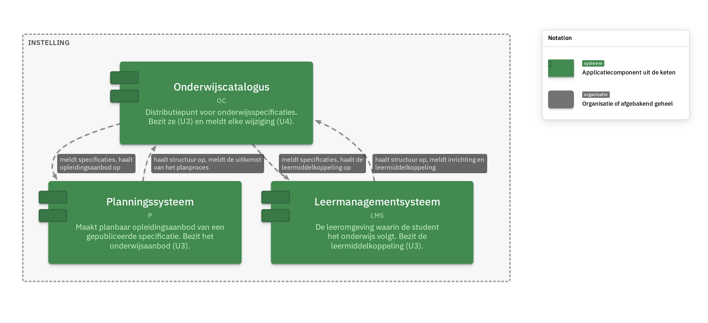

Onder die drie blokken zit het referentiebeeld van dit scenario: per systeem het koppelvlak, daarin de applicatiediensten die het claimt, en onder elke dienst de endpoints waarmee het die dienst levert. Diagram 2 tot en met 4 tonen dat koppelvlak per systeem, elk op een eigen plaat zodat de endpoints leesbaar blijven.

**Diagram 2 — Koppelvlak van de onderwijscatalogus.**

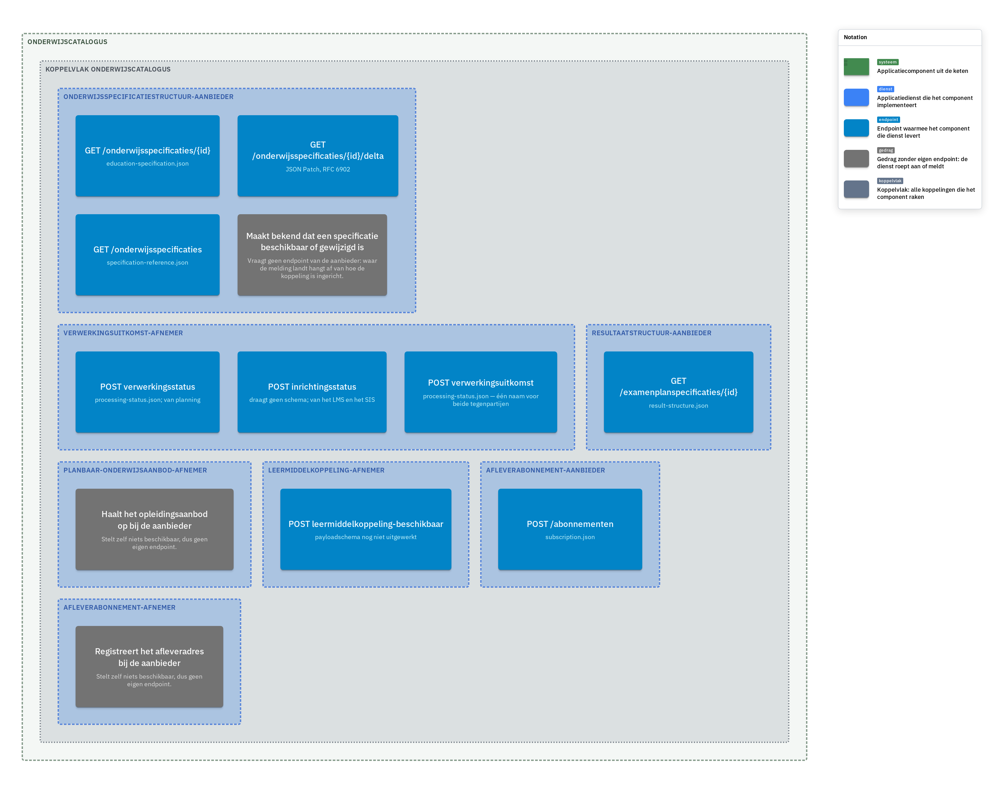

**Diagram 3 — Koppelvlak van het planningssysteem.**

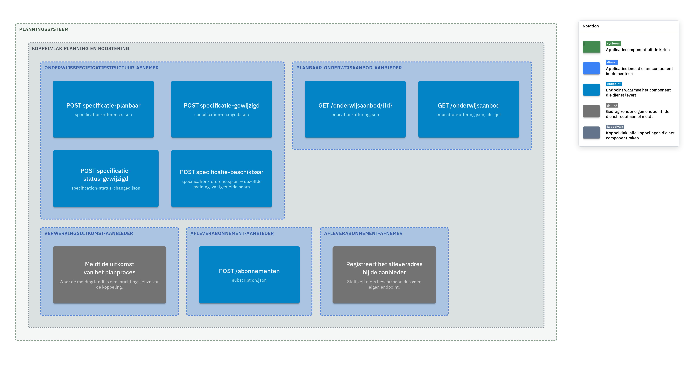

**Diagram 4 — Koppelvlak van het leermanagementsysteem.**

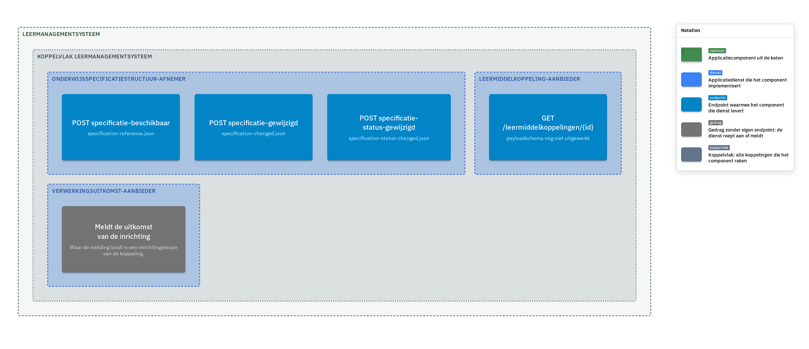

Op diagram 2 staat één dienst die buiten dit scenario valt: `resultaatstructuur-aanbieder` hoort bij de koppeling naar het studentinformatiesysteem, en staat er alleen om het koppelvlak van de catalogus compleet te tonen.

De drie platen maken samen zichtbaar waarom een dienst en een endpoint niet hetzelfde zijn. Een dienst als `verwerkingsuitkomst-aanbieder`, op diagram 3 en 4, draagt geen endpoint: wie meldt, biedt niets aan. Zijn tegenhanger `verwerkingsuitkomst-afnemer` draagt in de catalogus juist twee, voor hetzelfde bericht, omdat elke koppeling de melding een eigen naam gaf. Diagram 2 laat dat zien als `POST verwerkingsstatus` naast `POST inrichtingsstatus`. Dat is de situatie die de bump opruimt.

## 3. De basisversie

Het vertrekpunt is `koppelvlakspecificatie-v1.0.0`, gebouwd op `informatie-en-gegevensmodellen-v1.0.0`. Alle drie de systemen implementeren die versie, elk gebouwd door een eigen leverancier met een eigen releasekalender: de catalogus en het planningssysteem brengen elk kwartaal een release uit, het leermanagementsysteem twee keer per jaar. Dat verschil in tempo is het enige wat dit scenario nodig heeft om scherp te worden; verder is de uitgangssituatie symmetrisch.

**Diagram 5 — Basisversie: alle drie de systemen op `koppelvlakspecificatie-v1.0.0`.**

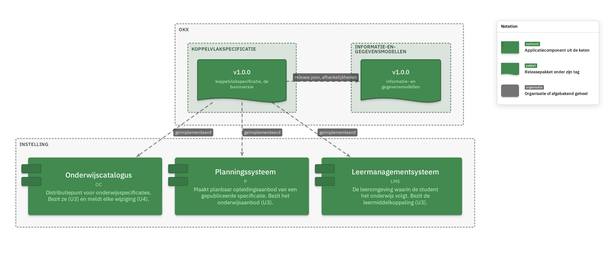

De verdeling van de endpoints over de drie koppelvlakken ziet er in die basisversie zo uit. De naam in de derde kolom is wat het scenario straks raakt.

| Systeem | Applicatiedienst | Endpoint in `v1.0.0` |
|---|---|---|
| Onderwijscatalogus | [onderwijsspecificatiestructuur-aanbieder](Applicatiediensten/onderwijsspecificatiestructuur-aanbieder.md) | `GET /onderwijsspecificaties/{id}`, `GET /onderwijsspecificaties/{id}/delta`, `GET /onderwijsspecificaties` |
| Onderwijscatalogus | [verwerkingsuitkomst-afnemer](Applicatiediensten/verwerkingsuitkomst-afnemer.md) | `POST verwerkingsstatus` (van planning), `POST inrichtingsstatus` (van het LMS) |
| Onderwijscatalogus | [leermiddelkoppeling-afnemer](Applicatiediensten/leermiddelkoppeling-afnemer.md) | `POST leermiddelkoppeling-beschikbaar` |
| Onderwijscatalogus | [afleverabonnement-aanbieder](Applicatiediensten/afleverabonnement-aanbieder.md) | `POST /abonnementen` |
| Planningssysteem | [onderwijsspecificatiestructuur-afnemer](Applicatiediensten/onderwijsspecificatiestructuur-afnemer.md) | `POST specificatie-planbaar`, `POST specificatie-gewijzigd`, `POST specificatie-status-gewijzigd` |
| Planningssysteem | [planbaar-onderwijsaanbod-aanbieder](Applicatiediensten/planbaar-onderwijsaanbod-aanbieder.md) | `GET /onderwijsaanbod/{id}`, `GET /onderwijsaanbod` |
| Planningssysteem | [afleverabonnement-aanbieder](Applicatiediensten/afleverabonnement-aanbieder.md) | `POST /abonnementen` |
| Leermanagementsysteem | [onderwijsspecificatiestructuur-afnemer](Applicatiediensten/onderwijsspecificatiestructuur-afnemer.md) | `POST specificatie-beschikbaar`, `POST specificatie-gewijzigd`, `POST specificatie-status-gewijzigd` |
| Leermanagementsysteem | [leermiddelkoppeling-aanbieder](Applicatiediensten/leermiddelkoppeling-aanbieder.md) | `GET /leermiddelkoppelingen/{id}` |

## 4. Waar een versie zit

Het versienummer van het releasepakket is de buitenste schil, en niet de plek waar de modulariteit zit. De specificatie is opgebouwd uit bouwblokken die los van elkaar bewegen: een koppeling bestaat uit **berichtstromen**, en elke berichtstroom draagt een eigen versienummer. Zo'n stroom zet interactiepatronen en applicatiediensten in, een dienst draagt endpoints, en een endpoint staat op een schema uit het pakket informatie- en gegevensmodellen. Diagram 6 volgt die keten van links naar rechts, van het pakket naar het schema.

**Diagram 6 — Waar de versienummers zitten.**

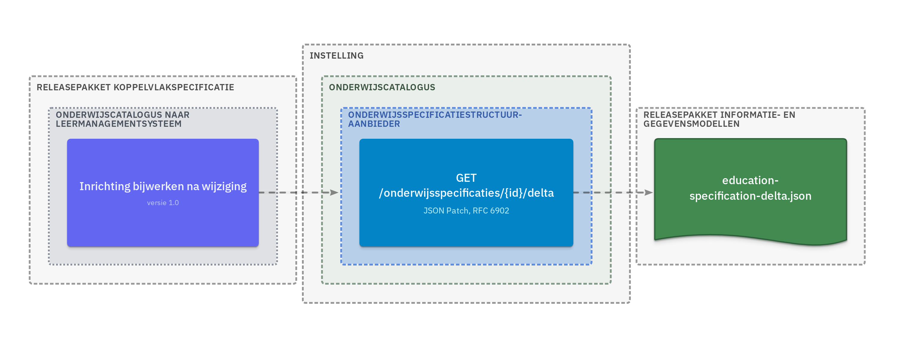

Twee lagen dragen een eigen nummer: het releasepakket en de berichtstroom. De lagen daartussen — de koppeling, de applicatiedienst, het endpoint — hebben er geen, maar bewegen wel mee. Daar zit het gevolg dat de rest van deze paragraaf uitwerkt: **hoe ver een wijziging reikt, hangt af van waar in het bouwwerk zij begint**, en niet van welk bumptype erop geplakt wordt.

De vier platen hierna lopen van de kleinste reikwijdte naar de grootste. Ze zijn getekend op de twee koppelingen uit dit scenario, samen negen berichtstromen; de koppeling naar het studentinformatiesysteem telt niet mee.

### Vertrekpunt: een berichtstroom

**Diagram 7 — Een wijziging in één berichtstroom.**

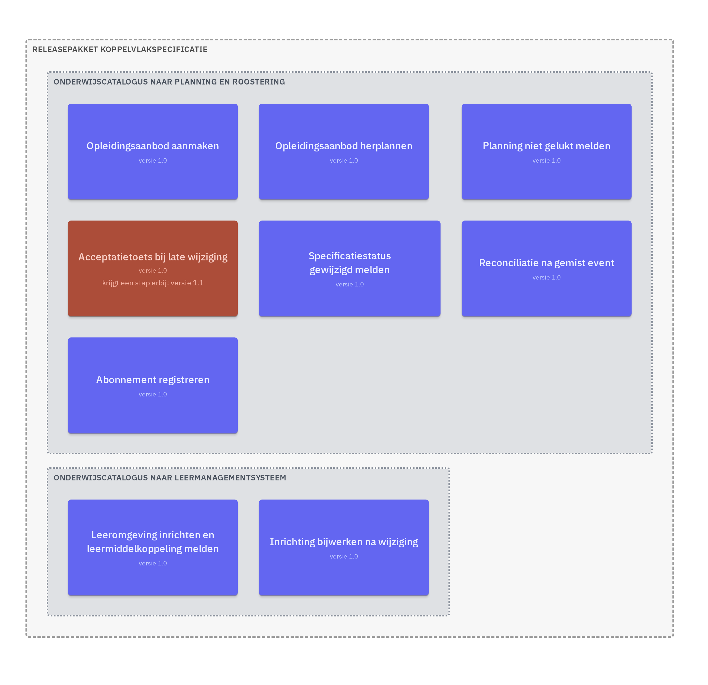

Een extra stap in `Acceptatietoets bij late wijziging` raakt die ene stroom en verder niets: de dienst, het endpoint en het schema blijven, en de acht andere stromen ook. De stroom gaat naar `versie 1.1`, het pakket krijgt een minor, en geen enkele afnemer die deze stroom niet implementeert merkt er iets van. Dit is waar de modulariteit zijn werk doet.

### Vertrekpunt: een applicatiedienst

**Diagram 8 — Een wijziging in een applicatiedienst.**

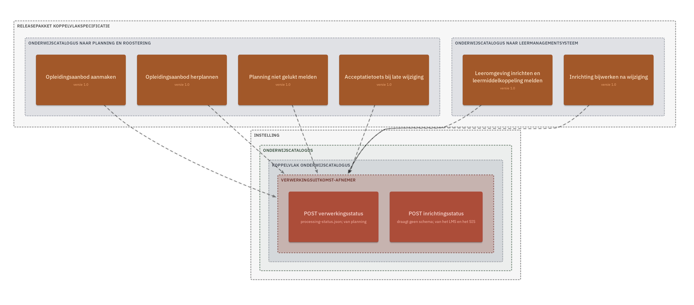

Dit is de wijziging die in [§5](#5-de-wijziging-en-waarom-die-breekt) is doorgerekend, nu gezien vanuit het bouwwerk. Het hernoemen van de twee endpoints van `verwerkingsuitkomst-afnemer` raakt zes van de negen berichtstromen, verdeeld over beide koppelingen. De dienst zelf staat op één plek, maar wordt op zes plekken ingezet, en dat is de reden dat een ogenschijnlijk kleine wijziging de hele keten aangaat.

### Vertrekpunt: een interactiepatroon

**Diagram 9 — Een wijziging in een interactiepatroon.**

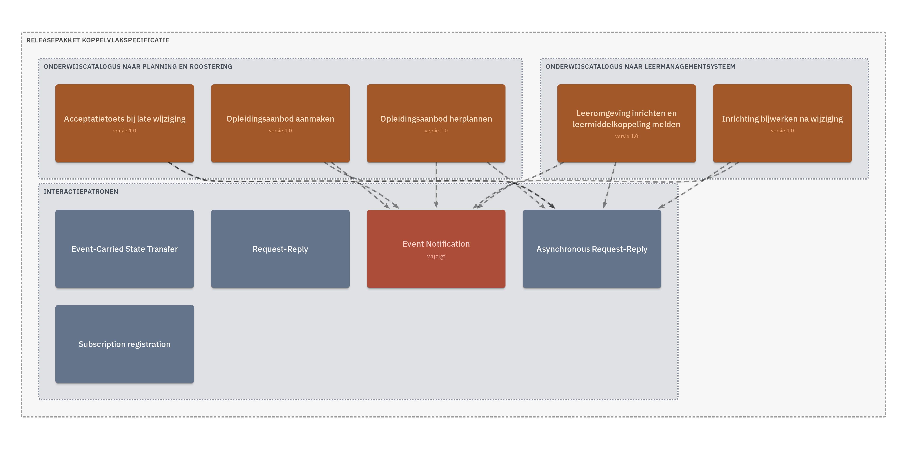

Een patroon wordt over koppelingen heen hergebruikt. Event Notification zit onder vijf van de negen stromen, dus een wijziging daar raakt beide koppelingen zonder dat er één endpoint of één schema verandert. Dat maakt hem verraderlijk: er is niets aan het contract te zien, terwijl het gedrag van vijf stromen verschuift.

### Vertrekpunt: een schema

**Diagram 10 — Een wijziging in een schema.**

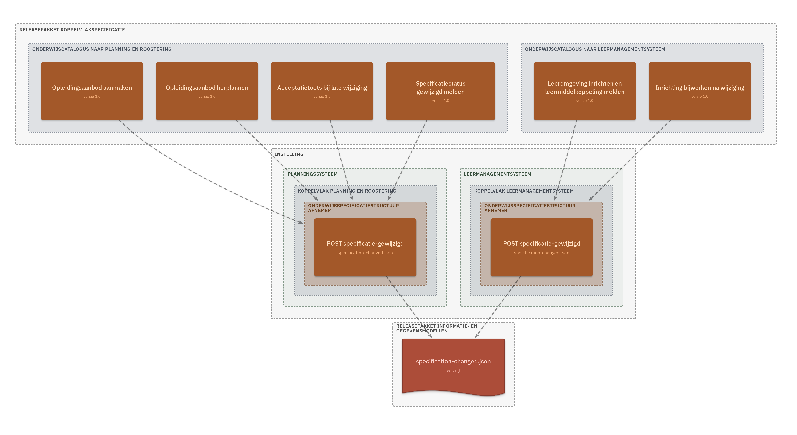

Een schema staat onder meerdere endpoints, die onder meerdere diensten hangen, die door meerdere stromen worden ingezet. `specification-changed.json` staat onder het `specificatie-gewijzigd`-endpoint van zowel planning als het leermanagementsysteem, en raakt daarmee zes stromen in twee koppelingen. Bovendien komt de wijziging uit het andere releasepakket, dus zij passeert ook nog de afhankelijkheid in `release.json`.

### De reikwijdte naast elkaar

| Vertrekpunt | Endpoints | Applicatiediensten | Berichtstromen | Koppelingen |
|---|---|---|---|---|
| Berichtstroom | — | — | 1 van 9 | 1 van 2 |
| Interactiepatroon | — | — | 5 van 9 | 2 van 2 |
| Applicatiedienst | 2 | 1 | 6 van 9 | 2 van 2 |
| Schema | 2 | 2 | 6 van 9 | 2 van 2 |

Twee dingen vallen daaraan op. Alle vier de vertrekpunten kunnen dezelfde major opleveren, terwijl de onderste drie een veelvoud raken van wat de bovenste raakt. Dat is geen tekortkoming van het versienummer — dat signaleert een compatibiliteitsklasse en niet meer — maar van de eenheid waaraan het hangt: het pakket beweegt bij elke release mee, dus zijn nummer zegt een afnemer niet of híj geraakt wordt.

De berichtstroom heeft wél de goede maat, want een afnemer implementeert stromen en geen pakketten. Wie de versies van zijn eigen stromen vergelijkt, weet meteen of hij aan de beurt is; wát er dan veranderd is, leest hij in het verschil tussen de twee tags, dat het releasebeleid juist bewust mogelijk maakt.

## 5. De wijziging en waarom die breekt

De wijziging waarmee hier wordt gerekend is geen bedachte: het is een keuze die in de specificatie openstaat. Hetzelfde bericht heet `specificatie-planbaar` bij het planningssysteem en `specificatie-beschikbaar` bij het leermanagementsysteem, en de uitkomst van een verwerking heet `verwerkingsstatus` bij de een en `inrichtingsstatus` bij de ander; beide dienstpagina's noteren dat de voorgestelde naam nog niet is vastgesteld ([onderwijsspecificatiestructuur-afnemer](Applicatiediensten/onderwijsspecificatiestructuur-afnemer.md), [verwerkingsuitkomst-afnemer](Applicatiediensten/verwerkingsuitkomst-afnemer.md)). Zolang niemand bouwt kost beslechten niets; zodra er koppelvlakken draaien breekt het bestaande aanroepen. Dat maakt hem geschikt om het beleid mee te toetsen: hij is klein genoeg om te volgen en raakt toch alle drie de partijen.

Twee change requests komen samen in één release. Het eerste beslecht de naamkeuze: de melding dat een specificatie klaarstaat heet voortaan overal `specificatie-beschikbaar`, en de uitkomst van een verwerking heet overal `verwerkingsuitkomst`. Het tweede voegt een optioneel veld toe aan [education-specification.json](../Informatie-en-gegevensmodellen/schemas/education-specification.json).

Het hernoemen van een endpoint breekt bestaande aanroepen en is daarmee een major. Het optionele veld breekt niemand: het schema zet `additionalProperties` niet, dus een afnemer die het veld niet kent valideert nog steeds en negeert het. Dat is een minor. Omdat de zwaarste wijziging de bump van het hele pakket bepaalt, gaat de koppelvlakspecificatie naar `v2.0.0` en de informatie- en gegevensmodellen naar `v1.1.0` — twee pakketten, twee bumps, één release.

Op bouwblokniveau, in de termen van [§4](#4-waar-een-versie-zit), raakt de hernoeming drie endpoints op twee applicatiediensten: `specificatie-planbaar` op `onderwijsspecificatiestructuur-afnemer`, en `verwerkingsstatus` en `inrichtingsstatus` op `verwerkingsuitkomst-afnemer`. Zes van de negen berichtstromen gebruiken een van die drie en bewegen dus mee, verdeeld over beide koppelingen: `Opleidingsaanbod aanmaken`, `Opleidingsaanbod herplannen`, `Planning niet gelukt melden`, `Acceptatietoets bij late wijziging`, `Leeromgeving inrichten en leermiddelkoppeling melden` en `Inrichting bijwerken na wijziging`. Elk van die zes gaat naar `versie 2.0`; de drie andere blijven op `1.0`.

Let op het verschil met diagram 8, dat de reikwijdte van de dienst als geheel toont. `Specificatiestatus gewijzigd melden` zet `onderwijsspecificatiestructuur-afnemer` óók in, maar alleen via `specificatie-status-gewijzigd`, en die naam verandert niet. Op dienstniveau zijn er dus zeven stromen in beeld en op endpointniveau zes. Hoe fijnmaziger je kijkt, hoe kleiner de reikwijdte, en dat verschil is precies wat een afnemer wil weten: wie alleen `Abonnement registreren` en `Reconciliatie na gemist event` implementeert, hoeft bij deze major niets te doen.

De keuze om te hernoemen is niet de goedkoopste. Je kunt de drie namen laten staan: dat breekt niemand, maar elke nieuwe afnemer moet dan te horen krijgen welke van de drie namen voor hém geldt, en de dienstpagina blijft een contract met drie gezichten. Je kunt de oude naam ook eerst als vervallen markeren en pas in een volgende major verwijderen: dat verkort de onderbreking bij de afnemer, maar verlengt de periode waarin de aanbieder twee paden onderhoudt. Hier wint begrijpelijkheid van het contract, en de prijs is een migratie die drie leveranciers raakt en die de traagste van de drie bepaalt.

Eén ding maakt deze major mild, en dat is de moeite waard om te benoemen omdat het niet voor elke major geldt. Een hernoemd endpoint is een nieuw pad naast het oude; een aanbieder kan beide tegelijk serveren zonder dat de een de ander in de weg zit. Een major die de payload breekt heeft die uitweg niet, want daar draagt hetzelfde pad twee onverenigbare vormen. De koppelvlakspecificatie legt niet vast hoe je in dat geval twee majors tegelijk aanspreekt (zie [§12](#12-houdt-de-huidige-manier-van-versioneren-stand)).

## 6. Stap voor stap: de release

Deze paragraaf gaat over de kant van de uitgever, en staat hier om twee redenen. In dit proces valt het besluit dat de bump een major is, en daar hangt alles aan wat de afnemers daarna moeten doen. En het levert de release notes op: het enige wat de drie leveranciers in handen krijgen, want zij lezen geen branches mee.

Diagram 11 volgt de twee change requests tot op de release branches, met de rollen uit het [releaseproces](../Algemeen/release-management/Release-management-algemeen.md#6-releaseproces).

**Diagram 11 — Van change request naar de release branches.**

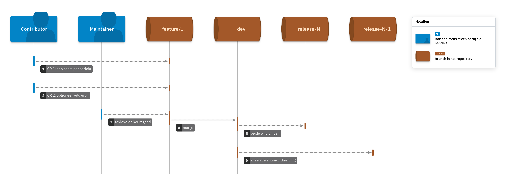

De contributor dient beide wijzigingen in op een feature branch en stelt per change request de bump voor. De maintainer reviewt en keurt goed, waarna de feature branch naar `dev` merget. Vanaf `dev` gaan beide wijzigingen naar release branch N, maar naar release branch N-1 gaat alleen de enum-uitbreiding: op de vorige major landt geen breaking change, dat is precies waar die tweede branch voor is.

Diagram 12 loopt door tot de gepubliceerde release.

**Diagram 12 — Van baseline naar gepubliceerde release.**

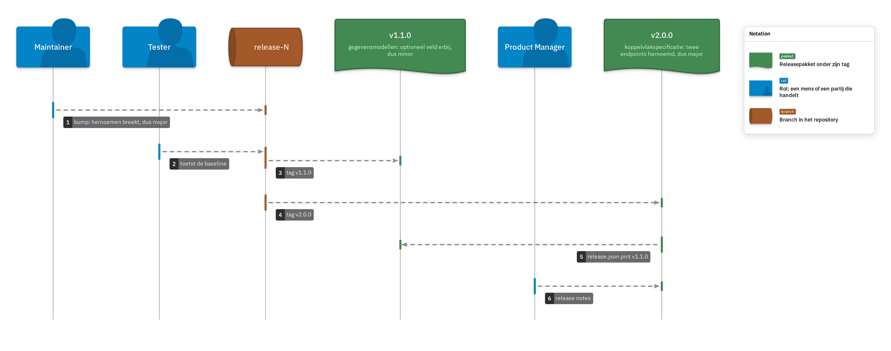

De maintainer bepaalt de bump voor het pakket als geheel en controleert de afhankelijkheid. De tester toetst de baseline op beide release branches aan de kwaliteitsrichtlijnen. Daarna krijgen beide pakketten hun tag, `informatie-en-gegevensmodellen-v1.1.0` en `koppelvlakspecificatie-v2.0.0`, en legt `release.json` van het tweede vast op welke versie van het eerste het bouwt. De product manager publiceert de release notes met een migratieparagraaf langs de standaardroute.

Die migratieparagraaf is het enige wat de drie leveranciers straks in handen hebben, en hij moet daarom per tegenpartij zeggen wat er verandert. Voor de catalogus is dat iets anders dan voor het planningssysteem, en voor het leermanagementsysteem weer iets anders.

## 7. Stap voor stap: de adoptie

De catalogus en het planningssysteem halen allebei de eerstvolgende kwartaalrelease. Diagram 13 volgt die twee.

**Diagram 13 — Adoptie: de catalogus en het planningssysteem.**

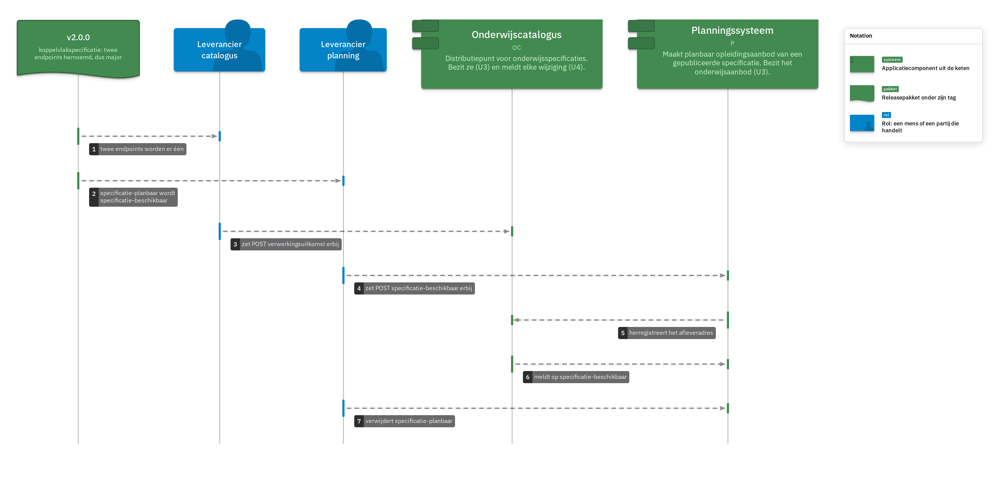

De leverancier van de catalogus zet `POST verwerkingsuitkomst` naast de twee bestaande endpoints en laat die twee staan. De catalogus draagt daarmee beide majors tegelijk. Zolang het planningssysteem nog op `v1.0.0` staat blijft de catalogus het daar ook op de oude naam melden; ze kan pas overschakelen als de tegenpartij het nieuwe endpoint aanbiedt.

Het planningssysteem zet in dezelfde ronde `POST specificatie-beschikbaar` naast `POST specificatie-planbaar`, verlegt zijn eigen uitkomstmelding naar `POST verwerkingsuitkomst`, en herregistreert zijn afleveradres op `POST /abonnementen` bij de catalogus. De catalogus doet hetzelfde de andere kant op, want ook haar callback-URL voor de uitkomst verandert. Pas daarna meldt de catalogus op de nieuwe naam en kan het planningssysteem het oude endpoint verwijderen.

Het leermanagementsysteem kan niet mee. Diagram 14 laat zien wat dat betekent.

**Diagram 14 — Adoptie: het leermanagementsysteem.**

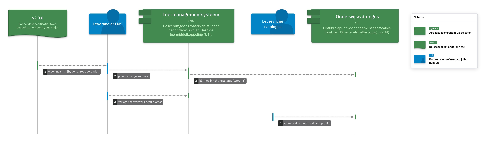

Zijn eigen endpoint draagt de vastgestelde naam al, dus aan de aanbiedende kant verandert er niets; alleen de aanroep naar de catalogus moet van `inrichtingsstatus` naar `verwerkingsuitkomst`. Die eenregelige wijziging komt niettemin pas in de halfjaarrelease vrij, en tot die tijd blijft het systeem op `latest-1` melden. De catalogus houdt daarom beide oude endpoints in de lucht tot die release is uitgerold. Dat de wijziging klein is, maakt haar niet snel: het tempo wordt gezet door de releasekalender, niet door de omvang van de aanpassing.

De catalogus ruimt pas op als de laatste afnemer over is. Op dat moment vervallen `POST verwerkingsstatus` en `POST inrichtingsstatus`, en staat de keten volledig op `v2.0.0`.

## 8. Impact per systeem

Diagram 15 en 16 tonen de toestand tijdens het venster, per koppeling: welke endpoints er op dat moment naast elkaar in de lucht zijn, en welke van de twee majors elke melding aanspreekt. Rood is wat vervalt, groen is wat de nieuwe major meebrengt.

**Diagram 15 — Migratievenster: de catalogus en het planningssysteem.**

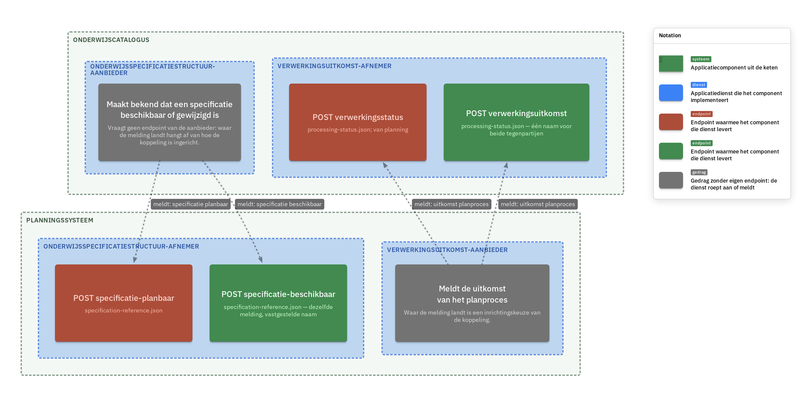

**Diagram 16 — Migratievenster: de catalogus en het leermanagementsysteem.**

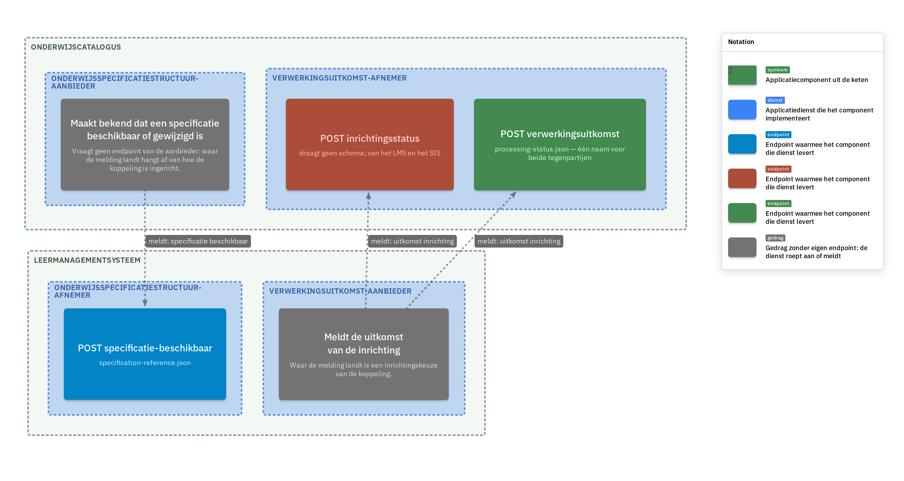

Het verschil tussen de twee platen is de kern van dit scenario. In de koppeling met planning dragen beide partijen tijdelijk twee endpoints voor hetzelfde bericht; in de koppeling met het leermanagementsysteem alleen de catalogus, omdat het endpoint aan de andere kant zijn naam houdt.

Diagram 17 zet daar de versielijnen naast: welk systeem welke versie van het pakket implementeert zodra planning is overgestapt en het leermanagementsysteem nog wacht.

**Diagram 17 — Na de bump: twee majors tegelijk in de lucht.**

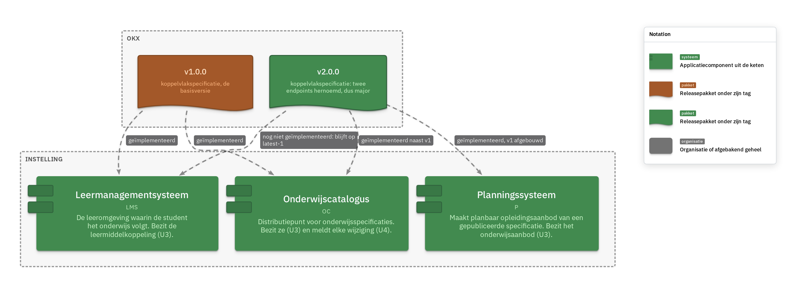

Dezelfde release levert drie verschillende rekeningen op.

| | Onderwijscatalogus | Planningssysteem | Leermanagementsysteem |
|---|---|---|---|
| **Aanbiedende kant** | Twee endpoints worden er één; beide oude blijven staan tot de laatste afnemer over is | `specificatie-planbaar` wordt `specificatie-beschikbaar` | Ongewijzigd: het endpoint droeg de vastgestelde naam al |
| **Aanroepende kant** | Meldt aan planning voortaan op `specificatie-beschikbaar`, per tegenpartij afhankelijk van diens versie | Meldt de uitkomst op `verwerkingsuitkomst` | Meldt de uitkomst op `verwerkingsuitkomst` |
| **Abonnement** | Herregistreert bij planning; verwijdert het oude abonnement | Herregistreert bij de catalogus; verwijdert het oude abonnement | Geen abonnement in deze koppeling: bilaterale afspraak over het afleveradres |
| **Doorlooptijd** | Twee kwartaalreleases: toevoegen en later opruimen | Eén kwartaalrelease | Eén halfjaarrelease |
| **Zwaarste last** | Onderhoudt beide majors gedurende het hele venster | Twee endpoints tegelijk aanbieden tijdens de overgang | Wacht, en houdt daarmee het venster van de catalogus open |

De last valt daarmee niet waar de wijziging vandaan komt. De catalogus verandert het minst aan haar eigen betekenis en draagt de langste onderhoudsperiode, omdat zij de enige is die met beide afnemers tegelijk praat. Het leermanagementsysteem heeft de kleinste aanpassing en bepaalt toch wanneer het venster sluit.

### Wat de migratie droeg

De rekening viel te betalen, en dat is geen toeval. Vijf eigenschappen van de specificatie maakten deze major draagbaar; zonder elk daarvan was dezelfde wijziging een stilstand geworden.

| Wat het droeg | Wat er zonder was gebeurd |
|---|---|
| Een hernoemd endpoint is een nieuw pad naast het oude, dus de aanbieder kan beide majors tegelijk serveren | De catalogus had moeten kiezen tussen planning en het leermanagementsysteem, en één van de twee lag stil |
| Release branch N-1 draagt wat niet breekt | Het leermanagementsysteem had het nieuwe veld pas een halfjaar later gekregen, alleen omdat het op de vorige major zat |
| Het schema zet `additionalProperties` niet | Elk nieuw veld was een major geweest, en de specificatie uitbreiden had de hele keten in beweging gezet |
| Elke berichtstroom draagt een eigen versie | Drie van de negen stromen bewogen nu niet mee; zonder dat onderscheid had elke afnemer de hele release moeten beoordelen |
| Het afleveradres is geregistreerd in plaats van vastgelegd in code ([afleverabonnement](Applicatiediensten/afleverabonnement-aanbieder.md)) | Het verleggen van een melding was een codewijziging bij beide partijen geweest in plaats van een registratie |

Daar komt bij dat het bericht en het kanaal gescheiden zijn ([U5](uitgangspunten.md#u5-bericht-versus-kanaal)), en dat een melding alleen een verwijzing draagt en niet de inhoud ([U4](uitgangspunten.md#u4-event-notification)). Daardoor bleef deze major beperkt tot namen: er hoefde geen schema mee, en geen infrastructuur.

## 9. Wanneer niet iedereen meegaat

Het verloop tot hier is de gunstigste vorm: iedereen gaat over, alleen niet tegelijk. Een instelling moet zich op de andere vormen voorbereiden.

Eerst een correctie op de vraag. Een systeem draait geen versie; een **koppeling** draait een versie. De catalogus is tijdens het venster tegelijk `v2` richting planning en `v1` richting het leermanagementsysteem, en dat is de normale toestand van een component dat met meer dan één tegenpartij praat. De vraag is dus niet welke versie een systeem draait, maar welke versie elk paar spreekt. Per koppeling zijn er vier toestanden.

| Aanbieder | Afnemer | Werkt het | Wat het draagt |
|---|---|---|---|
| `v1` | `v1` | Ja | Het uitgangspunt; niemand heeft iets gedaan |
| `v2` | `v1` | Ja | De aanbieder serveert beide paden en meldt aan deze tegenpartij nog op de oude naam |
| `v2` | `v2` | Ja | De eindtoestand; de aanbieder mag het oude pad opruimen zodra geen tegenpartij het meer gebruikt |
| `v1` | `v2` | **Nee** | De afnemer roept een endpoint aan dat de aanbieder nog niet heeft |

### De enige volgorde die niet werkt

Diagram 18 loopt de vierde rij af. De afnemer doet precies wat de release notes vragen, en juist daardoor breekt de koppeling.

**Diagram 18 — Een afnemer die eerder overstapt dan zijn aanbieder.**

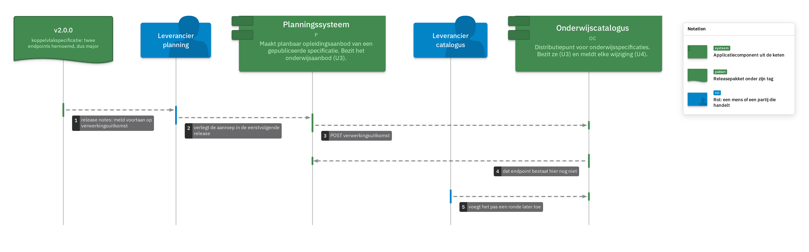

Daaruit volgt een regel die het beleid nergens uitspreekt: **de aanbieder gaat eerst**. In [§7](#7-stap-voor-stap-de-adoptie) gaat dat goed omdat de catalogus en het planningssysteem in dezelfde kwartaalronde zitten en de catalogus toevoegt zonder weg te halen. Vallen die rondes anders, dan is dat geen detail maar een voorwaarde.

### De afnemer gaat niet mee

De leverancier van het leermanagementsysteem kan besluiten `v2` over te slaan. Dat is geen nalatigheid: zijn eigen endpoint heette al goed, de enige wijziging is een aanroep die vandaag werkt, en daar zet een leverancier zelden capaciteit op. Diagram 19 toont de toestand die dan blijft staan.

**Diagram 19 — De afnemer gaat niet mee: het venster sluit niet uit zichzelf.**

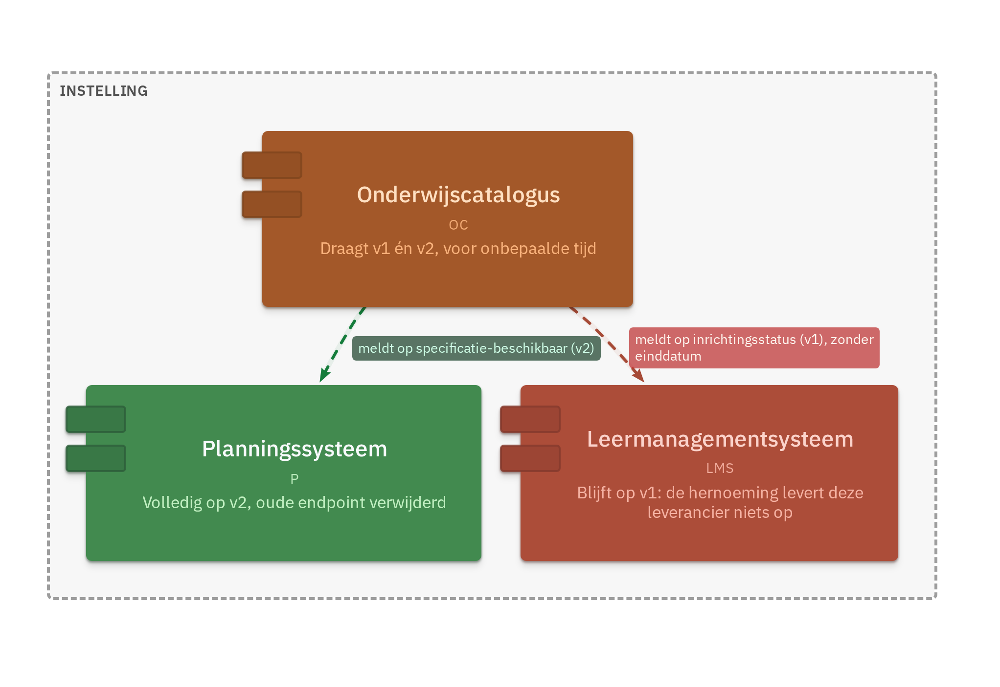

De catalogus draagt het oude pad voor onbepaalde tijd, en de toezegging van hoogstens twee gelijktijdige majors hangt daarmee op één leverancier. De instelling heeft twee uitwegen, geen van beide in de specificatie belegd: bij de aankondiging een termijn afspreken waarbinnen elke afnemer over is, of accepteren dat deze koppeling op `v1` bevriest en hem behandelen als bilaterale afspraak buiten de standaard — met als prijs dat de catalogus een pad onderhoudt dat nergens meer beschreven staat.

### De aanbieder loopt achter

Loopt de aanbieder achter in plaats van een afnemer, dan heeft dat een andere vorm. Diagram 20 zet die naast de vorige.

**Diagram 20 — De aanbieder loopt achter: geen enkele afnemer kan over.**

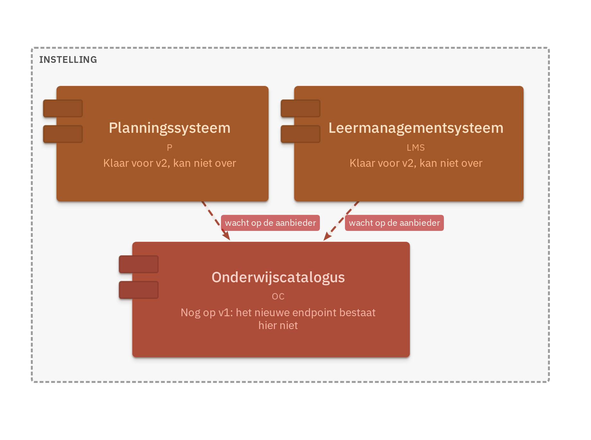

Een achterblijvende afnemer houdt één koppeling op `v1`; een achterblijvende aanbieder houdt ze allemaal tegen, want niemand kan overstappen naar een endpoint dat nog niet bestaat. De catalogus is in beide koppelingen de aanbieder, dus haar releasekalender is het plafond voor de hele keten. Voor de doorlooptijd van een migratie betekent dat: de aanbieder bepaalt wanneer het kan beginnen, de traagste afnemer wanneer het kan eindigen.

### Een tweede major tijdens het venster

Komt er een volgende major voordat de traagste afnemer de vorige heeft gehaald, dan loopt de keten tegen het ondersteuningsvenster aan.

**Diagram 21 — Een tweede major terwijl er nog een koppeling op de oudste draait.**

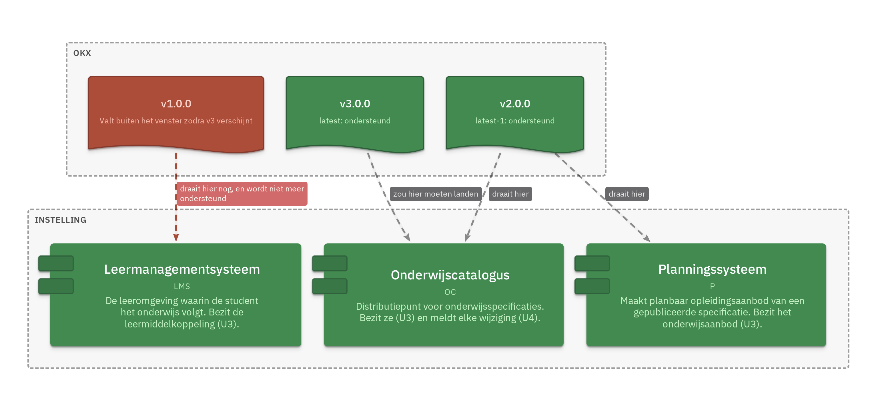

Met *latest* en *latest-1* dragen `v3` en `v2` de ondersteuning en valt `v1` erbuiten, terwijl er nog een koppeling op draait. Er zijn dan drie uitwegen — de aanbieder draagt drie majors en breekt daarmee zijn eigen regel, de koppeling op `v1` breekt, of `v3` wacht — en welke het wordt legt geen document vast ([§12](#12-houdt-de-huidige-manier-van-versioneren-stand)).

## 10. Wat een instelling en een leverancier bijhouden

Voor de instelling is een bump geen gebeurtenis maar een periode. Zij begint bij de release notes en eindigt pas als de traagste leverancier heeft uitgerold, en zolang die periode loopt draaien er twee majors naast elkaar in haar eigen landschap. Om daarop te kunnen sturen moet zij vier dingen van haar eigen keten weten; geen daarvan staat in de specificatie, want het zijn eigenschappen van haar implementatie en niet van de standaard.

| Wat zij bijhoudt | Waarom zij dat nodig heeft |
|---|---|
| Welke versie van het releasepakket elk systeem implementeert | Zonder dat is niet vast te stellen of het migratievenster nog open moet blijven, en dus ook niet wanneer de aanbieder mag opruimen |
| Welke endpoints elk systeem serveert, en onder welke major | Bepaalt of een tegenpartij al op de nieuwe naam mag melden; de catalogus meldt per tegenpartij op de versie die díe draait |
| Welke afleverabonnementen er geregistreerd staan, met callback-URL en event-type | Een herregistratie op een nieuwe URL maakt een tweede abonnement naast het eerste; zonder dit overzicht merkt niemand de dubbele aflevering ([§12](#12-houdt-de-huidige-manier-van-versioneren-stand)) |
| Wanneer de eerstvolgende release van elke leverancier valt | Dat bepaalt de doorlooptijd van het venster, en niet de omvang van de wijziging |

Waarop zij kan sturen is beperkter dan wat zij moet weten. Technisch valt er weinig te versnellen: een leverancier die twee keer per jaar uitrolt gaat dat voor één hernoemde aanroep niet vaker doen. Wat zij wél in de hand heeft is het moment waarop zij het weet. Als bij de aankondiging van de major duidelijk is welke leverancier de traagste is en wanneer diens release valt, dan is de einddatum van het venster op dag één bekend in plaats van achteraf.

Voor een leverancier ligt het anders, en zwaarder. Hij bedient meer dan één instelling, en die stappen niet tegelijk over. Waar een instelling per koppeling één versie bijhoudt, houdt hij per klant een toestand bij, terwijl hij één product uitrolt. Dat maakt "beide majors tegelijk dragen" bij hem geen tijdelijke maatregel maar een eigenschap van zijn release: zolang één klant nog op de oude versie zit, moet die in het product blijven zitten. Het scenario laat dat niet zien omdat het één instelling volgt; de conclusie eruit is wel dat het venster dat een instelling voor zichzelf afspreekt, voor de leverancier het maximum van alle klanten is.

Dat is ook de plek waar het ondersteuningsvenster gaat knellen. De [applicatiediensten](Applicatiediensten/README.md) staan hoogstens twee gelijktijdig actieve majors toe. Zolang er één bump loopt is dat ruim; komt er een tweede major voordat de traagste afnemer de eerste heeft gehaald, dan moet de instelling kiezen tussen wachten met de nieuwe major of de oudste laten vallen. Die afweging maakt zij alleen op tijd als zij de bovenste twee rijen van de tabel actueel houdt.

## 11. Drie versiesprongen naast elkaar

Een major is het zwaarste geval en daarmee niet het gewone geval. Diagram 22 zet de drie bumptypes naast elkaar; het aantal pijlen is het verhaal.

**Diagram 22 — Wat elke sprong van de partijen vraagt.**

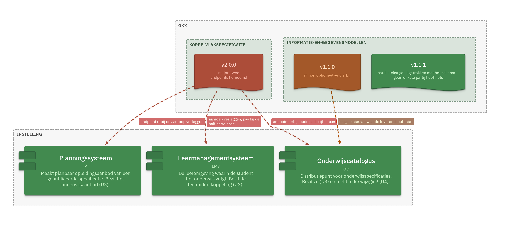

| | Major | Minor | Patch |
|---|---|---|---|
| **Voorbeeld** | Twee endpoints hernoemd naar één naam per bericht | Een optioneel veld erbij in de onderwijsspecificatie | Een parameternaam in de tekst gelijkgetrokken met het schema |
| **Pakket en versie** | `koppelvlakspecificatie-v2.0.0` | `informatie-en-gegevensmodellen-v1.1.0` | `informatie-en-gegevensmodellen-v1.1.1` |
| **Release branch** | Alleen N; op N-1 landt geen breaking change | N én N-1 | N én N-1 |
| **Wie moet iets doen** | Alle drie de systemen, in een vastgelegde volgorde | Alleen wie de nieuwe waarde wil gebruiken | Niemand |
| **Doorlooptijd** | Twee releaseronden bij de aanbieder, plus de kalender van de traagste afnemer | Eén releaseronde, en alleen bij wie hem wil | Geen |
| **Communicatie** | Release notes met migratieparagraaf per tegenpartij | Release notes: wat er bij komt en dat er niets breekt | Release notes langs dezelfde route, zonder actie |

### De major: twee endpoints hernoemd

Dit is het geval dat [§5](#5-de-wijziging-en-waarom-die-breekt) tot en met [§10](#10-wat-een-instelling-en-een-leverancier-bijhouden) uitwerken. Kern: het contract verandert, elke partij moet iets, en de volgorde waarin dat gebeurt is een voorwaarde en geen detail. De aanbieder draagt beide paden totdat de laatste afnemer over is, en de laatste afnemer bepaalt daarmee hoe lang dat duurt.

### De minor: een optioneel veld erbij

[education-specification.json](../Informatie-en-gegevensmodellen/schemas/education-specification.json) zet `additionalProperties` niet. Een afnemer die tegen dat schema valideert accepteert daardoor een veld dat hij niet kent, en negeert het. Een optioneel veld toevoegen breekt dus niemand, en het landt daarom ook op release branch N-1: een afnemer die op de vorige major blijft krijgt het gewoon mee.

Wat er in de keten gebeurt is bijna niets. De catalogus mág het veld vullen zodra haar leverancier het ondersteunt. Planning en het leermanagementsysteem hoeven niets: zij lezen wat zij kennen en laten de rest staan. Er is geen migratievenster, geen herregistratie en geen volgorde tussen aanbieder en afnemer.

Niet elke toevoeging aan een schema is echter zo goedkoop, en het verschil zit in het schema zelf. Naast open lijsten — `programmatype`, `doelgroep`, `keuzedeelKlasse` en `tijdsverdeling` zijn getypeerd als `string` met de toegestane waarden in een `$comment` — staan gesloten enumeraties: `specificatieType`, `status`, `curriculumtype`, `programmaLaag` en `leerweg` zijn een echte `enum`. Bij een open lijst is een waarde erbij een tekstwijziging en verder niets. Bij een gesloten enumeratie wijzigt het schema, en een afnemer die daartegen valideert wijst de nieuwe waarde af.

Dat botst met de algemene releaseregels, die een nieuwe enum-waarde zonder voorbehoud een minor noemen. Voor de vier open lijsten klopt dat; voor de vijf gesloten enumeraties niet. Welke van de twee vormen een veld krijgt, is daarmee een versioneringsbesluit en niet alleen een modelleerkeuze ([§12](#12-houdt-de-huidige-manier-van-versioneren-stand)).

### De patch: een correctie zonder contractwijziging

De endpointtabel bij [planbaar-onderwijsaanbod-aanbieder](Applicatiediensten/planbaar-onderwijsaanbod-aanbieder.md) noemt de parameters van `GET /onderwijsaanbod`. Staat daar een parameternaam anders gespeld dan in het schema, dan is dat een fout in de tekst. Hem gelijktrekken verandert het contract niet, want het schema was al leidend. Patch, en niemand hoeft iets.

Daar zit wel een val in die het onderscheid scherp maakt. Bij een verschil tussen de tekst en het schema hangt het bumptype af van welke kant je corrigeert. Pas je de tekst aan het schema aan, dan is het een patch. Pas je het schema aan de tekst aan, dan wijzigt het contract en is het, afhankelijk van de wijziging, een minor of een major. Dezelfde waarneming levert dus drie verschillende releases op, en welke het wordt is een besluit en geen constatering.

## 12. Houdt de huidige manier van versioneren stand?

Dit is de tweede vraag uit [§1](#1-inleiding). Het scenario heeft zeven regels uit het beleid in werking gezet; de tabel zegt per regel wat ervan bleek.

| Regel | Getoetst | Uitkomst |
|---|---|---|
| MAJOR is breaking, MINOR additief, PATCH een correctie | Ja, alle drie | Houdt. Het onderscheid liet zich in elk van de drie gevallen maken |
| Eén release, één bumptype: de zwaarste wint | Ja | Houdt. Wel zegt het pakketnummer een afnemer niet of híj geraakt wordt, want het beweegt bij elke release mee ([§4](#4-waar-een-versie-zit)) |
| Naar release branch N-1 gaat alleen wat niet breekt | Ja | Houdt. De enum-uitbreiding landde op beide branches, de hernoeming alleen op N |
| Een release ligt vast onder een tag, met release notes langs de standaardroute | Ja | Houdt, met één kanttekening: de migratieparagraaf moet per tegenpartij verschillen en het format zegt daar niets over |
| De verhouding tussen de versienummers van afhankelijke pakketten wordt expliciet vastgelegd | Ja | **Niet nagekomen.** `release.json` pint een versie maar legt geen regel vast |
| Hoogstens twee gelijktijdig actieve majors | Ja | Houdt zolang iedereen meegaat, en verder niet ([§9](#9-wanneer-niet-iedereen-meegaat)) |
| Ondersteuning voor *latest* en *latest-1* | Deels | Onbeslist. Het scenario komt niet aan een derde major toe; wat er dan moet gebeuren legt geen document vast |

Het antwoord is daarmee: ja voor het gewone geval, en de knelpunten gaan niet over de regels zelf maar over wat eromheen niet is geregeld. Zeven punten geven het beleid geen antwoord waar een instelling of leverancier er wel een nodig heeft. Ze staan hier als vaststelling, niet als voorstel.

**Een abonnement kun je niet intrekken.** De dienst [afleverabonnement-aanbieder](Applicatiediensten/afleverabonnement-aanbieder.md) draagt één endpoint, `POST /abonnementen`. De koppelingspecificatie legt vast dat herregistratie op dezelfde callback-URL plus event-type overschrijft en dus idempotent is. Verandert de URL, zoals bij deze bump, dan ontstaat er een tweede abonnement naast het eerste en levert de aanbieder dezelfde melding twee keer af. Hoe je het oude abonnement opruimt is niet vastgelegd.

**Twee majors tegelijk aanspreken is niet belegd.** De [applicatiediensten](Applicatiediensten/README.md) stellen dat er hoogstens twee majors tegelijk actief zijn, en de algemene releaseregels houden daarvoor twee release branches aan. Hoe een afnemer die twee majors onderscheidt staat nergens: niet in het pad, niet in een header, niet in het abonnement. Bij een hernoemd endpoint lost het zichzelf op, omdat de twee majors verschillende paden dragen. Bij een breaking wijziging in de payload is dat niet zo.

**De verhouding tussen de twee pakketten is niet vastgelegd.** De algemene regels schrijven voor dat je expliciet vastlegt hoe de versienummers van een pakket en zijn afhankelijkheid zich verhouden, en noemen als bruikbaar patroon dat het afhankelijke pakket de MAJOR van het andere deelt. In dit scenario lopen ze uiteen: de koppelvlakspecificatie gaat naar `2.0.0` terwijl de informatie- en gegevensmodellen binnen `1.x` blijven. Dat is verdedigbaar, want er wijzigt geen schema. Had je het patroon wel toegepast, dan had een naamswijziging in de endpoints een major op de gegevensmodellen afgedwongen zonder dat er één schema veranderde. `release.json` pint vandaag een versie, maar legt geen regel vast; welke van de twee geldt, is een keuze die nog niet is gemaakt.

**Er is geen termijn.** Het venster sluit in dit scenario zodra de traagste leverancier heeft uitgerold. Welke termijn daarvoor staat, en wat er gebeurt als een partij die termijn niet haalt of er bewust niet aan begint, legt geen document vast. Dat maakt de toezegging van hoogstens twee gelijktijdige majors afhankelijk van de goede wil van elke afzonderlijke leverancier: één afnemer die niet meegaat houdt de oudste major onbeperkt in de lucht, en bij een volgende major moet iemand kiezen tussen wachten, de oudste laten vallen en een derde major dragen. Die drie uitwegen staan uitgewerkt in [§9](#9-wanneer-niet-iedereen-meegaat).

**Een partij kan niet uitdrukken wat zij ondersteunt.** De specificatie beschrijft wat een component kán implementeren; zij kent geen vorm waarin een component vastlegt wat het feitelijk ondersteunt. De [applicatiecomponentpagina](Applicatiecomponenten/README.md) noemt de applicatiediensten die een component claimt, maar niet welke berichtstromen het draait en op welke versie, terwijl dat de eenheid is waarin twee partijen elkaar moeten vinden. Een dienst claimen zegt weinig: een component kan `onderwijsspecificatiestructuur-afnemer` implementeren en toch maar twee van de vier stromen ondersteunen die die dienst inzetten.

Het begrip bestaat al half. De [gebruiksprofielen](../Informatie-en-gegevensmodellen/gebruiksprofielen.md) leggen per koppeling vast welke onderdelen van de payload meegaan — een profiel dus, maar een die OKx voorschrijft en niet een die een implementerende partij afgeeft. Wat ontbreekt is de tegenhanger: een ondersteuningsprofiel waarin een component zegt welke stromen het draait, op welke versie, en welke niet.

Zonder die vorm is er geen manier om vooraf vast te stellen of twee partijen kunnen koppelen, en ook geen manier om te controleren of de toezegging van hoogstens twee gelijktijdige majors wordt gehaald. In dit scenario valt dat niet op, omdat één instelling drie leveranciers kent en het onderling afstemt. Een leverancier die tien instellingen bedient kan zich dat niet veroorloven: hij moet per klant weten wat er draait, terwijl hij één product uitrolt en er niets is om dat in uit te drukken.

**Het versienummer van een berichtstroom hangt nergens aan vast.** Elke berichtstroom draagt een eigen versie, vandaag overal `1.0`. Wat er gebeurt als er één naar `1.1` gaat, legt geen document vast: of het pakket dan een minor krijgt, of een afnemer mag zeggen dat hij stroom X op `1.0` implementeert terwijl het pakket op `2.0.0` staat, en of twee versies van dezelfde stroom naast elkaar mogen bestaan. Dat is jammer, want [§4](#4-waar-een-versie-zit) laat zien dat de berichtstroom de bruikbaarste eenheid is om reikwijdte in uit te drukken: een afnemer implementeert stromen, geen pakketten.

**Een nieuwe enum-waarde is niet altijd een minor.** De algemene regels noemen een nieuwe enum-waarde als voorbeeld van een minor. Dat gaat op voor de velden die als open lijst zijn gemodelleerd, en niet voor de velden die een echte `enum` dragen: daar wijzigt het schema en wijst een validerende afnemer de nieuwe waarde af. Beide vormen staan naast elkaar in hetzelfde object van [education-specification.json](../Informatie-en-gegevensmodellen/schemas/education-specification.json), vier open lijsten tegen vijf gesloten enumeraties, zonder dat ergens staat wanneer je welke kiest. Daarmee bepaalt een modelleerkeuze ongemerkt of een latere uitbreiding gratis is of brekend.

**De volgorde tussen aanbieder en afnemer staat nergens.** Een afnemer die eerder overstapt dan zijn aanbieder roept een endpoint aan dat nog niet bestaat, en dat is de enige combinatie van versies die niet werkt ([§9](#9-wanneer-niet-iedereen-meegaat)). De release notes vertellen elke partij wat er voor haar verandert, maar niet dat de aanbieder als eerste moet. Bij koppelingen waarvan de releasekalenders uiteenlopen is dat het verschil tussen een migratie en een storing.

## 13. Conclusie

[§12](#12-houdt-de-huidige-manier-van-versioneren-stand) beantwoordt of het beleid standhoudt. Deze paragraaf zet daar de vraag naast die een instelling of leverancier moet beantwoorden voordat er iets gebeurt: welke wijzigingen kun je verwachten, en hoe hard komen ze aan.

De reikwijdte in de tabel is geteld op het model van dit scenario: twee koppelingen, negen berichtstromen. De kans is een inschatting, geen meting, en berust op drie waarneembare dingen. Het pakket staat op `0.0.1` en het ecosysteem is niet compleet, dus toevoegen is nu de norm. De schema's dragen `alfa` in hun `$comment` en mogen wijzigen zolang de payload niet is vastgesteld. En er staan twee naamkeuzes open, waarvan er één in dit document is doorgerekend. Na `1.0` verschuift dat beeld, en dat is de tweede kanskolom.

| Wijziging | Waar in de structuur | Reikwijdte | Kans in de `0.x`-fase | Kans na `1.0` |
|---|---|---|---|---|
| Tekstcorrectie zonder contractwijziging | Elk document | **Geen.** Niemand hoeft iets | Hoog | Hoog |
| Berichtstroom erbij | Koppelingspecificatie | **Klein.** Alleen wie hem implementeert | Hoog | Middel |
| Applicatiedienst of endpoint erbij | Applicatiedienst | **Klein.** Alleen wie hem claimt | Hoog | Middel |
| Optioneel veld erbij | Schema | **Geen.** `additionalProperties` staat niet, dus een afnemer negeert wat hij niet kent | Hoog | Middel |
| Waarde erbij in een open lijst | Schema | **Geen.** De waarden staan in een `$comment`, het schema wijzigt niet | Middel | Middel |
| Waarde erbij in een gesloten enumeratie | Schema | **Groot.** Het schema wijzigt; een validerende afnemer wijst de waarde af | Middel | Laag |
| Stap erbij in een bestaande berichtstroom | Berichtstroom | **Klein.** 1 van 9 stromen, 1 koppeling | Middel | Laag |
| Endpoint hernoemd of verwijderd | Applicatiedienst | **Groot.** 6 van 9 stromen, beide koppelingen; wel naast elkaar te draaien | Hoog | Laag |
| Veld weg, verplicht gemaakt of type versmald | Schema | **Groot.** 6 van 9 stromen, en geen uitweg om beide majors naast elkaar te serveren | Hoog | Laag |
| Interactiepatroon gewijzigd | Interactiepatroon | **Groot.** 5 van 9 stromen, zonder dat er één endpoint verandert | Laag | Laag |
| Auth-standaard gewijzigd | Auth-standaard | **Maximaal.** Elk endpoint van elk component | Laag | Laag |
| Uitgangspunt gewijzigd | Uitgangspunten | **Maximaal.** Elke koppelingspecificatie | Middel | Laag |

Drie dingen volgen daaruit.

**Kans en reikwijdte lopen nu tegen elkaar in.** De twee wijzigingen met de grootste reikwijdte die zich in een koppeling kunnen voordoen — een endpoint hernoemen en een payload breken — zijn juist nu het waarschijnlijkst, omdat de namen en de schema's nog niet zijn vastgesteld. Na `1.0` draait dat om. De zwaarste periode ligt dus vóór de vaststelling, en dat is precies de periode waarin de eerste partijen al bouwen. Wie nu implementeert, doet er goed aan te beginnen bij de berichtstromen waarvan de endpoints en schema's het minst omstreden zijn.

**De twee met maximale reikwijdte hebben geen migratiepad.** Een wijziging in de auth-standaard of in een uitgangspunt raakt alles tegelijk, en voor geen van beide beschrijft het beleid hoe je dat gefaseerd doet. Ze zijn onwaarschijnlijk, en dat is nu de enige reden dat het geen probleem is.

**De berichtstroom is de eenheid waarin partijen elkaar moeten kunnen vinden.** Niet het bumptype, want dat is voor elk van de vier grote gevallen hierboven een major, en niet het pakketnummer, want dat beweegt bij alles mee. Twee partijen koppelen niet op een pakket maar op een stroom, en de vraag die zij elkaar moeten kunnen stellen is niet "welke release draai jij" maar "welke stromen ondersteun je, en op welke versie". Zolang daar geen vorm voor is, is de tabel hierboven een hulpmiddel om mee te plannen en niet iets wat twee systemen onderling kunnen vaststellen.
