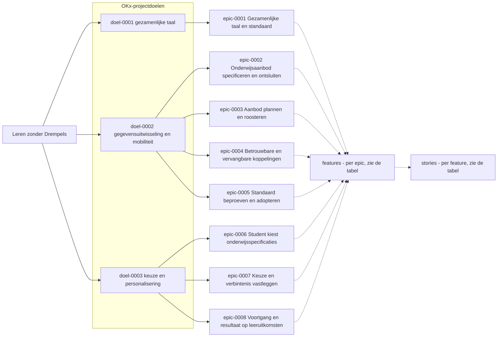
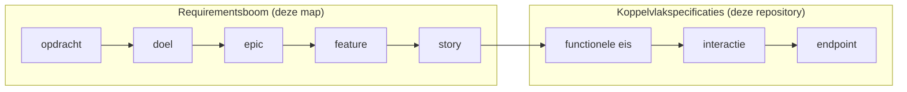

# Requirementsboom

De gelaagde breakdown van de OKx-requirements: van de opdracht (Leren zonder Drempels) via epics en features naar stories, met onderaan de aansluiting op de koppelvlakspecificaties. De boom is de getoonde koppeling tussen business en techniek; elke rij draagt een bron. De bovenste lagen zijn geschreven voor product owner en kernteam, de onderste voor de technische werkgroep en leveranciers; per laag staat het erbij. De boom is opgesteld in de meta-werkomgeving en per [ADR 0025](../adr/0025-requirementsboom-als-koppeling-business-techniek.md) naar deze repository overgeheveld; de bronverwijzingen naar meta zijn gepind op het commit van de overheveling.

## Visualisatie requirementsboom

De plaat toont de opdracht (Leren zonder Drempels), de OKx-projectdoelen en de epics; onder elke epic hangen features en daaronder stories, als twee gestippelde verzamelknopen. De uitwerking per rij staat in de tabellen, uitgelegd in de leeswijzer hieronder. GitHub rendert mermaid zonder klikbare knopen, dus de leeswijzer is de klikroute.

## Requirementsleeswijzer

Elke rij draagt een id om naar te verwijzen (doel-0001, epic-0001, feature-0001, story-0001: plat per soort, voluit met vier cijfers) en een kolom Bron: de context en bronvermelding van die rij. Alle verwijzingen leven in de tabellen zelf, niet in deze leesroute. Systeemafkortingen: OC (onderwijscatalogus), SKS (studentkeuzesysteem), P&R (planning en roostering), SIS (studentinformatiesysteem), LMS (leermanagementsysteem), SVS (studievoortgangsysteem). Bronafkortingen: ADR (architectuurbesluit), U (uitgangspunt), OKx-AP (architectuurprincipe).

### Opdracht en doelen ([opdracht.md](opdracht.md))

- **Wat**: de doelen die vanuit de Npuls-programmacontext (Leren zonder Drempels) aan het project OKx zijn gesteld. Vooral voor product owner en kernteam.
- **Rij**: doel-id, omschrijving, bron; de tabel "Van doel naar epic" is de stap omlaag.

### Epics ([epics.md](epics.md))

- **Wat**: vertalen de doelen naar thema's, bekwaamheden van de keten. Vooral voor product owner en kernteam.
- **Rij**: "Draagt bij aan" = de ouder (het doel) · Features = de stap omlaag · Bron.

### Features ([features.md](features.md))

- **Wat**: één concreet stuk van een thema dat de keten moet kunnen, zoals kiesbaarheid bepalen of specificaties versioneren zonder verwijzingen te breken; per epic een eigen sectie. Vooral voor kernteam en technische werkgroep.
- **Rij**: Epic-cel = de ouder · Stories = de stap omlaag ("geen" = nog niet uitgewerkt) · Bron.

### Stories ([stories.md](stories.md))

- **Wat**: één toetsbare wens van één actor, in één zin ("Als ... wil ik ... zodat ..."). Vooral voor de technische werkgroep en leveranciers.
- **Rij**: Feature-cel = de ouder · Functionele eisen = de brug naar de techniek ("geen" = nog geen eis) · Bron.

## Aansluiting op de techniek

Per koppeling beschrijft een [interactiepatroon](../../Koppelvlakspecificaties/Interactiepatronen) de interacties; interacties hergebruiken vastgestelde patronen. De kolom Functionele eisen van een story linkt naar de rij van de eis in het interactiepatroon; de eis wijst met zijn Story-kolom terug. Het interactieoverzicht somt de interacties op, en de endpointtabellen van de [applicatiecomponenten](../../Koppelvlakspecificaties/Applicatiecomponenten) noemen per endpoint de methode en de interacties die hij draagt. Wie een featureset wil ondersteunen, wordt eigenaar van de bijbehorende endpoints.

## Bijdragen

- Vorm en spelregels staan in de [skill okx-requirements-boom](https://github.com/Npuls-OKx/meta/blob/bd6fc9499b283fe974fd32c87bbb9307e75e7d1b/.agents/skills/okx-requirements-boom/SKILL.md) (gepind). Kern: één document per laag, elke rij één ouder, één bron en een id, overzicht boven volledigheid.
- Elke wijziging haalt de navigatiecontrole: `python3 scripts/validate-requirementsboom-navigatie.py` plus `python3 -m unittest discover -s tests`; beide draaien ook in de CI op elke pull request.
- Een idee of bevinding wordt een issue onder een milestone van deze repository; planningsstatus leeft in milestones en issues, niet in deze tabellen.
- Herkomst en verificatie van elke rij: de [extractieverantwoording](https://github.com/Npuls-OKx/meta/blob/bd6fc9499b283fe974fd32c87bbb9307e75e7d1b/architecture/agent-artifacts/research/20260806_0837_requirementsboom-extractie.md) met de parkeerlijst; oudere documenten gebruiken id-vormen van vóór de hernummering, de [hernummeringstabel](https://github.com/Npuls-OKx/meta/blob/bd6fc9499b283fe974fd32c87bbb9307e75e7d1b/architecture/agent-artifacts/research/20260816_1820_hernummering-requirementsboom.md) vertaalt oud naar nieuw.
- Eis-id's en uitvoerbare scenario's staan bewust niet in de boom; die achtergrondmechaniek volgt gefaseerd, zie de [synthese van het onderzoek](https://github.com/Npuls-OKx/meta/blob/bd6fc9499b283fe974fd32c87bbb9307e75e7d1b/architecture/agent-artifacts/research/20260804_1700_oplossingsrichtingen-business-techniek.md).
- Werkwijze voor branches, issues en review: [CONTRIBUTING](https://github.com/Npuls-OKx/meta/blob/bd6fc9499b283fe974fd32c87bbb9307e75e7d1b/CONTRIBUTING.md) (gepind).

## Scope

Deze map bevat de requirementsboom: de vier laagdocumenten en deze leeswijzer. De boom verwijst naar bestaande documenten en herhaalt ze niet. Al het overige valt buiten scope.
